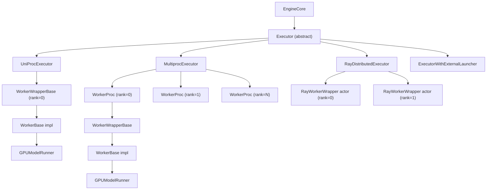
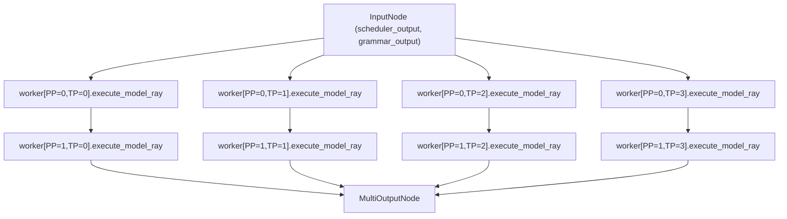
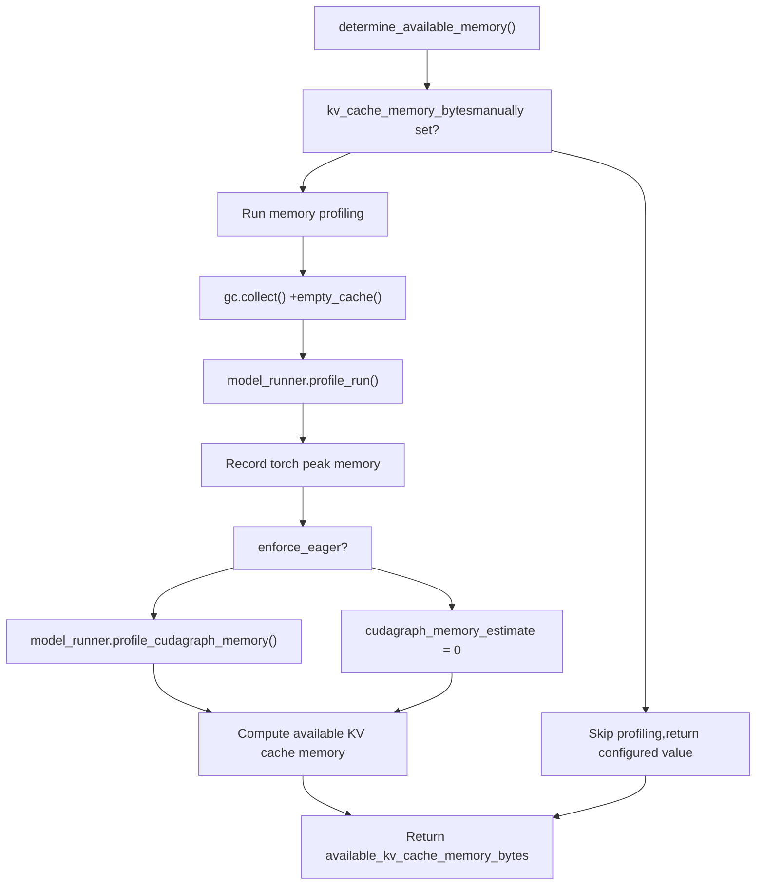
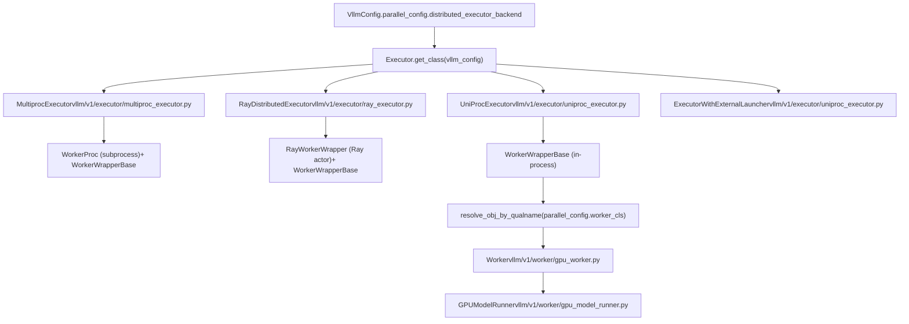

# Worker and Executor Architecture

Relevant source files

-   [tests/test\_ray\_env.py](https://github.com/vllm-project/vllm/blob/7cc302dd/tests/test_ray_env.py)
-   [tests/v1/executor/test\_executor.py](https://github.com/vllm-project/vllm/blob/7cc302dd/tests/v1/executor/test_executor.py)
-   [tests/v1/kv\_connector/unit/test\_output\_aggregator.py](https://github.com/vllm-project/vllm/blob/7cc302dd/tests/v1/kv_connector/unit/test_output_aggregator.py)
-   [tests/v1/worker/test\_gpu\_input\_batch.py](https://github.com/vllm-project/vllm/blob/7cc302dd/tests/v1/worker/test_gpu_input_batch.py)
-   [tests/v1/worker/test\_gpu\_model\_runner.py](https://github.com/vllm-project/vllm/blob/7cc302dd/tests/v1/worker/test_gpu_model_runner.py)
-   [vllm/ray/ray\_env.py](https://github.com/vllm-project/vllm/blob/7cc302dd/vllm/ray/ray_env.py)
-   [vllm/utils/\_\_init\_\_.py](https://github.com/vllm-project/vllm/blob/7cc302dd/vllm/utils/__init__.py)
-   [vllm/v1/core/sched/output.py](https://github.com/vllm-project/vllm/blob/7cc302dd/vllm/v1/core/sched/output.py)
-   [vllm/v1/executor/abstract.py](https://github.com/vllm-project/vllm/blob/7cc302dd/vllm/v1/executor/abstract.py)
-   [vllm/v1/executor/multiproc\_executor.py](https://github.com/vllm-project/vllm/blob/7cc302dd/vllm/v1/executor/multiproc_executor.py)
-   [vllm/v1/executor/ray\_executor.py](https://github.com/vllm-project/vllm/blob/7cc302dd/vllm/v1/executor/ray_executor.py)
-   [vllm/v1/executor/ray\_utils.py](https://github.com/vllm-project/vllm/blob/7cc302dd/vllm/v1/executor/ray_utils.py)
-   [vllm/v1/executor/uniproc\_executor.py](https://github.com/vllm-project/vllm/blob/7cc302dd/vllm/v1/executor/uniproc_executor.py)
-   [vllm/v1/worker/block\_table.py](https://github.com/vllm-project/vllm/blob/7cc302dd/vllm/v1/worker/block_table.py)
-   [vllm/v1/worker/gpu\_input\_batch.py](https://github.com/vllm-project/vllm/blob/7cc302dd/vllm/v1/worker/gpu_input_batch.py)
-   [vllm/v1/worker/gpu\_model\_runner.py](https://github.com/vllm-project/vllm/blob/7cc302dd/vllm/v1/worker/gpu_model_runner.py)
-   [vllm/v1/worker/gpu\_worker.py](https://github.com/vllm-project/vllm/blob/7cc302dd/vllm/v1/worker/gpu_worker.py)
-   [vllm/v1/worker/utils.py](https://github.com/vllm-project/vllm/blob/7cc302dd/vllm/v1/worker/utils.py)
-   [vllm/v1/worker/worker\_base.py](https://github.com/vllm-project/vllm/blob/7cc302dd/vllm/v1/worker/worker_base.py)

## Purpose and Scope

This page documents the two-layer abstraction vLLM uses to manage model execution across hardware: the **Executor** layer and the **Worker** layer.

-   The **Executor** is owned by the engine core and acts as a proxy to one or more worker processes or actors. It handles process lifecycle, RPC dispatch, and result collection.
-   The **Worker** runs inside each process (or Ray actor) and is responsible for device initialization, model loading, KV cache allocation, and executing individual forward passes.

This page focuses on the v1 implementations under `vllm/v1/executor/` and `vllm/v1/worker/`. For how the `EngineCore` holds and calls the executor, see [3.1](https://github.com/vllm-project/vllm/blob/7cc302dd/3.1) For what the `GPUModelRunner` does inside a worker, see [4.1](https://github.com/vllm-project/vllm/blob/7cc302dd/4.1) For distributed communication primitives (`MessageQueue`, `ShmRingBuffer`), see [9.2](https://github.com/vllm-project/vllm/blob/7cc302dd/9.2)

---

## Architecture Overview

**Two-layer model execution architecture**


Sources: [vllm/v1/executor/abstract.py36-86](https://github.com/vllm-project/vllm/blob/7cc302dd/vllm/v1/executor/abstract.py#L36-L86) [vllm/v1/executor/uniproc\_executor.py25-130](https://github.com/vllm-project/vllm/blob/7cc302dd/vllm/v1/executor/uniproc_executor.py#L25-L130) [vllm/v1/executor/multiproc\_executor.py96-225](https://github.com/vllm-project/vllm/blob/7cc302dd/vllm/v1/executor/multiproc_executor.py#L96-L225) [vllm/v1/executor/ray\_executor.py62-98](https://github.com/vllm-project/vllm/blob/7cc302dd/vllm/v1/executor/ray_executor.py#L62-L98)

---

## The Executor Abstraction

`Executor` ([vllm/v1/executor/abstract.py36-355](https://github.com/vllm-project/vllm/blob/7cc302dd/vllm/v1/executor/abstract.py#L36-L355)) is the abstract base class for all executor implementations. It is instantiated by the engine core and provides a uniform interface regardless of how many GPUs or processes are in use.

### Backend Selection

`Executor.get_class(vllm_config)` reads `parallel_config.distributed_executor_backend` to pick the concrete class:

| `distributed_executor_backend` | Executor Class | File |
| --- | --- | --- |
| `"mp"` | `MultiprocExecutor` | `vllm/v1/executor/multiproc_executor.py` |
| `"ray"` | `RayDistributedExecutor` | `vllm/v1/executor/ray_executor.py` |
| `"uni"` | `UniProcExecutor` | `vllm/v1/executor/uniproc_executor.py` |
| `"external_launcher"` | `ExecutorWithExternalLauncher` | `vllm/v1/executor/uniproc_executor.py` |
| A `type` subclassing `Executor` | That class directly | — |
| A fully-qualified string | Resolved via `resolve_obj_by_qualname` | — |

Sources: [vllm/v1/executor/abstract.py46-86](https://github.com/vllm-project/vllm/blob/7cc302dd/vllm/v1/executor/abstract.py#L46-L86)

### The `collective_rpc` Interface

All executor implementations expose `collective_rpc()`, the core RPC primitive. It sends a method call (by name or serialized callable) with positional and keyword arguments to all workers, then collects a list of results.

```
collective_rpc(method, timeout, args, kwargs, non_block) -> list[result] | Future[list[result]]
```
Higher-level methods (`execute_model`, `sample_tokens`, `initialize_from_config`, etc.) are implemented in the base class by delegating to `collective_rpc`. Subclasses override them only when they need extra behavior (e.g., handling pipeline parallelism).

Sources: [vllm/v1/executor/abstract.py141-191](https://github.com/vllm-project/vllm/blob/7cc302dd/vllm/v1/executor/abstract.py#L141-L191) [vllm/v1/executor/abstract.py112-126](https://github.com/vllm-project/vllm/blob/7cc302dd/vllm/v1/executor/abstract.py#L112-L126)

### Key Executor Methods

| Method | Description |
| --- | --- |
| `_init_executor()` | Abstract. Creates and initializes worker processes/actors. |
| `initialize_from_config(kv_cache_configs)` | Sends KV cache config to workers, then triggers `compile_or_warm_up_model`. |
| `determine_available_memory()` | Calls `determine_available_memory` on all workers; returns list of bytes. |
| `get_kv_cache_specs()` | Returns KV cache spec dicts from all workers. |
| `execute_model(scheduler_output)` | Dispatches a forward pass to all workers. |
| `sample_tokens(grammar_output)` | Dispatches sampling after a deferred `execute_model`. |
| `sleep(level)` / `wake_up(tags)` | Offload/restore GPU memory (sleep mode). |
| `check_health()` | Abstract. Raises if executor is unhealthy. |
| `shutdown()` | Terminates all workers. |

Sources: [vllm/v1/executor/abstract.py108-354](https://github.com/vllm-project/vllm/blob/7cc302dd/vllm/v1/executor/abstract.py#L108-L354)

---

## UniProcExecutor

[vllm/v1/executor/uniproc\_executor.py25-129](https://github.com/vllm-project/vllm/blob/7cc302dd/vllm/v1/executor/uniproc_executor.py#L25-L129)

`UniProcExecutor` runs a single worker **in the same process** as the engine core. It is the default for single-GPU deployments (i.e., TP=1, PP=1, no data parallelism requiring separate processes).

-   `_init_executor()` creates one `WorkerWrapperBase(rpc_rank=0)`, calls `init_worker()`, `init_device()`, and `load_model()` in-process.
-   `collective_rpc()` calls `run_method(self.driver_worker, method, args, kwargs)` directly — no IPC, no serialization.
-   When `async_scheduling=True`, a `ThreadPoolExecutor` (one thread) is created to handle `AsyncModelRunnerOutput.get_output()` off the main thread, allowing the scheduler to overlap with output processing.

### ExecutorWithExternalLauncher

[vllm/v1/executor/uniproc\_executor.py131-177](https://github.com/vllm-project/vllm/blob/7cc302dd/vllm/v1/executor/uniproc_executor.py#L131-L177)

A subclass of `UniProcExecutor` designed for `torchrun`\-compatible launchers. Instead of one executor managing multiple workers, the user launches one engine per GPU. `distributed_init_method` is set to `"env://"` and rank/local\_rank are read from `RANK` and `LOCAL_RANK`. `determine_available_memory()` performs an `all_reduce` across all ranks to pick the minimum available memory.

---

## MultiprocExecutor

[vllm/v1/executor/multiproc\_executor.py96-466](https://github.com/vllm-project/vllm/blob/7cc302dd/vllm/v1/executor/multiproc_executor.py#L96-L466)

`MultiprocExecutor` spawns one worker **subprocess** per local GPU. It is selected when `distributed_executor_backend="mp"` and is the standard backend for multi-GPU inference on a single node.

### Worker Process Spawning

**MultiprocExecutor initialization sequence**

> **[Mermaid sequence]**
> *(图表结构无法解析)*

Sources: [vllm/v1/executor/multiproc\_executor.py103-225](https://github.com/vllm-project/vllm/blob/7cc302dd/vllm/v1/executor/multiproc_executor.py#L103-L225) [vllm/v1/executor/multiproc\_executor.py603-643](https://github.com/vllm-project/vllm/blob/7cc302dd/vllm/v1/executor/multiproc_executor.py#L603-L643) [vllm/v1/executor/multiproc\_executor.py712-810](https://github.com/vllm-project/vllm/blob/7cc302dd/vllm/v1/executor/multiproc_executor.py#L712-L810)

### Message Queue Communication

Each worker subprocess has two `MessageQueue` channels (backed by shared memory):

| Queue | Direction | Purpose |
| --- | --- | --- |
| `rpc_broadcast_mq` | Executor → all workers | Broadcast `(method, args, kwargs, output_rank)` |
| `worker_response_mq` | Worker → Executor | Return `(status, result)` for each call |

The executor's `collective_rpc()` [vllm/v1/executor/multiproc\_executor.py317-389](https://github.com/vllm-project/vllm/blob/7cc302dd/vllm/v1/executor/multiproc_executor.py#L317-L389) enqueues a call tuple on `rpc_broadcast_mq`, then dequeues from the appropriate `response_mqs`. When `non_block=True`, it returns a `FutureWrapper` and defers reading until `.result()` is called.

Workers run `worker_busy_loop()` (not fully shown in the file but invoked at [vllm/v1/executor/multiproc\_executor.py791](https://github.com/vllm-project/vllm/blob/7cc302dd/vllm/v1/executor/multiproc_executor.py#L791-L791)) which continuously reads from `rpc_broadcast_mq` and dispatches `execute_method()`.

### Worker Process Handles

| Class | Purpose |
| --- | --- |
| `UnreadyWorkerProcHandle` | Holds `proc`, `rank`, `ready_pipe`, `death_writer` before READY signal |
| `WorkerProcHandle` | Holds `proc`, `rank`, `worker_response_mq`, `peer_worker_response_mqs`, `death_writer` after ready |

The **death pipe** (`death_writer`/`death_reader`) is a one-way pipe. The parent keeps `death_writer` open. When the parent process exits, the child gets `EOFError` on `death_reader` and shuts down cleanly.

### Health Monitoring

A daemon thread (`MultiprocWorkerMonitor`) watches process sentinels. If any worker exits unexpectedly, it logs an error, calls `shutdown()`, and fires the registered `FailureCallback` to notify the engine core.

Sources: [vllm/v1/executor/multiproc\_executor.py246-283](https://github.com/vllm-project/vllm/blob/7cc302dd/vllm/v1/executor/multiproc_executor.py#L246-L283)

### Output Rank

Only one worker produces the `ModelRunnerOutput` — the first TP worker of the last PP stage. The executor calculates this as:

```
output_rank = world_size - tensor_parallel_size * prefill_context_parallel_size
```
Sources: [vllm/v1/executor/multiproc\_executor.py451-465](https://github.com/vllm-project/vllm/blob/7cc302dd/vllm/v1/executor/multiproc_executor.py#L451-L465)

---

## RayDistributedExecutor

[vllm/v1/executor/ray\_executor.py62-643](https://github.com/vllm-project/vllm/blob/7cc302dd/vllm/v1/executor/ray_executor.py#L62-L643)

`RayDistributedExecutor` distributes workers as **Ray actors** and uses Ray's Compiled DAG for the execution path.

### Worker Creation

`_init_workers_ray()` [vllm/v1/executor/ray\_executor.py160-398](https://github.com/vllm-project/vllm/blob/7cc302dd/vllm/v1/executor/ray_executor.py#L160-L398):

1.  Resolves `bundle_indices` from the Ray placement group (or from `VLLM_RAY_BUNDLE_INDICES`).
2.  Creates `RayWorkerWrapper` remote actors, one per rank.
3.  Collects IP addresses from all actors and re-sorts workers so the driver's node comes first.
4.  Adjusts ranks via `collective_rpc("adjust_rank", ...)` to account for re-sorting.
5.  Sets `CUDA_VISIBLE_DEVICES` environment variables per node via `collective_rpc("update_environment_variables", ...)`.
6.  Calls `collective_rpc("init_worker", ...)`, `"init_device"`, `"load_model"` on all actors.
7.  Organizes workers into `pp_tp_workers[pp_rank][tp_rank]` for DAG construction.

### Execution via Compiled DAG

On the first `execute_model()` call, `_compiled_ray_dag()` builds a Ray `CompiledDAG` [vllm/v1/executor/ray\_executor.py542-635](https://github.com/vllm-project/vllm/blob/7cc302dd/vllm/v1/executor/ray_executor.py#L542-L635) It chains PP stages so intermediate tensors flow from PP rank 0 to PP rank N−1. The DAG is then called with `forward_dag.execute((scheduler_output, grammar_output))`.

**Ray DAG structure for PP=2, TP=4:**


Sources: [vllm/v1/executor/ray\_executor.py542-635](https://github.com/vllm-project/vllm/blob/7cc302dd/vllm/v1/executor/ray_executor.py#L542-L635)

### `collective_rpc` in Ray

`collective_rpc()` [vllm/v1/executor/ray\_executor.py485-510](https://github.com/vllm-project/vllm/blob/7cc302dd/vllm/v1/executor/ray_executor.py#L485-L510) uses `worker.execute_method.remote(method, *args, **kwargs)` on every actor and blocks with `ray.get()`. Method callables are serialized with `cloudpickle`.

---

## The Worker Abstraction

### `WorkerBase`

[vllm/v1/worker/worker\_base.py34-176](https://github.com/vllm-project/vllm/blob/7cc302dd/vllm/v1/worker/worker_base.py#L34-L176)

`WorkerBase` defines the interface every worker implementation must fulfill. It stores the decomposed `VllmConfig` fields and rank information.

**WorkerBase interface summary**

| Method | Description |
| --- | --- |
| `init_device()` | Set up the device (CUDA context, distributed process group, model runner). |
| `load_model()` | Load model weights onto the device. |
| `determine_available_memory()` | Profile peak memory use; return bytes available for KV cache. |
| `get_kv_cache_spec()` | Return `dict[str, KVCacheSpec]` for KV cache planning. |
| `initialize_from_config(kv_cache_config)` | Allocate KV cache and initialize KV transfer connectors. |
| `compile_or_warm_up_model()` | Capture CUDA graphs, run warmup iterations. Returns compilation time in seconds. |
| `execute_model(scheduler_output)` | Run the model forward pass. Returns `ModelRunnerOutput` or `None`. |
| `sample_tokens(grammar_output)` | Complete sampling if `execute_model` returned `None`. |
| `check_health()` | Liveness check. |
| `shutdown()` | Release resources. |
| `add_lora / remove_lora / pin_lora / list_loras` | LoRA adapter management. |
| `sleep(level) / wake_up(tags)` | GPU memory sleep/wake (only in `Worker`). |

Sources: [vllm/v1/worker/worker\_base.py34-176](https://github.com/vllm-project/vllm/blob/7cc302dd/vllm/v1/worker/worker_base.py#L34-L176)

### `WorkerWrapperBase`

[vllm/v1/worker/worker\_base.py179-372](https://github.com/vllm-project/vllm/blob/7cc302dd/vllm/v1/worker/worker_base.py#L179-L372)

`WorkerWrapperBase` sits between an executor and a `WorkerBase` instance. Its roles are:

1.  **Lazy initialization** — creates the `WorkerBase` subclass only when `init_worker()` is called.
2.  **Worker class resolution** — reads `parallel_config.worker_cls` (a fully-qualified class name string) and instantiates it via `resolve_obj_by_qualname`.
3.  **Worker extension injection** — if `parallel_config.worker_extension_cls` is set, dynamically inserts that class into `worker_class.__bases__` to add methods without subclassing.
4.  **Multimodal shared memory cache** — if configured, sets up a `mm_receiver_cache` for reading multimodal features from shared memory before forwarding to the worker.
5.  **Method dispatch** — `execute_method(method, *args, **kwargs)` calls `run_method(self, ...)`. `__getattr__` transparently delegates any unhandled attribute to `self.worker`.

```
WorkerWrapperBase
  .rpc_rank         — index in executor's worker list
  .global_rank      — global rank in distributed group
  .worker           — the actual WorkerBase instance (set after init_worker())
  .mm_receiver_cache — optional multimodal feature cache
```
Sources: [vllm/v1/worker/worker\_base.py179-372](https://github.com/vllm-project/vllm/blob/7cc302dd/vllm/v1/worker/worker_base.py#L179-L372)

---

## GPU Worker (`Worker`)

[vllm/v1/worker/gpu\_worker.py105-900](https://github.com/vllm-project/vllm/blob/7cc302dd/vllm/v1/worker/gpu_worker.py#L105-L900)

`Worker` is the concrete `WorkerBase` implementation for GPU execution. It coordinates between the distributed environment, the `GPUModelRunner`, and optional features like sleep mode and weight transfer.

### Class Relationships

**Code entities in the GPU worker layer**


Sources: [vllm/v1/worker/gpu\_worker.py105-156](https://github.com/vllm-project/vllm/blob/7cc302dd/vllm/v1/worker/gpu_worker.py#L105-L156) [vllm/v1/worker/worker\_base.py34-80](https://github.com/vllm-project/vllm/blob/7cc302dd/vllm/v1/worker/worker_base.py#L34-L80) [vllm/v1/worker/worker\_base.py179-215](https://github.com/vllm-project/vllm/blob/7cc302dd/vllm/v1/worker/worker_base.py#L179-L215)

### Initialization Lifecycle

**Worker initialization sequence**

> **[Mermaid sequence]**
> *(图表结构无法解析)*

Sources: [vllm/v1/worker/gpu\_worker.py222-315](https://github.com/vllm-project/vllm/blob/7cc302dd/vllm/v1/worker/gpu_worker.py#L222-L315) [vllm/v1/worker/gpu\_worker.py319-343](https://github.com/vllm-project/vllm/blob/7cc302dd/vllm/v1/worker/gpu_worker.py#L319-L343) [vllm/v1/worker/gpu\_worker.py350-429](https://github.com/vllm-project/vllm/blob/7cc302dd/vllm/v1/worker/gpu_worker.py#L350-L429) [vllm/v1/worker/gpu\_worker.py462-481](https://github.com/vllm-project/vllm/blob/7cc302dd/vllm/v1/worker/gpu_worker.py#L462-L481) [vllm/v1/worker/gpu\_worker.py482-608](https://github.com/vllm-project/vllm/blob/7cc302dd/vllm/v1/worker/gpu_worker.py#L482-L608)

### Device Initialization (`init_device()`)

The `init_device()` method sets up the GPU device and initializes the distributed environment.

**Device initialization sequence:**

> **[Mermaid sequence]**
> *(图表结构无法解析)*

Sources: [vllm/v1/worker/gpu\_worker.py222-293](https://github.com/vllm-project/vllm/blob/7cc302dd/vllm/v1/worker/gpu_worker.py#L222-L293) [vllm/v1/worker/gpu\_worker.py64-65](https://github.com/vllm-project/vllm/blob/7cc302dd/vllm/v1/worker/gpu_worker.py#L64-L65) [vllm/v1/worker/workspace.py60](https://github.com/vllm-project/vllm/blob/7cc302dd/vllm/v1/worker/workspace.py#L60-L60)

### Memory Profiling (`determine_available_memory()`)

The `determine_available_memory()` method profiles the model's memory usage to determine how much memory can be allocated for KV cache.

**Memory profiling flow:**


Sources: [vllm/v1/worker/gpu\_worker.py353-502](https://github.com/vllm-project/vllm/blob/7cc302dd/vllm/v1/worker/gpu_worker.py#L353-L502) [vllm/utils/mem\_utils.py48](https://github.com/vllm-project/vllm/blob/7cc302dd/vllm/utils/mem_utils.py#L48-L48)

### Model Execution and Pipeline Parallelism

The `execute_model()` method orchestrates a forward pass. Behavior differs based on pipeline parallel (PP) rank.

**Pipeline parallelism execution flow:**

> **[Mermaid sequence]**
> *(图表结构无法解析)*

Sources: [vllm/v1/worker/gpu\_worker.py668-757](https://github.com/vllm-project/vllm/blob/7cc302dd/vllm/v1/worker/gpu_worker.py#L668-L757) [vllm/v1/worker/gpu\_worker.py73-102](https://github.com/vllm-project/vllm/blob/7cc302dd/vllm/v1/worker/gpu_worker.py#L73-L102)

### Memory Management: Sleep and Wake

When `enable_sleep_mode=True`, the Worker supports GPU memory offloading via `sleep()` and `wake_up()`.

**Sleep levels:**

| Level | What's offloaded | What remains | Use case |
| --- | --- | --- | --- |
| 1 | Model weights | KV cache, buffers | Quick switch between models |
| 2 | Model weights, KV cache | Non-offloadable buffers (saved to CPU) | Deep sleep |

Sources: [vllm/v1/worker/gpu\_worker.py157-203](https://github.com/vllm-project/vllm/blob/7cc302dd/vllm/v1/worker/gpu_worker.py#L157-L203)

---

## Executor Selection and Initialization Flow

**Executor backend selection and worker class resolution**


Sources: [vllm/v1/executor/abstract.py46-86](https://github.com/vllm-project/vllm/blob/7cc302dd/vllm/v1/executor/abstract.py#L46-L86) [vllm/v1/worker/worker\_base.py251-314](https://github.com/vllm-project/vllm/blob/7cc302dd/vllm/v1/worker/worker_base.py#L251-L314)

---

## Summary Reference Table

| Class | File | Role |
| --- | --- | --- |
| `Executor` | `vllm/v1/executor/abstract.py` | Abstract base; owns `collective_rpc` contract |
| `UniProcExecutor` | `vllm/v1/executor/uniproc_executor.py` | In-process single-worker execution |
| `ExecutorWithExternalLauncher` | `vllm/v1/executor/uniproc_executor.py` | One worker per torchrun-launched engine |
| `MultiprocExecutor` | `vllm/v1/executor/multiproc_executor.py` | Multi-GPU via forked subprocesses + `MessageQueue` |
| `RayDistributedExecutor` | `vllm/v1/executor/ray_executor.py` | Multi-GPU/multi-node via Ray actors + compiled DAG |
| `WorkerProc` | `vllm/v1/executor/multiproc_executor.py` | Runs one worker in a subprocess; owns busy loop |
| `WorkerProcHandle` | `vllm/v1/executor/multiproc_executor.py` | Executor's handle to a ready `WorkerProc` |
| `WorkerBase` | `vllm/v1/worker/worker_base.py` | Abstract worker interface |
| `WorkerWrapperBase` | `vllm/v1/worker/worker_base.py` | Lazy init, method dispatch, extension injection |
| `Worker` | `vllm/v1/worker/gpu_worker.py` | Concrete GPU worker; drives `GPUModelRunner` |
| `AsyncIntermediateTensors` | `vllm/v1/worker/gpu_worker.py` | Lazy-sync PP intermediate tensors |
