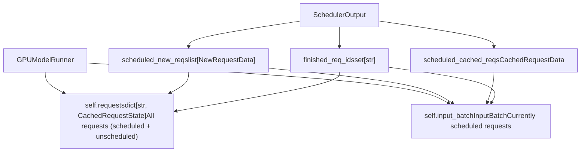
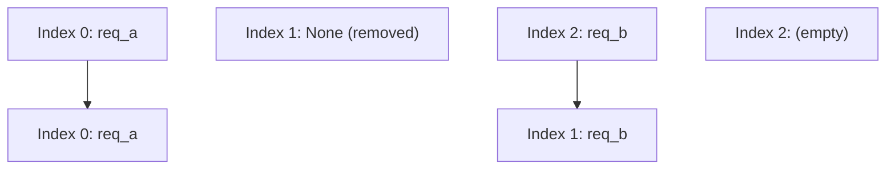
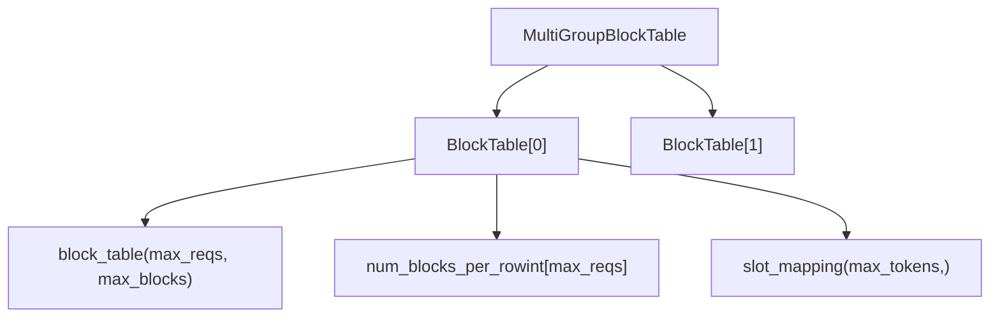
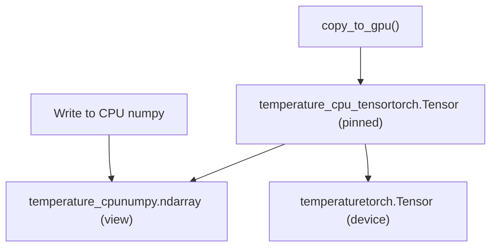
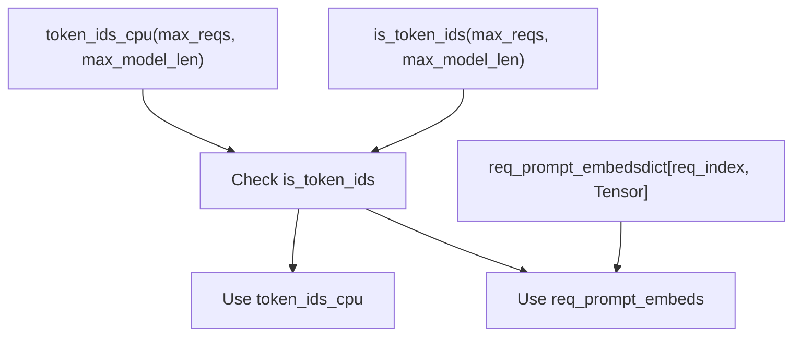

# InputBatch and Request State Management

Relevant source files

-   [.buildkite/test\_areas/model\_runner\_v2.yaml](https://github.com/vllm-project/vllm/blob/7cc302dd/.buildkite/test_areas/model_runner_v2.yaml)
-   [tests/v1/ec\_connector/integration/test\_epd\_correctness.py](https://github.com/vllm-project/vllm/blob/7cc302dd/tests/v1/ec_connector/integration/test_epd_correctness.py)
-   [tests/v1/executor/test\_executor.py](https://github.com/vllm-project/vllm/blob/7cc302dd/tests/v1/executor/test_executor.py)
-   [tests/v1/kv\_connector/unit/test\_output\_aggregator.py](https://github.com/vllm-project/vllm/blob/7cc302dd/tests/v1/kv_connector/unit/test_output_aggregator.py)
-   [tests/v1/spec\_decode/test\_synthetic\_rejection\_sampler\_utils.py](https://github.com/vllm-project/vllm/blob/7cc302dd/tests/v1/spec_decode/test_synthetic_rejection_sampler_utils.py)
-   [tests/v1/worker/test\_gpu\_input\_batch.py](https://github.com/vllm-project/vllm/blob/7cc302dd/tests/v1/worker/test_gpu_input_batch.py)
-   [tests/v1/worker/test\_gpu\_model\_runner.py](https://github.com/vllm-project/vllm/blob/7cc302dd/tests/v1/worker/test_gpu_model_runner.py)
-   [vllm/v1/core/sched/output.py](https://github.com/vllm-project/vllm/blob/7cc302dd/vllm/v1/core/sched/output.py)
-   [vllm/v1/executor/abstract.py](https://github.com/vllm-project/vllm/blob/7cc302dd/vllm/v1/executor/abstract.py)
-   [vllm/v1/executor/multiproc\_executor.py](https://github.com/vllm-project/vllm/blob/7cc302dd/vllm/v1/executor/multiproc_executor.py)
-   [vllm/v1/executor/ray\_executor.py](https://github.com/vllm-project/vllm/blob/7cc302dd/vllm/v1/executor/ray_executor.py)
-   [vllm/v1/executor/ray\_utils.py](https://github.com/vllm-project/vllm/blob/7cc302dd/vllm/v1/executor/ray_utils.py)
-   [vllm/v1/executor/uniproc\_executor.py](https://github.com/vllm-project/vllm/blob/7cc302dd/vllm/v1/executor/uniproc_executor.py)
-   [vllm/v1/worker/block\_table.py](https://github.com/vllm-project/vllm/blob/7cc302dd/vllm/v1/worker/block_table.py)
-   [vllm/v1/worker/gpu/async\_utils.py](https://github.com/vllm-project/vllm/blob/7cc302dd/vllm/v1/worker/gpu/async_utils.py)
-   [vllm/v1/worker/gpu/attn\_utils.py](https://github.com/vllm-project/vllm/blob/7cc302dd/vllm/v1/worker/gpu/attn_utils.py)
-   [vllm/v1/worker/gpu/block\_table.py](https://github.com/vllm-project/vllm/blob/7cc302dd/vllm/v1/worker/gpu/block_table.py)
-   [vllm/v1/worker/gpu/buffer\_utils.py](https://github.com/vllm-project/vllm/blob/7cc302dd/vllm/v1/worker/gpu/buffer_utils.py)
-   [vllm/v1/worker/gpu/cudagraph\_utils.py](https://github.com/vllm-project/vllm/blob/7cc302dd/vllm/v1/worker/gpu/cudagraph_utils.py)
-   [vllm/v1/worker/gpu/dp\_utils.py](https://github.com/vllm-project/vllm/blob/7cc302dd/vllm/v1/worker/gpu/dp_utils.py)
-   [vllm/v1/worker/gpu/input\_batch.py](https://github.com/vllm-project/vllm/blob/7cc302dd/vllm/v1/worker/gpu/input_batch.py)
-   [vllm/v1/worker/gpu/mm/\_\_init\_\_.py](https://github.com/vllm-project/vllm/blob/7cc302dd/vllm/v1/worker/gpu/mm/__init__.py)
-   [vllm/v1/worker/gpu/mm/encoder\_cache.py](https://github.com/vllm-project/vllm/blob/7cc302dd/vllm/v1/worker/gpu/mm/encoder_cache.py)
-   [vllm/v1/worker/gpu/mm/encoder\_runner.py](https://github.com/vllm-project/vllm/blob/7cc302dd/vllm/v1/worker/gpu/mm/encoder_runner.py)
-   [vllm/v1/worker/gpu/mm/rope.py](https://github.com/vllm-project/vllm/blob/7cc302dd/vllm/v1/worker/gpu/mm/rope.py)
-   [vllm/v1/worker/gpu/model\_runner.py](https://github.com/vllm-project/vllm/blob/7cc302dd/vllm/v1/worker/gpu/model_runner.py)
-   [vllm/v1/worker/gpu/sample/\_\_init\_\_.py](https://github.com/vllm-project/vllm/blob/7cc302dd/vllm/v1/worker/gpu/sample/__init__.py)
-   [vllm/v1/worker/gpu/sample/bad\_words.py](https://github.com/vllm-project/vllm/blob/7cc302dd/vllm/v1/worker/gpu/sample/bad_words.py)
-   [vllm/v1/worker/gpu/sample/gumbel.py](https://github.com/vllm-project/vllm/blob/7cc302dd/vllm/v1/worker/gpu/sample/gumbel.py)
-   [vllm/v1/worker/gpu/sample/logit\_bias.py](https://github.com/vllm-project/vllm/blob/7cc302dd/vllm/v1/worker/gpu/sample/logit_bias.py)
-   [vllm/v1/worker/gpu/sample/logprob.py](https://github.com/vllm-project/vllm/blob/7cc302dd/vllm/v1/worker/gpu/sample/logprob.py)
-   [vllm/v1/worker/gpu/sample/min\_p.py](https://github.com/vllm-project/vllm/blob/7cc302dd/vllm/v1/worker/gpu/sample/min_p.py)
-   [vllm/v1/worker/gpu/sample/output.py](https://github.com/vllm-project/vllm/blob/7cc302dd/vllm/v1/worker/gpu/sample/output.py)
-   [vllm/v1/worker/gpu/sample/penalties.py](https://github.com/vllm-project/vllm/blob/7cc302dd/vllm/v1/worker/gpu/sample/penalties.py)
-   [vllm/v1/worker/gpu/sample/prompt\_logprob.py](https://github.com/vllm-project/vllm/blob/7cc302dd/vllm/v1/worker/gpu/sample/prompt_logprob.py)
-   [vllm/v1/worker/gpu/sample/sampler.py](https://github.com/vllm-project/vllm/blob/7cc302dd/vllm/v1/worker/gpu/sample/sampler.py)
-   [vllm/v1/worker/gpu/sample/states.py](https://github.com/vllm-project/vllm/blob/7cc302dd/vllm/v1/worker/gpu/sample/states.py)
-   [vllm/v1/worker/gpu/spec\_decode/eagle/cudagraph.py](https://github.com/vllm-project/vllm/blob/7cc302dd/vllm/v1/worker/gpu/spec_decode/eagle/cudagraph.py)
-   [vllm/v1/worker/gpu/spec\_decode/eagle/speculator.py](https://github.com/vllm-project/vllm/blob/7cc302dd/vllm/v1/worker/gpu/spec_decode/eagle/speculator.py)
-   [vllm/v1/worker/gpu/spec\_decode/rejection\_sampler.py](https://github.com/vllm-project/vllm/blob/7cc302dd/vllm/v1/worker/gpu/spec_decode/rejection_sampler.py)
-   [vllm/v1/worker/gpu/spec\_decode/synthetic\_rejection\_sampler\_utils.py](https://github.com/vllm-project/vllm/blob/7cc302dd/vllm/v1/worker/gpu/spec_decode/synthetic_rejection_sampler_utils.py)
-   [vllm/v1/worker/gpu/states.py](https://github.com/vllm-project/vllm/blob/7cc302dd/vllm/v1/worker/gpu/states.py)
-   [vllm/v1/worker/gpu/structured\_outputs.py](https://github.com/vllm-project/vllm/blob/7cc302dd/vllm/v1/worker/gpu/structured_outputs.py)
-   [vllm/v1/worker/gpu\_input\_batch.py](https://github.com/vllm-project/vllm/blob/7cc302dd/vllm/v1/worker/gpu_input_batch.py)
-   [vllm/v1/worker/gpu\_model\_runner.py](https://github.com/vllm-project/vllm/blob/7cc302dd/vllm/v1/worker/gpu_model_runner.py)
-   [vllm/v1/worker/gpu\_worker.py](https://github.com/vllm-project/vllm/blob/7cc302dd/vllm/v1/worker/gpu_worker.py)
-   [vllm/v1/worker/utils.py](https://github.com/vllm-project/vllm/blob/7cc302dd/vllm/v1/worker/utils.py)
-   [vllm/v1/worker/worker\_base.py](https://github.com/vllm-project/vllm/blob/7cc302dd/vllm/v1/worker/worker_base.py)

This document describes the per-request state tracking and batched execution state management in vLLM's v1 worker architecture. It covers `CachedRequestState` for individual request metadata and `InputBatch` for managing batched execution across multiple requests.

For scheduler-side request management and scheduling decisions, see [Scheduler and Resource Allocation](/vllm-project/vllm/3.3-scheduler-and-resource-allocation). For model execution coordination using these structures, see [GPUModelRunner](/vllm-project/vllm/4.1-gpumodelrunner). For sampling configuration, see [Sampling and Token Generation](/vllm-project/vllm/4.4-sampling-and-token-generation).

**Scope**: This page focuses on the data structures and operations that maintain request state and batch composition during model execution. It does not cover the scheduler's decision-making logic or the actual model forward pass.

---

## Core Data Structures

### CachedRequestState

`CachedRequestState` stores all per-request metadata needed across multiple execution steps. Each request maintains its own instance that persists throughout its lifetime in the system.

Title: CachedRequestState Structure

**Key Fields**:

-   `req_id`: Unique request identifier [vllm/v1/worker/gpu\_input\_batch.py31](https://github.com/vllm-project/vllm/blob/7cc302dd/vllm/v1/worker/gpu_input_batch.py#L31-L31)
-   `prompt_token_ids`: Input token sequence (None if using `prompt_embeds`) [vllm/v1/worker/gpu\_input\_batch.py32](https://github.com/vllm-project/vllm/blob/7cc302dd/vllm/v1/worker/gpu_input_batch.py#L32-L32)
-   `block_ids`: Tuple of block ID lists, one per KV cache group [vllm/v1/worker/gpu\_input\_batch.py37](https://github.com/vllm-project/vllm/blob/7cc302dd/vllm/v1/worker/gpu_input_batch.py#L37-L37)
-   `num_computed_tokens`: Number of tokens already processed by the model [vllm/v1/worker/gpu\_input\_batch.py38](https://github.com/vllm-project/vllm/blob/7cc302dd/vllm/v1/worker/gpu_input_batch.py#L38-L38)
-   `output_token_ids`: Generated tokens so far [vllm/v1/worker/gpu\_input\_batch.py39](https://github.com/vllm-project/vllm/blob/7cc302dd/vllm/v1/worker/gpu_input_batch.py#L39-L39)
-   `mrope_positions`/`xdrope_positions`: Special positional encodings for multimodal models [vllm/v1/worker/gpu\_input\_batch.py41-44](https://github.com/vllm-project/vllm/blob/7cc302dd/vllm/v1/worker/gpu_input_batch.py#L41-L44)
-   `prev_num_draft_len`: Used for async scheduling with speculative decoding [vllm/v1/worker/gpu\_input\_batch.py50](https://github.com/vllm-project/vllm/blob/7cc302dd/vllm/v1/worker/gpu_input_batch.py#L50-L50)

Sources: [vllm/v1/worker/gpu\_input\_batch.py29-79](https://github.com/vllm-project/vllm/blob/7cc302dd/vllm/v1/worker/gpu_input_batch.py#L29-L79)

### InputBatch

`InputBatch` manages the batched execution state for all currently scheduled requests. It maintains both CPU and GPU tensors for efficient data transfer and supports dynamic batch composition.

Title: InputBatch Component Relationships

```mermaid
flowchart TD
    IB["InputBatch"]
    ReqMap["req_id_to_indexdict[str, int]"]
    ReqIDs["_req_idslist[str | None]"]
    TokenIDs["token_ids_cpu_tensor(max_num_reqs, max_model_len)"]
    IsTokenIDs["is_token_ids_tensorbool flags"]
    PromptEmbeds["req_prompt_embedsdict[int, Tensor]"]
    NumComputed["num_computed_tokens_cpu"]
    BlockTable["MultiGroupBlockTableblock_sizes, kernel_block_sizes"]
    SlotMapping["slot_mappingper-token KV slots"]
    Temperature["temperature (CPU/GPU)"]
    TopP["top_p (CPU/GPU)"]
    TopK["top_k (CPU/GPU)"]
    Penalties["frequency/presence/repetitionpenalties"]
    AllowedMask["allowed_token_ids_mask"]
    SamplingMeta["sampling_metadataSamplingMetadata"]
    PoolingMeta["pooling_params/statesfor pooling models"]
    LogitsProcs["logitsprocsLogitsProcessors"]
    BatchUpdate["batch_update_builderBatchUpdateBuilder"]
    LoRAMap["request_lora_mappingreq_index -> lora_id"]
    LoRARequests["lora_id_to_lora_request"]

    IB --> ReqMap
    IB --> ReqIDs
    IB --> TokenIDs
    IB --> IsTokenIDs
    IB --> PromptEmbeds
    IB --> BlockTable
    IB --> Temperature
    IB --> TopP
    IB --> TopK
    IB --> Penalties
    IB --> AllowedMask
    IB --> SamplingMeta
    IB --> PoolingMeta
    IB --> LogitsProcs
    IB --> BatchUpdate
    IB --> LoRAMap
    IB --> LoRARequests
```

**CPU/GPU Buffer Pattern**: Most tensors follow the synchronized CPU and GPU versions to enable overlapped CPU preparation and GPU execution.

-   CPU tensors end in `_cpu_tensor` or `_cpu` [vllm/v1/worker/gpu\_input\_batch.py115-150](https://github.com/vllm-project/vllm/blob/7cc302dd/vllm/v1/worker/gpu_input_batch.py#L115-L150)
-   GPU tensors are stored in device memory [vllm/v1/worker/gpu\_input\_batch.py166-188](https://github.com/vllm-project/vllm/blob/7cc302dd/vllm/v1/worker/gpu_input_batch.py#L166-L188)
-   Explicit `copy_to_gpu()` calls synchronize state [vllm/v1/worker/gpu\_input\_batch.py1010-1033](https://github.com/vllm-project/vllm/blob/7cc302dd/vllm/v1/worker/gpu_input_batch.py#L1010-L1033)

Sources: [vllm/v1/worker/gpu\_input\_batch.py81-268](https://github.com/vllm-project/vllm/blob/7cc302dd/vllm/v1/worker/gpu_input_batch.py#L81-L268)

---

## Request State Management in GPUModelRunner

The `GPUModelRunner` maintains two levels of request state:

Title: GPUModelRunner State Coordination

**Separation of Concerns**:

1.  `self.requests`: Long-term storage for all request states, indexed by `req_id` [vllm/v1/worker/gpu\_model\_runner.py199](https://github.com/vllm-project/vllm/blob/7cc302dd/vllm/v1/worker/gpu_model_runner.py#L199-L199) Requests remain here even when unscheduled (preempted).
2.  `self.input_batch`: Short-term batch composition for the current execution step [vllm/v1/worker/gpu\_model\_runner.py200](https://github.com/vllm-project/vllm/blob/7cc302dd/vllm/v1/worker/gpu_model_runner.py#L200-L200)
3.  The `input_batch.req_id_to_index` mapping provides O(1) lookup from request ID to batch index [vllm/v1/worker/gpu\_input\_batch.py109](https://github.com/vllm-project/vllm/blob/7cc302dd/vllm/v1/worker/gpu_input_batch.py#L109-L109)

Sources: [vllm/v1/worker/gpu\_model\_runner.py199-200](https://github.com/vllm-project/vllm/blob/7cc302dd/vllm/v1/worker/gpu_model_runner.py#L199-L200) [vllm/v1/worker/gpu\_input\_batch.py109](https://github.com/vllm-project/vllm/blob/7cc302dd/vllm/v1/worker/gpu_input_batch.py#L109-L109)

---

## Request Lifecycle and State Transitions

### Adding New Requests

When a request is scheduled for the first time, `GPUModelRunner` creates a `CachedRequestState` and adds it to the `InputBatch`.

Title: New Request Addition Sequence

> **[Mermaid sequence]**
> *(图表结构无法解析)*

The `add_request()` operation:

1.  Calls `_register_add_request()` to allocate a batch index [vllm/v1/worker/gpu\_input\_batch.py284](https://github.com/vllm-project/vllm/blob/7cc302dd/vllm/v1/worker/gpu_input_batch.py#L284-L284)
2.  Reuses indices from recently removed requests via `batch_update_builder.pop_removed()` [vllm/v1/worker/gpu\_input\_batch.py274](https://github.com/vllm-project/vllm/blob/7cc302dd/vllm/v1/worker/gpu_input_batch.py#L274-L274)
3.  Copies prompt and output tokens to CPU tensors [vllm/v1/worker/gpu\_input\_batch.py314-323](https://github.com/vllm-project/vllm/blob/7cc302dd/vllm/v1/worker/gpu_input_batch.py#L314-L323)
4.  Initializes sampling parameters (temperature, top\_p, top\_k, penalties) [vllm/v1/worker/gpu\_input\_batch.py334-386](https://github.com/vllm-project/vllm/blob/7cc302dd/vllm/v1/worker/gpu_input_batch.py#L334-L386)

Sources: [vllm/v1/worker/gpu\_input\_batch.py284-447](https://github.com/vllm-project/vllm/blob/7cc302dd/vllm/v1/worker/gpu_input_batch.py#L284-L447) [vllm/v1/worker/gpu\_model\_runner.py1327-1355](https://github.com/vllm-project/vllm/blob/7cc302dd/vllm/v1/worker/gpu_model_runner.py#L1327-L1355)

### Removing Finished Requests

Title: Request Removal Sequence

> **[Mermaid sequence]**
> *(图表结构无法解析)*

**Important**: `remove_request()` must be followed by `condense()` to compact the batch [vllm/v1/worker/gpu\_input\_batch.py632](https://github.com/vllm-project/vllm/blob/7cc302dd/vllm/v1/worker/gpu_input_batch.py#L632-L632) Removed slots are temporarily marked `None` [vllm/v1/worker/gpu\_input\_batch.py479](https://github.com/vllm-project/vllm/blob/7cc302dd/vllm/v1/worker/gpu_input_batch.py#L479-L479)

Sources: [vllm/v1/worker/gpu\_input\_batch.py475-527](https://github.com/vllm-project/vllm/blob/7cc302dd/vllm/v1/worker/gpu_input_batch.py#L475-L527) [vllm/v1/worker/gpu\_model\_runner.py1400-1407](https://github.com/vllm-project/vllm/blob/7cc302dd/vllm/v1/worker/gpu_model_runner.py#L1400-L1407)

---

## Batch State Operations

### Condensation (Compaction)

The `condense()` operation removes gaps left by removed requests by sliding active requests to the lowest available indices [vllm/v1/worker/gpu\_input\_batch.py632-715](https://github.com/vllm-project/vllm/blob/7cc302dd/vllm/v1/worker/gpu_input_batch.py#L632-L715)

Title: Batch Condensation Logic

**Algorithm**:

1.  Iterate through `_req_ids` to find `None` entries (empty slots) [vllm/v1/worker/gpu\_input\_batch.py641](https://github.com/vllm-project/vllm/blob/7cc302dd/vllm/v1/worker/gpu_input_batch.py#L641-L641)
2.  For each empty slot, find the next non-`None` entry [vllm/v1/worker/gpu\_input\_batch.py645](https://github.com/vllm-project/vllm/blob/7cc302dd/vllm/v1/worker/gpu_input_batch.py#L645-L645)
3.  Call `move_row()` to shift the request down [vllm/v1/worker/gpu\_input\_batch.py650](https://github.com/vllm-project/vllm/blob/7cc302dd/vllm/v1/worker/gpu_input_batch.py#L650-L650)
4.  Update `req_id_to_index` mapping [vllm/v1/worker/gpu\_input\_batch.py651](https://github.com/vllm-project/vllm/blob/7cc302dd/vllm/v1/worker/gpu_input_batch.py#L651-L651)

Sources: [vllm/v1/worker/gpu\_input\_batch.py632-715](https://github.com/vllm-project/vllm/blob/7cc302dd/vllm/v1/worker/gpu_input_batch.py#L632-L715)

---

## Block Table Management

The `MultiGroupBlockTable` manages block tables across multiple KV cache groups (for models with multiple attention types or KV sharing) [vllm/v1/worker/block\_table.py147](https://github.com/vllm-project/vllm/blob/7cc302dd/vllm/v1/worker/block_table.py#L147-L147)

Title: Multi-Group Block Table Structure

**Hybrid Block Sizes**: When the KV cache manager's block size differs from the attention kernel's supported block size, the `BlockTable` subdivides blocks [vllm/v1/worker/block\_table.py38-42](https://github.com/vllm-project/vllm/blob/7cc302dd/vllm/v1/worker/block_table.py#L38-L42)

Sources: [vllm/v1/worker/block\_table.py16-251](https://github.com/vllm-project/vllm/blob/7cc302dd/vllm/v1/worker/block_table.py#L16-L251) [vllm/v1/worker/block\_table.py253-343](https://github.com/vllm-project/vllm/blob/7cc302dd/vllm/v1/worker/block_table.py#L253-L343)

---

## Memory Layout and Buffer Management

### CPU/GPU Buffer Synchronization

Title: Buffer Sync Strategy

**Design Rationale**:

-   CPU arrays allow fast NumPy operations during batch preparation [vllm/v1/worker/gpu\_input\_batch.py121](https://github.com/vllm-project/vllm/blob/7cc302dd/vllm/v1/worker/gpu_input_batch.py#L121-L121)
-   Pinned memory enables faster non-blocking GPU transfers [vllm/v1/worker/gpu\_input\_batch.py164](https://github.com/vllm-project/vllm/blob/7cc302dd/vllm/v1/worker/gpu_input_batch.py#L164-L164)
-   Explicit `copy_to_gpu()` calls batch GPU transfers [vllm/v1/worker/gpu\_input\_batch.py1010](https://github.com/vllm-project/vllm/blob/7cc302dd/vllm/v1/worker/gpu_input_batch.py#L1010-L1010)

Sources: [vllm/v1/worker/gpu\_input\_batch.py160-212](https://github.com/vllm-project/vllm/blob/7cc302dd/vllm/v1/worker/gpu_input_batch.py#L160-L212) [vllm/v1/worker/gpu\_input\_batch.py1010-1033](https://github.com/vllm-project/vllm/blob/7cc302dd/vllm/v1/worker/gpu_input_batch.py#L1010-L1033)

### Token Storage Strategy

Token IDs use a storage strategy to handle both token IDs and prompt embeddings [vllm/v1/worker/gpu\_input\_batch.py115-129](https://github.com/vllm-project/vllm/blob/7cc302dd/vllm/v1/worker/gpu_input_batch.py#L115-L129)

Title: Token and Embedding Mapping

Sources: [vllm/v1/worker/gpu\_input\_batch.py115-144](https://github.com/vllm-project/vllm/blob/7cc302dd/vllm/v1/worker/gpu_input_batch.py#L115-L144) [vllm/v1/worker/gpu\_model\_runner.py1828-1920](https://github.com/vllm-project/vllm/blob/7cc302dd/vllm/v1/worker/gpu_model_runner.py#L1828-L1920)
