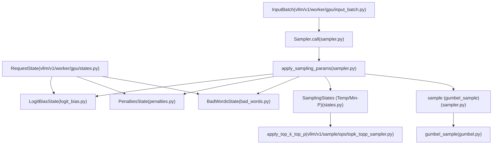
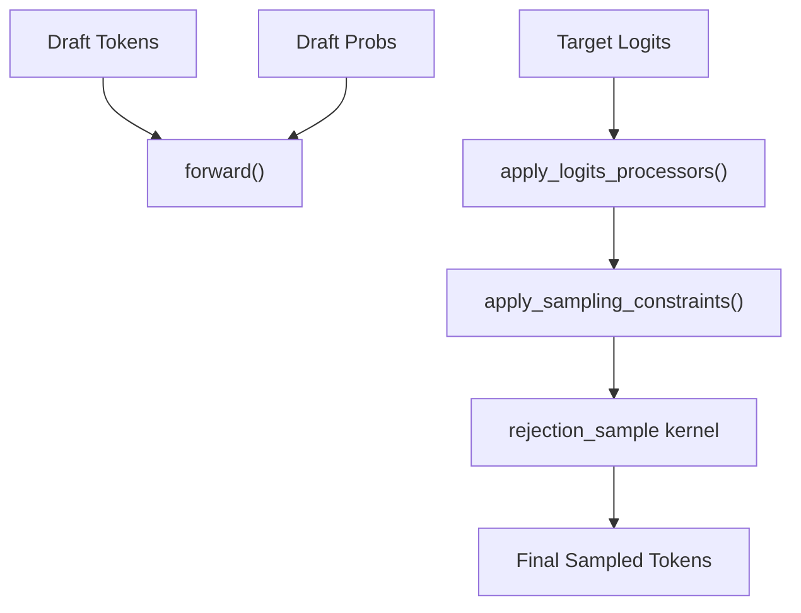

# Sampling and Token Generation

Relevant source files

-   [.buildkite/test\_areas/model\_runner\_v2.yaml](https://github.com/vllm-project/vllm/blob/7cc302dd/.buildkite/test_areas/model_runner_v2.yaml)
-   [benchmarks/benchmark\_topk\_topp.py](https://github.com/vllm-project/vllm/blob/7cc302dd/benchmarks/benchmark_topk_topp.py)
-   [tests/samplers/test\_beam\_search.py](https://github.com/vllm-project/vllm/blob/7cc302dd/tests/samplers/test_beam_search.py)
-   [tests/test\_regression.py](https://github.com/vllm-project/vllm/blob/7cc302dd/tests/test_regression.py)
-   [tests/utils\_/test\_mem\_utils.py](https://github.com/vllm-project/vllm/blob/7cc302dd/tests/utils_/test_mem_utils.py)
-   [tests/v1/core/test\_async\_scheduler.py](https://github.com/vllm-project/vllm/blob/7cc302dd/tests/v1/core/test_async_scheduler.py)
-   [tests/v1/ec\_connector/integration/test\_epd\_correctness.py](https://github.com/vllm-project/vllm/blob/7cc302dd/tests/v1/ec_connector/integration/test_epd_correctness.py)
-   [tests/v1/sample/test\_logprobs.py](https://github.com/vllm-project/vllm/blob/7cc302dd/tests/v1/sample/test_logprobs.py)
-   [tests/v1/sample/test\_rejection\_sampler.py](https://github.com/vllm-project/vllm/blob/7cc302dd/tests/v1/sample/test_rejection_sampler.py)
-   [tests/v1/sample/test\_sampler.py](https://github.com/vllm-project/vllm/blob/7cc302dd/tests/v1/sample/test_sampler.py)
-   [tests/v1/sample/test\_topk\_topp\_sampler.py](https://github.com/vllm-project/vllm/blob/7cc302dd/tests/v1/sample/test_topk_topp_sampler.py)
-   [tests/v1/sample/utils.py](https://github.com/vllm-project/vllm/blob/7cc302dd/tests/v1/sample/utils.py)
-   [tests/v1/spec\_decode/test\_ngram.py](https://github.com/vllm-project/vllm/blob/7cc302dd/tests/v1/spec_decode/test_ngram.py)
-   [tests/v1/spec\_decode/test\_synthetic\_rejection\_sampler\_utils.py](https://github.com/vllm-project/vllm/blob/7cc302dd/tests/v1/spec_decode/test_synthetic_rejection_sampler_utils.py)
-   [tools/pre\_commit/check\_torch\_cuda.py](https://github.com/vllm-project/vllm/blob/7cc302dd/tools/pre_commit/check_torch_cuda.py)
-   [vllm/beam\_search.py](https://github.com/vllm-project/vllm/blob/7cc302dd/vllm/beam_search.py)
-   [vllm/v1/sample/metadata.py](https://github.com/vllm-project/vllm/blob/7cc302dd/vllm/v1/sample/metadata.py)
-   [vllm/v1/sample/ops/bad\_words.py](https://github.com/vllm-project/vllm/blob/7cc302dd/vllm/v1/sample/ops/bad_words.py)
-   [vllm/v1/sample/ops/topk\_topp\_sampler.py](https://github.com/vllm-project/vllm/blob/7cc302dd/vllm/v1/sample/ops/topk_topp_sampler.py)
-   [vllm/v1/sample/ops/topk\_topp\_triton.py](https://github.com/vllm-project/vllm/blob/7cc302dd/vllm/v1/sample/ops/topk_topp_triton.py)
-   [vllm/v1/sample/rejection\_sampler.py](https://github.com/vllm-project/vllm/blob/7cc302dd/vllm/v1/sample/rejection_sampler.py)
-   [vllm/v1/sample/sampler.py](https://github.com/vllm-project/vllm/blob/7cc302dd/vllm/v1/sample/sampler.py)
-   [vllm/v1/spec\_decode/ngram\_proposer.py](https://github.com/vllm-project/vllm/blob/7cc302dd/vllm/v1/spec_decode/ngram_proposer.py)
-   [vllm/v1/spec\_decode/suffix\_decoding.py](https://github.com/vllm-project/vllm/blob/7cc302dd/vllm/v1/spec_decode/suffix_decoding.py)
-   [vllm/v1/worker/gpu/async\_utils.py](https://github.com/vllm-project/vllm/blob/7cc302dd/vllm/v1/worker/gpu/async_utils.py)
-   [vllm/v1/worker/gpu/attn\_utils.py](https://github.com/vllm-project/vllm/blob/7cc302dd/vllm/v1/worker/gpu/attn_utils.py)
-   [vllm/v1/worker/gpu/block\_table.py](https://github.com/vllm-project/vllm/blob/7cc302dd/vllm/v1/worker/gpu/block_table.py)
-   [vllm/v1/worker/gpu/buffer\_utils.py](https://github.com/vllm-project/vllm/blob/7cc302dd/vllm/v1/worker/gpu/buffer_utils.py)
-   [vllm/v1/worker/gpu/cudagraph\_utils.py](https://github.com/vllm-project/vllm/blob/7cc302dd/vllm/v1/worker/gpu/cudagraph_utils.py)
-   [vllm/v1/worker/gpu/dp\_utils.py](https://github.com/vllm-project/vllm/blob/7cc302dd/vllm/v1/worker/gpu/dp_utils.py)
-   [vllm/v1/worker/gpu/input\_batch.py](https://github.com/vllm-project/vllm/blob/7cc302dd/vllm/v1/worker/gpu/input_batch.py)
-   [vllm/v1/worker/gpu/mm/\_\_init\_\_.py](https://github.com/vllm-project/vllm/blob/7cc302dd/vllm/v1/worker/gpu/mm/__init__.py)
-   [vllm/v1/worker/gpu/mm/encoder\_cache.py](https://github.com/vllm-project/vllm/blob/7cc302dd/vllm/v1/worker/gpu/mm/encoder_cache.py)
-   [vllm/v1/worker/gpu/mm/encoder\_runner.py](https://github.com/vllm-project/vllm/blob/7cc302dd/vllm/v1/worker/gpu/mm/encoder_runner.py)
-   [vllm/v1/worker/gpu/mm/rope.py](https://github.com/vllm-project/vllm/blob/7cc302dd/vllm/v1/worker/gpu/mm/rope.py)
-   [vllm/v1/worker/gpu/model\_runner.py](https://github.com/vllm-project/vllm/blob/7cc302dd/vllm/v1/worker/gpu/model_runner.py)
-   [vllm/v1/worker/gpu/sample/\_\_init\_\_.py](https://github.com/vllm-project/vllm/blob/7cc302dd/vllm/v1/worker/gpu/sample/__init__.py)
-   [vllm/v1/worker/gpu/sample/bad\_words.py](https://github.com/vllm-project/vllm/blob/7cc302dd/vllm/v1/worker/gpu/sample/bad_words.py)
-   [vllm/v1/worker/gpu/sample/gumbel.py](https://github.com/vllm-project/vllm/blob/7cc302dd/vllm/v1/worker/gpu/sample/gumbel.py)
-   [vllm/v1/worker/gpu/sample/logit\_bias.py](https://github.com/vllm-project/vllm/blob/7cc302dd/vllm/v1/worker/gpu/sample/logit_bias.py)
-   [vllm/v1/worker/gpu/sample/logprob.py](https://github.com/vllm-project/vllm/blob/7cc302dd/vllm/v1/worker/gpu/sample/logprob.py)
-   [vllm/v1/worker/gpu/sample/min\_p.py](https://github.com/vllm-project/vllm/blob/7cc302dd/vllm/v1/worker/gpu/sample/min_p.py)
-   [vllm/v1/worker/gpu/sample/output.py](https://github.com/vllm-project/vllm/blob/7cc302dd/vllm/v1/worker/gpu/sample/output.py)
-   [vllm/v1/worker/gpu/sample/penalties.py](https://github.com/vllm-project/vllm/blob/7cc302dd/vllm/v1/worker/gpu/sample/penalties.py)
-   [vllm/v1/worker/gpu/sample/prompt\_logprob.py](https://github.com/vllm-project/vllm/blob/7cc302dd/vllm/v1/worker/gpu/sample/prompt_logprob.py)
-   [vllm/v1/worker/gpu/sample/sampler.py](https://github.com/vllm-project/vllm/blob/7cc302dd/vllm/v1/worker/gpu/sample/sampler.py)
-   [vllm/v1/worker/gpu/sample/states.py](https://github.com/vllm-project/vllm/blob/7cc302dd/vllm/v1/worker/gpu/sample/states.py)
-   [vllm/v1/worker/gpu/spec\_decode/eagle/cudagraph.py](https://github.com/vllm-project/vllm/blob/7cc302dd/vllm/v1/worker/gpu/spec_decode/eagle/cudagraph.py)
-   [vllm/v1/worker/gpu/spec\_decode/eagle/speculator.py](https://github.com/vllm-project/vllm/blob/7cc302dd/vllm/v1/worker/gpu/spec_decode/eagle/speculator.py)
-   [vllm/v1/worker/gpu/spec\_decode/rejection\_sampler.py](https://github.com/vllm-project/vllm/blob/7cc302dd/vllm/v1/worker/gpu/spec_decode/rejection_sampler.py)
-   [vllm/v1/worker/gpu/spec\_decode/synthetic\_rejection\_sampler\_utils.py](https://github.com/vllm-project/vllm/blob/7cc302dd/vllm/v1/worker/gpu/spec_decode/synthetic_rejection_sampler_utils.py)
-   [vllm/v1/worker/gpu/states.py](https://github.com/vllm-project/vllm/blob/7cc302dd/vllm/v1/worker/gpu/states.py)
-   [vllm/v1/worker/gpu/structured\_outputs.py](https://github.com/vllm-project/vllm/blob/7cc302dd/vllm/v1/worker/gpu/structured_outputs.py)
-   [vllm/v1/worker/tpu\_input\_batch.py](https://github.com/vllm-project/vllm/blob/7cc302dd/vllm/v1/worker/tpu_input_batch.py)

## Purpose and Scope

This document describes the sampling and token generation subsystem in vLLM's GPU model execution pipeline, specifically focusing on the V1 engine architecture. It covers how logits produced by the model forward pass are transformed into discrete token IDs through various sampling strategies, penalties, and constraints. This includes the configuration of sampling parameters, construction of batch-level sampling metadata, logits processing, and the final token selection mechanisms.

## Sampling Components Overview

The sampling subsystem consists of several key components that work together to transform model logits into token IDs. In the V1 engine, the `Sampler` class coordinates these operations, often utilizing specialized state objects and optimized kernels.

### Natural Language to Code Entity Mapping: Sampling Pipeline

The following diagram maps the logical sampling stages to the specific code entities responsible for them in the V1 engine.

**Sources:** [vllm/v1/worker/gpu/sample/sampler.py22-56](https://github.com/vllm-project/vllm/blob/7cc302dd/vllm/v1/worker/gpu/sample/sampler.py#L22-L56) [vllm/v1/worker/gpu/sample/sampler.py57-103](https://github.com/vllm-project/vllm/blob/7cc302dd/vllm/v1/worker/gpu/sample/sampler.py#L57-L103) [vllm/v1/worker/gpu/sample/sampler.py105-152](https://github.com/vllm-project/vllm/blob/7cc302dd/vllm/v1/worker/gpu/sample/sampler.py#L105-L152) [vllm/v1/worker/gpu/states.py9-77](https://github.com/vllm-project/vllm/blob/7cc302dd/vllm/v1/worker/gpu/states.py#L9-L77)

## SamplingParams and State Management

Each request specifies its sampling behavior through `SamplingParams`. In the V1 engine, these parameters are staged into specialized state objects within the `Sampler` to allow for efficient batch processing.

### State Objects

-   **`SamplingStates`**: Manages temperature, seeds, and `min_p` parameters across the batch [vllm/v1/worker/gpu/sample/states.py18](https://github.com/vllm-project/vllm/blob/7cc302dd/vllm/v1/worker/gpu/sample/states.py#L18-L18)
-   **`PenaltiesState`**: Tracks token frequencies and presence to apply repetition, frequency, and presence penalties [vllm/v1/worker/gpu/sample/penalties.py17](https://github.com/vllm-project/vllm/blob/7cc302dd/vllm/v1/worker/gpu/sample/penalties.py#L17-L17)
-   **`LogitBiasState`**: Handles logit biases, including `allowed_token_ids` and `min_tokens` constraints [vllm/v1/worker/gpu/sample/logit\_bias.py14](https://github.com/vllm-project/vllm/blob/7cc302dd/vllm/v1/worker/gpu/sample/logit_bias.py#L14-L14)
-   **`BadWordsState`**: Manages the exclusion of specific token sequences [vllm/v1/worker/gpu/sample/bad\_words.py12](https://github.com/vllm-project/vllm/blob/7cc302dd/vllm/v1/worker/gpu/sample/bad_words.py#L12-L12)

The `Sampler` uses a staged write pattern: parameters are added via `add_request` and then committed to GPU/UVA buffers via `apply_staged_writes` before execution [vllm/v1/worker/gpu/sample/sampler.py43-55](https://github.com/vllm-project/vllm/blob/7cc302dd/vllm/v1/worker/gpu/sample/sampler.py#L43-L55)

**Sources:** [vllm/v1/worker/gpu/sample/sampler.py22-41](https://github.com/vllm-project/vllm/blob/7cc302dd/vllm/v1/worker/gpu/sample/sampler.py#L22-L41) [vllm/v1/worker/gpu/sample/sampler.py43-55](https://github.com/vllm-project/vllm/blob/7cc302dd/vllm/v1/worker/gpu/sample/sampler.py#L43-L55)

## Sampler Implementation and Execution Flow

The `Sampler` class in `vllm/v1/worker/gpu/sample/sampler.py` implements the core token selection logic. It is invoked after the model forward pass.

### Execution Steps

1.  **Logits Preparation**: Logits are copied to a new FP32 tensor for high-precision processing [vllm/v1/worker/gpu/sample/sampler.py115](https://github.com/vllm-project/vllm/blob/7cc302dd/vllm/v1/worker/gpu/sample/sampler.py#L115-L115)
2.  **Logit Bias & Penalties**: `apply_logit_bias`, `apply_penalties`, and `apply_bad_words` are called in-place [vllm/v1/worker/gpu/sample/sampler.py118-139](https://github.com/vllm-project/vllm/blob/7cc302dd/vllm/v1/worker/gpu/sample/sampler.py#L118-L139)
3.  **Temperature & Filtering**: Temperature scaling and `min_p` are applied, followed by `top_k`/`top_p` filtering [vllm/v1/worker/gpu/sample/sampler.py142-152](https://github.com/vllm-project/vllm/blob/7cc302dd/vllm/v1/worker/gpu/sample/sampler.py#L142-L152)
4.  **Token Selection**: The `gumbel_sample` function is used to select the next token based on the processed distribution [vllm/v1/worker/gpu/sample/sampler.py173-180](https://github.com/vllm-project/vllm/blob/7cc302dd/vllm/v1/worker/gpu/sample/sampler.py#L173-L180)
5.  **Logprobs Computation**: If requested, top-k logprobs are computed using the processed logits [vllm/v1/worker/gpu/sample/sampler.py81-89](https://github.com/vllm-project/vllm/blob/7cc302dd/vllm/v1/worker/gpu/sample/sampler.py#L81-L89)

### Backend Selection (TopKTopPSampler)

The `TopKTopPSampler` (used within `SamplingStates`) dynamically selects implementation backends:

| Backend | Condition |
| --- | --- |
| **FlashInfer** | Enabled via `VLLM_USE_FLASHINFER_SAMPLER=1` on compatible NVIDIA GPUs [vllm/v1/sample/ops/topk\_topp\_sampler.py39-55](https://github.com/vllm-project/vllm/blob/7cc302dd/vllm/v1/sample/ops/topk_topp_sampler.py#L39-L55) |
| **AITER** | Used on ROCm platforms if `aiter.ops.sampling` is available [vllm/v1/sample/ops/topk\_topp\_sampler.py73-84](https://github.com/vllm-project/vllm/blob/7cc302dd/vllm/v1/sample/ops/topk_topp_sampler.py#L73-L84) |
| **CPU Optimized** | Native implementation for x86/ARM CPUs [vllm/v1/sample/ops/topk\_topp\_sampler.py64-72](https://github.com/vllm-project/vllm/blob/7cc302dd/vllm/v1/sample/ops/topk_topp_sampler.py#L64-L72) |
| **Native PyTorch** | Fallback for other cases or when intermediate logprobs are needed [vllm/v1/sample/ops/topk\_topp\_sampler.py94-114](https://github.com/vllm-project/vllm/blob/7cc302dd/vllm/v1/sample/ops/topk_topp_sampler.py#L94-L114) |

**Sources:** [vllm/v1/worker/gpu/sample/sampler.py57-103](https://github.com/vllm-project/vllm/blob/7cc302dd/vllm/v1/worker/gpu/sample/sampler.py#L57-L103) [vllm/v1/sample/ops/topk\_topp\_sampler.py22-92](https://github.com/vllm-project/vllm/blob/7cc302dd/vllm/v1/sample/ops/topk_topp_sampler.py#L22-L92)

## Speculative Decoding: RejectionSampler

For speculative decoding, the `RejectionSampler` implements the acceptance algorithm to validate draft tokens against the target model.

### Acceptance Logic

The `RejectionSampler` follows the algorithm from [arXiv:2211.17192](https://arxiv.org/abs/2211.17192):

-   **Accepted Tokens**: Tokens that pass the probability ratio test between draft and target models [vllm/v1/sample/rejection\_sampler.py35-36](https://github.com/vllm-project/vllm/blob/7cc302dd/vllm/v1/sample/rejection_sampler.py#L35-L36)
-   **Recovered Tokens**: If a draft is rejected, a new token is sampled from the adjusted distribution [vllm/v1/sample/rejection\_sampler.py37-39](https://github.com/vllm-project/vllm/blob/7cc302dd/vllm/v1/sample/rejection_sampler.py#L37-L39)
-   **Bonus Tokens**: Sampled from the target model if all draft tokens are accepted [vllm/v1/sample/rejection\_sampler.py40-47](https://github.com/vllm-project/vllm/blob/7cc302dd/vllm/v1/sample/rejection_sampler.py#L40-L47)

### Speculative Decoding Data Flow

**Sources:** [vllm/v1/sample/rejection\_sampler.py60-90](https://github.com/vllm-project/vllm/blob/7cc302dd/vllm/v1/sample/rejection_sampler.py#L60-L90) [vllm/v1/sample/rejection\_sampler.py101-150](https://github.com/vllm-project/vllm/blob/7cc302dd/vllm/v1/sample/rejection_sampler.py#L101-L150)

## Logprobs and Metadata

### Logprobs Computation

vLLM supports returning logprobs for both sampled tokens and top-k candidates.

-   **`compute_topk_logprobs`**: Extracts the top-k logprobs and their indices from the logits tensor [vllm/v1/worker/gpu/sample/logprob.py15](https://github.com/vllm-project/vllm/blob/7cc302dd/vllm/v1/worker/gpu/sample/logprob.py#L15-L15)
-   **Modes**: Supports `raw_logprobs` (computed from original logits) and `processed_logprobs` (computed after penalties/temperature) [vllm/v1/worker/gpu/sample/sampler.py32-34](https://github.com/vllm-project/vllm/blob/7cc302dd/vllm/v1/worker/gpu/sample/sampler.py#L32-L34)

### Sampling Metadata

The `SamplingMetadata` class (and its spec-decode variant `SpecDecodeMetadata`) encapsulates all information required for a sampling step, including indices for bonus tokens and target logits in the flattened batch [vllm/v1/sample/metadata.py1-11](https://github.com/vllm-project/vllm/blob/7cc302dd/vllm/v1/sample/metadata.py#L1-L11) [vllm/v1/spec\_decode/metadata.py19](https://github.com/vllm-project/vllm/blob/7cc302dd/vllm/v1/spec_decode/metadata.py#L19-L19)

**Sources:** [vllm/v1/worker/gpu/sample/sampler.py81-91](https://github.com/vllm-project/vllm/blob/7cc302dd/vllm/v1/worker/gpu/sample/sampler.py#L81-L91) [vllm/v1/sample/rejection\_sampler.py152-161](https://github.com/vllm-project/vllm/blob/7cc302dd/vllm/v1/sample/rejection_sampler.py#L152-L161)
