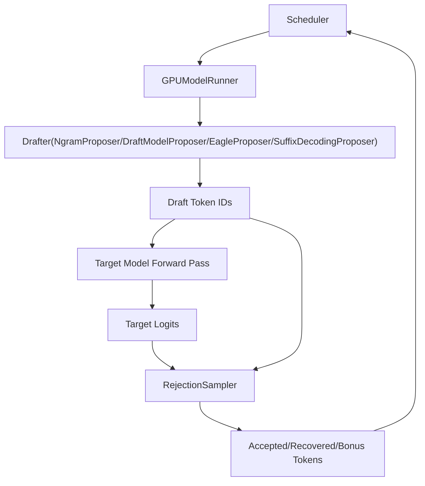
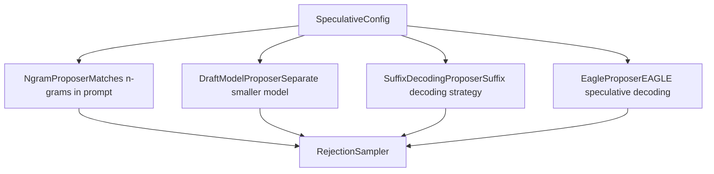
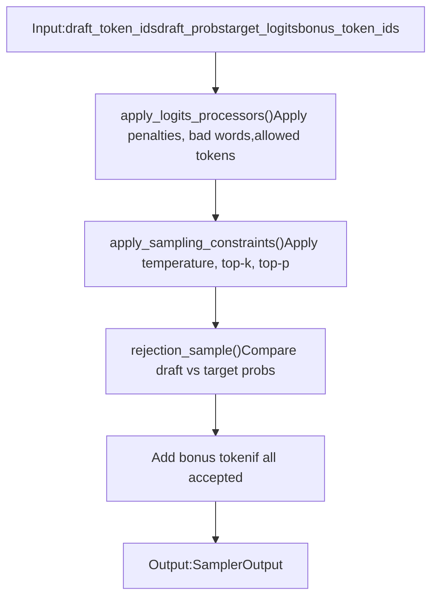

# Speculative Decoding

Relevant source files

-   [tests/basic\_correctness/test\_cumem.py](https://github.com/vllm-project/vllm/blob/7cc302dd/tests/basic_correctness/test_cumem.py)
-   [tests/model\_executor/test\_eagle\_quantization.py](https://github.com/vllm-project/vllm/blob/7cc302dd/tests/model_executor/test_eagle_quantization.py)
-   [tests/utils.py](https://github.com/vllm-project/vllm/blob/7cc302dd/tests/utils.py)
-   [tests/v1/core/test\_async\_scheduler.py](https://github.com/vllm-project/vllm/blob/7cc302dd/tests/v1/core/test_async_scheduler.py)
-   [tests/v1/e2e/spec\_decode/test\_spec\_decode.py](https://github.com/vllm-project/vllm/blob/7cc302dd/tests/v1/e2e/spec_decode/test_spec_decode.py)
-   [tests/v1/sample/test\_logprobs.py](https://github.com/vllm-project/vllm/blob/7cc302dd/tests/v1/sample/test_logprobs.py)
-   [tests/v1/sample/test\_rejection\_sampler.py](https://github.com/vllm-project/vllm/blob/7cc302dd/tests/v1/sample/test_rejection_sampler.py)
-   [tests/v1/sample/test\_sampler.py](https://github.com/vllm-project/vllm/blob/7cc302dd/tests/v1/sample/test_sampler.py)
-   [tests/v1/sample/utils.py](https://github.com/vllm-project/vllm/blob/7cc302dd/tests/v1/sample/utils.py)
-   [tests/v1/spec\_decode/test\_eagle.py](https://github.com/vllm-project/vllm/blob/7cc302dd/tests/v1/spec_decode/test_eagle.py)
-   [tests/v1/spec\_decode/test\_mtp.py](https://github.com/vllm-project/vllm/blob/7cc302dd/tests/v1/spec_decode/test_mtp.py)
-   [tests/v1/spec\_decode/test\_ngram.py](https://github.com/vllm-project/vllm/blob/7cc302dd/tests/v1/spec_decode/test_ngram.py)
-   [vllm/config/speculative.py](https://github.com/vllm-project/vllm/blob/7cc302dd/vllm/config/speculative.py)
-   [vllm/model\_executor/models/deepseek\_eagle.py](https://github.com/vllm-project/vllm/blob/7cc302dd/vllm/model_executor/models/deepseek_eagle.py)
-   [vllm/model\_executor/models/llama.py](https://github.com/vllm-project/vllm/blob/7cc302dd/vllm/model_executor/models/llama.py)
-   [vllm/model\_executor/models/llama4\_eagle.py](https://github.com/vllm-project/vllm/blob/7cc302dd/vllm/model_executor/models/llama4_eagle.py)
-   [vllm/model\_executor/models/llama\_eagle.py](https://github.com/vllm-project/vllm/blob/7cc302dd/vllm/model_executor/models/llama_eagle.py)
-   [vllm/model\_executor/models/llama\_eagle3.py](https://github.com/vllm-project/vllm/blob/7cc302dd/vllm/model_executor/models/llama_eagle3.py)
-   [vllm/model\_executor/models/qwen2.py](https://github.com/vllm-project/vllm/blob/7cc302dd/vllm/model_executor/models/qwen2.py)
-   [vllm/model\_executor/models/qwen3.py](https://github.com/vllm-project/vllm/blob/7cc302dd/vllm/model_executor/models/qwen3.py)
-   [vllm/model\_executor/models/utils.py](https://github.com/vllm-project/vllm/blob/7cc302dd/vllm/model_executor/models/utils.py)
-   [vllm/transformers\_utils/configs/eagle.py](https://github.com/vllm-project/vllm/blob/7cc302dd/vllm/transformers_utils/configs/eagle.py)
-   [vllm/transformers\_utils/configs/extract\_hidden\_states.py](https://github.com/vllm-project/vllm/blob/7cc302dd/vllm/transformers_utils/configs/extract_hidden_states.py)
-   [vllm/transformers\_utils/configs/medusa.py](https://github.com/vllm-project/vllm/blob/7cc302dd/vllm/transformers_utils/configs/medusa.py)
-   [vllm/utils/mem\_utils.py](https://github.com/vllm-project/vllm/blob/7cc302dd/vllm/utils/mem_utils.py)
-   [vllm/v1/sample/metadata.py](https://github.com/vllm-project/vllm/blob/7cc302dd/vllm/v1/sample/metadata.py)
-   [vllm/v1/sample/ops/bad\_words.py](https://github.com/vllm-project/vllm/blob/7cc302dd/vllm/v1/sample/ops/bad_words.py)
-   [vllm/v1/sample/rejection\_sampler.py](https://github.com/vllm-project/vllm/blob/7cc302dd/vllm/v1/sample/rejection_sampler.py)
-   [vllm/v1/sample/sampler.py](https://github.com/vllm-project/vllm/blob/7cc302dd/vllm/v1/sample/sampler.py)
-   [vllm/v1/spec\_decode/draft\_model.py](https://github.com/vllm-project/vllm/blob/7cc302dd/vllm/v1/spec_decode/draft_model.py)
-   [vllm/v1/spec\_decode/eagle.py](https://github.com/vllm-project/vllm/blob/7cc302dd/vllm/v1/spec_decode/eagle.py)
-   [vllm/v1/spec\_decode/ngram\_proposer.py](https://github.com/vllm-project/vllm/blob/7cc302dd/vllm/v1/spec_decode/ngram_proposer.py)
-   [vllm/v1/spec\_decode/suffix\_decoding.py](https://github.com/vllm-project/vllm/blob/7cc302dd/vllm/v1/spec_decode/suffix_decoding.py)
-   [vllm/v1/spec\_decode/utils.py](https://github.com/vllm-project/vllm/blob/7cc302dd/vllm/v1/spec_decode/utils.py)

## Purpose and Scope

This document describes vLLM's speculative decoding implementation in the V1 engine architecture. Speculative decoding is an inference optimization technique that generates multiple tokens per forward pass by proposing "draft" tokens that are verified against the target model's output distribution. This system supports multiple draft token generation strategies including N-gram matching, draft models, EAGLE, and suffix decoding.

For information about the general sampling process without speculative decoding, see [Sampling and Token Generation](/vllm-project/vllm/4.4-sampling-and-token-generation). For configuration options, see [VllmConfig and Specialized Configuration Objects](/vllm-project/vllm/2.2-vllmconfig-and-specialized-configuration-objects).

## Architecture Overview

Speculative decoding in vLLM consists of two main phases: **draft token proposal** and **verification via rejection sampling**. The system is integrated into the `GPUModelRunner` and operates on the last pipeline parallel rank.

### High-Level Flow Diagram

**Sources**: [vllm/v1/sample/rejection\_sampler.py30-51](https://github.com/vllm-project/vllm/blob/7cc302dd/vllm/v1/sample/rejection_sampler.py#L30-L51) [vllm/config/speculative.py64-165](https://github.com/vllm-project/vllm/blob/7cc302dd/vllm/config/speculative.py#L64-L165)

## Proposer Types

vLLM supports several proposer implementations for generating draft tokens. The proposer is selected based on `speculative_config.method`.

### Proposer Selection and Initialization

**Sources**: [vllm/config/speculative.py51-60](https://github.com/vllm-project/vllm/blob/7cc302dd/vllm/config/speculative.py#L51-L60) [vllm/v1/spec\_decode/eagle.py59-127](https://github.com/vllm-project/vllm/blob/7cc302dd/vllm/v1/spec_decode/eagle.py#L59-L127)

### N-gram Proposer

The `NgramProposer` generates draft tokens by finding the longest matching n-gram in the prompt and proposing the tokens that follow the match. This is a zero-cost approach that requires no additional model weights.

**Key Parameters**:

-   `prompt_lookup_min`: Minimum n-gram length to match. [vllm/config/speculative.py131-132](https://github.com/vllm-project/vllm/blob/7cc302dd/vllm/config/speculative.py#L131-L132)
-   `prompt_lookup_max`: Maximum n-gram length to match. [vllm/config/speculative.py127-128](https://github.com/vllm-project/vllm/blob/7cc302dd/vllm/config/speculative.py#L127-L128)
-   `num_speculative_tokens`: Total number of tokens to propose. [vllm/config/speculative.py71-73](https://github.com/vllm-project/vllm/blob/7cc302dd/vllm/config/speculative.py#L71-L73)

### EAGLE and EAGLE3 Proposers

The `EagleProposer` implements the EAGLE (Extrapolation Algorithm for Greater Language-model Efficiency) approach. Unlike standard draft models, EAGLE uses a combination of token embeddings and hidden states from the previous step to predict the next token.

**EAGLE3 Enhancements**:

-   **Auxiliary Hidden States**: EAGLE3 can utilize auxiliary hidden states from the target model to improve prediction accuracy. [vllm/v1/spec\_decode/eagle.py116-118](https://github.com/vllm-project/vllm/blob/7cc302dd/vllm/v1/spec_decode/eagle.py#L116-L118)
-   **Parallel Drafting**: Supports generating multiple tokens in parallel rather than sequentially if the model is trained for it. [vllm/v1/spec\_decode/eagle.py87-90](https://github.com/vllm-project/vllm/blob/7cc302dd/vllm/v1/spec_decode/eagle.py#L87-L90)

**EAGLE Model Architecture**:

-   `Eagle3LlamaForCausalLM`: Specialized Llama implementation for EAGLE3. [vllm/v1/spec\_decode/eagle.py25](https://github.com/vllm-project/vllm/blob/7cc302dd/vllm/v1/spec_decode/eagle.py#L25-L25) [vllm/model\_executor/models/llama\_eagle3.py133-173](https://github.com/vllm-project/vllm/blob/7cc302dd/vllm/model_executor/models/llama_eagle3.py#L133-L173)
-   `LlamaDecoderLayer`: Modified layer that handles concatenated embeddings and hidden states in the first layer. [vllm/model\_executor/models/llama\_eagle3.py38-67](https://github.com/vllm-project/vllm/blob/7cc302dd/vllm/model_executor/models/llama_eagle3.py#L38-L67)

**Sources**: [vllm/v1/spec\_decode/eagle.py59-165](https://github.com/vllm-project/vllm/blob/7cc302dd/vllm/v1/spec_decode/eagle.py#L59-L165) [vllm/model\_executor/models/llama\_eagle3.py1-122](https://github.com/vllm-project/vllm/blob/7cc302dd/vllm/model_executor/models/llama_eagle3.py#L1-L122)

### Suffix Decoding Proposer

The `SuffixDecodingProposer` implements a strategy that leverages global and prompt-specific suffix trees to speculate tokens based on historical generation patterns.

**Key Parameters**:

-   `suffix_decoding_max_tree_depth`: Limits the sum of prefix match and speculation lengths. [vllm/config/speculative.py157-159](https://github.com/vllm-project/vllm/blob/7cc302dd/vllm/config/speculative.py#L157-L159)
-   `suffix_decoding_max_cached_requests`: Maximum requests to cache in the global suffix tree. [vllm/config/speculative.py161-165](https://github.com/vllm-project/vllm/blob/7cc302dd/vllm/config/speculative.py#L161-L165)

**Sources**: [vllm/config/speculative.py157-165](https://github.com/vllm-project/vllm/blob/7cc302dd/vllm/config/speculative.py#L157-L165) [vllm/v1/spec\_decode/suffix\_decoding.py1-12](https://github.com/vllm-project/vllm/blob/7cc302dd/vllm/v1/spec_decode/suffix_decoding.py#L1-L12)

## Rejection Sampling

The `RejectionSampler` verifies draft tokens against the target model's probability distribution. It strictly follows the algorithm described in [arXiv:2211.17192](https://arxiv.org/abs/2211.17192).

### Token Classification

The rejection sampler classifies generated tokens into three categories:

| Token Type | Description | Source |
| --- | --- | --- |
| **Accepted Tokens** | Draft tokens that match the target model's distribution within a threshold. | [vllm/v1/sample/rejection\_sampler.py35-36](https://github.com/vllm-project/vllm/blob/7cc302dd/vllm/v1/sample/rejection_sampler.py#L35-L36) |
| **Recovered Tokens** | Tokens sampled from an adjusted distribution when a draft token is rejected. | [vllm/v1/sample/rejection\_sampler.py37-39](https://github.com/vllm-project/vllm/blob/7cc302dd/vllm/v1/sample/rejection_sampler.py#L37-L39) |
| **Bonus Tokens** | An additional token sampled from the target distribution if all drafts are accepted. | [vllm/v1/sample/rejection\_sampler.py40-47](https://github.com/vllm-project/vllm/blob/7cc302dd/vllm/v1/sample/rejection_sampler.py#L40-L47) |

**Output Formula**: `output tokens = accepted tokens + recovered tokens + bonus tokens`. [vllm/v1/sample/rejection\_sampler.py50](https://github.com/vllm-project/vllm/blob/7cc302dd/vllm/v1/sample/rejection_sampler.py#L50-L50)

### Rejection Sampling Algorithm Flow

**Sources**: [vllm/v1/sample/rejection\_sampler.py60-150](https://github.com/vllm-project/vllm/blob/7cc302dd/vllm/v1/sample/rejection_sampler.py#L60-L150)

### Logits Processing and Constraints

Before rejection, the target logits undergo several transformations:

1.  **Logits Processors**: Applies processors that can impact greedy sampling (e.g., `MinTokensLogitsProcessor`). [vllm/v1/sample/rejection\_sampler.py129-131](https://github.com/vllm-project/vllm/blob/7cc302dd/vllm/v1/sample/rejection_sampler.py#L129-L131) [vllm/v1/sample/sampler.py33-36](https://github.com/vllm-project/vllm/blob/7cc302dd/vllm/v1/sample/sampler.py#L33-L36)
2.  **Sampling Constraints**: Applies temperature, top-k, and top-p filtering. [vllm/v1/sample/rejection\_sampler.py135-139](https://github.com/vllm-project/vllm/blob/7cc302dd/vllm/v1/sample/rejection_sampler.py#L135-L139) [vllm/v1/sample/ops/topk\_topp\_sampler.py17](https://github.com/vllm-project/vllm/blob/7cc302dd/vllm/v1/sample/ops/topk_topp_sampler.py#L17-L17)
3.  **Penalties**: Applies repetition, frequency, and presence penalties. [vllm/v1/sample/ops/penalties.py16-17](https://github.com/vllm-project/vllm/blob/7cc302dd/vllm/v1/sample/ops/penalties.py#L16-L17) [vllm/v1/sample/sampler.py37-40](https://github.com/vllm-project/vllm/blob/7cc302dd/vllm/v1/sample/sampler.py#L37-L40)

**Sources**: [vllm/v1/sample/rejection\_sampler.py120-140](https://github.com/vllm-project/vllm/blob/7cc302dd/vllm/v1/sample/rejection_sampler.py#L120-L140) [vllm/v1/sample/sampler.py20-59](https://github.com/vllm-project/vllm/blob/7cc302dd/vllm/v1/sample/sampler.py#L20-L59)

## Implementation Details

### EAGLE Input Preparation

EAGLE requires complex input preparation because it operates on both embeddings and hidden states. The `EagleProposer` uses specialized Triton kernels for efficient data movement:

-   `eagle_prepare_inputs_padded_kernel`: Prepares input tensors for the EAGLE forward pass. [vllm/v1/spec\_decode/eagle.py46](https://github.com/vllm-project/vllm/blob/7cc302dd/vllm/v1/spec_decode/eagle.py#L46-L46)
-   `copy_and_expand_eagle_inputs_kernel`: Handles expanding hidden states for the speculative tree. [vllm/v1/spec\_decode/eagle.py45](https://github.com/vllm-project/vllm/blob/7cc302dd/vllm/v1/spec_decode/eagle.py#L45-L45)
-   `eagle_prepare_next_token_padded_kernel`: Prepares next token inputs. [vllm/v1/spec\_decode/eagle.py47](https://github.com/vllm-project/vllm/blob/7cc302dd/vllm/v1/spec_decode/eagle.py#L47-L47)

**Sources**: [vllm/v1/spec\_decode/eagle.py42-50](https://github.com/vllm-project/vllm/blob/7cc302dd/vllm/v1/spec_decode/eagle.py#L42-L50)

### Draft Token Management

Draft tokens are managed through the `SpecDecodeMetadata` which tracks indices for verification:

-   `target_logits_indices`: Indices in the flattened logits tensor corresponding to speculative positions. [vllm/v1/sample/rejection\_sampler.py94](https://github.com/vllm-project/vllm/blob/7cc302dd/vllm/v1/sample/rejection_sampler.py#L94-L94)
-   `bonus_logits_indices`: Indices corresponding to the potential bonus token position at the end of the speculative window. [vllm/v1/sample/rejection\_sampler.py93](https://github.com/vllm-project/vllm/blob/7cc302dd/vllm/v1/sample/rejection_sampler.py#L93-L93)

**Sources**: [vllm/v1/sample/rejection\_sampler.py91-115](https://github.com/vllm-project/vllm/blob/7cc302dd/vllm/v1/sample/rejection_sampler.py#L91-L115)

### Acceptance Metrics

vLLM tracks the efficiency of speculative decoding via acceptance metrics:

-   **Acceptance Rate**: The ratio of accepted draft tokens to total proposed draft tokens.
-   **System Speedup**: The empirical increase in tokens-per-second compared to non-speculative execution.

These are monitored through the `SamplerOutput` which includes `sampled_token_ids` (including bonus tokens) and `logprobs_tensors` for verification. [vllm/v1/sample/rejection\_sampler.py163-165](https://github.com/vllm-project/vllm/blob/7cc302dd/vllm/v1/sample/rejection_sampler.py#L163-L165)

**Sources**: [vllm/v1/sample/rejection\_sampler.py152-165](https://github.com/vllm-project/vllm/blob/7cc302dd/vllm/v1/sample/rejection_sampler.py#L152-L165) [vllm/v1/outputs.py12-13](https://github.com/vllm-project/vllm/blob/7cc302dd/vllm/v1/outputs.py#L12-L13)
