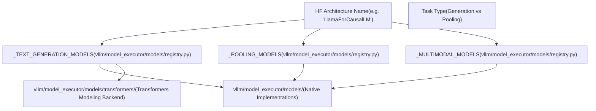
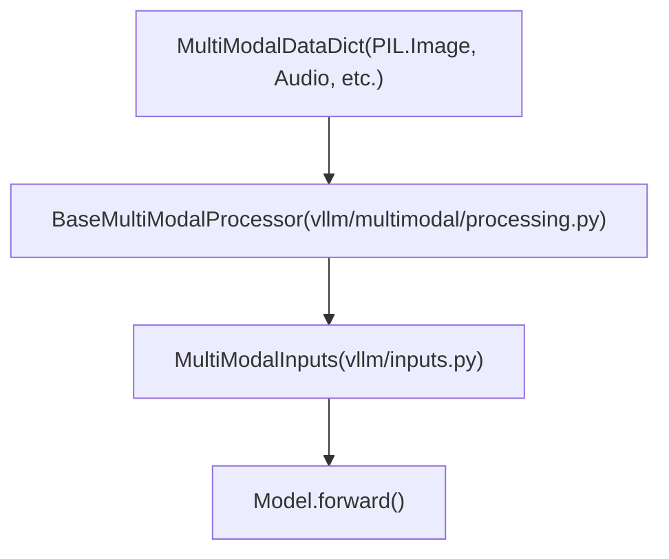

# Model Support and Registration

Relevant source files

-   [docs/.nav.yml](https://github.com/vllm-project/vllm/blob/7cc302dd/docs/.nav.yml)
-   [docs/contributing/model/README.md](https://github.com/vllm-project/vllm/blob/7cc302dd/docs/contributing/model/README.md?plain=1)
-   [docs/contributing/model/basic.md](https://github.com/vllm-project/vllm/blob/7cc302dd/docs/contributing/model/basic.md?plain=1)
-   [docs/contributing/model/multimodal.md](https://github.com/vllm-project/vllm/blob/7cc302dd/docs/contributing/model/multimodal.md?plain=1)
-   [docs/contributing/model/registration.md](https://github.com/vllm-project/vllm/blob/7cc302dd/docs/contributing/model/registration.md?plain=1)
-   [docs/contributing/model/tests.md](https://github.com/vllm-project/vllm/blob/7cc302dd/docs/contributing/model/tests.md?plain=1)
-   [docs/contributing/model/transcription.md](https://github.com/vllm-project/vllm/blob/7cc302dd/docs/contributing/model/transcription.md?plain=1)
-   [docs/deployment/frameworks/hf\_inference\_endpoints.md](https://github.com/vllm-project/vllm/blob/7cc302dd/docs/deployment/frameworks/hf_inference_endpoints.md?plain=1)
-   [docs/design/plugin\_system.md](https://github.com/vllm-project/vllm/blob/7cc302dd/docs/design/plugin_system.md?plain=1)
-   [docs/examples/README.md](https://github.com/vllm-project/vllm/blob/7cc302dd/docs/examples/README.md?plain=1)
-   [docs/features/README.md](https://github.com/vllm-project/vllm/blob/7cc302dd/docs/features/README.md?plain=1)
-   [docs/features/prompt\_embeds.md](https://github.com/vllm-project/vllm/blob/7cc302dd/docs/features/prompt_embeds.md?plain=1)
-   [docs/getting\_started/quickstart.md](https://github.com/vllm-project/vllm/blob/7cc302dd/docs/getting_started/quickstart.md?plain=1)
-   [docs/mkdocs/hooks/url\_schemes.py](https://github.com/vllm-project/vllm/blob/7cc302dd/docs/mkdocs/hooks/url_schemes.py)
-   [docs/models/generative\_models.md](https://github.com/vllm-project/vllm/blob/7cc302dd/docs/models/generative_models.md?plain=1)
-   [docs/models/pooling\_models/classify.md](https://github.com/vllm-project/vllm/blob/7cc302dd/docs/models/pooling_models/classify.md?plain=1)
-   [docs/models/pooling\_models/embed.md](https://github.com/vllm-project/vllm/blob/7cc302dd/docs/models/pooling_models/embed.md?plain=1)
-   [docs/models/pooling\_models/reward.md](https://github.com/vllm-project/vllm/blob/7cc302dd/docs/models/pooling_models/reward.md?plain=1)
-   [docs/models/pooling\_models/scoring.md](https://github.com/vllm-project/vllm/blob/7cc302dd/docs/models/pooling_models/scoring.md?plain=1)
-   [docs/models/supported\_models.md](https://github.com/vllm-project/vllm/blob/7cc302dd/docs/models/supported_models.md?plain=1)
-   [docs/serving/offline\_inference.md](https://github.com/vllm-project/vllm/blob/7cc302dd/docs/serving/offline_inference.md?plain=1)
-   [docs/serving/openai\_compatible\_server.md](https://github.com/vllm-project/vllm/blob/7cc302dd/docs/serving/openai_compatible_server.md?plain=1)
-   [examples/offline\_inference/audio\_language.py](https://github.com/vllm-project/vllm/blob/7cc302dd/examples/offline_inference/audio_language.py)
-   [examples/offline\_inference/vision\_language.py](https://github.com/vllm-project/vllm/blob/7cc302dd/examples/offline_inference/vision_language.py)
-   [examples/offline\_inference/vision\_language\_multi\_image.py](https://github.com/vllm-project/vllm/blob/7cc302dd/examples/offline_inference/vision_language_multi_image.py)
-   [examples/online\_serving/disaggregated\_encoder/README.md](https://github.com/vllm-project/vllm/blob/7cc302dd/examples/online_serving/disaggregated_encoder/README.md?plain=1)
-   [tests/distributed/test\_pipeline\_parallel.py](https://github.com/vllm-project/vllm/blob/7cc302dd/tests/distributed/test_pipeline_parallel.py)
-   [tests/models/multimodal/generation/test\_common.py](https://github.com/vllm-project/vllm/blob/7cc302dd/tests/models/multimodal/generation/test_common.py)
-   [tests/models/multimodal/generation/vlm\_utils/model\_utils.py](https://github.com/vllm-project/vllm/blob/7cc302dd/tests/models/multimodal/generation/vlm_utils/model_utils.py)
-   [tests/models/multimodal/processing/test\_common.py](https://github.com/vllm-project/vllm/blob/7cc302dd/tests/models/multimodal/processing/test_common.py)
-   [tests/models/registry.py](https://github.com/vllm-project/vllm/blob/7cc302dd/tests/models/registry.py)
-   [tests/models/test\_initialization.py](https://github.com/vllm-project/vllm/blob/7cc302dd/tests/models/test_initialization.py)
-   [vllm/model\_executor/models/config.py](https://github.com/vllm-project/vllm/blob/7cc302dd/vllm/model_executor/models/config.py)
-   [vllm/model\_executor/models/mistral\_large\_3\_eagle.py](https://github.com/vllm-project/vllm/blob/7cc302dd/vllm/model_executor/models/mistral_large_3_eagle.py)
-   [vllm/model\_executor/models/registry.py](https://github.com/vllm-project/vllm/blob/7cc302dd/vllm/model_executor/models/registry.py)
-   [vllm/transformers\_utils/config.py](https://github.com/vllm-project/vllm/blob/7cc302dd/vllm/transformers_utils/config.py)
-   [vllm/transformers\_utils/configs/\_\_init\_\_.py](https://github.com/vllm-project/vllm/blob/7cc302dd/vllm/transformers_utils/configs/__init__.py)
-   [vllm/transformers\_utils/configs/mistral.py](https://github.com/vllm-project/vllm/blob/7cc302dd/vllm/transformers_utils/configs/mistral.py)
-   [vllm/transformers\_utils/model\_arch\_config\_convertor.py](https://github.com/vllm-project/vllm/blob/7cc302dd/vllm/transformers_utils/model_arch_config_convertor.py)

## Purpose and Scope

This document explains how vLLM determines which model implementation to use for a given model and how new models are registered in the system. It covers:

-   The model registry system that maps HuggingFace architectures to vLLM implementations.
-   Architecture detection and configuration loading mechanisms.
-   Model implementation backends (native vLLM and Transformers modeling backend).
-   Model capability interfaces and queries.
-   Multimodal model registration and data flow.

For information about using supported models, see the documentation at [docs/models/supported\_models.md](https://github.com/vllm-project/vllm/blob/7cc302dd/docs/models/supported_models.md?plain=1)

---

## Model Registry Architecture

The model registry is the central system that maps model architecture names from HuggingFace `config.json` files to vLLM's model implementation classes. When a user loads a model, vLLM queries this registry to determine which Python class should handle the model's execution.

### Registry Structure

The registry maintains separate dictionaries for different model types, such as text generation, pooling (embedding), and multimodal models.

**Model Registry Entities Mapping**


**Registry Mapping Format** Each registry entry maps an architecture name to a tuple `(module_name, class_name)`:

```
_TEXT_GENERATION_MODELS = {    "LlamaForCausalLM": ("llama", "LlamaForCausalLM"),    "Qwen2ForCausalLM": ("qwen2", "Qwen2ForCausalLM"),    "MistralForCausalLM": ("mistral", "MistralForCausalLM"),    # Many architectures may map to the same implementation    "AquilaForCausalLM": ("llama", "LlamaForCausalLM"),    "InternLM3ForCausalLM": ("llama", "LlamaForCausalLM"),}
```
[vllm/model\_executor/models/registry.py70-152](https://github.com/vllm-project/vllm/blob/7cc302dd/vllm/model_executor/models/registry.py#L70-L152)

The module name is relative to `vllm.model_executor.models`, so `"llama"` refers to `vllm/model_executor/models/llama.py`.

**Sources:** [vllm/model\_executor/models/registry.py70-211](https://github.com/vllm-project/vllm/blob/7cc302dd/vllm/model_executor/models/registry.py#L70-L211) [vllm/model\_executor/models/registry.py213-278](https://github.com/vllm-project/vllm/blob/7cc302dd/vllm/model_executor/models/registry.py#L213-L278) [vllm/model\_executor/models/registry.py311-527](https://github.com/vllm-project/vllm/blob/7cc302dd/vllm/model_executor/models/registry.py#L311-L527)

---

## Architecture Detection and Config Loading

vLLM supports multiple configuration formats and custom configuration classes for models that extend standard HuggingFace properties or define new architectures.

### Configuration Loading Flow

**Config Loading Logic**

> **[Mermaid sequence]**
> *(图表结构无法解析)*

**Custom Configuration Registry** The `_CONFIG_REGISTRY` in `vllm/transformers_utils/config.py` handles models with non-standard configurations or those requiring vLLM-specific overrides. [vllm/transformers\_utils/config.py80-121](https://github.com/vllm-project/vllm/blob/7cc302dd/vllm/transformers_utils/config.py#L80-L121)

| Model Type | Custom Config Class | Purpose |
| --- | --- | --- |
| `afmoe` | `AfmoeConfig` | MoE specific params |
| `eagle` | `EAGLEConfig` | Speculative decoding |
| `qwen3_vl` | `Qwen3VLConfig` | Multimodal resolution |
| `flex_olmo` | `FlexOlmoConfig` | Hybrid architecture |

**Sources:** [vllm/transformers\_utils/config.py80-121](https://github.com/vllm-project/vllm/blob/7cc302dd/vllm/transformers_utils/config.py#L80-L121) [vllm/transformers\_utils/config.py155-202](https://github.com/vllm-project/vllm/blob/7cc302dd/vllm/transformers_utils/config.py#L155-L202) [vllm/transformers\_utils/configs/\_\_init\_\_.py17-73](https://github.com/vllm-project/vllm/blob/7cc302dd/vllm/transformers_utils/configs/__init__.py#L17-L73)

---

## Model Implementation Backends

vLLM supports two primary model backends:

### 1\. Native vLLM Implementations

Located in `vllm/model_executor/models/`, these are highly optimized implementations using vLLM's custom kernels (e.g., `FusedMoE`) and attention backends. [docs/models/supported\_models.md10-14](https://github.com/vllm-project/vllm/blob/7cc302dd/docs/models/supported_models.md?plain=1#L10-L14)

### 2\. Transformers Modeling Backend

For models without a native implementation, vLLM can use the "Transformers modeling backend". This allows running models directly from the HuggingFace `transformers` library while still benefiting from vLLM's PagedAttention and continuous batching. [docs/models/supported\_models.md16-47](https://github.com/vllm-project/vllm/blob/7cc302dd/docs/models/supported_models.md?plain=1#L16-L47)

**Compatibility Requirements for Transformers Backend:**

-   Model must be a Transformers-compatible custom model (with `auto_map`).
-   Attention layers must use `ALL_ATTENTION_FUNCTIONS`.
-   Model must set `_supports_attention_backend = True`.
-   For MoE, the sparse block must have an `experts` attribute.

**Sources:** [docs/models/supported\_models.md16-142](https://github.com/vllm-project/vllm/blob/7cc302dd/docs/models/supported_models.md?plain=1#L16-L142) [vllm/model\_executor/models/registry.py279-308](https://github.com/vllm-project/vllm/blob/7cc302dd/vllm/model_executor/models/registry.py#L279-L308)

---

## Model Capability Interfaces

vLLM uses an interface system to query model capabilities dynamically. This avoids hardcoding architecture checks throughout the engine.

| Interface / Function | Code Entity | Purpose |
| --- | --- | --- |
| Multimodal Support | `supports_multimodal()` | Detects if model accepts non-text inputs. |
| Pipeline Parallel | `supports_pp()` | Checks if model logic allows PP splitting. |
| Attention Free | `is_attention_free()` | Identifies RNN/Mamba-style models. |
| Pooling Support | `is_pooling_model()` | Identifies embedding/classification models. |
| Transcription | `supports_transcription()` | Identifies ASR models. |

**Sources:** [vllm/model\_executor/models/registry.py46-58](https://github.com/vllm-project/vllm/blob/7cc302dd/vllm/model_executor/models/registry.py#L46-L58) [vllm/model\_executor/models/interfaces\_base.py59-66](https://github.com/vllm-project/vllm/blob/7cc302dd/vllm/model_executor/models/interfaces_base.py#L59-L66)

---

## Multimodal Model Support

Multimodal models (VLMs, Audio-LLMs) require special registration to handle diverse data types like images, video, and audio.

### Multimodal Registry

The `_MULTIMODAL_MODELS` registry maps architectures to implementations that can handle `MultiModalDataDict` inputs. [vllm/model\_executor/models/registry.py311-527](https://github.com/vllm-project/vllm/blob/7cc302dd/vllm/model_executor/models/registry.py#L311-L527)

**Supported Modalities in Registry:**

-   **Vision:** `Qwen2_5VL`, `Llava`, `Aria`, `Idefics3`.
-   **Audio:** `Ultravox`, `Qwen2Audio`.
-   **Video:** `Qwen2.5VL`, `HunyuanVideo`.

### MultiModalDataDict and Processing

Multimodal inputs are passed via `MultiModalDataDict`, which is processed by model-specific processors before being fed into the model's vision/audio encoders.

**Multimodal Data Flow**


For details, see [Multimodal Model Support](/vllm-project/vllm/5.4-multimodal-model-support) and [Multimodal Data Processing](/vllm-project/vllm/5.5-multimodal-data-processing).

**Sources:** [vllm/multimodal/processing.py21-25](https://github.com/vllm-project/vllm/blob/7cc302dd/vllm/multimodal/processing.py#L21-L25) [vllm/inputs.py18](https://github.com/vllm-project/vllm/blob/7cc302dd/vllm/inputs.py#L18-L18) [tests/models/multimodal/processing/test\_common.py18-24](https://github.com/vllm-project/vllm/blob/7cc302dd/tests/models/multimodal/processing/test_common.py#L18-L24)

---

## Configuration Verification and Update

Before model execution, vLLM provides a mechanism to verify and update model configurations based on engine settings or hardware capabilities via the `VerifyAndUpdateConfig` interface.

**Example Config Overrides:**

-   **DeepSeek V3:** Automatically sets `cache_dtype` to `auto` if `bfloat16` is requested for performance. [vllm/model\_executor/models/config.py30-44](https://github.com/vllm-project/vllm/blob/7cc302dd/vllm/model_executor/models/config.py#L30-L44)
-   **Hybrid Models:** Disables `calculate_kv_scales` for models with recurrent layers (Mamba, SSM) to avoid corruption from uninitialized state. [vllm/model\_executor/models/config.py103-130](https://github.com/vllm-project/vllm/blob/7cc302dd/vllm/model_executor/models/config.py#L103-L130)

**Sources:** [vllm/model\_executor/models/config.py20-28](https://github.com/vllm-project/vllm/blob/7cc302dd/vllm/model_executor/models/config.py#L20-L28) [vllm/model\_executor/models/config.py103-130](https://github.com/vllm-project/vllm/blob/7cc302dd/vllm/model_executor/models/config.py#L103-L130)

---

## Child Pages

-   [Model Registry and Architecture Detection](/vllm-project/vllm/5.1-model-registry-and-architecture-detection) — Detailed mapping of HF architectures to vLLM implementations and capability queries.
-   [Configuration Loading and Parsing](/vllm-project/vllm/5.2-configuration-loading-and-parsing) — Documentation on `HFConfigParser`, `MistralConfigParser`, and configuration adaptation.
-   [Transformers Modeling Backend](/vllm-project/vllm/5.3-transformers-modeling-backend) — Technical details on using the Transformers backend for non-native models.
-   [Multimodal Model Support](/vllm-project/vllm/5.4-multimodal-model-support) — Interface definitions and supported modalities for VLMs and Audio models.
-   [Multimodal Data Processing](/vllm-project/vllm/5.5-multimodal-data-processing) — Handling of `MultiModalDataDict` and tensor conversion for images/audio/video.
