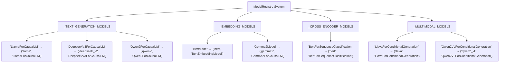
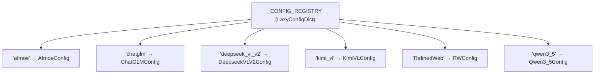
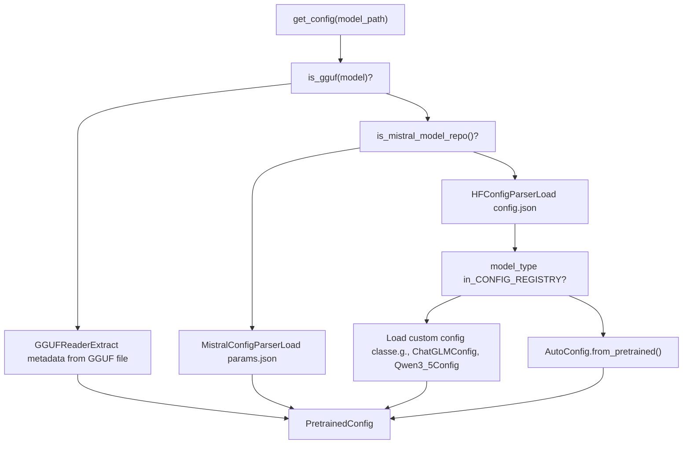
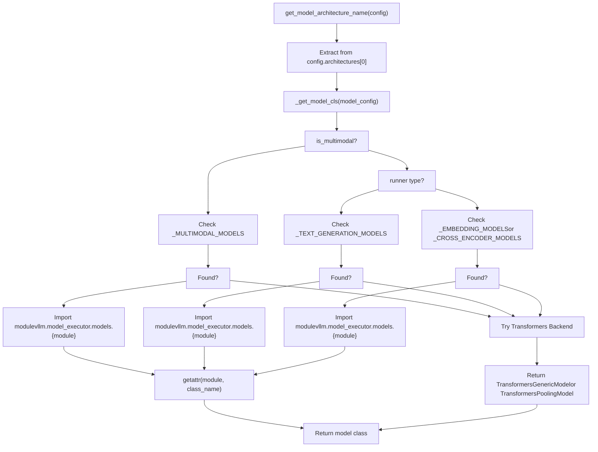
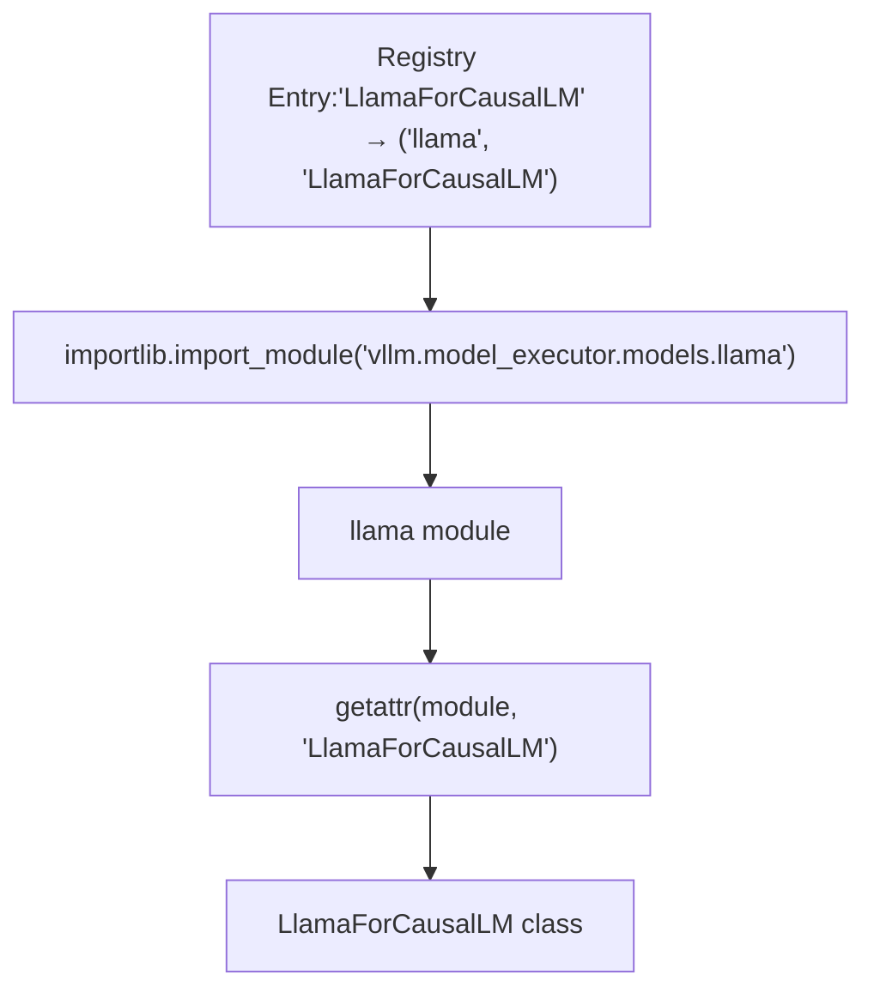
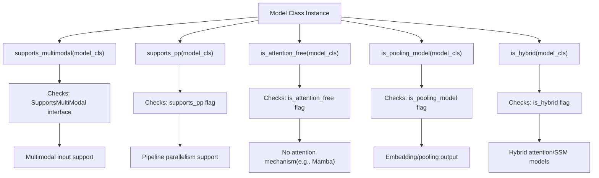

# Model Registry and Architecture Detection

Relevant source files

-   [docs/models/supported\_models.md](https://github.com/vllm-project/vllm/blob/7cc302dd/docs/models/supported_models.md?plain=1)
-   [examples/offline\_inference/audio\_language.py](https://github.com/vllm-project/vllm/blob/7cc302dd/examples/offline_inference/audio_language.py)
-   [examples/offline\_inference/vision\_language.py](https://github.com/vllm-project/vllm/blob/7cc302dd/examples/offline_inference/vision_language.py)
-   [examples/offline\_inference/vision\_language\_multi\_image.py](https://github.com/vllm-project/vllm/blob/7cc302dd/examples/offline_inference/vision_language_multi_image.py)
-   [examples/online\_serving/openai\_transcription\_client.py](https://github.com/vllm-project/vllm/blob/7cc302dd/examples/online_serving/openai_transcription_client.py)
-   [tests/distributed/test\_pipeline\_parallel.py](https://github.com/vllm-project/vllm/blob/7cc302dd/tests/distributed/test_pipeline_parallel.py)
-   [tests/entrypoints/openai/conftest.py](https://github.com/vllm-project/vllm/blob/7cc302dd/tests/entrypoints/openai/conftest.py)
-   [tests/entrypoints/pooling/classify/test\_online.py](https://github.com/vllm-project/vllm/blob/7cc302dd/tests/entrypoints/pooling/classify/test_online.py)
-   [tests/models/multimodal/generation/test\_common.py](https://github.com/vllm-project/vllm/blob/7cc302dd/tests/models/multimodal/generation/test_common.py)
-   [tests/models/multimodal/generation/vlm\_utils/model\_utils.py](https://github.com/vllm-project/vllm/blob/7cc302dd/tests/models/multimodal/generation/vlm_utils/model_utils.py)
-   [tests/models/multimodal/processing/test\_common.py](https://github.com/vllm-project/vllm/blob/7cc302dd/tests/models/multimodal/processing/test_common.py)
-   [tests/models/registry.py](https://github.com/vllm-project/vllm/blob/7cc302dd/tests/models/registry.py)
-   [tests/models/test\_initialization.py](https://github.com/vllm-project/vllm/blob/7cc302dd/tests/models/test_initialization.py)
-   [vllm/entrypoints/openai/generate/\_\_init\_\_.py](https://github.com/vllm-project/vllm/blob/7cc302dd/vllm/entrypoints/openai/generate/__init__.py)
-   [vllm/model\_executor/models/eagle2\_5\_vl.py](https://github.com/vllm-project/vllm/blob/7cc302dd/vllm/model_executor/models/eagle2_5_vl.py)
-   [vllm/model\_executor/models/funaudiochat.py](https://github.com/vllm-project/vllm/blob/7cc302dd/vllm/model_executor/models/funaudiochat.py)
-   [vllm/model\_executor/models/interfaces.py](https://github.com/vllm-project/vllm/blob/7cc302dd/vllm/model_executor/models/interfaces.py)
-   [vllm/model\_executor/models/mistral\_large\_3\_eagle.py](https://github.com/vllm-project/vllm/blob/7cc302dd/vllm/model_executor/models/mistral_large_3_eagle.py)
-   [vllm/model\_executor/models/openpangu\_vl.py](https://github.com/vllm-project/vllm/blob/7cc302dd/vllm/model_executor/models/openpangu_vl.py)
-   [vllm/model\_executor/models/qwen3\_asr.py](https://github.com/vllm-project/vllm/blob/7cc302dd/vllm/model_executor/models/qwen3_asr.py)
-   [vllm/model\_executor/models/registry.py](https://github.com/vllm-project/vllm/blob/7cc302dd/vllm/model_executor/models/registry.py)
-   [vllm/model\_executor/models/whisper.py](https://github.com/vllm-project/vllm/blob/7cc302dd/vllm/model_executor/models/whisper.py)
-   [vllm/transformers\_utils/config.py](https://github.com/vllm-project/vllm/blob/7cc302dd/vllm/transformers_utils/config.py)
-   [vllm/transformers\_utils/configs/\_\_init\_\_.py](https://github.com/vllm-project/vllm/blob/7cc302dd/vllm/transformers_utils/configs/__init__.py)
-   [vllm/transformers\_utils/configs/mistral.py](https://github.com/vllm-project/vllm/blob/7cc302dd/vllm/transformers_utils/configs/mistral.py)
-   [vllm/transformers\_utils/model\_arch\_config\_convertor.py](https://github.com/vllm-project/vllm/blob/7cc302dd/vllm/transformers_utils/model_arch_config_convertor.py)

This document describes how vLLM identifies and loads the appropriate model implementation based on a model's architecture. The model registry is the central mapping between HuggingFace model architectures and their corresponding vLLM implementations.

## Architecture Registry Overview

The model registry maintains mappings from HuggingFace architecture names (as they appear in `config.json` files) to vLLM model implementations. These mappings are organized by model task type.

### Registry Structure

The registry consists of primary dictionaries that categorize models by their primary use case:

vLLM Model Registry Organization


**Registry Dictionary Format**

Each entry in the registry maps an architecture name to a tuple of `(module_name, class_name)`:

-   **Key**: Architecture name from HuggingFace `config.json` (e.g., `"LlamaForCausalLM"`)
-   **Value**: Tuple of `(module_name, vllm_class_name)`
    -   `module_name`: Python module under `vllm.model_executor.models` (e.g., `"llama"`)
    -   `vllm_class_name`: The vLLM model class name (e.g., `"LlamaForCausalLM"`)

Sources: [vllm/model\_executor/models/registry.py70-211](https://github.com/vllm-project/vllm/blob/7cc302dd/vllm/model_executor/models/registry.py#L70-L211) [vllm/model\_executor/models/registry.py213-278](https://github.com/vllm-project/vllm/blob/7cc302dd/vllm/model_executor/models/registry.py#L213-L278) [vllm/model\_executor/models/registry.py280-309](https://github.com/vllm-project/vllm/blob/7cc302dd/vllm/model_executor/models/registry.py#L280-L309) [vllm/model\_executor/models/registry.py311-585](https://github.com/vllm-project/vllm/blob/7cc302dd/vllm/model_executor/models/registry.py#L311-L585)

### Architecture Aliases and Variants

Some architectures have multiple HuggingFace names that map to the same vLLM implementation:

| HF Architecture | vLLM Module | Notes |
| --- | --- | --- |
| `AquilaModel` | `llama` | Mapped to Llama implementation [vllm/model\_executor/models/registry.py74](https://github.com/vllm-project/vllm/blob/7cc302dd/vllm/model_executor/models/registry.py#L74-L74) |
| `DeepseekV32ForCausalLM` | `deepseek_v2` | DeepSeek V3 variant [vllm/model\_executor/models/registry.py98](https://github.com/vllm-project/vllm/blob/7cc302dd/vllm/model_executor/models/registry.py#L98-L98) |
| `BaiChuanForCausalLM` | `baichuan` | Upper case 'C' (baichuan-7b) [vllm/model\_executor/models/registry.py80](https://github.com/vllm-project/vllm/blob/7cc302dd/vllm/model_executor/models/registry.py#L80-L80) |
| `BaichuanForCausalLM` | `baichuan` | Lower case 'c' (baichuan-13b) [vllm/model\_executor/models/registry.py82](https://github.com/vllm-project/vllm/blob/7cc302dd/vllm/model_executor/models/registry.py#L82-L82) |
| `LLaMAForCausalLM` | `llama` | Legacy naming for decapoda-research models [vllm/model\_executor/models/registry.py152](https://github.com/vllm-project/vllm/blob/7cc302dd/vllm/model_executor/models/registry.py#L152-L152) |
| `RWForCausalLM` | `falcon` | Original Falcon models [vllm/model\_executor/models/registry.py166](https://github.com/vllm-project/vllm/blob/7cc302dd/vllm/model_executor/models/registry.py#L166-L166) |

Sources: [vllm/model\_executor/models/registry.py74-76](https://github.com/vllm-project/vllm/blob/7cc302dd/vllm/model_executor/models/registry.py#L74-L76) [vllm/model\_executor/models/registry.py80-82](https://github.com/vllm-project/vllm/blob/7cc302dd/vllm/model_executor/models/registry.py#L80-L82) [vllm/model\_executor/models/registry.py152](https://github.com/vllm-project/vllm/blob/7cc302dd/vllm/model_executor/models/registry.py#L152-L152) [vllm/model\_executor/models/registry.py166-167](https://github.com/vllm-project/vllm/blob/7cc302dd/vllm/model_executor/models/registry.py#L166-L167)

### Custom Configuration Classes

vLLM maintains a separate registry for custom configuration classes that override or extend HuggingFace configs:

Config Registry Mapping


These custom configs are used when:

-   No configuration file is defined by HF Hub or Transformers library [vllm/transformers\_utils/configs/\_\_init\_\_.py6](https://github.com/vllm-project/vllm/blob/7cc302dd/vllm/transformers_utils/configs/__init__.py#L6-L6)
-   There is a need to override the existing config to support vLLM [vllm/transformers\_utils/configs/\_\_init\_\_.py7](https://github.com/vllm-project/vllm/blob/7cc302dd/vllm/transformers_utils/configs/__init__.py#L7-L7)
-   The HF `model_type` isn't recognized by Transformers but can be mapped to an existing config [vllm/transformers\_utils/configs/\_\_init\_\_.py8-10](https://github.com/vllm-project/vllm/blob/7cc302dd/vllm/transformers_utils/configs/__init__.py#L8-L10)

Sources: [vllm/transformers\_utils/config.py70-121](https://github.com/vllm-project/vllm/blob/7cc302dd/vllm/transformers_utils/config.py#L70-L121) [vllm/transformers\_utils/configs/\_\_init\_\_.py17-73](https://github.com/vllm-project/vllm/blob/7cc302dd/vllm/transformers_utils/configs/__init__.py#L17-L73)

## Architecture Detection Process

Architecture detection follows a multi-step process that loads the model configuration and determines which vLLM implementation to use.

### Detection Flow Diagram

Model Loading and Architecture Detection

> **[Mermaid sequence]**
> *(图表结构无法解析)*

Sources: [vllm/transformers\_utils/config.py155-202](https://github.com/vllm-project/vllm/blob/7cc302dd/vllm/transformers_utils/config.py#L155-L202) [vllm/model\_executor/models/registry.py736-791](https://github.com/vllm-project/vllm/blob/7cc302dd/vllm/model_executor/models/registry.py#L736-L791) [vllm/model\_executor/models/registry.py793-890](https://github.com/vllm-project/vllm/blob/7cc302dd/vllm/model_executor/models/registry.py#L793-L890)

### Configuration Parser Selection

vLLM supports multiple configuration formats, each handled by a specialized parser:

Parser Selection Logic


Sources: [vllm/transformers\_utils/config.py242-259](https://github.com/vllm-project/vllm/blob/7cc302dd/vllm/transformers_utils/config.py#L242-L259) [vllm/transformers\_utils/config.py155-202](https://github.com/vllm-project/vllm/blob/7cc302dd/vllm/transformers_utils/config.py#L155-L202) [vllm/transformers\_utils/config.py204-240](https://github.com/vllm-project/vllm/blob/7cc302dd/vllm/transformers_utils/config.py#L204-L240)

### Architecture Name Resolution

The architecture name is extracted from the config's `architectures` field, with fallback logic:

```
# From config.json{  "architectures": ["LlamaForCausalLM"],  "model_type": "llama",  ...}
```
**Resolution Priority**:

1.  First architecture in `config.architectures` list [vllm/model\_executor/models/registry.py741-744](https://github.com/vllm-project/vllm/blob/7cc302dd/vllm/model_executor/models/registry.py#L741-L744)
2.  If `architectures` is empty, check for `speculators_config` → return `"speculators"` [vllm/transformers\_utils/config.py177-179](https://github.com/vllm-project/vllm/blob/7cc302dd/vllm/transformers_utils/config.py#L177-L179)
3.  Check `hf_overrides.architectures` if provided [vllm/transformers\_utils/config.py182-192](https://github.com/vllm-project/vllm/blob/7cc302dd/vllm/transformers_utils/config.py#L182-L192)
4.  Fall back to architecture auto-detection for Transformers backend [docs/models/supported\_models.md18-25](https://github.com/vllm-project/vllm/blob/7cc302dd/docs/models/supported_models.md?plain=1#L18-L25)

Sources: [vllm/model\_executor/models/registry.py736-755](https://github.com/vllm-project/vllm/blob/7cc302dd/vllm/model_executor/models/registry.py#L736-L755) [vllm/transformers\_utils/config.py155-161](https://github.com/vllm-project/vllm/blob/7cc302dd/vllm/transformers_utils/config.py#L155-L161)

## Model Class Resolution

Once the architecture is identified, the registry resolves it to the appropriate vLLM model class.

### Registry Lookup Process

Model Resolution Pipeline


Sources: [vllm/model\_executor/models/registry.py793-890](https://github.com/vllm-project/vllm/blob/7cc302dd/vllm/model_executor/models/registry.py#L793-L890) [vllm/model\_executor/models/registry.py892-986](https://github.com/vllm-project/vllm/blob/7cc302dd/vllm/model_executor/models/registry.py#L892-L986)

### Runner Type and Model Selection

The `runner` parameter determines which registry dictionary to search:

| Runner | Primary Registry | Fallback Registry | Use Case |
| --- | --- | --- | --- |
| `"generate"` | `_TEXT_GENERATION_MODELS` | `_MULTIMODAL_MODELS` | Text generation, chat [vllm/model\_executor/models/registry.py854-862](https://github.com/vllm-project/vllm/blob/7cc302dd/vllm/model_executor/models/registry.py#L854-L862) |
| `"pooling"` | `_EMBEDDING_MODELS` | `_CROSS_ENCODER_MODELS` | Embeddings, reranking [vllm/model\_executor/models/registry.py864-874](https://github.com/vllm-project/vllm/blob/7cc302dd/vllm/model_executor/models/registry.py#L864-L874) |

**Multimodal Override**: If `supports_multimodal(model_cls)` returns `True`, the `_MULTIMODAL_MODELS` registry takes precedence regardless of runner type [vllm/model\_executor/models/registry.py840-850](https://github.com/vllm-project/vllm/blob/7cc302dd/vllm/model_executor/models/registry.py#L840-L850)

Sources: [vllm/model\_executor/models/registry.py854-874](https://github.com/vllm-project/vllm/blob/7cc302dd/vllm/model_executor/models/registry.py#L854-L874) [vllm/model\_executor/models/registry.py46-66](https://github.com/vllm-project/vllm/blob/7cc302dd/vllm/model_executor/models/registry.py#L46-L66)

### Dynamic Module Loading

Model classes are loaded dynamically using Python's import system:

Dynamic Import Logic


This approach allows lazy loading—model implementations are only imported when needed [vllm/model\_executor/models/registry.py918-925](https://github.com/vllm-project/vllm/blob/7cc302dd/vllm/model_executor/models/registry.py#L918-L925)

Sources: [vllm/model\_executor/models/registry.py892-940](https://github.com/vllm-project/vllm/blob/7cc302dd/vllm/model_executor/models/registry.py#L892-L940)

## Model Capability Queries

The registry and associated interface functions allow querying model capabilities to determine feature support.

### Interface Detection

vLLM uses interface detection functions to detect model capabilities:

Interface Detection System


**Key Interface Functions**:

-   `supports_multimodal()`: Checks if model accepts image/video/audio inputs [vllm/model\_executor/models/interfaces.py53](https://github.com/vllm-project/vllm/blob/7cc302dd/vllm/model_executor/models/interfaces.py#L53-L53)
-   `supports_pp()`: Checks pipeline parallelism compatibility [vllm/model\_executor/models/interfaces.py56](https://github.com/vllm-project/vllm/blob/7cc302dd/vllm/model_executor/models/interfaces.py#L56-L56)
-   `is_attention_free()`: Detects models without attention (e.g., Mamba) [vllm/model\_executor/models/interfaces.py49](https://github.com/vllm-project/vllm/blob/7cc302dd/vllm/model_executor/models/interfaces.py#L49-L49)
-   `is_pooling_model()`: Determines if model outputs embeddings [vllm/model\_executor/models/interfaces\_base.py64](https://github.com/vllm-project/vllm/blob/7cc302dd/vllm/model_executor/models/interfaces_base.py#L64-L64)

Sources: [vllm/model\_executor/models/registry.py46-66](https://github.com/vllm-project/vllm/blob/7cc302dd/vllm/model_executor/models/registry.py#L46-L66) [vllm/model\_executor/models/interfaces\_base.py59-66](https://github.com/vllm-project/vllm/blob/7cc302dd/vllm/model_executor/models/interfaces_base.py#L59-L66) [vllm/model\_executor/models/interfaces.py46-58](https://github.com/vllm-project/vllm/blob/7cc302dd/vllm/model_executor/models/interfaces.py#L46-L58)

### Supported Multimodal Limits

For multimodal models, the registry can query supported modality limits. These limits define the maximum number of items per modality allowed in a single prompt [examples/offline\_inference/vision\_language.py51](https://github.com/vllm-project/vllm/blob/7cc302dd/examples/offline_inference/vision_language.py#L51-L51)

| Model | Image Limit | Video Limit | Notes |
| --- | --- | --- | --- |
| Aria | 1 | N/A | [examples/offline\_inference/vision\_language.py51](https://github.com/vllm-project/vllm/blob/7cc302dd/examples/offline_inference/vision_language.py#L51-L51) |
| Aya Vision | 1 | N/A | [examples/offline\_inference/vision\_language.py81](https://github.com/vllm-project/vllm/blob/7cc302dd/examples/offline_inference/vision_language.py#L81-L81) |
| DeepSeek-VL2 | N (dynamic) | N/A | [examples/offline\_inference/vision\_language\_multi\_image.py189](https://github.com/vllm-project/vllm/blob/7cc302dd/examples/offline_inference/vision_language_multi_image.py#L189-L189) |
| Qwen2.5-VL | N (dynamic) | N (dynamic) | [tests/models/multimodal/generation/test\_common.py127](https://github.com/vllm-project/vllm/blob/7cc302dd/tests/models/multimodal/generation/test_common.py#L127-L127) |

Sources: [vllm/model\_executor/models/interfaces.py53-55](https://github.com/vllm-project/vllm/blob/7cc302dd/vllm/model_executor/models/interfaces.py#L53-L55) [examples/offline\_inference/vision\_language.py41-118](https://github.com/vllm-project/vllm/blob/7cc302dd/examples/offline_inference/vision_language.py#L41-L118)

## Test Model Registry

The test suite maintains a parallel registry with example models for each architecture in `tests/models/registry.py`.

**Test Registry Features**:

-   Maps architectures to example HuggingFace model IDs for testing [tests/models/registry.py193-544](https://github.com/vllm-project/vllm/blob/7cc302dd/tests/models/registry.py#L193-L544)
-   Stores metadata like `trust_remote_code`, version requirements, and special configurations in `_HfExamplesInfo` [tests/models/registry.py16-120](https://github.com/vllm-project/vllm/blob/7cc302dd/tests/models/registry.py#L16-L120)
-   Provides `check_transformers_version()` to validate compatibility [tests/models/registry.py121-175](https://github.com/vllm-project/vllm/blob/7cc302dd/tests/models/registry.py#L121-L175)
-   Includes `extras` field for testing model variants (e.g., quantized versions) [tests/models/registry.py20](https://github.com/vllm-project/vllm/blob/7cc302dd/tests/models/registry.py#L20-L20)

Sources: [tests/models/registry.py15-114](https://github.com/vllm-project/vllm/blob/7cc302dd/tests/models/registry.py#L15-L114) [tests/models/registry.py193-544](https://github.com/vllm-project/vllm/blob/7cc302dd/tests/models/registry.py#L193-L544) [tests/models/registry.py546-650](https://github.com/vllm-project/vllm/blob/7cc302dd/tests/models/registry.py#L546-L650)

## Model Implementation Discovery

When adding a new model to vLLM:

1.  **Create implementation**: Add model file to `vllm/model_executor/models/{model_name}.py`.
2.  **Register architecture**: Add mapping to appropriate registry dictionary in `vllm/model_executor/models/registry.py`.
3.  **Add test examples**: Include in `tests/models/registry.py` with example models.
4.  **Document**: Update `docs/models/supported_models.md` with model details.

Sources: [vllm/model\_executor/models/registry.py70-211](https://github.com/vllm-project/vllm/blob/7cc302dd/vllm/model_executor/models/registry.py#L70-L211) [tests/models/registry.py193-544](https://github.com/vllm-project/vllm/blob/7cc302dd/tests/models/registry.py#L193-L544) [docs/models/supported\_models.md1-50](https://github.com/vllm-project/vllm/blob/7cc302dd/docs/models/supported_models.md?plain=1#L1-L50)
