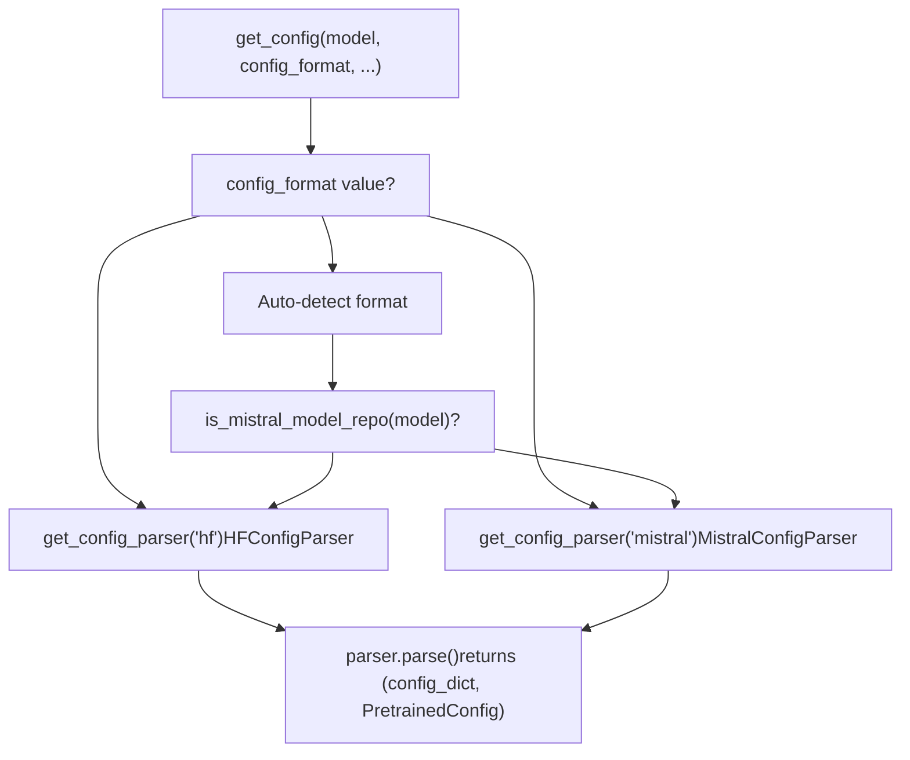
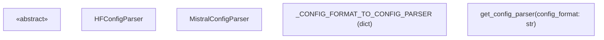
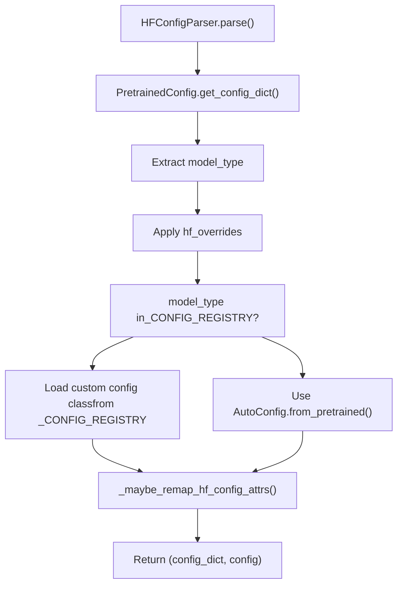
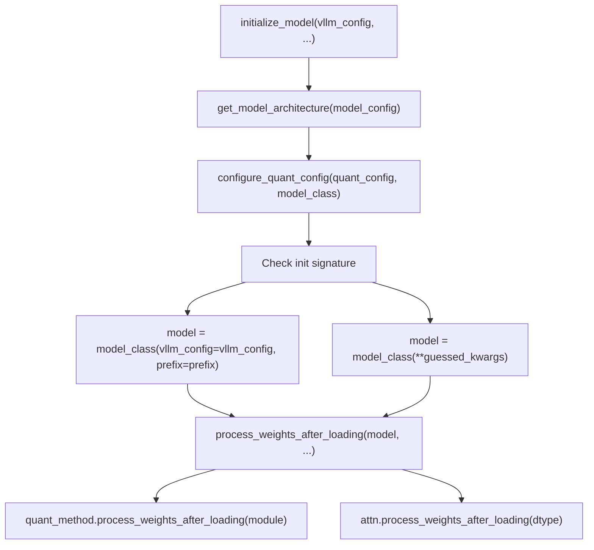

# Configuration Loading and Parsing

Relevant source files

-   [docs/models/supported\_models.md](https://github.com/vllm-project/vllm/blob/7cc302dd/docs/models/supported_models.md?plain=1)
-   [examples/offline\_inference/audio\_language.py](https://github.com/vllm-project/vllm/blob/7cc302dd/examples/offline_inference/audio_language.py)
-   [examples/offline\_inference/vision\_language.py](https://github.com/vllm-project/vllm/blob/7cc302dd/examples/offline_inference/vision_language.py)
-   [examples/offline\_inference/vision\_language\_multi\_image.py](https://github.com/vllm-project/vllm/blob/7cc302dd/examples/offline_inference/vision_language_multi_image.py)
-   [tests/distributed/test\_pipeline\_parallel.py](https://github.com/vllm-project/vllm/blob/7cc302dd/tests/distributed/test_pipeline_parallel.py)
-   [tests/model\_executor/model\_loader/test\_ep\_weight\_filter.py](https://github.com/vllm-project/vllm/blob/7cc302dd/tests/model_executor/model_loader/test_ep_weight_filter.py)
-   [tests/model\_executor/model\_loader/test\_registry.py](https://github.com/vllm-project/vllm/blob/7cc302dd/tests/model_executor/model_loader/test_registry.py)
-   [tests/models/multimodal/generation/test\_common.py](https://github.com/vllm-project/vllm/blob/7cc302dd/tests/models/multimodal/generation/test_common.py)
-   [tests/models/multimodal/generation/vlm\_utils/model\_utils.py](https://github.com/vllm-project/vllm/blob/7cc302dd/tests/models/multimodal/generation/vlm_utils/model_utils.py)
-   [tests/models/multimodal/processing/test\_common.py](https://github.com/vllm-project/vllm/blob/7cc302dd/tests/models/multimodal/processing/test_common.py)
-   [tests/models/registry.py](https://github.com/vllm-project/vllm/blob/7cc302dd/tests/models/registry.py)
-   [tests/models/test\_initialization.py](https://github.com/vllm-project/vllm/blob/7cc302dd/tests/models/test_initialization.py)
-   [vllm/config/load.py](https://github.com/vllm-project/vllm/blob/7cc302dd/vllm/config/load.py)
-   [vllm/model\_executor/model\_loader/\_\_init\_\_.py](https://github.com/vllm-project/vllm/blob/7cc302dd/vllm/model_executor/model_loader/__init__.py)
-   [vllm/model\_executor/model\_loader/base\_loader.py](https://github.com/vllm-project/vllm/blob/7cc302dd/vllm/model_executor/model_loader/base_loader.py)
-   [vllm/model\_executor/model\_loader/bitsandbytes\_loader.py](https://github.com/vllm-project/vllm/blob/7cc302dd/vllm/model_executor/model_loader/bitsandbytes_loader.py)
-   [vllm/model\_executor/model\_loader/default\_loader.py](https://github.com/vllm-project/vllm/blob/7cc302dd/vllm/model_executor/model_loader/default_loader.py)
-   [vllm/model\_executor/model\_loader/dummy\_loader.py](https://github.com/vllm-project/vllm/blob/7cc302dd/vllm/model_executor/model_loader/dummy_loader.py)
-   [vllm/model\_executor/model\_loader/ep\_weight\_filter.py](https://github.com/vllm-project/vllm/blob/7cc302dd/vllm/model_executor/model_loader/ep_weight_filter.py)
-   [vllm/model\_executor/model\_loader/gguf\_loader.py](https://github.com/vllm-project/vllm/blob/7cc302dd/vllm/model_executor/model_loader/gguf_loader.py)
-   [vllm/model\_executor/model\_loader/runai\_streamer\_loader.py](https://github.com/vllm-project/vllm/blob/7cc302dd/vllm/model_executor/model_loader/runai_streamer_loader.py)
-   [vllm/model\_executor/model\_loader/sharded\_state\_loader.py](https://github.com/vllm-project/vllm/blob/7cc302dd/vllm/model_executor/model_loader/sharded_state_loader.py)
-   [vllm/model\_executor/model\_loader/tensorizer.py](https://github.com/vllm-project/vllm/blob/7cc302dd/vllm/model_executor/model_loader/tensorizer.py)
-   [vllm/model\_executor/model\_loader/tensorizer\_loader.py](https://github.com/vllm-project/vllm/blob/7cc302dd/vllm/model_executor/model_loader/tensorizer_loader.py)
-   [vllm/model\_executor/model\_loader/utils.py](https://github.com/vllm-project/vllm/blob/7cc302dd/vllm/model_executor/model_loader/utils.py)
-   [vllm/model\_executor/model\_loader/weight\_utils.py](https://github.com/vllm-project/vllm/blob/7cc302dd/vllm/model_executor/model_loader/weight_utils.py)
-   [vllm/model\_executor/models/mistral\_large\_3\_eagle.py](https://github.com/vllm-project/vllm/blob/7cc302dd/vllm/model_executor/models/mistral_large_3_eagle.py)
-   [vllm/model\_executor/models/registry.py](https://github.com/vllm-project/vllm/blob/7cc302dd/vllm/model_executor/models/registry.py)
-   [vllm/model\_executor/utils.py](https://github.com/vllm-project/vllm/blob/7cc302dd/vllm/model_executor/utils.py)
-   [vllm/transformers\_utils/config.py](https://github.com/vllm-project/vllm/blob/7cc302dd/vllm/transformers_utils/config.py)
-   [vllm/transformers\_utils/configs/\_\_init\_\_.py](https://github.com/vllm-project/vllm/blob/7cc302dd/vllm/transformers_utils/configs/__init__.py)
-   [vllm/transformers\_utils/configs/mistral.py](https://github.com/vllm-project/vllm/blob/7cc302dd/vllm/transformers_utils/configs/mistral.py)
-   [vllm/transformers\_utils/model\_arch\_config\_convertor.py](https://github.com/vllm-project/vllm/blob/7cc302dd/vllm/transformers_utils/model_arch_config_convertor.py)

This page documents how vLLM loads model configurations from various formats and sources. Model configuration loading is a critical step that occurs after model architecture detection and before the model is instantiated. The configuration determines essential model properties like layer counts, attention mechanisms, vocabulary size, and architecture-specific parameters.

For information about how configurations are used to instantiate models, see **Model Registry and Architecture Detection (5.1)**. For details on configuration objects like `ModelConfig` and `VllmConfig`, see **VllmConfig and Specialized Configuration Objects (2.2)**.

## Configuration Format Support

The `ConfigFormat` type alias defines the three supported formats:

```
ConfigFormat = Literal["auto", "hf", "mistral"]
```
| Format | Description | Config File | Primary Use Case |
| --- | --- | --- | --- |
| `hf` | Standard Transformers format | `config.json` | Most models from HF Hub or local paths |
| `mistral` | Mistral AI native format | `params.json` | Mistral-format checkpoints |
| `auto` | Auto-detect at runtime | — | Tries Mistral detection first, falls back to HF |

> **Note on GGUF:** GGUF-format models are not a separate `config_format`. GGUF detection (`is_gguf()`, `is_remote_gguf()`) occurs at the `ModelConfig` level, and GGUF metadata is patched onto the loaded HF config via `maybe_patch_hf_config_from_gguf()`.

### Format Detection Flow

The logic for selecting a parser and detecting the format is handled within `get_config()` and `get_config_parser()`.

**`get_config_parser()` dispatch and `get_config()` auto-detection**


Sources: [vllm/transformers\_utils/config.py237-253](https://github.com/vllm-project/vllm/blob/7cc302dd/vllm/transformers_utils/config.py#L237-L253) [vllm/transformers\_utils/repo\_utils.py29](https://github.com/vllm-project/vllm/blob/7cc302dd/vllm/transformers_utils/repo_utils.py#L29-L29) [vllm/transformers\_utils/gguf\_utils.py37-42](https://github.com/vllm-project/vllm/blob/7cc302dd/vllm/transformers_utils/gguf_utils.py#L37-L42)

## Configuration Parser Architecture

The configuration loading system is built around the `ConfigParserBase` abstract class, with concrete implementations for HuggingFace and Mistral formats.

**Class hierarchy and relationships**


**Parser Factory Pattern**

`get_config_parser()` looks up `_CONFIG_FORMAT_TO_CONFIG_PARSER` and returns a new parser instance. Custom parsers can be registered using the `@register_config_parser()` decorator, which validates subclassing and overwrites any existing registration with a warning.

Sources: [vllm/transformers\_utils/config.py155-234](https://github.com/vllm-project/vllm/blob/7cc302dd/vllm/transformers_utils/config.py#L155-L234) [vllm/transformers\_utils/config.py237-253](https://github.com/vllm-project/vllm/blob/7cc302dd/vllm/transformers_utils/config.py#L237-L253) [vllm/transformers\_utils/config.py255-303](https://github.com/vllm-project/vllm/blob/7cc302dd/vllm/transformers_utils/config.py#L255-L303)

## HuggingFace Configuration Loading

The `HFConfigParser` is the default parser and handles the majority of models. It implements a resolution process that integrates vLLM's custom configuration registry.

**HuggingFace Config Loading Pipeline**


### Custom Configuration Registry (`_CONFIG_REGISTRY`)

`_CONFIG_REGISTRY` is a `LazyConfigDict` that maps `model_type` strings (from `config.json`) to vLLM-specific `PretrainedConfig` subclasses. Values are string class names resolved lazily via `vllm.transformers_utils.configs` on first access to minimize startup overhead.

| `model_type` key | Config Class | Notes |
| --- | --- | --- |
| `afmoe` | `AfmoeConfig` | [vllm/transformers\_utils/config.py81](https://github.com/vllm-project/vllm/blob/7cc302dd/vllm/transformers_utils/config.py#L81-L81) |
| `deepseek_v32` | `DeepseekV3Config` | Maps V3.2 to V3 [vllm/transformers\_utils/config.py90](https://github.com/vllm-project/vllm/blob/7cc302dd/vllm/transformers_utils/config.py#L90-L90) |
| `eagle` | `EAGLEConfig` | Speculative decoding [vllm/transformers\_utils/config.py105](https://github.com/vllm-project/vllm/blob/7cc302dd/vllm/transformers_utils/config.py#L105-L105) |
| `RefinedWeb` | `RWConfig` | For Falcon models [vllm/transformers\_utils/config.py99-100](https://github.com/vllm-project/vllm/blob/7cc302dd/vllm/transformers_utils/config.py#L99-L100) |
| `speculators` | `SpeculatorsConfig` | [vllm/transformers\_utils/config.py106](https://github.com/vllm-project/vllm/blob/7cc302dd/vllm/transformers_utils/config.py#L106-L106) |
| `kimi_linear` | `KimiLinearConfig` | [vllm/transformers\_utils/config.py96](https://github.com/vllm-project/vllm/blob/7cc302dd/vllm/transformers_utils/config.py#L96-L96) |
| `lfm2_moe` | `Lfm2MoeConfig` | [vllm/transformers\_utils/config.py118](https://github.com/vllm-project/vllm/blob/7cc302dd/vllm/transformers_utils/config.py#L118-L118) |

Sources: [vllm/transformers\_utils/config.py70-121](https://github.com/vllm-project/vllm/blob/7cc302dd/vllm/transformers_utils/config.py#L70-L121) [vllm/transformers\_utils/config.py155-196](https://github.com/vllm-project/vllm/blob/7cc302dd/vllm/transformers_utils/config.py#L155-L196) [vllm/transformers\_utils/configs/\_\_init\_\_.py17-73](https://github.com/vllm-project/vllm/blob/7cc302dd/vllm/transformers_utils/configs/__init__.py#L17-L73)

## Mistral Configuration Format

Mistral AI uses a custom configuration format with `params.json` instead of HuggingFace's `config.json`. The `MistralConfigParser` handles this format by adapting it to the expected HuggingFace-like structure.

**Mistral Configuration Adaptation**

The parser downloads `params.json` and performs adaptation via `adapt_config_dict()`. If certain fields like `max_position_embeddings` are missing, it attempts to retrieve them from a corresponding HuggingFace `config.json` if one exists in the repo.

Sources: [vllm/transformers\_utils/config.py65](https://github.com/vllm-project/vllm/blob/7cc302dd/vllm/transformers_utils/config.py#L65-L65) [vllm/transformers\_utils/config.py198-234](https://github.com/vllm-project/vllm/blob/7cc302dd/vllm/transformers_utils/config.py#L198-L234)

## Configuration Post-Processing and Patching

### RoPE Parameter Patching

RoPE (Rotary Position Embedding) parameters are standardized across different Transformers versions and model implementations using `patch_rope_parameters()`. This handles legacy field names like `rotary_emb_base` and standardizes `rope_scaling` into the modern `rope_parameters` format.

Sources: [vllm/transformers\_utils/config.py306-399](https://github.com/vllm-project/vllm/blob/7cc302dd/vllm/transformers_utils/config.py#L306-L399) [vllm/transformers\_utils/config.py134-139](https://github.com/vllm-project/vllm/blob/7cc302dd/vllm/transformers_utils/config.py#L134-L139)

### Attribute Remapping and Overrides

vLLM maintains mappings to fix non-standard configuration attributes and provides architecture-specific initialization overrides.

-   **`_CONFIG_ATTRS_MAPPING`**: Maps attributes like `llm_config` to `text_config` to ensure internal consistency.
-   **`_AUTO_CONFIG_KWARGS_OVERRIDES`**: Provides specific initialization flags for certain architectures (e.g., `internvl_chat` requires `has_no_defaults_at_init: True`).

Sources: [vllm/transformers\_utils/config.py123-131](https://github.com/vllm-project/vllm/blob/7cc302dd/vllm/transformers_utils/config.py#L123-L131) [vllm/transformers\_utils/config.py476-483](https://github.com/vllm-project/vllm/blob/7cc302dd/vllm/transformers_utils/config.py#L476-L483)

## `hf_overrides` Mechanism

The `hf_overrides` parameter allows users to programmatically modify the configuration at runtime. It is processed within `HFConfigParser.parse()`:

1.  **Direct Dictionary**: If a dict is provided, keys are applied to the config. If `model_type` is present, it overrides the value from `config.json` before registry lookup.
2.  **Callable**: If a callable is provided, it is executed with a dummy config to determine the target `model_type`, or executed against the final config object to perform complex modifications.

Sources: [vllm/transformers\_utils/config.py182-192](https://github.com/vllm-project/vllm/blob/7cc302dd/vllm/transformers_utils/config.py#L182-L192)

## Model Initialization and Weight Loading

After configuration parsing, the model is initialized using `initialize_model`. This function handles both "new-style" model classes (accepting `vllm_config` and `prefix`) and "old-style" classes (accepting `config`, `cache_config`, etc.) for backward compatibility.

**Initialization and Post-Loading Flow**


Sources: [vllm/model\_executor/model\_loader/utils.py36-92](https://github.com/vllm-project/vllm/blob/7cc302dd/vllm/model_executor/model_loader/utils.py#L36-L92) [vllm/model\_executor/model\_loader/utils.py95-120](https://github.com/vllm-project/vllm/blob/7cc302dd/vllm/model_executor/model_loader/utils.py#L95-L120)
