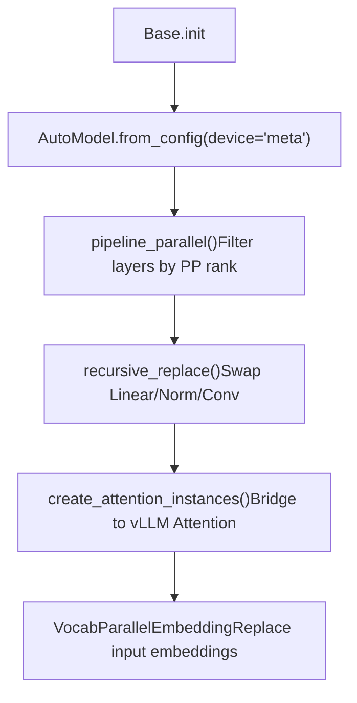

# Transformers Modeling Backend

Relevant source files

-   [tests/models/multimodal/test\_mapping.py](https://github.com/vllm-project/vllm/blob/7cc302dd/tests/models/multimodal/test_mapping.py)
-   [tests/models/test\_transformers.py](https://github.com/vllm-project/vllm/blob/7cc302dd/tests/models/test_transformers.py)
-   [vllm/model\_executor/models/transformers/\_\_init\_\_.py](https://github.com/vllm-project/vllm/blob/7cc302dd/vllm/model_executor/models/transformers/__init__.py)
-   [vllm/model\_executor/models/transformers/base.py](https://github.com/vllm-project/vllm/blob/7cc302dd/vllm/model_executor/models/transformers/base.py)
-   [vllm/model\_executor/models/transformers/causal.py](https://github.com/vllm-project/vllm/blob/7cc302dd/vllm/model_executor/models/transformers/causal.py)
-   [vllm/model\_executor/models/transformers/legacy.py](https://github.com/vllm-project/vllm/blob/7cc302dd/vllm/model_executor/models/transformers/legacy.py)
-   [vllm/model\_executor/models/transformers/moe.py](https://github.com/vllm-project/vllm/blob/7cc302dd/vllm/model_executor/models/transformers/moe.py)
-   [vllm/model\_executor/models/transformers/multimodal.py](https://github.com/vllm-project/vllm/blob/7cc302dd/vllm/model_executor/models/transformers/multimodal.py)
-   [vllm/model\_executor/models/transformers/pooling.py](https://github.com/vllm-project/vllm/blob/7cc302dd/vllm/model_executor/models/transformers/pooling.py)
-   [vllm/model\_executor/models/transformers/utils.py](https://github.com/vllm-project/vllm/blob/7cc302dd/vllm/model_executor/models/transformers/utils.py)

## Purpose and Scope

The Transformers backend ([vllm/model\_executor/models/transformers/base.py17-100](https://github.com/vllm-project/vllm/blob/7cc302dd/vllm/model_executor/models/transformers/base.py#L17-L100)) enables vLLM to run Hugging Face Transformers models natively without requiring a dedicated vLLM model implementation. It wraps any compatible `PreTrainedModel` and integrates it with vLLM's paged KV cache, tensor parallelism, pipeline parallelism, quantization, and weight loading infrastructure.

This page covers the backend's class hierarchy, module replacement logic, attention integration, weight loading, and the concrete model classes assembled from mixins.

---

## Activation

The backend is chosen at startup via the `model_impl` argument (or `--model-impl` CLI flag). When the registry resolves the architecture name to `_get_transformers_backend_cls()`, the loader selects one of the concrete classes defined in `vllm/model_executor/models/transformers/__init__.py`.

| `model_impl` value | Behavior |
| --- | --- |
| `"vllm"` | Use vLLM's native implementation; error if none exists. |
| `"transformers"` | Always use the Transformers backend. |
| `"auto"` | Use vLLM's native implementation if available; fall back to Transformers backend with a warning. |

Sources: [tests/models/test\_transformers.py40-42](https://github.com/vllm-project/vllm/blob/7cc302dd/tests/models/test_transformers.py#L40-L42) [tests/models/test\_transformers.py60-67](https://github.com/vllm-project/vllm/blob/7cc302dd/tests/models/test_transformers.py#L60-L67) [tests/models/test\_transformers.py145-162](https://github.com/vllm-project/vllm/blob/7cc302dd/tests/models/test_transformers.py#L145-L162)

---

## Class Hierarchy and Mixins

The backend is composed via Python multiple inheritance. Concrete model classes are assembled by stacking mixins on top of the `Base` class.

### Mixin Composition Diagram

The following diagram illustrates how different model capabilities are mixed into the `Base` Transformers class.

Sources: [vllm/model\_executor/models/transformers/base.py102-110](https://github.com/vllm-project/vllm/blob/7cc302dd/vllm/model_executor/models/transformers/base.py#L102-L110) [vllm/model\_executor/models/transformers/causal.py32-37](https://github.com/vllm-project/vllm/blob/7cc302dd/vllm/model_executor/models/transformers/causal.py#L32-L37) [vllm/model\_executor/models/transformers/moe.py119-123](https://github.com/vllm-project/vllm/blob/7cc302dd/vllm/model_executor/models/transformers/moe.py#L119-L123) [vllm/model\_executor/models/transformers/pooling.py33-46](https://github.com/vllm-project/vllm/blob/7cc302dd/vllm/model_executor/models/transformers/pooling.py#L33-L46) [vllm/model\_executor/models/transformers/pooling.py48-55](https://github.com/vllm-project/vllm/blob/7cc302dd/vllm/model_executor/models/transformers/pooling.py#L48-L55) [vllm/model\_executor/models/transformers/legacy.py29-31](https://github.com/vllm-project/vllm/blob/7cc302dd/vllm/model_executor/models/transformers/legacy.py#L29-L31)

### Concrete Model Classes

Concrete classes compose these mixins to provide full functionality for specific model types (e.g., Causal LM, MoE, MultiModal).

```mermaid
flowchart TD
    E["TransformersEmbeddingModel(EmbeddingMixin, LegacyMixin, Base)"]
    F["TransformersForSequenceClassification(SequenceClassificationMixin, LegacyMixin, Base)"]
    C["TransformersMultiModalForCausalLM(MultiModalMixin, CausalMixin, Base)"]
    D["TransformersMultiModalMoEForCausalLM(MoEMixin, MultiModalMixin, CausalMixin, Base)"]
    A["TransformersForCausalLM(CausalMixin, Base)"]
    B["TransformersMoEForCausalLM(MoEMixin, CausalMixin, Base)"]
```

Sources: [vllm/model\_executor/models/transformers/\_\_init\_\_.py40-118](https://github.com/vllm-project/vllm/blob/7cc302dd/vllm/model_executor/models/transformers/__init__.py#L40-L118)

---

## `Base` Class Implementation

The `Base` class ([vllm/model\_executor/models/transformers/base.py102-110](https://github.com/vllm-project/vllm/blob/7cc302dd/vllm/model_executor/models/transformers/base.py#L102-L110)) manages the lifecycle of the underlying Hugging Face model.

### Initialization Flow

1.  **HF Model Creation**: Instantiates the model on the `meta` device using `AutoModel.from_config`. This delays buffer allocation until vLLM is ready.
2.  **Pipeline Parallelism**: `pipeline_parallel()` replaces layers not on the current rank with `PPMissingLayer`.
3.  **Recursive Replacement**: `recursive_replace()` swaps standard `nn` modules (Linear, RMSNorm, Conv) with vLLM-optimized, tensor-parallel versions.
4.  **Attention Hooking**: `create_attention_instances()` creates `Attention` objects that bridge HF forward calls to vLLM's attention backends.

Sources: [vllm/model\_executor/models/transformers/base.py113-217](https://github.com/vllm-project/vllm/blob/7cc302dd/vllm/model_executor/models/transformers/base.py#L113-L217)

---

## Module Replacement and Parallelism

### Linear and Norm Replacement

`Base.recursive_replace()` uses utility functions to swap standard modules for parallel ones:

-   **Linear**: `replace_linear_class` converts `nn.Linear` to `ColumnParallelLinear`, `RowParallelLinear`, or `ReplicatedLinear` based on the model's parallel plan.
-   **Norm**: `replace_rms_norm_class` detects if a layer is standard `RMSNorm` or `GemmaRMSNorm` by testing weight initialization.
-   **Conv**: `replace_conv_class` swaps `nn.Conv2d`/`nn.Conv3d` for vLLM's optimized implementations.

Sources: [vllm/model\_executor/models/transformers/utils.py100-137](https://github.com/vllm-project/vllm/blob/7cc302dd/vllm/model_executor/models/transformers/utils.py#L100-L137) [vllm/model\_executor/models/transformers/utils.py144-176](https://github.com/vllm-project/vllm/blob/7cc302dd/vllm/model_executor/models/transformers/utils.py#L144-L176) [vllm/model\_executor/models/transformers/utils.py179-215](https://github.com/vllm-project/vllm/blob/7cc302dd/vllm/model_executor/models/transformers/utils.py#L179-L215) [vllm/model\_executor/models/transformers/base.py278-347](https://github.com/vllm-project/vllm/blob/7cc302dd/vllm/model_executor/models/transformers/base.py#L278-L347)

### Attention Integration

The backend patches the global Transformers attention registry: `ALL_ATTENTION_FUNCTIONS["vllm"] = vllm_flash_attention_forward`

When a model's attention forward is called, `vllm_flash_attention_forward` retrieves the `Attention` instance for the specific `layer_idx` and executes vLLM's paged attention logic.

Sources: [vllm/model\_executor/models/transformers/base.py77-99](https://github.com/vllm-project/vllm/blob/7cc302dd/vllm/model_executor/models/transformers/base.py#L77-L99) [vllm/model\_executor/models/transformers/base.py349-405](https://github.com/vllm-project/vllm/blob/7cc302dd/vllm/model_executor/models/transformers/base.py#L349-L405)

---

## Mixture of Experts (MoE) Support

The `MoEMixin` ([vllm/model\_executor/models/transformers/moe.py119-123](https://github.com/vllm-project/vllm/blob/7cc302dd/vllm/model_executor/models/transformers/moe.py#L119-L123)) enables support for MoE architectures like Mixtral or OLMoE via the Transformers backend.

### Fused MoE Implementation

It registers a custom operation `transformers_fused_moe` which extends vLLM's `FusedMoE`. Unlike standard MoE where vLLM computes routing, the Transformers backend assumes the HF model has already computed `topk_ids` and `topk_weights`.

-   **Routing**: `custom_routing_function` in `TransformersFusedMoE` retrieves `topk_ids` stored in the layer during the HF forward pass via `transformers_moe_forward`.
-   **EP/TP Handling**: It handles `all_gatherv` of `topk_ids` across expert-parallel or data-parallel ranks if necessary.

Sources: [vllm/model\_executor/models/transformers/moe.py41-83](https://github.com/vllm-project/vllm/blob/7cc302dd/vllm/model_executor/models/transformers/moe.py#L41-L83) [vllm/model\_executor/models/transformers/moe.py86-97](https://github.com/vllm-project/vllm/blob/7cc302dd/vllm/model_executor/models/transformers/moe.py#L86-L97) [vllm/model\_executor/models/transformers/moe.py154-188](https://github.com/vllm-project/vllm/blob/7cc302dd/vllm/model_executor/models/transformers/moe.py#L154-L188)

---

## Multimodal Support

The `MultiModalMixin` ([vllm/model\_executor/models/transformers/multimodal.py17-140](https://github.com/vllm-project/vllm/blob/7cc302dd/vllm/model_executor/models/transformers/multimodal.py#L17-L140)) provides the integration for vision-language and other multimodal models.

### Processing Pipeline

It uses a `MultiModalProcessor` to handle inputs. The `MultiModalProcessingInfo` provides metadata such as `get_max_image_tokens` which calculates the token budget based on image resolution and the underlying HF processor's logic.

-   **Field Config**: `_get_mm_fields_config` defines how multimodal tensors (like `image_grid_thw` or `num_image_patches`) are batched and sharded.
-   **Dummy Inputs**: `MultiModalDummyInputsBuilder` generates synthetic data for memory profiling and graph capture.

Sources: [vllm/model\_executor/models/transformers/multimodal.py65-85](https://github.com/vllm-project/vllm/blob/7cc302dd/vllm/model_executor/models/transformers/multimodal.py#L65-L85) [vllm/model\_executor/models/transformers/multimodal.py120-162](https://github.com/vllm-project/vllm/blob/7cc302dd/vllm/model_executor/models/transformers/multimodal.py#L120-L162) [vllm/model\_executor/models/transformers/multimodal.py176-186](https://github.com/vllm-project/vllm/blob/7cc302dd/vllm/model_executor/models/transformers/multimodal.py#L176-L186)

---

## Weight Loading Infrastructure

The Transformers backend utilizes `WeightsMapper` and `AutoWeightsLoader` to map Hugging Face checkpoint keys to the vLLM internal structure.

### `WeightsMapper`

`WeightsMapper` allows defining regex, prefix, or suffix mappings.

-   **Automatic Mapping**: During initialization, `Base` creates a mapper that handles the transition from HF's flat checkpoint keys to vLLM's nested module structure.
-   **Tied Weights**: `CausalMixin` adds `lm_head.` to `skip_prefixes` if word embeddings are tied, preventing redundant loading.

### `AutoWeightsLoader`

`AutoWeightsLoader` performs a single-pass iteration over weights. It checks if a module has a custom `load_weights` method or if a parameter has a `weight_loader`.

Sources: [vllm/model\_executor/models/transformers/base.py168-172](https://github.com/vllm-project/vllm/blob/7cc302dd/vllm/model_executor/models/transformers/base.py#L168-L172) [vllm/model\_executor/models/transformers/causal.py39-44](https://github.com/vllm-project/vllm/blob/7cc302dd/vllm/model_executor/models/transformers/causal.py#L39-L44) [tests/models/multimodal/test\_mapping.py111-115](https://github.com/vllm-project/vllm/blob/7cc302dd/tests/models/multimodal/test_mapping.py#L111-L115)

---

## Data Flow: Model Forward Pass

The forward pass in `Base.forward` bridges the standard vLLM execution flow (tensors for `input_ids`, `positions`) into the Hugging Face `PreTrainedModel` interface.

1.  **Input Preparation**: Handles `input_ids` or `inputs_embeds` depending on the pipeline parallel rank.
2.  **Position IDs**: Construct `position_ids` from vLLM's `positions` tensor. For legacy models like RoBERTa, `LegacyMixin` adjusts these for padding offsets.
3.  **HF Forward**: Calls `self.model(...)` passing `attention_instances` to ensure the patched attention function can find its state.
4.  **Output Processing**: Extracts hidden states and handles `IntermediateTensors` for pipeline parallelism.

Sources: [vllm/model\_executor/models/transformers/base.py440-493](https://github.com/vllm-project/vllm/blob/7cc302dd/vllm/model_executor/models/transformers/base.py#L440-L493) [vllm/model\_executor/models/transformers/legacy.py60-77](https://github.com/vllm-project/vllm/blob/7cc302dd/vllm/model_executor/models/transformers/legacy.py#L60-L77)

---

## Pooling and Sequence Classification

### `EmbeddingMixin`

Attaches a `DispatchPooler` for embedding tasks. It defaults to `"CLS"` pooling and is used in `TransformersEmbeddingModel`. Sources: [vllm/model\_executor/models/transformers/pooling.py33-46](https://github.com/vllm-project/vllm/blob/7cc302dd/vllm/model_executor/models/transformers/pooling.py#L33-L46)

### `SequenceClassificationMixin`

Instantiates an `AutoModelForSequenceClassification` on the `meta` device to extract the classification head (`classifier` or `score`). It uses `ClassifierWithReshape` to bridge the pooler output (unsqueezing the sequence dimension) to the classification head's expected input shape. Sources: [vllm/model\_executor/models/transformers/pooling.py48-103](https://github.com/vllm-project/vllm/blob/7cc302dd/vllm/model_executor/models/transformers/pooling.py#L48-L103)
