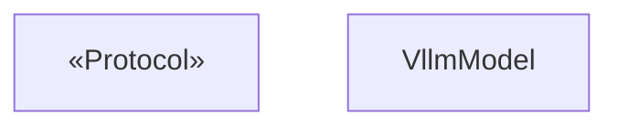
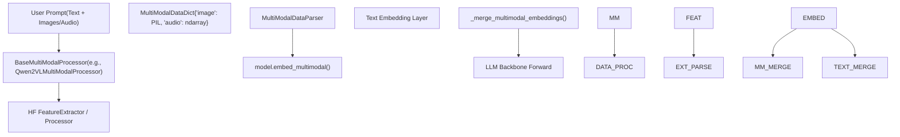

# Multimodal Model Support

Relevant source files

-   [examples/online\_serving/openai\_transcription\_client.py](https://github.com/vllm-project/vllm/blob/7cc302dd/examples/online_serving/openai_transcription_client.py)
-   [tests/entrypoints/openai/conftest.py](https://github.com/vllm-project/vllm/blob/7cc302dd/tests/entrypoints/openai/conftest.py)
-   [tests/entrypoints/pooling/classify/test\_online.py](https://github.com/vllm-project/vllm/blob/7cc302dd/tests/entrypoints/pooling/classify/test_online.py)
-   [tests/models/multimodal/processing/test\_minimax\_vl\_01.py](https://github.com/vllm-project/vllm/blob/7cc302dd/tests/models/multimodal/processing/test_minimax_vl_01.py)
-   [vllm/entrypoints/openai/generate/\_\_init\_\_.py](https://github.com/vllm-project/vllm/blob/7cc302dd/vllm/entrypoints/openai/generate/__init__.py)
-   [vllm/model\_executor/models/aimv2.py](https://github.com/vllm-project/vllm/blob/7cc302dd/vllm/model_executor/models/aimv2.py)
-   [vllm/model\_executor/models/aria.py](https://github.com/vllm-project/vllm/blob/7cc302dd/vllm/model_executor/models/aria.py)
-   [vllm/model\_executor/models/aya\_vision.py](https://github.com/vllm-project/vllm/blob/7cc302dd/vllm/model_executor/models/aya_vision.py)
-   [vllm/model\_executor/models/blip.py](https://github.com/vllm-project/vllm/blob/7cc302dd/vllm/model_executor/models/blip.py)
-   [vllm/model\_executor/models/blip2.py](https://github.com/vllm-project/vllm/blob/7cc302dd/vllm/model_executor/models/blip2.py)
-   [vllm/model\_executor/models/chameleon.py](https://github.com/vllm-project/vllm/blob/7cc302dd/vllm/model_executor/models/chameleon.py)
-   [vllm/model\_executor/models/cohere2\_vision.py](https://github.com/vllm-project/vllm/blob/7cc302dd/vllm/model_executor/models/cohere2_vision.py)
-   [vllm/model\_executor/models/deepseek\_vl2.py](https://github.com/vllm-project/vllm/blob/7cc302dd/vllm/model_executor/models/deepseek_vl2.py)
-   [vllm/model\_executor/models/dots\_ocr.py](https://github.com/vllm-project/vllm/blob/7cc302dd/vllm/model_executor/models/dots_ocr.py)
-   [vllm/model\_executor/models/eagle2\_5\_vl.py](https://github.com/vllm-project/vllm/blob/7cc302dd/vllm/model_executor/models/eagle2_5_vl.py)
-   [vllm/model\_executor/models/ernie45\_vl.py](https://github.com/vllm-project/vllm/blob/7cc302dd/vllm/model_executor/models/ernie45_vl.py)
-   [vllm/model\_executor/models/funaudiochat.py](https://github.com/vllm-project/vllm/blob/7cc302dd/vllm/model_executor/models/funaudiochat.py)
-   [vllm/model\_executor/models/fuyu.py](https://github.com/vllm-project/vllm/blob/7cc302dd/vllm/model_executor/models/fuyu.py)
-   [vllm/model\_executor/models/gemma3\_mm.py](https://github.com/vllm-project/vllm/blob/7cc302dd/vllm/model_executor/models/gemma3_mm.py)
-   [vllm/model\_executor/models/gemma3n.py](https://github.com/vllm-project/vllm/blob/7cc302dd/vllm/model_executor/models/gemma3n.py)
-   [vllm/model\_executor/models/gemma3n\_mm.py](https://github.com/vllm-project/vllm/blob/7cc302dd/vllm/model_executor/models/gemma3n_mm.py)
-   [vllm/model\_executor/models/glm4\_1v.py](https://github.com/vllm-project/vllm/blob/7cc302dd/vllm/model_executor/models/glm4_1v.py)
-   [vllm/model\_executor/models/glm4v.py](https://github.com/vllm-project/vllm/blob/7cc302dd/vllm/model_executor/models/glm4v.py)
-   [vllm/model\_executor/models/granite\_speech.py](https://github.com/vllm-project/vllm/blob/7cc302dd/vllm/model_executor/models/granite_speech.py)
-   [vllm/model\_executor/models/h2ovl.py](https://github.com/vllm-project/vllm/blob/7cc302dd/vllm/model_executor/models/h2ovl.py)
-   [vllm/model\_executor/models/hyperclovax\_vision.py](https://github.com/vllm-project/vllm/blob/7cc302dd/vllm/model_executor/models/hyperclovax_vision.py)
-   [vllm/model\_executor/models/idefics2\_vision\_model.py](https://github.com/vllm-project/vllm/blob/7cc302dd/vllm/model_executor/models/idefics2_vision_model.py)
-   [vllm/model\_executor/models/interfaces.py](https://github.com/vllm-project/vllm/blob/7cc302dd/vllm/model_executor/models/interfaces.py)
-   [vllm/model\_executor/models/intern\_vit.py](https://github.com/vllm-project/vllm/blob/7cc302dd/vllm/model_executor/models/intern_vit.py)
-   [vllm/model\_executor/models/interns1\_vit.py](https://github.com/vllm-project/vllm/blob/7cc302dd/vllm/model_executor/models/interns1_vit.py)
-   [vllm/model\_executor/models/keye.py](https://github.com/vllm-project/vllm/blob/7cc302dd/vllm/model_executor/models/keye.py)
-   [vllm/model\_executor/models/llava.py](https://github.com/vllm-project/vllm/blob/7cc302dd/vllm/model_executor/models/llava.py)
-   [vllm/model\_executor/models/llava\_next.py](https://github.com/vllm-project/vllm/blob/7cc302dd/vllm/model_executor/models/llava_next.py)
-   [vllm/model\_executor/models/llava\_next\_video.py](https://github.com/vllm-project/vllm/blob/7cc302dd/vllm/model_executor/models/llava_next_video.py)
-   [vllm/model\_executor/models/llava\_onevision.py](https://github.com/vllm-project/vllm/blob/7cc302dd/vllm/model_executor/models/llava_onevision.py)
-   [vllm/model\_executor/models/minicpmo.py](https://github.com/vllm-project/vllm/blob/7cc302dd/vllm/model_executor/models/minicpmo.py)
-   [vllm/model\_executor/models/minicpmv.py](https://github.com/vllm-project/vllm/blob/7cc302dd/vllm/model_executor/models/minicpmv.py)
-   [vllm/model\_executor/models/minimax\_vl\_01.py](https://github.com/vllm-project/vllm/blob/7cc302dd/vllm/model_executor/models/minimax_vl_01.py)
-   [vllm/model\_executor/models/mistral3.py](https://github.com/vllm-project/vllm/blob/7cc302dd/vllm/model_executor/models/mistral3.py)
-   [vllm/model\_executor/models/mllama4.py](https://github.com/vllm-project/vllm/blob/7cc302dd/vllm/model_executor/models/mllama4.py)
-   [vllm/model\_executor/models/molmo.py](https://github.com/vllm-project/vllm/blob/7cc302dd/vllm/model_executor/models/molmo.py)
-   [vllm/model\_executor/models/openpangu\_vl.py](https://github.com/vllm-project/vllm/blob/7cc302dd/vllm/model_executor/models/openpangu_vl.py)
-   [vllm/model\_executor/models/paddleocr\_vl.py](https://github.com/vllm-project/vllm/blob/7cc302dd/vllm/model_executor/models/paddleocr_vl.py)
-   [vllm/model\_executor/models/paligemma.py](https://github.com/vllm-project/vllm/blob/7cc302dd/vllm/model_executor/models/paligemma.py)
-   [vllm/model\_executor/models/phi3v.py](https://github.com/vllm-project/vllm/blob/7cc302dd/vllm/model_executor/models/phi3v.py)
-   [vllm/model\_executor/models/phi4mm.py](https://github.com/vllm-project/vllm/blob/7cc302dd/vllm/model_executor/models/phi4mm.py)
-   [vllm/model\_executor/models/pixtral.py](https://github.com/vllm-project/vllm/blob/7cc302dd/vllm/model_executor/models/pixtral.py)
-   [vllm/model\_executor/models/qwen2\_5\_omni\_thinker.py](https://github.com/vllm-project/vllm/blob/7cc302dd/vllm/model_executor/models/qwen2_5_omni_thinker.py)
-   [vllm/model\_executor/models/qwen2\_5\_vl.py](https://github.com/vllm-project/vllm/blob/7cc302dd/vllm/model_executor/models/qwen2_5_vl.py)
-   [vllm/model\_executor/models/qwen2\_vl.py](https://github.com/vllm-project/vllm/blob/7cc302dd/vllm/model_executor/models/qwen2_vl.py)
-   [vllm/model\_executor/models/qwen3\_asr.py](https://github.com/vllm-project/vllm/blob/7cc302dd/vllm/model_executor/models/qwen3_asr.py)
-   [vllm/model\_executor/models/qwen3\_omni\_moe\_thinker.py](https://github.com/vllm-project/vllm/blob/7cc302dd/vllm/model_executor/models/qwen3_omni_moe_thinker.py)
-   [vllm/model\_executor/models/qwen3\_vl.py](https://github.com/vllm-project/vllm/blob/7cc302dd/vllm/model_executor/models/qwen3_vl.py)
-   [vllm/model\_executor/models/qwen\_vl.py](https://github.com/vllm-project/vllm/blob/7cc302dd/vllm/model_executor/models/qwen_vl.py)
-   [vllm/model\_executor/models/siglip2navit.py](https://github.com/vllm-project/vllm/blob/7cc302dd/vllm/model_executor/models/siglip2navit.py)
-   [vllm/model\_executor/models/step3\_vl.py](https://github.com/vllm-project/vllm/blob/7cc302dd/vllm/model_executor/models/step3_vl.py)
-   [vllm/model\_executor/models/step\_vl.py](https://github.com/vllm-project/vllm/blob/7cc302dd/vllm/model_executor/models/step_vl.py)
-   [vllm/model\_executor/models/tarsier.py](https://github.com/vllm-project/vllm/blob/7cc302dd/vllm/model_executor/models/tarsier.py)
-   [vllm/model\_executor/models/terratorch.py](https://github.com/vllm-project/vllm/blob/7cc302dd/vllm/model_executor/models/terratorch.py)
-   [vllm/model\_executor/models/vision.py](https://github.com/vllm-project/vllm/blob/7cc302dd/vllm/model_executor/models/vision.py)
-   [vllm/model\_executor/models/voxtral.py](https://github.com/vllm-project/vllm/blob/7cc302dd/vllm/model_executor/models/voxtral.py)
-   [vllm/model\_executor/models/whisper.py](https://github.com/vllm-project/vllm/blob/7cc302dd/vllm/model_executor/models/whisper.py)
-   [vllm/transformers\_utils/processors/internvl.py](https://github.com/vllm-project/vllm/blob/7cc302dd/vllm/transformers_utils/processors/internvl.py)
-   [vllm/transformers\_utils/processors/kimi\_k25.py](https://github.com/vllm-project/vllm/blob/7cc302dd/vllm/transformers_utils/processors/kimi_k25.py)
-   [vllm/transformers\_utils/processors/step3\_vl.py](https://github.com/vllm-project/vllm/blob/7cc302dd/vllm/transformers_utils/processors/step3_vl.py)

## Purpose and Scope

This page documents vLLM's multimodal model support system, covering the architectural interfaces, supported modalities (image, video, audio), and the data flow from raw input to model embeddings. It details the registration mechanisms that map HuggingFace architectures to vLLM implementations and the specialized processing required for diverse multimodal data.

vLLM supports a wide range of multimodal architectures, including Vision-Language Models (VLMs) like Qwen2.5-VL and LLaVA, and audio models like Whisper and Voxtral.

**Sources:**

-   [vllm/model\_executor/models/interfaces.py89-206](https://github.com/vllm-project/vllm/blob/7cc302dd/vllm/model_executor/models/interfaces.py#L89-L206)
-   [vllm/multimodal/inputs.py1-80](https://github.com/vllm-project/vllm/blob/7cc302dd/vllm/multimodal/inputs.py#L1-L80)

## Model Architecture and Interfaces

vLLM defines a standard set of Python Protocols (interfaces) in `vllm/model_executor/models/interfaces.py` that multimodal models must implement to integrate with the engine's execution pipeline.

### The `SupportsMultiModal` Interface

Any model supporting multimodal inputs must implement the `SupportsMultiModal` protocol. This interface ensures the model can handle non-textual data and provide the necessary metadata for the engine's scheduler and memory manager.

-   **`embed_multimodal`**: This is the core functional requirement. It takes multimodal keyword arguments (e.g., `pixel_values`, `image_grid_thw`) and returns `MultiModalEmbeddings` (tensors) to be merged with text embeddings. [vllm/model\_executor/models/interfaces.py153-163](https://github.com/vllm-project/vllm/blob/7cc302dd/vllm/model_executor/models/interfaces.py#L153-L163)
-   **`get_language_model`**: Returns the underlying language model (typically a decoder-only backbone) responsible for processing merged embeddings. [vllm/model\_executor/models/interfaces.py176-211](https://github.com/vllm-project/vllm/blob/7cc302dd/vllm/model_executor/models/interfaces.py#L176-L211)
-   **`configure_mm_token_handling`**: Handles cases where multimodal placeholder tokens are Out-Of-Vocabulary (OOV), ensuring they are masked during text embedding lookups. [vllm/model\_executor/models/interfaces.py165-174](https://github.com/vllm-project/vllm/blob/7cc302dd/vllm/model_executor/models/interfaces.py#L165-L174)

**Sources:**

-   [vllm/model\_executor/models/interfaces.py94-211](https://github.com/vllm-project/vllm/blob/7cc302dd/vllm/model_executor/models/interfaces.py#L94-L211)

### Specialized Multi-Modal Interfaces

Models may implement additional interfaces to signal support for specific features:

| Interface | Purpose |
| --- | --- |
| `SupportsMRoPE` | Indicates support for Multimodal Rotary Positional Embeddings (MRoPE), used in models like Qwen2.5-VL. [vllm/model\_executor/models/interfaces.py255-263](https://github.com/vllm-project/vllm/blob/7cc302dd/vllm/model_executor/models/interfaces.py#L255-L263) |
| `SupportsTranscription` | Used for audio models that perform Speech-to-Text, requiring specific output processing. [vllm/model\_executor/models/interfaces.py266-274](https://github.com/vllm-project/vllm/blob/7cc302dd/vllm/model_executor/models/interfaces.py#L266-L274) |
| `SupportsMultiModalPruning` | Allows the model to prune or compress multimodal tokens before they enter the LLM backbone. [vllm/model\_executor/models/interfaces.py245-252](https://github.com/vllm-project/vllm/blob/7cc302dd/vllm/model_executor/models/interfaces.py#L245-L252) |
| `SupportsEncoderCudaGraph` | Indicates the multimodal encoder supports CUDA Graph capture for performance. [vllm/model\_executor/models/qwen3\_vl.py106](https://github.com/vllm-project/vllm/blob/7cc302dd/vllm/model_executor/models/qwen3_vl.py#L106-L106) |

**Sources:**

-   [vllm/model\_executor/models/interfaces.py245-274](https://github.com/vllm-project/vllm/blob/7cc302dd/vllm/model_executor/models/interfaces.py#L245-L274)
-   [vllm/model\_executor/models/qwen3\_vl.py102-113](https://github.com/vllm-project/vllm/blob/7cc302dd/vllm/model_executor/models/qwen3_vl.py#L102-L113)

## Data Flow: From Input to Embeddings

The following diagram bridges the **Natural Language Space** (user prompts) to the **Code Entity Space** (vLLM classes and tensors).

### Multimodal Input Processing Pipeline

**Sources:**

-   [vllm/model\_executor/models/qwen2\_vl.py81-87](https://github.com/vllm-project/vllm/blob/7cc302dd/vllm/model_executor/models/qwen2_vl.py#L81-L87)
-   [vllm/model\_executor/models/qwen3\_vl.py89-95](https://github.com/vllm-project/vllm/blob/7cc302dd/vllm/model_executor/models/qwen3_vl.py#L89-L95)
-   [vllm/model\_executor/models/utils.py133-135](https://github.com/vllm-project/vllm/blob/7cc302dd/vllm/model_executor/models/utils.py#L133-L135)

## Supported Modalities and Model Implementations

vLLM supports a wide array of modalities, each with specific input schemas defined as `TensorSchema`.

### 1\. Image Modality

Most Vision-Language Models (VLMs) use `pixel_values` as the primary input.

-   **Example Implementation**: `LlavaForConditionalGeneration` uses a `LlavaMultiModalProjector` to map CLIP/SigLIP vision features to the LLM's hidden dimension. [vllm/model\_executor/models/llava.py130-162](https://github.com/vllm-project/vllm/blob/7cc302dd/vllm/model_executor/models/llava.py#L130-L162)
-   **Advanced Features**: Models like `Qwen2_5_VL` support dynamic resolution via `image_grid_thw` tensors, representing the temporal, height, and width grid of patches. [vllm/model\_executor/models/qwen2\_5\_vl.py123-149](https://github.com/vllm-project/vllm/blob/7cc302dd/vllm/model_executor/models/qwen2_5_vl.py#L123-L149)
-   **Gemma 3**: Uses `Gemma3ImagePixelInputs` which tracks `num_patches` per image to handle "pan and scan" crops. [vllm/model\_executor/models/gemma3\_mm.py57-75](https://github.com/vllm-project/vllm/blob/7cc302dd/vllm/model_executor/models/gemma3_mm.py#L57-L75)

### 2\. Video Modality

Video is typically treated as a sequence of frames or a 3D volume of patches.

-   **Input Schema**: `pixel_values_videos` usually has dimensions `(num_patches, channels * temporal_patch_size * patch_size * patch_size)`. [vllm/model\_executor/models/qwen2\_5\_vl.py184-215](https://github.com/vllm-project/vllm/blob/7cc302dd/vllm/model_executor/models/qwen2_5_vl.py#L184-L215)
-   **Temporal Processing**: Models like `Qwen3_VL` utilize `Conv3dLayer` in their vision encoders to process temporal information across frames. [vllm/model\_executor/models/qwen3\_vl.py149-175](https://github.com/vllm-project/vllm/blob/7cc302dd/vllm/model_executor/models/qwen3_vl.py#L149-L175)

### 3\. Audio Modality

Audio models process waveforms or mel-spectrograms.

-   **Input Schema**: `WhisperAudioInputs` expects `input_features` with shape `(batch, num_mel_bins, time_frames)`. [vllm/model\_executor/models/whisper.py95-108](https://github.com/vllm-project/vllm/blob/7cc302dd/vllm/model_executor/models/whisper.py#L95-L108)
-   **Omni Models**: Models like `Qwen2_5-Omni` and `Qwen3-Omni-Moe` can handle interleaved audio and video by merging embeddings based on token positions using `merge_interleaved_embeddings`. [vllm/model\_executor/models/qwen2\_5\_omni\_thinker.py162-192](https://github.com/vllm-project/vllm/blob/7cc302dd/vllm/model_executor/models/qwen2_5_omni_thinker.py#L162-L192) [vllm/model\_executor/models/qwen3\_omni\_moe\_thinker.py90-97](https://github.com/vllm-project/vllm/blob/7cc302dd/vllm/model_executor/models/qwen3_omni_moe_thinker.py#L90-L97)

**Sources:**

-   [vllm/model\_executor/models/qwen2\_5\_vl.py123-215](https://github.com/vllm-project/vllm/blob/7cc302dd/vllm/model_executor/models/qwen2_5_vl.py#L123-L215)
-   [vllm/model\_executor/models/whisper.py95-108](https://github.com/vllm-project/vllm/blob/7cc302dd/vllm/model_executor/models/whisper.py#L95-L108)
-   [vllm/model\_executor/models/gemma3\_mm.py57-75](https://github.com/vllm-project/vllm/blob/7cc302dd/vllm/model_executor/models/gemma3_mm.py#L57-L75)

## Key Implementation Details

### Embedding Merging Logic

A critical step in multimodal inference is correctly placing the visual/audio embeddings into the text embedding sequence at the locations of placeholder tokens.

-   **Function**: `_merge_multimodal_embeddings` (found in `vllm/model_executor/models/utils.py`)
-   **Logic**: It uses a boolean mask `is_multimodal` to identify where multimodal tokens exist in the input sequence and scatters the features returned by `embed_multimodal` into those slots. [vllm/model\_executor/models/qwen3\_vl.py133-135](https://github.com/vllm-project/vllm/blob/7cc302dd/vllm/model_executor/models/qwen3_vl.py#L133-L135)
-   **Interleaved Data**: For "Omni" models, `check_interleaved_audio_video` determines if audio and video tokens are interleaved within a single contiguous region, triggering specialized merging logic. [vllm/model\_executor/models/qwen2\_5\_omni\_thinker.py117-159](https://github.com/vllm-project/vllm/blob/7cc302dd/vllm/model_executor/models/qwen2_5_omni_thinker.py#L117-L159)

### Multimodal Rotary Positional Embeddings (MRoPE)

MRoPE extends standard RoPE to multiple dimensions (Time, Height, Width) to better represent spatial and temporal relationships in images and videos.

-   **Implementation**: The `compute_mrope_for_media` utility calculates the specific rotary offsets for vision patches based on their grid coordinates. [vllm/model\_executor/models/qwen2\_5\_vl.py71-76](https://github.com/vllm-project/vllm/blob/7cc302dd/vllm/model_executor/models/qwen2_5_vl.py#L71-L76)
-   **Execution**: The `run_dp_sharded_mrope_vision_model` function allows running vision encoders with MRoPE across Data Parallel (DP) ranks. [vllm/model\_executor/models/qwen2\_5\_vl.py112-116](https://github.com/vllm-project/vllm/blob/7cc302dd/vllm/model_executor/models/qwen2_5_vl.py#L112-L116)

**Sources:**

-   [vllm/model\_executor/models/qwen2\_5\_omni\_thinker.py117-192](https://github.com/vllm-project/vllm/blob/7cc302dd/vllm/model_executor/models/qwen2_5_omni_thinker.py#L117-L192)
-   [vllm/model\_executor/models/qwen2\_5\_vl.py71-116](https://github.com/vllm-project/vllm/blob/7cc302dd/vllm/model_executor/models/qwen2_5_vl.py#L71-L116)

## Model-Specific Requirements Table

| Model Family | Primary Modalities | Key Classes / Functions |
| --- | --- | --- |
| **Qwen2.5-VL** | Image, Video | `Qwen2_5_VLImagePixelInputs`, `Qwen2_5_VisionTransformer` [vllm/model\_executor/models/qwen2\_5\_vl.py123-215](https://github.com/vllm-project/vllm/blob/7cc302dd/vllm/model_executor/models/qwen2_5_vl.py#L123-L215) |
| **Qwen3-VL** | Image, Video | `Qwen3_VisionPatchEmbed`, `MMEncoderAttention` [vllm/model\_executor/models/qwen3\_vl.py149-175](https://github.com/vllm-project/vllm/blob/7cc302dd/vllm/model_executor/models/qwen3_vl.py#L149-L175) |
| **Pixtral** | Image | `PixtralMultiModalProcessor`, `MistralCommonPixtralProcessor` [vllm/model\_executor/models/pixtral.py64-209](https://github.com/vllm-project/vllm/blob/7cc302dd/vllm/model_executor/models/pixtral.py#L64-L209) |
| **Whisper** | Audio | `WhisperEncoder`, `WhisperEncoderAttention` [vllm/model\_executor/models/whisper.py28-134](https://github.com/vllm-project/vllm/blob/7cc302dd/vllm/model_executor/models/whisper.py#L28-L134) |
| **Gemma 3** | Image | `Gemma3ProcessingInfo`, `SiglipVisionModel` [vllm/model\_executor/models/gemma3\_mm.py46-78](https://github.com/vllm-project/vllm/blob/7cc302dd/vllm/model_executor/models/gemma3_mm.py#L46-L78) |
| **Voxtral** | Audio | `VoxtralMultiModalProcessor`, `WhisperCausalEncoder` [vllm/model\_executor/models/voxtral.py32-197](https://github.com/vllm-project/vllm/blob/7cc302dd/vllm/model_executor/models/voxtral.py#L32-L197) |
| **Llama 4** | Image | `Llama4ImagePatchInputs`, `Llama4VisionPixelShuffleMLP` [vllm/model\_executor/models/mllama4.py85-205](https://github.com/vllm-project/vllm/blob/7cc302dd/vllm/model_executor/models/mllama4.py#L85-L205) |

**Sources:**

-   [vllm/model\_executor/models/qwen2\_5\_vl.py123-215](https://github.com/vllm-project/vllm/blob/7cc302dd/vllm/model_executor/models/qwen2_5_vl.py#L123-L215)
-   [vllm/model\_executor/models/qwen3\_vl.py149-175](https://github.com/vllm-project/vllm/blob/7cc302dd/vllm/model_executor/models/qwen3_vl.py#L149-L175)
-   [vllm/model\_executor/models/pixtral.py64-209](https://github.com/vllm-project/vllm/blob/7cc302dd/vllm/model_executor/models/pixtral.py#L64-L209)
-   [vllm/model\_executor/models/whisper.py28-134](https://github.com/vllm-project/vllm/blob/7cc302dd/vllm/model_executor/models/whisper.py#L28-L134)
-   [vllm/model\_executor/models/gemma3\_mm.py46-78](https://github.com/vllm-project/vllm/blob/7cc302dd/vllm/model_executor/models/gemma3_mm.py#L46-L78)
-   [vllm/model\_executor/models/voxtral.py32-197](https://github.com/vllm-project/vllm/blob/7cc302dd/vllm/model_executor/models/voxtral.py#L32-L197)
-   [vllm/model\_executor/models/mllama4.py85-205](https://github.com/vllm-project/vllm/blob/7cc302dd/vllm/model_executor/models/mllama4.py#L85-L205)
