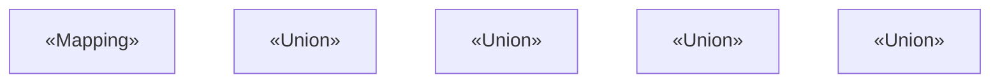
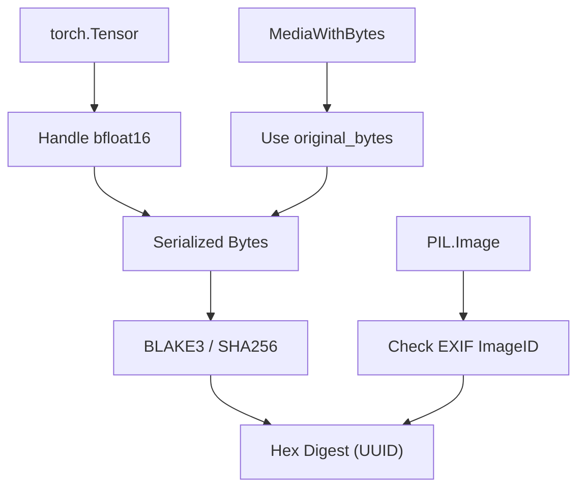

# Multimodal Data Processing

Relevant source files

-   [tests/entrypoints/pooling/embed/test\_online\_vision.py](https://github.com/vllm-project/vllm/blob/7cc302dd/tests/entrypoints/pooling/embed/test_online_vision.py)
-   [tests/models/multimodal/processing/test\_mllama4.py](https://github.com/vllm-project/vllm/blob/7cc302dd/tests/models/multimodal/processing/test_mllama4.py)
-   [tests/multimodal/assets/corrupted.mp4](https://github.com/vllm-project/vllm/blob/7cc302dd/tests/multimodal/assets/corrupted.mp4)
-   [tests/multimodal/assets/image1.png](https://github.com/vllm-project/vllm/blob/7cc302dd/tests/multimodal/assets/image1.png)
-   [tests/multimodal/assets/image2.png](https://github.com/vllm-project/vllm/blob/7cc302dd/tests/multimodal/assets/image2.png)
-   [tests/multimodal/media/test\_connector.py](https://github.com/vllm-project/vllm/blob/7cc302dd/tests/multimodal/media/test_connector.py)
-   [tests/multimodal/test\_hasher.py](https://github.com/vllm-project/vllm/blob/7cc302dd/tests/multimodal/test_hasher.py)
-   [tests/multimodal/test\_image.py](https://github.com/vllm-project/vllm/blob/7cc302dd/tests/multimodal/test_image.py)
-   [tests/multimodal/test\_inputs.py](https://github.com/vllm-project/vllm/blob/7cc302dd/tests/multimodal/test_inputs.py)
-   [tests/multimodal/test\_processing.py](https://github.com/vllm-project/vllm/blob/7cc302dd/tests/multimodal/test_processing.py)
-   [tests/multimodal/test\_utils.py](https://github.com/vllm-project/vllm/blob/7cc302dd/tests/multimodal/test_utils.py)
-   [tests/multimodal/test\_video.py](https://github.com/vllm-project/vllm/blob/7cc302dd/tests/multimodal/test_video.py)
-   [tests/multimodal/utils.py](https://github.com/vllm-project/vllm/blob/7cc302dd/tests/multimodal/utils.py)
-   [tests/test\_inputs.py](https://github.com/vllm-project/vllm/blob/7cc302dd/tests/test_inputs.py)
-   [tests/v1/core/test\_encoder\_cache\_manager.py](https://github.com/vllm-project/vllm/blob/7cc302dd/tests/v1/core/test_encoder_cache_manager.py)
-   [vllm/inputs/preprocess.py](https://github.com/vllm-project/vllm/blob/7cc302dd/vllm/inputs/preprocess.py)
-   [vllm/model\_executor/models/keye\_vl1\_5.py](https://github.com/vllm-project/vllm/blob/7cc302dd/vllm/model_executor/models/keye_vl1_5.py)
-   [vllm/model\_executor/models/kimi\_k25.py](https://github.com/vllm-project/vllm/blob/7cc302dd/vllm/model_executor/models/kimi_k25.py)
-   [vllm/model\_executor/models/kimi\_k25\_vit.py](https://github.com/vllm-project/vllm/blob/7cc302dd/vllm/model_executor/models/kimi_k25_vit.py)
-   [vllm/multimodal/\_\_init\_\_.py](https://github.com/vllm-project/vllm/blob/7cc302dd/vllm/multimodal/__init__.py)
-   [vllm/multimodal/hasher.py](https://github.com/vllm-project/vllm/blob/7cc302dd/vllm/multimodal/hasher.py)
-   [vllm/multimodal/image.py](https://github.com/vllm-project/vllm/blob/7cc302dd/vllm/multimodal/image.py)
-   [vllm/multimodal/inputs.py](https://github.com/vllm-project/vllm/blob/7cc302dd/vllm/multimodal/inputs.py)
-   [vllm/multimodal/media/\_\_init\_\_.py](https://github.com/vllm-project/vllm/blob/7cc302dd/vllm/multimodal/media/__init__.py)
-   [vllm/multimodal/media/connector.py](https://github.com/vllm-project/vllm/blob/7cc302dd/vllm/multimodal/media/connector.py)
-   [vllm/multimodal/processing/context.py](https://github.com/vllm-project/vllm/blob/7cc302dd/vllm/multimodal/processing/context.py)
-   [vllm/multimodal/processing/processor.py](https://github.com/vllm-project/vllm/blob/7cc302dd/vllm/multimodal/processing/processor.py)
-   [vllm/multimodal/registry.py](https://github.com/vllm-project/vllm/blob/7cc302dd/vllm/multimodal/registry.py)
-   [vllm/multimodal/utils.py](https://github.com/vllm-project/vllm/blob/7cc302dd/vllm/multimodal/utils.py)
-   [vllm/multimodal/video.py](https://github.com/vllm-project/vllm/blob/7cc302dd/vllm/multimodal/video.py)
-   [vllm/transformers\_utils/processor.py](https://github.com/vllm-project/vllm/blob/7cc302dd/vllm/transformers_utils/processor.py)
-   [vllm/transformers\_utils/processors/isaac.py](https://github.com/vllm-project/vllm/blob/7cc302dd/vllm/transformers_utils/processors/isaac.py)
-   [vllm/transformers\_utils/processors/pixtral.py](https://github.com/vllm-project/vllm/blob/7cc302dd/vllm/transformers_utils/processors/pixtral.py)
-   [vllm/transformers\_utils/processors/voxtral.py](https://github.com/vllm-project/vllm/blob/7cc302dd/vllm/transformers_utils/processors/voxtral.py)
-   [vllm/v1/attention/selector.py](https://github.com/vllm-project/vllm/blob/7cc302dd/vllm/v1/attention/selector.py)
-   [vllm/v1/core/encoder\_cache\_manager.py](https://github.com/vllm-project/vllm/blob/7cc302dd/vllm/v1/core/encoder_cache_manager.py)

Multimodal Data Processing in vLLM handles the conversion of images, audio, video, and embeddings from various formats into the internal representations required by multimodal models. This includes parsing chat messages with multimodal content, processing different input formats (PIL images, URLs, base64, embeddings), and preparing data for model execution.

## Overview

The multimodal processing pipeline consists of several key stages:

1.  **Chat Message Parsing** - Extract multimodal content from OpenAI-compatible chat messages.
2.  **Content Part Processing** - Convert different content formats (URLs, PIL images, embeddings) into standard representations.
3.  **MultiModalDataDict Assembly** - Organize processed data by modality.
4.  **Model-Specific Processing** - Apply model-specific transformations via `BaseMultiModalProcessor`.

**High-Level Processing Flow**

```mermaid
flowchart TD
    CHAT["OpenAIChatCompletionMessageParam"]
    DICT["PromptType{prompt, multi_modal_data}"]
    EXTRACT["Extract content parts"]
    PARSE_IMG["_parse_chat_message_content_part()"]
    PARSE_AUD["_parse_chat_message_content_part()"]
    PARSE_VID["_parse_chat_message_content_part()"]
    MM_DICT["MultiModalDataDict"]
    IMG_LIST["image: ModalityData[ImageItem]"]
    AUD_LIST["audio: ModalityData[AudioItem]"]
    VID_LIST["video: ModalityData[VideoItem]"]
    EMB_DICT["image_embeds: str | dict"]
    MM_REG["MultiModalRegistry"]
    MM_PROC["BaseMultiModalProcessor"]
    MM_INPUT["MultiModalInputs"]

    CHAT --> EXTRACT
    DICT --> MM_DICT
    EXTRACT --> PARSE_IMG
    EXTRACT --> PARSE_AUD
    EXTRACT --> PARSE_VID
    PARSE --> IMG_IMG_LIST
    PARSE --> AUD_AUD_LIST
    PARSE --> VID_VID_LIST
    IMG --> LIST_MM_DICT
    AUD --> LIST_MM_DICT
    VID --> LIST_MM_DICT
    MM --> DICT_MM_REG
    MM --> REG_MM_PROC
    MM --> PROC_MM_INPUT
```


**Sources:** [vllm/multimodal/registry.py98-132](https://github.com/vllm-project/vllm/blob/7cc302dd/vllm/multimodal/registry.py#L98-L132) [vllm/inputs/preprocess.py90-109](https://github.com/vllm-project/vllm/blob/7cc302dd/vllm/inputs/preprocess.py#L90-L109) [vllm/multimodal/processing/processor.py22-28](https://github.com/vllm-project/vllm/blob/7cc302dd/vllm/multimodal/processing/processor.py#L22-L28)

## MultiModalDataDict Structure

`MultiModalDataDict` is a type alias for a mapping that organizes multimodal data by modality. It serves as the standard container for passing multimodal inputs to vLLM models through the `LLM.generate` or `LLM.chat` interfaces.

**MultiModalDataDict Type Structure**


**Modality Types**

| Modality | Type | Description |
| --- | --- | --- |
| `image` | `ModalityData[ImageItem]` | Single or multiple images (PIL, Tensor, or Media wrapper). [vllm/multimodal/inputs.py58-66](https://github.com/vllm-project/vllm/blob/7cc302dd/vllm/multimodal/inputs.py#L58-L66) |
| `audio` | `ModalityData[AudioItem]` | Audio data, often `(waveform, sample_rate)` or embeddings. [vllm/multimodal/inputs.py81-93](https://github.com/vllm-project/vllm/blob/7cc302dd/vllm/multimodal/inputs.py#L81-L93) |
| `video` | `ModalityData[VideoItem]` | Video frames or clips with optional metadata. [vllm/multimodal/inputs.py68-79](https://github.com/vllm-project/vllm/blob/7cc302dd/vllm/multimodal/inputs.py#L68-L79) |
| `vision_chunk` | `ModalityData[VisionChunk]` | Unified modality for images and video chunks used in models like Kimi-K2.5. [vllm/multimodal/inputs.py96-114](https://github.com/vllm-project/vllm/blob/7cc302dd/vllm/multimodal/inputs.py#L96-L114) |

**Sources:** [vllm/multimodal/inputs.py38-114](https://github.com/vllm-project/vllm/blob/7cc302dd/vllm/multimodal/inputs.py#L38-L114) [vllm/inputs/preprocess.py38-43](https://github.com/vllm-project/vllm/blob/7cc302dd/vllm/inputs/preprocess.py#L38-L43)

### MultiModalUUIDDict

`MultiModalUUIDDict` stores user-provided UUIDs for multimodal items. These UUIDs are used to identify items for all caching purposes, including input processing, embedding caching, and prefix caching.

```
MultiModalUUIDDict: TypeAlias = Mapping[str, Sequence[str | None] | str]
```
**Sources:** [vllm/inputs/preprocess.py39](https://github.com/vllm-project/vllm/blob/7cc302dd/vllm/inputs/preprocess.py#L39-L39)

## Data Hashing and Deduplication

vLLM uses `MultiModalHasher` to generate unique identifiers for multimodal data when UUIDs are not provided. This is critical for the `EncoderCacheManager` to avoid redundant processing of the same media across different requests.

**Hashing Flow**


**Sources:** [vllm/multimodal/hasher.py50-132](https://github.com/vllm-project/vllm/blob/7cc302dd/vllm/multimodal/hasher.py#L50-L132) [vllm/multimodal/hasher.py154-162](https://github.com/vllm-project/vllm/blob/7cc302dd/vllm/multimodal/hasher.py#L154-L162)

## Image Data Processing

Images are typically processed through `InputPreprocessor`. vLLM supports standard OpenAI image URLs, local file paths, and direct PIL image objects.

### Image URL Types

1.  **Data URLs**: Base64 encoded strings (e.g., `data:image/jpeg;base64,...`).
2.  **Web URLs**: HTTP/HTTPS links.
3.  **Local Files**: `file://` paths.

**Sources:** [vllm/multimodal/utils.py56-84](https://github.com/vllm-project/vllm/blob/7cc302dd/vllm/multimodal/utils.py#L56-L84) [vllm/inputs/preprocess.py161-188](https://github.com/vllm-project/vllm/blob/7cc302dd/vllm/inputs/preprocess.py#L161-L188)

### Image Embeddings

Models can accept pre-computed embeddings directly. These are treated as image embeddings and passed to the model without HF processing. vLLM determines the batching strategy based on whether the input is a 3-D tensor or a batch of 2-D tensors.

**Sources:** [vllm/multimodal/inputs.py58-66](https://github.com/vllm-project/vllm/blob/7cc302dd/vllm/multimodal/inputs.py#L58-L66) [vllm/inputs/preprocess.py111-115](https://github.com/vllm-project/vllm/blob/7cc302dd/vllm/inputs/preprocess.py#L111-L115)

## Audio and Video Processing

### Audio

Audio data is represented as `HfAudioItem` (list, np.ndarray, or torch.Tensor). If a tuple `(audio, sampling_rate)` is provided, it is resampled to the model's sampling rate before being processed.

**Sources:** [vllm/multimodal/inputs.py81-93](https://github.com/vllm-project/vllm/blob/7cc302dd/vllm/multimodal/inputs.py#L81-L93) [vllm/multimodal/utils.py33-53](https://github.com/vllm-project/vllm/blob/7cc302dd/vllm/multimodal/utils.py#L33-L53)

### Video

Video processing involves frame extraction and metadata management. vLLM supports multiple backends via the `VIDEO_LOADER_REGISTRY`.

**Key Video Functions:**

-   `sample_frames_from_video`: Extracts a specific number of frames using linear interpolation. [vllm/multimodal/video.py47-54](https://github.com/vllm-project/vllm/blob/7cc302dd/vllm/multimodal/video.py#L47-L54)
-   `resize_video`: Resizes all frames in a video tensor using OpenCV. [vllm/multimodal/video.py26-36](https://github.com/vllm-project/vllm/blob/7cc302dd/vllm/multimodal/video.py#L26-L36)
-   `_read_frames_with_recovery`: An OpenCV-based method that attempts to recover from frame grab failures during loading by forward-scanning. [vllm/multimodal/video.py164-214](https://github.com/vllm-project/vllm/blob/7cc302dd/vllm/multimodal/video.py#L164-L214)

**Sources:** [vllm/multimodal/video.py73-109](https://github.com/vllm-project/vllm/blob/7cc302dd/vllm/multimodal/video.py#L73-L109) [vllm/multimodal/video.py114-138](https://github.com/vllm-project/vllm/blob/7cc302dd/vllm/multimodal/video.py#L114-L138)

## Multimodal Input Preprocessing

The `InputPreprocessor` class manages the transformation of high-level prompt types into `EngineInput`.

**Transformation Logic:**

1.  **Modality Detection**: Checks `multi_modal_data` in the prompt dictionary. [vllm/inputs/preprocess.py169-175](https://github.com/vllm-project/vllm/blob/7cc302dd/vllm/inputs/preprocess.py#L169-L175)
2.  **Processor Invocation**: Calls `self.renderer._process_multimodal` to apply model-specific processing. [vllm/inputs/preprocess.py103-109](https://github.com/vllm-project/vllm/blob/7cc302dd/vllm/inputs/preprocess.py#L103-L109)
3.  **Placeholder Management**: `PlaceholderRange` tracks the offset and length of multimodal placeholders in the prompt. [vllm/multimodal/inputs.py118-140](https://github.com/vllm-project/vllm/blob/7cc302dd/vllm/multimodal/inputs.py#L118-L140)

**Sources:** [vllm/inputs/preprocess.py48-60](https://github.com/vllm-project/vllm/blob/7cc302dd/vllm/inputs/preprocess.py#L48-L60) [vllm/multimodal/inputs.py118-140](https://github.com/vllm-project/vllm/blob/7cc302dd/vllm/multimodal/inputs.py#L118-L140)

## Model Registry and Processor Creation

Multimodal models register their processors using the `MULTIMODAL_REGISTRY`. The registration links a model class to a `MultiModalProcessorFactory`, `ProcessingInfoFactory`, and `DummyInputsBuilderFactory`.

**Processor Lifecycle**

> **[Mermaid sequence]**
> *(图表结构无法解析)*

**Sources:** [vllm/multimodal/registry.py81-96](https://github.com/vllm-project/vllm/blob/7cc302dd/vllm/multimodal/registry.py#L81-L96) [vllm/multimodal/registry.py134-166](https://github.com/vllm-project/vllm/blob/7cc302dd/vllm/multimodal/registry.py#L134-L166) [vllm/multimodal/registry.py196-220](https://github.com/vllm-project/vllm/blob/7cc302dd/vllm/multimodal/registry.py#L196-L220)

## Batching Multimodal Items

When multiple requests are batched, `group_and_batch_mm_items` ensures that multimodal data is grouped correctly for the model forward pass. Items must be split into different batches if:

1.  They have different fields (e.g., mixing image pixel values and pre-computed embeddings). [vllm/multimodal/utils.py174-175](https://github.com/vllm-project/vllm/blob/7cc302dd/vllm/multimodal/utils.py#L174-L175)
2.  They have different values in a `MultiModalSharedField`. [vllm/multimodal/utils.py176](https://github.com/vllm-project/vllm/blob/7cc302dd/vllm/multimodal/utils.py#L176-L176)

**Sources:** [vllm/multimodal/utils.py163-210](https://github.com/vllm-project/vllm/blob/7cc302dd/vllm/multimodal/utils.py#L163-L210) [vllm/multimodal/utils.py211-235](https://github.com/vllm-project/vllm/blob/7cc302dd/vllm/multimodal/utils.py#L211-L235)

## Encoder Cache Management (V1)

In the V1 engine, the `EncoderCacheManager` handles the lifecycle of multimodal encoder outputs (e.g., vision embeddings).

-   **Deduplication**: Uses `mm_hash` to share embeddings between different requests. [vllm/v1/core/encoder\_cache\_manager.py35-38](https://github.com/vllm-project/vllm/blob/7cc302dd/vllm/v1/core/encoder_cache_manager.py#L35-L38)
-   **Eviction**: Implements an LRU-style eviction strategy when cache space is full, targeting entries with zero references. [vllm/v1/core/encoder\_cache\_manager.py39-40](https://github.com/vllm-project/vllm/blob/7cc302dd/vllm/v1/core/encoder_cache_manager.py#L39-L40)
-   **Allocation**: `can_allocate` checks if there is sufficient free or reclaimable space for new multimodal inputs. [vllm/v1/core/encoder\_cache\_manager.py119-153](https://github.com/vllm-project/vllm/blob/7cc302dd/vllm/v1/core/encoder_cache_manager.py#L119-L153)

**Sources:** [vllm/v1/core/encoder\_cache\_manager.py17-65](https://github.com/vllm-project/vllm/blob/7cc302dd/vllm/v1/core/encoder_cache_manager.py#L17-L65) [vllm/v1/core/encoder\_cache\_manager.py91-117](https://github.com/vllm-project/vllm/blob/7cc302dd/vllm/v1/core/encoder_cache_manager.py#L91-L117)
