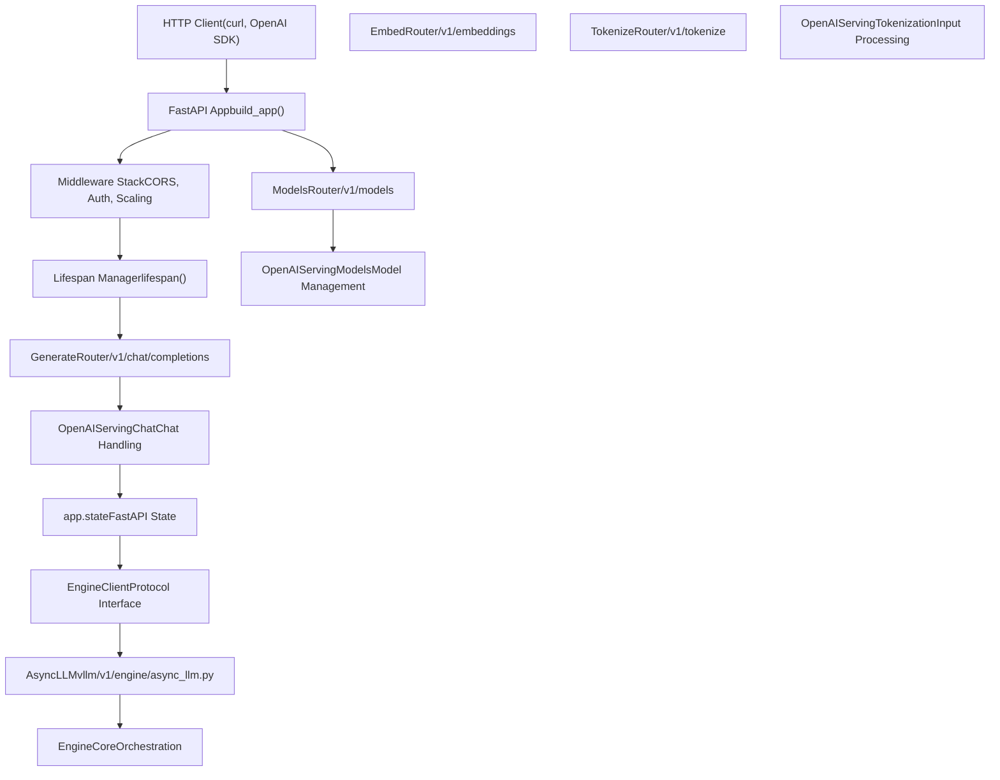
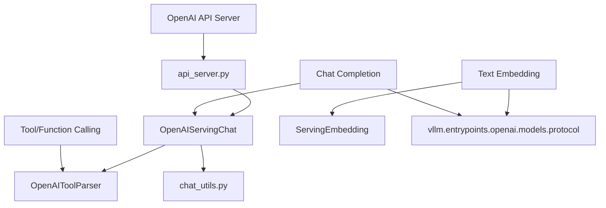

# Serving APIs

Relevant source files

-   [docs/configuration/conserving\_memory.md](https://github.com/vllm-project/vllm/blob/7cc302dd/docs/configuration/conserving_memory.md?plain=1)
-   [docs/configuration/optimization.md](https://github.com/vllm-project/vllm/blob/7cc302dd/docs/configuration/optimization.md?plain=1)
-   [docs/features/multimodal\_inputs.md](https://github.com/vllm-project/vllm/blob/7cc302dd/docs/features/multimodal_inputs.md?plain=1)
-   [examples/offline\_inference/mistral-small.py](https://github.com/vllm-project/vllm/blob/7cc302dd/examples/offline_inference/mistral-small.py)
-   [examples/online\_serving/openai\_chat\_completion\_client\_for\_multimodal.py](https://github.com/vllm-project/vllm/blob/7cc302dd/examples/online_serving/openai_chat_completion_client_for_multimodal.py)
-   [examples/online\_serving/openai\_responses\_client\_with\_mcp\_tools.py](https://github.com/vllm-project/vllm/blob/7cc302dd/examples/online_serving/openai_responses_client_with_mcp_tools.py)
-   [examples/online\_serving/utils.py](https://github.com/vllm-project/vllm/blob/7cc302dd/examples/online_serving/utils.py)
-   [tests/entrypoints/test\_chat\_utils.py](https://github.com/vllm-project/vllm/blob/7cc302dd/tests/entrypoints/test_chat_utils.py)
-   [tests/test\_envs.py](https://github.com/vllm-project/vllm/blob/7cc302dd/tests/test_envs.py)
-   [vllm/entrypoints/chat\_utils.py](https://github.com/vllm-project/vllm/blob/7cc302dd/vllm/entrypoints/chat_utils.py)
-   [vllm/entrypoints/openai/api\_server.py](https://github.com/vllm-project/vllm/blob/7cc302dd/vllm/entrypoints/openai/api_server.py)
-   [vllm/entrypoints/openai/cli\_args.py](https://github.com/vllm-project/vllm/blob/7cc302dd/vllm/entrypoints/openai/cli_args.py)
-   [vllm/tool\_parsers/openai\_tool\_parser.py](https://github.com/vllm-project/vllm/blob/7cc302dd/vllm/tool_parsers/openai_tool_parser.py)

## Purpose and Scope

This document describes vLLM's serving layer, which exposes OpenAI-compatible HTTP APIs for inference. It covers the FastAPI application setup, engine client integration, route registration, middleware, and application state initialization. The serving layer acts as the interface between external HTTP clients and vLLM's internal engine components, supporting text generation, multimodal inputs, and specialized pooling tasks.

For details on the FastAPI application structure and route registration, see [OpenAI-Compatible API Server](/vllm-project/vllm/6.1-openai-compatible-api-server). For chat template processing and message parsing, see [Chat Utilities and Message Processing](/vllm-project/vllm/6.2-chat-utilities-and-message-processing). For function calling and structured output, see [Tool Calling and Structured Output](/vllm-project/vllm/6.3-tool-calling-and-structured-output). For dynamic adapter management, see [LoRA Adapter Management](/vllm-project/vllm/6.4-lora-adapter-management).

## System Architecture

The serving layer consists of a FastAPI application that manages the HTTP interface, coordinates with the engine client for inference, and provides OpenAI-compatible endpoints. The system supports multiple deployment modes including single-process, multi-process API servers via RPC, and specialized render-only servers.

### High-Level Component Relationships

**Sources:** [vllm/entrypoints/openai/api\_server.py157-180](https://github.com/vllm-project/vllm/blob/7cc302dd/vllm/entrypoints/openai/api_server.py#L157-L180) [vllm/entrypoints/openai/api\_server.py182-200](https://github.com/vllm-project/vllm/blob/7cc302dd/vllm/entrypoints/openai/api_server.py#L182-L200) [vllm/entrypoints/openai/api\_server.py126-155](https://github.com/vllm-project/vllm/blob/7cc302dd/vllm/entrypoints/openai/api_server.py#L126-L155)

### Serving Entity Mapping

This diagram bridges serving concepts to the specific code entities that implement them, including the protocol definitions used for request/response validation.

**Sources:** [vllm/entrypoints/openai/api\_server.py182-210](https://github.com/vllm-project/vllm/blob/7cc302dd/vllm/entrypoints/openai/api_server.py#L182-L210) [vllm/tool\_parsers/openai\_tool\_parser.py31-40](https://github.com/vllm-project/vllm/blob/7cc302dd/vllm/tool_parsers/openai_tool_parser.py#L31-L40) [vllm/entrypoints/chat\_utils.py734-750](https://github.com/vllm-project/vllm/blob/7cc302dd/vllm/entrypoints/chat_utils.py#L734-L750)

## Supported API Suites

vLLM provides several API interfaces beyond basic text generation. These are registered conditionally based on the model's supported tasks and configuration.

### Generative and Multimodal APIs

The primary interface for Large Language Models (LLMs) and Vision-Language Models (VLMs). vLLM supports complex multimodal inputs including images, audio, and video within the chat completion framework.

-   **Completions:** `/v1/completions`
-   **Chat Completions:** `/v1/chat/completions` (Supports `image_url`, `audio_url`, and `video_url`).
-   **Multimodal Handling:** Handled via `parse_chat_messages` which converts OpenAI-formatted messages into `MultiModalDataDict`.

For details on multimodal input formats and message parsing, see [Chat Utilities and Message Processing](/vllm-project/vllm/6.2-chat-utilities-and-message-processing).

### Pooling and Utility APIs

Specialized endpoints for non-generative tasks.

-   **Embeddings:** `/v1/embeddings` (OpenAI-compatible).
-   **Tokenization:** `/v1/tokenize` and `/v1/detokenize`.
-   **Metadata:** `/v1/models` and `/tokenizer_info`.

| Feature | Code Implementation | Request Protocol |
| --- | --- | --- |
| Chat | `OpenAIServingChat` | `ChatCompletionRequest` |
| Tokenization | `OpenAIServingTokenization` | `TokenizeRequest` |
| Models | `OpenAIServingModels` | `BaseModelPath` |

**Sources:** [vllm/entrypoints/openai/api\_server.py186-210](https://github.com/vllm-project/vllm/blob/7cc302dd/vllm/entrypoints/openai/api_server.py#L186-L210) [vllm/entrypoints/chat\_utils.py734-750](https://github.com/vllm-project/vllm/blob/7cc302dd/vllm/entrypoints/chat_utils.py#L734-L750) [vllm/entrypoints/openai/models/serving.py34-40](https://github.com/vllm-project/vllm/blob/7cc302dd/vllm/entrypoints/openai/models/serving.py#L34-L40)

## Engine Client Integration

The serving layer communicates with vLLM's inference engine through the `EngineClient` protocol. The `build_async_engine_client` function manages the lifecycle of this connection, supporting both in-process and multiprocess RPC modes (using `forkserver` for pre-loading heavy modules).

> **[Mermaid sequence]**
> *(图表结构无法解析)*

**Sources:** [vllm/entrypoints/openai/api\_server.py78-106](https://github.com/vllm-project/vllm/blob/7cc302dd/vllm/entrypoints/openai/api_server.py#L78-L106) [vllm/entrypoints/openai/api\_server.py108-155](https://github.com/vllm-project/vllm/blob/7cc302dd/vllm/entrypoints/openai/api_server.py#L108-L155)

## Serving Utilities

### Chat Templates and Rendering

vLLM uses Jinja2 templates to convert structured chat messages into raw text prompts. This behavior can be customized via `--chat-template` or `--chat-template-content-format` (supporting `string` or `openai` formats). For details, see [Chat Utilities and Message Processing](/vllm-project/vllm/6.2-chat-utilities-and-message-processing).

### Tool Calling and Structured Output

vLLM supports automated tool choice and parsing of model-generated tool calls through the `ToolParserManager`. It integrates with various parsers like `OpenAIToolParser` to extract function calls from model outputs. For details, see [Tool Calling and Structured Output](/vllm-project/vllm/6.3-tool-calling-and-structured-output).

### LoRA Management

The API server allows dynamic loading and unloading of LoRA adapters. Adapters can be specified at startup via `--lora-modules` using a `name=path` format or a JSON configuration. For details, see [LoRA Adapter Management](/vllm-project/vllm/6.4-lora-adapter-management).

## Configuration and CLI

The server is configured via `BaseFrontendArgs` and `AsyncEngineArgs`. These handle network settings, security (API keys, CORS), and engine-specific performance tuning.

| Argument Category | Class | Key Fields |
| --- | --- | --- |
| Network/SSL | `BaseFrontendArgs` | `host`, `port`, `ssl_keyfile`, `api_key` |
| Chat/Templates | `BaseFrontendArgs` | `chat_template`, `tool_call_parser`, `lora_modules` |
| Security | `BaseFrontendArgs` | `allowed_media_domains`, `trust_request_chat_template` |

**Sources:** [vllm/entrypoints/openai/cli\_args.py70-158](https://github.com/vllm-project/vllm/blob/7cc302dd/vllm/entrypoints/openai/cli_args.py#L70-L158) [vllm/entrypoints/openai/api\_server.py31-34](https://github.com/vllm-project/vllm/blob/7cc302dd/vllm/entrypoints/openai/api_server.py#L31-L34)
