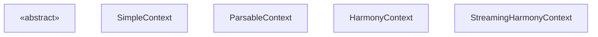
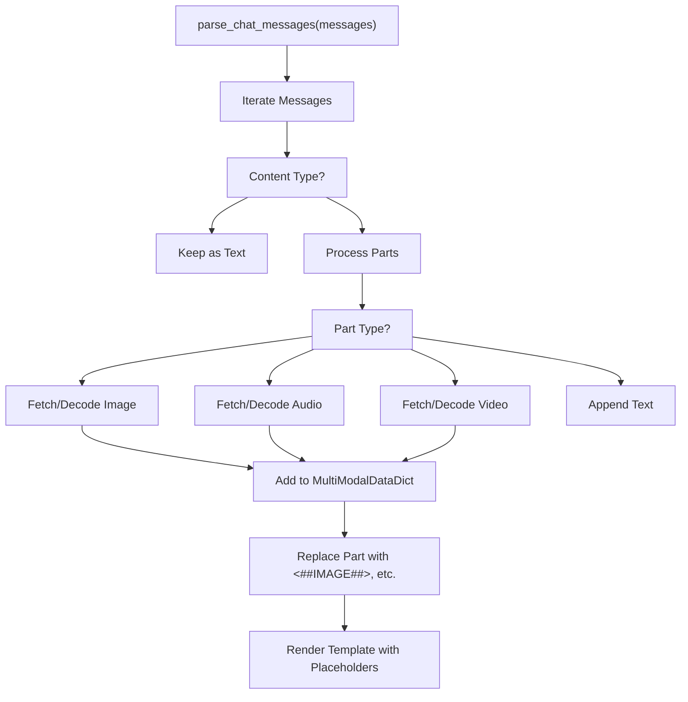
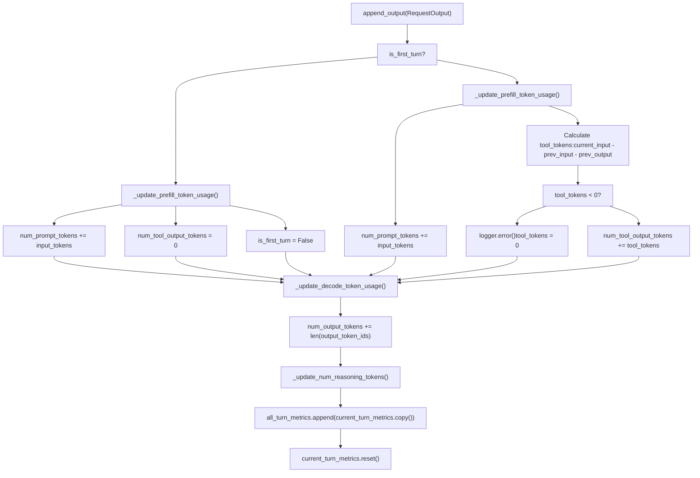

# Chat Utilities and Message Processing

Relevant source files

-   [docs/configuration/conserving\_memory.md](https://github.com/vllm-project/vllm/blob/7cc302dd/docs/configuration/conserving_memory.md?plain=1)
-   [docs/configuration/optimization.md](https://github.com/vllm-project/vllm/blob/7cc302dd/docs/configuration/optimization.md?plain=1)
-   [docs/features/multimodal\_inputs.md](https://github.com/vllm-project/vllm/blob/7cc302dd/docs/features/multimodal_inputs.md?plain=1)
-   [examples/offline\_inference/mistral-small.py](https://github.com/vllm-project/vllm/blob/7cc302dd/examples/offline_inference/mistral-small.py)
-   [examples/online\_serving/openai\_chat\_completion\_client\_for\_multimodal.py](https://github.com/vllm-project/vllm/blob/7cc302dd/examples/online_serving/openai_chat_completion_client_for_multimodal.py)
-   [examples/online\_serving/utils.py](https://github.com/vllm-project/vllm/blob/7cc302dd/examples/online_serving/utils.py)
-   [tests/entrypoints/openai/tool\_parsers/test\_openai\_tool\_parser.py](https://github.com/vllm-project/vllm/blob/7cc302dd/tests/entrypoints/openai/tool_parsers/test_openai_tool_parser.py)
-   [tests/entrypoints/test\_chat\_utils.py](https://github.com/vllm-project/vllm/blob/7cc302dd/tests/entrypoints/test_chat_utils.py)
-   [tests/tokenizers\_/test\_basic.py](https://github.com/vllm-project/vllm/blob/7cc302dd/tests/tokenizers_/test_basic.py)
-   [tests/tokenizers\_/test\_registry.py](https://github.com/vllm-project/vllm/blob/7cc302dd/tests/tokenizers_/test_registry.py)
-   [tests/tool\_parsers/test\_mistral\_tool\_parser.py](https://github.com/vllm-project/vllm/blob/7cc302dd/tests/tool_parsers/test_mistral_tool_parser.py)
-   [vllm/entrypoints/chat\_utils.py](https://github.com/vllm-project/vllm/blob/7cc302dd/vllm/entrypoints/chat_utils.py)
-   [vllm/entrypoints/serve/instrumentator/metrics.py](https://github.com/vllm-project/vllm/blob/7cc302dd/vllm/entrypoints/serve/instrumentator/metrics.py)
-   [vllm/tokenizers/\_\_init\_\_.py](https://github.com/vllm-project/vllm/blob/7cc302dd/vllm/tokenizers/__init__.py)
-   [vllm/tokenizers/deepseek\_v32.py](https://github.com/vllm-project/vllm/blob/7cc302dd/vllm/tokenizers/deepseek_v32.py)
-   [vllm/tokenizers/deepseek\_v32\_encoding.py](https://github.com/vllm-project/vllm/blob/7cc302dd/vllm/tokenizers/deepseek_v32_encoding.py)
-   [vllm/tokenizers/hf.py](https://github.com/vllm-project/vllm/blob/7cc302dd/vllm/tokenizers/hf.py)
-   [vllm/tokenizers/mistral.py](https://github.com/vllm-project/vllm/blob/7cc302dd/vllm/tokenizers/mistral.py)
-   [vllm/tokenizers/protocol.py](https://github.com/vllm-project/vllm/blob/7cc302dd/vllm/tokenizers/protocol.py)
-   [vllm/tokenizers/registry.py](https://github.com/vllm-project/vllm/blob/7cc302dd/vllm/tokenizers/registry.py)
-   [vllm/tool\_parsers/hermes\_tool\_parser.py](https://github.com/vllm-project/vllm/blob/7cc302dd/vllm/tool_parsers/hermes_tool_parser.py)
-   [vllm/tool\_parsers/jamba\_tool\_parser.py](https://github.com/vllm-project/vllm/blob/7cc302dd/vllm/tool_parsers/jamba_tool_parser.py)
-   [vllm/tool\_parsers/mistral\_tool\_parser.py](https://github.com/vllm-project/vllm/blob/7cc302dd/vllm/tool_parsers/mistral_tool_parser.py)
-   [vllm/transformers\_utils/tokenizer.py](https://github.com/vllm-project/vllm/blob/7cc302dd/vllm/transformers_utils/tokenizer.py)

This document describes vLLM's chat message utilities that parse, validate, and process chat conversations across the OpenAI-compatible API surface. These utilities handle chat template loading, message format validation, multimodal content processing, and conversion between different message representations.

For the OpenAI API server architecture, see [6.1](https://github.com/vllm-project/vllm/blob/7cc302dd/6.1) For tool calling and structured output, see [6.3](https://github.com/vllm-project/vllm/blob/7cc302dd/6.3)

## Overview of Conversation Contexts

vLLM provides multiple context implementations that manage state across conversation turns, track token usage, and handle tool interactions. All contexts implement the abstract `ConversationContext` interface.

### Context Hierarchy

**Sources:**

-   `vllm/entrypoints/openai/responses/context.py` (Classes defined in various ranges across the file)

## Chat Message Parsing and Multimodal Handling

The core utility for processing chat messages is `parse_chat_messages` (and its async counterpart `parse_chat_messages_async`). This function converts OpenAI-style message lists into a format suitable for vLLM's engine, specifically handling multimodal content like images, audio, and video.

### Multimodal Processing Flow

When a chat message contains multimodal content (e.g., `image_url`, `audio_url`), vLLM extracts the data and replaces the content with modality placeholders.

**Key Multimodal Utilities:**

-   `MODALITY_PLACEHOLDERS_MAP`: Maps modalities to internal placeholders like `<##IMAGE##>`, `<##AUDIO##>`, and `<##VIDEO##>` [vllm/entrypoints/chat\_utils.py96-100](https://github.com/vllm-project/vllm/blob/7cc302dd/vllm/entrypoints/chat_utils.py#L96-L100)
-   `MultiModalDataDict`: A dictionary mapping modalities to lists of processed data (e.g., `PIL.Image` objects or Tensors) [vllm/entrypoints/chat\_utils.py43](https://github.com/vllm-project/vllm/blob/7cc302dd/vllm/entrypoints/chat_utils.py#L43-L43)
-   `parse_chat_messages`: The primary entrypoint for synchronous message parsing [vllm/entrypoints/chat\_utils.py981](https://github.com/vllm-project/vllm/blob/7cc302dd/vllm/entrypoints/chat_utils.py#L981-L981)
-   `parse_chat_messages_async`: The asynchronous version that handles remote URL fetching [vllm/entrypoints/chat\_utils.py1152](https://github.com/vllm-project/vllm/blob/7cc302dd/vllm/entrypoints/chat_utils.py#L1152-L1152)

### Multimodal Input Constraints

The system enforces limits on the number of multimodal items per prompt via `ModelConfig.limit_mm_per_prompt`. If a request exceeds these limits, a `VLLMValidationError` is raised [vllm/entrypoints/chat\_utils.py1085-1090](https://github.com/vllm-project/vllm/blob/7cc302dd/vllm/entrypoints/chat_utils.py#L1085-L1090)

**Sources:**

-   [vllm/entrypoints/chat\_utils.py96-100](https://github.com/vllm-project/vllm/blob/7cc302dd/vllm/entrypoints/chat_utils.py#L96-L100)
-   [vllm/entrypoints/chat\_utils.py981-1150](https://github.com/vllm-project/vllm/blob/7cc302dd/vllm/entrypoints/chat_utils.py#L981-L1150)
-   [vllm/entrypoints/chat\_utils.py1152-1200](https://github.com/vllm-project/vllm/blob/7cc302dd/vllm/entrypoints/chat_utils.py#L1152-L1200)

## Chat Template Processing

vLLM uses Jinja2 templates to convert message lists into the final prompt string. This is primarily handled by the `BaseRenderer` and its subclasses.

### Template Resolution

Templates can be provided via:

1.  The `chat_template` argument in the API server.
2.  A file path.
3.  The model's default template from HuggingFace `tokenizer_config.json`.

The function `resolve_chat_template` in `vllm.renderers.hf` (aliased in `chat_utils.py`) handles this resolution logic [vllm/entrypoints/chat\_utils.py72-83](https://github.com/vllm-project/vllm/blob/7cc302dd/vllm/entrypoints/chat_utils.py#L72-L83)

### Specialized Tokenizers and Templates

vLLM supports specialized tokenizer logic for specific models that do not use standard Jinja templates:

-   **Mistral**: Uses `MistralTokenizer` from the `mistral-common` library [vllm/tokenizers/mistral.py24-26](https://github.com/vllm-project/vllm/blob/7cc302dd/vllm/tokenizers/mistral.py#L24-L26) It includes logic for truncating tool call IDs [vllm/tokenizers/mistral.py92-121](https://github.com/vllm-project/vllm/blob/7cc302dd/vllm/tokenizers/mistral.py#L92-L121)
-   **DeepSeek V3.2**: Uses a custom `DeepseekV32Tokenizer` that wraps an HF tokenizer to use specific message encoding logic [vllm/tokenizers/deepseek\_v32.py15-18](https://github.com/vllm-project/vllm/blob/7cc302dd/vllm/tokenizers/deepseek_v32.py#L15-L18)

### Rendering Flow in OpenAIServingChat

> **[Mermaid sequence]**
> *(图表结构无法解析)*

**Sources:**

-   [vllm/entrypoints/chat\_utils.py72-83](https://github.com/vllm-project/vllm/blob/7cc302dd/vllm/entrypoints/chat_utils.py#L72-L83)
-   [vllm/tokenizers/mistral.py92-121](https://github.com/vllm-project/vllm/blob/7cc302dd/vllm/tokenizers/mistral.py#L92-L121)
-   [vllm/tokenizers/deepseek\_v32.py15-18](https://github.com/vllm-project/vllm/blob/7cc302dd/vllm/tokenizers/deepseek_v32.py#L15-L18)

## Token Tracking and Usage Accounting

Usage information is tracked via the `UsageInfo` classes. In the `Responses` API, this is managed by the context objects.

### Usage Metrics Structure

vLLM provides detailed breakdown of token usage, including prompt cache hits and multimodal details.

| Field | Description |
| --- | --- |
| `prompt_tokens` | Total tokens in the input. |
| `completion_tokens` | Tokens generated by the model. |
| `cached_tokens` | Tokens retrieved from prefix cache. |
| `reasoning_tokens` | Tokens generated in a reasoning/thought block. |

**Sources:**

-   `vllm/entrypoints/openai/engine/protocol.py`
-   `vllm/entrypoints/openai/chat_completion/protocol.py`

## SimpleContext and Streaming

`SimpleContext` provides basic token tracking and output accumulation without tool support. It is used for simple completion scenarios.

### Token Accumulation in Streaming Mode

> **[Mermaid sequence]**
> *(图表结构无法解析)*

**Sources:**

-   `vllm/entrypoints/openai/responses/context.py`

## HarmonyContext and Multi-Turn Logic

`HarmonyContext` provides full-featured multi-turn conversation management with detailed token tracking, including tool output tokens and reasoning tokens. It uses the OpenAI Harmony message format.

### Token Calculation Flow

**Sources:**

-   `vllm/entrypoints/openai/responses/context.py`

## Tool Parsing Utilities

When models generate tool calls, vLLM uses specialized parsers to extract structured data from raw text.

### Hermes and Mistral Parsers

-   **Hermes2ProToolParser**: Uses regex to find `<tool_call>` tags and `partial_json_parser` to handle streaming JSON tool arguments [vllm/tool\_parsers/hermes\_tool\_parser.py34-54](https://github.com/vllm-project/vllm/blob/7cc302dd/vllm/tool_parsers/hermes_tool_parser.py#L34-L54)
-   **MistralToolParser**: Specialized for Mistral models, handling the specific tokens and formatting used in Mistral's tool calling implementation [vllm/tool\_parsers/mistral\_tool\_parser.py20](https://github.com/vllm-project/vllm/blob/7cc302dd/vllm/tool_parsers/mistral_tool_parser.py#L20-L20)

**Sources:**

-   [vllm/tool\_parsers/hermes\_tool\_parser.py34-54](https://github.com/vllm-project/vllm/blob/7cc302dd/vllm/tool_parsers/hermes_tool_parser.py#L34-L54)
-   [vllm/tool\_parsers/mistral\_tool\_parser.py20](https://github.com/vllm-project/vllm/blob/7cc302dd/vllm/tool_parsers/mistral_tool_parser.py#L20-L20)
