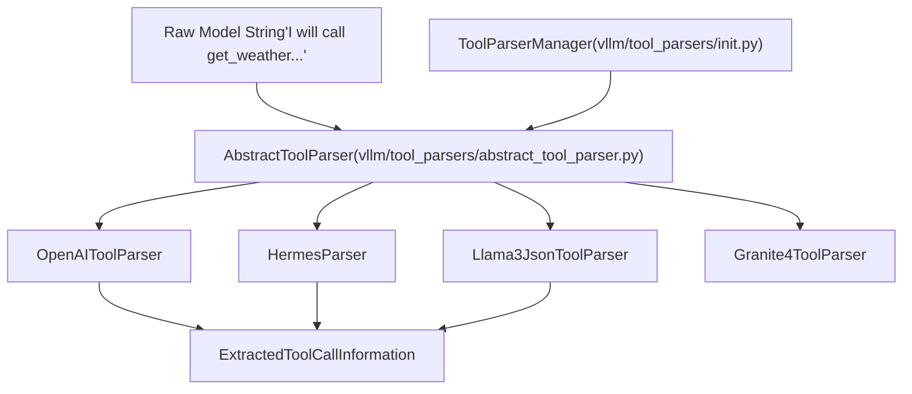
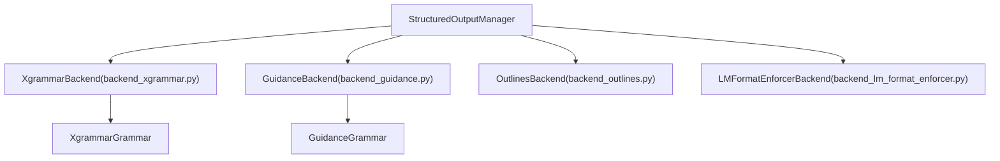

# Tool Calling and Structured Output

Relevant source files

-   [docs/features/reasoning\_outputs.md](https://github.com/vllm-project/vllm/blob/7cc302dd/docs/features/reasoning_outputs.md?plain=1)
-   [docs/features/tool\_calling.md](https://github.com/vllm-project/vllm/blob/7cc302dd/docs/features/tool_calling.md?plain=1)
-   [examples/tool\_chat\_template\_deepseekv31.jinja](https://github.com/vllm-project/vllm/blob/7cc302dd/examples/tool_chat_template_deepseekv31.jinja)
-   [examples/tool\_chat\_template\_minimax\_m1.jinja](https://github.com/vllm-project/vllm/blob/7cc302dd/examples/tool_chat_template_minimax_m1.jinja)
-   [tests/entrypoints/openai/chat\_completion/test\_chat\_error.py](https://github.com/vllm-project/vllm/blob/7cc302dd/tests/entrypoints/openai/chat_completion/test_chat_error.py)
-   [tests/entrypoints/openai/chat\_completion/test\_serving\_chat.py](https://github.com/vllm-project/vllm/blob/7cc302dd/tests/entrypoints/openai/chat_completion/test_serving_chat.py)
-   [tests/entrypoints/openai/completion/test\_completion\_error.py](https://github.com/vllm-project/vllm/blob/7cc302dd/tests/entrypoints/openai/completion/test_completion_error.py)
-   [tests/entrypoints/openai/completion/test\_lora\_resolvers.py](https://github.com/vllm-project/vllm/blob/7cc302dd/tests/entrypoints/openai/completion/test_lora_resolvers.py)
-   [tests/entrypoints/openai/parser/\_\_init\_\_.py](https://github.com/vllm-project/vllm/blob/7cc302dd/tests/entrypoints/openai/parser/__init__.py)
-   [tests/entrypoints/openai/utils.py](https://github.com/vllm-project/vllm/blob/7cc302dd/tests/entrypoints/openai/utils.py)
-   [tests/models/multimodal/generation/test\_voxtral.py](https://github.com/vllm-project/vllm/blob/7cc302dd/tests/models/multimodal/generation/test_voxtral.py)
-   [tests/reasoning/test\_base\_thinking\_reasoning\_parser.py](https://github.com/vllm-project/vllm/blob/7cc302dd/tests/reasoning/test_base_thinking_reasoning_parser.py)
-   [tests/reasoning/test\_deepseekv3\_reasoning\_parser.py](https://github.com/vllm-project/vllm/blob/7cc302dd/tests/reasoning/test_deepseekv3_reasoning_parser.py)
-   [tests/reasoning/test\_glm4\_moe\_reasoning\_parser.py](https://github.com/vllm-project/vllm/blob/7cc302dd/tests/reasoning/test_glm4_moe_reasoning_parser.py)
-   [tests/reasoning/test\_gptoss\_reasoning\_parser.py](https://github.com/vllm-project/vllm/blob/7cc302dd/tests/reasoning/test_gptoss_reasoning_parser.py)
-   [tests/reasoning/test\_holo2\_reasoning\_parser.py](https://github.com/vllm-project/vllm/blob/7cc302dd/tests/reasoning/test_holo2_reasoning_parser.py)
-   [tests/reasoning/test\_hunyuan\_reasoning\_parser.py](https://github.com/vllm-project/vllm/blob/7cc302dd/tests/reasoning/test_hunyuan_reasoning_parser.py)
-   [tests/reasoning/test\_mistral\_reasoning\_parser.py](https://github.com/vllm-project/vllm/blob/7cc302dd/tests/reasoning/test_mistral_reasoning_parser.py)
-   [tests/reasoning/utils.py](https://github.com/vllm-project/vllm/blob/7cc302dd/tests/reasoning/utils.py)
-   [tests/renderers/test\_completions.py](https://github.com/vllm-project/vllm/blob/7cc302dd/tests/renderers/test_completions.py)
-   [tests/tool\_use/test\_tool\_choice\_required.py](https://github.com/vllm-project/vllm/blob/7cc302dd/tests/tool_use/test_tool_choice_required.py)
-   [tests/v1/structured\_output/test\_reasoning\_structured\_output.py](https://github.com/vllm-project/vllm/blob/7cc302dd/tests/v1/structured_output/test_reasoning_structured_output.py)
-   [tests/v1/structured\_output/test\_utils.py](https://github.com/vllm-project/vllm/blob/7cc302dd/tests/v1/structured_output/test_utils.py)
-   [vllm/entrypoints/mcp/\_\_init\_\_.py](https://github.com/vllm-project/vllm/blob/7cc302dd/vllm/entrypoints/mcp/__init__.py)
-   [vllm/entrypoints/mcp/tool.py](https://github.com/vllm-project/vllm/blob/7cc302dd/vllm/entrypoints/mcp/tool.py)
-   [vllm/entrypoints/mcp/tool\_server.py](https://github.com/vllm-project/vllm/blob/7cc302dd/vllm/entrypoints/mcp/tool_server.py)
-   [vllm/reasoning/\_\_init\_\_.py](https://github.com/vllm-project/vllm/blob/7cc302dd/vllm/reasoning/__init__.py)
-   [vllm/reasoning/abs\_reasoning\_parsers.py](https://github.com/vllm-project/vllm/blob/7cc302dd/vllm/reasoning/abs_reasoning_parsers.py)
-   [vllm/reasoning/basic\_parsers.py](https://github.com/vllm-project/vllm/blob/7cc302dd/vllm/reasoning/basic_parsers.py)
-   [vllm/reasoning/deepseek\_v3\_reasoning\_parser.py](https://github.com/vllm-project/vllm/blob/7cc302dd/vllm/reasoning/deepseek_v3_reasoning_parser.py)
-   [vllm/reasoning/gptoss\_reasoning\_parser.py](https://github.com/vllm-project/vllm/blob/7cc302dd/vllm/reasoning/gptoss_reasoning_parser.py)
-   [vllm/reasoning/hunyuan\_a13b\_reasoning\_parser.py](https://github.com/vllm-project/vllm/blob/7cc302dd/vllm/reasoning/hunyuan_a13b_reasoning_parser.py)
-   [vllm/reasoning/identity\_reasoning\_parser.py](https://github.com/vllm-project/vllm/blob/7cc302dd/vllm/reasoning/identity_reasoning_parser.py)
-   [vllm/reasoning/kimi\_k2\_reasoning\_parser.py](https://github.com/vllm-project/vllm/blob/7cc302dd/vllm/reasoning/kimi_k2_reasoning_parser.py)
-   [vllm/reasoning/mistral\_reasoning\_parser.py](https://github.com/vllm-project/vllm/blob/7cc302dd/vllm/reasoning/mistral_reasoning_parser.py)
-   [vllm/reasoning/step3\_reasoning\_parser.py](https://github.com/vllm-project/vllm/blob/7cc302dd/vllm/reasoning/step3_reasoning_parser.py)
-   [vllm/renderers/base.py](https://github.com/vllm-project/vllm/blob/7cc302dd/vllm/renderers/base.py)
-   [vllm/renderers/deepseek\_v32.py](https://github.com/vllm-project/vllm/blob/7cc302dd/vllm/renderers/deepseek_v32.py)
-   [vllm/renderers/grok2.py](https://github.com/vllm-project/vllm/blob/7cc302dd/vllm/renderers/grok2.py)
-   [vllm/renderers/hf.py](https://github.com/vllm-project/vllm/blob/7cc302dd/vllm/renderers/hf.py)
-   [vllm/renderers/mistral.py](https://github.com/vllm-project/vllm/blob/7cc302dd/vllm/renderers/mistral.py)
-   [vllm/renderers/registry.py](https://github.com/vllm-project/vllm/blob/7cc302dd/vllm/renderers/registry.py)
-   [vllm/renderers/terratorch.py](https://github.com/vllm-project/vllm/blob/7cc302dd/vllm/renderers/terratorch.py)
-   [vllm/third\_party/flashmla/\_\_init\_\_.py](https://github.com/vllm-project/vllm/blob/7cc302dd/vllm/third_party/flashmla/__init__.py)
-   [vllm/tool\_parsers/\_\_init\_\_.py](https://github.com/vllm-project/vllm/blob/7cc302dd/vllm/tool_parsers/__init__.py)
-   [vllm/tool\_parsers/granite4\_tool\_parser.py](https://github.com/vllm-project/vllm/blob/7cc302dd/vllm/tool_parsers/granite4_tool_parser.py)
-   [vllm/v1/attention/ops/flashmla.py](https://github.com/vllm-project/vllm/blob/7cc302dd/vllm/v1/attention/ops/flashmla.py)
-   [vllm/v1/structured\_output/\_\_init\_\_.py](https://github.com/vllm-project/vllm/blob/7cc302dd/vllm/v1/structured_output/__init__.py)
-   [vllm/v1/structured\_output/backend\_guidance.py](https://github.com/vllm-project/vllm/blob/7cc302dd/vllm/v1/structured_output/backend_guidance.py)
-   [vllm/v1/structured\_output/backend\_lm\_format\_enforcer.py](https://github.com/vllm-project/vllm/blob/7cc302dd/vllm/v1/structured_output/backend_lm_format_enforcer.py)
-   [vllm/v1/structured\_output/backend\_outlines.py](https://github.com/vllm-project/vllm/blob/7cc302dd/vllm/v1/structured_output/backend_outlines.py)
-   [vllm/v1/structured\_output/backend\_types.py](https://github.com/vllm-project/vllm/blob/7cc302dd/vllm/v1/structured_output/backend_types.py)
-   [vllm/v1/structured\_output/backend\_xgrammar.py](https://github.com/vllm-project/vllm/blob/7cc302dd/vllm/v1/structured_output/backend_xgrammar.py)
-   [vllm/v1/structured\_output/request.py](https://github.com/vllm-project/vllm/blob/7cc302dd/vllm/v1/structured_output/request.py)
-   [vllm/v1/structured\_output/utils.py](https://github.com/vllm-project/vllm/blob/7cc302dd/vllm/v1/structured_output/utils.py)

This page documents vLLM's tool calling and structured output systems. These features enable models to generate outputs that conform to specific formats (structured output via grammars) and to invoke external tools or functions (tool calling).

---

## Purpose and Scope

The tool calling and structured output systems provide:

1.  **Tool Calling**: Mechanisms for models to generate function/tool invocations in OpenAI-compatible format, with support for tool parsers, MCP (Model Context Protocol) integration, and auto tool selection [docs/features/tool\_calling.md1-14](https://github.com/vllm-project/vllm/blob/7cc302dd/docs/features/tool_calling.md?plain=1#L1-L14)
2.  **Structured Output**: Grammar-based output constraints using FSM (Finite State Machine) compilation (via backends like `xgrammar`, `outlines`, or `llguidance`) to ensure model outputs conform to specified JSON schemas, regex, or EBNF grammars [vllm/v1/structured\_output/\_\_init\_\_.py111-146](https://github.com/vllm-project/vllm/blob/7cc302dd/vllm/v1/structured_output/__init__.py#L111-L146)
3.  **Reasoning Integration**: Support for reasoning models (e.g., DeepSeek R1) to separate CoT (Chain of Thought) from final structured conclusions [docs/features/reasoning\_outputs.md1-9](https://github.com/vllm-project/vllm/blob/7cc302dd/docs/features/reasoning_outputs.md?plain=1#L1-L9)

---

## Tool Calling Architecture

### Tool Parser System

Tool parsers extract structured tool call information from model-generated text. vLLM supports named function calling, as well as `auto`, `required`, and `none` options for the `tool_choice` field [docs/features/tool\_calling.md1-4](https://github.com/vllm-project/vllm/blob/7cc302dd/docs/features/tool_calling.md?plain=1#L1-L4)

**Natural Language Space to Code Entity Space: Tool Parsing**

Sources: [vllm/tool\_parsers/abstract\_tool\_parser.py10-50](https://github.com/vllm-project/vllm/blob/7cc302dd/vllm/tool_parsers/abstract_tool_parser.py#L10-L50) [vllm/tool\_parsers/\_\_init\_\_.py1-20](https://github.com/vllm-project/vllm/blob/7cc302dd/vllm/tool_parsers/__init__.py#L1-L20) [vllm/tool\_parsers/granite4\_tool\_parser.py15-30](https://github.com/vllm-project/vllm/blob/7cc302dd/vllm/tool_parsers/granite4_tool_parser.py#L15-L30)

### Constrained Decoding Behavior

Whether vLLM enforces a schema during generation depends on the `tool_choice` mode [docs/features/tool\_calling.md110-121](https://github.com/vllm-project/vllm/blob/7cc302dd/docs/features/tool_calling.md?plain=1#L110-L121):

| `tool_choice` | Schema-constrained | Behavior |
| --- | --- | --- |
| **Named function** | Yes | Arguments guaranteed to match the specific function's JSON schema via structured outputs backend. |
| **`"required"`** | Yes | Model must produce at least one tool call matching the provided list. |
| **`"auto"`** | No | Model generates freely; parser extracts calls. Arguments may be malformed. |
| **`"none"`** | N/A | No tool calls are produced. |

### MCP (Model Context Protocol) Integration

vLLM supports MCP tools to integrate external services. The `ReasoningParser` can prepare structured tags for formatting reasoning output when a `ToolServer` is present [vllm/reasoning/abs\_reasoning\_parsers.py153-162](https://github.com/vllm-project/vllm/blob/7cc302dd/vllm/reasoning/abs_reasoning_parsers.py#L153-L162) For instance, `GptOssReasoningParser` checks for builtin tools like `browser`, `python`, or `container` on the `ToolServer` to adjust reasoning tags [vllm/reasoning/gptoss\_reasoning\_parser.py161-176](https://github.com/vllm-project/vllm/blob/7cc302dd/vllm/reasoning/gptoss_reasoning_parser.py#L161-L176)

---

## Structured Output System

### Backend Management

vLLM V1 uses the `StructuredOutputManager` to coordinate FSM compilation and logit masking. It supports multiple backends: `xgrammar`, `guidance` (via `llguidance`), `outlines`, and `lm-format-enforcer` [vllm/v1/structured\_output/\_\_init\_\_.py35-146](https://github.com/vllm-project/vllm/blob/7cc302dd/vllm/v1/structured_output/__init__.py#L35-L146)

**Code Entity Space: Structured Output Logic**

Sources: [vllm/v1/structured\_output/\_\_init\_\_.py111-146](https://github.com/vllm-project/vllm/blob/7cc302dd/vllm/v1/structured_output/__init__.py#L111-L146) [vllm/v1/structured\_output/backend\_xgrammar.py35-122](https://github.com/vllm-project/vllm/blob/7cc302dd/vllm/v1/structured_output/backend_xgrammar.py#L35-L122) [vllm/v1/structured\_output/backend\_guidance.py85-122](https://github.com/vllm-project/vllm/blob/7cc302dd/vllm/v1/structured_output/backend_guidance.py#L85-L122)

### The Compilation Pipeline

1.  **Initialization**: `grammar_init` is called for requests with `structured_outputs`. It initializes the backend on the first request [vllm/v1/structured\_output/\_\_init\_\_.py97-112](https://github.com/vllm-project/vllm/blob/7cc302dd/vllm/v1/structured_output/__init__.py#L97-L112)
2.  **Async Compilation**: Compilation is offloaded to a `ThreadPoolExecutor` (unless `external_launcher` is used) to avoid blocking the engine [vllm/v1/structured\_output/\_\_init\_\_.py49-153](https://github.com/vllm-project/vllm/blob/7cc302dd/vllm/v1/structured_output/__init__.py#L49-L153)
3.  **Bitmask Generation**: During the forward pass, the backend (e.g., `XgrammarBackend`) allocates and fills a bitmask [vllm/v1/structured\_output/backend\_xgrammar.py124-125](https://github.com/vllm-project/vllm/blob/7cc302dd/vllm/v1/structured_output/backend_xgrammar.py#L124-L125)
4.  **Logit Masking**: The bitmask is applied to logits using `xgr.apply_token_bitmask_inplace` [vllm/v1/structured\_output/utils.py122-136](https://github.com/vllm-project/vllm/blob/7cc302dd/vllm/v1/structured_output/utils.py#L122-L136)

### Logit Masking Data Flow

> **[Mermaid sequence]**
> *(图表结构无法解析)*

Sources: [vllm/v1/structured\_output/\_\_init\_\_.py97-166](https://github.com/vllm-project/vllm/blob/7cc302dd/vllm/v1/structured_output/__init__.py#L97-L166) [vllm/v1/structured\_output/utils.py45-137](https://github.com/vllm-project/vllm/blob/7cc302dd/vllm/v1/structured_output/utils.py#L45-L137)

---

## Reasoning and Structured Output

Reasoning models (like DeepSeek R1) generate a reasoning block (often wrapped in tags like `<think>`) before the final response [docs/features/reasoning\_outputs.md3-5](https://github.com/vllm-project/vllm/blob/7cc302dd/docs/features/reasoning_outputs.md?plain=1#L3-L5) vLLM uses `ReasoningParser` to handle this split [vllm/reasoning/abs\_reasoning\_parsers.py25-31](https://github.com/vllm-project/vllm/blob/7cc302dd/vllm/reasoning/abs_reasoning_parsers.py#L25-L31)

### Reasoning Parsers

The `ReasoningParserManager` handles registration of parsers for various models [vllm/reasoning/\_\_init\_\_.py22-175](https://github.com/vllm-project/vllm/blob/7cc302dd/vllm/reasoning/__init__.py#L22-L175):

-   **DeepSeek R1**: Uses `DeepSeekR1ReasoningParser`.
-   **GptOss**: Uses `GptOssReasoningParser` which interacts with the "Harmony" protocol to detect reasoning ends and extract content [vllm/reasoning/gptoss\_reasoning\_parser.py65-113](https://github.com/vllm-project/vllm/blob/7cc302dd/vllm/reasoning/gptoss_reasoning_parser.py#L65-L113)
-   **Qwen3**: Uses `Qwen3ReasoningParser`.
-   **Mistral**: Uses `MistralReasoningParser`.

### Integration with Structured Output

For reasoning models, structured output constraints are typically applied **after** the reasoning block ends. The `is_reasoning_end` method determines when the model has finished thinking and the grammar constraints should begin to apply [vllm/reasoning/abs\_reasoning\_parsers.py42-57](https://github.com/vllm-project/vllm/blob/7cc302dd/vllm/reasoning/abs_reasoning_parsers.py#L42-L57)

| Feature | Reasoning Model Behavior |
| --- | --- |
| **Streaming** | `extract_reasoning_streaming` yields `DeltaMessage` objects containing reasoning deltas and content deltas separately [vllm/reasoning/abs\_reasoning\_parsers.py136-151](https://github.com/vllm-project/vllm/blob/7cc302dd/vllm/reasoning/abs_reasoning_parsers.py#L136-L151) [vllm/reasoning/gptoss\_reasoning\_parser.py121-148](https://github.com/vllm-project/vllm/blob/7cc302dd/vllm/reasoning/gptoss_reasoning_parser.py#L121-L148) |
| **Logits** | The bitmask is applied only once the `ReasoningParser` signals the end of reasoning. |
| **Counting** | `count_reasoning_tokens` tracks tokens spent in the thinking phase for usage metrics [vllm/reasoning/abs\_reasoning\_parsers.py96-113](https://github.com/vllm-project/vllm/blob/7cc302dd/vllm/reasoning/abs_reasoning_parsers.py#L96-L113) |

Sources: [vllm/reasoning/abs\_reasoning\_parsers.py25-113](https://github.com/vllm-project/vllm/blob/7cc302dd/vllm/reasoning/abs_reasoning_parsers.py#L25-L113) [vllm/v1/structured\_output/\_\_init\_\_.py78-95](https://github.com/vllm-project/vllm/blob/7cc302dd/vllm/v1/structured_output/__init__.py#L78-L95) [docs/features/reasoning\_outputs.md12-27](https://github.com/vllm-project/vllm/blob/7cc302dd/docs/features/reasoning_outputs.md?plain=1#L12-L27)

---

## Summary of Backends

| Backend | Capability | Key Code Entity |
| --- | --- | --- |
| **Xgrammar** | High-performance JSON/Regex/Grammar with jump-forward support | `XgrammarBackend` [vllm/v1/structured\_output/backend\_xgrammar.py35](https://github.com/vllm-project/vllm/blob/7cc302dd/vllm/v1/structured_output/backend_xgrammar.py#L35-L35) |
| **Guidance** | Advanced EBNF and structural tags via `llguidance` | `GuidanceBackend` [vllm/v1/structured\_output/backend\_guidance.py86](https://github.com/vllm-project/vllm/blob/7cc302dd/vllm/v1/structured_output/backend_guidance.py#L86-L86) |
| **Outlines** | Robust FSM-based regex and JSON | `OutlinesBackend` [vllm/v1/structured\_output/backend\_outlines.py129](https://github.com/vllm-project/vllm/blob/7cc302dd/vllm/v1/structured_output/backend_outlines.py#L129-L129) |
| **LM Format Enforcer** | JSON Schema enforcement | `LMFormatEnforcerBackend` [vllm/v1/structured\_output/backend\_lm\_format\_enforcer.py141](https://github.com/vllm-project/vllm/blob/7cc302dd/vllm/v1/structured_output/backend_lm_format_enforcer.py#L141-L141) |

Sources: [vllm/v1/structured\_output/\_\_init\_\_.py111-146](https://github.com/vllm-project/vllm/blob/7cc302dd/vllm/v1/structured_output/__init__.py#L111-L146) [vllm/v1/structured\_output/backend\_xgrammar.py132-142](https://github.com/vllm-project/vllm/blob/7cc302dd/vllm/v1/structured_output/backend_xgrammar.py#L132-L142)
