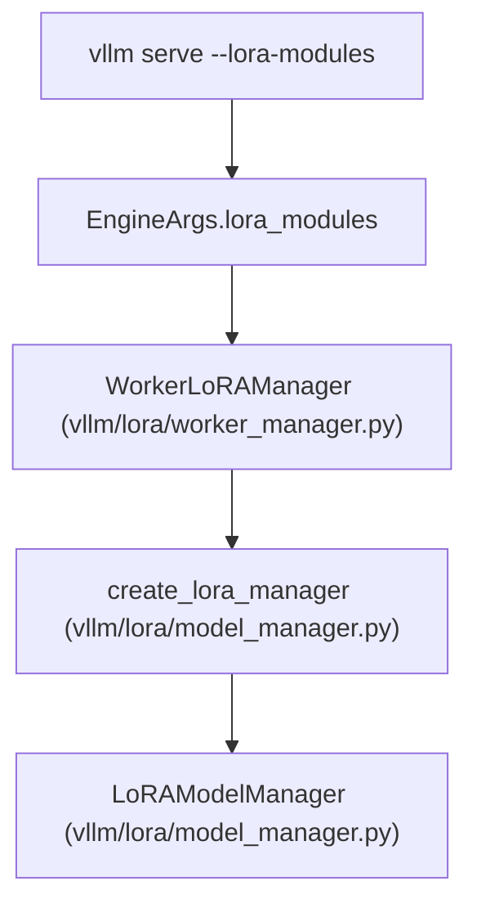

# LoRA Adapter Management

Relevant source files

-   [.buildkite/test\_areas/lora.yaml](https://github.com/vllm-project/vllm/blob/7cc302dd/.buildkite/test_areas/lora.yaml)
-   [benchmarks/kernels/benchmark\_lora.py](https://github.com/vllm-project/vllm/blob/7cc302dd/benchmarks/kernels/benchmark_lora.py)
-   [docs/features/lora.md](https://github.com/vllm-project/vllm/blob/7cc302dd/docs/features/lora.md?plain=1)
-   [tests/lora/conftest.py](https://github.com/vllm-project/vllm/blob/7cc302dd/tests/lora/conftest.py)
-   [tests/lora/test\_add\_lora.py](https://github.com/vllm-project/vllm/blob/7cc302dd/tests/lora/test_add_lora.py)
-   [tests/lora/test\_chatglm3\_tp.py](https://github.com/vllm-project/vllm/blob/7cc302dd/tests/lora/test_chatglm3_tp.py)
-   [tests/lora/test\_fused\_moe\_lora\_kernel.py](https://github.com/vllm-project/vllm/blob/7cc302dd/tests/lora/test_fused_moe_lora_kernel.py)
-   [tests/lora/test\_gptoss\_tp.py](https://github.com/vllm-project/vllm/blob/7cc302dd/tests/lora/test_gptoss_tp.py)
-   [tests/lora/test\_layers.py](https://github.com/vllm-project/vllm/blob/7cc302dd/tests/lora/test_layers.py)
-   [tests/lora/test\_llama\_tp.py](https://github.com/vllm-project/vllm/blob/7cc302dd/tests/lora/test_llama_tp.py)
-   [tests/lora/test\_lora\_checkpoints.py](https://github.com/vllm-project/vllm/blob/7cc302dd/tests/lora/test_lora_checkpoints.py)
-   [tests/lora/test\_lora\_functions.py](https://github.com/vllm-project/vllm/blob/7cc302dd/tests/lora/test_lora_functions.py)
-   [tests/lora/test\_lora\_huggingface.py](https://github.com/vllm-project/vllm/blob/7cc302dd/tests/lora/test_lora_huggingface.py)
-   [tests/lora/test\_lora\_manager.py](https://github.com/vllm-project/vllm/blob/7cc302dd/tests/lora/test_lora_manager.py)
-   [tests/lora/test\_minicpmv\_tp.py](https://github.com/vllm-project/vllm/blob/7cc302dd/tests/lora/test_minicpmv_tp.py)
-   [tests/lora/test\_mixtral.py](https://github.com/vllm-project/vllm/blob/7cc302dd/tests/lora/test_mixtral.py)
-   [tests/lora/test\_moe\_lora\_align\_sum.py](https://github.com/vllm-project/vllm/blob/7cc302dd/tests/lora/test_moe_lora_align_sum.py)
-   [tests/lora/test\_olmoe\_tp.py](https://github.com/vllm-project/vllm/blob/7cc302dd/tests/lora/test_olmoe_tp.py)
-   [tests/lora/test\_quant\_model.py](https://github.com/vllm-project/vllm/blob/7cc302dd/tests/lora/test_quant_model.py)
-   [tests/lora/test\_qwen35\_densemodel\_lora.py](https://github.com/vllm-project/vllm/blob/7cc302dd/tests/lora/test_qwen35_densemodel_lora.py)
-   [tests/lora/test\_utils.py](https://github.com/vllm-project/vllm/blob/7cc302dd/tests/lora/test_utils.py)
-   [tests/lora/test\_worker.py](https://github.com/vllm-project/vllm/blob/7cc302dd/tests/lora/test_worker.py)
-   [tests/lora/utils.py](https://github.com/vllm-project/vllm/blob/7cc302dd/tests/lora/utils.py)
-   [tests/utils\_/test\_async\_utils.py](https://github.com/vllm-project/vllm/blob/7cc302dd/tests/utils_/test_async_utils.py)
-   [vllm/lora/layers/\_\_init\_\_.py](https://github.com/vllm-project/vllm/blob/7cc302dd/vllm/lora/layers/__init__.py)
-   [vllm/lora/layers/base.py](https://github.com/vllm-project/vllm/blob/7cc302dd/vllm/lora/layers/base.py)
-   [vllm/lora/layers/base\_linear.py](https://github.com/vllm-project/vllm/blob/7cc302dd/vllm/lora/layers/base_linear.py)
-   [vllm/lora/layers/column\_parallel\_linear.py](https://github.com/vllm-project/vllm/blob/7cc302dd/vllm/lora/layers/column_parallel_linear.py)
-   [vllm/lora/layers/fused\_moe.py](https://github.com/vllm-project/vllm/blob/7cc302dd/vllm/lora/layers/fused_moe.py)
-   [vllm/lora/layers/logits\_processor.py](https://github.com/vllm-project/vllm/blob/7cc302dd/vllm/lora/layers/logits_processor.py)
-   [vllm/lora/layers/replicated\_linear.py](https://github.com/vllm-project/vllm/blob/7cc302dd/vllm/lora/layers/replicated_linear.py)
-   [vllm/lora/layers/row\_parallel\_linear.py](https://github.com/vllm-project/vllm/blob/7cc302dd/vllm/lora/layers/row_parallel_linear.py)
-   [vllm/lora/layers/utils.py](https://github.com/vllm-project/vllm/blob/7cc302dd/vllm/lora/layers/utils.py)
-   [vllm/lora/layers/vocal\_parallel\_embedding.py](https://github.com/vllm-project/vllm/blob/7cc302dd/vllm/lora/layers/vocal_parallel_embedding.py)
-   [vllm/lora/lora\_model.py](https://github.com/vllm-project/vllm/blob/7cc302dd/vllm/lora/lora_model.py)
-   [vllm/lora/lora\_weights.py](https://github.com/vllm-project/vllm/blob/7cc302dd/vllm/lora/lora_weights.py)
-   [vllm/lora/model\_manager.py](https://github.com/vllm-project/vllm/blob/7cc302dd/vllm/lora/model_manager.py)
-   [vllm/lora/ops/triton\_ops/README\_TUNING.md](https://github.com/vllm-project/vllm/blob/7cc302dd/vllm/lora/ops/triton_ops/README_TUNING.md?plain=1)
-   [vllm/lora/ops/triton\_ops/\_\_init\_\_.py](https://github.com/vllm-project/vllm/blob/7cc302dd/vllm/lora/ops/triton_ops/__init__.py)
-   [vllm/lora/ops/triton\_ops/fused\_moe\_lora\_fp8\_op.py](https://github.com/vllm-project/vllm/blob/7cc302dd/vllm/lora/ops/triton_ops/fused_moe_lora_fp8_op.py)
-   [vllm/lora/ops/triton\_ops/fused\_moe\_lora\_op.py](https://github.com/vllm-project/vllm/blob/7cc302dd/vllm/lora/ops/triton_ops/fused_moe_lora_op.py)
-   [vllm/lora/ops/triton\_ops/lora\_expand\_op.py](https://github.com/vllm-project/vllm/blob/7cc302dd/vllm/lora/ops/triton_ops/lora_expand_op.py)
-   [vllm/lora/ops/triton\_ops/lora\_kernel\_metadata.py](https://github.com/vllm-project/vllm/blob/7cc302dd/vllm/lora/ops/triton_ops/lora_kernel_metadata.py)
-   [vllm/lora/ops/triton\_ops/lora\_shrink\_op.py](https://github.com/vllm-project/vllm/blob/7cc302dd/vllm/lora/ops/triton_ops/lora_shrink_op.py)
-   [vllm/lora/ops/triton\_ops/utils.py](https://github.com/vllm-project/vllm/blob/7cc302dd/vllm/lora/ops/triton_ops/utils.py)
-   [vllm/lora/peft\_helper.py](https://github.com/vllm-project/vllm/blob/7cc302dd/vllm/lora/peft_helper.py)
-   [vllm/lora/punica\_wrapper/punica\_base.py](https://github.com/vllm-project/vllm/blob/7cc302dd/vllm/lora/punica_wrapper/punica_base.py)
-   [vllm/lora/punica\_wrapper/punica\_gpu.py](https://github.com/vllm-project/vllm/blob/7cc302dd/vllm/lora/punica_wrapper/punica_gpu.py)
-   [vllm/lora/punica\_wrapper/utils.py](https://github.com/vllm-project/vllm/blob/7cc302dd/vllm/lora/punica_wrapper/utils.py)
-   [vllm/lora/request.py](https://github.com/vllm-project/vllm/blob/7cc302dd/vllm/lora/request.py)
-   [vllm/lora/utils.py](https://github.com/vllm-project/vllm/blob/7cc302dd/vllm/lora/utils.py)
-   [vllm/lora/worker\_manager.py](https://github.com/vllm-project/vllm/blob/7cc302dd/vllm/lora/worker_manager.py)
-   [vllm/model\_executor/layers/fused\_moe/oracle/mxfp4.py](https://github.com/vllm-project/vllm/blob/7cc302dd/vllm/model_executor/layers/fused_moe/oracle/mxfp4.py)
-   [vllm/v1/worker/lora\_model\_runner\_mixin.py](https://github.com/vllm-project/vllm/blob/7cc302dd/vllm/v1/worker/lora_model_runner_mixin.py)

This page documents how to load, manage, and use LoRA adapters in vLLM through both static configuration and dynamic API endpoints. It covers the `LoRARequest` structure, the `load_inplace` behavior for replacing adapters, and the full adapter lifecycle from loading to usage to unloading.

For internal implementation details of how LoRA kernels are applied during inference, see page 7 (Quantization and MoE Optimizations). For the OpenAI-compatible API server setup, see page 6.1 (OpenAI-Compatible API Server).

---

## Overview

vLLM supports **multi-LoRA serving**: a single server can serve requests using different LoRA adapters simultaneously, all sharing the same base model. Adapters can be:

1.  **Statically loaded** at server startup via `--lora-modules` [docs/features/lora.md52-61](https://github.com/vllm-project/vllm/blob/7cc302dd/docs/features/lora.md?plain=1#L52-L61)
2.  **Dynamically loaded/unloaded** at runtime via HTTP endpoints when `VLLM_ALLOW_RUNTIME_LORA_UPDATING=True` [docs/features/lora.md112-118](https://github.com/vllm-project/vllm/blob/7cc302dd/docs/features/lora.md?plain=1#L112-L118)

Each adapter is identified by a unique name and integer ID. When a generation request includes a `LoRARequest`, vLLM applies that adapter's weights to the base model for that specific request using specialized kernels like Punica or Triton-based LoRA ops [vllm/lora/punica\_wrapper/punica\_gpu.py33-38](https://github.com/vllm-project/vllm/blob/7cc302dd/vllm/lora/punica_wrapper/punica_gpu.py#L33-L38)

Sources: [vllm/lora/request.py8-67](https://github.com/vllm-project/vllm/blob/7cc302dd/vllm/lora/request.py#L8-L67) [docs/features/lora.md1-118](https://github.com/vllm-project/vllm/blob/7cc302dd/docs/features/lora.md?plain=1#L1-L118)

---

## LoRARequest Structure

The `LoRARequest` class represents a single LoRA adapter and is used both for static configuration and runtime API requests [vllm/lora/request.py11-30](https://github.com/vllm-project/vllm/blob/7cc302dd/vllm/lora/request.py#L11-L30)

| Field | Type | Required | Description |
| --- | --- | --- | --- |
| `lora_name` | `str` | Yes | Human-readable name for the adapter |
| `lora_int_id` | `int` | Yes | Globally unique integer ID (must be > 0) |
| `lora_path` | `str` | Yes | Local path or HuggingFace repo ID |
| `base_model_name` | `str | None` | No | Optional base model name for validation |
| `tensorizer_config_dict` | `dict | None` | No | Configuration for tensorized adapters |
| `load_inplace` | `bool` | No | If `True`, replace existing adapter with same ID |

**Key behaviors:**

-   **Unique ID requirement**: The `lora_int_id` must be a positive integer. This ID is used internally to track and route adapter weights in the GPU memory slots [vllm/lora/request.py32-37](https://github.com/vllm-project/vllm/blob/7cc302dd/vllm/lora/request.py#L32-L37)
-   **Path resolution**: The `lora_path` can be a local filesystem path or a HuggingFace Hub repository ID. Resolution is handled by `get_adapter_absolute_path` [vllm/lora/worker\_manager.py116-117](https://github.com/vllm-project/vllm/blob/7cc302dd/vllm/lora/worker_manager.py#L116-L117)
-   **Equality and hashing**: Two `LoRARequest` instances are considered equal if they have the same `lora_name` [vllm/lora/request.py53-57](https://github.com/vllm-project/vllm/blob/7cc302dd/vllm/lora/request.py#L53-L57)

Sources: [vllm/lora/request.py8-67](https://github.com/vllm-project/vllm/blob/7cc302dd/vllm/lora/request.py#L8-L67) [vllm/lora/worker\_manager.py103-147](https://github.com/vllm-project/vllm/blob/7cc302dd/vllm/lora/worker_manager.py#L103-L147)

---

## Static LoRA Loading

Adapters can be pre-loaded at server startup using the `--lora-modules` argument. This is the recommended approach for production deployments.

### Command-Line Format

The `--lora-modules` argument accepts two formats [docs/features/lora.md52-61](https://github.com/vllm-project/vllm/blob/7cc302dd/docs/features/lora.md?plain=1#L52-L61):

**Legacy format (name=path):**

```
vllm serve meta-llama/Llama-3.2-3B-Instruct \  --enable-lora \  --lora-modules sql-lora=jeeejeee/llama32-3b-text2sql-spider
```
**JSON format (recommended):**

```
vllm serve meta-llama/Llama-3.2-3B-Instruct \  --enable-lora \  --lora-modules '{"name":"sql-lora","path":"jeeejeee/llama32-3b-text2sql-spider","base_model_name":"llama-3.2"}'
```
### Static Initialization Flow

The following diagram maps the transition from CLI arguments to the `LoRAModelManager`.


Sources: [vllm/lora/worker\_manager.py29-101](https://github.com/vllm-project/vllm/blob/7cc302dd/vllm/lora/worker_manager.py#L29-L101) [vllm/lora/model\_manager.py63-118](https://github.com/vllm-project/vllm/blob/7cc302dd/vllm/lora/model_manager.py#L63-L118) [docs/features/lora.md52-61](https://github.com/vllm-project/vllm/blob/7cc302dd/docs/features/lora.md?plain=1#L52-L61)

---

## Dynamic LoRA Management via API

When `VLLM_ALLOW_RUNTIME_LORA_UPDATING=True`, the server exposes dedicated endpoints for managing adapters at runtime [docs/features/lora.md112-118](https://github.com/vllm-project/vllm/blob/7cc302dd/docs/features/lora.md?plain=1#L112-L118)

### API Endpoints

-   **`POST /v1/load_lora_adapter`**: Loads a new adapter into the engine. The payload includes the name and path [docs/features/lora.md129-135](https://github.com/vllm-project/vllm/blob/7cc302dd/docs/features/lora.md?plain=1#L129-L135)
-   **`POST /v1/unload_lora_adapter`**: Removes an adapter from the engine and management layer [docs/features/lora.md149-155](https://github.com/vllm-project/vllm/blob/7cc302dd/docs/features/lora.md?plain=1#L149-L155)

### Dynamic Loading Sequence

This diagram shows how a runtime request flows through the worker management layers.

> **[Mermaid sequence]**
> *(图表结构无法解析)*

Sources: [vllm/lora/worker\_manager.py103-147](https://github.com/vllm-project/vllm/blob/7cc302dd/vllm/lora/worker_manager.py#L103-L147) [vllm/lora/model\_manager.py52-62](https://github.com/vllm-project/vllm/blob/7cc302dd/vllm/lora/model_manager.py#L52-L62) [docs/features/lora.md121-156](https://github.com/vllm-project/vllm/blob/7cc302dd/docs/features/lora.md?plain=1#L121-L156)

---

## The `load_inplace` Behavior

The `load_inplace` parameter determines whether vLLM replaces an existing adapter that shares the same identifier [vllm/lora/request.py19-30](https://github.com/vllm-project/vllm/blob/7cc302dd/vllm/lora/request.py#L19-L30)

-   **`load_inplace=False` (Default)**: If an adapter with the same ID/name is already loaded, the engine will typically reject the new load request or maintain the existing one to prevent accidental overwrites.
-   **`load_inplace=True`**: The engine will replace the weights of the existing adapter in the allocated GPU slots. This allows updating weights without changing the request ID.

Sources: [vllm/lora/request.py19-30](https://github.com/vllm-project/vllm/blob/7cc302dd/vllm/lora/request.py#L19-L30)

---

## Implementation Details: LoRAModelManager

The `LoRAModelManager` [vllm/lora/model\_manager.py63-118](https://github.com/vllm-project/vllm/blob/7cc302dd/vllm/lora/model_manager.py#L63-L118) is the central entity in the engine core responsible for the adapter lifecycle.

### Adapter Lifecycle Stages

1.  **Initialization**: `_create_lora_modules()` scans the model for supported layers and replaces them with LoRA-capable versions via `from_layer()` [vllm/lora/model\_manager.py115](https://github.com/vllm-project/vllm/blob/7cc302dd/vllm/lora/model_manager.py#L115-L115) [vllm/lora/utils.py106-124](https://github.com/vllm-project/vllm/blob/7cc302dd/vllm/lora/utils.py#L106-L124)
2.  **Weight Loading**: `WorkerLoRAManager` uses `LoRAModel.from_local_checkpoint()` to load weights from disk, which are then registered with the manager [vllm/lora/worker\_manager.py136-147](https://github.com/vllm-project/vllm/blob/7cc302dd/vllm/lora/worker_manager.py#L136-L147)
3.  **Request Mapping**: For every inference batch, the manager uses `LoRAMapping` to associate sequences with specific LoRA slots [vllm/lora/model\_manager.py17-19](https://github.com/vllm-project/vllm/blob/7cc302dd/vllm/lora/model_manager.py#L17-L19)
4.  **Eviction**: If the number of adapters exceeds capacity, `AdapterLRUCache` triggers a `deactivate_fn` to offload the least recently used adapter [vllm/lora/model\_manager.py52-60](https://github.com/vllm-project/vllm/blob/7cc302dd/vllm/lora/model_manager.py#L52-L60)

### MoE LoRA Support

For Mixture-of-Experts (MoE) models, `FusedMoEWithLoRA` [vllm/lora/layers/fused\_moe.py44-58](https://github.com/vllm-project/vllm/blob/7cc302dd/vllm/lora/layers/fused_moe.py#L44-L58) is used. It manages LoRA weights for fused `w13` and `w2` projections. It wraps the MoE forward pass to inject LoRA computations [vllm/lora/layers/fused\_moe.py163-175](https://github.com/vllm-project/vllm/blob/7cc302dd/vllm/lora/layers/fused_moe.py#L163-L175)

Sources: [vllm/lora/model\_manager.py52-118](https://github.com/vllm-project/vllm/blob/7cc302dd/vllm/lora/model_manager.py#L52-L118) [vllm/lora/layers/fused\_moe.py44-175](https://github.com/vllm-project/vllm/blob/7cc302dd/vllm/lora/layers/fused_moe.py#L44-L175) [vllm/lora/utils.py106-124](https://github.com/vllm-project/vllm/blob/7cc302dd/vllm/lora/utils.py#L106-L124)

---

## Punica and Triton Kernels

The actual application of LoRA weights happens via the `PunicaWrapperGPU` [vllm/lora/punica\_wrapper/punica\_gpu.py33-38](https://github.com/vllm-project/vllm/blob/7cc302dd/vllm/lora/punica_wrapper/punica_gpu.py#L33-L38)

-   **`add_shrink`**: Projects input hidden states to the LoRA rank using `lora_shrink` [vllm/lora/punica\_wrapper/punica\_gpu.py90-121](https://github.com/vllm-project/vllm/blob/7cc302dd/vllm/lora/punica_wrapper/punica_gpu.py#L90-L121)
-   **`add_expand`**: Projects the rank-sized intermediate back to the model's hidden dimension using `lora_expand` [vllm/lora/punica\_wrapper/punica\_gpu.py123-165](https://github.com/vllm-project/vllm/blob/7cc302dd/vllm/lora/punica_wrapper/punica_gpu.py#L123-L165)
-   **`fused_moe_lora`**: Specialized Triton kernels for MoE layers that handle token-to-expert routing while applying adapter offsets [vllm/lora/ops/triton\_ops/fused\_moe\_lora\_op.py158-226](https://github.com/vllm-project/vllm/blob/7cc302dd/vllm/lora/ops/triton_ops/fused_moe_lora_op.py#L158-L226)

Sources: [vllm/lora/punica\_wrapper/punica\_gpu.py33-165](https://github.com/vllm-project/vllm/blob/7cc302dd/vllm/lora/punica_wrapper/punica_gpu.py#L33-L165) [vllm/lora/ops/triton\_ops/fused\_moe\_lora\_op.py158-226](https://github.com/vllm-project/vllm/blob/7cc302dd/vllm/lora/ops/triton_ops/fused_moe_lora_op.py#L158-L226)
