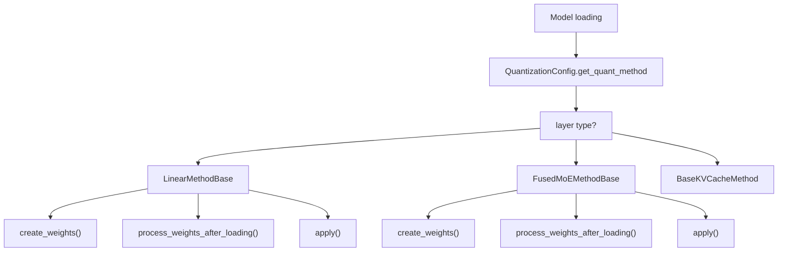
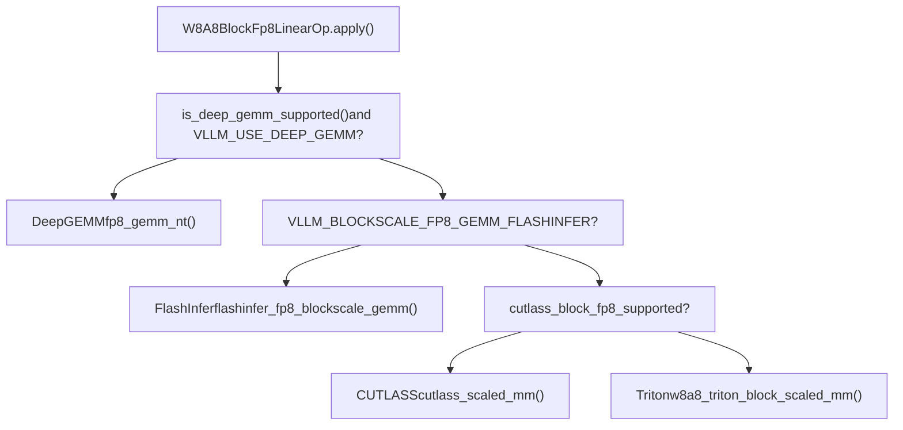
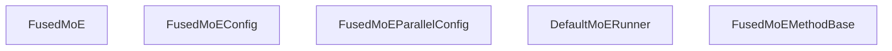
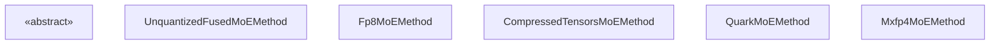

# Quantization and MoE Optimizations

Relevant source files

-   [vllm/envs.py](https://github.com/vllm-project/vllm/blob/7cc302dd/vllm/envs.py)
-   [vllm/model\_executor/layers/fused\_moe/batched\_deep\_gemm\_moe.py](https://github.com/vllm-project/vllm/blob/7cc302dd/vllm/model_executor/layers/fused_moe/batched_deep_gemm_moe.py)
-   [vllm/model\_executor/layers/fused\_moe/config.py](https://github.com/vllm-project/vllm/blob/7cc302dd/vllm/model_executor/layers/fused_moe/config.py)
-   [vllm/model\_executor/layers/fused\_moe/cutlass\_moe.py](https://github.com/vllm-project/vllm/blob/7cc302dd/vllm/model_executor/layers/fused_moe/cutlass_moe.py)
-   [vllm/model\_executor/layers/fused\_moe/deep\_gemm\_moe.py](https://github.com/vllm-project/vllm/blob/7cc302dd/vllm/model_executor/layers/fused_moe/deep_gemm_moe.py)
-   [vllm/model\_executor/layers/fused\_moe/fused\_batched\_moe.py](https://github.com/vllm-project/vllm/blob/7cc302dd/vllm/model_executor/layers/fused_moe/fused_batched_moe.py)
-   [vllm/model\_executor/layers/fused\_moe/fused\_moe.py](https://github.com/vllm-project/vllm/blob/7cc302dd/vllm/model_executor/layers/fused_moe/fused_moe.py)
-   [vllm/model\_executor/layers/fused\_moe/gpt\_oss\_triton\_kernels\_moe.py](https://github.com/vllm-project/vllm/blob/7cc302dd/vllm/model_executor/layers/fused_moe/gpt_oss_triton_kernels_moe.py)
-   [vllm/model\_executor/layers/fused\_moe/layer.py](https://github.com/vllm-project/vllm/blob/7cc302dd/vllm/model_executor/layers/fused_moe/layer.py)
-   [vllm/model\_executor/layers/fused\_moe/modular\_kernel.py](https://github.com/vllm-project/vllm/blob/7cc302dd/vllm/model_executor/layers/fused_moe/modular_kernel.py)
-   [vllm/model\_executor/layers/fused\_moe/rocm\_aiter\_fused\_moe.py](https://github.com/vllm-project/vllm/blob/7cc302dd/vllm/model_executor/layers/fused_moe/rocm_aiter_fused_moe.py)
-   [vllm/model\_executor/layers/fused\_moe/triton\_deep\_gemm\_moe.py](https://github.com/vllm-project/vllm/blob/7cc302dd/vllm/model_executor/layers/fused_moe/triton_deep_gemm_moe.py)
-   [vllm/model\_executor/layers/fused\_moe/utils.py](https://github.com/vllm-project/vllm/blob/7cc302dd/vllm/model_executor/layers/fused_moe/utils.py)
-   [vllm/model\_executor/layers/quantization/awq\_marlin.py](https://github.com/vllm-project/vllm/blob/7cc302dd/vllm/model_executor/layers/quantization/awq_marlin.py)
-   [vllm/model\_executor/layers/quantization/bitsandbytes.py](https://github.com/vllm-project/vllm/blob/7cc302dd/vllm/model_executor/layers/quantization/bitsandbytes.py)
-   [vllm/model\_executor/layers/quantization/compressed\_tensors/compressed\_tensors\_moe.py](https://github.com/vllm-project/vllm/blob/7cc302dd/vllm/model_executor/layers/quantization/compressed_tensors/compressed_tensors_moe.py)
-   [vllm/model\_executor/layers/quantization/experts\_int8.py](https://github.com/vllm-project/vllm/blob/7cc302dd/vllm/model_executor/layers/quantization/experts_int8.py)
-   [vllm/model\_executor/layers/quantization/fp8.py](https://github.com/vllm-project/vllm/blob/7cc302dd/vllm/model_executor/layers/quantization/fp8.py)
-   [vllm/model\_executor/layers/quantization/gguf.py](https://github.com/vllm-project/vllm/blob/7cc302dd/vllm/model_executor/layers/quantization/gguf.py)
-   [vllm/model\_executor/layers/quantization/gptq\_marlin.py](https://github.com/vllm-project/vllm/blob/7cc302dd/vllm/model_executor/layers/quantization/gptq_marlin.py)
-   [vllm/model\_executor/layers/quantization/modelopt.py](https://github.com/vllm-project/vllm/blob/7cc302dd/vllm/model_executor/layers/quantization/modelopt.py)
-   [vllm/model\_executor/layers/quantization/moe\_wna16.py](https://github.com/vllm-project/vllm/blob/7cc302dd/vllm/model_executor/layers/quantization/moe_wna16.py)
-   [vllm/model\_executor/layers/quantization/mxfp4.py](https://github.com/vllm-project/vllm/blob/7cc302dd/vllm/model_executor/layers/quantization/mxfp4.py)
-   [vllm/model\_executor/layers/quantization/quark/quark\_moe.py](https://github.com/vllm-project/vllm/blob/7cc302dd/vllm/model_executor/layers/quantization/quark/quark_moe.py)

This page covers vLLM's quantization infrastructure and Mixture-of-Experts (MoE) kernel system. It explains the quantization method registry, the FP8 linear and MoE pipelines, the modular MoE kernel abstraction, and how backend selection is performed at runtime.

For details on the linear layer and normalization implementations that host quantized weights, see [Linear Layers and Normalization](#7.5). For distributed expert parallelism configuration, see [Parallelism Strategies](/vllm-project/vllm/9.1-parallelism-strategies). For the general attention backend system, see [Attention Backends](/vllm-project/vllm/8-attention-backends).

---

## Quantization System Overview

Every quantization scheme implements the `QuantizationConfig` abstract base class ([vllm/model\_executor/layers/quantization/base\_config.py](https://github.com/vllm-project/vllm/blob/7cc302dd/vllm/model_executor/layers/quantization/base_config.py)) and is registered in a central registry. When a model is loaded, the config's `get_quant_method` is called per layer to return a `QuantizeMethodBase` that knows how to `create_weights`, `process_weights_after_loading`, and `apply` the kernel.

**Quantization method dispatch diagram:**


Sources: [vllm/model\_executor/layers/quantization/fp8.py172-195](https://github.com/vllm-project/vllm/blob/7cc302dd/vllm/model_executor/layers/quantization/fp8.py#L172-L195) [vllm/model\_executor/layers/quantization/modelopt.py183-217](https://github.com/vllm-project/vllm/blob/7cc302dd/vllm/model_executor/layers/quantization/modelopt.py#L183-L217)

---

### Supported Quantization Methods

| Method | Config Class | Key File |
| --- | --- | --- |
| `fp8` | `Fp8Config` | [vllm/model\_executor/layers/quantization/fp8.py96-170](https://github.com/vllm-project/vllm/blob/7cc302dd/vllm/model_executor/layers/quantization/fp8.py#L96-L170) |
| `modelopt` | `ModelOptQuantConfigBase` | [vllm/model\_executor/layers/quantization/modelopt.py133-181](https://github.com/vllm-project/vllm/blob/7cc302dd/vllm/model_executor/layers/quantization/modelopt.py#L133-L181) |
| `compressed_tensors` | `CompressedTensorsConfig` | [vllm/model\_executor/layers/quantization/compressed\_tensors/compressed\_tensors\_moe.py119-154](https://github.com/vllm-project/vllm/blob/7cc302dd/vllm/model_executor/layers/quantization/compressed_tensors/compressed_tensors_moe.py#L119-L154) |
| `gptq_marlin` | `GPTQMarlinConfig` | [vllm/model\_executor/layers/quantization/gptq\_marlin.py](https://github.com/vllm-project/vllm/blob/7cc302dd/vllm/model_executor/layers/quantization/gptq_marlin.py) |
| `awq_marlin` | `AWQMarlinConfig` | [vllm/model\_executor/layers/quantization/awq\_marlin.py](https://github.com/vllm-project/vllm/blob/7cc302dd/vllm/model_executor/layers/quantization/awq_marlin.py) |
| `bitsandbytes` | `BitsAndBytesConfig` | [vllm/model\_executor/layers/quantization/bitsandbytes.py](https://github.com/vllm-project/vllm/blob/7cc302dd/vllm/model_executor/layers/quantization/bitsandbytes.py) |
| `gguf` | `GGUFConfig` | [vllm/model\_executor/layers/quantization/gguf.py](https://github.com/vllm-project/vllm/blob/7cc302dd/vllm/model_executor/layers/quantization/gguf.py) |
| `mxfp4` | `Mxfp4Config` | [vllm/model\_executor/layers/quantization/mxfp4.py39-63](https://github.com/vllm-project/vllm/blob/7cc302dd/vllm/model_executor/layers/quantization/mxfp4.py#L39-L63) |
| `quark` | `QuarkConfig` | [vllm/model\_executor/layers/quantization/quark/quark\_moe.py63-108](https://github.com/vllm-project/vllm/blob/7cc302dd/vllm/model_executor/layers/quantization/quark/quark_moe.py#L63-L108) |

Sources: [vllm/model\_executor/layers/quantization/fp8.py135-148](https://github.com/vllm-project/vllm/blob/7cc302dd/vllm/model_executor/layers/quantization/fp8.py#L135-L148) [vllm/model\_executor/layers/quantization/modelopt.py107-120](https://github.com/vllm-project/vllm/blob/7cc302dd/vllm/model_executor/layers/quantization/modelopt.py#L107-L120) [vllm/model\_executor/layers/quantization/mxfp4.py49-63](https://github.com/vllm-project/vllm/blob/7cc302dd/vllm/model_executor/layers/quantization/mxfp4.py#L49-L63)

---

## FP8 Quantization

### Fp8Config

`Fp8Config` ([vllm/model\_executor/layers/quantization/fp8.py96-170](https://github.com/vllm-project/vllm/blob/7cc302dd/vllm/model_executor/layers/quantization/fp8.py#L96-L170)) controls:

-   `activation_scheme`: `"static"` or `"dynamic"` — whether activation scales are pre-computed or computed per-token at runtime.
-   `is_checkpoint_fp8_serialized`: `True` if weights are stored as FP8 in the checkpoint.
-   `weight_block_size`: enables block-wise quantization (e.g. `[128, 128]`). Requires `is_checkpoint_fp8_serialized=True` and `activation_scheme="dynamic"`.
-   `ignored_layers`: list of layer name prefixes to skip.

### Linear Method Classes

| Class | Use case |
| --- | --- |
| `Fp8LinearMethod` | Loads FP8-serialized checkpoint with static weight scale |
| `Fp8OnlineLinearMethod` | Loads BF16/FP16 checkpoint, quantizes weights during loading |

For models without FP8 hardware support (compute capability < 89) or when `VLLM_TEST_FORCE_FP8_MARLIN=1`, both methods fall back to the Marlin FP8 kernel (`MarlinFP8ScaledMMLinearKernel`). ROCm platforms skip Marlin and use `rocm_aiter_ops`.

Sources: [vllm/model\_executor/layers/quantization/fp8.py182-189](https://github.com/vllm-project/vllm/blob/7cc302dd/vllm/model_executor/layers/quantization/fp8.py#L182-L189) [vllm/model\_executor/layers/quantization/fp8.py47-81](https://github.com/vllm-project/vllm/blob/7cc302dd/vllm/model_executor/layers/quantization/fp8.py#L47-L81)

### W8A8BlockFp8LinearOp — Block FP8 GEMM Dispatch

For block-wise FP8 (e.g. DeepSeek-V3), `W8A8BlockFp8LinearOp` ([vllm/model\_executor/layers/quantization/utils/fp8\_utils.py48](https://github.com/vllm-project/vllm/blob/7cc302dd/vllm/model_executor/layers/quantization/utils/fp8_utils.py#L48-L48)) dispatches to the appropriate backend:

**Block FP8 GEMM backend selection diagram:**


Sources: [vllm/model\_executor/layers/quantization/utils/fp8\_utils.py48](https://github.com/vllm-project/vllm/blob/7cc302dd/vllm/model_executor/layers/quantization/utils/fp8_utils.py#L48-L48) [vllm/utils/deep\_gemm.py84-86](https://github.com/vllm-project/vllm/blob/7cc302dd/vllm/utils/deep_gemm.py#L84-L86)

### DeepGEMM Scale Formats

DeepGEMM supports three scale formats controlled by `VLLM_USE_DEEP_GEMM_E8M0` and `VLLM_USE_DEEP_GEMM_TMA_ALIGNED_SCALES` env vars.

Sources: [vllm/envs.py154-157](https://github.com/vllm-project/vllm/blob/7cc302dd/vllm/envs.py#L154-L157) [vllm/utils/deep\_gemm.py84-86](https://github.com/vllm-project/vllm/blob/7cc302dd/vllm/utils/deep_gemm.py#L84-L86)

---

## FusedMoE Layer Architecture

### FusedMoE Class

`FusedMoE` ([vllm/model\_executor/layers/fused\_moe/layer.py274](https://github.com/vllm-project/vllm/blob/7cc302dd/vllm/model_executor/layers/fused_moe/layer.py#L274-LNaN)) is the top-level `CustomOp` representing a full MoE layer. It owns:

-   Weight tensors `w13` (gate+up) and `w2` (down).
-   `FusedMoEConfig` — static layer config.
-   `FusedMoEParallelConfig` — parallelism config (TP, EP, DP).
-   `quant_method: FusedMoEMethodBase` — the active quantization strategy.
-   `router` — top-K router ([vllm/model\_executor/layers/fused\_moe/router/router\_factory.py](https://github.com/vllm-project/vllm/blob/7cc302dd/vllm/model_executor/layers/fused_moe/router/router_factory.py)).
-   `runner: DefaultMoERunner` — orchestrates execution.

**FusedMoE internal structure:**


Sources: [vllm/model\_executor/layers/fused\_moe/layer.py274-320](https://github.com/vllm-project/vllm/blob/7cc302dd/vllm/model_executor/layers/fused_moe/layer.py#L274-L320) [vllm/model\_executor/layers/fused\_moe/config.py192-210](https://github.com/vllm-project/vllm/blob/7cc302dd/vllm/model_executor/layers/fused_moe/config.py#L192-L210)

### Modular Kernel Architecture

The MoE execution pipeline is decomposed into independent stages via abstract interfaces in `modular_kernel.py` ([vllm/model\_executor/layers/fused\_moe/modular\_kernel.py](https://github.com/vllm-project/vllm/blob/7cc302dd/vllm/model_executor/layers/fused_moe/modular_kernel.py)):

```
[Router] → [FusedMoEPrepareAndFinalize] → [FusedMoEExpertsModular]
```
| Interface | Role |
| --- | --- |
| `FusedMoEPrepareAndFinalize` | Quantizes inputs, dispatches tokens (e.g. all2all), and gathers results. |
| `FusedMoEExpertsModular` | Runs the actual expert GEMMs (permute → GEMM → unpermute). |
| `FusedMoEModularKernel` | Combines a prepare/finalize and an expert module into one callable. |

Sources: [vllm/model\_executor/layers/fused\_moe/modular\_kernel.py42-76](https://github.com/vllm-project/vllm/blob/7cc302dd/vllm/model_executor/layers/fused_moe/modular_kernel.py#L42-L76)

### FusedMoEExpertsModular Implementations

| Class | Backend | Quantization |
| --- | --- | --- |
| `TritonExperts` | Triton fused kernel | FP8, INT8, W4A16, W8A16, unquantized |
| `CutlassExperts` | CUTLASS grouped GEMM | FP8 |
| `DeepGemmExperts` | DeepGEMM contiguous grouped GEMM | FP8 block |
| `MarlinExperts` | Marlin kernel | INT4/FP4/FP8 |

Sources: [vllm/model\_executor/layers/fused\_moe/cutlass\_moe.py](https://github.com/vllm-project/vllm/blob/7cc302dd/vllm/model_executor/layers/fused_moe/cutlass_moe.py) [vllm/model\_executor/layers/fused\_moe/deep\_gemm\_moe.py](https://github.com/vllm-project/vllm/blob/7cc302dd/vllm/model_executor/layers/fused_moe/deep_gemm_moe.py) [vllm/model\_executor/layers/fused\_moe/fused\_marlin\_moe.py](https://github.com/vllm-project/vllm/blob/7cc302dd/vllm/model_executor/layers/fused_moe/fused_marlin_moe.py)

---

## MoE Quantization Methods

Each quantization config supplies a `FusedMoEMethodBase` subclass for `FusedMoE` layers. For details, see [MoE Quantization and Backend Selection](/vllm-project/vllm/7.4-moe-quantization-and-backend-selection).

**MoE quant method class hierarchy:**


Sources: [vllm/model\_executor/layers/fused\_moe/fused\_moe\_method\_base.py](https://github.com/vllm-project/vllm/blob/7cc302dd/vllm/model_executor/layers/fused_moe/fused_moe_method_base.py) [vllm/model\_executor/layers/quantization/fp8.py650-700](https://github.com/vllm-project/vllm/blob/7cc302dd/vllm/model_executor/layers/quantization/fp8.py#L650-L700) [vllm/model\_executor/layers/quantization/compressed\_tensors/compressed\_tensors\_moe.py119-150](https://github.com/vllm-project/vllm/blob/7cc302dd/vllm/model_executor/layers/quantization/compressed_tensors/compressed_tensors_moe.py#L119-L150) [vllm/model\_executor/layers/quantization/mxfp4.py95-125](https://github.com/vllm-project/vllm/blob/7cc302dd/vllm/model_executor/layers/quantization/mxfp4.py#L95-L125)

### MXFP4 MoE

`Mxfp4MoEMethod` ([vllm/model\_executor/layers/quantization/mxfp4.py95](https://github.com/vllm-project/vllm/blob/7cc302dd/vllm/model_executor/layers/quantization/mxfp4.py#L95-LNaN)) selects a backend via `select_mxfp4_moe_backend`. It mutates the shared `FusedMoEConfig` in-place to handle dimension alignment required by specific backends like CK (gfx950) or FlashInfer.

Sources: [vllm/model\_executor/layers/quantization/mxfp4.py110-120](https://github.com/vllm-project/vllm/blob/7cc302dd/vllm/model_executor/layers/quantization/mxfp4.py#L110-L120)

---

## Expert Parallelism and Expert Maps

When expert parallelism (EP) is enabled, `determine_expert_map` ([vllm/model\_executor/layers/fused\_moe/layer.py66-152](https://github.com/vllm-project/vllm/blob/7cc302dd/vllm/model_executor/layers/fused_moe/layer.py#L66-L152)) calculates how many experts should be assigned to each rank.

-   `local_num_experts`: experts on this rank.
-   `expert_map`: tensor mapping global → local index; `-1` for experts not on this rank.
-   `expert_mask`: binary mask used primarily for AITER MOE.

Sources: [vllm/model\_executor/layers/fused\_moe/layer.py66-152](https://github.com/vllm-project/vllm/blob/7cc302dd/vllm/model_executor/layers/fused_moe/layer.py#L66-L152)

---

## Triton Fused MoE Kernel

`fused_moe_kernel_gptq_awq` ([vllm/model\_executor/layers/fused\_moe/fused\_moe.py78-311](https://github.com/vllm-project/vllm/blob/7cc302dd/vllm/model_executor/layers/fused_moe/fused_moe.py#L78-L311)) is a core Triton kernel implementation. It implements the "sorted token" MoE pattern:

1.  Map program IDs to the block of output it should compute.
2.  Load expert IDs for the current block. If `-1`, call `write_zeros_to_output`.
3.  Advance pointers in the K direction and accumulate results.
4.  Apply routing weights and activation.

Sources: [vllm/model\_executor/layers/fused\_moe/fused\_moe.py155-200](https://github.com/vllm-project/vllm/blob/7cc302dd/vllm/model_executor/layers/fused_moe/fused_moe.py#L155-L200) [vllm/model\_executor/layers/fused\_moe/fused\_moe.py61-75](https://github.com/vllm-project/vllm/blob/7cc302dd/vllm/model_executor/layers/fused_moe/fused_moe.py#L61-L75)

---

## Key Environment Variables

| Variable | Default | Effect |
| --- | --- | --- |
| `VLLM_USE_DEEP_GEMM` | `True` | Enable DeepGEMM library for FP8 GEMMs ([vllm/envs.py154](https://github.com/vllm-project/vllm/blob/7cc302dd/vllm/envs.py#L154-L154)). |
| `VLLM_MOE_USE_DEEP_GEMM` | `True` | Enable DeepGEMM for MoE GEMMs ([vllm/envs.py155](https://github.com/vllm-project/vllm/blob/7cc302dd/vllm/envs.py#L155-L155)). |
| `VLLM_USE_FLASHINFER_MOE_FP8` | `False` | Use FlashInfer for FP8 MoE ([vllm/envs.py166](https://github.com/vllm-project/vllm/blob/7cc302dd/vllm/envs.py#L166-L166)). |
| `VLLM_ROCM_USE_AITER_MOE` | `True` | Use AITER fused MoE on ROCm ([vllm/envs.py106](https://github.com/vllm-project/vllm/blob/7cc302dd/vllm/envs.py#L106-L106)). |
| `VLLM_USE_FUSED_MOE_GROUPED_TOPK` | `True` | Use fused grouped top-K routing ([vllm/envs.py163](https://github.com/vllm-project/vllm/blob/7cc302dd/vllm/envs.py#L163-L163)). |

---

## Weight Scale Granularities

The `FusedMoeWeightScaleSupported` enum ([vllm/model\_executor/layers/fused\_moe/layer.py59-63](https://github.com/vllm-project/vllm/blob/7cc302dd/vllm/model_executor/layers/fused_moe/layer.py#L59-L63)) captures the scale granularities supported by MoE kernels: `TENSOR`, `CHANNEL`, `GROUP`, and `BLOCK`. These granularities determine how scales are stored and applied during the fused expert computation.

Sources: [vllm/model\_executor/layers/fused\_moe/layer.py59-63](https://github.com/vllm-project/vllm/blob/7cc302dd/vllm/model_executor/layers/fused_moe/layer.py#L59-L63)
