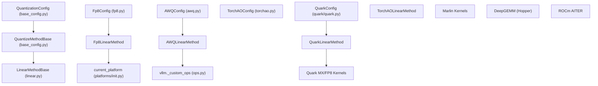

# Quantization Methods Overview

Relevant source files

-   [.buildkite/lm-eval-harness/run-lm-eval-chartqa-vllm-vlm-baseline.sh](https://github.com/vllm-project/vllm/blob/7cc302dd/.buildkite/lm-eval-harness/run-lm-eval-chartqa-vllm-vlm-baseline.sh)
-   [.buildkite/lm-eval-harness/run-lm-eval-gsm-hf-baseline.sh](https://github.com/vllm-project/vllm/blob/7cc302dd/.buildkite/lm-eval-harness/run-lm-eval-gsm-hf-baseline.sh)
-   [.buildkite/lm-eval-harness/run-lm-eval-gsm-vllm-baseline.sh](https://github.com/vllm-project/vllm/blob/7cc302dd/.buildkite/lm-eval-harness/run-lm-eval-gsm-vllm-baseline.sh)
-   [.buildkite/lm-eval-harness/run-lm-eval-mmlupro-vllm-baseline.sh](https://github.com/vllm-project/vllm/blob/7cc302dd/.buildkite/lm-eval-harness/run-lm-eval-mmlupro-vllm-baseline.sh)
-   [docs/features/quantization/README.md](https://github.com/vllm-project/vllm/blob/7cc302dd/docs/features/quantization/README.md?plain=1)
-   [docs/features/quantization/auto\_awq.md](https://github.com/vllm-project/vllm/blob/7cc302dd/docs/features/quantization/auto_awq.md?plain=1)
-   [docs/features/quantization/fp8.md](https://github.com/vllm-project/vllm/blob/7cc302dd/docs/features/quantization/fp8.md?plain=1)
-   [docs/features/quantization/gguf.md](https://github.com/vllm-project/vllm/blob/7cc302dd/docs/features/quantization/gguf.md?plain=1)
-   [docs/features/quantization/gptqmodel.md](https://github.com/vllm-project/vllm/blob/7cc302dd/docs/features/quantization/gptqmodel.md?plain=1)
-   [docs/features/quantization/inc.md](https://github.com/vllm-project/vllm/blob/7cc302dd/docs/features/quantization/inc.md?plain=1)
-   [docs/features/quantization/int4.md](https://github.com/vllm-project/vllm/blob/7cc302dd/docs/features/quantization/int4.md?plain=1)
-   [docs/features/quantization/int8.md](https://github.com/vllm-project/vllm/blob/7cc302dd/docs/features/quantization/int8.md?plain=1)
-   [docs/features/quantization/modelopt.md](https://github.com/vllm-project/vllm/blob/7cc302dd/docs/features/quantization/modelopt.md?plain=1)
-   [docs/features/quantization/quantized\_kvcache.md](https://github.com/vllm-project/vllm/blob/7cc302dd/docs/features/quantization/quantized_kvcache.md?plain=1)
-   [docs/features/quantization/quark.md](https://github.com/vllm-project/vllm/blob/7cc302dd/docs/features/quantization/quark.md?plain=1)
-   [tests/models/language/generation/test\_gemma.py](https://github.com/vllm-project/vllm/blob/7cc302dd/tests/models/language/generation/test_gemma.py)
-   [tests/models/test\_gguf\_download.py](https://github.com/vllm-project/vllm/blob/7cc302dd/tests/models/test_gguf_download.py)
-   [tests/quantization/test\_auto\_round.py](https://github.com/vllm-project/vllm/blob/7cc302dd/tests/quantization/test_auto_round.py)
-   [tests/quantization/test\_configs.py](https://github.com/vllm-project/vllm/blob/7cc302dd/tests/quantization/test_configs.py)
-   [tests/quantization/test\_cpu\_offload.py](https://github.com/vllm-project/vllm/blob/7cc302dd/tests/quantization/test_cpu_offload.py)
-   [tests/quantization/test\_experts\_int8.py](https://github.com/vllm-project/vllm/blob/7cc302dd/tests/quantization/test_experts_int8.py)
-   [tests/quantization/test\_fp8.py](https://github.com/vllm-project/vllm/blob/7cc302dd/tests/quantization/test_fp8.py)
-   [tests/quantization/test\_gptq\_dynamic.py](https://github.com/vllm-project/vllm/blob/7cc302dd/tests/quantization/test_gptq_dynamic.py)
-   [tests/quantization/test\_lm\_head.py](https://github.com/vllm-project/vllm/blob/7cc302dd/tests/quantization/test_lm_head.py)
-   [tests/quantization/test\_modelopt.py](https://github.com/vllm-project/vllm/blob/7cc302dd/tests/quantization/test_modelopt.py)
-   [tests/quantization/test\_quark.py](https://github.com/vllm-project/vllm/blob/7cc302dd/tests/quantization/test_quark.py)
-   [tests/quantization/test\_register\_quantization\_config.py](https://github.com/vllm-project/vllm/blob/7cc302dd/tests/quantization/test_register_quantization_config.py)
-   [tests/quantization/test\_torchao.py](https://github.com/vllm-project/vllm/blob/7cc302dd/tests/quantization/test_torchao.py)
-   [tests/quantization/utils.py](https://github.com/vllm-project/vllm/blob/7cc302dd/tests/quantization/utils.py)
-   [tests/transformers\_utils/test\_utils.py](https://github.com/vllm-project/vllm/blob/7cc302dd/tests/transformers_utils/test_utils.py)
-   [vllm/model\_executor/layers/quantization/\_\_init\_\_.py](https://github.com/vllm-project/vllm/blob/7cc302dd/vllm/model_executor/layers/quantization/__init__.py)
-   [vllm/model\_executor/layers/quantization/awq.py](https://github.com/vllm-project/vllm/blob/7cc302dd/vllm/model_executor/layers/quantization/awq.py)
-   [vllm/model\_executor/layers/quantization/compressed\_tensors/schemes/compressed\_tensors\_w8a8\_int8.py](https://github.com/vllm-project/vllm/blob/7cc302dd/vllm/model_executor/layers/quantization/compressed_tensors/schemes/compressed_tensors_w8a8_int8.py)
-   [vllm/model\_executor/layers/quantization/inc.py](https://github.com/vllm-project/vllm/blob/7cc302dd/vllm/model_executor/layers/quantization/inc.py)
-   [vllm/model\_executor/layers/quantization/quark/quark.py](https://github.com/vllm-project/vllm/blob/7cc302dd/vllm/model_executor/layers/quantization/quark/quark.py)
-   [vllm/model\_executor/layers/quantization/quark/schemes/\_\_init\_\_.py](https://github.com/vllm-project/vllm/blob/7cc302dd/vllm/model_executor/layers/quantization/quark/schemes/__init__.py)
-   [vllm/model\_executor/layers/quantization/quark/schemes/quark\_w4a8\_mxfp4\_fp8.py](https://github.com/vllm-project/vllm/blob/7cc302dd/vllm/model_executor/layers/quantization/quark/schemes/quark_w4a8_mxfp4_fp8.py)
-   [vllm/model\_executor/layers/quantization/quark/schemes/quark\_w8a8\_fp8.py](https://github.com/vllm-project/vllm/blob/7cc302dd/vllm/model_executor/layers/quantization/quark/schemes/quark_w8a8_fp8.py)
-   [vllm/model\_executor/layers/quantization/quark/schemes/quark\_w8a8\_int8.py](https://github.com/vllm-project/vllm/blob/7cc302dd/vllm/model_executor/layers/quantization/quark/schemes/quark_w8a8_int8.py)
-   [vllm/model\_executor/layers/quantization/torchao.py](https://github.com/vllm-project/vllm/blob/7cc302dd/vllm/model_executor/layers/quantization/torchao.py)
-   [vllm/model\_executor/layers/quantization/utils/mxfp8\_utils.py](https://github.com/vllm-project/vllm/blob/7cc302dd/vllm/model_executor/layers/quantization/utils/mxfp8_utils.py)
-   [vllm/transformers\_utils/gguf\_utils.py](https://github.com/vllm-project/vllm/blob/7cc302dd/vllm/transformers_utils/gguf_utils.py)
-   [vllm/transformers\_utils/utils.py](https://github.com/vllm-project/vllm/blob/7cc302dd/vllm/transformers_utils/utils.py)

vLLM supports multiple quantization methods to reduce model memory footprint and accelerate inference through low-precision arithmetic. This page surveys the available quantization schemes (FP8, GPTQ, AWQ, GGUF, MXFP4, NVFP4, BitsAndBytes, TorchAO, Quark) and provides guidance on selecting the appropriate method for different hardware and use cases.

Quantization is applied to linear layers and MoE experts, with automatic backend selection based on hardware capabilities. The system uses a three-layer architecture: configuration classes (`QuantizationConfig`), method classes (`LinearMethodBase`, `QuantizeMethodBase`), and backend dispatch logic.

---

## Overview of Supported Methods

The following table summarizes vLLM's quantization methods, their characteristics, and typical use cases:

| Method | Bits | Type | Hardware | Use Case |
| --- | --- | --- | --- | --- |
| **FP8** | 8 | Float | SM89+, MI300+ | Best accuracy/performance on Hopper/Blackwell/CDNA3 |
| **NVFP4** | 4 | Float | SM100 | 4-bit float with high accuracy on latest Blackwell GPUs |
| **MXFP4** | 4 | Float (MX) | SM80+ | 4-bit microscaling (OCP MX), good accuracy |
| **GPTQ** | 4, 8 | Integer | SM75+ | Popular 4-bit weight-only quantization method |
| **AWQ** | 4 | Integer | SM75+ | Activation-aware weight quantization |
| **GGUF** | 2-8 | Mixed | SM60+ | Multi-format support (K-quants, I-matrix) |
| **BitsAndBytes** | 4, 8 | Integer | SM70+ | Easy-to-use, NF4/FP4 options |
| **Compressed Tensors** | Various | Mixed | Various | Unified format for multiple schemes (Neural Magic) |
| **Quark** | 4, 8 | Float/Int | SM80+, ROCm | AMD Quark framework quantization |
| **TorchAO** | Various | Mixed | SM75+ | PyTorch Architecture Optimization integration |

**Sources:** [vllm/model\_executor/layers/quantization/\_\_init\_\_.py12-37](https://github.com/vllm-project/vllm/blob/7cc302dd/vllm/model_executor/layers/quantization/__init__.py#L12-L37) [docs/features/quantization/README.md47-57](https://github.com/vllm-project/vllm/blob/7cc302dd/docs/features/quantization/README.md?plain=1#L47-L57)

---

## Architecture Overview

vLLM's quantization system consists of three main components: configuration classes that define parameters, method classes that implement weight creation and forward passes, and backend selectors that choose optimal kernels.

### Quantization System Layers

**Sources:** [vllm/model\_executor/layers/quantization/base\_config.py18-21](https://github.com/vllm-project/vllm/blob/7cc302dd/vllm/model_executor/layers/quantization/base_config.py#L18-L21) [vllm/model\_executor/layers/quantization/quark/quark.py49-82](https://github.com/vllm-project/vllm/blob/7cc302dd/vllm/model_executor/layers/quantization/quark/quark.py#L49-L82) [vllm/model\_executor/layers/quantization/torchao.py102-123](https://github.com/vllm-project/vllm/blob/7cc302dd/vllm/model_executor/layers/quantization/torchao.py#L102-L123)

---

## Quantization Configuration System

Each quantization method is defined by a `QuantizationConfig` subclass. These classes are registered in the global registry using the `@register_quantization_config` decorator.

### Configuration Registry

The `get_quantization_config` function serves as the central factory for quantization configurations.

| Method Name | Config Class | Implementation File |
| --- | --- | --- |
| `fp8` | `Fp8Config` | `vllm/model_executor/layers/quantization/fp8.py` |
| `awq` | `AWQConfig` | `vllm/model_executor/layers/quantization/awq.py` |
| `gptq` | `GPTQConfig` | `vllm/model_executor/layers/quantization/gptq.py` |
| `torchao` | `TorchAOConfig` | `vllm/model_executor/layers/quantization/torchao.py` |
| `quark` | `QuarkConfig` | `vllm/model_executor/layers/quantization/quark/quark.py` |
| `bitsandbytes` | `BitsAndBytesConfig` | `vllm/model_executor/layers/quantization/bitsandbytes.py` |

**Sources:** [vllm/model\_executor/layers/quantization/\_\_init\_\_.py51-98](https://github.com/vllm-project/vllm/blob/7cc302dd/vllm/model_executor/layers/quantization/__init__.py#L51-L98) [vllm/model\_executor/layers/quantization/\_\_init\_\_.py101-164](https://github.com/vllm-project/vllm/blob/7cc302dd/vllm/model_executor/layers/quantization/__init__.py#L101-L164)

---

## Quantization Method Details

### FP8 Quantization

FP8 uses `torch.float8_e4m3fn` (or `fnuz` on some ROCm hardware). It supports both static and dynamic activation scaling. vLLM can perform online dynamic quantization of FP16/BF16 models to FP8.

-   **Linear Method:** `Fp8LinearMethod` handles standard linear layers.
-   **KV Cache:** `Fp8KVCacheMethod` allows storing KV cache in 8-bit float.
-   **Hardware Support:** Supported on NVIDIA GPUs with compute capability >= 8.9 (Ada, Hopper) and AMD MI300+.

**Sources:** [docs/features/quantization/fp8.md1-18](https://github.com/vllm-project/vllm/blob/7cc302dd/docs/features/quantization/fp8.md?plain=1#L1-L18) [tests/quantization/test\_fp8.py139-160](https://github.com/vllm-project/vllm/blob/7cc302dd/tests/quantization/test_fp8.py#L139-L160)

### AMD Quark Integration

vLLM leverages the Quark toolkit for high-performance quantization on AMD GPUs, supporting FP8, INT8, and MXFP4.

-   **Schemes:** Supports `QuarkW8A8Fp8`, `QuarkW8A8Int8`, and `QuarkW4A8_MXFP4_FP8`. [vllm/model\_executor/layers/quantization/quark/quark.py26-32](https://github.com/vllm-project/vllm/blob/7cc302dd/vllm/model_executor/layers/quantization/quark/quark.py#L26-L32)
-   **MoE Support:** `QuarkMoEMethod` provides specialized handling for Mixture-of-Experts. [vllm/model\_executor/layers/quantization/quark/quark.py150-152](https://github.com/vllm-project/vllm/blob/7cc302dd/vllm/model_executor/layers/quantization/quark/quark.py#L150-L152)
-   **Config Mapping:** Includes an `apply_vllm_mapper` to translate HF model structures to vLLM structures. [vllm/model\_executor/layers/quantization/quark/quark.py94-119](https://github.com/vllm-project/vllm/blob/7cc302dd/vllm/model_executor/layers/quantization/quark/quark.py#L94-L119)

**Sources:** [docs/features/quantization/quark.md1-15](https://github.com/vllm-project/vllm/blob/7cc302dd/docs/features/quantization/quark.md?plain=1#L1-L15) [vllm/model\_executor/layers/quantization/quark/quark.py49-153](https://github.com/vllm-project/vllm/blob/7cc302dd/vllm/model_executor/layers/quantization/quark/quark.py#L49-L153)

### TorchAO Integration

vLLM integrates with PyTorch Architecture Optimization (`torchao`) to support emerging formats like `int8wo`, `int4wo`, and `float8` weight-only.

-   **Online Quantization:** vLLM can quantize a standard FP16 model during loading if `quantization="torchao"` is specified with a config dict or file. [tests/quantization/test\_torchao.py92-119](https://github.com/vllm-project/vllm/blob/7cc302dd/tests/quantization/test_torchao.py#L92-L119)
-   **Serialized Checkpoints:** Supports loading models already quantized and saved via `torchao`. [vllm/model\_executor/layers/quantization/torchao.py109-114](https://github.com/vllm-project/vllm/blob/7cc302dd/vllm/model_executor/layers/quantization/torchao.py#L109-L114)
-   **Skipping Modules:** Supports robust skipping logic via `modules_to_not_convert`. [vllm/model\_executor/layers/quantization/torchao.py76-91](https://github.com/vllm-project/vllm/blob/7cc302dd/vllm/model_executor/layers/quantization/torchao.py#L76-L91)

**Sources:** [vllm/model\_executor/layers/quantization/torchao.py102-180](https://github.com/vllm-project/vllm/blob/7cc302dd/vllm/model_executor/layers/quantization/torchao.py#L102-L180) [tests/quantization/test\_torchao.py21-29](https://github.com/vllm-project/vllm/blob/7cc302dd/tests/quantization/test_torchao.py#L21-L29)

### AWQ (Activation-aware Weight Quantization)

AWQ is a popular 4-bit integer quantization method that preserves accuracy by scaling weights based on activation magnitude.

-   **Linear Method:** `AWQLinearMethod` implements the weight creation and application logic. [vllm/model\_executor/layers/quantization/awq.py165-184](https://github.com/vllm-project/vllm/blob/7cc302dd/vllm/model_executor/layers/quantization/awq.py#L165-L184)
-   **Marlin Fallback:** Automatically falls back to `MoeWNA16` kernels if Marlin doesn't support a specific MoE layer. [vllm/model\_executor/layers/quantization/awq.py113-128](https://github.com/vllm-project/vllm/blob/7cc302dd/vllm/model_executor/layers/quantization/awq.py#L113-L128)

**Sources:** [vllm/model\_executor/layers/quantization/awq.py32-75](https://github.com/vllm-project/vllm/blob/7cc302dd/vllm/model_executor/layers/quantization/awq.py#L32-L75) [vllm/model\_executor/layers/quantization/awq.py95-141](https://github.com/vllm-project/vllm/blob/7cc302dd/vllm/model_executor/layers/quantization/awq.py#L95-L141)

---

## Weight Loading and Custom Registration

The system allows for out-of-tree quantization plugins using the registration mechanism.

### Custom Quantization Registration

> **[Mermaid sequence]**
> *(图表结构无法解析)*

**Key Registration Functions:**

-   `register_quantization_config(quantization)`: Decorator to add new methods to `QUANTIZATION_METHODS`. [vllm/model\_executor/layers/quantization/\_\_init\_\_.py51-98](https://github.com/vllm-project/vllm/blob/7cc302dd/vllm/model_executor/layers/quantization/__init__.py#L51-L98)
-   `get_quantization_config(quantization)`: Returns the config class associated with a string identifier. [vllm/model\_executor/layers/quantization/\_\_init\_\_.py101-164](https://github.com/vllm-project/vllm/blob/7cc302dd/vllm/model_executor/layers/quantization/__init__.py#L101-L164)

**Sources:** [vllm/model\_executor/layers/quantization/\_\_init\_\_.py51-164](https://github.com/vllm-project/vllm/blob/7cc302dd/vllm/model_executor/layers/quantization/__init__.py#L51-L164) [docs/features/quantization/README.md72-127](https://github.com/vllm-project/vllm/blob/7cc302dd/docs/features/quantization/README.md?plain=1#L72-L127)

---

## Summary Table: Hardware Compatibility

| Implementation | Volta | Turing | Ampere | Ada | Hopper | AMD GPU | Intel GPU |
| --- | --- | --- | --- | --- | --- | --- | --- |
| **AWQ** | ❌ | ✅ | ✅ | ✅ | ✅ | ❌ | ✅ |
| **GPTQ** | ✅ | ✅ | ✅ | ✅ | ✅ | ❌ | ✅ |
| **Marlin** | ❌ | ✅ | ✅ | ✅ | ✅ | ❌ | ❌ |
| **INT8 (W8A8)** | ❌ | ✅ | ✅ | ✅ | ✅ | ❌ | ❌ |
| **FP8 (W8A8)** | ❌ | ❌ | ❌ | ✅ | ✅ | ✅ | ❌ |
| **GGUF** | ✅ | ✅ | ✅ | ✅ | ✅ | ✅ | ❌ |

**Sources:** [docs/features/quantization/README.md47-57](https://github.com/vllm-project/vllm/blob/7cc302dd/docs/features/quantization/README.md?plain=1#L47-L57) [vllm/model\_executor/layers/quantization/awq.py72-75](https://github.com/vllm-project/vllm/blob/7cc302dd/vllm/model_executor/layers/quantization/awq.py#L72-L75)
