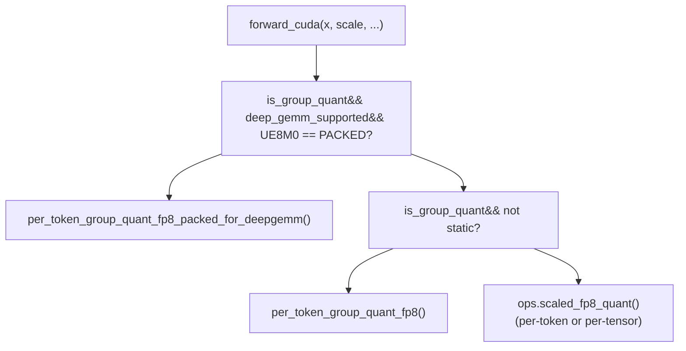
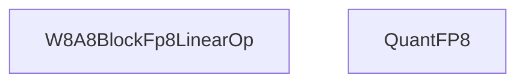
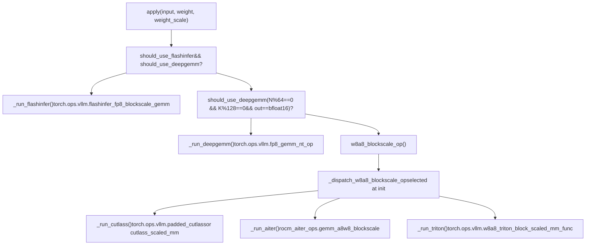

# FP8 and Low-Precision Quantization

Relevant source files

-   [benchmarks/cutlass\_benchmarks/w8a8\_benchmarks.py](https://github.com/vllm-project/vllm/blob/7cc302dd/benchmarks/cutlass_benchmarks/w8a8_benchmarks.py)
-   [benchmarks/kernels/deepgemm/benchmark\_fp8\_block\_dense\_gemm.py](https://github.com/vllm-project/vllm/blob/7cc302dd/benchmarks/kernels/deepgemm/benchmark_fp8_block_dense_gemm.py)
-   [csrc/moe/marlin\_moe\_wna16/generate\_kernels.py](https://github.com/vllm-project/vllm/blob/7cc302dd/csrc/moe/marlin_moe_wna16/generate_kernels.py)
-   [csrc/moe/marlin\_moe\_wna16/kernel.h](https://github.com/vllm-project/vllm/blob/7cc302dd/csrc/moe/marlin_moe_wna16/kernel.h)
-   [csrc/moe/marlin\_moe\_wna16/marlin\_template.h](https://github.com/vllm-project/vllm/blob/7cc302dd/csrc/moe/marlin_moe_wna16/marlin_template.h)
-   [csrc/moe/marlin\_moe\_wna16/ops.cu](https://github.com/vllm-project/vllm/blob/7cc302dd/csrc/moe/marlin_moe_wna16/ops.cu)
-   [csrc/moe/moe\_wna16\_utils.h](https://github.com/vllm-project/vllm/blob/7cc302dd/csrc/moe/moe_wna16_utils.h)
-   [tests/kernels/quantization/test\_block\_fp8.py](https://github.com/vllm-project/vllm/blob/7cc302dd/tests/kernels/quantization/test_block_fp8.py)
-   [tests/kernels/quantization/test\_flashinfer\_nvfp4\_scaled\_mm.py](https://github.com/vllm-project/vllm/blob/7cc302dd/tests/kernels/quantization/test_flashinfer_nvfp4_scaled_mm.py)
-   [tests/kernels/quantization/test\_fp8\_quant.py](https://github.com/vllm-project/vllm/blob/7cc302dd/tests/kernels/quantization/test_fp8_quant.py)
-   [tests/kernels/quantization/test\_fp8\_quant\_group.py](https://github.com/vllm-project/vllm/blob/7cc302dd/tests/kernels/quantization/test_fp8_quant_group.py)
-   [tests/kernels/quantization/test\_nvfp4\_scaled\_mm.py](https://github.com/vllm-project/vllm/blob/7cc302dd/tests/kernels/quantization/test_nvfp4_scaled_mm.py)
-   [tests/quantization/test\_compressed\_tensors.py](https://github.com/vllm-project/vllm/blob/7cc302dd/tests/quantization/test_compressed_tensors.py)
-   [tests/v1/engine/conftest.py](https://github.com/vllm-project/vllm/blob/7cc302dd/tests/v1/engine/conftest.py)
-   [vllm/envs.py](https://github.com/vllm-project/vllm/blob/7cc302dd/vllm/envs.py)
-   [vllm/model\_executor/layers/fused\_moe/config.py](https://github.com/vllm-project/vllm/blob/7cc302dd/vllm/model_executor/layers/fused_moe/config.py)
-   [vllm/model\_executor/layers/fused\_moe/gpt\_oss\_triton\_kernels\_moe.py](https://github.com/vllm-project/vllm/blob/7cc302dd/vllm/model_executor/layers/fused_moe/gpt_oss_triton_kernels_moe.py)
-   [vllm/model\_executor/layers/fused\_moe/layer.py](https://github.com/vllm-project/vllm/blob/7cc302dd/vllm/model_executor/layers/fused_moe/layer.py)
-   [vllm/model\_executor/layers/fused\_moe/rocm\_aiter\_fused\_moe.py](https://github.com/vllm-project/vllm/blob/7cc302dd/vllm/model_executor/layers/fused_moe/rocm_aiter_fused_moe.py)
-   [vllm/model\_executor/layers/quantization/awq\_marlin.py](https://github.com/vllm-project/vllm/blob/7cc302dd/vllm/model_executor/layers/quantization/awq_marlin.py)
-   [vllm/model\_executor/layers/quantization/bitsandbytes.py](https://github.com/vllm-project/vllm/blob/7cc302dd/vllm/model_executor/layers/quantization/bitsandbytes.py)
-   [vllm/model\_executor/layers/quantization/compressed\_tensors/compressed\_tensors.py](https://github.com/vllm-project/vllm/blob/7cc302dd/vllm/model_executor/layers/quantization/compressed_tensors/compressed_tensors.py)
-   [vllm/model\_executor/layers/quantization/compressed\_tensors/compressed\_tensors\_moe.py](https://github.com/vllm-project/vllm/blob/7cc302dd/vllm/model_executor/layers/quantization/compressed_tensors/compressed_tensors_moe.py)
-   [vllm/model\_executor/layers/quantization/compressed\_tensors/schemes/\_\_init\_\_.py](https://github.com/vllm-project/vllm/blob/7cc302dd/vllm/model_executor/layers/quantization/compressed_tensors/schemes/__init__.py)
-   [vllm/model\_executor/layers/quantization/compressed\_tensors/schemes/compressed\_tensors\_w4a16\_mxfp4.py](https://github.com/vllm-project/vllm/blob/7cc302dd/vllm/model_executor/layers/quantization/compressed_tensors/schemes/compressed_tensors_w4a16_mxfp4.py)
-   [vllm/model\_executor/layers/quantization/compressed\_tensors/schemes/compressed\_tensors\_w4a16\_nvfp4.py](https://github.com/vllm-project/vllm/blob/7cc302dd/vllm/model_executor/layers/quantization/compressed_tensors/schemes/compressed_tensors_w4a16_nvfp4.py)
-   [vllm/model\_executor/layers/quantization/compressed\_tensors/schemes/compressed\_tensors\_w4a4\_nvfp4.py](https://github.com/vllm-project/vllm/blob/7cc302dd/vllm/model_executor/layers/quantization/compressed_tensors/schemes/compressed_tensors_w4a4_nvfp4.py)
-   [vllm/model\_executor/layers/quantization/compressed\_tensors/schemes/compressed\_tensors\_w8a16\_fp8.py](https://github.com/vllm-project/vllm/blob/7cc302dd/vllm/model_executor/layers/quantization/compressed_tensors/schemes/compressed_tensors_w8a16_fp8.py)
-   [vllm/model\_executor/layers/quantization/compressed\_tensors/schemes/compressed\_tensors\_w8a8\_fp8.py](https://github.com/vllm-project/vllm/blob/7cc302dd/vllm/model_executor/layers/quantization/compressed_tensors/schemes/compressed_tensors_w8a8_fp8.py)
-   [vllm/model\_executor/layers/quantization/experts\_int8.py](https://github.com/vllm-project/vllm/blob/7cc302dd/vllm/model_executor/layers/quantization/experts_int8.py)
-   [vllm/model\_executor/layers/quantization/fp8.py](https://github.com/vllm-project/vllm/blob/7cc302dd/vllm/model_executor/layers/quantization/fp8.py)
-   [vllm/model\_executor/layers/quantization/gguf.py](https://github.com/vllm-project/vllm/blob/7cc302dd/vllm/model_executor/layers/quantization/gguf.py)
-   [vllm/model\_executor/layers/quantization/gptq\_marlin.py](https://github.com/vllm-project/vllm/blob/7cc302dd/vllm/model_executor/layers/quantization/gptq_marlin.py)
-   [vllm/model\_executor/layers/quantization/input\_quant\_fp8.py](https://github.com/vllm-project/vllm/blob/7cc302dd/vllm/model_executor/layers/quantization/input_quant_fp8.py)
-   [vllm/model\_executor/layers/quantization/modelopt.py](https://github.com/vllm-project/vllm/blob/7cc302dd/vllm/model_executor/layers/quantization/modelopt.py)
-   [vllm/model\_executor/layers/quantization/moe\_wna16.py](https://github.com/vllm-project/vllm/blob/7cc302dd/vllm/model_executor/layers/quantization/moe_wna16.py)
-   [vllm/model\_executor/layers/quantization/mxfp4.py](https://github.com/vllm-project/vllm/blob/7cc302dd/vllm/model_executor/layers/quantization/mxfp4.py)
-   [vllm/model\_executor/layers/quantization/quark/quark\_moe.py](https://github.com/vllm-project/vllm/blob/7cc302dd/vllm/model_executor/layers/quantization/quark/quark_moe.py)
-   [vllm/model\_executor/layers/quantization/utils/fp8\_utils.py](https://github.com/vllm-project/vllm/blob/7cc302dd/vllm/model_executor/layers/quantization/utils/fp8_utils.py)
-   [vllm/model\_executor/layers/quantization/utils/marlin\_utils.py](https://github.com/vllm-project/vllm/blob/7cc302dd/vllm/model_executor/layers/quantization/utils/marlin_utils.py)
-   [vllm/model\_executor/layers/quantization/utils/marlin\_utils\_fp4.py](https://github.com/vllm-project/vllm/blob/7cc302dd/vllm/model_executor/layers/quantization/utils/marlin_utils_fp4.py)
-   [vllm/model\_executor/layers/quantization/utils/marlin\_utils\_fp8.py](https://github.com/vllm-project/vllm/blob/7cc302dd/vllm/model_executor/layers/quantization/utils/marlin_utils_fp8.py)
-   [vllm/model\_executor/layers/quantization/utils/nvfp4\_emulation\_utils.py](https://github.com/vllm-project/vllm/blob/7cc302dd/vllm/model_executor/layers/quantization/utils/nvfp4_emulation_utils.py)
-   [vllm/model\_executor/layers/quantization/utils/nvfp4\_utils.py](https://github.com/vllm-project/vllm/blob/7cc302dd/vllm/model_executor/layers/quantization/utils/nvfp4_utils.py)
-   [vllm/model\_executor/layers/quantization/utils/quant\_utils.py](https://github.com/vllm-project/vllm/blob/7cc302dd/vllm/model_executor/layers/quantization/utils/quant_utils.py)
-   [vllm/utils/deep\_gemm.py](https://github.com/vllm-project/vllm/blob/7cc302dd/vllm/utils/deep_gemm.py)

## Purpose and Scope

This page documents low-precision quantization methods in vLLM, focusing on FP8, MXFP4, and NVFP4 quantization schemes. It covers data formats, backend selection strategies, and the dispatch mechanisms for each quantization type. The page explains:

-   **FP8 quantization**: 8-bit floating point with per-token-group activation quantization, per-block weight quantization, scale factor formats (including UE8M0), and multi-backend GEMM dispatch via `W8A8BlockFp8LinearOp`.
-   **MXFP4 quantization**: Microscaling 4-bit format with 8-bit exponent-only scales, backend selection logic, and platform-specific optimizations.
-   **NVFP4 quantization**: NVIDIA 4-bit floating point format with group scales and specialized kernels.

For how these quantization methods are applied to MoE expert layers, see [7.3](https://github.com/vllm-project/vllm/blob/7cc302dd/7.3) and [7.4](https://github.com/vllm-project/vllm/blob/7cc302dd/7.4) For the general quantization method registry and how quantization methods are wired into the model loading pipeline, see [7.1](https://github.com/vllm-project/vllm/blob/7cc302dd/7.1)

---

## FP8 Data Types

vLLM uses platform-appropriate FP8 dtypes:

| Platform | FP8 dtype | Notes |
| --- | --- | --- |
| CUDA | `torch.float8_e4m3fn` | Standard FP8, max value 448.0 |
| ROCm | `torch.float8_e4m3fnuz` | Unsigned-zero variant, max value 224.0 |

The `is_fp8` helper in [vllm/model\_executor/layers/quantization/utils/fp8\_utils.py53-56](https://github.com/vllm-project/vllm/blob/7cc302dd/vllm/model_executor/layers/quantization/utils/fp8_utils.py#L53-L56) checks for either dtype. The platform-correct dtype is retrieved via `current_platform.fp8_dtype()`.

---

## Quantization Granularities

Block-FP8 (W8A8) in vLLM uses two distinct quantization granularities for weights and activations:

| Tensor | Granularity | Typical block shape | Scale tensor shape |
| --- | --- | --- | --- |
| Weights | Per-block (2D tile) | `[128, 128]` (N×K) | `(num_N_tiles, num_K_tiles)` |
| Activations | Per-token-group (1D row group) | `[1, 128]` (one group per row segment) | `(M, K//128)` |

This matches the format required by models such as DeepSeek-V3, which uses 128-element groups in both dimensions [vllm/model\_executor/layers/quantization/utils/quant\_utils.py68-70](https://github.com/vllm-project/vllm/blob/7cc302dd/vllm/model_executor/layers/quantization/utils/quant_utils.py#L68-L70)

---

## Scale Factor Formats

Three scale factor formats are used, selected by `DeepGemmQuantScaleFMT` based on hardware and configuration:

**`DeepGemmQuantScaleFMT` enum** — [vllm/utils/deep\_gemm.py45-54](https://github.com/vllm-project/vllm/blob/7cc302dd/vllm/utils/deep_gemm.py#L45-L54)

| Enum value | Description | Used when |
| --- | --- | --- |
| `FLOAT32` | Float32 scale tensor, standard layout | DeepGEMM disabled, or Triton/CUTLASS backends |
| `FLOAT32_CEIL_UE8M0` | Float32 tensor, values ceiled to powers of 2 | Hopper (SM90), `VLLM_USE_DEEP_GEMM_E8M0=1` |
| `UE8M0` | Int32 tensor, 4 UE8M0 scale values packed per element | Blackwell (SM100+), `VLLM_USE_DEEP_GEMM_E8M0=1` |

The oracle decision is cached at startup via `DeepGemmQuantScaleFMT.init_oracle_cache()` [vllm/utils/deep\_gemm.py57-83](https://github.com/vllm-project/vllm/blob/7cc302dd/vllm/utils/deep_gemm.py#L57-L83) The helper `is_deep_gemm_e8m0_used()` [vllm/utils/deep\_gemm.py96-119](https://github.com/vllm-project/vllm/blob/7cc302dd/vllm/utils/deep_gemm.py#L96-L119) returns `True` when the UE8M0 path is active.

**UE8M0 scale encoding:** Each scale value `s` is stored as `2^ceil(log2(s))` — the next power-of-two ceiling of `s`. This enables efficient hardware-level dequantization on Blackwell [vllm/utils/deep\_gemm.py48-50](https://github.com/vllm-project/vllm/blob/7cc302dd/vllm/utils/deep_gemm.py#L48-L50)

---

## Scale Tensor Memory Layouts

The memory layout of activation scale tensors varies by backend:

**Diagram: Scale tensor layout variants for `(M=4, K=256, group_size=128)` → 2 groups per row**

The layout is controlled by parameters to `per_token_group_quant_fp8`:

-   `column_major_scales=False` → row-major (Triton, default)
-   `column_major_scales=True, tma_aligned_scales=False` → column-major (CUTLASS)
-   `column_major_scales=True, tma_aligned_scales=True` → TMA-aligned (DeepGEMM Hopper)

Sources: [vllm/model\_executor/layers/quantization/utils/fp8\_utils.py206-212](https://github.com/vllm-project/vllm/blob/7cc302dd/vllm/model_executor/layers/quantization/utils/fp8_utils.py#L206-L212)

---

## Input Quantization: `QuantFP8`

`QuantFP8` is a `CustomOp` that quantizes input activations to FP8. It supports per-tensor, per-token, per-channel, and per-group quantization modes.

**Key constructor parameters:** [vllm/model\_executor/layers/quantization/input\_quant\_fp8.py33-72](https://github.com/vllm-project/vllm/blob/7cc302dd/vllm/model_executor/layers/quantization/input_quant_fp8.py#L33-L72)

| Parameter | Type | Effect |
| --- | --- | --- |
| `static` | bool | Static (pre-computed) vs. dynamic (online) scaling |
| `group_shape` | `GroupShape` | `PER_TOKEN`, `PER_TENSOR`, or `(1, group_size)` for block |
| `column_major_scales` | bool | Output scales in column-major layout |
| `tma_aligned_scales` | bool | Apply TMA stride alignment (DeepGEMM Hopper) |
| `use_ue8m0` | bool | Use power-of-2 scale ceiling encoding |

**Diagram: `QuantFP8.forward_cuda` dispatch logic**

Sources: [vllm/model\_executor/layers/quantization/input\_quant\_fp8.py83-131](https://github.com/vllm-project/vllm/blob/7cc302dd/vllm/model_executor/layers/quantization/input_quant_fp8.py#L83-L131)

---

## GEMM Backend Dispatch: `W8A8BlockFp8LinearOp`

`W8A8BlockFp8LinearOp` is the central class for running block-quantized FP8 matrix multiplications in linear layers.

[vllm/model\_executor/layers/quantization/utils/fp8\_utils.py347-585](https://github.com/vllm-project/vllm/blob/7cc302dd/vllm/model_executor/layers/quantization/utils/fp8_utils.py#L347-L585)

**Diagram: `W8A8BlockFp8LinearOp` structure and backend methods**

**Diagram: `apply()` dispatch flowchart**

Sources: [vllm/model\_executor/layers/quantization/utils/fp8\_utils.py388-585](https://github.com/vllm-project/vllm/blob/7cc302dd/vllm/model_executor/layers/quantization/utils/fp8_utils.py#L388-L585)

---

## MXFP4 Quantization

MXFP4 (Microscaling 4-bit) uses a shared 8-bit exponent for a group of 4-bit values. vLLM selects backends for MXFP4 based on hardware capability and the presence of LoRA.

### Backend Selection Logic

The selection is handled by `select_mxfp4_moe_backend` [vllm/model\_executor/layers/quantization/mxfp4.py101](https://github.com/vllm-project/vllm/blob/7cc302dd/vllm/model_executor/layers/quantization/mxfp4.py#L101-L101)

| Platform | Capability | Backend | Condition |
| --- | --- | --- | --- |
| CUDA | SM100 | `FLASHINFER_TRTLLM_MXFP4_MXFP8` | SM100 with FlashInfer TRTLLM [vllm/model\_executor/layers/quantization/mxfp4.py130](https://github.com/vllm-project/vllm/blob/7cc302dd/vllm/model_executor/layers/quantization/mxfp4.py#L130-L130) |
| CUDA | SM90 | `FLASHINFER_TRTLLM_MXFP4_MXFP8` | SM90 with FlashInfer TRTLLM [vllm/model\_executor/layers/quantization/mxfp4.py130](https://github.com/vllm-project/vllm/blob/7cc302dd/vllm/model_executor/layers/quantization/mxfp4.py#L130-L130) |
| CUDA | Any | `MARLIN` | `VLLM_MXFP4_USE_MARLIN=1` [vllm/envs.py148](https://github.com/vllm-project/vllm/blob/7cc302dd/vllm/envs.py#L148-L148) |
| ROCm | GFX950 | `CK` | ROCm AITER enabled [vllm/model\_executor/layers/quantization/mxfp4.py161](https://github.com/vllm-project/vllm/blob/7cc302dd/vllm/model_executor/layers/quantization/mxfp4.py#L161-L161) |

### Implementation Details

The `Mxfp4MoEMethod` class [vllm/model\_executor/layers/quantization/mxfp4.py95-121](https://github.com/vllm-project/vllm/blob/7cc302dd/vllm/model_executor/layers/quantization/mxfp4.py#L95-L121) handles the creation of `w13_weight` and `w2_weight` as `torch.uint8` parameters [vllm/model\_executor/layers/quantization/mxfp4.py168-193](https://github.com/vllm-project/vllm/blob/7cc302dd/vllm/model_executor/layers/quantization/mxfp4.py#L168-L193) It also manages `w13_weight_scale` and `w2_weight_scale` with a block size of 32 [vllm/model\_executor/layers/quantization/mxfp4.py144](https://github.com/vllm-project/vllm/blob/7cc302dd/vllm/model_executor/layers/quantization/mxfp4.py#L144-L144)

---

## NVFP4 Quantization

NVFP4 is the native 4-bit floating point format for NVIDIA Blackwell GPUs. vLLM integrates this via `ModelOpt` or `CompressedTensors` configurations.

### Backend Selection

Backend selection for NVFP4 MoE is performed by `select_nvfp4_moe_backend` [vllm/model\_executor/layers/quantization/modelopt.py42-43](https://github.com/vllm-project/vllm/blob/7cc302dd/vllm/model_executor/layers/quantization/modelopt.py#L42-L43) Backends include:

-   `DEEP_EP`: Low-latency expert parallel backend [vllm/model\_executor/layers/quantization/modelopt.py28](https://github.com/vllm-project/vllm/blob/7cc302dd/vllm/model_executor/layers/quantization/modelopt.py#L28-L28)
-   `FLASHINFER`: High-throughput attention/GEMM backend [vllm/model\_executor/layers/quantization/modelopt.py40](https://github.com/vllm-project/vllm/blob/7cc302dd/vllm/model_executor/layers/quantization/modelopt.py#L40-L40)

### Weight Preparation

For FlashInfer TRTLLM-style NVFP4 kernels, weights must be interleaved and permuted. This is handled by `convert_to_nvfp4_moe_kernel_format` [vllm/model\_executor/layers/quantization/modelopt.py38](https://github.com/vllm-project/vllm/blob/7cc302dd/vllm/model_executor/layers/quantization/modelopt.py#L38-L38)

---

## Environment Variables

| Variable | Default | Effect |
| --- | --- | --- |
| `VLLM_USE_DEEP_GEMM` | `True` | Enable DeepGEMM kernels for FP8 linear and MoE pass [vllm/envs.py154](https://github.com/vllm-project/vllm/blob/7cc302dd/vllm/envs.py#L154-L154) |
| `VLLM_USE_DEEP_GEMM_E8M0` | `True` | Use UE8M0 (power-of-2) scale encoding [vllm/envs.py156](https://github.com/vllm-project/vllm/blob/7cc302dd/vllm/envs.py#L156-L156) |
| `VLLM_MXFP4_USE_MARLIN` | `None` | Force Marlin backend for MXFP4 [vllm/envs.py148](https://github.com/vllm-project/vllm/blob/7cc302dd/vllm/envs.py#L148-L148) |
| `VLLM_BLOCKSCALE_FP8_GEMM_FLASHINFER` | `True` | Use FlashInfer for block-scale FP8 GEMM [vllm/envs.py164](https://github.com/vllm-project/vllm/blob/7cc302dd/vllm/envs.py#L164-L164) |

Sources: [vllm/envs.py145-170](https://github.com/vllm-project/vllm/blob/7cc302dd/vllm/envs.py#L145-L170) [vllm/utils/deep\_gemm.py96-119](https://github.com/vllm-project/vllm/blob/7cc302dd/vllm/utils/deep_gemm.py#L96-L119)

---

## Data Flow Through a Block-FP8 Linear Layer

**Diagram: End-to-end data flow for a block-FP8 forward pass**

> **[Mermaid sequence]**
> *(图表结构无法解析)*

Sources: [vllm/model\_executor/layers/quantization/utils/fp8\_utils.py388-585](https://github.com/vllm-project/vllm/blob/7cc302dd/vllm/model_executor/layers/quantization/utils/fp8_utils.py#L388-L585)
