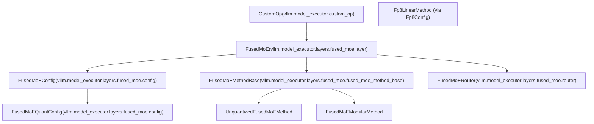
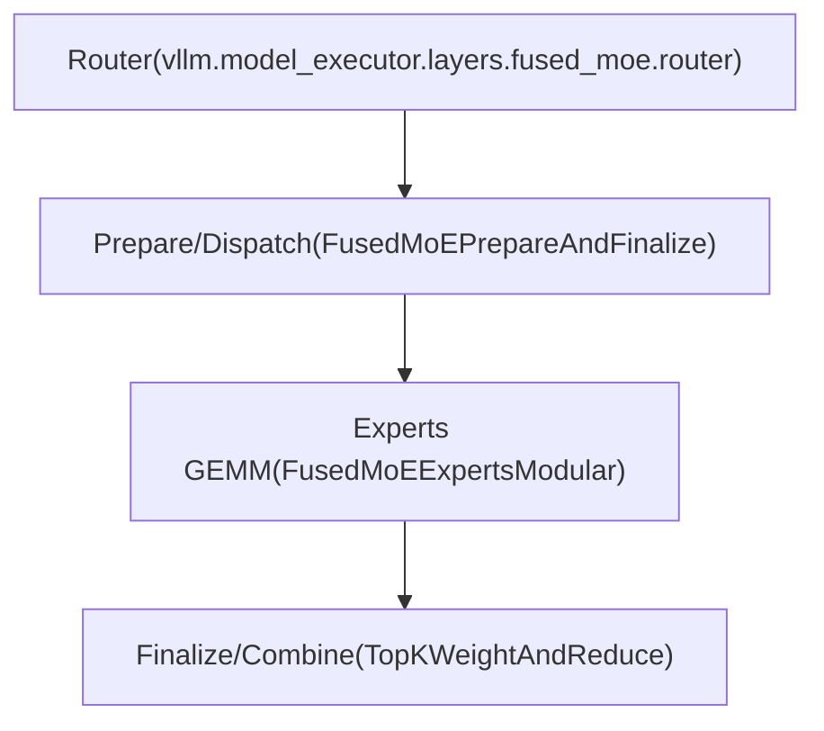
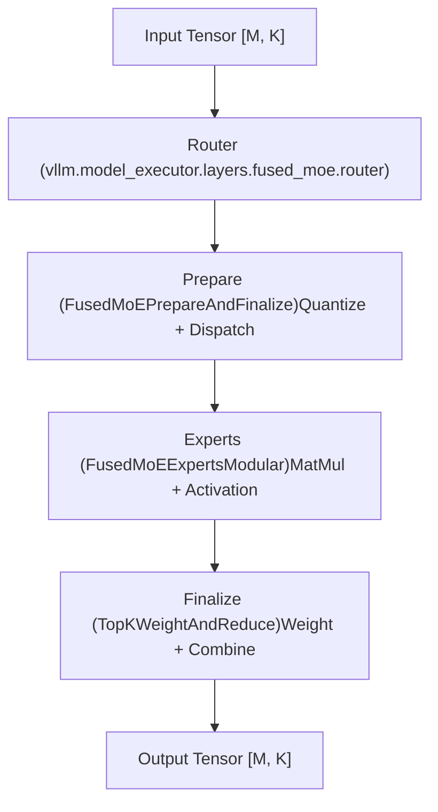

# FusedMoE Layer Architecture

Relevant source files

-   [vllm/envs.py](https://github.com/vllm-project/vllm/blob/7cc302dd/vllm/envs.py)
-   [vllm/model\_executor/layers/fused\_moe/\_\_init\_\_.py](https://github.com/vllm-project/vllm/blob/7cc302dd/vllm/model_executor/layers/fused_moe/__init__.py)
-   [vllm/model\_executor/layers/fused\_moe/batched\_deep\_gemm\_moe.py](https://github.com/vllm-project/vllm/blob/7cc302dd/vllm/model_executor/layers/fused_moe/batched_deep_gemm_moe.py)
-   [vllm/model\_executor/layers/fused\_moe/config.py](https://github.com/vllm-project/vllm/blob/7cc302dd/vllm/model_executor/layers/fused_moe/config.py)
-   [vllm/model\_executor/layers/fused\_moe/cutlass\_moe.py](https://github.com/vllm-project/vllm/blob/7cc302dd/vllm/model_executor/layers/fused_moe/cutlass_moe.py)
-   [vllm/model\_executor/layers/fused\_moe/deep\_gemm\_moe.py](https://github.com/vllm-project/vllm/blob/7cc302dd/vllm/model_executor/layers/fused_moe/deep_gemm_moe.py)
-   [vllm/model\_executor/layers/fused\_moe/fused\_batched\_moe.py](https://github.com/vllm-project/vllm/blob/7cc302dd/vllm/model_executor/layers/fused_moe/fused_batched_moe.py)
-   [vllm/model\_executor/layers/fused\_moe/fused\_moe.py](https://github.com/vllm-project/vllm/blob/7cc302dd/vllm/model_executor/layers/fused_moe/fused_moe.py)
-   [vllm/model\_executor/layers/fused\_moe/fused\_moe\_method\_base.py](https://github.com/vllm-project/vllm/blob/7cc302dd/vllm/model_executor/layers/fused_moe/fused_moe_method_base.py)
-   [vllm/model\_executor/layers/fused\_moe/fused\_moe\_modular\_method.py](https://github.com/vllm-project/vllm/blob/7cc302dd/vllm/model_executor/layers/fused_moe/fused_moe_modular_method.py)
-   [vllm/model\_executor/layers/fused\_moe/gpt\_oss\_triton\_kernels\_moe.py](https://github.com/vllm-project/vllm/blob/7cc302dd/vllm/model_executor/layers/fused_moe/gpt_oss_triton_kernels_moe.py)
-   [vllm/model\_executor/layers/fused\_moe/layer.py](https://github.com/vllm-project/vllm/blob/7cc302dd/vllm/model_executor/layers/fused_moe/layer.py)
-   [vllm/model\_executor/layers/fused\_moe/modular\_kernel.py](https://github.com/vllm-project/vllm/blob/7cc302dd/vllm/model_executor/layers/fused_moe/modular_kernel.py)
-   [vllm/model\_executor/layers/fused\_moe/rocm\_aiter\_fused\_moe.py](https://github.com/vllm-project/vllm/blob/7cc302dd/vllm/model_executor/layers/fused_moe/rocm_aiter_fused_moe.py)
-   [vllm/model\_executor/layers/fused\_moe/triton\_deep\_gemm\_moe.py](https://github.com/vllm-project/vllm/blob/7cc302dd/vllm/model_executor/layers/fused_moe/triton_deep_gemm_moe.py)
-   [vllm/model\_executor/layers/fused\_moe/unquantized\_fused\_moe\_method.py](https://github.com/vllm-project/vllm/blob/7cc302dd/vllm/model_executor/layers/fused_moe/unquantized_fused_moe_method.py)
-   [vllm/model\_executor/layers/fused\_moe/utils.py](https://github.com/vllm-project/vllm/blob/7cc302dd/vllm/model_executor/layers/fused_moe/utils.py)
-   [vllm/model\_executor/layers/quantization/awq\_marlin.py](https://github.com/vllm-project/vllm/blob/7cc302dd/vllm/model_executor/layers/quantization/awq_marlin.py)
-   [vllm/model\_executor/layers/quantization/bitsandbytes.py](https://github.com/vllm-project/vllm/blob/7cc302dd/vllm/model_executor/layers/quantization/bitsandbytes.py)
-   [vllm/model\_executor/layers/quantization/compressed\_tensors/compressed\_tensors\_moe.py](https://github.com/vllm-project/vllm/blob/7cc302dd/vllm/model_executor/layers/quantization/compressed_tensors/compressed_tensors_moe.py)
-   [vllm/model\_executor/layers/quantization/experts\_int8.py](https://github.com/vllm-project/vllm/blob/7cc302dd/vllm/model_executor/layers/quantization/experts_int8.py)
-   [vllm/model\_executor/layers/quantization/fp8.py](https://github.com/vllm-project/vllm/blob/7cc302dd/vllm/model_executor/layers/quantization/fp8.py)
-   [vllm/model\_executor/layers/quantization/gguf.py](https://github.com/vllm-project/vllm/blob/7cc302dd/vllm/model_executor/layers/quantization/gguf.py)
-   [vllm/model\_executor/layers/quantization/gptq\_marlin.py](https://github.com/vllm-project/vllm/blob/7cc302dd/vllm/model_executor/layers/quantization/gptq_marlin.py)
-   [vllm/model\_executor/layers/quantization/modelopt.py](https://github.com/vllm-project/vllm/blob/7cc302dd/vllm/model_executor/layers/quantization/modelopt.py)
-   [vllm/model\_executor/layers/quantization/moe\_wna16.py](https://github.com/vllm-project/vllm/blob/7cc302dd/vllm/model_executor/layers/quantization/moe_wna16.py)
-   [vllm/model\_executor/layers/quantization/mxfp4.py](https://github.com/vllm-project/vllm/blob/7cc302dd/vllm/model_executor/layers/quantization/mxfp4.py)
-   [vllm/model\_executor/layers/quantization/quark/quark\_moe.py](https://github.com/vllm-project/vllm/blob/7cc302dd/vllm/model_executor/layers/quantization/quark/quark_moe.py)

This document describes the architecture of the `FusedMoE` layer, which implements Mixture-of-Experts (MoE) functionality in vLLM. It covers the core layer structure, modular kernel interfaces, expert execution, and the configuration system.

## Purpose and Scope

The `FusedMoE` layer is vLLM's implementation of sparse Mixture-of-Experts neural network layers. It combines multiple expert networks with routing logic, supporting various quantization schemes, parallelization strategies, and hardware backends. The layer handles:

-   Expert weight creation and management.
-   Token routing to experts via top-K selection.
-   Expert parallelism (EP) with multiple distribution strategies.
-   Modular kernel execution for different hardware backends (Triton, CUTLASS, DeepGemm, FlashInfer, AITER).
-   Integration with tensor parallel (TP) and data parallel (DP) execution.

## Core FusedMoE Class

The `FusedMoE` class is the central component, inheriting from `CustomOp` and providing a unified interface for MoE operations across different quantization schemes and hardware platforms.

**Class Structure Diagram**

**Sources:** [vllm/model\_executor/layers/fused\_moe/layer.py274-336](https://github.com/vllm-project/vllm/blob/7cc302dd/vllm/model_executor/layers/fused_moe/layer.py#L274-L336) [vllm/model\_executor/layers/fused\_moe/config.py192-268](https://github.com/vllm-project/vllm/blob/7cc302dd/vllm/model_executor/layers/fused_moe/config.py#L192-L268) [vllm/model\_executor/layers/fused\_moe/fused\_moe\_method\_base.py1-10](https://github.com/vllm-project/vllm/blob/7cc302dd/vllm/model_executor/layers/fused_moe/fused_moe_method_base.py#L1-L10)

### Key Initialization Parameters

The `FusedMoE.__init__` method accepts parameters that control layer behavior:

| Parameter | Type | Purpose |
| --- | --- | --- |
| `num_experts` | `int` | Global number of experts across all ranks |
| `top_k` | `int` | Number of experts selected per token |
| `hidden_size` | `int` | Input/output dimension |
| `intermediate_size` | `int` | Expert MLP intermediate dimension |
| `quant_config` | `QuantizationConfig` | Quantization scheme configuration |
| `tp_size`, `ep_size`, `dp_size` | `int` | Parallelism dimensions |

**Sources:** [vllm/model\_executor/layers/fused\_moe/layer.py300-335](https://github.com/vllm-project/vllm/blob/7cc302dd/vllm/model_executor/layers/fused_moe/layer.py#L300-L335)

## Modular Kernel Architecture

vLLM utilizes a modular kernel design to decouple the communication (dispatch/combine) from the computation (expert GEMMs). This allows mixing and matching different backends like Triton, DeepGemm, and DeepEP.

**Modular Components Diagram**

### Modular Kernel Interfaces

The architecture relies on several abstract base classes defined in `modular_kernel.py`:

1.  **`FusedMoEPrepareAndFinalize`**: Handles quantization of inputs and distribution of tokens to experts (e.g., via All-to-All).
    -   `prepare()`: Dispatches tokens to local experts. [vllm/model\_executor/layers/fused\_moe/modular\_kernel.py216-224](https://github.com/vllm-project/vllm/blob/7cc302dd/vllm/model_executor/layers/fused_moe/modular_kernel.py#L216-L224)
    -   `finalize()`: Combines expert outputs back to the original token order. [vllm/model\_executor/layers/fused\_moe/modular\_kernel.py231-240](https://github.com/vllm-project/vllm/blob/7cc302dd/vllm/model_executor/layers/fused_moe/modular_kernel.py#L231-L240)
2.  **`FusedMoEExpertsModular`**: Implements the actual expert computation (MatMul + Activation).
    -   `run()`: Executes the expert GEMMs. [vllm/model\_executor/layers/fused\_moe/modular\_kernel.py446-455](https://github.com/vllm-project/vllm/blob/7cc302dd/vllm/model_executor/layers/fused_moe/modular_kernel.py#L446-L455)
3.  **`TopKWeightAndReduce`**: Applies routing weights to expert outputs and performs the final reduction. [vllm/model\_executor/layers/fused\_moe/modular\_kernel.py113-132](https://github.com/vllm-project/vllm/blob/7cc302dd/vllm/model_executor/layers/fused_moe/modular_kernel.py#L113-L132)

**Sources:** [vllm/model\_executor/layers/fused\_moe/modular\_kernel.py42-76](https://github.com/vllm-project/vllm/blob/7cc302dd/vllm/model_executor/layers/fused_moe/modular_kernel.py#L42-L76)

## Expert Execution Backends

vLLM supports multiple specialized backends for expert execution, selected based on hardware capabilities and quantization configuration.

### Triton Backend

The `TritonExperts` class uses Triton JIT kernels to perform fused MoE operations. It supports various quantization formats including GPTQ, AWQ, and FP8.

-   **Kernel**: `fused_moe_kernel_gptq_awq` [vllm/model\_executor/layers/fused\_moe/fused\_moe.py78-125](https://github.com/vllm-project/vllm/blob/7cc302dd/vllm/model_executor/layers/fused_moe/fused_moe.py#L78-L125)
-   **Logic**: Tokens are sorted by expert ID to ensure contiguous memory access within blocks. [vllm/model\_executor/layers/fused\_moe/fused\_moe.py141-151](https://github.com/vllm-project/vllm/blob/7cc302dd/vllm/model_executor/layers/fused_moe/fused_moe.py#L141-L151)

### DeepGemm Backend

`DeepGemmExperts` provides highly optimized FP8 kernels specifically for NVIDIA Hopper (SM90) architectures.

-   **Support**: Enabled via `VLLM_MOE_USE_DEEP_GEMM`. [vllm/envs.py155](https://github.com/vllm-project/vllm/blob/7cc302dd/vllm/envs.py#L155-L155)
-   **Alignment**: Requires M, N, K to be aligned for TMA (Tensor Memory Accelerator). [vllm/envs.py157](https://github.com/vllm-project/vllm/blob/7cc302dd/vllm/envs.py#L157-L157)

### CUTLASS Backend

`CutlassExpertsFp8` leverages CUTLASS for grouped GEMM operations, primarily for FP8 quantization on SM89+ devices.

-   **Function**: `run_cutlass_moe_fp8` [vllm/model\_executor/layers/fused\_moe/cutlass\_moe.py51-76](https://github.com/vllm-project/vllm/blob/7cc302dd/vllm/model_executor/layers/fused_moe/cutlass_moe.py#L51-L76)

### ROCm AITER Backend

On AMD hardware, vLLM can use the AITER backend for MoE.

-   **Function**: `rocm_aiter_fused_experts` [vllm/model\_executor/layers/fused\_moe/rocm\_aiter\_fused\_moe.py183-196](https://github.com/vllm-project/vllm/blob/7cc302dd/vllm/model_executor/layers/fused_moe/rocm_aiter_fused_moe.py#L183-L196)
-   **Configuration**: Controlled by `VLLM_ROCM_USE_AITER_MOE`. [vllm/envs.py106](https://github.com/vllm-project/vllm/blob/7cc302dd/vllm/envs.py#L106-L106)

**Sources:** [vllm/model\_executor/layers/fused\_moe/fused\_moe.py78-125](https://github.com/vllm-project/vllm/blob/7cc302dd/vllm/model_executor/layers/fused_moe/fused_moe.py#L78-L125) [vllm/model\_executor/layers/fused\_moe/cutlass\_moe.py51-76](https://github.com/vllm-project/vllm/blob/7cc302dd/vllm/model_executor/layers/fused_moe/cutlass_moe.py#L51-L76) [vllm/model\_executor/layers/fused\_moe/rocm\_aiter\_fused\_moe.py183-196](https://github.com/vllm-project/vllm/blob/7cc302dd/vllm/model_executor/layers/fused_moe/rocm_aiter_fused_moe.py#L183-L196)

## Expert Distribution and Parallelism

### Expert Placement

FusedMoE supports different strategies for placing experts across ranks:

-   **Linear**: Contiguous blocks of experts per rank. [vllm/model\_executor/layers/fused\_moe/layer.py114-118](https://github.com/vllm-project/vllm/blob/7cc302dd/vllm/model_executor/layers/fused_moe/layer.py#L114-L118)
-   **Round-Robin**: Interleaved experts across ranks, typically used with DeepEP low-latency kernels. [vllm/model\_executor/layers/fused\_moe/layer.py119-126](https://github.com/vllm-project/vllm/blob/7cc302dd/vllm/model_executor/layers/fused_moe/layer.py#L119-L126)

### Communication (DeepEP and NIXL)

For expert parallelism, vLLM supports advanced communication backends:

-   **DeepEP**: Low-latency kernels for Hopper GPUs. [vllm/model\_executor/layers/fused\_moe/layer.py178](https://github.com/vllm-project/vllm/blob/7cc302dd/vllm/model_executor/layers/fused_moe/layer.py#L178-L178)
-   **NIXL**: High-performance EP backend. [vllm/model\_executor/layers/fused\_moe/layer.py179](https://github.com/vllm-project/vllm/blob/7cc302dd/vllm/model_executor/layers/fused_moe/layer.py#L179-L179)

**Sources:** [vllm/model\_executor/layers/fused\_moe/layer.py66-152](https://github.com/vllm-project/vllm/blob/7cc302dd/vllm/model_executor/layers/fused_moe/layer.py#L66-L152) [vllm/model\_executor/layers/fused\_moe/layer.py162-189](https://github.com/vllm-project/vllm/blob/7cc302dd/vllm/model_executor/layers/fused_moe/layer.py#L162-L189)

## Configuration System

The FusedMoE layer uses a hierarchical configuration system to manage the complexity of different precisions and hardware.

### FusedMoEConfig

Contains the base dimensions and routing parameters.

-   **Fields**: `num_experts`, `top_k`, `hidden_dim`, `scoring_func`. [vllm/model\_executor/layers/fused\_moe/config.py422-567](https://github.com/vllm-project/vllm/blob/7cc302dd/vllm/model_executor/layers/fused_moe/config.py#L422-L567)

### FusedMoEParallelConfig

Encapsulates parallelization details and backend selection.

-   **Fields**: `tp_size`, `ep_size`, `dp_size`, `all2all_backend`. [vllm/model\_executor/layers/fused\_moe/config.py570-741](https://github.com/vllm-project/vllm/blob/7cc302dd/vllm/model_executor/layers/fused_moe/config.py#L570-L741)

### FusedMoEQuantConfig

Describes quantization parameters for activations and weights (`a1`, `a2`, `w1`, `w2`).

-   **Structure**: Uses `FusedMoEQuantDesc` to define `dtype`, `shape` (GroupShape), and `scale` for each component. [vllm/model\_executor/layers/fused\_moe/config.py153-205](https://github.com/vllm-project/vllm/blob/7cc302dd/vllm/model_executor/layers/fused_moe/config.py#L153-L205)

## Execution Data Flow

**Key Utility Functions:**

-   `fused_topk`: Computes routing probabilities and indices. [vllm/model\_executor/layers/fused\_moe/fused\_moe.py18](https://github.com/vllm-project/vllm/blob/7cc302dd/vllm/model_executor/layers/fused_moe/fused_moe.py#L18-L18)
-   `moe_align_block_size`: Pads tokens to satisfy kernel block size requirements. [vllm/model\_executor/layers/fused\_moe/moe\_align\_block\_size.py28-30](https://github.com/vllm-project/vllm/blob/7cc302dd/vllm/model_executor/layers/fused_moe/moe_align_block_size.py#L28-L30)
-   `moe_kernel_quantize_input`: Performs quantization for activations before expert dispatch. [vllm/model\_executor/layers/fused\_moe/utils.py37](https://github.com/vllm-project/vllm/blob/7cc302dd/vllm/model_executor/layers/fused_moe/utils.py#L37-L37)

**Sources:** [vllm/model\_executor/layers/fused\_moe/layer.py348-430](https://github.com/vllm-project/vllm/blob/7cc302dd/vllm/model_executor/layers/fused_moe/layer.py#L348-L430) [vllm/model\_executor/layers/fused\_moe/modular\_kernel.py113-170](https://github.com/vllm-project/vllm/blob/7cc302dd/vllm/model_executor/layers/fused_moe/modular_kernel.py#L113-L170) [vllm/model\_executor/layers/fused\_moe/moe\_align\_block\_size.py28-30](https://github.com/vllm-project/vllm/blob/7cc302dd/vllm/model_executor/layers/fused_moe/moe_align_block_size.py#L28-L30)
