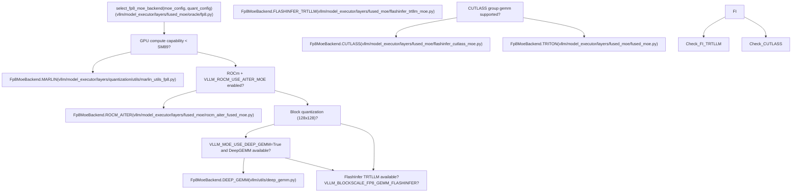
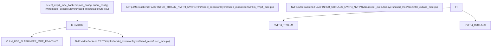
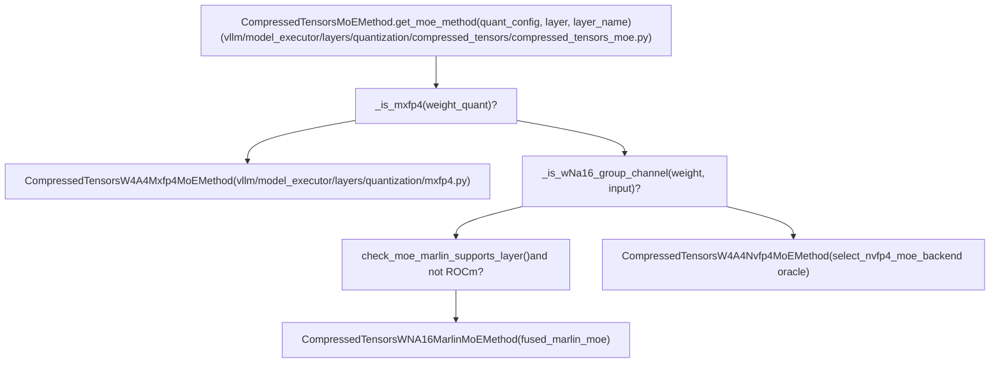

# MoE Quantization and Backend Selection

Relevant source files

-   [benchmarks/kernels/benchmark\_moe.py](https://github.com/vllm-project/vllm/blob/7cc302dd/benchmarks/kernels/benchmark_moe.py)
-   [benchmarks/kernels/benchmark\_moe\_align\_block\_size.py](https://github.com/vllm-project/vllm/blob/7cc302dd/benchmarks/kernels/benchmark_moe_align_block_size.py)
-   [benchmarks/kernels/benchmark\_moe\_permute\_unpermute.py](https://github.com/vllm-project/vllm/blob/7cc302dd/benchmarks/kernels/benchmark_moe_permute_unpermute.py)
-   [csrc/moe/moe\_align\_sum\_kernels.cu](https://github.com/vllm-project/vllm/blob/7cc302dd/csrc/moe/moe_align_sum_kernels.cu)
-   [csrc/moe/moe\_ops.h](https://github.com/vllm-project/vllm/blob/7cc302dd/csrc/moe/moe_ops.h)
-   [csrc/moe/moe\_permute\_unpermute\_op.cu](https://github.com/vllm-project/vllm/blob/7cc302dd/csrc/moe/moe_permute_unpermute_op.cu)
-   [csrc/moe/permute\_unpermute\_kernels/moe\_permute\_unpermute\_kernel.cu](https://github.com/vllm-project/vllm/blob/7cc302dd/csrc/moe/permute_unpermute_kernels/moe_permute_unpermute_kernel.cu)
-   [csrc/moe/permute\_unpermute\_kernels/moe\_permute\_unpermute\_kernel.h](https://github.com/vllm-project/vllm/blob/7cc302dd/csrc/moe/permute_unpermute_kernels/moe_permute_unpermute_kernel.h)
-   [csrc/moe/permute\_unpermute\_kernels/moe\_permute\_unpermute\_kernel.inl](https://github.com/vllm-project/vllm/blob/7cc302dd/csrc/moe/permute_unpermute_kernels/moe_permute_unpermute_kernel.inl)
-   [csrc/moe/torch\_bindings.cpp](https://github.com/vllm-project/vllm/blob/7cc302dd/csrc/moe/torch_bindings.cpp)
-   [tests/kernels/moe/test\_cutedsl\_moe.py](https://github.com/vllm-project/vllm/blob/7cc302dd/tests/kernels/moe/test_cutedsl_moe.py)
-   [tests/kernels/moe/test\_cutlass\_moe.py](https://github.com/vllm-project/vllm/blob/7cc302dd/tests/kernels/moe/test_cutlass_moe.py)
-   [tests/kernels/moe/test\_flashinfer.py](https://github.com/vllm-project/vllm/blob/7cc302dd/tests/kernels/moe/test_flashinfer.py)
-   [tests/kernels/moe/test\_flashinfer\_moe.py](https://github.com/vllm-project/vllm/blob/7cc302dd/tests/kernels/moe/test_flashinfer_moe.py)
-   [tests/kernels/moe/test\_modular\_oai\_triton\_moe.py](https://github.com/vllm-project/vllm/blob/7cc302dd/tests/kernels/moe/test_modular_oai_triton_moe.py)
-   [tests/kernels/moe/test\_moe.py](https://github.com/vllm-project/vllm/blob/7cc302dd/tests/kernels/moe/test_moe.py)
-   [tests/kernels/moe/test\_moe\_align\_block\_size.py](https://github.com/vllm-project/vllm/blob/7cc302dd/tests/kernels/moe/test_moe_align_block_size.py)
-   [tests/kernels/moe/test\_moe\_permute\_unpermute.py](https://github.com/vllm-project/vllm/blob/7cc302dd/tests/kernels/moe/test_moe_permute_unpermute.py)
-   [tests/kernels/moe/test\_nvfp4\_moe.py](https://github.com/vllm-project/vllm/blob/7cc302dd/tests/kernels/moe/test_nvfp4_moe.py)
-   [tests/kernels/moe/utils.py](https://github.com/vllm-project/vllm/blob/7cc302dd/tests/kernels/moe/utils.py)
-   [vllm/envs.py](https://github.com/vllm-project/vllm/blob/7cc302dd/vllm/envs.py)
-   [vllm/model\_executor/layers/fused\_moe/config.py](https://github.com/vllm-project/vllm/blob/7cc302dd/vllm/model_executor/layers/fused_moe/config.py)
-   [vllm/model\_executor/layers/fused\_moe/configs/E=256,N=512,device\_name=NVIDIA\_H200,dtype=fp8\_w8a8,block\_shape=\[128,128\].json](vllm/model_executor/layers/fused_moe/configs/E=256,N=512,device_name=NVIDIA_H200,dtype=fp8_w8a8,block_shape=%5B128,128%5D.json)
-   [vllm/model\_executor/layers/fused\_moe/experts/flashinfer\_cutedsl\_moe.py](https://github.com/vllm-project/vllm/blob/7cc302dd/vllm/model_executor/layers/fused_moe/experts/flashinfer_cutedsl_moe.py)
-   [vllm/model\_executor/layers/fused\_moe/experts/trtllm\_fp8\_moe.py](https://github.com/vllm-project/vllm/blob/7cc302dd/vllm/model_executor/layers/fused_moe/experts/trtllm_fp8_moe.py)
-   [vllm/model\_executor/layers/fused\_moe/experts/trtllm\_nvfp4\_moe.py](https://github.com/vllm-project/vllm/blob/7cc302dd/vllm/model_executor/layers/fused_moe/experts/trtllm_nvfp4_moe.py)
-   [vllm/model\_executor/layers/fused\_moe/flashinfer\_cutlass\_moe.py](https://github.com/vllm-project/vllm/blob/7cc302dd/vllm/model_executor/layers/fused_moe/flashinfer_cutlass_moe.py)
-   [vllm/model\_executor/layers/fused\_moe/flashinfer\_trtllm\_moe.py](https://github.com/vllm-project/vllm/blob/7cc302dd/vllm/model_executor/layers/fused_moe/flashinfer_trtllm_moe.py)
-   [vllm/model\_executor/layers/fused\_moe/gpt\_oss\_triton\_kernels\_moe.py](https://github.com/vllm-project/vllm/blob/7cc302dd/vllm/model_executor/layers/fused_moe/gpt_oss_triton_kernels_moe.py)
-   [vllm/model\_executor/layers/fused\_moe/layer.py](https://github.com/vllm-project/vllm/blob/7cc302dd/vllm/model_executor/layers/fused_moe/layer.py)
-   [vllm/model\_executor/layers/fused\_moe/moe\_align\_block\_size.py](https://github.com/vllm-project/vllm/blob/7cc302dd/vllm/model_executor/layers/fused_moe/moe_align_block_size.py)
-   [vllm/model\_executor/layers/fused\_moe/moe\_permute\_unpermute.py](https://github.com/vllm-project/vllm/blob/7cc302dd/vllm/model_executor/layers/fused_moe/moe_permute_unpermute.py)
-   [vllm/model\_executor/layers/fused\_moe/oracle/fp8.py](https://github.com/vllm-project/vllm/blob/7cc302dd/vllm/model_executor/layers/fused_moe/oracle/fp8.py)
-   [vllm/model\_executor/layers/fused\_moe/oracle/nvfp4.py](https://github.com/vllm-project/vllm/blob/7cc302dd/vllm/model_executor/layers/fused_moe/oracle/nvfp4.py)
-   [vllm/model\_executor/layers/fused\_moe/rocm\_aiter\_fused\_moe.py](https://github.com/vllm-project/vllm/blob/7cc302dd/vllm/model_executor/layers/fused_moe/rocm_aiter_fused_moe.py)
-   [vllm/model\_executor/layers/fused\_moe/router/gate\_linear.py](https://github.com/vllm-project/vllm/blob/7cc302dd/vllm/model_executor/layers/fused_moe/router/gate_linear.py)
-   [vllm/model\_executor/layers/quantization/awq\_marlin.py](https://github.com/vllm-project/vllm/blob/7cc302dd/vllm/model_executor/layers/quantization/awq_marlin.py)
-   [vllm/model\_executor/layers/quantization/bitsandbytes.py](https://github.com/vllm-project/vllm/blob/7cc302dd/vllm/model_executor/layers/quantization/bitsandbytes.py)
-   [vllm/model\_executor/layers/quantization/compressed\_tensors/compressed\_tensors\_moe.py](https://github.com/vllm-project/vllm/blob/7cc302dd/vllm/model_executor/layers/quantization/compressed_tensors/compressed_tensors_moe.py)
-   [vllm/model\_executor/layers/quantization/experts\_int8.py](https://github.com/vllm-project/vllm/blob/7cc302dd/vllm/model_executor/layers/quantization/experts_int8.py)
-   [vllm/model\_executor/layers/quantization/fp8.py](https://github.com/vllm-project/vllm/blob/7cc302dd/vllm/model_executor/layers/quantization/fp8.py)
-   [vllm/model\_executor/layers/quantization/gguf.py](https://github.com/vllm-project/vllm/blob/7cc302dd/vllm/model_executor/layers/quantization/gguf.py)
-   [vllm/model\_executor/layers/quantization/gptq\_marlin.py](https://github.com/vllm-project/vllm/blob/7cc302dd/vllm/model_executor/layers/quantization/gptq_marlin.py)
-   [vllm/model\_executor/layers/quantization/modelopt.py](https://github.com/vllm-project/vllm/blob/7cc302dd/vllm/model_executor/layers/quantization/modelopt.py)
-   [vllm/model\_executor/layers/quantization/moe\_wna16.py](https://github.com/vllm-project/vllm/blob/7cc302dd/vllm/model_executor/layers/quantization/moe_wna16.py)
-   [vllm/model\_executor/layers/quantization/mxfp4.py](https://github.com/vllm-project/vllm/blob/7cc302dd/vllm/model_executor/layers/quantization/mxfp4.py)
-   [vllm/model\_executor/layers/quantization/quark/quark\_moe.py](https://github.com/vllm-project/vllm/blob/7cc302dd/vllm/model_executor/layers/quantization/quark/quark_moe.py)
-   [vllm/model\_executor/layers/quantization/utils/flashinfer\_fp4\_moe.py](https://github.com/vllm-project/vllm/blob/7cc302dd/vllm/model_executor/layers/quantization/utils/flashinfer_fp4_moe.py)
-   [vllm/model\_executor/layers/quantization/utils/flashinfer\_utils.py](https://github.com/vllm-project/vllm/blob/7cc302dd/vllm/model_executor/layers/quantization/utils/flashinfer_utils.py)
-   [vllm/utils/flashinfer.py](https://github.com/vllm-project/vllm/blob/7cc302dd/vllm/utils/flashinfer.py)

This page documents how quantization is applied to Mixture-of-Experts (MoE) layers in vLLM, and how the runtime selects appropriate compute kernels based on hardware and quantization type. Topics include: FP8, INT8, GPTQ-Marlin, AWQ-Marlin, compressed tensors, MXFP4/NVFP4, and ROCm AITER variants.

For the modular kernel architecture (`FusedMoEModularKernel`, `FusedMoEPrepareAndFinalize`, `FusedMoEPermuteExpertsUnpermute`), see [7.3](https://github.com/vllm-project/vllm/blob/7cc302dd/7.3) For FP8 quantization on linear layers, see [7.2](https://github.com/vllm-project/vllm/blob/7cc302dd/7.2) For the general quantization method registry and lifecycle, see [7.1](https://github.com/vllm-project/vllm/blob/7cc302dd/7.1)

---

## MoE Quantization Method Selection

Every `FusedMoE` layer acquires a `FusedMoEMethodBase` instance during `__init__`. This happens via the `_get_quant_method` closure at [vllm/model\_executor/layers/fused\_moe/layer.py578-593](https://github.com/vllm-project/vllm/blob/7cc302dd/vllm/model_executor/layers/fused_moe/layer.py#L578-L593) which calls `quant_config.get_quant_method(self, prefix)` where `self` is the `FusedMoE` layer. If the result is `None`, it falls back to `UnquantizedFusedMoEMethod`.

The `FusedMoEMethodBase` interface defines:

-   `create_weights` — allocates quantized weight parameters [vllm/model\_executor/layers/fused\_moe/fused\_moe\_method\_base.py34-42](https://github.com/vllm-project/vllm/blob/7cc302dd/vllm/model_executor/layers/fused_moe/fused_moe_method_base.py#L34-L42)
-   `process_weights_after_loading` — reformats weights for the target kernel [vllm/model\_executor/layers/fused\_moe/fused\_moe\_method\_base.py44-48](https://github.com/vllm-project/vllm/blob/7cc302dd/vllm/model_executor/layers/fused_moe/fused_moe_method_base.py#L44-L48)
-   `apply` — executes the quantized forward pass [vllm/model\_executor/layers/fused\_moe/fused\_moe\_method\_base.py50-71](https://github.com/vllm-project/vllm/blob/7cc302dd/vllm/model_executor/layers/fused_moe/fused_moe_method_base.py#L50-L71)
-   `maybe_make_prepare_finalize` — returns a `FusedMoEPrepareAndFinalize` for modular kernels (or `None` if the method is monolithic) [vllm/model\_executor/layers/fused\_moe/fused\_moe\_method\_base.py84-88](https://github.com/vllm-project/vllm/blob/7cc302dd/vllm/model_executor/layers/fused_moe/fused_moe_method_base.py#L84-L88)
-   `supports_internal_mk` / `is_monolithic` — flags for the modular kernel initialization path [vllm/model\_executor/layers/fused\_moe/fused\_moe\_method\_base.py100-112](https://github.com/vllm-project/vllm/blob/7cc302dd/vllm/model_executor/layers/fused_moe/fused_moe_method_base.py#L100-L112)
-   `supports_eplb` — expert parallelism load balancing support [vllm/model\_executor/layers/fused\_moe/fused\_moe\_method\_base.py114-117](https://github.com/vllm-project/vllm/blob/7cc302dd/vllm/model_executor/layers/fused_moe/fused_moe_method_base.py#L114-L117)

**Diagram: QuantizationConfig to FusedMoEMethodBase Dispatch**

```mermaid
flowchart TD
    FusedMoE["FusedMoE.init(vllm/model_executor/layers/fused_moe/layer.py)"]
    GQM["_get_quant_method()→ quant_config.get_quant_method(layer, prefix)"]
    Fp8Config["Fp8Config(vllm/model_executor/layers/quantization/fp8.py)"]
    GPTQMarlinConfig["GPTQMarlinConfig(vllm/model_executor/layers/quantization/gptq_marlin.py)"]
    AWQMarlinConfig["AWQMarlinConfig(vllm/model_executor/layers/quantization/awq_marlin.py)"]
    CTConfig["CompressedTensorsConfig(vllm/model_executor/layers/quantization/compressed_tensors/compressed_tensors_moe.py)"]
    Mxfp4Config["Mxfp4Config(vllm/model_executor/layers/quantization/mxfp4.py)"]
    ModelOptConfig["ModelOptQuantConfigBase(vllm/model_executor/layers/quantization/modelopt.py)"]
    Fp8Method["Fp8MoEMethodFp8OnlineMoEMethod"]
    GPTQMethod["GPTQMarlinMoEMethod"]
    AWQMethod["AWQMarlinMoEMethod"]
    CTFactory["CompressedTensorsMoEMethod.get_moe_method()(factory → multiple subclasses)"]
    Mxfp4Method["Mxfp4MoEMethod"]
    ModelOptMethod["ModelOptFp8MoEMethodModelOptNvfp4MoEMethod"]

    FusedMoE --> GQM
    GQM --> Fp8Config
    GQM --> GPTQMarlinConfig
    GQM --> AWQMarlinConfig
    GQM --> CTConfig
    GQM --> Mxfp4Config
    GQM --> ModelOptConfig
    Fp8Config --> Fp8Method
    GPTQMarlinConfig --> GPTQMethod
    AWQMarlinConfig --> AWQMethod
    CTConfig --> CTFactory
    Mxfp4Config --> Mxfp4Method
    ModelOptConfig --> ModelOptMethod
```

Sources: [vllm/model\_executor/layers/fused\_moe/layer.py578-593](https://github.com/vllm-project/vllm/blob/7cc302dd/vllm/model_executor/layers/fused_moe/layer.py#L578-L593) [vllm/model\_executor/layers/quantization/fp8.py184-216](https://github.com/vllm-project/vllm/blob/7cc302dd/vllm/model_executor/layers/quantization/fp8.py#L184-L216) [vllm/model\_executor/layers/quantization/compressed\_tensors/compressed\_tensors\_moe.py124-240](https://github.com/vllm-project/vllm/blob/7cc302dd/vllm/model_executor/layers/quantization/compressed_tensors/compressed_tensors_moe.py#L124-L240) [vllm/model\_executor/layers/quantization/mxfp4.py211-243](https://github.com/vllm-project/vllm/blob/7cc302dd/vllm/model_executor/layers/quantization/mxfp4.py#L211-L243) [vllm/model\_executor/layers/quantization/modelopt.py183-220](https://github.com/vllm-project/vllm/blob/7cc302dd/vllm/model_executor/layers/quantization/modelopt.py#L183-L220)

---

## FP8 MoE Quantization

### Method Classes

| Class | File | Checkpoint type |
| --- | --- | --- |
| `Fp8MoEMethod` | `fp8.py` | Serialized FP8 (static weight scales) |
| `Fp8OnlineMoEMethod` | `fp8.py` | FP16/BF16 checkpoint; weights quantized during load |
| `CompressedTensorsW8A8Fp8MoEMethod` | `compressed_tensors_moe.py` | Compressed-tensors format FP8 |
| `ModelOptFp8MoEMethod` | `modelopt.py` | ModelOpt FP8 checkpoint |

`Fp8MoEMethod` supports weight scale granularities based on `Fp8Config.weight_block_size` and `activation_scheme`:

-   **Per-tensor** (`kFp8StaticTensorSym`) [vllm/model\_executor/layers/quantization/utils/quant\_utils.py75](https://github.com/vllm-project/vllm/blob/7cc302dd/vllm/model_executor/layers/quantization/utils/quant_utils.py#L75-L75)
-   **Per-channel** (`kFp8StaticChannelSym`) [vllm/model\_executor/layers/quantization/utils/quant\_utils.py86](https://github.com/vllm-project/vllm/blob/7cc302dd/vllm/model_executor/layers/quantization/utils/quant_utils.py#L86-L86)
-   **Block** (`kFp8Static128BlockSym`) — e.g., 128×128 blocks [vllm/model\_executor/layers/quantization/utils/quant\_utils.py74](https://github.com/vllm-project/vllm/blob/7cc302dd/vllm/model_executor/layers/quantization/utils/quant_utils.py#L74-L74)

### FP8 Backend Oracle

After weight loading, the oracle in `vllm/model_executor/layers/fused_moe/oracle/fp8.py` is called via `select_fp8_moe_backend` [vllm/model\_executor/layers/fused\_moe/oracle/fp8.py145](https://github.com/vllm-project/vllm/blob/7cc302dd/vllm/model_executor/layers/fused_moe/oracle/fp8.py#L145-L145) and `make_fp8_moe_kernel`. It returns a `Fp8MoeBackend` enum value.

**Diagram: FP8 Backend Oracle Selection (select\_fp8\_moe\_backend)**

Sources: [vllm/model\_executor/layers/fused\_moe/oracle/fp8.py145-217](https://github.com/vllm-project/vllm/blob/7cc302dd/vllm/model_executor/layers/fused_moe/oracle/fp8.py#L145-L217) [vllm/model\_executor/layers/quantization/fp8.py650-900](https://github.com/vllm-project/vllm/blob/7cc302dd/vllm/model_executor/layers/quantization/fp8.py#L650-L900) [vllm/envs.py154-165](https://github.com/vllm-project/vllm/blob/7cc302dd/vllm/envs.py#L154-L165)

---

## MXFP4 / NVFP4 MoE Quantization

### Mxfp4Backend Enum

`Mxfp4MoeBackend` in `vllm/model_executor/layers/fused_moe/oracle/mxfp4.py` enumerates available backends [vllm/model\_executor/layers/fused\_moe/oracle/mxfp4.py20-25](https://github.com/vllm-project/vllm/blob/7cc302dd/vllm/model_executor/layers/fused_moe/oracle/mxfp4.py#L20-L25):

| Enum Value | Kernel | Hardware |
| --- | --- | --- |
| `FLASHINFER_TRTLLM_MXFP4_MXFP8` | FlashInfer TensorRT-LLM | Blackwell (SM100) |
| `FLASHINFER_TRTLLM_MXFP4_BF16` | FlashInfer, BF16 output | Blackwell (SM100) |
| `FLASHINFER_SM90_MXFP4_BF16` | FlashInfer, BF16 output | Hopper (SM90) |
| `TRITON` | OAI Triton kernels | SM90/SM100 (no FlashInfer) |

### NVFP4 Backend Selection

`select_nvfp4_moe_backend` [vllm/model\_executor/layers/fused\_moe/oracle/nvfp4.py42](https://github.com/vllm-project/vllm/blob/7cc302dd/vllm/model_executor/layers/fused_moe/oracle/nvfp4.py#L42-L42) determines the kernel for NVFP4. On SM100, it prefers `FLASHINFER_TRTLLM_NVFP4_NVFP4` or `FLASHINFER_CUTLASS_NVFP4_NVFP4` [vllm/model\_executor/layers/fused\_moe/oracle/nvfp4.py53-62](https://github.com/vllm-project/vllm/blob/7cc302dd/vllm/model_executor/layers/fused_moe/oracle/nvfp4.py#L53-L62)

**Diagram: NVFP4 Backend Oracle (select\_nvfp4\_moe\_backend)**

Sources: [vllm/model\_executor/layers/fused\_moe/oracle/nvfp4.py42-80](https://github.com/vllm-project/vllm/blob/7cc302dd/vllm/model_executor/layers/fused_moe/oracle/nvfp4.py#L42-L80) [vllm/model\_executor/layers/quantization/utils/flashinfer\_fp4\_moe.py36-43](https://github.com/vllm-project/vllm/blob/7cc302dd/vllm/model_executor/layers/quantization/utils/flashinfer_fp4_moe.py#L36-L43)

---

## GPTQ-Marlin and AWQ-Marlin MoE

`GPTQMarlinMoEMethod` and `AWQMarlinMoEMethod` use `fused_marlin_moe` from `vllm/model_executor/layers/fused_moe/fused_marlin_moe.py` [vllm/model\_executor/layers/fused\_moe/fused\_marlin\_moe.py40](https://github.com/vllm-project/vllm/blob/7cc302dd/vllm/model_executor/layers/fused_moe/fused_marlin_moe.py#L40-L40)

### Key Weight Parameters (GPTQ-Marlin)

| Parameter | Description |
| --- | --- |
| `w13_qweight` / `w2_qweight` | Packed INT4 weights |
| `w13_scales` / `w2_scales` | Per-group dequantization scales |
| `w13_workspace` / `w2_workspace` | Marlin workspace buffers |

`process_weights_after_loading` calls `marlin_moe_permute_scales` [vllm/model\_executor/layers/quantization/utils/marlin\_utils.py78](https://github.com/vllm-project/vllm/blob/7cc302dd/vllm/model_executor/layers/quantization/utils/marlin_utils.py#L78-L78) to reorder scales to Marlin layout.

Sources: [vllm/model\_executor/layers/quantization/gptq\_marlin.py1-400](https://github.com/vllm-project/vllm/blob/7cc302dd/vllm/model_executor/layers/quantization/gptq_marlin.py#L1-L400) [vllm/model\_executor/layers/quantization/awq\_marlin.py1-400](https://github.com/vllm-project/vllm/blob/7cc302dd/vllm/model_executor/layers/quantization/awq_marlin.py#L1-L400)

---

## Compressed Tensors MoE

`CompressedTensorsMoEMethod.get_moe_method` [vllm/model\_executor/layers/quantization/compressed\_tensors/compressed\_tensors\_moe.py121](https://github.com/vllm-project/vllm/blob/7cc302dd/vllm/model_executor/layers/quantization/compressed_tensors/compressed_tensors_moe.py#L121-L121) inspects the weight and input quantization descriptors to select a method.

**Diagram: CompressedTensorsMoEMethod.get\_moe\_method Factory**

Sources: [vllm/model\_executor/layers/quantization/compressed\_tensors/compressed\_tensors\_moe.py124-240](https://github.com/vllm-project/vllm/blob/7cc302dd/vllm/model_executor/layers/quantization/compressed_tensors/compressed_tensors_moe.py#L124-L240)

---

## ROCm AITER MoE Variants

When `VLLM_ROCM_USE_AITER_MOE=1` [vllm/envs.py106](https://github.com/vllm-project/vllm/blob/7cc302dd/vllm/envs.py#L106-L106) AITER handles MoE computation via `vllm/model_executor/layers/fused_moe/rocm_aiter_fused_moe.py`.

### QuantMethod Enum

`QuantMethod` in `rocm_aiter_fused_moe.py` [vllm/model\_executor/layers/fused\_moe/rocm\_aiter\_fused\_moe.py31-45](https://github.com/vllm-project/vllm/blob/7cc302dd/vllm/model_executor/layers/fused_moe/rocm_aiter_fused_moe.py#L31-L45):

| `QuantMethod` | Integer | Description |
| --- | --- | --- |
| `NO` | 0 | A16W16 — no quantization |
| `PER_TENSOR` | 1 | W8A8 per-tensor scale |
| `PER_TOKEN` | 2 | W8A8/W8A4 per-token scale |
| `BLOCK_128x128` | 5 | W8A8 per-128×128 block |

### Shared Expert Fusion

When `VLLM_ROCM_USE_AITER_FUSION_SHARED_EXPERTS=1` [vllm/envs.py115](https://github.com/vllm-project/vllm/blob/7cc302dd/vllm/envs.py#L115-L115) AITER fuses shared experts. `init_aiter_topK_meta_data` [vllm/model\_executor/layers/fused\_moe/rocm\_aiter\_fused\_moe.py58](https://github.com/vllm-project/vllm/blob/7cc302dd/vllm/model_executor/layers/fused_moe/rocm_aiter_fused_moe.py#L58-L58) pre-allocates top-K buffers.

Sources: [vllm/model\_executor/layers/fused\_moe/rocm\_aiter\_fused\_moe.py1-180](https://github.com/vllm-project/vllm/blob/7cc302dd/vllm/model_executor/layers/fused_moe/rocm_aiter_fused_moe.py#L1-L180) [vllm/model\_executor/layers/fused\_moe/layer.py36-38](https://github.com/vllm-project/vllm/blob/7cc302dd/vllm/model_executor/layers/fused_moe/layer.py#L36-L38)

---

## FusedMoEQuantConfig

`FusedMoEQuantConfig` in `vllm/model_executor/layers/fused_moe/config.py` [vllm/model\_executor/layers/fused\_moe/config.py192](https://github.com/vllm-project/vllm/blob/7cc302dd/vllm/model_executor/layers/fused_moe/config.py#L192-L192) contains four `FusedMoEQuantDesc` objects:

| Field | Represents |
| --- | --- |
| `a1` | Input activation quantization [vllm/model\_executor/layers/fused\_moe/config.py214](https://github.com/vllm-project/vllm/blob/7cc302dd/vllm/model_executor/layers/fused_moe/config.py#L214-L214) |
| `w1` | Gate/up weight quantization [vllm/model\_executor/layers/fused\_moe/config.py215](https://github.com/vllm-project/vllm/blob/7cc302dd/vllm/model_executor/layers/fused_moe/config.py#L215-L215) |
| `a2` | Intermediate activation quantization [vllm/model\_executor/layers/fused\_moe/config.py216](https://github.com/vllm-project/vllm/blob/7cc302dd/vllm/model_executor/layers/fused_moe/config.py#L216-L216) |
| `w2` | Down weight quantization [vllm/model\_executor/layers/fused\_moe/config.py217](https://github.com/vllm-project/vllm/blob/7cc302dd/vllm/model_executor/layers/fused_moe/config.py#L217-L217) |

Sources: [vllm/model\_executor/layers/fused\_moe/config.py152-450](https://github.com/vllm-project/vllm/blob/7cc302dd/vllm/model_executor/layers/fused_moe/config.py#L152-L450)

---

## Environment Variables

| Variable | Default | Effect |
| --- | --- | --- |
| `VLLM_MOE_USE_DEEP_GEMM` | `True` | Enable DeepGEMM for MoE [vllm/envs.py155](https://github.com/vllm-project/vllm/blob/7cc302dd/vllm/envs.py#L155-L155) |
| `VLLM_BLOCKSCALE_FP8_GEMM_FLASHINFER` | `True` | Enable FlashInfer for block-scale MoE [vllm/envs.py164](https://github.com/vllm-project/vllm/blob/7cc302dd/vllm/envs.py#L164-L164) |
| `VLLM_USE_FLASHINFER_MOE_FP8` | `False` | Force FlashInfer for FP8 MoE [vllm/envs.py166](https://github.com/vllm-project/vllm/blob/7cc302dd/vllm/envs.py#L166-L166) |
| `VLLM_FLASHINFER_MOE_BACKEND` | `"latency"` | Mode: `"throughput"`, `"latency"`, `"masked_gemm"` [vllm/envs.py168](https://github.com/vllm-project/vllm/blob/7cc302dd/vllm/envs.py#L168-L168) |
| `VLLM_ROCM_USE_AITER_MOE` | `True` | Enable AITER MoE on ROCm [vllm/envs.py106](https://github.com/vllm-project/vllm/blob/7cc302dd/vllm/envs.py#L106-L106) |

Sources: [vllm/envs.py1-200](https://github.com/vllm-project/vllm/blob/7cc302dd/vllm/envs.py#L1-L200)
