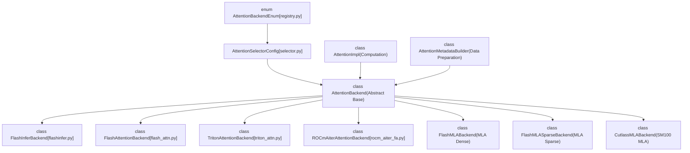
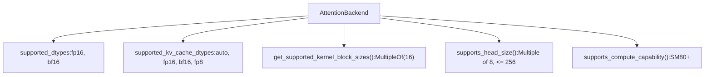
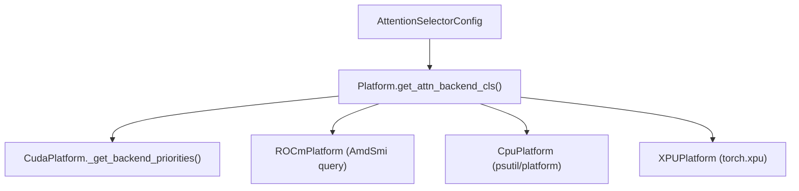

# Attention Backends

Relevant source files

-   [cmake/external\_projects/flashmla.cmake](https://github.com/vllm-project/vllm/blob/7cc302dd/cmake/external_projects/flashmla.cmake)
-   [docs/design/attention\_backends.md](https://github.com/vllm-project/vllm/blob/7cc302dd/docs/design/attention_backends.md?plain=1)
-   [tests/kernels/attention/test\_attention\_selector.py](https://github.com/vllm-project/vllm/blob/7cc302dd/tests/kernels/attention/test_attention_selector.py)
-   [tests/kernels/attention/test\_flashmla.py](https://github.com/vllm-project/vllm/blob/7cc302dd/tests/kernels/attention/test_flashmla.py)
-   [tests/kernels/attention/test\_flashmla\_sparse.py](https://github.com/vllm-project/vllm/blob/7cc302dd/tests/kernels/attention/test_flashmla_sparse.py)
-   [tests/kernels/attention/test\_rocm\_attention\_selector.py](https://github.com/vllm-project/vllm/blob/7cc302dd/tests/kernels/attention/test_rocm_attention_selector.py)
-   [tests/kernels/test\_flex\_attention.py](https://github.com/vllm-project/vllm/blob/7cc302dd/tests/kernels/test_flex_attention.py)
-   [tests/test\_attention\_backend\_registry.py](https://github.com/vllm-project/vllm/blob/7cc302dd/tests/test_attention_backend_registry.py)
-   [tests/v1/attention/test\_attention\_backends.py](https://github.com/vllm-project/vllm/blob/7cc302dd/tests/v1/attention/test_attention_backends.py)
-   [tests/v1/attention/test\_mla\_backends.py](https://github.com/vllm-project/vllm/blob/7cc302dd/tests/v1/attention/test_mla_backends.py)
-   [tests/v1/attention/test\_rocm\_attention\_backends\_selection.py](https://github.com/vllm-project/vllm/blob/7cc302dd/tests/v1/attention/test_rocm_attention_backends_selection.py)
-   [tests/v1/attention/test\_sparse\_mla\_backends.py](https://github.com/vllm-project/vllm/blob/7cc302dd/tests/v1/attention/test_sparse_mla_backends.py)
-   [tests/v1/attention/utils.py](https://github.com/vllm-project/vllm/blob/7cc302dd/tests/v1/attention/utils.py)
-   [tests/v1/spec\_decode/test\_tree\_attention.py](https://github.com/vllm-project/vllm/blob/7cc302dd/tests/v1/spec_decode/test_tree_attention.py)
-   [tools/pre\_commit/generate\_attention\_backend\_docs.py](https://github.com/vllm-project/vllm/blob/7cc302dd/tools/pre_commit/generate_attention_backend_docs.py)
-   [vllm/\_aiter\_ops.py](https://github.com/vllm-project/vllm/blob/7cc302dd/vllm/_aiter_ops.py)
-   [vllm/model\_executor/layers/quantization/quark/schemes/quark\_ocp\_mx.py](https://github.com/vllm-project/vllm/blob/7cc302dd/vllm/model_executor/layers/quantization/quark/schemes/quark_ocp_mx.py)
-   [vllm/platforms/cpu.py](https://github.com/vllm-project/vllm/blob/7cc302dd/vllm/platforms/cpu.py)
-   [vllm/platforms/cuda.py](https://github.com/vllm-project/vllm/blob/7cc302dd/vllm/platforms/cuda.py)
-   [vllm/platforms/interface.py](https://github.com/vllm-project/vllm/blob/7cc302dd/vllm/platforms/interface.py)
-   [vllm/platforms/rocm.py](https://github.com/vllm-project/vllm/blob/7cc302dd/vllm/platforms/rocm.py)
-   [vllm/platforms/tpu.py](https://github.com/vllm-project/vllm/blob/7cc302dd/vllm/platforms/tpu.py)
-   [vllm/platforms/xpu.py](https://github.com/vllm-project/vllm/blob/7cc302dd/vllm/platforms/xpu.py)
-   [vllm/v1/attention/backends/flash\_attn.py](https://github.com/vllm-project/vllm/blob/7cc302dd/vllm/v1/attention/backends/flash_attn.py)
-   [vllm/v1/attention/backends/flashinfer.py](https://github.com/vllm-project/vllm/blob/7cc302dd/vllm/v1/attention/backends/flashinfer.py)
-   [vllm/v1/attention/backends/flex\_attention.py](https://github.com/vllm-project/vllm/blob/7cc302dd/vllm/v1/attention/backends/flex_attention.py)
-   [vllm/v1/attention/backends/mla/aiter\_triton\_mla.py](https://github.com/vllm-project/vllm/blob/7cc302dd/vllm/v1/attention/backends/mla/aiter_triton_mla.py)
-   [vllm/v1/attention/backends/mla/cutlass\_mla.py](https://github.com/vllm-project/vllm/blob/7cc302dd/vllm/v1/attention/backends/mla/cutlass_mla.py)
-   [vllm/v1/attention/backends/mla/flashattn\_mla.py](https://github.com/vllm-project/vllm/blob/7cc302dd/vllm/v1/attention/backends/mla/flashattn_mla.py)
-   [vllm/v1/attention/backends/mla/flashinfer\_mla.py](https://github.com/vllm-project/vllm/blob/7cc302dd/vllm/v1/attention/backends/mla/flashinfer_mla.py)
-   [vllm/v1/attention/backends/mla/flashinfer\_mla\_sparse.py](https://github.com/vllm-project/vllm/blob/7cc302dd/vllm/v1/attention/backends/mla/flashinfer_mla_sparse.py)
-   [vllm/v1/attention/backends/mla/flashmla.py](https://github.com/vllm-project/vllm/blob/7cc302dd/vllm/v1/attention/backends/mla/flashmla.py)
-   [vllm/v1/attention/backends/mla/flashmla\_sparse.py](https://github.com/vllm-project/vllm/blob/7cc302dd/vllm/v1/attention/backends/mla/flashmla_sparse.py)
-   [vllm/v1/attention/backends/mla/rocm\_aiter\_mla.py](https://github.com/vllm-project/vllm/blob/7cc302dd/vllm/v1/attention/backends/mla/rocm_aiter_mla.py)
-   [vllm/v1/attention/backends/mla/rocm\_aiter\_mla\_sparse.py](https://github.com/vllm-project/vllm/blob/7cc302dd/vllm/v1/attention/backends/mla/rocm_aiter_mla_sparse.py)
-   [vllm/v1/attention/backends/mla/triton\_mla.py](https://github.com/vllm-project/vllm/blob/7cc302dd/vllm/v1/attention/backends/mla/triton_mla.py)
-   [vllm/v1/attention/backends/rocm\_aiter\_fa.py](https://github.com/vllm-project/vllm/blob/7cc302dd/vllm/v1/attention/backends/rocm_aiter_fa.py)
-   [vllm/v1/attention/backends/rocm\_aiter\_unified\_attn.py](https://github.com/vllm-project/vllm/blob/7cc302dd/vllm/v1/attention/backends/rocm_aiter_unified_attn.py)
-   [vllm/v1/attention/backends/rocm\_attn.py](https://github.com/vllm-project/vllm/blob/7cc302dd/vllm/v1/attention/backends/rocm_attn.py)
-   [vllm/v1/attention/backends/triton\_attn.py](https://github.com/vllm-project/vllm/blob/7cc302dd/vllm/v1/attention/backends/triton_attn.py)
-   [vllm/v1/attention/backends/utils.py](https://github.com/vllm-project/vllm/blob/7cc302dd/vllm/v1/attention/backends/utils.py)
-   [vllm/v1/attention/ops/chunked\_prefill\_paged\_decode.py](https://github.com/vllm-project/vllm/blob/7cc302dd/vllm/v1/attention/ops/chunked_prefill_paged_decode.py)

## Purpose and Scope

Attention backends are pluggable components that implement the core attention computation in vLLM's inference engine. Each backend provides optimized kernels for different hardware platforms, attention patterns, and data types. This page documents the attention backend architecture, available backends, and selection mechanisms.

For information about the overall model execution flow, see [Model Execution on GPU](/vllm-project/vllm/4-model-execution-on-gpu). For KV cache management, see [KV Cache Management and Prefix Caching](/vllm-project/vllm/3.4-kv-cache-management-and-prefix-caching).

## Architecture Overview

The attention backend system uses an abstract interface pattern that allows multiple implementations to coexist and be selected based on hardware capabilities, model requirements, and performance characteristics.

### Core Abstractions

**Sources:** [vllm/v1/attention/backend.py44-118](https://github.com/vllm-project/vllm/blob/7cc302dd/vllm/v1/attention/backend.py#L44-L118) [vllm/v1/attention/backends/registry.py1-30](https://github.com/vllm-project/vllm/blob/7cc302dd/vllm/v1/attention/backends/registry.py#L1-L30) [vllm/v1/attention/backends/flashinfer.py62-63](https://github.com/vllm-project/vllm/blob/7cc302dd/vllm/v1/attention/backends/flashinfer.py#L62-L63) [vllm/v1/attention/backends/flash\_attn.py62-63](https://github.com/vllm-project/vllm/blob/7cc302dd/vllm/v1/attention/backends/flash_attn.py#L62-L63)

The three core components of any attention backend are:

| Component | Purpose | Key Methods |
| --- | --- | --- |
| `AttentionBackend` | Backend metadata and capabilities | `get_name()`, `get_impl_cls()`, `get_builder_cls()`, `get_kv_cache_shape()` [vllm/v1/attention/backend.py44-118](https://github.com/vllm-project/vllm/blob/7cc302dd/vllm/v1/attention/backend.py#L44-L118) |
| `AttentionImpl` | Actual attention computation | `forward()`, `do_kv_cache_update()` [vllm/v1/attention/backend.py121-164](https://github.com/vllm-project/vllm/blob/7cc302dd/vllm/v1/attention/backend.py#L121-L164) |
| `AttentionMetadataBuilder` | Prepare metadata for attention kernels | `build()`, `get_cudagraph_support()` [vllm/v1/attention/backend.py175-200](https://github.com/vllm-project/vllm/blob/7cc302dd/vllm/v1/attention/backend.py#L175-L200) |

### Backend Capabilities

Each backend declares its capabilities through static methods. For instance, `FlashAttentionBackend` defines its supported data types and compute capabilities [vllm/v1/attention/backends/flash\_attn.py64-70](https://github.com/vllm-project/vllm/blob/7cc302dd/vllm/v1/attention/backends/flash_attn.py#L64-L70)

**Sources:** [vllm/v1/attention/backends/flash\_attn.py64-180](https://github.com/vllm-project/vllm/blob/7cc302dd/vllm/v1/attention/backends/flash_attn.py#L64-L180) [vllm/v1/attention/backends/flashinfer.py279-383](https://github.com/vllm-project/vllm/blob/7cc302dd/vllm/v1/attention/backends/flashinfer.py#L279-L383)

## Standard Attention Backends

### FlashInfer Backend

FlashInfer is a primary backend for NVIDIA GPUs, providing optimized paged attention. It supports advanced features like TRTLLM-style attention for Blackwell (SM100) GPUs [vllm/v1/attention/backends/flashinfer.py41-42](https://github.com/vllm-project/vllm/blob/7cc302dd/vllm/v1/attention/backends/flashinfer.py#L41-L42)

**Key Features:**

-   **TRTLLM Attention Path:** Automatically uses `trtllm_batch_decode_with_kv_cache` for decode when supported [vllm/v1/attention/backends/flashinfer.py17-18](https://github.com/vllm-project/vllm/blob/7cc302dd/vllm/v1/attention/backends/flashinfer.py#L17-L18)
-   **FP8 KV Cache:** Supports FP8 quantized KV caches with dynamic dequantization via Triton kernels [vllm/v1/attention/backends/flashinfer.py89-150](https://github.com/vllm-project/vllm/blob/7cc302dd/vllm/v1/attention/backends/flashinfer.py#L89-L150)
-   **Cascade Attention:** Efficiently handles prefix caching using `MultiLevelCascadeAttentionWrapper` [vllm/v1/attention/backends/flashinfer.py15-16](https://github.com/vllm-project/vllm/blob/7cc302dd/vllm/v1/attention/backends/flashinfer.py#L15-L16)
-   **DCP Support:** Distributed context parallel support with all-to-all LSE reduction via `BatchDCPPrefillWrapper` [vllm/v1/attention/backends/flashinfer.py203-212](https://github.com/vllm-project/vllm/blob/7cc302dd/vllm/v1/attention/backends/flashinfer.py#L203-L212)

For details, see [FlashAttention and FlashInfer](/vllm-project/vllm/8.2-flashattention-and-flashinfer).

**Sources:** [vllm/v1/attention/backends/flashinfer.py1-212](https://github.com/vllm-project/vllm/blob/7cc302dd/vllm/v1/attention/backends/flashinfer.py#L1-L212) [vllm/utils/flashinfer.py39-42](https://github.com/vllm-project/vllm/blob/7cc302dd/vllm/utils/flashinfer.py#L39-L42)

### FlashAttention Backend

The FlashAttention backend provides a standard implementation using `flash_attn_varlen_func`. It supports various attention types including decoder, encoder, and encoder-decoder [vllm/v1/attention/backends/flash\_attn.py98-105](https://github.com/vllm-project/vllm/blob/7cc302dd/vllm/v1/attention/backends/flash_attn.py#L98-L105)

**Key Features:**

-   **Version Support:** Detects FlashAttention version and feature availability (e.g., sinks) [vllm/v1/attention/backends/fa\_utils.py22-35](https://github.com/vllm-project/vllm/blob/7cc302dd/vllm/v1/attention/backends/fa_utils.py#L22-L35)
-   **KV Cache Layout:** Supports flexible layouts like `NHD` and `HND` [vllm/v1/attention/backends/flash\_attn.py138-150](https://github.com/vllm-project/vllm/blob/7cc302dd/vllm/v1/attention/backends/flash_attn.py#L138-L150)
-   **FP8 Support:** Supports FP8 KV cache if `flash_attn_supports_fp8()` returns true [vllm/v1/attention/backends/flash\_attn.py168-169](https://github.com/vllm-project/vllm/blob/7cc302dd/vllm/v1/attention/backends/flash_attn.py#L168-L169)

For details, see [FlashAttention and FlashInfer](/vllm-project/vllm/8.2-flashattention-and-flashinfer).

**Sources:** [vllm/v1/attention/backends/flash\_attn.py62-180](https://github.com/vllm-project/vllm/blob/7cc302dd/vllm/v1/attention/backends/flash_attn.py#L62-L180) [vllm/v1/attention/backends/fa\_utils.py20-35](https://github.com/vllm-project/vllm/blob/7cc302dd/vllm/v1/attention/backends/fa_utils.py#L20-L35)

### Triton Attention Backend

The Triton backend provides a high-performance, pure-Triton implementation. It uses a threshold to switch between 2D and 3D kernels based on batch size to optimize occupancy [vllm/v1/attention/backends/triton\_attn.py154-167](https://github.com/vllm-project/vllm/blob/7cc302dd/vllm/v1/attention/backends/triton_attn.py#L154-L167)

**Key Features:**

-   **Unified Attention:** Uses `unified_attention` for flexible execution [vllm/v1/attention/backends/triton\_attn.py35-36](https://github.com/vllm-project/vllm/blob/7cc302dd/vllm/v1/attention/backends/triton_attn.py#L35-L36)
-   **Cascade Support:** Implements cascade attention for shared prefixes [vllm/v1/attention/backends/triton\_attn.py70-76](https://github.com/vllm-project/vllm/blob/7cc302dd/vllm/v1/attention/backends/triton_attn.py#L70-L76)
-   **Multimodal Support:** Handles specialized prefix ranges for multimodal models via `mm_prefix_range` [vllm/v1/attention/backends/triton\_attn.py83-114](https://github.com/vllm-project/vllm/blob/7cc302dd/vllm/v1/attention/backends/triton_attn.py#L83-L114)

**Sources:** [vllm/v1/attention/backends/triton\_attn.py1-190](https://github.com/vllm-project/vllm/blob/7cc302dd/vllm/v1/attention/backends/triton_attn.py#L1-L190)

### ROCm AITER Backend

Optimized for AMD hardware, the AITER backend leverages `rocm_aiter_ops` for efficient attention kernels on `gfx9` architectures [vllm/v1/attention/backends/rocm\_aiter\_fa.py10-11](https://github.com/vllm-project/vllm/blob/7cc302dd/vllm/v1/attention/backends/rocm_aiter_fa.py#L10-L11)

**Key Features:**

-   **AMD Specific Ops:** Utilizes `rocm_aiter_ops` for high-performance inference on ROCm [vllm/\_aiter\_ops.py36-56](https://github.com/vllm-project/vllm/blob/7cc302dd/vllm/_aiter_ops.py#L36-L56)
-   **Layout Support:** Supports `NHD` and `SHUFFLE` KV cache layouts [vllm/v1/attention/backends/rocm\_aiter\_fa.py93-121](https://github.com/vllm-project/vllm/blob/7cc302dd/vllm/v1/attention/backends/rocm_aiter_fa.py#L93-L121)
-   **Gather Cache:** Implements `cp_mha_gather_cache_kernel` for efficient KV cache access [vllm/v1/attention/backends/rocm\_aiter\_fa.py47-72](https://github.com/vllm-project/vllm/blob/7cc302dd/vllm/v1/attention/backends/rocm_aiter_fa.py#L47-L72)

For details, see [ROCm and Platform-Specific Attention](/vllm-project/vllm/8.4-rocm-and-platform-specific-attention).

**Sources:** [vllm/v1/attention/backends/rocm\_aiter\_fa.py1-121](https://github.com/vllm-project/vllm/blob/7cc302dd/vllm/v1/attention/backends/rocm_aiter_fa.py#L1-L121) [vllm/\_aiter\_ops.py33-56](https://github.com/vllm-project/vllm/blob/7cc302dd/vllm/_aiter_ops.py#L33-L56)

## Multi-Latent Attention (MLA) Backends

MLA is a specialized attention mechanism used in models like DeepSeek-V3. vLLM provides multiple MLA implementations selected based on hardware.

**Implementations:**

-   **FlashMLA:** Optimized dense MLA for Hopper/Blackwell GPUs [vllm/platforms/cuda.py79-88](https://github.com/vllm-project/vllm/blob/7cc302dd/vllm/platforms/cuda.py#L79-L88)
-   **FlashInfer MLA:** Paged MLA implementation [vllm/platforms/cuda.py84-85](https://github.com/vllm-project/vllm/blob/7cc302dd/vllm/platforms/cuda.py#L84-L85)
-   **Sparse MLA:** Specialized backends for sparse MoE models using MLA, such as `FLASHMLA_SPARSE` [vllm/platforms/cuda.py79-81](https://github.com/vllm-project/vllm/blob/7cc302dd/vllm/platforms/cuda.py#L79-L81)

For details, see [MLA and Specialized Attention](/vllm-project/vllm/8.3-mla-and-specialized-attention).

**Sources:** [vllm/platforms/cuda.py58-98](https://github.com/vllm-project/vllm/blob/7cc302dd/vllm/platforms/cuda.py#L58-L98)

## Backend Selection

The selection logic is platform-dependent and considers device capabilities, model architecture (e.g., MLA), and user configuration.

**Sources:** [vllm/platforms/cuda.py51-56](https://github.com/vllm-project/vllm/blob/7cc302dd/vllm/platforms/cuda.py#L51-L56) [vllm/platforms/rocm.py112-123](https://github.com/vllm-project/vllm/blob/7cc302dd/vllm/platforms/rocm.py#L112-L123) [vllm/platforms/cpu.py105-117](https://github.com/vllm-project/vllm/blob/7cc302dd/vllm/platforms/cpu.py#L105-L117) [vllm/platforms/xpu.py49-54](https://github.com/vllm-project/vllm/blob/7cc302dd/vllm/platforms/xpu.py#L49-L54)

For details, see [Attention Backend Selection](/vllm-project/vllm/8.1-attention-backend-selection).

### Platform-Specific Selection Logic

-   **CUDA:** Priorities are determined by `DeviceCapability` and the presence of MLA [vllm/platforms/cuda.py51-113](https://github.com/vllm-project/vllm/blob/7cc302dd/vllm/platforms/cuda.py#L51-L113) For SM100, `FLASHINFER` is often prioritized [vllm/platforms/cuda.py100-106](https://github.com/vllm-project/vllm/blob/7cc302dd/vllm/platforms/cuda.py#L100-L106)
-   **ROCm:** Logic detects GCN architecture (e.g., `gfx942` for MI300X) to enable AITER [vllm/platforms/rocm.py146-152](https://github.com/vllm-project/vllm/blob/7cc302dd/vllm/platforms/rocm.py#L146-L152)
-   **XPU:** Forces `NHD` layout and defaults to `FLASH_ATTN` or `TRITON_ATTN` [vllm/platforms/xpu.py55-89](https://github.com/vllm-project/vllm/blob/7cc302dd/vllm/platforms/xpu.py#L55-L89)
-   **CPU:** Exclusively uses `CPU_ATTN` and defaults to a block size of 128 [vllm/platforms/cpu.py105-117](https://github.com/vllm-project/vllm/blob/7cc302dd/vllm/platforms/cpu.py#L105-L117) [vllm/platforms/cpu.py165-166](https://github.com/vllm-project/vllm/blob/7cc302dd/vllm/platforms/cpu.py#L165-L166)

**Sources:** [vllm/platforms/cuda.py51-113](https://github.com/vllm-project/vllm/blob/7cc302dd/vllm/platforms/cuda.py#L51-L113) [vllm/platforms/rocm.py146-152](https://github.com/vllm-project/vllm/blob/7cc302dd/vllm/platforms/rocm.py#L146-L152) [vllm/platforms/xpu.py55-89](https://github.com/vllm-project/vllm/blob/7cc302dd/vllm/platforms/xpu.py#L55-L89) [vllm/platforms/cpu.py105-117](https://github.com/vllm-project/vllm/blob/7cc302dd/vllm/platforms/cpu.py#L105-L117)

## Metadata Building and Utilities

Attention backends rely on utility functions to manage KV cache layouts and sequence lengths.

-   **KV Cache Layout:** Determined by `get_kv_cache_layout()`, which checks `VLLM_KV_CACHE_LAYOUT` [vllm/v1/attention/backends/utils.py52-78](https://github.com/vllm-project/vllm/blob/7cc302dd/vllm/v1/attention/backends/utils.py#L52-L78)
-   **Per-Layer Parameters:** `get_per_layer_parameters()` scans model layers to infer sliding window sizes and logit soft caps [vllm/v1/attention/backends/utils.py105-135](https://github.com/vllm-project/vllm/blob/7cc302dd/vllm/v1/attention/backends/utils.py#L105-L135)
-   **Hyperparameter Inference:** `infer_global_hyperparameters()` validates that all layers share compatible attention parameters [vllm/v1/attention/backends/utils.py138-165](https://github.com/vllm-project/vllm/blob/7cc302dd/vllm/v1/attention/backends/utils.py#L138-L165)

**Sources:** [vllm/v1/attention/backends/utils.py52-165](https://github.com/vllm-project/vllm/blob/7cc302dd/vllm/v1/attention/backends/utils.py#L52-L165)
