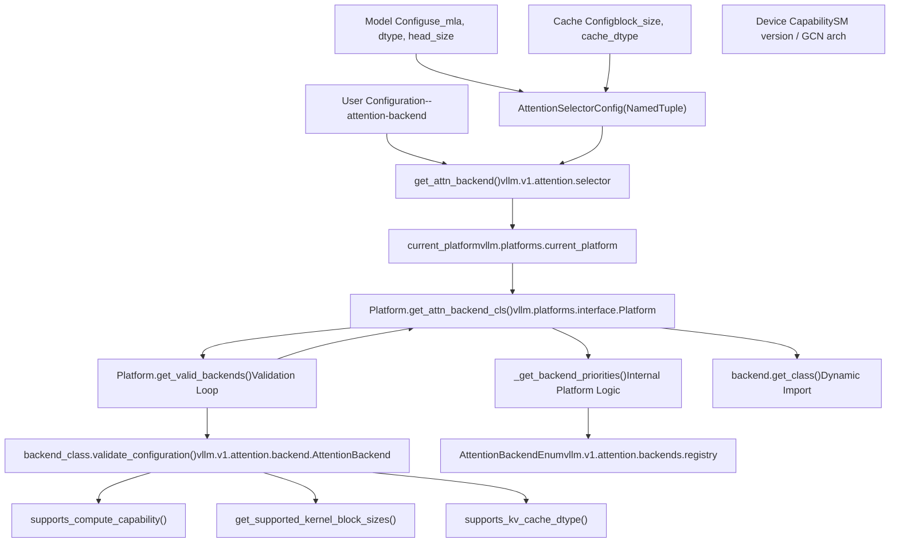
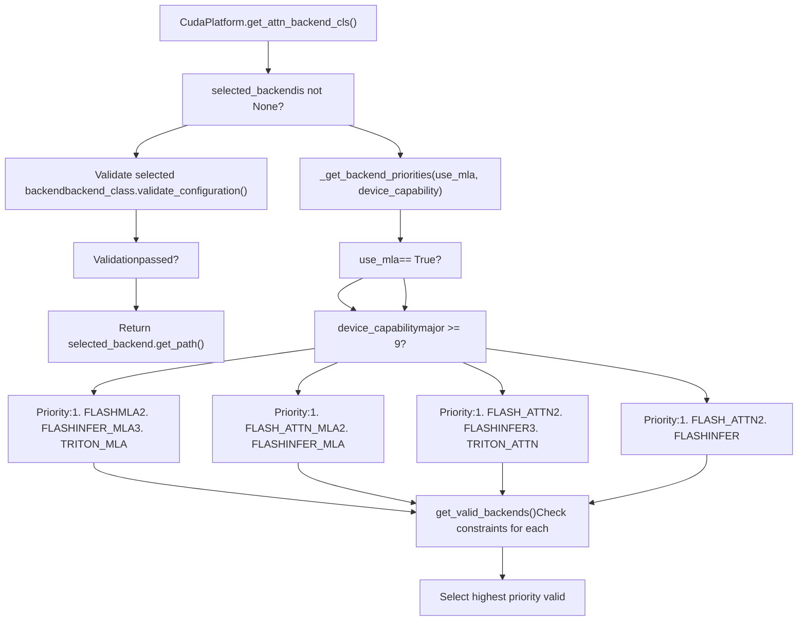

# Attention Backend Selection

Relevant source files

-   [cmake/external\_projects/flashmla.cmake](https://github.com/vllm-project/vllm/blob/7cc302dd/cmake/external_projects/flashmla.cmake)
-   [cmake/external\_projects/vllm\_flash\_attn.cmake](https://github.com/vllm-project/vllm/blob/7cc302dd/cmake/external_projects/vllm_flash_attn.cmake)
-   [docs/design/attention\_backends.md](https://github.com/vllm-project/vllm/blob/7cc302dd/docs/design/attention_backends.md?plain=1)
-   [tests/kernels/attention/test\_attention\_selector.py](https://github.com/vllm-project/vllm/blob/7cc302dd/tests/kernels/attention/test_attention_selector.py)
-   [tests/kernels/attention/test\_flashmla.py](https://github.com/vllm-project/vllm/blob/7cc302dd/tests/kernels/attention/test_flashmla.py)
-   [tests/kernels/attention/test\_flashmla\_sparse.py](https://github.com/vllm-project/vllm/blob/7cc302dd/tests/kernels/attention/test_flashmla_sparse.py)
-   [tests/kernels/attention/test\_rocm\_attention\_selector.py](https://github.com/vllm-project/vllm/blob/7cc302dd/tests/kernels/attention/test_rocm_attention_selector.py)
-   [tests/kernels/test\_flex\_attention.py](https://github.com/vllm-project/vllm/blob/7cc302dd/tests/kernels/test_flex_attention.py)
-   [tests/test\_attention\_backend\_registry.py](https://github.com/vllm-project/vllm/blob/7cc302dd/tests/test_attention_backend_registry.py)
-   [tests/v1/attention/test\_attention\_backends.py](https://github.com/vllm-project/vllm/blob/7cc302dd/tests/v1/attention/test_attention_backends.py)
-   [tests/v1/attention/test\_mla\_backends.py](https://github.com/vllm-project/vllm/blob/7cc302dd/tests/v1/attention/test_mla_backends.py)
-   [tests/v1/attention/test\_rocm\_attention\_backends\_selection.py](https://github.com/vllm-project/vllm/blob/7cc302dd/tests/v1/attention/test_rocm_attention_backends_selection.py)
-   [tests/v1/attention/test\_sparse\_mla\_backends.py](https://github.com/vllm-project/vllm/blob/7cc302dd/tests/v1/attention/test_sparse_mla_backends.py)
-   [tests/v1/attention/utils.py](https://github.com/vllm-project/vllm/blob/7cc302dd/tests/v1/attention/utils.py)
-   [tests/v1/cudagraph/test\_cudagraph\_dispatch.py](https://github.com/vllm-project/vllm/blob/7cc302dd/tests/v1/cudagraph/test_cudagraph_dispatch.py)
-   [tests/v1/cudagraph/test\_cudagraph\_mode.py](https://github.com/vllm-project/vllm/blob/7cc302dd/tests/v1/cudagraph/test_cudagraph_mode.py)
-   [tests/v1/kv\_connector/unit/test\_config.py](https://github.com/vllm-project/vllm/blob/7cc302dd/tests/v1/kv_connector/unit/test_config.py)
-   [tests/v1/spec\_decode/test\_tree\_attention.py](https://github.com/vllm-project/vllm/blob/7cc302dd/tests/v1/spec_decode/test_tree_attention.py)
-   [tools/pre\_commit/generate\_attention\_backend\_docs.py](https://github.com/vllm-project/vllm/blob/7cc302dd/tools/pre_commit/generate_attention_backend_docs.py)
-   [tools/pre\_commit/mypy.py](https://github.com/vllm-project/vllm/blob/7cc302dd/tools/pre_commit/mypy.py)
-   [vllm/config/attention.py](https://github.com/vllm-project/vllm/blob/7cc302dd/vllm/config/attention.py)
-   [vllm/config/cache.py](https://github.com/vllm-project/vllm/blob/7cc302dd/vllm/config/cache.py)
-   [vllm/forward\_context.py](https://github.com/vllm-project/vllm/blob/7cc302dd/vllm/forward_context.py)
-   [vllm/model\_executor/layers/attention/mla\_attention.py](https://github.com/vllm-project/vllm/blob/7cc302dd/vllm/model_executor/layers/attention/mla_attention.py)
-   [vllm/v1/attention/backend.py](https://github.com/vllm-project/vllm/blob/7cc302dd/vllm/v1/attention/backend.py)
-   [vllm/v1/attention/backends/fa\_utils.py](https://github.com/vllm-project/vllm/blob/7cc302dd/vllm/v1/attention/backends/fa_utils.py)
-   [vllm/v1/attention/backends/flash\_attn.py](https://github.com/vllm-project/vllm/blob/7cc302dd/vllm/v1/attention/backends/flash_attn.py)
-   [vllm/v1/attention/backends/flashinfer.py](https://github.com/vllm-project/vllm/blob/7cc302dd/vllm/v1/attention/backends/flashinfer.py)
-   [vllm/v1/attention/backends/flex\_attention.py](https://github.com/vllm-project/vllm/blob/7cc302dd/vllm/v1/attention/backends/flex_attention.py)
-   [vllm/v1/attention/backends/mla/aiter\_triton\_mla.py](https://github.com/vllm-project/vllm/blob/7cc302dd/vllm/v1/attention/backends/mla/aiter_triton_mla.py)
-   [vllm/v1/attention/backends/mla/cutlass\_mla.py](https://github.com/vllm-project/vllm/blob/7cc302dd/vllm/v1/attention/backends/mla/cutlass_mla.py)
-   [vllm/v1/attention/backends/mla/flashattn\_mla.py](https://github.com/vllm-project/vllm/blob/7cc302dd/vllm/v1/attention/backends/mla/flashattn_mla.py)
-   [vllm/v1/attention/backends/mla/flashinfer\_mla.py](https://github.com/vllm-project/vllm/blob/7cc302dd/vllm/v1/attention/backends/mla/flashinfer_mla.py)
-   [vllm/v1/attention/backends/mla/flashinfer\_mla\_sparse.py](https://github.com/vllm-project/vllm/blob/7cc302dd/vllm/v1/attention/backends/mla/flashinfer_mla_sparse.py)
-   [vllm/v1/attention/backends/mla/flashmla.py](https://github.com/vllm-project/vllm/blob/7cc302dd/vllm/v1/attention/backends/mla/flashmla.py)
-   [vllm/v1/attention/backends/mla/flashmla\_sparse.py](https://github.com/vllm-project/vllm/blob/7cc302dd/vllm/v1/attention/backends/mla/flashmla_sparse.py)
-   [vllm/v1/attention/backends/mla/rocm\_aiter\_mla.py](https://github.com/vllm-project/vllm/blob/7cc302dd/vllm/v1/attention/backends/mla/rocm_aiter_mla.py)
-   [vllm/v1/attention/backends/mla/rocm\_aiter\_mla\_sparse.py](https://github.com/vllm-project/vllm/blob/7cc302dd/vllm/v1/attention/backends/mla/rocm_aiter_mla_sparse.py)
-   [vllm/v1/attention/backends/mla/triton\_mla.py](https://github.com/vllm-project/vllm/blob/7cc302dd/vllm/v1/attention/backends/mla/triton_mla.py)
-   [vllm/v1/attention/backends/rocm\_aiter\_fa.py](https://github.com/vllm-project/vllm/blob/7cc302dd/vllm/v1/attention/backends/rocm_aiter_fa.py)
-   [vllm/v1/attention/backends/rocm\_aiter\_unified\_attn.py](https://github.com/vllm-project/vllm/blob/7cc302dd/vllm/v1/attention/backends/rocm_aiter_unified_attn.py)
-   [vllm/v1/attention/backends/rocm\_attn.py](https://github.com/vllm-project/vllm/blob/7cc302dd/vllm/v1/attention/backends/rocm_attn.py)
-   [vllm/v1/attention/backends/triton\_attn.py](https://github.com/vllm-project/vllm/blob/7cc302dd/vllm/v1/attention/backends/triton_attn.py)
-   [vllm/v1/attention/backends/utils.py](https://github.com/vllm-project/vllm/blob/7cc302dd/vllm/v1/attention/backends/utils.py)
-   [vllm/v1/attention/ops/chunked\_prefill\_paged\_decode.py](https://github.com/vllm-project/vllm/blob/7cc302dd/vllm/v1/attention/ops/chunked_prefill_paged_decode.py)
-   [vllm/v1/attention/ops/paged\_attn.py](https://github.com/vllm-project/vllm/blob/7cc302dd/vllm/v1/attention/ops/paged_attn.py)
-   [vllm/v1/cudagraph\_dispatcher.py](https://github.com/vllm-project/vllm/blob/7cc302dd/vllm/v1/cudagraph_dispatcher.py)
-   [vllm/v1/worker/dp\_utils.py](https://github.com/vllm-project/vllm/blob/7cc302dd/vllm/v1/worker/dp_utils.py)

## Purpose and Scope

This document explains vLLM's attention backend selection system, which determines which kernel implementation will execute attention operations during model inference. The system chooses backends based on hardware platform, device capabilities, model configuration parameters, and user preferences.

For information about the actual attention backend implementations (FlashAttention, FlashInfer, etc.), see [FlashAttention and FlashInfer](/vllm-project/vllm/8.2-flashattention-and-flashinfer). For ROCm and platform-specific attention implementations, see [ROCm and Platform-Specific Attention](/vllm-project/vllm/8.4-rocm-and-platform-specific-attention). For Multi-Latent Attention (MLA) backends, see [MLA and Specialized Attention](/vllm-project/vllm/8.3-mla-and-specialized-attention).

## Overview

The attention backend selection system operates through a platform abstraction layer where each supported hardware platform (CUDA, ROCm, XPU, CPU) implements its own backend selection logic. The selection process validates backend requirements against model configuration and hardware capabilities, then selects the highest-priority valid backend.

### Attention Selection Logic Flow

**Sources**: `vllm/v1/attention/backend.py:13-194`(), `vllm/v1/attention/backends/flash_attn.py:62-197`(), `vllm/v1/attention/backends/flashinfer.py:203-240`()

## Backend Registry and Enumeration

The `AttentionBackendEnum` defines all available attention backends. Each enum member stores a module path string pointing to the backend implementation class.

| Backend Enum | Module Path | Platform Support |
| --- | --- | --- |
| `FLASH_ATTN` | `vllm.v1.attention.backends.flash_attn` | CUDA, ROCm, XPU |
| `FLASHINFER` | `vllm.v1.attention.backends.flashinfer` | CUDA, XPU |
| `TRITON_ATTN` | `vllm.v1.attention.backends.triton_attn` | CUDA, ROCm, XPU |
| `ROCM_AITER_FA` | `vllm.v1.attention.backends.rocm_aiter_fa` | ROCm only |
| `FLEX_ATTENTION` | `vllm.v1.attention.backends.flex_attention` | CUDA |
| `FLASHMLA` | `vllm.v1.attention.backends.mla.flashmla` | CUDA (Hopper+) |
| `ROCM_AITER_MLA` | `vllm.v1.attention.backends.mla.rocm_aiter_mla` | ROCm only |

The enum provides methods to resolve paths and import classes dynamically.

**Sources**: `vllm/v1/attention/backends/flash_attn.py:94-95`(), `vllm/v1/attention/backends/flashinfer.py:46-54`(), `vllm/v1/attention/backends/flex_attention.py:90-92`(), `vllm/v1/attention/backends/mla/flashmla.py:61-62`()

## Platform-Specific Backend Selection

Each platform implements selection logic to prioritize kernels based on hardware characteristics and model requirements.

### CUDA Backend Selection

The CUDA platform uses hardware capability (SM version) and model topology to prioritize kernels.

**Key CUDA-specific logic**:

1.  **Hopper GPUs (SM 9.0)**: Prioritize `FLASHMLA` for MLA models [vllm/v1/attention/backends/mla/flashmla.py73-74](https://github.com/vllm-project/vllm/blob/7cc302dd/vllm/v1/attention/backends/mla/flashmla.py#L73-L74)
2.  **FlashAttention FP8**: Supported only if the version is 3+ or specialized kernels are available [vllm/v1/attention/backends/flash\_attn.py108-110](https://github.com/vllm-project/vllm/blob/7cc302dd/vllm/v1/attention/backends/flash_attn.py#L108-L110)
3.  **FlashInfer MLA**: Often used as a fallback or primary on Blackwell [vllm/v1/attention/backends/flashinfer.py39-42](https://github.com/vllm-project/vllm/blob/7cc302dd/vllm/v1/attention/backends/flashinfer.py#L39-L42)

**Sources**: `vllm/v1/attention/backends/flash_attn.py:179-180`(), `vllm/v1/attention/backends/mla/flashmla.py:73-74`(), `vllm/v1/attention/backends/flashinfer.py:69-73`()

### ROCm Backend Selection

ROCm selection logic is driven by GCN architecture detection and AITER operation availability.

-   **AITER Integration**: Prioritizes `ROCM_AITER_FA` or `ROCM_AITER_MLA` if `rocm_aiter_ops` are enabled [vllm/v1/attention/backends/rocm\_aiter\_fa.py10-18](https://github.com/vllm-project/vllm/blob/7cc302dd/vllm/v1/attention/backends/rocm_aiter_fa.py#L10-L18)
-   **Triton Fallback**: `TRITON_ATTN` is used extensively on ROCm for compatibility across different GCN versions [vllm/v1/attention/backends/triton\_attn.py10-18](https://github.com/vllm-project/vllm/blob/7cc302dd/vllm/v1/attention/backends/triton_attn.py#L10-L18)
-   **MLA on ROCm**: Uses `AiterMLABackend` which leverages `rocm_aiter_ops` for high-performance latent attention [vllm/v1/attention/backends/mla/rocm\_aiter\_mla.py30-51](https://github.com/vllm-project/vllm/blob/7cc302dd/vllm/v1/attention/backends/mla/rocm_aiter_mla.py#L30-L51)

**Sources**: `vllm/v1/attention/backends/rocm_aiter_fa.py:19-28`(), `vllm/v1/attention/backends/mla/rocm_aiter_mla.py:41-51`()

## Backend Validation System

Each backend implementation inherits from `AttentionBackend` and must implement validation logic to ensure compatibility with model parameters.

### Validation Constraints

| Feature | `FLASH_ATTN` | `FLASHINFER` | `TRITON_ATTN` | `FLEX_ATTENTION` |
| --- | --- | --- | --- | --- |
| **Head Size** | Multiple of 8, $\\le 256$ [vllm/v1/attention/backends/flash\_attn.py161-162](https://github.com/vllm-project/vllm/blob/7cc302dd/vllm/v1/attention/backends/flash_attn.py#L161-L162) | Flexible [vllm/v1/attention/backends/flashinfer.py42-45](https://github.com/vllm-project/vllm/blob/7cc302dd/vllm/v1/attention/backends/flashinfer.py#L42-L45) | Flexible | Not specified [vllm/v1/attention/backends/flex\_attention.py127-128](https://github.com/vllm-project/vllm/blob/7cc302dd/vllm/v1/attention/backends/flex_attention.py#L127-L128) |
| **KV Cache DType** | auto, fp16, bf16, fp8 [vllm/v1/attention/backends/flash\_attn.py65-69](https://github.com/vllm-project/vllm/blob/7cc302dd/vllm/v1/attention/backends/flash_attn.py#L65-L69) | auto, fp16, bf16, fp8, fp4 [vllm/v1/attention/backends/flashinfer.py28-35](https://github.com/vllm-project/vllm/blob/7cc302dd/vllm/v1/attention/backends/flashinfer.py#L28-L35) | Flexible [vllm/v1/attention/backends/triton\_attn.py12-17](https://github.com/vllm-project/vllm/blob/7cc302dd/vllm/v1/attention/backends/triton_attn.py#L12-L17) | auto, fp16, bf16 [vllm/v1/attention/backends/flex\_attention.py82-86](https://github.com/vllm-project/vllm/blob/7cc302dd/vllm/v1/attention/backends/flex_attention.py#L82-L86) |
| **Block Size** | Multiple of 16 [vllm/v1/attention/backends/flash\_attn.py128-129](https://github.com/vllm-project/vllm/blob/7cc302dd/vllm/v1/attention/backends/flash_attn.py#L128-L129) | Flexible | Flexible | Flexible |
| **Compute Capability** | $\\ge 8.0$ [vllm/v1/attention/backends/flash\_attn.py179-180](https://github.com/vllm-project/vllm/blob/7cc302dd/vllm/v1/attention/backends/flash_attn.py#L179-L180) | $\\ge 8.0$ | $\\ge 8.0$ [vllm/v1/attention/backends/triton\_attn.py18-19](https://github.com/vllm-project/vllm/blob/7cc302dd/vllm/v1/attention/backends/triton_attn.py#L18-L19) | $\\ge 8.0$ |

**Sources**: `vllm/v1/attention/backends/flash_attn.py:64-197`(), `vllm/v1/attention/backends/flashinfer.py:42-65`(), `vllm/v1/attention/backends/flex_attention.py:75-129`()

## Specialized Attention Logic

### Multi-Latent Attention (MLA)

MLA requires specific backends that can handle compressed KV caches. Selection depends on:

-   **FlashMLA**: Primary for Hopper (SM90) [vllm/v1/attention/backends/mla/flashmla.py73-74](https://github.com/vllm-project/vllm/blob/7cc302dd/vllm/v1/attention/backends/mla/flashmla.py#L73-L74)
-   **AiterMLA**: Primary for ROCm [vllm/v1/attention/backends/mla/rocm\_aiter\_mla.py30-51](https://github.com/vllm-project/vllm/blob/7cc302dd/vllm/v1/attention/backends/mla/rocm_aiter_mla.py#L30-L51)
-   **TritonMLA**: Cross-platform fallback [vllm/v1/attention/backends/mla/triton\_mla.py1-10](https://github.com/vllm-project/vllm/blob/7cc302dd/vllm/v1/attention/backends/mla/triton_mla.py#L1-L10)

### FlexAttention

`FlexAttentionBackend` is selected when `torch.compile` is used or for experimental masking requirements. It supports `ENCODER_ONLY` and `DECODER` types [vllm/v1/attention/backends/flex\_attention.py94-97](https://github.com/vllm-project/vllm/blob/7cc302dd/vllm/v1/attention/backends/flex_attention.py#L94-L97)

**Sources**: `vllm/v1/attention/backends/mla/flashmla.py:46-75`(), `vllm/v1/attention/backends/flex_attention.py:75-106`()

## Implementation Details

### Metadata Builders

Every backend provides a `get_builder_cls()` which returns an `AttentionMetadataBuilder`. This builder is responsible for preparing the hardware-specific metadata (e.g., `FlashAttentionMetadata`, `TritonAttentionMetadata`) required by the kernels during the forward pass.

-   `FlashAttentionMetadataBuilder`: Prepares `cu_seqlens` and `block_tables` [vllm/v1/attention/backends/flash\_attn.py117-118](https://github.com/vllm-project/vllm/blob/7cc302dd/vllm/v1/attention/backends/flash_attn.py#L117-L118)
-   `TritonAttentionMetadataBuilder`: Handles 2D vs 3D launch grid selection for Triton kernels [vllm/v1/attention/backends/triton\_attn.py117-191](https://github.com/vllm-project/vllm/blob/7cc302dd/vllm/v1/attention/backends/triton_attn.py#L117-L191)
-   `FlashMLAMetadataBuilder`: Manages persistent buffers for CUDA graph compatibility [vllm/v1/attention/backends/mla/flashmla.py108-148](https://github.com/vllm-project/vllm/blob/7cc302dd/vllm/v1/attention/backends/mla/flashmla.py#L108-L148)

### Per-Layer Parameters

For backends like FlashInfer, the system scans all layers to ensure they share hyperparameters like `window_left`, `logits_soft_cap`, and `sm_scale` before planning the execution [vllm/v1/attention/backends/utils.py105-135](https://github.com/vllm-project/vllm/blob/7cc302dd/vllm/v1/attention/backends/utils.py#L105-L135)

**Sources**: `vllm/v1/attention/backends/utils.py:138-165`(), `vllm/v1/attention/backends/triton_attn.py:148-154`(), `vllm/v1/attention/backends/mla/flashmla.py:135-147`()
