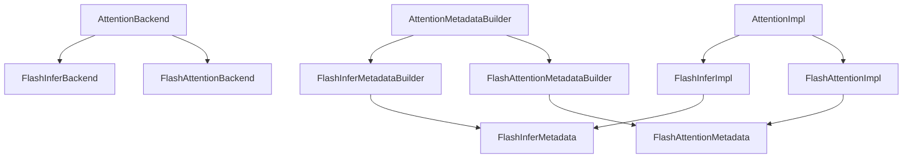
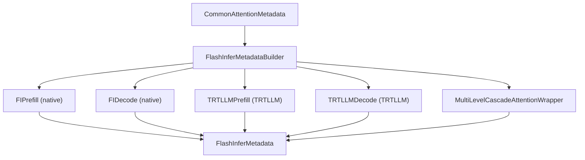
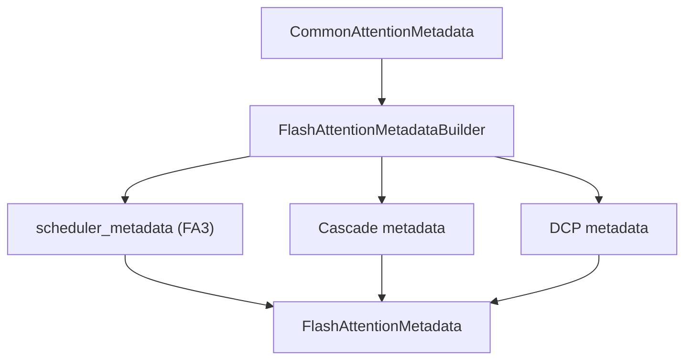
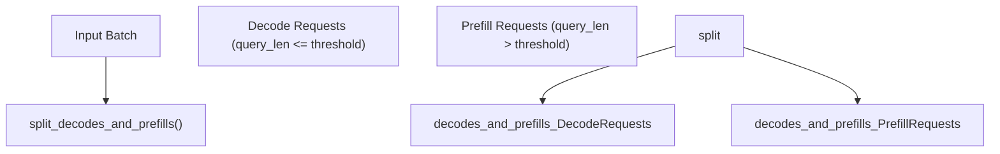
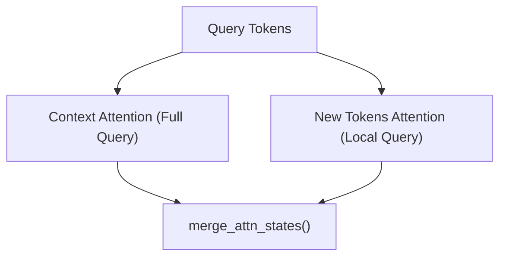

# FlashAttention and FlashInfer

Relevant source files

-   [cmake/external\_projects/flashmla.cmake](https://github.com/vllm-project/vllm/blob/7cc302dd/cmake/external_projects/flashmla.cmake)
-   [docs/design/attention\_backends.md](https://github.com/vllm-project/vllm/blob/7cc302dd/docs/design/attention_backends.md?plain=1)
-   [tests/kernels/attention/test\_aiter\_flash\_attn.py](https://github.com/vllm-project/vllm/blob/7cc302dd/tests/kernels/attention/test_aiter_flash_attn.py)
-   [tests/kernels/attention/test\_attention.py](https://github.com/vllm-project/vllm/blob/7cc302dd/tests/kernels/attention/test_attention.py)
-   [tests/kernels/attention/test\_attention\_selector.py](https://github.com/vllm-project/vllm/blob/7cc302dd/tests/kernels/attention/test_attention_selector.py)
-   [tests/kernels/attention/test\_cascade\_flash\_attn.py](https://github.com/vllm-project/vllm/blob/7cc302dd/tests/kernels/attention/test_cascade_flash_attn.py)
-   [tests/kernels/attention/test\_cutlass\_mla\_decode.py](https://github.com/vllm-project/vllm/blob/7cc302dd/tests/kernels/attention/test_cutlass_mla_decode.py)
-   [tests/kernels/attention/test\_flash\_attn.py](https://github.com/vllm-project/vllm/blob/7cc302dd/tests/kernels/attention/test_flash_attn.py)
-   [tests/kernels/attention/test\_flashinfer.py](https://github.com/vllm-project/vllm/blob/7cc302dd/tests/kernels/attention/test_flashinfer.py)
-   [tests/kernels/attention/test\_flashinfer\_mla\_decode.py](https://github.com/vllm-project/vllm/blob/7cc302dd/tests/kernels/attention/test_flashinfer_mla_decode.py)
-   [tests/kernels/attention/test\_flashmla.py](https://github.com/vllm-project/vllm/blob/7cc302dd/tests/kernels/attention/test_flashmla.py)
-   [tests/kernels/attention/test\_flashmla\_sparse.py](https://github.com/vllm-project/vllm/blob/7cc302dd/tests/kernels/attention/test_flashmla_sparse.py)
-   [tests/kernels/attention/test\_lightning\_attn.py](https://github.com/vllm-project/vllm/blob/7cc302dd/tests/kernels/attention/test_lightning_attn.py)
-   [tests/kernels/attention/test\_prefix\_prefill.py](https://github.com/vllm-project/vllm/blob/7cc302dd/tests/kernels/attention/test_prefix_prefill.py)
-   [tests/kernels/attention/test\_rocm\_attention\_selector.py](https://github.com/vllm-project/vllm/blob/7cc302dd/tests/kernels/attention/test_rocm_attention_selector.py)
-   [tests/kernels/attention/test\_triton\_unified\_attention.py](https://github.com/vllm-project/vllm/blob/7cc302dd/tests/kernels/attention/test_triton_unified_attention.py)
-   [tests/kernels/test\_flex\_attention.py](https://github.com/vllm-project/vllm/blob/7cc302dd/tests/kernels/test_flex_attention.py)
-   [tests/models/multimodal/generation/test\_multimodal\_gguf.py](https://github.com/vllm-project/vllm/blob/7cc302dd/tests/models/multimodal/generation/test_multimodal_gguf.py)
-   [tests/models/quantization/test\_gguf.py](https://github.com/vllm-project/vllm/blob/7cc302dd/tests/models/quantization/test_gguf.py)
-   [tests/test\_attention\_backend\_registry.py](https://github.com/vllm-project/vllm/blob/7cc302dd/tests/test_attention_backend_registry.py)
-   [tests/v1/attention/test\_attention\_backends.py](https://github.com/vllm-project/vllm/blob/7cc302dd/tests/v1/attention/test_attention_backends.py)
-   [tests/v1/attention/test\_mla\_backends.py](https://github.com/vllm-project/vllm/blob/7cc302dd/tests/v1/attention/test_mla_backends.py)
-   [tests/v1/attention/test\_rocm\_attention\_backends\_selection.py](https://github.com/vllm-project/vllm/blob/7cc302dd/tests/v1/attention/test_rocm_attention_backends_selection.py)
-   [tests/v1/attention/test\_sparse\_mla\_backends.py](https://github.com/vllm-project/vllm/blob/7cc302dd/tests/v1/attention/test_sparse_mla_backends.py)
-   [tests/v1/attention/utils.py](https://github.com/vllm-project/vllm/blob/7cc302dd/tests/v1/attention/utils.py)
-   [tests/v1/spec\_decode/test\_tree\_attention.py](https://github.com/vllm-project/vllm/blob/7cc302dd/tests/v1/spec_decode/test_tree_attention.py)
-   [tests/v1/worker/test\_worker\_memory\_snapshot.py](https://github.com/vllm-project/vllm/blob/7cc302dd/tests/v1/worker/test_worker_memory_snapshot.py)
-   [tools/pre\_commit/generate\_attention\_backend\_docs.py](https://github.com/vllm-project/vllm/blob/7cc302dd/tools/pre_commit/generate_attention_backend_docs.py)
-   [vllm/v1/attention/backends/flash\_attn.py](https://github.com/vllm-project/vllm/blob/7cc302dd/vllm/v1/attention/backends/flash_attn.py)
-   [vllm/v1/attention/backends/flashinfer.py](https://github.com/vllm-project/vllm/blob/7cc302dd/vllm/v1/attention/backends/flashinfer.py)
-   [vllm/v1/attention/backends/flex\_attention.py](https://github.com/vllm-project/vllm/blob/7cc302dd/vllm/v1/attention/backends/flex_attention.py)
-   [vllm/v1/attention/backends/mla/aiter\_triton\_mla.py](https://github.com/vllm-project/vllm/blob/7cc302dd/vllm/v1/attention/backends/mla/aiter_triton_mla.py)
-   [vllm/v1/attention/backends/mla/cutlass\_mla.py](https://github.com/vllm-project/vllm/blob/7cc302dd/vllm/v1/attention/backends/mla/cutlass_mla.py)
-   [vllm/v1/attention/backends/mla/flashattn\_mla.py](https://github.com/vllm-project/vllm/blob/7cc302dd/vllm/v1/attention/backends/mla/flashattn_mla.py)
-   [vllm/v1/attention/backends/mla/flashinfer\_mla.py](https://github.com/vllm-project/vllm/blob/7cc302dd/vllm/v1/attention/backends/mla/flashinfer_mla.py)
-   [vllm/v1/attention/backends/mla/flashinfer\_mla\_sparse.py](https://github.com/vllm-project/vllm/blob/7cc302dd/vllm/v1/attention/backends/mla/flashinfer_mla_sparse.py)
-   [vllm/v1/attention/backends/mla/flashmla.py](https://github.com/vllm-project/vllm/blob/7cc302dd/vllm/v1/attention/backends/mla/flashmla.py)
-   [vllm/v1/attention/backends/mla/flashmla\_sparse.py](https://github.com/vllm-project/vllm/blob/7cc302dd/vllm/v1/attention/backends/mla/flashmla_sparse.py)
-   [vllm/v1/attention/backends/mla/rocm\_aiter\_mla.py](https://github.com/vllm-project/vllm/blob/7cc302dd/vllm/v1/attention/backends/mla/rocm_aiter_mla.py)
-   [vllm/v1/attention/backends/mla/rocm\_aiter\_mla\_sparse.py](https://github.com/vllm-project/vllm/blob/7cc302dd/vllm/v1/attention/backends/mla/rocm_aiter_mla_sparse.py)
-   [vllm/v1/attention/backends/mla/triton\_mla.py](https://github.com/vllm-project/vllm/blob/7cc302dd/vllm/v1/attention/backends/mla/triton_mla.py)
-   [vllm/v1/attention/backends/rocm\_aiter\_fa.py](https://github.com/vllm-project/vllm/blob/7cc302dd/vllm/v1/attention/backends/rocm_aiter_fa.py)
-   [vllm/v1/attention/backends/rocm\_aiter\_unified\_attn.py](https://github.com/vllm-project/vllm/blob/7cc302dd/vllm/v1/attention/backends/rocm_aiter_unified_attn.py)
-   [vllm/v1/attention/backends/rocm\_attn.py](https://github.com/vllm-project/vllm/blob/7cc302dd/vllm/v1/attention/backends/rocm_attn.py)
-   [vllm/v1/attention/backends/triton\_attn.py](https://github.com/vllm-project/vllm/blob/7cc302dd/vllm/v1/attention/backends/triton_attn.py)
-   [vllm/v1/attention/backends/utils.py](https://github.com/vllm-project/vllm/blob/7cc302dd/vllm/v1/attention/backends/utils.py)
-   [vllm/v1/attention/ops/chunked\_prefill\_paged\_decode.py](https://github.com/vllm-project/vllm/blob/7cc302dd/vllm/v1/attention/ops/chunked_prefill_paged_decode.py)

## Purpose and Scope

This document describes the two primary attention backend implementations for standard decoder attention in vLLM: **FlashAttention** and **FlashInfer**. These backends handle efficient attention computation with paged KV cache for transformer models.

For information about:

-   Multi-Layer Attention (MLA) backends for DeepSeek models, see [8.3](https://github.com/vllm-project/vllm/blob/7cc302dd/8.3)
-   Backend selection logic and registry, see [8.1](https://github.com/vllm-project/vllm/blob/7cc302dd/8.1)
-   General attention backend architecture, see [8.1](https://github.com/vllm-project/vllm/blob/7cc302dd/8.1)
-   Sparse attention implementations, see [8.3](https://github.com/vllm-project/vllm/blob/7cc302dd/8.3)

Both backends support:

-   Paged KV cache with variable sequence lengths [vllm/v1/attention/backends/flash\_attn.py186-220](https://github.com/vllm-project/vllm/blob/7cc302dd/vllm/v1/attention/backends/flash_attn.py#L186-L220) [vllm/v1/attention/backends/flashinfer.py448-483](https://github.com/vllm-project/vllm/blob/7cc302dd/vllm/v1/attention/backends/flashinfer.py#L448-L483)
-   Mixed decode/prefill batches [vllm/v1/attention/backends/utils.py64-65](https://github.com/vllm-project/vllm/blob/7cc302dd/vllm/v1/attention/backends/utils.py#L64-L65)
-   FP8 quantized KV cache [vllm/v1/attention/backends/flash\_attn.py167-173](https://github.com/vllm-project/vllm/blob/7cc302dd/vllm/v1/attention/backends/flash_attn.py#L167-L173) [vllm/v1/attention/backends/flashinfer.py279-307](https://github.com/vllm-project/vllm/blob/7cc302dd/vllm/v1/attention/backends/flashinfer.py#L279-L307)
-   Cascade attention for prefix sharing [vllm/v1/attention/backends/flash\_attn.py741-767](https://github.com/vllm-project/vllm/blob/7cc302dd/vllm/v1/attention/backends/flash_attn.py#L741-L767) [vllm/v1/attention/backends/flashinfer.py1148-1198](https://github.com/vllm-project/vllm/blob/7cc302dd/vllm/v1/attention/backends/flashinfer.py#L1148-L1198)
-   CUDA graph capture [vllm/v1/attention/backends/flash\_attn.py253-257](https://github.com/vllm-project/vllm/blob/7cc302dd/vllm/v1/attention/backends/flash_attn.py#L253-L257) [vllm/v1/attention/backends/flashinfer.py656-694](https://github.com/vllm-project/vllm/blob/7cc302dd/vllm/v1/attention/backends/flashinfer.py#L656-L694)
-   Tensor parallelism and data parallelism [vllm/v1/attention/backends/flash\_attn.py43-44](https://github.com/vllm-project/vllm/blob/7cc302dd/vllm/v1/attention/backends/flash_attn.py#L43-L44) [vllm/v1/attention/backends/flashinfer.py29-30](https://github.com/vllm-project/vllm/blob/7cc302dd/vllm/v1/attention/backends/flashinfer.py#L29-L30)

---

## Backend Comparison

| Feature | FlashInfer | FlashAttention |
| --- | --- | --- |
| **Primary Class** | `FlashInferBackend` | `FlashAttentionBackend` |
| **Implementation** | `FlashInferImpl` | `FlashAttentionImpl` |
| **Metadata Builder** | `FlashInferMetadataBuilder` | `FlashAttentionMetadataBuilder` |
| **Compute Capability** | SM75-SM121 | SM80+ |
| **Block Sizes** | 16, 32, 64 | Multiple of 16 |
| **Head Sizes** | 64, 128, 256 | Multiple of 8, ≤256 |
| **FP8 KV Cache** | Yes (via TRTLLM) | Yes (FA2/FA3) |
| **CUDA Graph Support** | UNIFORM\_BATCH (with TRTLLM) | ALWAYS (FA3), UNIFORM\_BATCH (FA2) |
| **Sinks Support** | Yes (with TRTLLM on SM100) | Yes (FA3 on SM90+) |
| **DCP Support** | Yes (native) | Yes (via custom impl) |
| **TRTLLM Integration** | Yes (SM100) | No |

Sources: [vllm/v1/attention/backends/flashinfer.py279-383](https://github.com/vllm-project/vllm/blob/7cc302dd/vllm/v1/attention/backends/flashinfer.py#L279-L383) [vllm/v1/attention/backends/flash\_attn.py58-183](https://github.com/vllm-project/vllm/blob/7cc302dd/vllm/v1/attention/backends/flash_attn.py#L58-L183)

---

## Architecture Overview

### Class Hierarchy


**Diagram: Backend Class Structure**

The architecture follows a three-component pattern:

1.  **Backend class** - Defines capabilities and factory methods.
2.  **Metadata builder** - Constructs attention metadata from batch information.
3.  **Implementation** - Executes the actual attention computation.

Sources: [vllm/v1/attention/backends/flashinfer.py279-307](https://github.com/vllm-project/vllm/blob/7cc302dd/vllm/v1/attention/backends/flashinfer.py#L279-L307) [vllm/v1/attention/backends/flash\_attn.py58-105](https://github.com/vllm-project/vllm/blob/7cc302dd/vllm/v1/attention/backends/flash_attn.py#L58-L105) [vllm/v1/attention/backends/flash\_attn.py115-121](https://github.com/vllm-project/vllm/blob/7cc302dd/vllm/v1/attention/backends/flash_attn.py#L115-L121)

---

## Metadata Building Process

### FlashInfer Metadata


**Diagram: FlashInfer Metadata Construction Flow**

The `FlashInferMetadataBuilder.build()` method creates `FlashInferMetadata` with different internal structures based on:

1.  **Cascade attention**: Common prefix optimization.
2.  **Backend selection**: Native FlashInfer vs TRTLLM.
3.  **Request types**: Decode vs prefill.

**Key decision points** in [vllm/v1/attention/backends/flashinfer.py844-876](https://github.com/vllm-project/vllm/blob/7cc302dd/vllm/v1/attention/backends/flashinfer.py#L844-L876):

```
use_cascade = common_prefix_len > 0prefill_use_trtllm = use_trtllm_attention(...)decode_use_trtllm = self.use_trtllm_decode_attention and self.dcp_world_size <= 1
```
The metadata stores:

-   `num_decodes`, `num_prefills`, `num_decode_tokens`, `num_prefill_tokens` [vllm/v1/attention/backends/flashinfer.py448-455](https://github.com/vllm-project/vllm/blob/7cc302dd/vllm/v1/attention/backends/flashinfer.py#L448-L455)
-   `prefill`: `FIPrefill | TRTLLMPrefill | None` [vllm/v1/attention/backends/flashinfer.py456](https://github.com/vllm-project/vllm/blob/7cc302dd/vllm/v1/attention/backends/flashinfer.py#L456-L456)
-   `decode`: `FIDecode | TRTLLMDecode | None` [vllm/v1/attention/backends/flashinfer.py457](https://github.com/vllm-project/vllm/blob/7cc302dd/vllm/v1/attention/backends/flashinfer.py#L457-L457)
-   `use_cascade`, `cascade_wrapper` [vllm/v1/attention/backends/flashinfer.py458-459](https://github.com/vllm-project/vllm/blob/7cc302dd/vllm/v1/attention/backends/flashinfer.py#L458-L459)
-   `slot_mapping` for KV cache updates [vllm/v1/attention/backends/flashinfer.py460](https://github.com/vllm-project/vllm/blob/7cc302dd/vllm/v1/attention/backends/flashinfer.py#L460-L460)

Sources: [vllm/v1/attention/backends/flashinfer.py448-483](https://github.com/vllm-project/vllm/blob/7cc302dd/vllm/v1/attention/backends/flashinfer.py#L448-L483) [vllm/v1/attention/backends/flashinfer.py821-917](https://github.com/vllm-project/vllm/blob/7cc302dd/vllm/v1/attention/backends/flashinfer.py#L821-L917)

### FlashAttention Metadata


**Diagram: FlashAttention Metadata Construction Flow**

The `FlashAttentionMetadata` structure stores:

-   `query_start_loc`, `seq_lens`, `max_query_len`, `max_seq_len` [vllm/v1/attention/backends/flash\_attn.py202-211](https://github.com/vllm-project/vllm/blob/7cc302dd/vllm/v1/attention/backends/flash_attn.py#L202-L211)
-   `block_table`, `slot_mapping` [vllm/v1/attention/backends/flash\_attn.py212-213](https://github.com/vllm-project/vllm/blob/7cc302dd/vllm/v1/attention/backends/flash_attn.py#L212-L213)
-   **Cascade fields**: `use_cascade`, `cu_prefix_query_lens`, `prefix_kv_lens`, `suffix_kv_lens` [vllm/v1/attention/backends/flash\_attn.py215-220](https://github.com/vllm-project/vllm/blob/7cc302dd/vllm/v1/attention/backends/flash_attn.py#L215-L220)
-   **FA3 scheduling**: `scheduler_metadata`, `max_num_splits` [vllm/v1/attention/backends/flash\_attn.py240-241](https://github.com/vllm-project/vllm/blob/7cc302dd/vllm/v1/attention/backends/flash_attn.py#L240-L241)

**AOT scheduling** (FA3 only) in [vllm/v1/attention/backends/flash\_attn.py392-418](https://github.com/vllm-project/vllm/blob/7cc302dd/vllm/v1/attention/backends/flash_attn.py#L392-L418):

```
if aot_schedule:    return get_scheduler_metadata(        batch_size=batch_size,        max_seqlen_q=max_query_len,        max_seqlen_k=max_seq_len,        # ... other params    )
```
Sources: [vllm/v1/attention/backends/flash\_attn.py186-220](https://github.com/vllm-project/vllm/blob/7cc302dd/vllm/v1/attention/backends/flash_attn.py#L186-L220) [vllm/v1/attention/backends/flash\_attn.py338-521](https://github.com/vllm-project/vllm/blob/7cc302dd/vllm/v1/attention/backends/flash_attn.py#L338-L521)

---

## Decode and Prefill Pathways

### Request Splitting


**Diagram: Decode/Prefill Splitting Strategy**

The function `split_decodes_and_prefills()` in [vllm/v1/attention/backends/utils.py61-62](https://github.com/vllm-project/vllm/blob/7cc302dd/vllm/v1/attention/backends/utils.py#L61-L62) assumes a **reordered batch** where decode requests come first. It determines:

```
query_lens = query_start_loc[1:] - query_start_loc[:-1]is_prefill = query_lens > decode_threshold# ... logic to find split point
```
Sources: [vllm/v1/attention/backends/utils.py61-62](https://github.com/vllm-project/vllm/blob/7cc302dd/vllm/v1/attention/backends/utils.py#L61-L62) [vllm/v1/attention/backends/flashinfer.py829-834](https://github.com/vllm-project/vllm/blob/7cc302dd/vllm/v1/attention/backends/flashinfer.py#L829-L834)

### FlashInfer Forward Pass

The implementation in [vllm/v1/attention/backends/flashinfer.py1148-1367](https://github.com/vllm-project/vllm/blob/7cc302dd/vllm/v1/attention/backends/flashinfer.py#L1148-L1367) routes through different kernels:

1.  **Cascade path**: Uses `MultiLevelCascadeAttentionWrapper` [vllm/v1/attention/backends/flashinfer.py1148-1198](https://github.com/vllm-project/vllm/blob/7cc302dd/vllm/v1/attention/backends/flashinfer.py#L1148-L1198)
2.  **DCP prefill**: Special handling for Disaggregated Context Prefill with `BatchDCPPrefillWrapper` [vllm/v1/attention/backends/flashinfer.py206-277](https://github.com/vllm-project/vllm/blob/7cc302dd/vllm/v1/attention/backends/flashinfer.py#L206-L277)
3.  **Native FlashInfer**: Standard paged attention wrappers (`BatchPrefillWithPagedKVCacheWrapper`, `BatchDecodeWithPagedKVCacheWrapper`) [vllm/v1/attention/backends/flashinfer.py12-13](https://github.com/vllm-project/vllm/blob/7cc302dd/vllm/v1/attention/backends/flashinfer.py#L12-L13)
4.  **TRTLLM path**: Direct calls to TRTLLM kernels for SM100 with FP8 [vllm/v1/attention/backends/flashinfer.py1255-1272](https://github.com/vllm-project/vllm/blob/7cc302dd/vllm/v1/attention/backends/flashinfer.py#L1255-L1272)

Sources: [vllm/v1/attention/backends/flashinfer.py1148-1367](https://github.com/vllm-project/vllm/blob/7cc302dd/vllm/v1/attention/backends/flashinfer.py#L1148-L1367)

### FlashAttention Forward Pass

The FlashAttention backend uses the `flash_attn_varlen_func` kernel, which handles both decode and prefill in a unified varlen interface. The implementation in [vllm/v1/attention/backends/flash\_attn.py604-768](https://github.com/vllm-project/vllm/blob/7cc302dd/vllm/v1/attention/backends/flash_attn.py#L604-L768) provides:

-   **Unified kernel**: Single `flash_attn_varlen_func` call for mixed batches [vllm/v1/attention/backends/flash\_attn.py728](https://github.com/vllm-project/vllm/blob/7cc302dd/vllm/v1/attention/backends/flash_attn.py#L728-L728)
-   **Encoder support**: Separate path for encoder-only attention [vllm/v1/attention/backends/flash\_attn.py651-665](https://github.com/vllm-project/vllm/blob/7cc302dd/vllm/v1/attention/backends/flash_attn.py#L651-L665)
-   **DCP support**: Custom implementation with all-gather and reduce-scatter [vllm/v1/attention/backends/flash\_attn.py667-710](https://github.com/vllm-project/vllm/blob/7cc302dd/vllm/v1/attention/backends/flash_attn.py#L667-L710)
-   **Cascade attention**: Merges prefix and suffix attention states [vllm/v1/attention/backends/flash\_attn.py741-767](https://github.com/vllm-project/vllm/blob/7cc302dd/vllm/v1/attention/backends/flash_attn.py#L741-L767)

Sources: [vllm/v1/attention/backends/flash\_attn.py604-768](https://github.com/vllm-project/vllm/blob/7cc302dd/vllm/v1/attention/backends/flash_attn.py#L604-L768)

---

## KV Cache Management

### Cache Layout

Both backends support two KV cache layouts controlled by `get_kv_cache_layout()` [vllm/v1/attention/backends/utils.py52-78](https://github.com/vllm-project/vllm/blob/7cc302dd/vllm/v1/attention/backends/utils.py#L52-L78):

| Layout | Shape | Usage |
| --- | --- | --- |
| **NHD** | `(num_blocks, 2, block_size, num_kv_heads, head_size)` | Default [vllm/v1/attention/backends/flash\_attn.py132](https://github.com/vllm-project/vllm/blob/7cc302dd/vllm/v1/attention/backends/flash_attn.py#L132-L132) |
| **HND** | `(num_blocks, 2, num_kv_heads, block_size, head_size)` | Required for TRTLLM on SM100 [vllm/v1/attention/backends/flash\_attn.py150](https://github.com/vllm-project/vllm/blob/7cc302dd/vllm/v1/attention/backends/flash_attn.py#L150-L150) |

**FlashInfer** automatically switches to HND layout on SM100 [vllm/v1/attention/backends/flashinfer.py376-382](https://github.com/vllm-project/vllm/blob/7cc302dd/vllm/v1/attention/backends/flashinfer.py#L376-L382)

Sources: [vllm/v1/attention/backends/flashinfer.py309-337](https://github.com/vllm-project/vllm/blob/7cc302dd/vllm/v1/attention/backends/flashinfer.py#L309-L337) [vllm/v1/attention/backends/flash\_attn.py106-137](https://github.com/vllm-project/vllm/blob/7cc302dd/vllm/v1/attention/backends/flash_attn.py#L106-L137) [vllm/v1/attention/backends/utils.py41-78](https://github.com/vllm-project/vllm/blob/7cc302dd/vllm/v1/attention/backends/utils.py#L41-L78)

### Cache Update

**FlashAttention** uses `reshape_and_cache_flash()` [vllm/v1/attention/backends/flash\_attn.py770-806](https://github.com/vllm-project/vllm/blob/7cc302dd/vllm/v1/attention/backends/flash_attn.py#L770-L806):

```
def do_kv_cache_update(self, layer, key, value, kv_cache, slot_mapping):    key_cache, value_cache = kv_cache.unbind(0)    reshape_and_cache_flash(        key, value, key_cache, value_cache, slot_mapping,        self.kv_cache_dtype, layer._k_scale, layer._v_scale    )
```
**FlashInfer** delegates to `FlashInferAttention.update_kv_cache()` [vllm/v1/attention/backends/flashinfer.py1369-1372](https://github.com/vllm-project/vllm/blob/7cc302dd/vllm/v1/attention/backends/flashinfer.py#L1369-L1372)

Sources: [vllm/v1/attention/backends/flash\_attn.py770-806](https://github.com/vllm-project/vllm/blob/7cc302dd/vllm/v1/attention/backends/flash_attn.py#L770-L806) [vllm/v1/attention/backends/flashinfer.py1369-1372](https://github.com/vllm-project/vllm/blob/7cc302dd/vllm/v1/attention/backends/flashinfer.py#L1369-L1372)

---

## FlashInfer-Specific Features

### TRTLLM Attention Integration

FlashInfer integrates NVIDIA TensorRT-LLM attention kernels for SM100 (Blackwell) GPUs. The integration is controlled by `use_trtllm_attention()` [vllm/v1/attention/backends/flashinfer.py44-45](https://github.com/vllm-project/vllm/blob/7cc302dd/vllm/v1/attention/backends/flashinfer.py#L44-L45)

**Decision logic** in [vllm/v1/attention/backends/flashinfer.py850-868](https://github.com/vllm-project/vllm/blob/7cc302dd/vllm/v1/attention/backends/flashinfer.py#L850-L868):

```
prefill_use_trtllm = use_trtllm_attention(...)
```
TRTLLM benefits:

-   **FP8 query quantization**: Quantizes query tensors in addition to KV cache.
-   **Attention sinks**: Supports keeping initial tokens in cache.
-   **Better SM100 performance**: Optimized for Blackwell architecture.

Sources: [vllm/v1/attention/backends/flashinfer.py850-868](https://github.com/vllm-project/vllm/blob/7cc302dd/vllm/v1/attention/backends/flashinfer.py#L850-L868) [vllm/v1/attention/backends/flashinfer.py1148-1367](https://github.com/vllm-project/vllm/blob/7cc302dd/vllm/v1/attention/backends/flashinfer.py#L1148-L1367)

### DCP (Disaggregated Context Prefill)

FlashInfer has native DCP support via `BatchDCPPrefillWrapper` [vllm/v1/attention/backends/flashinfer.py206-277](https://github.com/vllm-project/vllm/blob/7cc302dd/vllm/v1/attention/backends/flashinfer.py#L206-L277)


**Diagram: DCP Prefill with FlashInfer**

The wrapper in [vllm/v1/attention/backends/flashinfer.py233-276](https://github.com/vllm-project/vllm/blob/7cc302dd/vllm/v1/attention/backends/flashinfer.py#L233-L276) runs both context and new-token attention and merges via LSE.

Sources: [vllm/v1/attention/backends/flashinfer.py206-277](https://github.com/vllm-project/vllm/blob/7cc302dd/vllm/v1/attention/backends/flashinfer.py#L206-L277)

---

## FlashAttention-Specific Features

### Flash Attention Versions

FlashAttention backend supports both FA2 and FA3. Detection affects:

-   `_cudagraph_support` [vllm/v1/attention/backends/flash\_attn.py253-257](https://github.com/vllm-project/vllm/blob/7cc302dd/vllm/v1/attention/backends/flash_attn.py#L253-L257)
-   `scheduler_metadata` generation [vllm/v1/attention/backends/flash\_attn.py291-292](https://github.com/vllm-project/vllm/blob/7cc302dd/vllm/v1/attention/backends/flash_attn.py#L291-L292)

Sources: [vllm/v1/attention/backends/flash\_attn.py253-257](https://github.com/vllm-project/vllm/blob/7cc302dd/vllm/v1/attention/backends/flash_attn.py#L253-L257) [vllm/v1/attention/backends/fa\_utils.py22](https://github.com/vllm-project/vllm/blob/7cc302dd/vllm/v1/attention/backends/fa_utils.py#L22-L22)

### Cascade Attention

FlashAttention provides a custom implementation in [vllm/v1/attention/backends/flash\_attn.py741-767](https://github.com/vllm-project/vllm/blob/7cc302dd/vllm/v1/attention/backends/flash_attn.py#L741-L767) It computes attention over a shared prefix (non-causal) and per-request suffix (causal), then merges states.

Sources: [vllm/v1/attention/backends/flash\_attn.py741-767](https://github.com/vllm-project/vllm/blob/7cc302dd/vllm/v1/attention/backends/flash_attn.py#L741-L767)

---

## Performance Considerations

### Workspace Buffer Management

FlashInfer requires a workspace buffer sized by `envs.VLLM_FLASHINFER_WORKSPACE_BUFFER_SIZE` [vllm/v1/attention/backends/flashinfer.py86-87](https://github.com/vllm-project/vllm/blob/7cc302dd/vllm/v1/attention/backends/flashinfer.py#L86-L87) This buffer is shared across wrappers [vllm/v1/attention/backends/flashinfer.py696-758](https://github.com/vllm-project/vllm/blob/7cc302dd/vllm/v1/attention/backends/flashinfer.py#L696-L758)

### Backend Selection Criteria

**FlashInfer is preferred when:**

-   Running on Blackwell GPUs (SM100) with TRTLLM support.
-   FP8 KV cache with query quantization is needed.
-   DCP workloads benefit from native support.

**FlashAttention is preferred when:**

-   Broader hardware support is needed (SM80+).
-   FA3 is available for optimal CUDA graph support.
-   Working with encoder-only or encoder-decoder models.

Sources: [vllm/v1/attention/backends/flashinfer.py376-382](https://github.com/vllm-project/vllm/blob/7cc302dd/vllm/v1/attention/backends/flashinfer.py#L376-L382) [vllm/v1/attention/backends/flash\_attn.py181-182](https://github.com/vllm-project/vllm/blob/7cc302dd/vllm/v1/attention/backends/flash_attn.py#L181-L182)
