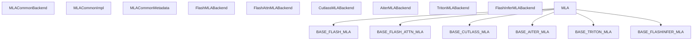
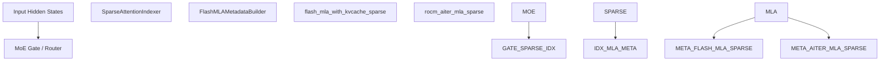

# MLA and Specialized Attention

Relevant source files

-   [cmake/external\_projects/flashmla.cmake](https://github.com/vllm-project/vllm/blob/7cc302dd/cmake/external_projects/flashmla.cmake)
-   [csrc/mamba/mamba\_ssm/selective\_scan.h](https://github.com/vllm-project/vllm/blob/7cc302dd/csrc/mamba/mamba_ssm/selective_scan.h)
-   [csrc/mamba/mamba\_ssm/selective\_scan\_fwd.cu](https://github.com/vllm-project/vllm/blob/7cc302dd/csrc/mamba/mamba_ssm/selective_scan_fwd.cu)
-   [docs/design/attention\_backends.md](https://github.com/vllm-project/vllm/blob/7cc302dd/docs/design/attention_backends.md?plain=1)
-   [tests/kernels/attention/test\_attention\_selector.py](https://github.com/vllm-project/vllm/blob/7cc302dd/tests/kernels/attention/test_attention_selector.py)
-   [tests/kernels/attention/test\_flashmla.py](https://github.com/vllm-project/vllm/blob/7cc302dd/tests/kernels/attention/test_flashmla.py)
-   [tests/kernels/attention/test\_flashmla\_sparse.py](https://github.com/vllm-project/vllm/blob/7cc302dd/tests/kernels/attention/test_flashmla_sparse.py)
-   [tests/kernels/attention/test\_rocm\_attention\_selector.py](https://github.com/vllm-project/vllm/blob/7cc302dd/tests/kernels/attention/test_rocm_attention_selector.py)
-   [tests/kernels/test\_flex\_attention.py](https://github.com/vllm-project/vllm/blob/7cc302dd/tests/kernels/test_flex_attention.py)
-   [tests/models/language/generation/test\_hybrid.py](https://github.com/vllm-project/vllm/blob/7cc302dd/tests/models/language/generation/test_hybrid.py)
-   [tests/test\_attention\_backend\_registry.py](https://github.com/vllm-project/vllm/blob/7cc302dd/tests/test_attention_backend_registry.py)
-   [tests/v1/attention/test\_attention\_backends.py](https://github.com/vllm-project/vllm/blob/7cc302dd/tests/v1/attention/test_attention_backends.py)
-   [tests/v1/attention/test\_mla\_backends.py](https://github.com/vllm-project/vllm/blob/7cc302dd/tests/v1/attention/test_mla_backends.py)
-   [tests/v1/attention/test\_rocm\_attention\_backends\_selection.py](https://github.com/vllm-project/vllm/blob/7cc302dd/tests/v1/attention/test_rocm_attention_backends_selection.py)
-   [tests/v1/attention/test\_sparse\_mla\_backends.py](https://github.com/vllm-project/vllm/blob/7cc302dd/tests/v1/attention/test_sparse_mla_backends.py)
-   [tests/v1/attention/utils.py](https://github.com/vllm-project/vllm/blob/7cc302dd/tests/v1/attention/utils.py)
-   [tests/v1/spec\_decode/test\_tree\_attention.py](https://github.com/vllm-project/vllm/blob/7cc302dd/tests/v1/spec_decode/test_tree_attention.py)
-   [tools/pre\_commit/generate\_attention\_backend\_docs.py](https://github.com/vllm-project/vllm/blob/7cc302dd/tools/pre_commit/generate_attention_backend_docs.py)
-   [vllm/model\_executor/layers/mamba/abstract.py](https://github.com/vllm-project/vllm/blob/7cc302dd/vllm/model_executor/layers/mamba/abstract.py)
-   [vllm/model\_executor/layers/mamba/mamba\_mixer.py](https://github.com/vllm-project/vllm/blob/7cc302dd/vllm/model_executor/layers/mamba/mamba_mixer.py)
-   [vllm/model\_executor/layers/mamba/mamba\_mixer2.py](https://github.com/vllm-project/vllm/blob/7cc302dd/vllm/model_executor/layers/mamba/mamba_mixer2.py)
-   [vllm/model\_executor/layers/mamba/mamba\_utils.py](https://github.com/vllm-project/vllm/blob/7cc302dd/vllm/model_executor/layers/mamba/mamba_utils.py)
-   [vllm/model\_executor/layers/mamba/ops/causal\_conv1d.py](https://github.com/vllm-project/vllm/blob/7cc302dd/vllm/model_executor/layers/mamba/ops/causal_conv1d.py)
-   [vllm/model\_executor/layers/mamba/short\_conv.py](https://github.com/vllm-project/vllm/blob/7cc302dd/vllm/model_executor/layers/mamba/short_conv.py)
-   [vllm/model\_executor/models/bamba.py](https://github.com/vllm-project/vllm/blob/7cc302dd/vllm/model_executor/models/bamba.py)
-   [vllm/model\_executor/models/falcon\_h1.py](https://github.com/vllm-project/vllm/blob/7cc302dd/vllm/model_executor/models/falcon_h1.py)
-   [vllm/model\_executor/models/granitemoehybrid.py](https://github.com/vllm-project/vllm/blob/7cc302dd/vllm/model_executor/models/granitemoehybrid.py)
-   [vllm/model\_executor/models/lfm2.py](https://github.com/vllm-project/vllm/blob/7cc302dd/vllm/model_executor/models/lfm2.py)
-   [vllm/model\_executor/models/lfm2\_moe.py](https://github.com/vllm-project/vllm/blob/7cc302dd/vllm/model_executor/models/lfm2_moe.py)
-   [vllm/model\_executor/models/lfm2\_vl.py](https://github.com/vllm-project/vllm/blob/7cc302dd/vllm/model_executor/models/lfm2_vl.py)
-   [vllm/model\_executor/models/longcat\_flash.py](https://github.com/vllm-project/vllm/blob/7cc302dd/vllm/model_executor/models/longcat_flash.py)
-   [vllm/model\_executor/models/mamba2.py](https://github.com/vllm-project/vllm/blob/7cc302dd/vllm/model_executor/models/mamba2.py)
-   [vllm/model\_executor/models/nemotron\_h.py](https://github.com/vllm-project/vllm/blob/7cc302dd/vllm/model_executor/models/nemotron_h.py)
-   [vllm/model\_executor/models/openpangu.py](https://github.com/vllm-project/vllm/blob/7cc302dd/vllm/model_executor/models/openpangu.py)
-   [vllm/model\_executor/models/plamo2.py](https://github.com/vllm-project/vllm/blob/7cc302dd/vllm/model_executor/models/plamo2.py)
-   [vllm/model\_executor/models/plamo3.py](https://github.com/vllm-project/vllm/blob/7cc302dd/vllm/model_executor/models/plamo3.py)
-   [vllm/model\_executor/models/zamba2.py](https://github.com/vllm-project/vllm/blob/7cc302dd/vllm/model_executor/models/zamba2.py)
-   [vllm/transformers\_utils/configs/nemotron\_h.py](https://github.com/vllm-project/vllm/blob/7cc302dd/vllm/transformers_utils/configs/nemotron_h.py)
-   [vllm/v1/attention/backends/flash\_attn.py](https://github.com/vllm-project/vllm/blob/7cc302dd/vllm/v1/attention/backends/flash_attn.py)
-   [vllm/v1/attention/backends/flashinfer.py](https://github.com/vllm-project/vllm/blob/7cc302dd/vllm/v1/attention/backends/flashinfer.py)
-   [vllm/v1/attention/backends/flex\_attention.py](https://github.com/vllm-project/vllm/blob/7cc302dd/vllm/v1/attention/backends/flex_attention.py)
-   [vllm/v1/attention/backends/gdn\_attn.py](https://github.com/vllm-project/vllm/blob/7cc302dd/vllm/v1/attention/backends/gdn_attn.py)
-   [vllm/v1/attention/backends/linear\_attn.py](https://github.com/vllm-project/vllm/blob/7cc302dd/vllm/v1/attention/backends/linear_attn.py)
-   [vllm/v1/attention/backends/mamba1\_attn.py](https://github.com/vllm-project/vllm/blob/7cc302dd/vllm/v1/attention/backends/mamba1_attn.py)
-   [vllm/v1/attention/backends/mamba2\_attn.py](https://github.com/vllm-project/vllm/blob/7cc302dd/vllm/v1/attention/backends/mamba2_attn.py)
-   [vllm/v1/attention/backends/mamba\_attn.py](https://github.com/vllm-project/vllm/blob/7cc302dd/vllm/v1/attention/backends/mamba_attn.py)
-   [vllm/v1/attention/backends/mla/aiter\_triton\_mla.py](https://github.com/vllm-project/vllm/blob/7cc302dd/vllm/v1/attention/backends/mla/aiter_triton_mla.py)
-   [vllm/v1/attention/backends/mla/cutlass\_mla.py](https://github.com/vllm-project/vllm/blob/7cc302dd/vllm/v1/attention/backends/mla/cutlass_mla.py)
-   [vllm/v1/attention/backends/mla/flashattn\_mla.py](https://github.com/vllm-project/vllm/blob/7cc302dd/vllm/v1/attention/backends/mla/flashattn_mla.py)
-   [vllm/v1/attention/backends/mla/flashinfer\_mla.py](https://github.com/vllm-project/vllm/blob/7cc302dd/vllm/v1/attention/backends/mla/flashinfer_mla.py)
-   [vllm/v1/attention/backends/mla/flashinfer\_mla\_sparse.py](https://github.com/vllm-project/vllm/blob/7cc302dd/vllm/v1/attention/backends/mla/flashinfer_mla_sparse.py)
-   [vllm/v1/attention/backends/mla/flashmla.py](https://github.com/vllm-project/vllm/blob/7cc302dd/vllm/v1/attention/backends/mla/flashmla.py)
-   [vllm/v1/attention/backends/mla/flashmla\_sparse.py](https://github.com/vllm-project/vllm/blob/7cc302dd/vllm/v1/attention/backends/mla/flashmla_sparse.py)
-   [vllm/v1/attention/backends/mla/rocm\_aiter\_mla.py](https://github.com/vllm-project/vllm/blob/7cc302dd/vllm/v1/attention/backends/mla/rocm_aiter_mla.py)
-   [vllm/v1/attention/backends/mla/rocm\_aiter\_mla\_sparse.py](https://github.com/vllm-project/vllm/blob/7cc302dd/vllm/v1/attention/backends/mla/rocm_aiter_mla_sparse.py)
-   [vllm/v1/attention/backends/mla/triton\_mla.py](https://github.com/vllm-project/vllm/blob/7cc302dd/vllm/v1/attention/backends/mla/triton_mla.py)
-   [vllm/v1/attention/backends/rocm\_aiter\_fa.py](https://github.com/vllm-project/vllm/blob/7cc302dd/vllm/v1/attention/backends/rocm_aiter_fa.py)
-   [vllm/v1/attention/backends/rocm\_aiter\_unified\_attn.py](https://github.com/vllm-project/vllm/blob/7cc302dd/vllm/v1/attention/backends/rocm_aiter_unified_attn.py)
-   [vllm/v1/attention/backends/rocm\_attn.py](https://github.com/vllm-project/vllm/blob/7cc302dd/vllm/v1/attention/backends/rocm_attn.py)
-   [vllm/v1/attention/backends/short\_conv\_attn.py](https://github.com/vllm-project/vllm/blob/7cc302dd/vllm/v1/attention/backends/short_conv_attn.py)
-   [vllm/v1/attention/backends/triton\_attn.py](https://github.com/vllm-project/vllm/blob/7cc302dd/vllm/v1/attention/backends/triton_attn.py)
-   [vllm/v1/attention/backends/utils.py](https://github.com/vllm-project/vllm/blob/7cc302dd/vllm/v1/attention/backends/utils.py)
-   [vllm/v1/attention/ops/chunked\_prefill\_paged\_decode.py](https://github.com/vllm-project/vllm/blob/7cc302dd/vllm/v1/attention/ops/chunked_prefill_paged_decode.py)

## Purpose and Scope

This page documents the Multi-head Latent Attention (MLA) backends, specialized attention implementations for hybrid models (Mamba/SSM), and sparse attention mechanisms in vLLM. MLA is a core architectural feature of the DeepSeek-V2 and DeepSeek-V3 models, designed to significantly reduce KV cache memory footprints through latent space compression. This page covers the architecture of MLA backends, the unique KV cache formats used, and the integration of specialized attention for hybrid architectures.

**Sources:** [vllm/v1/attention/backends/mla/flashmla.py1-45](https://github.com/vllm-project/vllm/blob/7cc302dd/vllm/v1/attention/backends/mla/flashmla.py#L1-L45) [vllm/v1/attention/backends/mla/rocm\_aiter\_mla.py1-28](https://github.com/vllm-project/vllm/blob/7cc302dd/vllm/v1/attention/backends/mla/rocm_aiter_mla.py#L1-L28)

## Multi-head Latent Attention (MLA) Architecture

MLA compresses Key and Value vectors into a lower-dimensional latent representation. vLLM implements several backends to handle this specialized computation across different hardware.

### Natural Language to Code Entity Space: MLA Backend Hierarchy

This diagram maps the logical components of MLA to the specific classes and files implementing them.

**Sources:** [vllm/v1/attention/backends/mla/flashmla.py46-71](https://github.com/vllm-project/vllm/blob/7cc302dd/vllm/v1/attention/backends/mla/flashmla.py#L46-L71) [vllm/v1/attention/backends/mla/rocm\_aiter\_mla.py30-60](https://github.com/vllm-project/vllm/blob/7cc302dd/vllm/v1/attention/backends/mla/rocm_aiter_mla.py#L30-L60) [tests/kernels/attention/test\_attention\_selector.py41-51](https://github.com/vllm-project/vllm/blob/7cc302dd/tests/kernels/attention/test_attention_selector.py#L41-L51)

### Backend Implementations

-   **FlashMLA (NVIDIA)**: Optimized for Hopper (SM90) and Blackwell (SM100). It requires a kernel block size of 64 and supports FP8 quantized KV caches. It uses `get_mla_metadata` to prepare tile scheduling. [vllm/v1/attention/backends/mla/flashmla.py56-75](https://github.com/vllm-project/vllm/blob/7cc302dd/vllm/v1/attention/backends/mla/flashmla.py#L56-L75) [vllm/v1/attention/backends/mla/flashmla.py163-168](https://github.com/vllm-project/vllm/blob/7cc302dd/vllm/v1/attention/backends/mla/flashmla.py#L163-L168)
-   **ROCM Aiter MLA**: Designed for AMD hardware using `rocm_aiter_ops`. It uses a block size of 1 and manages a persistent `paged_kv_indices` buffer to avoid data-dependent indexing overhead during CUDA graph capture. [vllm/v1/attention/backends/mla/rocm\_aiter\_mla.py41-55](https://github.com/vllm-project/vllm/blob/7cc302dd/vllm/v1/attention/backends/mla/rocm_aiter_mla.py#L41-L55) [vllm/v1/attention/backends/mla/rocm\_aiter\_mla.py126-129](https://github.com/vllm-project/vllm/blob/7cc302dd/vllm/v1/attention/backends/mla/rocm_aiter_mla.py#L126-L129)
-   **Triton MLA**: A fallback implementation written in Triton, providing platform-agnostic support for MLA operations. [tests/kernels/attention/test\_attention\_selector.py43-49](https://github.com/vllm-project/vllm/blob/7cc302dd/tests/kernels/attention/test_attention_selector.py#L43-L49)

**Sources:** [vllm/v1/attention/backends/mla/flashmla.py46-71](https://github.com/vllm-project/vllm/blob/7cc302dd/vllm/v1/attention/backends/mla/flashmla.py#L46-L71) [vllm/v1/attention/backends/mla/rocm\_aiter\_mla.py108-112](https://github.com/vllm-project/vllm/blob/7cc302dd/vllm/v1/attention/backends/mla/rocm_aiter_mla.py#L108-L112)

## Hybrid Model and Specialized Attention

vLLM supports hybrid models that combine standard attention with State Space Models (SSM) like Mamba. These models require specialized handling for their internal states and attention mechanisms.

### Mamba and Hybrid Architecture

Hybrid models (e.g., Jamba, Zamba2, Nemotron-H) alternate between Attention layers and Mamba layers. vLLM manages the "Inner State" of these models, which persists across decoding steps.

-   **MambaMixer2**: Implements the core Mamba-2 logic, including causal convolutions and Selective State Space (SSD) combined scans. [vllm/model\_executor/layers/mamba/mamba\_mixer2.py49-55](https://github.com/vllm-project/vllm/blob/7cc302dd/vllm/model_executor/layers/mamba/mamba_mixer2.py#L49-L55) [vllm/model\_executor/layers/mamba/mamba\_mixer2.py34-36](https://github.com/vllm-project/vllm/blob/7cc302dd/vllm/model_executor/layers/mamba/mamba_mixer2.py#L34-L36)
-   **Hybrid State Management**: Models like `NemotronH` implement `IsHybrid` and `HasInnerState` interfaces. They use `MambaStateShapeCalculator` to determine the memory requirements for SSM states in the KV cache pool. [vllm/model\_executor/models/nemotron\_h.py65-73](https://github.com/vllm-project/vllm/blob/7cc302dd/vllm/model_executor/models/nemotron_h.py#L65-L73) [vllm/model\_executor/models/nemotron\_h.py49-55](https://github.com/vllm-project/vllm/blob/7cc302dd/vllm/model_executor/models/nemotron_h.py#L49-L55)

**Sources:** [vllm/model\_executor/models/nemotron\_h.py49-55](https://github.com/vllm-project/vllm/blob/7cc302dd/vllm/model_executor/models/nemotron_h.py#L49-L55) [vllm/model\_executor/layers/mamba/mamba\_mixer2.py23-36](https://github.com/vllm-project/vllm/blob/7cc302dd/vllm/model_executor/layers/mamba/mamba_mixer2.py#L23-L36) [tests/models/language/generation/test\_hybrid.py35-44](https://github.com/vllm-project/vllm/blob/7cc302dd/tests/models/language/generation/test_hybrid.py#L35-L44)

### FlexAttention

vLLM integrates `torch.nn.attention.flex_attention` to provide a highly flexible attention backend capable of handling complex masking requirements, such as those found in document-level attention or models with specific prefix patterns.

-   **Block Masking**: Uses `create_block_mask` to optimize attention by skipping zeroed-out blocks in the attention matrix. [vllm/v1/attention/backends/flex\_attention.py14-22](https://github.com/vllm-project/vllm/blob/7cc302dd/vllm/v1/attention/backends/flex_attention.py#L14-L22)
-   **Physical-to-Logical Mapping**: Implements `physical_to_logical_mapping` to translate the Paged KV Cache block table into a format compatible with FlexAttention's indexing, ensuring that only valid logical blocks are accessed even when physical blocks are reused (e.g., in sliding window attention). [vllm/v1/attention/backends/flex\_attention.py132-163](https://github.com/vllm-project/vllm/blob/7cc302dd/vllm/v1/attention/backends/flex_attention.py#L132-L163)

**Sources:** [vllm/v1/attention/backends/flex\_attention.py75-106](https://github.com/vllm-project/vllm/blob/7cc302dd/vllm/v1/attention/backends/flex_attention.py#L75-L106) [vllm/v1/attention/backends/flex\_attention.py132-198](https://github.com/vllm-project/vllm/blob/7cc302dd/vllm/v1/attention/backends/flex_attention.py#L132-L198)

## Sparse Attention Implementations

Sparse attention is utilized in models to reduce computation by only attending to a subset of tokens or using Mixture-of-Experts (MoE) routing.

### Data Flow: Sparse MLA and MoE

This diagram bridges the routing logic to the specialized attention kernels.

**Sources:** [vllm/v1/attention/backends/mla/flashmla.py88-91](https://github.com/vllm-project/vllm/blob/7cc302dd/vllm/v1/attention/backends/mla/flashmla.py#L88-L91) [vllm/v1/attention/backends/mla/rocm\_aiter\_mla.py149-156](https://github.com/vllm-project/vllm/blob/7cc302dd/vllm/v1/attention/backends/mla/rocm_aiter_mla.py#L149-L156)

### Specialized Kernels

-   **FlashMLA Sparse**: Optimized for sparse MLA on NVIDIA GPUs. It validates compatibility via `is_flashmla_sparse_supported`. [vllm/v1/attention/backends/mla/flashmla.py88-91](https://github.com/vllm-project/vllm/blob/7cc302dd/vllm/v1/attention/backends/mla/flashmla.py#L88-L91)
-   **ROCm Aiter Unified Attention**: A ROCm-specific backend that unifies various attention types into a single optimized path for AMD hardware. [vllm/v1/attention/backends/rocm\_aiter\_fa.py150-164](https://github.com/vllm-project/vllm/blob/7cc302dd/vllm/v1/attention/backends/rocm_aiter_fa.py#L150-L164)
-   **Triton Unified Attention**: Uses `unified_attention` in `vllm/v1/attention/backends/triton_attn.py` to handle both prefill and decode phases with a consistent Triton-based kernel. [vllm/v1/attention/backends/triton\_attn.py31-35](https://github.com/vllm-project/vllm/blob/7cc302dd/vllm/v1/attention/backends/triton_attn.py#L31-L35)

**Sources:** [vllm/v1/attention/backends/mla/flashmla.py88-95](https://github.com/vllm-project/vllm/blob/7cc302dd/vllm/v1/attention/backends/mla/flashmla.py#L88-L95) [vllm/v1/attention/backends/triton\_attn.py117-154](https://github.com/vllm-project/vllm/blob/7cc302dd/vllm/v1/attention/backends/triton_attn.py#L117-L154) [vllm/v1/attention/backends/rocm\_aiter\_fa.py1-32](https://github.com/vllm-project/vllm/blob/7cc302dd/vllm/v1/attention/backends/rocm_aiter_fa.py#L1-L32)

## Backend Selection Summary

The `get_attn_backend` function selects the optimal backend based on the model's architecture (MLA vs. Regular), hardware capability, and block size.

| Platform | Attention Type | Preferred Backend | Condition |
| --- | --- | --- | --- |
| **CUDA** | MLA | `FLASHMLA` | Block Size 64, SM90+ |
| **CUDA** | MLA | `CUTLASS_MLA` | Block Size 128, SM100 |
| **CUDA** | Regular | `FLASH_ATTN` | Default for Ampere+ |
| **ROCm** | MLA | `ROCM_AITER_MLA` | Block Size 1 |
| **ROCm** | MLA | `TRITON_MLA` | Block Size != 1 |
| **ROCm** | Regular | `ROCM_ATTN` | Default for CDNA |

**Sources:** [tests/kernels/attention/test\_attention\_selector.py141-181](https://github.com/vllm-project/vllm/blob/7cc302dd/tests/kernels/attention/test_attention_selector.py#L141-L181) [vllm/v1/attention/backends/flash\_attn.py71-95](https://github.com/vllm-project/vllm/blob/7cc302dd/vllm/v1/attention/backends/flash_attn.py#L71-L95) [vllm/v1/attention/backends/flashinfer.py11-19](https://github.com/vllm-project/vllm/blob/7cc302dd/vllm/v1/attention/backends/flashinfer.py#L11-L19)
