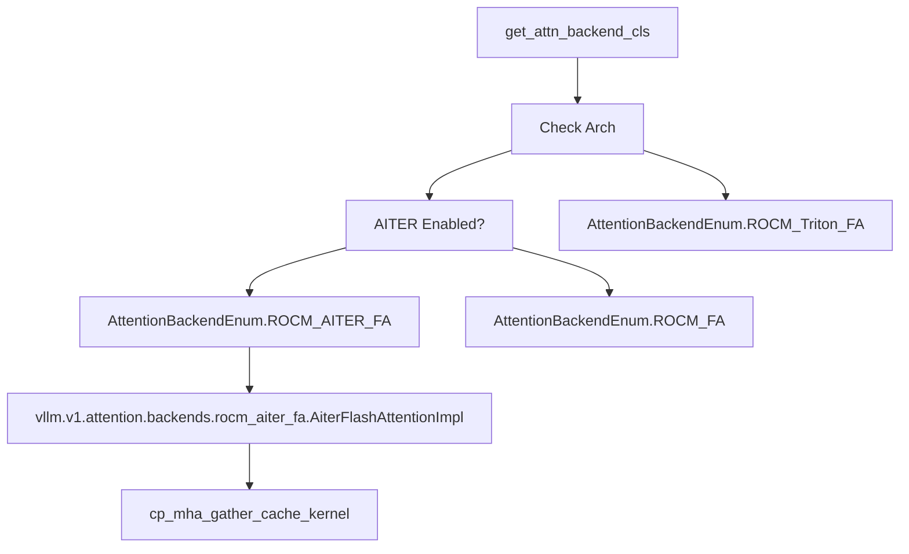

# ROCm and Platform-Specific Attention

Relevant source files

-   [cmake/external\_projects/flashmla.cmake](https://github.com/vllm-project/vllm/blob/7cc302dd/cmake/external_projects/flashmla.cmake)
-   [csrc/cpu/cpu\_attn.cpp](https://github.com/vllm-project/vllm/blob/7cc302dd/csrc/cpu/cpu_attn.cpp)
-   [csrc/cpu/cpu\_attn\_amx.hpp](https://github.com/vllm-project/vllm/blob/7cc302dd/csrc/cpu/cpu_attn_amx.hpp)
-   [csrc/cpu/cpu\_attn\_impl.hpp](https://github.com/vllm-project/vllm/blob/7cc302dd/csrc/cpu/cpu_attn_impl.hpp)
-   [csrc/cpu/cpu\_attn\_neon.hpp](https://github.com/vllm-project/vllm/blob/7cc302dd/csrc/cpu/cpu_attn_neon.hpp)
-   [csrc/cpu/cpu\_attn\_neon\_bfmmla.hpp](https://github.com/vllm-project/vllm/blob/7cc302dd/csrc/cpu/cpu_attn_neon_bfmmla.hpp)
-   [csrc/cpu/cpu\_attn\_vec.hpp](https://github.com/vllm-project/vllm/blob/7cc302dd/csrc/cpu/cpu_attn_vec.hpp)
-   [csrc/cpu/cpu\_attn\_vec16.hpp](https://github.com/vllm-project/vllm/blob/7cc302dd/csrc/cpu/cpu_attn_vec16.hpp)
-   [csrc/cpu/cpu\_attn\_vxe.hpp](https://github.com/vllm-project/vllm/blob/7cc302dd/csrc/cpu/cpu_attn_vxe.hpp)
-   [csrc/cpu/cpu\_types\_arm.hpp](https://github.com/vllm-project/vllm/blob/7cc302dd/csrc/cpu/cpu_types_arm.hpp)
-   [csrc/cpu/cpu\_types\_vxe.hpp](https://github.com/vllm-project/vllm/blob/7cc302dd/csrc/cpu/cpu_types_vxe.hpp)
-   [csrc/cpu/generate\_cpu\_attn\_dispatch.py](https://github.com/vllm-project/vllm/blob/7cc302dd/csrc/cpu/generate_cpu_attn_dispatch.py)
-   [csrc/cpu/micro\_gemm/cpu\_micro\_gemm\_amx.hpp](https://github.com/vllm-project/vllm/blob/7cc302dd/csrc/cpu/micro_gemm/cpu_micro_gemm_amx.hpp)
-   [csrc/cpu/micro\_gemm/cpu\_micro\_gemm\_impl.hpp](https://github.com/vllm-project/vllm/blob/7cc302dd/csrc/cpu/micro_gemm/cpu_micro_gemm_impl.hpp)
-   [csrc/cpu/micro\_gemm/cpu\_micro\_gemm\_vec.hpp](https://github.com/vllm-project/vllm/blob/7cc302dd/csrc/cpu/micro_gemm/cpu_micro_gemm_vec.hpp)
-   [csrc/cpu/mla\_decode.cpp](https://github.com/vllm-project/vllm/blob/7cc302dd/csrc/cpu/mla_decode.cpp)
-   [csrc/cpu/utils.hpp](https://github.com/vllm-project/vllm/blob/7cc302dd/csrc/cpu/utils.hpp)
-   [docs/design/attention\_backends.md](https://github.com/vllm-project/vllm/blob/7cc302dd/docs/design/attention_backends.md?plain=1)
-   [examples/tool\_chat\_template\_phi4\_mini.jinja](https://github.com/vllm-project/vllm/blob/7cc302dd/examples/tool_chat_template_phi4_mini.jinja)
-   [tests/entrypoints/llm/test\_accuracy.py](https://github.com/vllm-project/vllm/blob/7cc302dd/tests/entrypoints/llm/test_accuracy.py)
-   [tests/kernels/attention/test\_attention\_selector.py](https://github.com/vllm-project/vllm/blob/7cc302dd/tests/kernels/attention/test_attention_selector.py)
-   [tests/kernels/attention/test\_flashmla.py](https://github.com/vllm-project/vllm/blob/7cc302dd/tests/kernels/attention/test_flashmla.py)
-   [tests/kernels/attention/test\_flashmla\_sparse.py](https://github.com/vllm-project/vllm/blob/7cc302dd/tests/kernels/attention/test_flashmla_sparse.py)
-   [tests/kernels/attention/test\_rocm\_attention\_selector.py](https://github.com/vllm-project/vllm/blob/7cc302dd/tests/kernels/attention/test_rocm_attention_selector.py)
-   [tests/kernels/test\_flex\_attention.py](https://github.com/vllm-project/vllm/blob/7cc302dd/tests/kernels/test_flex_attention.py)
-   [tests/test\_attention\_backend\_registry.py](https://github.com/vllm-project/vllm/blob/7cc302dd/tests/test_attention_backend_registry.py)
-   [tests/v1/attention/test\_attention\_backends.py](https://github.com/vllm-project/vllm/blob/7cc302dd/tests/v1/attention/test_attention_backends.py)
-   [tests/v1/attention/test\_mla\_backends.py](https://github.com/vllm-project/vllm/blob/7cc302dd/tests/v1/attention/test_mla_backends.py)
-   [tests/v1/attention/test\_rocm\_attention\_backends\_selection.py](https://github.com/vllm-project/vllm/blob/7cc302dd/tests/v1/attention/test_rocm_attention_backends_selection.py)
-   [tests/v1/attention/test\_sparse\_mla\_backends.py](https://github.com/vllm-project/vllm/blob/7cc302dd/tests/v1/attention/test_sparse_mla_backends.py)
-   [tests/v1/attention/utils.py](https://github.com/vllm-project/vllm/blob/7cc302dd/tests/v1/attention/utils.py)
-   [tests/v1/spec\_decode/test\_tree\_attention.py](https://github.com/vllm-project/vllm/blob/7cc302dd/tests/v1/spec_decode/test_tree_attention.py)
-   [tools/pre\_commit/generate\_attention\_backend\_docs.py](https://github.com/vllm-project/vllm/blob/7cc302dd/tools/pre_commit/generate_attention_backend_docs.py)
-   [vllm/\_aiter\_ops.py](https://github.com/vllm-project/vllm/blob/7cc302dd/vllm/_aiter_ops.py)
-   [vllm/model\_executor/layers/quantization/quark/schemes/quark\_ocp\_mx.py](https://github.com/vllm-project/vllm/blob/7cc302dd/vllm/model_executor/layers/quantization/quark/schemes/quark_ocp_mx.py)
-   [vllm/platforms/cpu.py](https://github.com/vllm-project/vllm/blob/7cc302dd/vllm/platforms/cpu.py)
-   [vllm/platforms/cuda.py](https://github.com/vllm-project/vllm/blob/7cc302dd/vllm/platforms/cuda.py)
-   [vllm/platforms/interface.py](https://github.com/vllm-project/vllm/blob/7cc302dd/vllm/platforms/interface.py)
-   [vllm/platforms/rocm.py](https://github.com/vllm-project/vllm/blob/7cc302dd/vllm/platforms/rocm.py)
-   [vllm/platforms/tpu.py](https://github.com/vllm-project/vllm/blob/7cc302dd/vllm/platforms/tpu.py)
-   [vllm/platforms/xpu.py](https://github.com/vllm-project/vllm/blob/7cc302dd/vllm/platforms/xpu.py)
-   [vllm/v1/attention/backends/cpu\_attn.py](https://github.com/vllm-project/vllm/blob/7cc302dd/vllm/v1/attention/backends/cpu_attn.py)
-   [vllm/v1/attention/backends/flash\_attn.py](https://github.com/vllm-project/vllm/blob/7cc302dd/vllm/v1/attention/backends/flash_attn.py)
-   [vllm/v1/attention/backends/flashinfer.py](https://github.com/vllm-project/vllm/blob/7cc302dd/vllm/v1/attention/backends/flashinfer.py)
-   [vllm/v1/attention/backends/flex\_attention.py](https://github.com/vllm-project/vllm/blob/7cc302dd/vllm/v1/attention/backends/flex_attention.py)
-   [vllm/v1/attention/backends/mla/aiter\_triton\_mla.py](https://github.com/vllm-project/vllm/blob/7cc302dd/vllm/v1/attention/backends/mla/aiter_triton_mla.py)
-   [vllm/v1/attention/backends/mla/cutlass\_mla.py](https://github.com/vllm-project/vllm/blob/7cc302dd/vllm/v1/attention/backends/mla/cutlass_mla.py)
-   [vllm/v1/attention/backends/mla/flashattn\_mla.py](https://github.com/vllm-project/vllm/blob/7cc302dd/vllm/v1/attention/backends/mla/flashattn_mla.py)
-   [vllm/v1/attention/backends/mla/flashinfer\_mla.py](https://github.com/vllm-project/vllm/blob/7cc302dd/vllm/v1/attention/backends/mla/flashinfer_mla.py)
-   [vllm/v1/attention/backends/mla/flashinfer\_mla\_sparse.py](https://github.com/vllm-project/vllm/blob/7cc302dd/vllm/v1/attention/backends/mla/flashinfer_mla_sparse.py)
-   [vllm/v1/attention/backends/mla/flashmla.py](https://github.com/vllm-project/vllm/blob/7cc302dd/vllm/v1/attention/backends/mla/flashmla.py)
-   [vllm/v1/attention/backends/mla/flashmla\_sparse.py](https://github.com/vllm-project/vllm/blob/7cc302dd/vllm/v1/attention/backends/mla/flashmla_sparse.py)
-   [vllm/v1/attention/backends/mla/rocm\_aiter\_mla.py](https://github.com/vllm-project/vllm/blob/7cc302dd/vllm/v1/attention/backends/mla/rocm_aiter_mla.py)
-   [vllm/v1/attention/backends/mla/rocm\_aiter\_mla\_sparse.py](https://github.com/vllm-project/vllm/blob/7cc302dd/vllm/v1/attention/backends/mla/rocm_aiter_mla_sparse.py)
-   [vllm/v1/attention/backends/mla/triton\_mla.py](https://github.com/vllm-project/vllm/blob/7cc302dd/vllm/v1/attention/backends/mla/triton_mla.py)
-   [vllm/v1/attention/backends/rocm\_aiter\_fa.py](https://github.com/vllm-project/vllm/blob/7cc302dd/vllm/v1/attention/backends/rocm_aiter_fa.py)
-   [vllm/v1/attention/backends/rocm\_aiter\_unified\_attn.py](https://github.com/vllm-project/vllm/blob/7cc302dd/vllm/v1/attention/backends/rocm_aiter_unified_attn.py)
-   [vllm/v1/attention/backends/rocm\_attn.py](https://github.com/vllm-project/vllm/blob/7cc302dd/vllm/v1/attention/backends/rocm_attn.py)
-   [vllm/v1/attention/backends/triton\_attn.py](https://github.com/vllm-project/vllm/blob/7cc302dd/vllm/v1/attention/backends/triton_attn.py)
-   [vllm/v1/attention/backends/utils.py](https://github.com/vllm-project/vllm/blob/7cc302dd/vllm/v1/attention/backends/utils.py)
-   [vllm/v1/attention/ops/chunked\_prefill\_paged\_decode.py](https://github.com/vllm-project/vllm/blob/7cc302dd/vllm/v1/attention/ops/chunked_prefill_paged_decode.py)

## Purpose and Scope

This page documents ROCm-specific attention backends, AITER (AMD Instinct Triton Enhanced Runtime) optimizations, and platform-specific selection logic. ROCm (AMD's GPU platform) utilizes distinct attention implementations compared to CUDA, including AITER backends optimized for MI300/MI325 (GFX942/GFX950) architectures, custom paged attention kernels, and specialized GEMM operations for "skinny" matrices. The page also covers how vLLM detects ROCm hardware capabilities and selects appropriate attention backends based on GPU generation, model parameters, and environment configuration.

For general attention backend architecture, see [Backend Selection and Architecture](/vllm-project/vllm/8.1-attention-backend-selection). For FlashAttention and FlashInfer backends (primarily CUDA), see [FlashAttention and FlashInfer](/vllm-project/vllm/8.2-flashattention-and-flashinfer). For ROCm quantization support, see [FP8 and Low-Precision Quantization](/vllm-project/vllm/7.2-fp8-and-low-precision-quantization).

## ROCm Platform Detection and GCN Architecture

### GCN Architecture Detection

ROCm platform detection identifies the GPU's GCN (Graphics Core Next) architecture string to determine available backends and optimizations. vLLM differentiates between GFX9 (CDNA family) and GFX1X (RDNA family). The `ROCmPlatform` class handles device capability queries and configuration updates [vllm/platforms/rocm.py228-251](https://github.com/vllm-project/vllm/blob/7cc302dd/vllm/platforms/rocm.py#L228-L251)

**Key Architecture Identifiers**:

-   **GFX9**: Includes `gfx90a` (MI200), `gfx942` (MI300), and `gfx950` [vllm/platforms/rocm.py148-153](https://github.com/vllm-project/vllm/blob/7cc302dd/vllm/platforms/rocm.py#L148-L153)
-   **GFX950**: Specifically targeted for "Skinny GEMM" optimizations like `wvSplitKrc` [vllm/platforms/rocm.py152](https://github.com/vllm-project/vllm/blob/7cc302dd/vllm/platforms/rocm.py#L152-L152)
-   **GFX1X**: Includes `gfx11xx` and `gfx12xx` (RDNA series) [vllm/platforms/rocm.py148](https://github.com/vllm-project/vllm/blob/7cc302dd/vllm/platforms/rocm.py#L148-L148)

The platform identifies specific hardware via `_ROCM_DEVICE_ID_NAME_MAP`, covering MI300A/X, MI308X, MI325X, and Radeon RX7900XTX [vllm/platforms/rocm.py57-67](https://github.com/vllm-project/vllm/blob/7cc302dd/vllm/platforms/rocm.py#L57-L67)

**Sources**: [vllm/platforms/rocm.py57-153](https://github.com/vllm-project/vllm/blob/7cc302dd/vllm/platforms/rocm.py#L57-L153) [vllm/platforms/rocm.py228-251](https://github.com/vllm-project/vllm/blob/7cc302dd/vllm/platforms/rocm.py#L228-L251)

## AITER Backend and Operations

AITER provides optimized Triton and Assembly kernels for ROCm. It is primarily supported on MI3XX (GFX942/GFX950) architectures [vllm/\_aiter\_ops.py52-56](https://github.com/vllm-project/vllm/blob/7cc302dd/vllm/_aiter_ops.py#L52-L56)

### AITER Capability Check

The system determines if AITER can be used via `is_aiter_found_and_supported()`, which verifies the library existence and ROCm MI3XX platform [vllm/\_aiter\_ops.py36-56](https://github.com/vllm-project/vllm/blob/7cc302dd/vllm/_aiter_ops.py#L36-L56)

### AITER Optimized Operations

AITER provides specialized kernels for several bottlenecks in LLM execution:

| Operation | Implementation Function | Description |
| --- | --- | --- |
| **Fused MoE** | `_rocm_aiter_fused_moe_impl` | Fused Mixture-of-Experts kernel with support for various quantization and activation methods [vllm/\_aiter\_ops.py74-121](https://github.com/vllm-project/vllm/blob/7cc302dd/vllm/_aiter_ops.py#L74-L121) |
| **ASM MoE** | `_rocm_aiter_asm_moe_tkw1_impl` | Assembly-optimized MoE kernel for BF16 [vllm/\_aiter\_ops.py150-184](https://github.com/vllm-project/vllm/blob/7cc302dd/vllm/_aiter_ops.py#L150-L184) |
| **TopK Softmax** | `_rocm_aiter_topk_softmax_impl` | Optimized TopK and Softmax fusion for gating [vllm/\_aiter\_ops.py205-216](https://github.com/vllm-project/vllm/blob/7cc302dd/vllm/_aiter_ops.py#L205-L216) |
| **Sparse MLA** | `rocm_aiter_sparse_attn_indexer` | Indexer for Sparse Multi-Latent Attention [vllm/\_aiter\_ops.py12-15](https://github.com/vllm-project/vllm/blob/7cc302dd/vllm/_aiter_ops.py#L12-L15) |
| **Unified Attention** | `UnifiedAttentionImpl` | AITER-based unified attention implementation for ROCm [vllm/v1/attention/backends/rocm\_aiter\_unified\_attn.py12-15](https://github.com/vllm-project/vllm/blob/7cc302dd/vllm/v1/attention/backends/rocm_aiter_unified_attn.py#L12-L15) |

**Sources**: [vllm/\_aiter\_ops.py12-216](https://github.com/vllm-project/vllm/blob/7cc302dd/vllm/_aiter_ops.py#L12-L216) [vllm/v1/attention/backends/rocm\_aiter\_unified\_attn.py12-15](https://github.com/vllm-project/vllm/blob/7cc302dd/vllm/v1/attention/backends/rocm_aiter_unified_attn.py#L12-L15)

## Platform-Specific Attention Selection

### ROCm Attention Selection

ROCm uses a prioritized selection logic within `ROCmPlatform.get_attn_backend_cls` [vllm/platforms/rocm.py513-555](https://github.com/vllm-project/vllm/blob/7cc302dd/vllm/platforms/rocm.py#L513-L555)

1.  **AITER FA**: Selected if AITER is enabled and the platform is GFX9 [vllm/platforms/rocm.py532-536](https://github.com/vllm-project/vllm/blob/7cc302dd/vllm/platforms/rocm.py#L532-L536)
2.  **Flash Attention**: Fallback for GFX9 if AITER is disabled [vllm/platforms/rocm.py538-540](https://github.com/vllm-project/vllm/blob/7cc302dd/vllm/platforms/rocm.py#L538-L540)
3.  **Flash Attention Triton**: Specifically for GFX1X (RDNA) architectures [vllm/platforms/rocm.py527-529](https://github.com/vllm-project/vllm/blob/7cc302dd/vllm/platforms/rocm.py#L527-L529)
4.  **Torch SDPA**: Final fallback for specific scenarios.

### CPU Attention

The `CpuPlatform` uses the `CPU_ATTN` backend [vllm/platforms/cpu.py105-118](https://github.com/vllm-project/vllm/blob/7cc302dd/vllm/platforms/cpu.py#L105-L118) It does not support MLA or Sparse Attention [vllm/platforms/cpu.py113-116](https://github.com/vllm-project/vllm/blob/7cc302dd/vllm/platforms/cpu.py#L113-L116) It prefers a block size that is a multiple of 32 for optimization [vllm/platforms/cpu.py168-173](https://github.com/vllm-project/vllm/blob/7cc302dd/vllm/platforms/cpu.py#L168-L173)

### XPU Attention

The `XPUPlatform` defaults to `FLASH_ATTN` but falls back to `TRITON_ATTN` for `float32` [vllm/platforms/xpu.py73-81](https://github.com/vllm-project/vllm/blob/7cc302dd/vllm/platforms/xpu.py#L73-L81) It forces the KV cache layout to `NHD` [vllm/platforms/xpu.py55-61](https://github.com/vllm-project/vllm/blob/7cc302dd/vllm/platforms/xpu.py#L55-L61)

### TPU Attention

The `TpuPlatform` relies on the `tpu_inference` library [vllm/platforms/tpu.py9-15](https://github.com/vllm-project/vllm/blob/7cc302dd/vllm/platforms/tpu.py#L9-L15)

**Sources**: [vllm/platforms/rocm.py513-555](https://github.com/vllm-project/vllm/blob/7cc302dd/vllm/platforms/rocm.py#L513-L555) [vllm/platforms/cpu.py105-173](https://github.com/vllm-project/vllm/blob/7cc302dd/vllm/platforms/cpu.py#L105-L173) [vllm/platforms/xpu.py49-90](https://github.com/vllm-project/vllm/blob/7cc302dd/vllm/platforms/xpu.py#L49-L90) [vllm/platforms/tpu.py9-21](https://github.com/vllm-project/vllm/blob/7cc302dd/vllm/platforms/tpu.py#L9-L21)

## ROCm Attention Implementation Detail

### AITER Flash Attention (V1)

The `AiterFlashAttentionBackend` for ROCm provides a `reshape_and_cache` operation using Triton kernels [vllm/v1/attention/backends/rocm\_aiter\_fa.py47-72](https://github.com/vllm-project/vllm/blob/7cc302dd/vllm/v1/attention/backends/rocm_aiter_fa.py#L47-L72) It supports both `NHD` and `SHUFFLE` KV cache layouts [vllm/v1/attention/backends/rocm\_aiter\_fa.py93-149](https://github.com/vllm-project/vllm/blob/7cc302dd/vllm/v1/attention/backends/rocm_aiter_fa.py#L93-L149)

**Sources**: [vllm/platforms/rocm.py513-555](https://github.com/vllm-project/vllm/blob/7cc302dd/vllm/platforms/rocm.py#L513-L555) [vllm/v1/attention/backends/rocm\_aiter\_fa.py47-149](https://github.com/vllm-project/vllm/blob/7cc302dd/vllm/v1/attention/backends/rocm_aiter_fa.py#L47-L149)

## Data Flow: MoE Execution on ROCm

The following diagram bridges the AITER library entities to the vLLM implementation for Mixture-of-Experts.

> **[Mermaid sequence]**
> *(图表结构无法解析)*

**Key Interaction Points**:

-   **`_rocm_aiter_fused_moe_impl`**: Maps vLLM MoE parameters to AITER's `ActivationType` and `QuantType` [vllm/\_aiter\_ops.py95-121](https://github.com/vllm-project/vllm/blob/7cc302dd/vllm/_aiter_ops.py#L95-L121)
-   **`is_aiter_found_and_supported`**: Gatekeeper function that checks `current_platform.is_rocm()` and `on_mi3xx()` [vllm/\_aiter\_ops.py52-56](https://github.com/vllm-project/vllm/blob/7cc302dd/vllm/_aiter_ops.py#L52-L56)
-   **`ROCmPlatform.import_kernels`**: Triggers registration of `vllm._rocm_C` custom ops [vllm/platforms/rocm.py47-50](https://github.com/vllm-project/vllm/blob/7cc302dd/vllm/platforms/rocm.py#L47-L50)

**Sources**: [vllm/\_aiter\_ops.py36-121](https://github.com/vllm-project/vllm/blob/7cc302dd/vllm/_aiter_ops.py#L36-L121) [vllm/platforms/rocm.py45-56](https://github.com/vllm-project/vllm/blob/7cc302dd/vllm/platforms/rocm.py#L45-L56) [vllm/v1/attention/backends/rocm\_aiter\_fa.py10-15](https://github.com/vllm-project/vllm/blob/7cc302dd/vllm/v1/attention/backends/rocm_aiter_fa.py#L10-L15)

## Platform Attention Selection Priorities

Each platform implements `get_attn_backend_cls` to determine the best backend based on model config (MLA, Sparse) and data types.

| Platform | MLA Support | Sparse Support | Default Backend |
| --- | --- | --- | --- |
| **ROCm** | `ROCM_AITER_MLA` / `TRITON_MLA` | `ROCM_AITER_MLA_SPARSE` | `ROCM_AITER_FA` / `ROCM_FA` [vllm/platforms/rocm.py513-555](https://github.com/vllm-project/vllm/blob/7cc302dd/vllm/platforms/rocm.py#L513-L555) |
| **XPU** | `TRITON_MLA` | `XPU_MLA_SPARSE` | `FLASH_ATTN` [vllm/platforms/xpu.py49-90](https://github.com/vllm-project/vllm/blob/7cc302dd/vllm/platforms/xpu.py#L49-L90) |
| **CPU** | Not Supported | Not Supported | `CPU_ATTN` [vllm/platforms/cpu.py105-118](https://github.com/vllm-project/vllm/blob/7cc302dd/vllm/platforms/cpu.py#L105-L118) |
| **CUDA** | `FLASH_ATTN_MLA` / `FLASHMLA` | `FLASHMLA_SPARSE` | `FLASH_ATTN` / `FLASHINFER` [vllm/platforms/cuda.py51-113](https://github.com/vllm-project/vllm/blob/7cc302dd/vllm/platforms/cuda.py#L51-L113) |

**Sources**: [vllm/platforms/rocm.py513-555](https://github.com/vllm-project/vllm/blob/7cc302dd/vllm/platforms/rocm.py#L513-L555) [vllm/platforms/xpu.py49-90](https://github.com/vllm-project/vllm/blob/7cc302dd/vllm/platforms/xpu.py#L49-L90) [vllm/platforms/cpu.py105-118](https://github.com/vllm-project/vllm/blob/7cc302dd/vllm/platforms/cpu.py#L105-L118) [vllm/platforms/cuda.py51-113](https://github.com/vllm-project/vllm/blob/7cc302dd/vllm/platforms/cuda.py#L51-L113)
