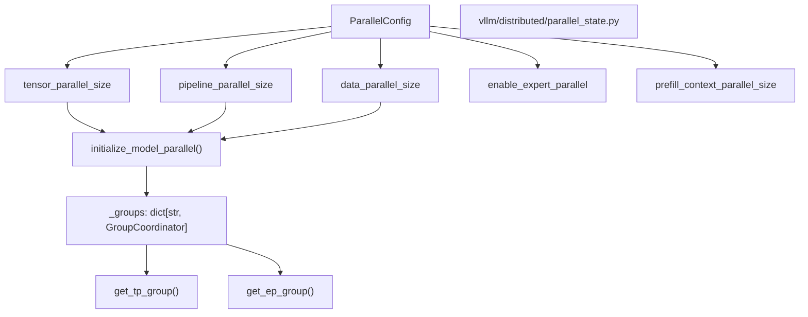
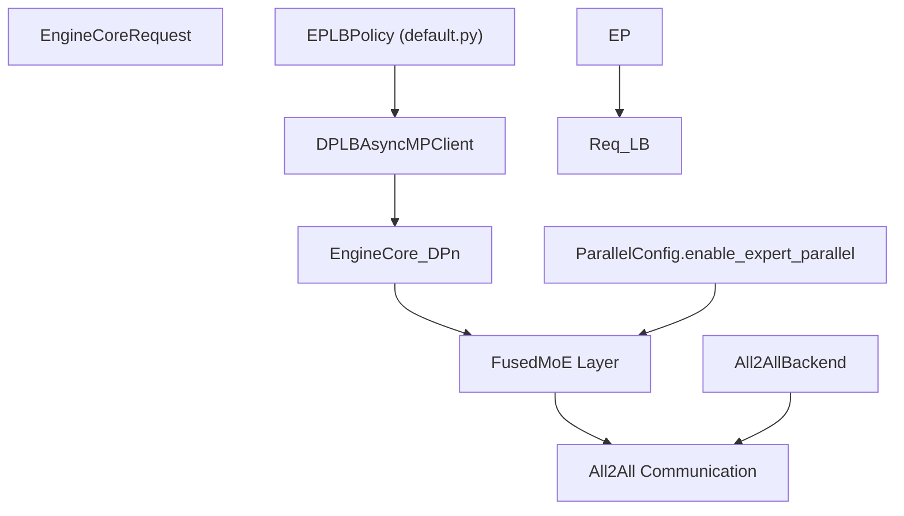

# Parallelism Strategies

Relevant source files

-   [.buildkite/scripts/scheduled\_integration\_test/deepseek\_v2\_lite\_ep\_eplb.sh](https://github.com/vllm-project/vllm/blob/7cc302dd/.buildkite/scripts/scheduled_integration_test/deepseek_v2_lite_ep_eplb.sh)
-   [.buildkite/scripts/scheduled\_integration\_test/qwen3\_next\_mtp\_async\_eplb.sh](https://github.com/vllm-project/vllm/blob/7cc302dd/.buildkite/scripts/scheduled_integration_test/qwen3_next_mtp_async_eplb.sh)
-   [docs/design/moe\_kernel\_features.md](https://github.com/vllm-project/vllm/blob/7cc302dd/docs/design/moe_kernel_features.md?plain=1)
-   [tests/compile/passes/distributed/test\_async\_tp.py](https://github.com/vllm-project/vllm/blob/7cc302dd/tests/compile/passes/distributed/test_async_tp.py)
-   [tests/distributed/eplb\_utils.py](https://github.com/vllm-project/vllm/blob/7cc302dd/tests/distributed/eplb_utils.py)
-   [tests/distributed/test\_eplb\_algo.py](https://github.com/vllm-project/vllm/blob/7cc302dd/tests/distributed/test_eplb_algo.py)
-   [tests/distributed/test\_eplb\_execute.py](https://github.com/vllm-project/vllm/blob/7cc302dd/tests/distributed/test_eplb_execute.py)
-   [tests/distributed/test\_eplb\_fused\_moe\_layer.py](https://github.com/vllm-project/vllm/blob/7cc302dd/tests/distributed/test_eplb_fused_moe_layer.py)
-   [tests/distributed/test\_eplb\_spec\_decode.py](https://github.com/vllm-project/vllm/blob/7cc302dd/tests/distributed/test_eplb_spec_decode.py)
-   [tests/entrypoints/test\_api\_server\_process\_manager.py](https://github.com/vllm-project/vllm/blob/7cc302dd/tests/entrypoints/test_api_server_process_manager.py)
-   [tests/kernels/moe/modular\_kernel\_tools/mk\_objects.py](https://github.com/vllm-project/vllm/blob/7cc302dd/tests/kernels/moe/modular_kernel_tools/mk_objects.py)
-   [tests/v1/engine/test\_engine\_core.py](https://github.com/vllm-project/vllm/blob/7cc302dd/tests/v1/engine/test_engine_core.py)
-   [tests/v1/engine/test\_engine\_core\_client.py](https://github.com/vllm-project/vllm/blob/7cc302dd/tests/v1/engine/test_engine_core_client.py)
-   [vllm/config/parallel.py](https://github.com/vllm-project/vllm/blob/7cc302dd/vllm/config/parallel.py)
-   [vllm/distributed/device\_communicators/all2all.py](https://github.com/vllm-project/vllm/blob/7cc302dd/vllm/distributed/device_communicators/all2all.py)
-   [vllm/distributed/device\_communicators/base\_device\_communicator.py](https://github.com/vllm-project/vllm/blob/7cc302dd/vllm/distributed/device_communicators/base_device_communicator.py)
-   [vllm/distributed/device\_communicators/cuda\_communicator.py](https://github.com/vllm-project/vllm/blob/7cc302dd/vllm/distributed/device_communicators/cuda_communicator.py)
-   [vllm/distributed/device\_communicators/pynccl.py](https://github.com/vllm-project/vllm/blob/7cc302dd/vllm/distributed/device_communicators/pynccl.py)
-   [vllm/distributed/elastic\_ep/elastic\_execute.py](https://github.com/vllm-project/vllm/blob/7cc302dd/vllm/distributed/elastic_ep/elastic_execute.py)
-   [vllm/distributed/elastic\_ep/elastic\_state.py](https://github.com/vllm-project/vllm/blob/7cc302dd/vllm/distributed/elastic_ep/elastic_state.py)
-   [vllm/distributed/eplb/\_\_init\_\_.py](https://github.com/vllm-project/vllm/blob/7cc302dd/vllm/distributed/eplb/__init__.py)
-   [vllm/distributed/eplb/async\_worker.py](https://github.com/vllm-project/vllm/blob/7cc302dd/vllm/distributed/eplb/async_worker.py)
-   [vllm/distributed/eplb/eplb\_state.py](https://github.com/vllm-project/vllm/blob/7cc302dd/vllm/distributed/eplb/eplb_state.py)
-   [vllm/distributed/eplb/policy/\_\_init\_\_.py](https://github.com/vllm-project/vllm/blob/7cc302dd/vllm/distributed/eplb/policy/__init__.py)
-   [vllm/distributed/eplb/policy/abstract.py](https://github.com/vllm-project/vllm/blob/7cc302dd/vllm/distributed/eplb/policy/abstract.py)
-   [vllm/distributed/eplb/policy/default.py](https://github.com/vllm-project/vllm/blob/7cc302dd/vllm/distributed/eplb/policy/default.py)
-   [vllm/distributed/eplb/rebalance\_execute.py](https://github.com/vllm-project/vllm/blob/7cc302dd/vllm/distributed/eplb/rebalance_execute.py)
-   [vllm/distributed/parallel\_state.py](https://github.com/vllm-project/vllm/blob/7cc302dd/vllm/distributed/parallel_state.py)
-   [vllm/distributed/utils.py](https://github.com/vllm-project/vllm/blob/7cc302dd/vllm/distributed/utils.py)
-   [vllm/engine/async\_llm\_engine.py](https://github.com/vllm-project/vllm/blob/7cc302dd/vllm/engine/async_llm_engine.py)
-   [vllm/engine/llm\_engine.py](https://github.com/vllm-project/vllm/blob/7cc302dd/vllm/engine/llm_engine.py)
-   [vllm/engine/protocol.py](https://github.com/vllm-project/vllm/blob/7cc302dd/vllm/engine/protocol.py)
-   [vllm/entrypoints/cli/serve.py](https://github.com/vllm-project/vllm/blob/7cc302dd/vllm/entrypoints/cli/serve.py)
-   [vllm/entrypoints/launcher.py](https://github.com/vllm-project/vllm/blob/7cc302dd/vllm/entrypoints/launcher.py)
-   [vllm/entrypoints/llm.py](https://github.com/vllm-project/vllm/blob/7cc302dd/vllm/entrypoints/llm.py)
-   [vllm/model\_executor/layers/fused\_moe/all2all\_utils.py](https://github.com/vllm-project/vllm/blob/7cc302dd/vllm/model_executor/layers/fused_moe/all2all_utils.py)
-   [vllm/model\_executor/layers/fused\_moe/fused\_marlin\_moe.py](https://github.com/vllm-project/vllm/blob/7cc302dd/vllm/model_executor/layers/fused_moe/fused_marlin_moe.py)
-   [vllm/v1/engine/async\_llm.py](https://github.com/vllm-project/vllm/blob/7cc302dd/vllm/v1/engine/async_llm.py)
-   [vllm/v1/engine/coordinator.py](https://github.com/vllm-project/vllm/blob/7cc302dd/vllm/v1/engine/coordinator.py)
-   [vllm/v1/engine/core.py](https://github.com/vllm-project/vllm/blob/7cc302dd/vllm/v1/engine/core.py)
-   [vllm/v1/engine/core\_client.py](https://github.com/vllm-project/vllm/blob/7cc302dd/vllm/v1/engine/core_client.py)
-   [vllm/v1/engine/llm\_engine.py](https://github.com/vllm-project/vllm/blob/7cc302dd/vllm/v1/engine/llm_engine.py)
-   [vllm/v1/engine/utils.py](https://github.com/vllm-project/vllm/blob/7cc302dd/vllm/v1/engine/utils.py)
-   [vllm/v1/utils.py](https://github.com/vllm-project/vllm/blob/7cc302dd/vllm/v1/utils.py)

This document describes vLLM's parallelism strategies for distributed inference across multiple GPUs and nodes. It covers tensor parallelism (TP), pipeline parallelism (PP), data parallelism (DP), context parallelism (CP), and expert parallelism (EP) for mixture-of-experts (MoE) models.

## Overview

vLLM supports five parallelism strategies that can be combined to scale inference across multiple devices:

| Parallelism Type | Purpose | ParallelConfig Field | CLI Argument | World Size Impact |
| --- | --- | --- | --- | --- |
| **Tensor Parallelism (TP)** | Splits model layers across devices | `tensor_parallel_size` | `-tp`, `--tensor-parallel-size` | Multiplies world\_size |
| **Pipeline Parallelism (PP)** | Splits model layers into stages | `pipeline_parallel_size` | `-pp`, `--pipeline-parallel-size` | Multiplies world\_size |
| **Data Parallelism (DP)** | Replicates model across devices | `data_parallel_size` | `-dp`, `--data-parallel-size` | Replicated instances |
| **Context Parallelism (CP)** | Splits sequence dimension | `prefill_context_parallel_size` | `--prefill-context-parallel-size` | Reuses TP devices |
| **Expert Parallelism (EP)** | Splits MoE experts across devices | `enable_expert_parallel` | `--enable-expert-parallel` | Uses TP×DP ranks |

The `ParallelConfig.world_size` field represents the number of devices per data parallel replica. For MoE models with EP enabled, experts are sharded across `tensor_parallel_size × data_parallel_size` ranks, with placement controlled by `expert_placement_strategy`. [vllm/config/parallel.py99-110](https://github.com/vllm-project/vllm/blob/7cc302dd/vllm/config/parallel.py#L99-L110)

**Sources:** [vllm/config/parallel.py99-110](https://github.com/vllm-project/vllm/blob/7cc302dd/vllm/config/parallel.py#L99-L110) [vllm/distributed/parallel\_state.py12-24](https://github.com/vllm-project/vllm/blob/7cc302dd/vllm/distributed/parallel_state.py#L12-L24)

## Configuration via ParallelConfig

All parallelism strategies are configured through the `ParallelConfig` class defined in [vllm/config/parallel.py96-359](https://github.com/vllm-project/vllm/blob/7cc302dd/vllm/config/parallel.py#L96-L359)

**Diagram: ParallelConfig to Distributed State Transition** **Sources:** [vllm/config/parallel.py99-162](https://github.com/vllm-project/vllm/blob/7cc302dd/vllm/config/parallel.py#L99-L162) [vllm/distributed/parallel\_state.py107-135](https://github.com/vllm-project/vllm/blob/7cc302dd/vllm/distributed/parallel_state.py#L107-L135)

### Key ParallelConfig Fields

The `ParallelConfig` dataclass contains the following primary fields:

**Parallelism Dimensions:**

-   `tensor_parallel_size: int = 1`: Number of tensor parallel groups. [vllm/config/parallel.py101](https://github.com/vllm-project/vllm/blob/7cc302dd/vllm/config/parallel.py#L101-L101)
-   `pipeline_parallel_size: int = 1`: Number of pipeline parallel stages. [vllm/config/parallel.py99](https://github.com/vllm-project/vllm/blob/7cc302dd/vllm/config/parallel.py#L99-L99)
-   `data_parallel_size: int = 1`: Number of data parallel groups. [vllm/config/parallel.py105](https://github.com/vllm-project/vllm/blob/7cc302dd/vllm/config/parallel.py#L105-L105)
-   `prefill_context_parallel_size: int = 1`: Number of prefill context parallel groups. [vllm/config/parallel.py103](https://github.com/vllm-project/vllm/blob/7cc302dd/vllm/config/parallel.py#L103-L103)

**Expert Parallelism (MoE):**

-   `enable_expert_parallel: bool = False`: Use expert parallelism instead of tensor parallelism for MoE layers. [vllm/config/parallel.py137](https://github.com/vllm-project/vllm/blob/7cc302dd/vllm/config/parallel.py#L137-L137)
-   `expert_placement_strategy: ExpertPlacementStrategy = "linear"`: Strategy for expert distribution ("linear" or "round\_robin"). [vllm/config/parallel.py150](https://github.com/vllm-project/vllm/blob/7cc302dd/vllm/config/parallel.py#L150-L150)
-   `all2all_backend: All2AllBackend = "allgather_reducescatter"`: Communication backend for expert routing. [vllm/config/parallel.py159](https://github.com/vllm-project/vllm/blob/7cc302dd/vllm/config/parallel.py#L159-L159)

**Sources:** [vllm/config/parallel.py96-162](https://github.com/vllm-project/vllm/blob/7cc302dd/vllm/config/parallel.py#L96-L162)

## Tensor Parallelism (TP)

Tensor parallelism splits individual model layers (weight matrices) across multiple devices. Results are aggregated via all-reduce operations.

### TP Implementation Details

-   **Communication Backend**: vLLM manages its own distributed state in `parallel_state.py`, taking control from PyTorch. [vllm/distributed/parallel\_state.py8-10](https://github.com/vllm-project/vllm/blob/7cc302dd/vllm/distributed/parallel_state.py#L8-L10)
-   **Symmetric Memory**: On supported hardware, vLLM utilizes symmetric memory (`torch.distributed._symmetric_memory`) to optimize collectives via direct peer access. [vllm/distributed/parallel\_state.py42](https://github.com/vllm-project/vllm/blob/7cc302dd/vllm/distributed/parallel_state.py#L42-L42)
-   **Process Management**: In V1, `MultiprocExecutor` manages the lifecycle of worker processes for TP execution. [vllm/entrypoints/cli/serve.py22](https://github.com/vllm-project/vllm/blob/7cc302dd/vllm/entrypoints/cli/serve.py#L22-L22)

**Sources:** [vllm/distributed/parallel\_state.py8-42](https://github.com/vllm-project/vllm/blob/7cc302dd/vllm/distributed/parallel_state.py#L8-L42) [vllm/entrypoints/cli/serve.py22](https://github.com/vllm-project/vllm/blob/7cc302dd/vllm/entrypoints/cli/serve.py#L22-L22)

## Pipeline Parallelism (PP)

Pipeline parallelism splits the model into stages, with each stage containing a subset of consecutive layers.

-   **Batch Queueing**: vLLM V1 uses a `batch_queue` in `EngineCore` to asynchronously schedule and execute batches, which is required to eliminate pipeline bubbles. [vllm/v1/engine/core.py181-186](https://github.com/vllm-project/vllm/blob/7cc302dd/vllm/v1/engine/core.py#L181-L186)
-   **Concurrency**: The `max_concurrent_batches` attribute of the `Executor` determines the size of the pipeline batch queue. [vllm/v1/engine/core.py185](https://github.com/vllm-project/vllm/blob/7cc302dd/vllm/v1/engine/core.py#L185-L185)

**Sources:** [vllm/v1/engine/core.py181-186](https://github.com/vllm-project/vllm/blob/7cc302dd/vllm/v1/engine/core.py#L181-L186)

## Context Parallelism (CP)

Context parallelism splits the sequence dimension across devices. vLLM currently exposes `prefill_context_parallel_size` and `decode_context_parallel_size` to handle long sequences. [vllm/v1/engine/core.py139-140](https://github.com/vllm-project/vllm/blob/7cc302dd/vllm/v1/engine/core.py#L139-L140)

-   **Block Size Scaling**: The scheduler block size is adjusted by multiplying the base `block_size` by the context parallel sizes. [vllm/v1/engine/core.py137-141](https://github.com/vllm-project/vllm/blob/7cc302dd/vllm/v1/engine/core.py#L137-L141)

**Sources:** [vllm/v1/engine/core.py137-141](https://github.com/vllm-project/vllm/blob/7cc302dd/vllm/v1/engine/core.py#L137-L141) [vllm/config/parallel.py103](https://github.com/vllm-project/vllm/blob/7cc302dd/vllm/config/parallel.py#L103-L103)

## Data Parallelism (DP)

Data parallelism replicates the engine across multiple groups. In vLLM V1, this is managed by the `DPCoordinator`. [vllm/v1/engine/core\_client.py46](https://github.com/vllm-project/vllm/blob/7cc302dd/vllm/v1/engine/core_client.py#L46-L46)

-   **Backend Options**: DP can use either `"mp"` (multiprocessing) or `"ray"` backends. [vllm/config/parallel.py121](https://github.com/vllm-project/vllm/blob/7cc302dd/vllm/config/parallel.py#L121-L121)
-   **Load Balancing**: vLLM supports multiple LB modes:
    -   **Internal LB**: `DPLBAsyncMPClient` balances requests to all DP ranks. [vllm/v1/engine/core\_client.py129](https://github.com/vllm-project/vllm/blob/7cc302dd/vllm/v1/engine/core_client.py#L129-L129)
    -   **External LB**: `DPAsyncMPClient` where a client manages a specific DP rank. [vllm/v1/engine/core\_client.py127](https://github.com/vllm-project/vllm/blob/7cc302dd/vllm/v1/engine/core_client.py#L127-L127)
    -   **Hybrid LB**: Combines local DP balancing with an external LB between nodes. [vllm/config/parallel.py128-134](https://github.com/vllm-project/vllm/blob/7cc302dd/vllm/config/parallel.py#L128-L134)

**Sources:** [vllm/config/parallel.py121-134](https://github.com/vllm-project/vllm/blob/7cc302dd/vllm/config/parallel.py#L121-L134) [vllm/v1/engine/core\_client.py46-129](https://github.com/vllm-project/vllm/blob/7cc302dd/vllm/v1/engine/core_client.py#L46-L129)

## Expert Parallelism (EP)

Expert parallelism shards MoE experts across devices. This is configured via `enable_expert_parallel`. [vllm/config/parallel.py137](https://github.com/vllm-project/vllm/blob/7cc302dd/vllm/config/parallel.py#L137-L137)

**Diagram: Expert Parallel Execution and Configuration** **Sources:** [vllm/config/parallel.py137-168](https://github.com/vllm-project/vllm/blob/7cc302dd/vllm/config/parallel.py#L137-L168) [vllm/v1/engine/core\_client.py124-130](https://github.com/vllm-project/vllm/blob/7cc302dd/vllm/v1/engine/core_client.py#L124-L130)

### Expert Parallel Load Balancing (EPLB)

EPLB rearranges experts to prevent hot-spots where specific ranks process significantly more tokens.

-   **EPLBConfig**: Configures `window_size` for load recording and `step_interval` for rearrangement. [vllm/config/parallel.py53-85](https://github.com/vllm-project/vllm/blob/7cc302dd/vllm/config/parallel.py#L53-L85)
-   **Redundancy**: Supports `num_redundant_experts` to replicate heavily used experts across multiple ranks. [vllm/config/parallel.py66](https://github.com/vllm-project/vllm/blob/7cc302dd/vllm/config/parallel.py#L66-L66)
-   **Elastic EP**: vLLM supports scaling EP ranks up or down dynamically. [vllm/v1/engine/core.py120-121](https://github.com/vllm-project/vllm/blob/7cc302dd/vllm/v1/engine/core.py#L120-L121)

**Sources:** [vllm/config/parallel.py53-85](https://github.com/vllm-project/vllm/blob/7cc302dd/vllm/config/parallel.py#L53-L85) [vllm/v1/engine/core.py120-121](https://github.com/vllm-project/vllm/blob/7cc302dd/vllm/v1/engine/core.py#L120-L121)

## Summary of Communication Ops

vLLM provides functional wrappers for collective operations that interface with registered `GroupCoordinator` instances:

-   `all_reduce(tensor, group_name)`: Performs an all-reduce on the specified group. [vllm/distributed/parallel\_state.py130](https://github.com/vllm-project/vllm/blob/7cc302dd/vllm/distributed/parallel_state.py#L130-L130)
-   `all_gather(tensor, dim, world_size, group_name)`: Gathers tensors across the group. [vllm/distributed/parallel\_state.py160](https://github.com/vllm-project/vllm/blob/7cc302dd/vllm/distributed/parallel_state.py#L160-L160)
-   `reduce_scatter(tensor, dim, world_size, group_name)`: Scatters reduced results. [vllm/distributed/parallel\_state.py142](https://github.com/vllm-project/vllm/blob/7cc302dd/vllm/distributed/parallel_state.py#L142-L142)

**Sources:** [vllm/distributed/parallel\_state.py130-170](https://github.com/vllm-project/vllm/blob/7cc302dd/vllm/distributed/parallel_state.py#L130-L170)
