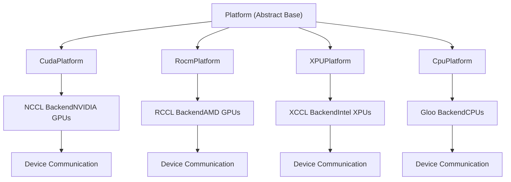

# Communication Infrastructure

Relevant source files

-   [benchmarks/kernels/benchmark\_fused\_collective.py](https://github.com/vllm-project/vllm/blob/7cc302dd/benchmarks/kernels/benchmark_fused_collective.py)
-   [docs/design/cuda\_graphs.md](https://github.com/vllm-project/vllm/blob/7cc302dd/docs/design/cuda_graphs.md?plain=1)
-   [docs/design/cuda\_graphs\_multimodal.md](https://github.com/vllm-project/vllm/blob/7cc302dd/docs/design/cuda_graphs_multimodal.md?plain=1)
-   [docs/design/moe\_kernel\_features.md](https://github.com/vllm-project/vllm/blob/7cc302dd/docs/design/moe_kernel_features.md?plain=1)
-   [examples/offline\_inference/load\_sharded\_state.py](https://github.com/vllm-project/vllm/blob/7cc302dd/examples/offline_inference/load_sharded_state.py)
-   [examples/offline\_inference/save\_sharded\_state.py](https://github.com/vllm-project/vllm/blob/7cc302dd/examples/offline_inference/save_sharded_state.py)
-   [tests/basic\_correctness/test\_basic\_correctness.py](https://github.com/vllm-project/vllm/blob/7cc302dd/tests/basic_correctness/test_basic_correctness.py)
-   [tests/compile/fusions\_e2e/\_\_init\_\_.py](https://github.com/vllm-project/vllm/blob/7cc302dd/tests/compile/fusions_e2e/__init__.py)
-   [tests/compile/passes/distributed/test\_fusion\_all\_reduce.py](https://github.com/vllm-project/vllm/blob/7cc302dd/tests/compile/passes/distributed/test_fusion_all_reduce.py)
-   [tests/compile/passes/test\_fusion\_attn.py](https://github.com/vllm-project/vllm/blob/7cc302dd/tests/compile/passes/test_fusion_attn.py)
-   [tests/distributed/test\_shm\_broadcast.py](https://github.com/vllm-project/vllm/blob/7cc302dd/tests/distributed/test_shm_broadcast.py)
-   [tests/distributed/test\_symm\_mem\_allreduce.py](https://github.com/vllm-project/vllm/blob/7cc302dd/tests/distributed/test_symm_mem_allreduce.py)
-   [tests/kernels/moe/modular\_kernel\_tools/mk\_objects.py](https://github.com/vllm-project/vllm/blob/7cc302dd/tests/kernels/moe/modular_kernel_tools/mk_objects.py)
-   [tests/models/language/generation/test\_common.py](https://github.com/vllm-project/vllm/blob/7cc302dd/tests/models/language/generation/test_common.py)
-   [tests/samplers/test\_no\_bad\_words.py](https://github.com/vllm-project/vllm/blob/7cc302dd/tests/samplers/test_no_bad_words.py)
-   [tests/v1/core/test\_scheduler\_e2e.py](https://github.com/vllm-project/vllm/blob/7cc302dd/tests/v1/core/test_scheduler_e2e.py)
-   [tests/v1/sample/test\_sampling\_params\_e2e.py](https://github.com/vllm-project/vllm/blob/7cc302dd/tests/v1/sample/test_sampling_params_e2e.py)
-   [vllm/compilation/passes/fusion/act\_quant\_fusion.py](https://github.com/vllm-project/vllm/blob/7cc302dd/vllm/compilation/passes/fusion/act_quant_fusion.py)
-   [vllm/compilation/passes/fusion/allreduce\_rms\_fusion.py](https://github.com/vllm-project/vllm/blob/7cc302dd/vllm/compilation/passes/fusion/allreduce_rms_fusion.py)
-   [vllm/compilation/passes/fusion/attn\_quant\_fusion.py](https://github.com/vllm-project/vllm/blob/7cc302dd/vllm/compilation/passes/fusion/attn_quant_fusion.py)
-   [vllm/compilation/passes/fusion/matcher\_utils.py](https://github.com/vllm-project/vllm/blob/7cc302dd/vllm/compilation/passes/fusion/matcher_utils.py)
-   [vllm/compilation/passes/fusion/rms\_quant\_fusion.py](https://github.com/vllm-project/vllm/blob/7cc302dd/vllm/compilation/passes/fusion/rms_quant_fusion.py)
-   [vllm/distributed/device\_communicators/all2all.py](https://github.com/vllm-project/vllm/blob/7cc302dd/vllm/distributed/device_communicators/all2all.py)
-   [vllm/distributed/device\_communicators/all\_reduce\_utils.py](https://github.com/vllm-project/vllm/blob/7cc302dd/vllm/distributed/device_communicators/all_reduce_utils.py)
-   [vllm/distributed/device\_communicators/base\_device\_communicator.py](https://github.com/vllm-project/vllm/blob/7cc302dd/vllm/distributed/device_communicators/base_device_communicator.py)
-   [vllm/distributed/device\_communicators/cuda\_communicator.py](https://github.com/vllm-project/vllm/blob/7cc302dd/vllm/distributed/device_communicators/cuda_communicator.py)
-   [vllm/distributed/device\_communicators/custom\_all\_reduce.py](https://github.com/vllm-project/vllm/blob/7cc302dd/vllm/distributed/device_communicators/custom_all_reduce.py)
-   [vllm/distributed/device\_communicators/flashinfer\_all\_reduce.py](https://github.com/vllm-project/vllm/blob/7cc302dd/vllm/distributed/device_communicators/flashinfer_all_reduce.py)
-   [vllm/distributed/device\_communicators/pynccl.py](https://github.com/vllm-project/vllm/blob/7cc302dd/vllm/distributed/device_communicators/pynccl.py)
-   [vllm/distributed/device\_communicators/shm\_broadcast.py](https://github.com/vllm-project/vllm/blob/7cc302dd/vllm/distributed/device_communicators/shm_broadcast.py)
-   [vllm/distributed/device\_communicators/symm\_mem.py](https://github.com/vllm-project/vllm/blob/7cc302dd/vllm/distributed/device_communicators/symm_mem.py)
-   [vllm/distributed/elastic\_ep/elastic\_execute.py](https://github.com/vllm-project/vllm/blob/7cc302dd/vllm/distributed/elastic_ep/elastic_execute.py)
-   [vllm/distributed/elastic\_ep/elastic\_state.py](https://github.com/vllm-project/vllm/blob/7cc302dd/vllm/distributed/elastic_ep/elastic_state.py)
-   [vllm/distributed/parallel\_state.py](https://github.com/vllm-project/vllm/blob/7cc302dd/vllm/distributed/parallel_state.py)
-   [vllm/distributed/utils.py](https://github.com/vllm-project/vllm/blob/7cc302dd/vllm/distributed/utils.py)
-   [vllm/model\_executor/layers/fused\_moe/all2all\_utils.py](https://github.com/vllm-project/vllm/blob/7cc302dd/vllm/model_executor/layers/fused_moe/all2all_utils.py)
-   [vllm/model\_executor/layers/fused\_moe/fused\_marlin\_moe.py](https://github.com/vllm-project/vllm/blob/7cc302dd/vllm/model_executor/layers/fused_moe/fused_marlin_moe.py)
-   [vllm/model\_executor/models/arctic.py](https://github.com/vllm-project/vllm/blob/7cc302dd/vllm/model_executor/models/arctic.py)
-   [vllm/model\_executor/models/chatglm.py](https://github.com/vllm-project/vllm/blob/7cc302dd/vllm/model_executor/models/chatglm.py)
-   [vllm/model\_executor/models/commandr.py](https://github.com/vllm-project/vllm/blob/7cc302dd/vllm/model_executor/models/commandr.py)
-   [vllm/model\_executor/models/dbrx.py](https://github.com/vllm-project/vllm/blob/7cc302dd/vllm/model_executor/models/dbrx.py)
-   [vllm/model\_executor/models/exaone4.py](https://github.com/vllm-project/vllm/blob/7cc302dd/vllm/model_executor/models/exaone4.py)
-   [vllm/model\_executor/models/gemma.py](https://github.com/vllm-project/vllm/blob/7cc302dd/vllm/model_executor/models/gemma.py)
-   [vllm/model\_executor/models/gemma2.py](https://github.com/vllm-project/vllm/blob/7cc302dd/vllm/model_executor/models/gemma2.py)
-   [vllm/model\_executor/models/gemma3.py](https://github.com/vllm-project/vllm/blob/7cc302dd/vllm/model_executor/models/gemma3.py)
-   [vllm/model\_executor/models/phi.py](https://github.com/vllm-project/vllm/blob/7cc302dd/vllm/model_executor/models/phi.py)

## Purpose and Scope

This page documents vLLM's distributed communication infrastructure, including backend selection (NCCL, XCCL, Gloo), topology detection, device communicators, and custom collective operations. This infrastructure enables tensor parallelism, pipeline parallelism, expert parallelism, and other distributed execution strategies.

For information about high-level parallelism strategies, see [Parallelism Strategies](/vllm-project/vllm/9.1-parallelism-strategies). For multi-process engine management and coordination, see [Multi-Process Engine Management](/vllm-project/vllm/9.3-multi-process-engine-management). For KV cache transfer in disaggregated serving, see [KV Cache Transfer and Disaggregated Serving](/vllm-project/vllm/9.4-kv-cache-transfer-and-disaggregated-serving).

---

## Communication Backend Selection

Each platform defines a specific distributed communication backend via the `dist_backend` attribute in the `Platform` class. The backend is used by PyTorch's distributed package for inter-process communication.

### Backend Mapping by Platform

| Platform | Backend | Description |
| --- | --- | --- |
| CUDA | `nccl` | NVIDIA Collective Communications Library for GPU communication |
| ROCm | `nccl` | RCCL (ROCm fork of NCCL) for AMD GPU communication |
| XPU | `xccl` | Intel collective communications library for XPU devices |
| CPU | `gloo` | Gloo library for CPU-based distributed communication |
| TPU | Platform-specific | Handled by external TPU inference package |

**Sources:**

-   [vllm/platforms/interface.py134](https://github.com/vllm-project/vllm/blob/7cc302dd/vllm/platforms/interface.py#L134-L134)
-   [vllm/platforms/cuda.py118](https://github.com/vllm-project/vllm/blob/7cc302dd/vllm/platforms/cuda.py#L118-L118)
-   [vllm/platforms/rocm.py361](https://github.com/vllm-project/vllm/blob/7cc302dd/vllm/platforms/rocm.py#L361-L361)
-   [vllm/platforms/xpu.py38](https://github.com/vllm-project/vllm/blob/7cc302dd/vllm/platforms/xpu.py#L38-L38)
-   [vllm/platforms/cpu.py77](https://github.com/vllm-project/vllm/blob/7cc302dd/vllm/platforms/cpu.py#L77-L77)

### Backend Selection Diagram

**Sources:**

-   [vllm/platforms/interface.py100-140](https://github.com/vllm-project/vllm/blob/7cc302dd/vllm/platforms/interface.py#L100-L140)
-   [vllm/platforms/cuda.py112-123](https://github.com/vllm-project/vllm/blob/7cc302dd/vllm/platforms/cuda.py#L112-L123)
-   [vllm/platforms/rocm.py355-368](https://github.com/vllm-project/vllm/blob/7cc302dd/vllm/platforms/rocm.py#L355-L368)

---

## Device Communicators and Custom Collectives

vLLM implements specialized communicators to wrap `torch.distributed` and provide optimized implementations for common operations like `all_reduce` and `all_to_all`.

### CudaCommunicator and All-Reduce

The `CudaCommunicator` coordinates multiple all-reduce backends, selecting the most efficient one based on environment variables and hardware topology. It specifically manages `pynccl_comm`, `ca_comm` (Custom Allreduce), and `fi_ar_comm` (FlashInfer) [vllm/distributed/device\_communicators/cuda\_communicator.py73-97](https://github.com/vllm-project/vllm/blob/7cc302dd/vllm/distributed/device_communicators/cuda_communicator.py#L73-L97)

| Backend | Code Entity | Trigger Condition |
| --- | --- | --- |
| **NCCL** | `PyNcclCommunicator` | Default for world\_size > 1 [vllm/distributed/device\_communicators/cuda\_communicator.py75](https://github.com/vllm-project/vllm/blob/7cc302dd/vllm/distributed/device_communicators/cuda_communicator.py#L75-L75) |
| **Custom All-Reduce** | `CustomAllreduce` | `_ENABLE_CUSTOM_ALL_REDUCE` is True [vllm/distributed/device\_communicators/cuda\_communicator.py101](https://github.com/vllm-project/vllm/blob/7cc302dd/vllm/distributed/device_communicators/cuda_communicator.py#L101-L101) |
| **Symmetric Memory** | `SymmMemCommunicator` | `VLLM_ALLREDUCE_USE_SYMM_MEM` [vllm/distributed/device\_communicators/cuda\_communicator.py88](https://github.com/vllm-project/vllm/blob/7cc302dd/vllm/distributed/device_communicators/cuda_communicator.py#L88-L88) |
| **FlashInfer** | `FlashInferAllReduce` | `VLLM_ALLREDUCE_USE_FLASHINFER` [vllm/distributed/device\_communicators/cuda\_communicator.py94](https://github.com/vllm-project/vllm/blob/7cc302dd/vllm/distributed/device_communicators/cuda_communicator.py#L94-L94) |
| **Quick Reduce** | `QuickAllReduce` | ROCm MI300 series only [vllm/distributed/device\_communicators/cuda\_communicator.py115](https://github.com/vllm-project/vllm/blob/7cc302dd/vllm/distributed/device_communicators/cuda_communicator.py#L115-L115) |

**Sources:**

-   [vllm/distributed/device\_communicators/cuda\_communicator.py25-116](https://github.com/vllm-project/vllm/blob/7cc302dd/vllm/distributed/device_communicators/cuda_communicator.py#L25-L116)

### MoE All-to-All Infrastructure

For Expert Parallelism (EP), vLLM uses an `All2AllManager` to handle token dispatch and result combination. The backend is configured via `ParallelConfig.all2all_backend` [vllm/distributed/device\_communicators/base\_device\_communicator.py171-175](https://github.com/vllm-project/vllm/blob/7cc302dd/vllm/distributed/device_communicators/base_device_communicator.py#L171-L175)

vLLM supports several advanced all2all backends:

-   `NaiveAll2AllManager`: Uses standard broadcast/all-reduce for debugging [vllm/distributed/device\_communicators/all2all.py41-50](https://github.com/vllm-project/vllm/blob/7cc302dd/vllm/distributed/device_communicators/all2all.py#L41-L50)
-   `AgRsAll2AllManager`: Based on all-gather and reduce-scatter [vllm/distributed/device\_communicators/all2all.py150-158](https://github.com/vllm-project/vllm/blob/7cc302dd/vllm/distributed/device_communicators/all2all.py#L150-L158)
-   `DeepEPHTAll2AllManager`: High-throughput backend using the DeepEP library [vllm/distributed/device\_communicators/all2all.py130-135](https://github.com/vllm-project/vllm/blob/7cc302dd/vllm/distributed/device_communicators/all2all.py#L130-L135)
-   `FlashInferNVLinkTwoSidedManager`: Optimized NVLink backend for two-sided communication [vllm/distributed/device\_communicators/all2all.py162-166](https://github.com/vllm-project/vllm/blob/7cc302dd/vllm/distributed/device_communicators/all2all.py#L162-L166)

**Sources:**

-   [vllm/distributed/device\_communicators/all2all.py40-170](https://github.com/vllm-project/vllm/blob/7cc302dd/vllm/distributed/device_communicators/all2all.py#L40-L170)
-   [vllm/distributed/device\_communicators/base\_device\_communicator.py28-115](https://github.com/vllm-project/vllm/blob/7cc302dd/vllm/distributed/device_communicators/base_device_communicator.py#L28-L115)

---

## Distributed State and Group Management

The `parallel_state` module manages the lifecycle of distributed process groups. It provides a registry of `GroupCoordinator` objects that encapsulate `torch.distributed` process groups.

### Key Functions and Lifecycle

1.  **Initialization**: `init_distributed_environment` sets up the initial world [vllm/distributed/parallel\_state.py12](https://github.com/vllm-project/vllm/blob/7cc302dd/vllm/distributed/parallel_state.py#L12-L12)
2.  **Model Parallelism**: `initialize_model_parallel` sets up TP, PP, and EP groups [vllm/distributed/parallel\_state.py13-14](https://github.com/vllm-project/vllm/blob/7cc302dd/vllm/distributed/parallel_state.py#L13-L14)
3.  **Collective Wrappers**: Functions like `all_reduce`, `all_gather`, and `reduce_scatter` look up the appropriate `GroupCoordinator` by name [vllm/distributed/parallel\_state.py130-167](https://github.com/vllm-project/vllm/blob/7cc302dd/vllm/distributed/parallel_state.py#L130-L167)

### Stateless Communication and Shared Memory Broadcast

vLLM introduces `StatelessProcessGroup` to communicate metadata (like tensor shapes) without the overhead of a full PyTorch process group. It uses a `Store` (e.g., `TCPStore`) to exchange pickled objects [vllm/distributed/utils.py167-202](https://github.com/vllm-project/vllm/blob/7cc302dd/vllm/distributed/utils.py#L167-L202)

Additionally, the `SpinCondition` class provides a lock-free synchronization mechanism for shared memory broadcasts, using ZMQ sockets to notify readers of new data after a period of busy-loop spinning [vllm/distributed/device\_communicators/shm\_broadcast.py92-108](https://github.com/vllm-project/vllm/blob/7cc302dd/vllm/distributed/device_communicators/shm_broadcast.py#L92-L108)

**Sources:**

-   [vllm/distributed/parallel\_state.py8-130](https://github.com/vllm-project/vllm/blob/7cc302dd/vllm/distributed/parallel_state.py#L8-L130)
-   [vllm/distributed/utils.py167-202](https://github.com/vllm-project/vllm/blob/7cc302dd/vllm/distributed/utils.py#L167-L202)
-   [vllm/distributed/device\_communicators/shm\_broadcast.py49-108](https://github.com/vllm-project/vllm/blob/7cc302dd/vllm/distributed/device_communicators/shm_broadcast.py#L49-L108)

---

## Communication and Computation Overlap

vLLM supports advanced techniques to hide communication latency, particularly for MoE models.

### Dual Batch Overlap (DBO)

DBO allows overlapping the communication of one micro-batch with the computation of another. This is supported by backends like `deepep_high_throughput` and `deepep_low_latency` [docs/design/moe\_kernel\_features.md33-39](https://github.com/vllm-project/vllm/blob/7cc302dd/docs/design/moe_kernel_features.md?plain=1#L33-L39)

### FlashInfer All-Reduce Fusion

vLLM supports fusing All-Reduce with other operations like RMSNorm using FlashInfer. This is managed via `FlashInferAllReduce` which initializes a specialized workspace [vllm/distributed/device\_communicators/flashinfer\_all\_reduce.py40-89](https://github.com/vllm-project/vllm/blob/7cc302dd/vllm/distributed/device_communicators/flashinfer_all_reduce.py#L40-L89) It supports different backends like `mnnvl` (multi-node) and `trtllm` (single-node) [vllm/distributed/device\_communicators/flashinfer\_all\_reduce.py92-110](https://github.com/vllm-project/vllm/blob/7cc302dd/vllm/distributed/device_communicators/flashinfer_all_reduce.py#L92-L110)

**Sources:**

-   [docs/design/moe\_kernel\_features.md1-40](https://github.com/vllm-project/vllm/blob/7cc302dd/docs/design/moe_kernel_features.md?plain=1#L1-L40)
-   [vllm/distributed/device\_communicators/flashinfer\_all\_reduce.py40-110](https://github.com/vllm-project/vllm/blob/7cc302dd/vllm/distributed/device_communicators/flashinfer_all_reduce.py#L40-L110)

---

## Topology Detection and CUDA Graphs

Communication infrastructure must be aware of CUDA Graph captures, as standard collectives may not be capturable or may require specific memory management.

### Pynccl and Symmetric Memory

-   **PyNccl**: A Python wrapper around NCCL that supports CUDA Graph capture by managing its own internal buffers and communicators [vllm/distributed/device\_communicators/cuda\_communicator.py73-80](https://github.com/vllm-project/vllm/blob/7cc302dd/vllm/distributed/device_communicators/cuda_communicator.py#L73-L80)
-   **Symmetric Memory**: Enables direct peer-to-peer memory access, often used to optimize all-reduce in CUDA Graphs. vLLM checks if symmetric memory is enabled via `is_symmetric_memory_enabled()` [vllm/distributed/device\_communicators/pynccl\_allocator.py14-18](https://github.com/vllm-project/vllm/blob/7cc302dd/vllm/distributed/device_communicators/pynccl_allocator.py#L14-L18)

### Graph Capture Integration

The `CudagraphDispatcher` acts as a central controller that picks the desired runtime mode and CUDA Graphs per batch automatically [docs/design/cuda\_graphs.md5-8](https://github.com/vllm-project/vllm/blob/7cc302dd/docs/design/cuda_graphs.md?plain=1#L5-L8) It uses a `BatchDescriptor` as a unique representation of the runtime batch for dispatching [docs/design/cuda\_graphs.md81-92](https://github.com/vllm-project/vllm/blob/7cc302dd/docs/design/cuda_graphs.md?plain=1#L81-L92)

| Mode | Description |
| --- | --- |
| `PIECEWISE` | Attention stays eager, everything else goes into CUDA Graphs [docs/design/cuda\_graphs.md43-44](https://github.com/vllm-project/vllm/blob/7cc302dd/docs/design/cuda_graphs.md?plain=1#L43-L44) |
| `FULL` | Captures full CUDA Graphs for non-uniform batches [docs/design/cuda\_graphs.md44-45](https://github.com/vllm-project/vllm/blob/7cc302dd/docs/design/cuda_graphs.md?plain=1#L44-L45) |
| `FULL_AND_PIECEWISE` | Default; full for uniform decode, piecewise for others [docs/design/cuda\_graphs.md46-47](https://github.com/vllm-project/vllm/blob/7cc302dd/docs/design/cuda_graphs.md?plain=1#L46-L47) |

**Sources:**

-   [vllm/distributed/device\_communicators/cuda\_communicator.py71-91](https://github.com/vllm-project/vllm/blob/7cc302dd/vllm/distributed/device_communicators/cuda_communicator.py#L71-L91)
-   [docs/design/cuda\_graphs.md1-92](https://github.com/vllm-project/vllm/blob/7cc302dd/docs/design/cuda_graphs.md?plain=1#L1-L92)
-   [vllm/distributed/device\_communicators/pynccl\_allocator.py14-18](https://github.com/vllm-project/vllm/blob/7cc302dd/vllm/distributed/device_communicators/pynccl_allocator.py#L14-L18)
