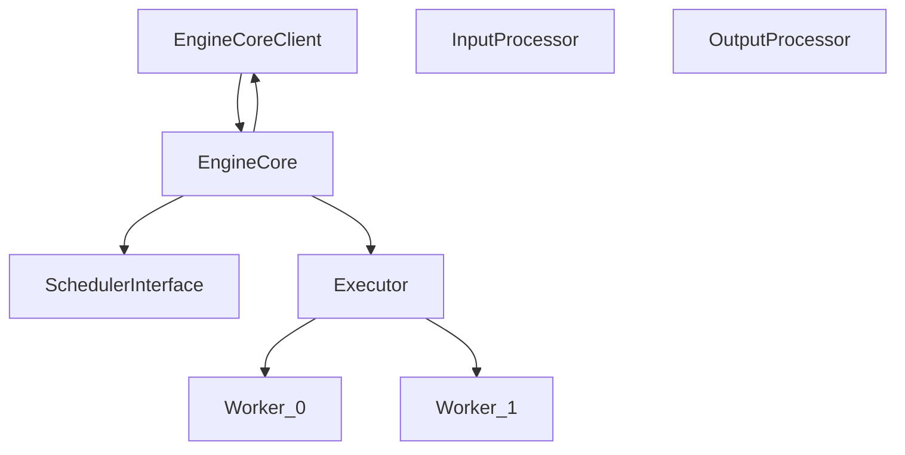
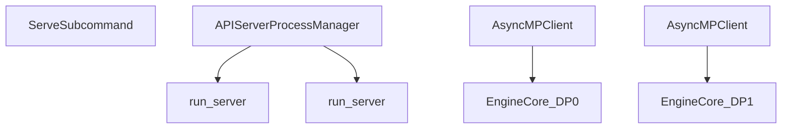

# Multi-Process Engine Management

Relevant source files

-   [tests/entrypoints/test\_api\_server\_process\_manager.py](https://github.com/vllm-project/vllm/blob/7cc302dd/tests/entrypoints/test_api_server_process_manager.py)
-   [tests/test\_ray\_env.py](https://github.com/vllm-project/vllm/blob/7cc302dd/tests/test_ray_env.py)
-   [tests/v1/engine/test\_engine\_core.py](https://github.com/vllm-project/vllm/blob/7cc302dd/tests/v1/engine/test_engine_core.py)
-   [tests/v1/engine/test\_engine\_core\_client.py](https://github.com/vllm-project/vllm/blob/7cc302dd/tests/v1/engine/test_engine_core_client.py)
-   [vllm/config/parallel.py](https://github.com/vllm-project/vllm/blob/7cc302dd/vllm/config/parallel.py)
-   [vllm/engine/async\_llm\_engine.py](https://github.com/vllm-project/vllm/blob/7cc302dd/vllm/engine/async_llm_engine.py)
-   [vllm/engine/llm\_engine.py](https://github.com/vllm-project/vllm/blob/7cc302dd/vllm/engine/llm_engine.py)
-   [vllm/engine/protocol.py](https://github.com/vllm-project/vllm/blob/7cc302dd/vllm/engine/protocol.py)
-   [vllm/entrypoints/cli/serve.py](https://github.com/vllm-project/vllm/blob/7cc302dd/vllm/entrypoints/cli/serve.py)
-   [vllm/entrypoints/launcher.py](https://github.com/vllm-project/vllm/blob/7cc302dd/vllm/entrypoints/launcher.py)
-   [vllm/entrypoints/llm.py](https://github.com/vllm-project/vllm/blob/7cc302dd/vllm/entrypoints/llm.py)
-   [vllm/ray/ray\_env.py](https://github.com/vllm-project/vllm/blob/7cc302dd/vllm/ray/ray_env.py)
-   [vllm/utils/\_\_init\_\_.py](https://github.com/vllm-project/vllm/blob/7cc302dd/vllm/utils/__init__.py)
-   [vllm/v1/engine/async\_llm.py](https://github.com/vllm-project/vllm/blob/7cc302dd/vllm/v1/engine/async_llm.py)
-   [vllm/v1/engine/coordinator.py](https://github.com/vllm-project/vllm/blob/7cc302dd/vllm/v1/engine/coordinator.py)
-   [vllm/v1/engine/core.py](https://github.com/vllm-project/vllm/blob/7cc302dd/vllm/v1/engine/core.py)
-   [vllm/v1/engine/core\_client.py](https://github.com/vllm-project/vllm/blob/7cc302dd/vllm/v1/engine/core_client.py)
-   [vllm/v1/engine/llm\_engine.py](https://github.com/vllm-project/vllm/blob/7cc302dd/vllm/v1/engine/llm_engine.py)
-   [vllm/v1/engine/utils.py](https://github.com/vllm-project/vllm/blob/7cc302dd/vllm/v1/engine/utils.py)
-   [vllm/v1/utils.py](https://github.com/vllm-project/vllm/blob/7cc302dd/vllm/v1/utils.py)

This document describes the process lifecycle management infrastructure in vLLM's distributed execution system. It covers the creation, initialization, monitoring, and shutdown of engine processes and API server processes. For information about the communication mechanisms used between these processes (ZMQ, ShmRingBuffer, MsgpackEncoder), see page 9.2.

## Overview

vLLM uses multiprocessing to manage distributed execution across multiple GPUs and nodes. The engine process management system is responsible for spawning and initializing engine core processes (one per data parallel rank), creating API server worker processes, and managing Ray actors for multi-node distributed inference.

The system is built around a client/server split: the front-end (`AsyncLLM` or `LLMEngine`) communicates with one or more background `EngineCore` instances. The `EngineCoreClient` abstraction unifies both in-process and multiprocessing modes [vllm/v1/engine/core\_client.py69-78](https://github.com/vllm-project/vllm/blob/7cc302dd/vllm/v1/engine/core_client.py#L69-L78)

Key management entities:

| Entity | Code Reference | Role |
| --- | --- | --- |
| `EngineCoreClient` | [vllm/v1/engine/core\_client.py69](https://github.com/vllm-project/vllm/blob/7cc302dd/vllm/v1/engine/core_client.py#L69-L69) | Abstract client interface for request/output flow |
| `EngineCore` | [vllm/v1/engine/core.py87](https://github.com/vllm-project/vllm/blob/7cc302dd/vllm/v1/engine/core.py#L87-L87) | The inner loop running the scheduler and model executor |
| `CoreEngineProcManager` | [vllm/v1/engine/utils.py82](https://github.com/vllm-project/vllm/blob/7cc302dd/vllm/v1/engine/utils.py#L82-L82) | Spawns and monitors local `EngineCore` processes |
| `APIServerProcessManager` | [vllm/v1/utils.py161](https://github.com/vllm-project/vllm/blob/7cc302dd/vllm/v1/utils.py#L161-L161) | Manages multiple OpenAI-compatible API server workers |
| `Executor` | [vllm/v1/executor/abstract.py17](https://github.com/vllm-project/vllm/blob/7cc302dd/vllm/v1/executor/abstract.py#L17-L17) | Abstract base for worker management (e.g. `MultiprocExecutor`) |

Sources: [vllm/v1/engine/core\_client.py69-130](https://github.com/vllm-project/vllm/blob/7cc302dd/vllm/v1/engine/core_client.py#L69-L130) [vllm/v1/engine/utils.py82-174](https://github.com/vllm-project/vllm/blob/7cc302dd/vllm/v1/engine/utils.py#L82-L174) [vllm/v1/engine/core.py87-186](https://github.com/vllm-project/vllm/blob/7cc302dd/vllm/v1/engine/core.py#L87-L186)

## EngineCoreClient Hierarchy

`EngineCoreClient` defines the full API surface for interacting with an engine core. Concrete subclasses differ in how they communicate with the execution backend.

**Engine Architecture and Process Mapping:**

Sources: [vllm/v1/engine/core\_client.py69-103](https://github.com/vllm-project/vllm/blob/7cc302dd/vllm/v1/engine/core_client.py#L69-L103) [vllm/v1/engine/core.py87-186](https://github.com/vllm-project/vllm/blob/7cc302dd/vllm/v1/engine/core.py#L87-L186) [vllm/v1/engine/utils.py118-133](https://github.com/vllm-project/vllm/blob/7cc302dd/vllm/v1/engine/utils.py#L118-L133)

### Client Selection Logic

The factory method `EngineCoreClient.make_client` (and `make_async_mp_client`) selects the implementation based on the configuration:

-   **`InprocClient`**: Runs `EngineCore` directly in the calling process. Used for offline `LLM` or `LLMEngine` without multiprocessing [vllm/v1/engine/core\_client.py103](https://github.com/vllm-project/vllm/blob/7cc302dd/vllm/v1/engine/core_client.py#L103-L103)
-   **`SyncMPClient`**: Communicates with a background process via ZMQ. Used by `LLMEngine` [vllm/v1/engine/core\_client.py101](https://github.com/vllm-project/vllm/blob/7cc302dd/vllm/v1/engine/core_client.py#L101-L101)
-   **`AsyncMPClient`**: Uses `zmq.asyncio` for non-blocking communication. Used by `AsyncLLM` [vllm/v1/engine/core\_client.py130](https://github.com/vllm-project/vllm/blob/7cc302dd/vllm/v1/engine/core_client.py#L130-L130)
-   **`DPLBAsyncMPClient`**: An internal load balancer that distributes requests across multiple data-parallel (DP) engine ranks [vllm/v1/engine/core\_client.py129](https://github.com/vllm-project/vllm/blob/7cc302dd/vllm/v1/engine/core_client.py#L129-L129)

Sources: [vllm/v1/engine/core\_client.py80-130](https://github.com/vllm-project/vllm/blob/7cc302dd/vllm/v1/engine/core_client.py#L80-L130)

---

## EngineCore Initialization

`EngineCore` is the heart of the V1 architecture. It initializes the model executor, KV cache, and scheduler.

**Initialization sequence in `EngineCore.__init__`:**

1.  **Executor Setup**: Instantiates the `executor_class` (e.g., `MultiprocExecutor`) which spawns worker processes [vllm/v1/engine/core.py114](https://github.com/vllm-project/vllm/blob/7cc302dd/vllm/v1/engine/core.py#L114-L114)
2.  **KV Cache Profiling**: Calls `_initialize_kv_caches` to determine available GPU memory and allocate blocks [vllm/v1/engine/core.py124](https://github.com/vllm-project/vllm/blob/7cc302dd/vllm/v1/engine/core.py#L124-L124)
3.  **Scheduler Setup**: Retrieves the scheduler class from `SchedulerConfig` and initializes it with the allocated KV cache blocks [vllm/v1/engine/core.py128-150](https://github.com/vllm-project/vllm/blob/7cc302dd/vllm/v1/engine/core.py#L128-L150)
4.  **Handshake**: If using KV transfer (disaggregated serving), it collects handshake metadata from workers to share with the scheduler's connector [vllm/v1/engine/core.py163-179](https://github.com/vllm-project/vllm/blob/7cc302dd/vllm/v1/engine/core.py#L163-L179)

Sources: [vllm/v1/engine/core.py114-179](https://github.com/vllm-project/vllm/blob/7cc302dd/vllm/v1/engine/core.py#L114-L179)

---

## Process Spawning and Management

### CoreEngineProcManager

The `CoreEngineProcManager` handles the lifecycle of background `EngineCore` processes. It uses the `spawn` start method for clean state isolation [vllm/v1/engine/utils.py101](https://github.com/vllm-project/vllm/blob/7cc302dd/vllm/v1/engine/utils.py#L101-L101)

-   **Spawning**: It creates one `Process` per local data parallel rank [vllm/v1/engine/utils.py120-133](https://github.com/vllm-project/vllm/blob/7cc302dd/vllm/v1/engine/utils.py#L120-L133)
-   **Device Control**: For non-CUDA platforms or Ray, it uses `set_device_control_env_var` to restrict which GPUs are visible to each engine process via environment variables like `CUDA_VISIBLE_DEVICES` or `ZE_AFFINITY_MASK` [vllm/v1/engine/utils.py142-149](https://github.com/vllm-project/vllm/blob/7cc302dd/vllm/v1/engine/utils.py#L142-L149) [vllm/v1/engine/utils.py203-213](https://github.com/vllm-project/vllm/blob/7cc302dd/vllm/v1/engine/utils.py#L203-L213)
-   **Monitoring**: It provides `finished_procs()` to detect if any engine has crashed [vllm/v1/engine/utils.py167-174](https://github.com/vllm-project/vllm/blob/7cc302dd/vllm/v1/engine/utils.py#L167-L174)

Sources: [vllm/v1/engine/utils.py82-174](https://github.com/vllm-project/vllm/blob/7cc302dd/vllm/v1/engine/utils.py#L82-L174) [vllm/v1/engine/utils.py203-213](https://github.com/vllm-project/vllm/blob/7cc302dd/vllm/v1/engine/utils.py#L203-L213)

### Worker and Executor Architecture

The `Executor` class (and its multiprocess variant) manages the processes required for Tensor Parallelism (TP) and Pipeline Parallelism (PP) within a single engine instance.

-   **Process Creation**: Engine core processes are started via `proc.start()` within the manager [vllm/v1/engine/utils.py147](https://github.com/vllm-project/vllm/blob/7cc302dd/vllm/v1/engine/utils.py#L147-L147)
-   **Failure Callbacks**: `EngineCore` registers a failure callback with the model executor to handle worker crashes [vllm/v1/engine/core.py115-116](https://github.com/vllm-project/vllm/blob/7cc302dd/vllm/v1/engine/core.py#L115-L116)
-   **ZMQ Readiness**: The client waits for engines to become ready by polling the `VLLM_ENGINE_READY_TIMEOUT_S` environment variable [vllm/v1/engine/core\_client.py24](https://github.com/vllm-project/vllm/blob/7cc302dd/vllm/v1/engine/core_client.py#L24-L24) [tests/v1/engine/test\_engine\_core\_client.py100-106](https://github.com/vllm-project/vllm/blob/7cc302dd/tests/v1/engine/test_engine_core_client.py#L100-L106)

Sources: [vllm/v1/engine/core.py114-116](https://github.com/vllm-project/vllm/blob/7cc302dd/vllm/v1/engine/core.py#L114-L116) [vllm/v1/engine/utils.py138-150](https://github.com/vllm-project/vllm/blob/7cc302dd/vllm/v1/engine/utils.py#L138-L150)

---

## Request Wave Coordination and Load Balancing

In Data Parallel (DP) configurations, vLLM supports multiple modes of request distribution:

### Internal Load Balancing (`DPLBAsyncMPClient`)

The client maintains state for all DP engine ranks. When a new request arrives:

1.  **Selection**: The client selects an engine rank using a load-balancing strategy [vllm/v1/engine/core\_client.py129](https://github.com/vllm-project/vllm/blob/7cc302dd/vllm/v1/engine/core_client.py#L129-L129)
2.  **Sticky Routing**: For tasks like ColBERT late interaction, `get_late_interaction_engine_index` ensures that document scores are routed to the same engine that cached the query embeddings [vllm/v1/engine/core\_client.py57](https://github.com/vllm-project/vllm/blob/7cc302dd/vllm/v1/engine/core_client.py#L57-L57) [tests/v1/engine/test\_engine\_core\_client.py200-222](https://github.com/vllm-project/vllm/blob/7cc302dd/tests/v1/engine/test_engine_core_client.py#L200-L222)
3.  **ZMQ Distribution**: Requests are pushed to the background engine processes via ZMQ sockets [vllm/v1/engine/core\_client.py20-21](https://github.com/vllm-project/vllm/blob/7cc302dd/vllm/v1/engine/core_client.py#L20-L21)

Sources: [vllm/v1/engine/core\_client.py57-129](https://github.com/vllm-project/vllm/blob/7cc302dd/vllm/v1/engine/core_client.py#L57-L129) [tests/v1/engine/test\_engine\_core\_client.py200-222](https://github.com/vllm-project/vllm/blob/7cc302dd/tests/v1/engine/test_engine_core_client.py#L200-L222)

### Multi-Process API Serving

When running `vllm serve`, the `APIServerProcessManager` can spawn multiple API server workers to handle high request concurrency [vllm/entrypoints/cli/serve.py118](https://github.com/vllm-project/vllm/blob/7cc302dd/vllm/entrypoints/cli/serve.py#L118-L118)

**API Server Process Management:**

Sources: [vllm/entrypoints/cli/serve.py87-122](https://github.com/vllm-project/vllm/blob/7cc302dd/vllm/entrypoints/cli/serve.py#L87-L122) [vllm/v1/utils.py161-215](https://github.com/vllm-project/vllm/blob/7cc302dd/vllm/v1/utils.py#L161-L215)

### Monitoring and Shutdown

vLLM ensures that if any component (API server, Engine, or Worker) fails, the entire system shuts down cleanly to avoid orphaned processes.

-   **Sentinel Monitoring**: The manager monitors process sentinels to detect exits [vllm/v1/engine/utils.py164-165](https://github.com/vllm-project/vllm/blob/7cc302dd/vllm/v1/engine/utils.py#L164-L165)
-   **Graceful Shutdown**: The `shutdown` function handles terminating process trees and cleaning up ZMQ sockets [vllm/v1/engine/utils.py155-159](https://github.com/vllm-project/vllm/blob/7cc302dd/vllm/v1/engine/utils.py#L155-L159) [vllm/v1/engine/core\_client.py31](https://github.com/vllm-project/vllm/blob/7cc302dd/vllm/v1/engine/core_client.py#L31-L31)

Sources: [vllm/v1/engine/utils.py155-165](https://github.com/vllm-project/vllm/blob/7cc302dd/vllm/v1/engine/utils.py#L155-L165) [vllm/v1/engine/core\_client.py31](https://github.com/vllm-project/vllm/blob/7cc302dd/vllm/v1/engine/core_client.py#L31-L31)
