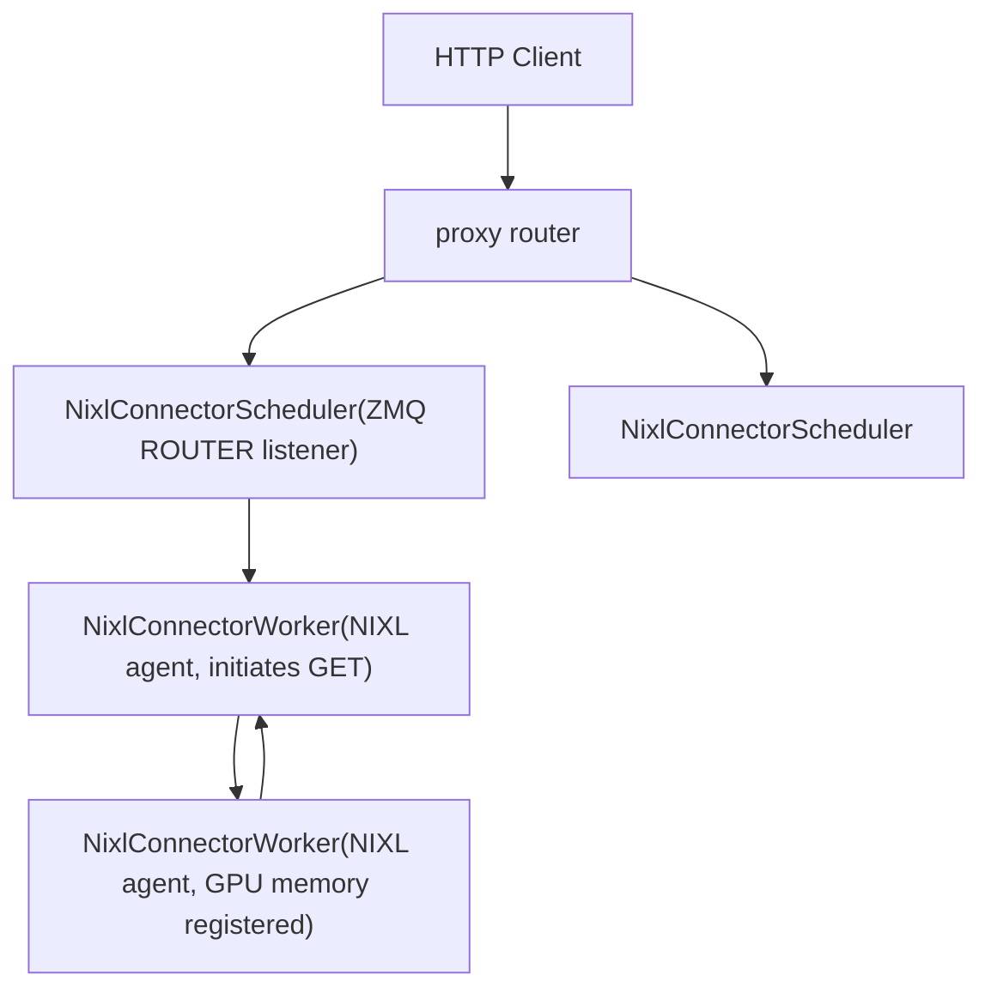
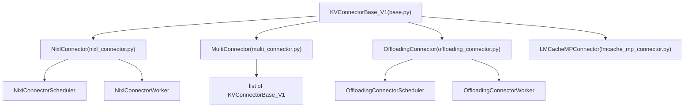
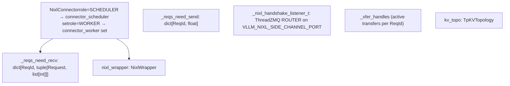

# KV Cache Transfer and Disaggregated Serving

Relevant source files

-   [docs/features/nixl\_connector\_usage.md](https://github.com/vllm-project/vllm/blob/7cc302dd/docs/features/nixl_connector_usage.md?plain=1)
-   [requirements/kv\_connectors.txt](https://github.com/vllm-project/vllm/blob/7cc302dd/requirements/kv_connectors.txt)
-   [tests/models/multimodal/generation/test\_keye.py](https://github.com/vllm-project/vllm/blob/7cc302dd/tests/models/multimodal/generation/test_keye.py)
-   [tests/models/multimodal/generation/test\_nemotron\_parse.py](https://github.com/vllm-project/vllm/blob/7cc302dd/tests/models/multimodal/generation/test_nemotron_parse.py)
-   [tests/models/multimodal/generation/test\_vit\_backend\_functionality.py](https://github.com/vllm-project/vllm/blob/7cc302dd/tests/models/multimodal/generation/test_vit_backend_functionality.py)
-   [tests/models/test\_terratorch.py](https://github.com/vllm-project/vllm/blob/7cc302dd/tests/models/test_terratorch.py)
-   [tests/v1/kv\_connector/nixl\_integration/run\_accuracy\_test.sh](https://github.com/vllm-project/vllm/blob/7cc302dd/tests/v1/kv_connector/nixl_integration/run_accuracy_test.sh)
-   [tests/v1/kv\_connector/nixl\_integration/run\_edge\_case\_test.sh](https://github.com/vllm-project/vllm/blob/7cc302dd/tests/v1/kv_connector/nixl_integration/run_edge_case_test.sh)
-   [tests/v1/kv\_connector/unit/offloading\_connector/\_\_init\_\_.py](https://github.com/vllm-project/vllm/blob/7cc302dd/tests/v1/kv_connector/unit/offloading_connector/__init__.py)
-   [tests/v1/kv\_connector/unit/offloading\_connector/conftest.py](https://github.com/vllm-project/vllm/blob/7cc302dd/tests/v1/kv_connector/unit/offloading_connector/conftest.py)
-   [tests/v1/kv\_connector/unit/offloading\_connector/test\_metrics.py](https://github.com/vllm-project/vllm/blob/7cc302dd/tests/v1/kv_connector/unit/offloading_connector/test_metrics.py)
-   [tests/v1/kv\_connector/unit/offloading\_connector/test\_scheduler.py](https://github.com/vllm-project/vllm/blob/7cc302dd/tests/v1/kv_connector/unit/offloading_connector/test_scheduler.py)
-   [tests/v1/kv\_connector/unit/offloading\_connector/test\_worker.py](https://github.com/vllm-project/vllm/blob/7cc302dd/tests/v1/kv_connector/unit/offloading_connector/test_worker.py)
-   [tests/v1/kv\_connector/unit/offloading\_connector/utils.py](https://github.com/vllm-project/vllm/blob/7cc302dd/tests/v1/kv_connector/unit/offloading_connector/utils.py)
-   [tests/v1/kv\_connector/unit/test\_backwards\_compatibility.py](https://github.com/vllm-project/vllm/blob/7cc302dd/tests/v1/kv_connector/unit/test_backwards_compatibility.py)
-   [tests/v1/kv\_connector/unit/test\_decode\_bench\_connector.py](https://github.com/vllm-project/vllm/blob/7cc302dd/tests/v1/kv_connector/unit/test_decode_bench_connector.py)
-   [tests/v1/kv\_connector/unit/test\_example\_connector.py](https://github.com/vllm-project/vllm/blob/7cc302dd/tests/v1/kv_connector/unit/test_example_connector.py)
-   [tests/v1/kv\_connector/unit/test\_lmcache\_integration.py](https://github.com/vllm-project/vllm/blob/7cc302dd/tests/v1/kv_connector/unit/test_lmcache_integration.py)
-   [tests/v1/kv\_connector/unit/test\_multi\_connector.py](https://github.com/vllm-project/vllm/blob/7cc302dd/tests/v1/kv_connector/unit/test_multi_connector.py)
-   [tests/v1/kv\_connector/unit/test\_nixl\_connector.py](https://github.com/vllm-project/vllm/blob/7cc302dd/tests/v1/kv_connector/unit/test_nixl_connector.py)
-   [tests/v1/kv\_connector/unit/utils.py](https://github.com/vllm-project/vllm/blob/7cc302dd/tests/v1/kv_connector/unit/utils.py)
-   [tests/v1/kv\_offload/test\_cpu\_gpu.py](https://github.com/vllm-project/vllm/blob/7cc302dd/tests/v1/kv_offload/test_cpu_gpu.py)
-   [vllm/distributed/kv\_transfer/kv\_connector/factory.py](https://github.com/vllm-project/vllm/blob/7cc302dd/vllm/distributed/kv_transfer/kv_connector/factory.py)
-   [vllm/distributed/kv\_transfer/kv\_connector/utils.py](https://github.com/vllm-project/vllm/blob/7cc302dd/vllm/distributed/kv_transfer/kv_connector/utils.py)
-   [vllm/distributed/kv\_transfer/kv\_connector/v1/\_\_init\_\_.py](https://github.com/vllm-project/vllm/blob/7cc302dd/vllm/distributed/kv_transfer/kv_connector/v1/__init__.py)
-   [vllm/distributed/kv\_transfer/kv\_connector/v1/base.py](https://github.com/vllm-project/vllm/blob/7cc302dd/vllm/distributed/kv_transfer/kv_connector/v1/base.py)
-   [vllm/distributed/kv\_transfer/kv\_connector/v1/decode\_bench\_connector.py](https://github.com/vllm-project/vllm/blob/7cc302dd/vllm/distributed/kv_transfer/kv_connector/v1/decode_bench_connector.py)
-   [vllm/distributed/kv\_transfer/kv\_connector/v1/example\_connector.py](https://github.com/vllm-project/vllm/blob/7cc302dd/vllm/distributed/kv_transfer/kv_connector/v1/example_connector.py)
-   [vllm/distributed/kv\_transfer/kv\_connector/v1/lmcache\_connector.py](https://github.com/vllm-project/vllm/blob/7cc302dd/vllm/distributed/kv_transfer/kv_connector/v1/lmcache_connector.py)
-   [vllm/distributed/kv\_transfer/kv\_connector/v1/lmcache\_integration/\_\_init\_\_.py](https://github.com/vllm-project/vllm/blob/7cc302dd/vllm/distributed/kv_transfer/kv_connector/v1/lmcache_integration/__init__.py)
-   [vllm/distributed/kv\_transfer/kv\_connector/v1/lmcache\_integration/multi\_process\_adapter.py](https://github.com/vllm-project/vllm/blob/7cc302dd/vllm/distributed/kv_transfer/kv_connector/v1/lmcache_integration/multi_process_adapter.py)
-   [vllm/distributed/kv\_transfer/kv\_connector/v1/lmcache\_integration/utils.py](https://github.com/vllm-project/vllm/blob/7cc302dd/vllm/distributed/kv_transfer/kv_connector/v1/lmcache_integration/utils.py)
-   [vllm/distributed/kv\_transfer/kv\_connector/v1/lmcache\_integration/vllm\_v1\_adapter.py](https://github.com/vllm-project/vllm/blob/7cc302dd/vllm/distributed/kv_transfer/kv_connector/v1/lmcache_integration/vllm_v1_adapter.py)
-   [vllm/distributed/kv\_transfer/kv\_connector/v1/lmcache\_mp\_connector.py](https://github.com/vllm-project/vllm/blob/7cc302dd/vllm/distributed/kv_transfer/kv_connector/v1/lmcache_mp_connector.py)
-   [vllm/distributed/kv\_transfer/kv\_connector/v1/multi\_connector.py](https://github.com/vllm-project/vllm/blob/7cc302dd/vllm/distributed/kv_transfer/kv_connector/v1/multi_connector.py)
-   [vllm/distributed/kv\_transfer/kv\_connector/v1/nixl\_connector.py](https://github.com/vllm-project/vllm/blob/7cc302dd/vllm/distributed/kv_transfer/kv_connector/v1/nixl_connector.py)
-   [vllm/distributed/kv\_transfer/kv\_connector/v1/offloading/worker.py](https://github.com/vllm-project/vllm/blob/7cc302dd/vllm/distributed/kv_transfer/kv_connector/v1/offloading/worker.py)
-   [vllm/distributed/kv\_transfer/kv\_connector/v1/offloading\_connector.py](https://github.com/vllm-project/vllm/blob/7cc302dd/vllm/distributed/kv_transfer/kv_connector/v1/offloading_connector.py)
-   [vllm/distributed/kv\_transfer/kv\_transfer\_state.py](https://github.com/vllm-project/vllm/blob/7cc302dd/vllm/distributed/kv_transfer/kv_transfer_state.py)
-   [vllm/model\_executor/models/nemotron\_parse.py](https://github.com/vllm-project/vllm/blob/7cc302dd/vllm/model_executor/models/nemotron_parse.py)
-   [vllm/transformers\_utils/processors/\_\_init\_\_.py](https://github.com/vllm-project/vllm/blob/7cc302dd/vllm/transformers_utils/processors/__init__.py)
-   [vllm/v1/kv\_offload/cpu/spec.py](https://github.com/vllm-project/vllm/blob/7cc302dd/vllm/v1/kv_offload/cpu/spec.py)
-   [vllm/v1/kv\_offload/spec.py](https://github.com/vllm-project/vllm/blob/7cc302dd/vllm/v1/kv_offload/spec.py)
-   [vllm/v1/kv\_offload/worker/cpu\_gpu.py](https://github.com/vllm-project/vllm/blob/7cc302dd/vllm/v1/kv_offload/worker/cpu_gpu.py)
-   [vllm/v1/outputs.py](https://github.com/vllm-project/vllm/blob/7cc302dd/vllm/v1/outputs.py)
-   [vllm/v1/worker/kv\_connector\_model\_runner\_mixin.py](https://github.com/vllm-project/vllm/blob/7cc302dd/vllm/v1/worker/kv_connector_model_runner_mixin.py)

This page documents the KV cache transfer subsystem used for disaggregated prefilling and KV offloading in vLLM v1. It covers the `KVConnectorBase_V1` abstract interface, the `NixlConnector` implementation for RDMA-based transfers, the `MultiConnector` composition wrapper, `LMCacheMPConnector`, and the `OffloadingConnector`.

For KV block management within a single instance, see [KV Cache Management and Prefix Caching](/vllm-project/vllm/3.4-kv-cache-management-and-prefix-caching). For the scheduler that produces `SchedulerOutput` consumed here, see [Scheduler and Resource Allocation](/vllm-project/vllm/3.3-scheduler-and-resource-allocation). For ZMQ/shared memory communication primitives used by the side channel, see [Communication Infrastructure](/vllm-project/vllm/9.2-communication-infrastructure).

---

## Disaggregated Prefilling Concept

Disaggregated prefilling separates the **prefill** and **decode** phases of LLM inference onto different vLLM instances. A **prefiller** (producer) runs the prompt through the model to compute KV cache blocks, then transfers those blocks over the network to a **decoder** (consumer) that proceeds directly to token generation.

A proxy server orchestrates requests: it first sends the prompt to a prefiller, then forwards the completed request (with KV transfer metadata attached) to a decoder.

**Architecture:**

Sources: [vllm/distributed/kv\_transfer/kv\_connector/v1/nixl\_connector.py515-851](https://github.com/vllm-project/vllm/blob/7cc302dd/vllm/distributed/kv_transfer/kv_connector/v1/nixl_connector.py#L515-L851) [docs/features/nixl\_connector\_usage.md1-115](https://github.com/vllm-project/vllm/blob/7cc302dd/docs/features/nixl_connector_usage.md?plain=1#L1-L115)

**Key benefits:**

-   TTFT and ITL can be tuned independently by assigning different parallelism configs to each instance type.
-   Decode instances avoid prefill-decode interference, reducing tail ITL.
-   KV blocks move directly between GPU VRAM regions via RDMA (NIXL/UCX), bypassing CPU when possible.

---

## Connector Interface: `KVConnectorBase_V1`

All connectors implement the abstract class `KVConnectorBase_V1` defined in [vllm/distributed/kv\_transfer/kv\_connector/v1/base.py170-608](https://github.com/vllm-project/vllm/blob/7cc302dd/vllm/distributed/kv_transfer/kv_connector/v1/base.py#L170-L608) The interface enforces a strict split between methods that run in the **scheduler process** and methods that run in **worker processes**.

**Class hierarchy:**

Sources: [vllm/distributed/kv\_transfer/kv\_connector/v1/base.py170-608](https://github.com/vllm-project/vllm/blob/7cc302dd/vllm/distributed/kv_transfer/kv_connector/v1/base.py#L170-L608) [vllm/distributed/kv\_transfer/kv\_connector/v1/multi\_connector.py126-178](https://github.com/vllm-project/vllm/blob/7cc302dd/vllm/distributed/kv_transfer/kv_connector/v1/multi_connector.py#L126-L178) [vllm/distributed/kv\_transfer/kv\_connector/v1/offloading\_connector.py44-65](https://github.com/vllm-project/vllm/blob/7cc302dd/vllm/distributed/kv_transfer/kv_connector/v1/offloading_connector.py#L44-L65)

### Connector Roles

`KVConnectorRole` is an enum with two values. Each connector is instantiated separately for each role [vllm/distributed/kv\_transfer/kv\_connector/v1/base.py123-129](https://github.com/vllm-project/vllm/blob/7cc302dd/vllm/distributed/kv_transfer/kv_connector/v1/base.py#L123-L129):

| Role | Where It Runs | Responsibilities |
| --- | --- | --- |
| `KVConnectorRole.SCHEDULER` | Scheduler process | Request tracking, metadata assembly, block hold/release decisions. |
| `KVConnectorRole.WORKER` | Each GPU worker process | Memory registration, async transfers, transfer status polling. |

### Scheduler-Side API

| Method | Signature | Purpose |
| --- | --- | --- |
| `get_num_new_matched_tokens` | `(request, num_computed_tokens) → (int|None, bool)` | Returns count of tokens loadable from external KV cache and whether load is async [vllm/distributed/kv\_transfer/kv\_connector/v1/base.py215-227](https://github.com/vllm-project/vllm/blob/7cc302dd/vllm/distributed/kv_transfer/kv_connector/v1/base.py#L215-L227) |
| `update_state_after_alloc` | `(request, blocks, num_external_tokens)` | Called after block allocation; connector records which blocks need loading/saving [vllm/distributed/kv\_transfer/kv\_connector/v1/base.py229-239](https://github.com/vllm-project/vllm/blob/7cc302dd/vllm/distributed/kv_transfer/kv_connector/v1/base.py#L229-L239) |
| `build_connector_meta` | `(scheduler_output) → KVConnectorMetadata` | Assembles per-step metadata for workers; resets internal pending state [vllm/distributed/kv\_transfer/kv\_connector/v1/base.py241-250](https://github.com/vllm-project/vllm/blob/7cc302dd/vllm/distributed/kv_transfer/kv_connector/v1/base.py#L241-L250) |
| `request_finished` | `(request, block_ids) → (bool, dict|None)` | Called once when request completes; returns `(delay_free, kv_transfer_params)` [vllm/distributed/kv\_transfer/kv\_connector/v1/base.py259-281](https://github.com/vllm-project/vllm/blob/7cc302dd/vllm/distributed/kv_transfer/kv_connector/v1/base.py#L259-L281) |

### Worker-Side API

| Method | Purpose |
| --- | --- |
| `register_kv_caches(kv_caches)` | Called at startup with per-layer KV tensors; registers GPU memory [vllm/distributed/kv\_transfer/kv\_connector/v1/base.py291-297](https://github.com/vllm-project/vllm/blob/7cc302dd/vllm/distributed/kv_transfer/kv_connector/v1/base.py#L291-L297) |
| `register_cross_layers_kv_cache(kv_cache, attn_backend)` | Alternative for cross-layer contiguous tensor [vllm/distributed/kv\_transfer/kv\_connector/v1/base.py299-307](https://github.com/vllm-project/vllm/blob/7cc302dd/vllm/distributed/kv_transfer/kv_connector/v1/base.py#L299-L307) |
| `start_load_kv(forward_context)` | Initiates async KV transfers (non-blocking) [vllm/distributed/kv\_transfer/kv\_connector/v1/base.py321-331](https://github.com/vllm-project/vllm/blob/7cc302dd/vllm/distributed/kv_transfer/kv_connector/v1/base.py#L321-L331) |
| `wait_for_layer_load(layer_name)` | Blocks until a given layer's KV is loaded [vllm/distributed/kv\_transfer/kv\_connector/v1/base.py333-337](https://github.com/vllm-project/vllm/blob/7cc302dd/vllm/distributed/kv_transfer/kv_connector/v1/base.py#L333-L337) |
| `save_kv_layer(layer_name, kv_layer, attn_metadata)` | Saves a layer's KV to the connector [vllm/distributed/kv\_transfer/kv\_connector/v1/base.py339-354](https://github.com/vllm-project/vllm/blob/7cc302dd/vllm/distributed/kv_transfer/kv_connector/v1/base.py#L339-L354) |
| `wait_for_save()` | Blocks until all in-progress saves complete [vllm/distributed/kv\_transfer/kv\_connector/v1/base.py356-361](https://github.com/vllm-project/vllm/blob/7cc302dd/vllm/distributed/kv_transfer/kv_connector/v1/base.py#L356-L361) |
| `get_finished(finished_req_ids) → (set, set)` | Returns `(finished_sending, finished_recving)` request ID sets [vllm/distributed/kv\_transfer/kv\_connector/v1/base.py363-376](https://github.com/vllm-project/vllm/blob/7cc302dd/vllm/distributed/kv_transfer/kv_connector/v1/base.py#L363-L376) |

---

## `KVConnectorFactory`

`KVConnectorFactory` in [vllm/distributed/kv\_transfer/kv\_connector/factory.py27-140](https://github.com/vllm-project/vllm/blob/7cc302dd/vllm/distributed/kv_transfer/kv_connector/factory.py#L27-L140) maintains a string-keyed registry of connector classes, loaded lazily via module path.

**Pre-registered connectors:**

| Name | Module | Primary Use |
| --- | --- | --- |
| `NixlConnector` | `vllm.distributed.kv_transfer.kv_connector.v1.nixl_connector` | Disaggregated prefilling (RDMA). |
| `MultiConnector` | `vllm.distributed.kv_transfer.kv_connector.v1.multi_connector` | Compose multiple connectors. |
| `OffloadingConnector` | `vllm.distributed.kv_transfer.kv_connector.v1.offloading_connector` | CPU KV offloading. |
| `LMCacheMPConnector` | `vllm.distributed.kv_transfer.kv_connector.v1.lmcache_mp_connector` | LMCache multiprocessing. |

The factory checks whether the connector supports the Hybrid Memory Allocator (`SupportsHMA`) [vllm/distributed/kv\_transfer/kv\_connector/factory.py56-63](https://github.com/vllm-project/vllm/blob/7cc302dd/vllm/distributed/kv_transfer/kv_connector/factory.py#L56-L63) If HMA is enabled and the connector does not implement `SupportsHMA`, creation fails.

---

## `NixlConnector`

`NixlConnector` in [vllm/distributed/kv\_transfer/kv\_connector/v1/nixl\_connector.py854-950](https://github.com/vllm-project/vllm/blob/7cc302dd/vllm/distributed/kv_transfer/kv_connector/v1/nixl_connector.py#L854-L950) is the primary connector for production disaggregated prefilling. It uses the NIXL library (`nixl._api.nixl_agent` on CUDA, `rixl._api.nixl_agent` on ROCm) for RDMA-style GPU memory transfer.

### Internal Structure

Sources: [vllm/distributed/kv\_transfer/kv\_connector/v1/nixl\_connector.py440-480](https://github.com/vllm-project/vllm/blob/7cc302dd/vllm/distributed/kv_transfer/kv_connector/v1/nixl_connector.py#L440-L480) [vllm/distributed/kv\_transfer/kv\_connector/v1/nixl\_connector.py854-950](https://github.com/vllm-project/vllm/blob/7cc302dd/vllm/distributed/kv_transfer/kv_connector/v1/nixl_connector.py#L854-L950)

### `NixlConnectorScheduler`

Runs in the scheduler process. Tracks request state across scheduling steps.

**`request_finished(request, block_ids)`** [vllm/distributed/kv\_transfer/kv\_connector/v1/nixl\_connector.py783-851](https://github.com/vllm-project/vllm/blob/7cc302dd/vllm/distributed/kv_transfer/kv_connector/v1/nixl_connector.py#L783-L851):

-   If `do_remote_decode=True` and status is `FINISHED_LENGTH_CAPPED`: adds to `_reqs_need_send`.
-   Returns `(True, kv_transfer_params)` where `kv_transfer_params` contains `remote_block_ids`, `remote_engine_id`, `remote_request_id`, `remote_host`, `remote_port`, and `tp_size`.

The ZMQ listener (`_nixl_handshake_listener`) is a daemon thread that starts once `set_xfer_handshake_metadata()` is called [vllm/distributed/kv\_transfer/kv\_connector/v1/nixl\_connector.py600-640](https://github.com/vllm-project/vllm/blob/7cc302dd/vllm/distributed/kv_transfer/kv_connector/v1/nixl_connector.py#L600-L640) It serves `NixlHandshakePayload` to connecting decoder workers.

### `NixlConnectorWorker`

Runs in each GPU worker process. Manages the NIXL agent and executes async block transfers.

**`register_kv_caches(kv_caches)`** [vllm/distributed/kv\_transfer/kv\_connector/v1/nixl\_connector.py1162-1240](https://github.com/vllm-project/vllm/blob/7cc302dd/vllm/distributed/kv_transfer/kv_connector/v1/nixl_connector.py#L1162-L1240):

1.  Calls `nixl_wrapper.get_reg_descs()` on each KV cache tensor.
2.  Calls `nixl_wrapper.register_memory()` to pin the memory regions.
3.  Computes `xfer_handshake_metadata` (`NixlHandshakePayload`) for the scheduler to serve to remote workers.

---

## NIXL Handshake Protocol

Before blocks can be transferred, the decoder worker must register the prefiller's NIXL agent. This handshake is initiated lazily on first transfer to a given engine.

> **[Mermaid sequence]**
> *(图表结构无法解析)*

Sources: [vllm/distributed/kv\_transfer/kv\_connector/v1/nixl\_connector.py600-636](https://github.com/vllm-project/vllm/blob/7cc302dd/vllm/distributed/kv_transfer/kv_connector/v1/nixl_connector.py#L600-L636) [vllm/distributed/kv\_transfer/kv\_connector/v1/nixl\_connector.py1060-1160](https://github.com/vllm-project/vllm/blob/7cc302dd/vllm/distributed/kv_transfer/kv_connector/v1/nixl_connector.py#L1060-L1160)

### Compatibility and Versioning

`NIXL_CONNECTOR_VERSION` (currently 2) is used to compute a `compatibility_hash` [vllm/distributed/kv\_transfer/kv\_connector/v1/nixl\_connector.py94-191](https://github.com/vllm-project/vllm/blob/7cc302dd/vllm/distributed/kv_transfer/kv_connector/v1/nixl_connector.py#L94-L191) This hash includes vLLM version, model architecture, and KV head counts to ensure prefill and decode instances are interoperable.

---

## `MultiConnector`

`MultiConnector` in [vllm/distributed/kv\_transfer/kv\_connector/v1/multi\_connector.py126-385](https://github.com/vllm-project/vllm/blob/7cc302dd/vllm/distributed/kv_transfer/kv_connector/v1/multi_connector.py#L126-L385) composes an ordered list of `KVConnectorBase_V1` instances.

**Load routing:**

-   `get_num_new_matched_tokens()` queries all connectors in order; the **first** with nonzero tokens is recorded in `_requests_to_connector[request_id]` [vllm/distributed/kv\_transfer/kv\_connector/v1/multi\_connector.py204-226](https://github.com/vllm-project/vllm/blob/7cc302dd/vllm/distributed/kv_transfer/kv_connector/v1/multi_connector.py#L204-L226)
-   `update_state_after_alloc()` forwards to the chosen connector.

**Save routing:**

-   `save_kv_layer()` and `wait_for_save()` are forwarded to **all** sub-connectors [vllm/distributed/kv\_transfer/kv\_connector/v1/multi\_connector.py246-285](https://github.com/vllm-project/vllm/blob/7cc302dd/vllm/distributed/kv_transfer/kv_connector/v1/multi_connector.py#L246-L285)

---

## `OffloadingConnector`

`OffloadingConnector` in [vllm/distributed/kv\_transfer/kv\_connector/v1/offloading\_connector.py44-172](https://github.com/vllm-project/vllm/blob/7cc302dd/vllm/distributed/kv_transfer/kv_connector/v1/offloading_connector.py#L44-L172) offloads KV blocks from GPU to CPU within a **single instance**.

| Component | Role |
| --- | --- |
| `OffloadingConnectorScheduler` | Tracks which block hashes are offloaded; responds to `get_num_new_matched_tokens()` [vllm/distributed/kv\_transfer/kv\_connector/v1/offloading/scheduler.py](https://github.com/vllm-project/vllm/blob/7cc302dd/vllm/distributed/kv_transfer/kv_connector/v1/offloading/scheduler.py) |
| `OffloadingConnectorWorker` | Executes GPU↔CPU copies via CUDA streams [vllm/distributed/kv\_transfer/kv\_connector/v1/offloading/worker.py](https://github.com/vllm-project/vllm/blob/7cc302dd/vllm/distributed/kv_transfer/kv_connector/v1/offloading/worker.py) |

---

## Integration with Model Runner

`KVConnectorModelRunnerMixin` in [vllm/v1/worker/kv\_connector\_model\_runner\_mixin.py11-125](https://github.com/vllm-project/vllm/blob/7cc302dd/vllm/v1/worker/kv_connector_model_runner_mixin.py#L11-L125) integrates the connector into `GPUModelRunner.execute_model()`.

**Per-step lifecycle:**

> **[Mermaid sequence]**
> *(图表结构无法解析)*

The context manager `_get_kv_connector_output()` encapsulates this lifecycle [vllm/v1/worker/kv\_connector\_model\_runner\_mixin.py93-125](https://github.com/vllm-project/vllm/blob/7cc302dd/vllm/v1/worker/kv_connector_model_runner_mixin.py#L93-L125) `KVOutputAggregator` in [vllm/distributed/kv\_transfer/kv\_connector/utils.py50-155](https://github.com/vllm-project/vllm/blob/7cc302dd/vllm/distributed/kv_transfer/kv_connector/utils.py#L50-L155) merges `KVConnectorOutput` from all TP workers before returning to the scheduler.

---

## Metrics and Observability

| Class | Location | Purpose |
| --- | --- | --- |
| `KVConnectorStats` | `metrics.py:44-46` | Base dataclass for transfer stats. |
| `NixlKVConnectorStats` | `nixl_connector.py:421-423` | NIXL telemetry: duration, bytes, descriptor count. |
| `MultiKVConnectorStats` | `multi_connector.py:70-83` | Aggregates stats from multiple connectors. |

Sources: [vllm/distributed/kv\_transfer/kv\_connector/v1/metrics.py44-46](https://github.com/vllm-project/vllm/blob/7cc302dd/vllm/distributed/kv_transfer/kv_connector/v1/metrics.py#L44-L46) [vllm/distributed/kv\_transfer/kv\_connector/v1/nixl\_connector.py421-423](https://github.com/vllm-project/vllm/blob/7cc302dd/vllm/distributed/kv_transfer/kv_connector/v1/nixl_connector.py#L421-L423) [vllm/distributed/kv\_transfer/kv\_connector/v1/multi\_connector.py70-83](https://github.com/vllm-project/vllm/blob/7cc302dd/vllm/distributed/kv_transfer/kv_connector/v1/multi_connector.py#L70-L83)
