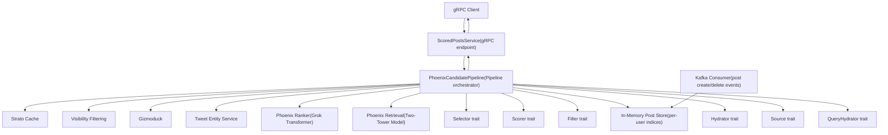
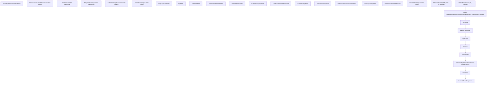
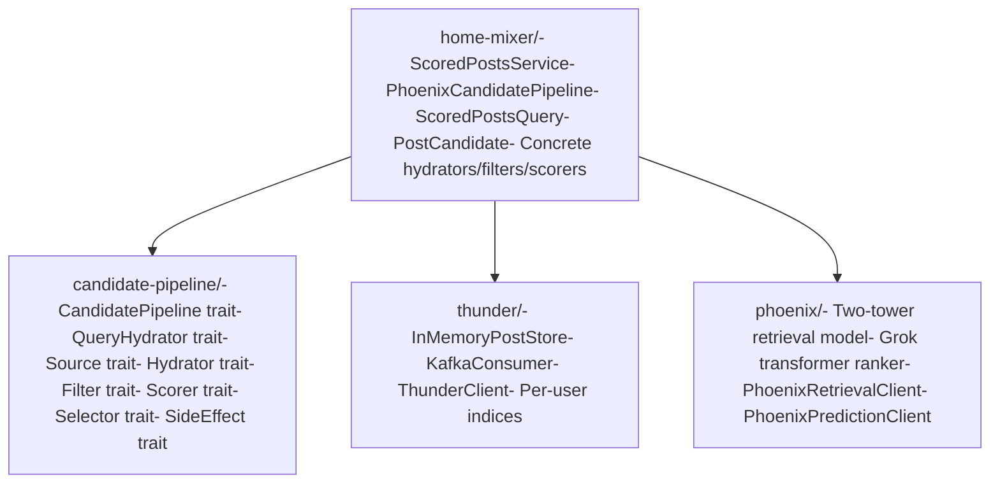

# Overview

Relevant source files

-   [README.md](https://github.com/xai-org/x-algorithm/blob/aaa167b3/README.md?plain=1)

This document provides a high-level introduction to the X Algorithm repository, which implements the "For You" feed recommendation system. It explains the purpose, architectural components, and system organization at a conceptual level.

For details on specific subsystems, see:

-   Framework internals: [Candidate Pipeline Framework](/xai-org/x-algorithm/3-candidate-pipeline-framework)
-   Home Mixer implementation details: [Home Mixer Implementation](/xai-org/x-algorithm/4-home-mixer-implementation)
-   External service integration patterns: [External Services Integration](/xai-org/x-algorithm/5-external-services-integration)
-   Development setup and configuration: [Quick Start](/xai-org/x-algorithm/1.1-quick-start)

## System Purpose

The X Algorithm repository contains the core recommendation engine that powers the "For You" feed on X (formerly Twitter). The system retrieves, ranks, and filters posts from two distinct sources:

| Source Type | Component | Purpose |
| --- | --- | --- |
| **In-Network** | Thunder | Posts from accounts the user follows |
| **Out-of-Network** | Phoenix Retrieval | ML-discovered posts from the global corpus |

Both candidate sets are merged, enriched with metadata, filtered for eligibility, and scored using a Grok-based transformer model that predicts user engagement probabilities. The final feed is a ranked list of posts optimized for relevance to the individual user.

**Sources:** [README.md1-36](https://github.com/xai-org/x-algorithm/blob/aaa167b3/README.md?plain=1#L1-L36)

## Architectural Components

The system is composed of four major subsystems:

### Home Mixer

**Location:** [home-mixer/](https://github.com/xai-org/x-algorithm/blob/aaa167b3/home-mixer/)

The orchestration layer that implements the `ScoredPostsService` gRPC endpoint. Home Mixer instantiates and executes the `PhoenixCandidatePipeline`, which coordinates all stages of candidate retrieval, enrichment, filtering, scoring, and selection. It integrates with external services through client abstractions and returns the final ranked feed to the client.

**Key Types:**

-   `ScoredPostsQuery` - Request query object containing user ID and context
-   `PostCandidate` - Candidate post with enriched metadata and scores
-   `PhoenixCandidatePipeline` - Main pipeline orchestrator

**Sources:** [README.md128-146](https://github.com/xai-org/x-algorithm/blob/aaa167b3/README.md?plain=1#L128-L146)

### Thunder

**Location:** [thunder/](https://github.com/xai-org/x-algorithm/blob/aaa167b3/thunder/)

A real-time in-memory post store that maintains recent posts from all users. Thunder consumes post create/delete events from Kafka and provides sub-millisecond lookups for in-network content. It maintains separate per-user stores for:

-   Original posts
-   Replies and reposts
-   Video posts

Posts are automatically trimmed based on a configurable retention period. When a user requests their feed, Thunder retrieves posts from all accounts they follow without querying external databases.

**Sources:** [README.md149-161](https://github.com/xai-org/x-algorithm/blob/aaa167b3/README.md?plain=1#L149-L161)

### Phoenix

**Location:** [phoenix/](https://github.com/xai-org/x-algorithm/blob/aaa167b3/phoenix/)

The ML subsystem with two primary functions:

**1\. Retrieval (Two-Tower Model)**

Discovers relevant out-of-network posts through similarity search:

-   **User Tower:** Encodes user features and engagement history into an embedding vector
-   **Candidate Tower:** Encodes all posts into embedding vectors
-   **Similarity Search:** Returns top-K posts via dot product similarity

**2\. Ranking (Grok Transformer)**

Predicts engagement probabilities for candidate posts:

-   Input: User context (engagement history) + candidate posts
-   Architecture: Transformer with candidate isolation attention masking
-   Output: Probabilities for multiple action types (favorite, reply, repost, click, etc.)

The candidate isolation mechanism ensures that each post's score is computed independently of other posts in the batch, enabling score consistency and caching.

**Sources:** [README.md164-183](https://github.com/xai-org/x-algorithm/blob/aaa167b3/README.md?plain=1#L164-L183)

### Candidate Pipeline Framework

**Location:** [candidate-pipeline/](https://github.com/xai-org/x-algorithm/blob/aaa167b3/candidate-pipeline/)

A generic, reusable framework for building recommendation pipelines. It defines trait-based abstractions for each stage of candidate processing:

| Trait | Purpose | Execution Mode |
| --- | --- | --- |
| `QueryHydrator<Q>` | Enrich query with user context | Parallel |
| `Source<Q,C>` | Retrieve candidate sets | Parallel |
| `Hydrator<Q,C>` | Enrich candidates with metadata | Parallel |
| `Filter<Q,C>` | Remove ineligible candidates | Sequential |
| `Scorer<Q,C>` | Assign scores to candidates | Sequential |
| `Selector<Q,C>` | Sort and select top-K | Sequential |
| `SideEffect<Q,C>` | Async operations (logging, caching) | Async |

The framework handles parallelization, error handling, and execution orchestration, allowing implementations to focus purely on business logic.

**Sources:** [README.md186-202](https://github.com/xai-org/x-algorithm/blob/aaa167b3/README.md?plain=1#L186-L202)

## High-Level System Architecture

The following diagram illustrates how the major components interact to serve a "For You" feed request:


**Description:** This architecture shows the request flow from client to ranked feed response. Home Mixer's `ScoredPostsService` receives the gRPC request and delegates to `PhoenixCandidatePipeline`, which implements the generic framework traits. The pipeline queries Thunder for in-network posts and Phoenix for out-of-network posts, enriches candidates via external services, and uses the Phoenix ranker for scoring. Thunder maintains its state through real-time Kafka ingestion.

**Sources:** [README.md38-122](https://github.com/xai-org/x-algorithm/blob/aaa167b3/README.md?plain=1#L38-L122) [README.md126-202](https://github.com/xai-org/x-algorithm/blob/aaa167b3/README.md?plain=1#L126-L202)

## Pipeline Execution Flow

The following diagram shows the sequential stages of request processing within the `PhoenixCandidatePipeline`:


**Description:** This flowchart traces the transformation of data through the pipeline stages. The query is first hydrated with user context, then candidates are retrieved in parallel from Thunder and Phoenix. Candidates are enriched with metadata through parallel hydrators, filtered sequentially to remove ineligible content, scored sequentially by multiple scorers, and finally the top-K are selected and validated through post-selection filters.

**Sources:** [README.md206-239](https://github.com/xai-org/x-algorithm/blob/aaa167b3/README.md?plain=1#L206-L239)

## Code Organization

The repository is organized into distinct crates that map to the architectural components:


**Description:** The codebase is organized into four main directories. The `candidate-pipeline/` crate defines generic traits for building recommendation systems. The `home-mixer/` crate provides the concrete implementation for the "For You" feed, including the pipeline orchestrator and all stage implementations. The `thunder/` and `phoenix/` crates provide the data and ML services that Home Mixer depends on.

**Sources:** [README.md7-22](https://github.com/xai-org/x-algorithm/blob/aaa167b3/README.md?plain=1#L7-L22) [README.md128-202](https://github.com/xai-org/x-algorithm/blob/aaa167b3/README.md?plain=1#L128-L202)

## Request Processing Summary

A typical request follows this pattern:

1.  **Client Request:** gRPC call to `ScoredPostsService` with user ID and context
2.  **Query Enrichment:** Fetch user engagement history and features
3.  **Candidate Retrieval:**
    -   Thunder returns recent posts from followed accounts (in-network)
    -   Phoenix Retrieval returns similar posts from global corpus (out-of-network)
4.  **Enrichment:** Parallel hydration of candidate metadata (author info, media, visibility)
5.  **Pre-Scoring Filter:** Remove duplicates, old posts, blocked authors, muted keywords
6.  **Scoring:**
    -   Phoenix ranker predicts engagement probabilities
    -   Weighted scorer combines predictions into final score
    -   Diversity scorer attenuates repeated authors
7.  **Selection:** Sort by score, select top K candidates
8.  **Post-Selection Validation:** Final visibility filtering and conversation deduplication
9.  **Response:** Return ranked list of posts to client

**Sources:** [README.md206-298](https://github.com/xai-org/x-algorithm/blob/aaa167b3/README.md?plain=1#L206-L298)

## Scoring Mechanism

The Phoenix ranker produces predictions for multiple engagement types:

| Predicted Action | Weight Direction | Purpose |
| --- | --- | --- |
| `P(favorite)` | Positive | Indicates user will like the post |
| `P(reply)` | Positive | Indicates user will engage deeply |
| `P(repost)` | Positive | Indicates user finds content valuable |
| `P(quote)` | Positive | Indicates user wants to share with commentary |
| `P(click)` | Positive | Indicates user interest in detail view |
| `P(video_view)` | Positive | Indicates video content engagement |
| `P(share)` | Positive | Indicates external sharing intent |
| `P(follow_author)` | Positive | Indicates discovery of valuable creator |
| `P(not_interested)` | Negative | Indicates content irrelevance |
| `P(block_author)` | Negative | Indicates strong content rejection |
| `P(mute_author)` | Negative | Indicates author fatigue |
| `P(report)` | Negative | Indicates policy-violating content |

The `WeightedScorer` combines these predictions using configurable weights:

```
weighted_score = Σ (weight_i × P(action_i))
```
Positive actions increase the score, while negative actions decrease it, pushing down content the user would likely reject.

**Sources:** [README.md242-272](https://github.com/xai-org/x-algorithm/blob/aaa167b3/README.md?plain=1#L242-L272)

## Key Design Principles

### No Hand-Engineered Features

The system relies entirely on the Grok-based transformer to learn relevance patterns from user engagement sequences. There are no manually crafted relevance features, which significantly reduces complexity in data pipelines and serving infrastructure.

### Candidate Isolation During Ranking

The transformer uses special attention masking that prevents candidates from attending to each other during inference. Each candidate only attends to the user context (engagement history). This ensures a candidate's score is independent of which other candidates are in the batch, enabling score consistency and caching.

### Trait-Based Composability

The `candidate-pipeline` framework uses Rust traits to define interfaces for each pipeline stage. This provides:

-   **Separation of concerns:** Pipeline execution logic is separate from business logic
-   **Parallel execution:** Independent stages (sources, hydrators) run in parallel
-   **Easy extension:** New stages can be added by implementing traits
-   **Testability:** Stages can be tested in isolation with mock implementations

### Multi-Action Prediction

Rather than predicting a single "relevance" score, the model predicts probabilities for many distinct actions. This enables:

-   **Richer signals:** Different engagement types carry different value
-   **Configurable optimization:** Weights can be tuned per action type
-   **Negative feedback:** Explicit modeling of rejection signals (block, mute, report)

**Sources:** [README.md300-322](https://github.com/xai-org/x-algorithm/blob/aaa167b3/README.md?plain=1#L300-L322)

## Related Documentation

For implementation details and subsystem deep-dives, refer to:

-   **Framework design:** [Candidate Pipeline Framework](/xai-org/x-algorithm/3-candidate-pipeline-framework)
-   **Pipeline stages:** [Pipeline Execution Model](/xai-org/x-algorithm/3.1-pipeline-execution-model) through [SideEffect Trait](/xai-org/x-algorithm/3.8-sideeffect-trait)
-   **Home Mixer specifics:** [Phoenix Candidate Pipeline](/xai-org/x-algorithm/4.1-phoenix-candidate-pipeline), [Data Models](/xai-org/x-algorithm/4.2-data-models)
-   **Candidate sources:** [Thunder Source](/xai-org/x-algorithm/4.3.1-thunder-source), [Phoenix Retrieval Source](/xai-org/x-algorithm/4.3.2-phoenix-retrieval-source)
-   **Enrichment:** [Query Hydrators](/xai-org/x-algorithm/4.4-query-hydrators), [Candidate Hydrators](/xai-org/x-algorithm/4.5-candidate-hydrators)
-   **Filtering:** [Filters](/xai-org/x-algorithm/4.6-filters)
-   **Scoring:** [Phoenix Scorer](/xai-org/x-algorithm/4.7.1-phoenix-scorer), [Weighted Scorer](/xai-org/x-algorithm/4.7.2-weighted-scorer)
-   **External services:** [Client Architecture](/xai-org/x-algorithm/5.1-client-architecture) through [Strato and Other Services](/xai-org/x-algorithm/5.7-strato-and-other-services)

**Sources:** [README.md1-326](https://github.com/xai-org/x-algorithm/blob/aaa167b3/README.md?plain=1#L1-L326)
