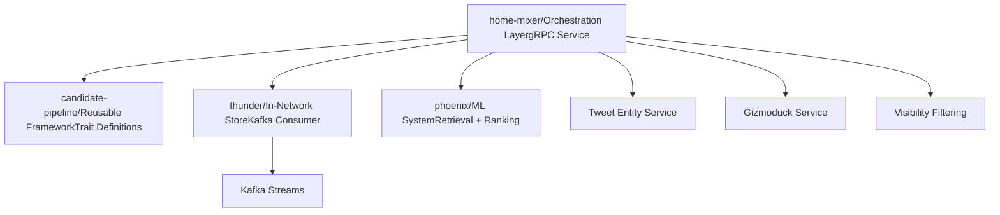

# Quick Start

Relevant source files

-   [.gitignore](https://github.com/xai-org/x-algorithm/blob/aaa167b3/.gitignore)
-   [README.md](https://github.com/xai-org/x-algorithm/blob/aaa167b3/README.md?plain=1)

This guide helps developers set up, navigate, and understand the X Algorithm repository structure. It provides an overview of the project organization, key components, and how to begin working with the codebase.

For detailed architectural information, see [Architecture](/xai-org/x-algorithm/2-architecture). For specific component implementations, see [Home Mixer Implementation](/xai-org/x-algorithm/4-home-mixer-implementation).

---

## Purpose and Scope

This page covers:

-   Repository structure and organization
-   Location of major components and their purposes
-   Key code entities and where to find them
-   How components map to the overall architecture
-   Navigation guidance for developers new to the codebase

This is an orientation guide. For deployment and operational details, refer to component-specific documentation.

Sources: [README.md1-326](https://github.com/xai-org/x-algorithm/blob/aaa167b3/README.md?plain=1#L1-L326)

---

## Repository Overview

The X Algorithm repository implements the "For You" feed recommendation system using a modular architecture. The codebase is organized into four primary subsystems, each in its own directory.

### High-Level Structure

**Directory Structure**

| Directory | Purpose | Key Entities |
| --- | --- | --- |
| `home-mixer/` | Feed orchestration and gRPC service endpoint | `ScoredPostsService`, `PhoenixCandidatePipeline` |
| `candidate-pipeline/` | Generic pipeline framework with reusable traits | `CandidatePipeline`, `Source`, `Hydrator`, `Filter`, `Scorer`, `Selector` |
| `thunder/` | Real-time in-network post store with Kafka ingestion | `ThunderSource`, `ThunderClient`, per-user stores |
| `phoenix/` | ML-based retrieval and ranking using Grok transformer | `PhoenixRetrievalClient`, `PhoenixPredictionClient`, two-tower model |

Sources: [README.md126-202](https://github.com/xai-org/x-algorithm/blob/aaa167b3/README.md?plain=1#L126-L202)

---

## Component Locations and Code Mapping

The following diagram maps high-level system concepts to their actual code locations, making it easier to navigate the repository.

```mermaid
flowchart TD
    SPS["ScoredPostsService(gRPC Endpoint)"]
    PCP["PhoenixCandidatePipeline(Pipeline Implementation)"]
    SPQ["ScoredPostsQuery(Query Structure)"]
    PC["PostCandidate(Candidate Structure)"]
    TS["ThunderSource(In-Network)"]
    PS["PhoenixSource(Out-of-Network)"]
    CDCH["CoreDataCandidateHydrator"]
    GH["GizmoduckHydrator"]
    VFH["VFCandidateHydrator"]
    AF["AgeFilter"]
    ASF["AuthorSocialgraphFilter"]
    DDF["DropDuplicatesFilter"]
    PhS["PhoenixScorer"]
    WS["WeightedScorer"]
    ADS["AuthorDiversityScorer"]
    TKS["TopKScoreSelector"]
    CPT["CandidatePipeline(Trait Definition)"]
    QHT["QueryHydrator<Q>"]
    ST["Source<Q,C>"]
    HT["Hydrator<Q,C>"]
    FT["Filter<Q,C>"]
    ScT["Scorer<Q,C>"]
    SelT["Selector<Q,C>"]
    SET["SideEffect<Q,C>"]
    TC["ThunderClient(Query Interface)"]
    KI["Kafka Ingestion(Event Consumer)"]
    UPS["Per-User Stores(In-Memory)"]
    PRC["PhoenixRetrievalClient(Two-Tower Model)"]
    PPC["PhoenixPredictionClient(Grok Transformer)"]
    UT["User Tower"]
    CT["Candidate Tower"]

    SPS --> PCP
    PCP --> CPT
    TS --> ST
    PS --> ST
    CDCH --> HT
    AF --> FT
    PhS --> ScT
    TKS --> SelT
    PCP --> SPQ
    PCP --> PC
    TS --> TC
    PS --> PRC
    PhS --> PPC
    TC --> UPS
    KI --> UPS
    PRC --> UT
    PRC --> CT
```

Sources: [README.md128-202](https://github.com/xai-org/x-algorithm/blob/aaa167b3/README.md?plain=1#L128-L202)

---

## Key Subsystems

### home-mixer/

**Purpose:** Orchestration layer that assembles the For You feed by implementing the candidate pipeline framework.

**Key Components:**

-   `ScoredPostsService` - gRPC endpoint that handles client requests
-   `PhoenixCandidatePipeline` - Concrete pipeline implementation using `PostCandidate` and `ScoredPostsQuery` types
-   Query hydrators (e.g., `UserActionSeqQueryHydrator`, `UserFeaturesQueryHydrator`)
-   Candidate sources (`ThunderSource`, `PhoenixSource`)
-   Candidate hydrators (`CoreDataCandidateHydrator`, `GizmoduckHydrator`, `VFCandidateHydrator`, etc.)
-   Filters (`AgeFilter`, `AuthorSocialgraphFilter`, `DropDuplicatesFilter`, etc.)
-   Scorers (`PhoenixScorer`, `WeightedScorer`, `AuthorDiversityScorer`, `OONScorer`)
-   Selector (`TopKScoreSelector`)

**Entry Point:** The `ScoredPostsService` gRPC service receives requests and invokes the pipeline.

Sources: [README.md128-146](https://github.com/xai-org/x-algorithm/blob/aaa167b3/README.md?plain=1#L128-L146)

### candidate-pipeline/

**Purpose:** Reusable framework providing trait-based abstractions for building recommendation pipelines.

**Core Traits:**

| Trait | Type Parameters | Purpose |
| --- | --- | --- |
| `CandidatePipeline` | `Q`, `C` | Orchestrates pipeline execution across all stages |
| `QueryHydrator` | `Q` | Enriches query with user context |
| `Source` | `Q`, `C` | Retrieves initial candidate sets |
| `Hydrator` | `Q`, `C` | Enriches candidates with additional data |
| `Filter` | `Q`, `C` | Removes ineligible candidates |
| `Scorer` | `Q`, `C` | Assigns scores to candidates |
| `Selector` | `Q`, `C` | Sorts and selects top-K candidates |
| `SideEffect` | `Q`, `C` | Executes async operations without blocking |

**Usage Pattern:** Home Mixer implements these traits with concrete types (`Q=ScoredPostsQuery`, `C=PostCandidate`).

For detailed trait specifications, see [Candidate Pipeline Framework](/xai-org/x-algorithm/3-candidate-pipeline-framework).

Sources: [README.md186-202](https://github.com/xai-org/x-algorithm/blob/aaa167b3/README.md?plain=1#L186-L202)

### thunder/

**Purpose:** In-memory post store for real-time in-network content with Kafka-based ingestion.

**Functionality:**

-   Consumes post create/delete events from Kafka streams
-   Maintains per-user stores for different post types (original posts, replies/reposts, video posts)
-   Serves in-network candidates from followed accounts
-   Automatically trims posts older than retention period
-   Provides sub-millisecond lookup performance

**Client Interface:** `ThunderClient` provides the query interface used by `ThunderSource`.

For Thunder architecture details, see [Thunder Source](/xai-org/x-algorithm/4.3.1-thunder-source).

Sources: [README.md149-161](https://github.com/xai-org/x-algorithm/blob/aaa167b3/README.md?plain=1#L149-L161)

### phoenix/

**Purpose:** ML system providing both retrieval (two-tower model) and ranking (Grok transformer).

**Two Main Functions:**

1.  **Retrieval (Two-Tower Model)**

    -   `User Tower` - Encodes user features and engagement history
    -   `Candidate Tower` - Encodes post content into embeddings
    -   Similarity search finds top-K out-of-network posts via dot product
    -   Client interface: `PhoenixRetrievalClient`
2.  **Ranking (Grok Transformer)**

    -   Predicts engagement probabilities for multiple actions (like, reply, repost, etc.)
    -   Uses candidate isolation attention masking (candidates cannot attend to each other)
    -   Enables consistent, cacheable scores
    -   Client interface: `PhoenixPredictionClient`

For Phoenix architecture details, see [Phoenix ML Services](/xai-org/x-algorithm/5.5-phoenix-ml-services) and [Phoenix Scorer](/xai-org/x-algorithm/4.7.1-phoenix-scorer).

Sources: [README.md164-183](https://github.com/xai-org/x-algorithm/blob/aaa167b3/README.md?plain=1#L164-L183)

---

## Understanding the Pipeline Flow

The following table maps pipeline stages to their implementations and locations:

| Stage | Implementation Location | Key Classes/Traits | Purpose |
| --- | --- | --- | --- |
| **Query Hydration** | `home-mixer/` | `UserActionSeqQueryHydrator`, `UserFeaturesQueryHydrator` | Fetch user engagement history and features |
| **Candidate Sourcing** | `home-mixer/` | `ThunderSource`, `PhoenixSource` | Retrieve in-network and out-of-network candidates |
| **Candidate Hydration** | `home-mixer/` | `CoreDataCandidateHydrator`, `GizmoduckHydrator`, `VFCandidateHydrator`, etc. | Enrich candidates with metadata |
| **Pre-Scoring Filtering** | `home-mixer/` | `AgeFilter`, `DropDuplicatesFilter`, `AuthorSocialgraphFilter`, etc. | Remove ineligible candidates |
| **Scoring** | `home-mixer/` | `PhoenixScorer`, `WeightedScorer`, `AuthorDiversityScorer` | Predict engagement and compute final scores |
| **Selection** | `home-mixer/` | `TopKScoreSelector` | Sort by score and select top K |
| **Post-Selection** | `home-mixer/` | `VFFilter`, `DedupConversationFilter` | Final validation and deduplication |

For detailed execution flow, see [Data Flow and Execution Model](/xai-org/x-algorithm/2.2-data-flow-and-execution-model).

Sources: [README.md207-239](https://github.com/xai-org/x-algorithm/blob/aaa167b3/README.md?plain=1#L207-L239)

---

## Data Models

The pipeline operates on two primary data structures:

### ScoredPostsQuery

The query object containing user context and request parameters. This is enriched during the query hydration phase with:

-   User ID and client context
-   User engagement history (action sequence)
-   Following list and user features
-   Previously seen/served post IDs
-   Bloom filters for efficient lookups

For detailed structure, see [ScoredPostsQuery](/xai-org/x-algorithm/4.2.1-scoredpostsquery).

### PostCandidate

The candidate object representing a post as it flows through the pipeline. Progressive enrichment adds:

-   Core tweet data (text, author ID, media)
-   Author information (username, follower count)
-   Phoenix scores (engagement probabilities)
-   Weighted final score
-   Metadata (video duration, subscription status, visibility reason)

For detailed structure, see [PostCandidate](/xai-org/x-algorithm/4.2.2-postcandidate).

Sources: [README.md128-146](https://github.com/xai-org/x-algorithm/blob/aaa167b3/README.md?plain=1#L128-L146)

---

## Navigating the Codebase

### By Use Case

**I want to understand how candidates are retrieved:**

-   Start with `home-mixer/` → `ThunderSource` and `PhoenixSource`
-   See [Candidate Sources](/xai-org/x-algorithm/4.3-candidate-sources)

**I want to understand the ML models:**

-   Start with `phoenix/` → `PhoenixRetrievalClient` and `PhoenixPredictionClient`
-   See [Phoenix ML Services](/xai-org/x-algorithm/5.5-phoenix-ml-services) and [Phoenix Scorer](/xai-org/x-algorithm/4.7.1-phoenix-scorer)

**I want to understand how filtering works:**

-   Start with `home-mixer/` → filter implementations
-   See [Filters](/xai-org/x-algorithm/4.6-filters)

**I want to understand the scoring logic:**

-   Start with `home-mixer/` → `PhoenixScorer`, `WeightedScorer`
-   See [Scorers](/xai-org/x-algorithm/4.7-scorers)

**I want to build a new pipeline stage:**

-   Start with `candidate-pipeline/` → trait definitions
-   See [Candidate Pipeline Framework](/xai-org/x-algorithm/3-candidate-pipeline-framework)

### By Component Type

**Framework Abstractions:** `candidate-pipeline/`

-   Generic traits: `Source`, `Hydrator`, `Filter`, `Scorer`, `Selector`, `SideEffect`
-   Pipeline orchestration: `CandidatePipeline`

**Concrete Implementations:** `home-mixer/`

-   All pipeline stage implementations
-   Data models: `ScoredPostsQuery`, `PostCandidate`
-   Service endpoint: `ScoredPostsService`

**Data Sources:** `thunder/`, `phoenix/`

-   In-network store: `thunder/`
-   ML services: `phoenix/`

Sources: [README.md1-326](https://github.com/xai-org/x-algorithm/blob/aaa167b3/README.md?plain=1#L1-L326)

---

## Pipeline Execution Overview

Understanding the execution model helps navigate the code:

> **[Mermaid sequence]**
> *(图表结构无法解析)*

**Execution Characteristics:**

-   **Parallel:** Query hydrators, sources, candidate hydrators run concurrently
-   **Sequential:** Filters and scorers run in order (each depends on previous stage)
-   **Error Handling:** Configurable per stage (fail-open vs fail-closed)
-   **Side Effects:** Execute asynchronously without blocking response

For detailed execution semantics, see [Pipeline Execution Model](/xai-org/x-algorithm/3.1-pipeline-execution-model).

Sources: [README.md207-239](https://github.com/xai-org/x-algorithm/blob/aaa167b3/README.md?plain=1#L207-L239)

---

## Next Steps

After familiarizing yourself with the repository structure, explore specific areas:

**To understand the architecture:**

-   [Architecture](/xai-org/x-algorithm/2-architecture) - System components and design
-   [Data Flow and Execution Model](/xai-org/x-algorithm/2.2-data-flow-and-execution-model) - How data transforms through stages

**To work with the pipeline framework:**

-   [Candidate Pipeline Framework](/xai-org/x-algorithm/3-candidate-pipeline-framework) - Generic trait definitions
-   [Pipeline Execution Model](/xai-org/x-algorithm/3.1-pipeline-execution-model) - Orchestration and error handling

**To implement or modify pipeline stages:**

-   [Phoenix Candidate Pipeline](/xai-org/x-algorithm/4.1-phoenix-candidate-pipeline) - Concrete implementation
-   [Candidate Sources](/xai-org/x-algorithm/4.3-candidate-sources) - Thunder and Phoenix retrieval
-   [Filters](/xai-org/x-algorithm/4.6-filters) - Pre-scoring and post-selection filtering
-   [Scorers](/xai-org/x-algorithm/4.7-scorers) - ML predictions and score composition

**To understand external integrations:**

-   [External Services Integration](/xai-org/x-algorithm/5-external-services-integration) - Client architecture and service abstractions

Sources: [README.md1-326](https://github.com/xai-org/x-algorithm/blob/aaa167b3/README.md?plain=1#L1-L326)
