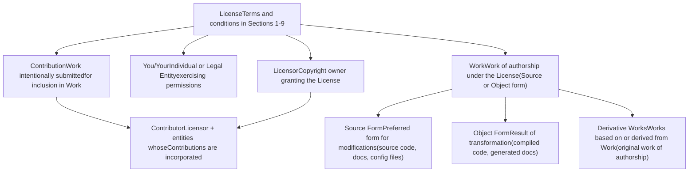
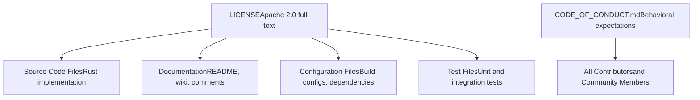
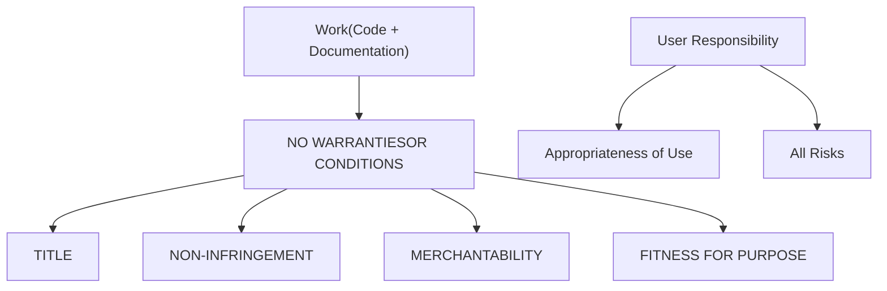
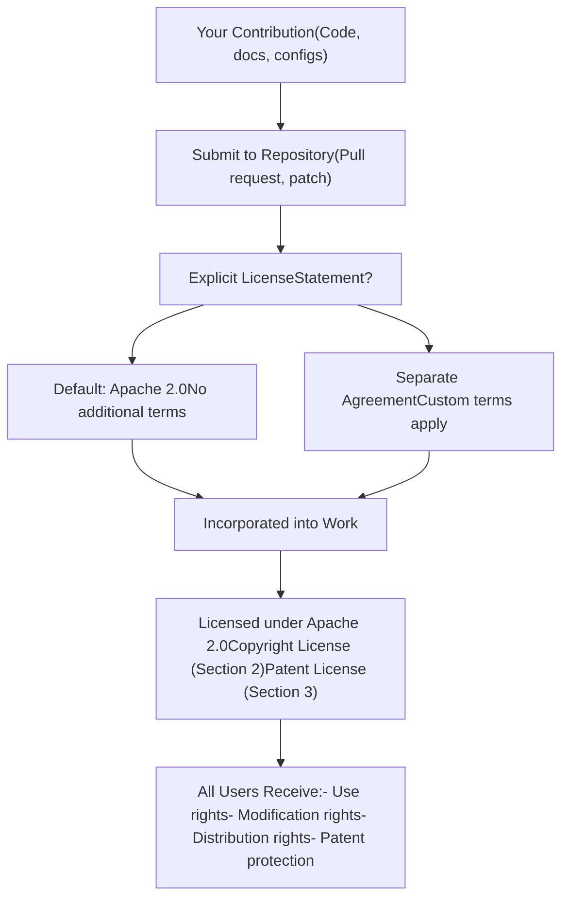

# License and Code of Conduct

Relevant source files

-   [CODE\_OF\_CONDUCT.md](https://github.com/xai-org/x-algorithm/blob/aaa167b3/CODE_OF_CONDUCT.md?plain=1)
-   [LICENSE](https://github.com/xai-org/x-algorithm/blob/aaa167b3/LICENSE)

## Purpose and Scope

This page documents the licensing terms and community behavioral expectations for the X Algorithm repository. All source code, documentation, and associated materials in this repository are released under the Apache License 2.0. The Code of Conduct establishes community standards for contributors and users.

For information about getting started with the codebase and development environment setup, see [Quick Start](/xai-org/x-algorithm/1.1-quick-start). For architectural details about the systems covered by this license, see [Overview](/xai-org/x-algorithm/1-overview) and [Architecture](/xai-org/x-algorithm/2-architecture).

---

## Apache License 2.0

The X Algorithm repository is licensed under the Apache License, Version 2.0. This is a permissive open-source license that grants broad rights to use, modify, and distribute the software while providing patent protection and limiting liability.

### License Overview

The Apache 2.0 license provides the following core permissions and protections:

| Permission/Protection | Description |
| --- | --- |
| **Use** | Freedom to use the software for any purpose |
| **Modification** | Right to modify and create derivative works |
| **Distribution** | Right to distribute original and modified versions |
| **Sublicensing** | Ability to sublicense derivative works |
| **Patent Grant** | Express patent license from contributors |
| **No Warranty** | Software provided "AS IS" without warranties |
| **Limited Liability** | Contributors not liable for damages |

**Sources:** [LICENSE1-202](https://github.com/xai-org/x-algorithm/blob/aaa167b3/LICENSE#L1-L202)

### Key Definitions

The license defines several important terms that govern its application:


**Sources:** [LICENSE7-64](https://github.com/xai-org/x-algorithm/blob/aaa167b3/LICENSE#L7-L64)

### Scope of Licensed Materials

The Apache 2.0 license applies to all materials in the X Algorithm repository:


**Sources:** [LICENSE1-202](https://github.com/xai-org/x-algorithm/blob/aaa167b3/LICENSE#L1-L202) [CODE\_OF\_CONDUCT.md1-2](https://github.com/xai-org/x-algorithm/blob/aaa167b3/CODE_OF_CONDUCT.md?plain=1#L1-L2)

### Grant of Copyright License

Each contributor grants users a perpetual, worldwide, non-exclusive, royalty-free, irrevocable copyright license with the following rights:

-   **Reproduce** - Make copies of the Work
-   **Prepare Derivative Works** - Create modified versions
-   **Publicly Display** - Show the Work publicly
-   **Publicly Perform** - Execute or demonstrate the Work
-   **Sublicense** - Grant rights to others
-   **Distribute** - Share the Work and Derivative Works in Source or Object form

These rights apply to both the original Work and any Derivative Works you create.

**Sources:** [LICENSE66-71](https://github.com/xai-org/x-algorithm/blob/aaa167b3/LICENSE#L66-L71)

### Grant of Patent License

In addition to copyright permissions, each contributor grants a patent license:

-   **Scope**: Perpetual, worldwide, non-exclusive, royalty-free, irrevocable patent license
-   **Rights**: Make, use, offer to sell, sell, import, and transfer the Work
-   **Coverage**: Patent claims necessarily infringed by the Contribution alone or in combination with the Work
-   **Termination Clause**: Patent licenses terminate if you file patent litigation alleging the Work infringes

This patent grant protects users from patent claims by contributors regarding their contributions.

**Sources:** [LICENSE73-87](https://github.com/xai-org/x-algorithm/blob/aaa167b3/LICENSE#L73-L87)

### Redistribution Requirements

When redistributing the Work or Derivative Works, you must comply with these conditions:

| Requirement | Description | Reference |
| --- | --- | --- |
| **Include License** | Provide recipients a copy of the Apache 2.0 License | [LICENSE94-95](https://github.com/xai-org/x-algorithm/blob/aaa167b3/LICENSE#L94-L95) |
| **Notice of Changes** | Mark modified files with prominent change notices | [LICENSE97-98](https://github.com/xai-org/x-algorithm/blob/aaa167b3/LICENSE#L97-L98) |
| **Retain Notices** | Keep copyright, patent, trademark, and attribution notices from Source form | [LICENSE100-104](https://github.com/xai-org/x-algorithm/blob/aaa167b3/LICENSE#L100-L104) |
| **Include NOTICE** | If present, include readable copy of NOTICE file attributions | [LICENSE106-121](https://github.com/xai-org/x-algorithm/blob/aaa167b3/LICENSE#L106-L121) |
| **Optional Attribution** | May add your own attribution notices alongside original | [LICENSE117-121](https://github.com/xai-org/x-algorithm/blob/aaa167b3/LICENSE#L117-L121) |

You may add your own copyright statement and license terms for your modifications, provided they comply with the Apache 2.0 license conditions for the original Work.

**Sources:** [LICENSE89-128](https://github.com/xai-org/x-algorithm/blob/aaa167b3/LICENSE#L89-L128)

### Contribution Submission and Licensing

> **[Mermaid sequence]**
> *(图表结构无法解析)*

**Default License Terms**: Unless you explicitly state otherwise, any Contribution intentionally submitted for inclusion in the Work is automatically licensed under Apache 2.0 without additional terms or conditions.

**Sources:** [LICENSE130-136](https://github.com/xai-org/x-algorithm/blob/aaa167b3/LICENSE#L130-L136)

### Trademark Restrictions

The Apache 2.0 license does **not** grant permission to use:

-   Trade names
-   Trademarks
-   Service marks
-   Product names of the Licensor

Exception: Trademark use is permitted only for reasonable and customary description of the Work's origin and reproducing NOTICE file content.

**Sources:** [LICENSE138-141](https://github.com/xai-org/x-algorithm/blob/aaa167b3/LICENSE#L138-L141)

### Warranty Disclaimer

The Work is provided on an **"AS IS" BASIS**, with the following disclaimers:


**User Responsibility**: You are solely responsible for determining the appropriateness of using or redistributing the Work and assume all risks associated with exercising permissions under this License.

**Sources:** [LICENSE143-151](https://github.com/xai-org/x-algorithm/blob/aaa167b3/LICENSE#L143-L151)

### Limitation of Liability

Contributors have limited liability under the following terms:

| Scenario | Liability Limit |
| --- | --- |
| **Tort Claims** | No liability unless required by law (deliberate/grossly negligent acts) |
| **Contract Claims** | No liability unless agreed in writing |
| **Damage Types** | No liability for direct, indirect, special, incidental, or consequential damages |
| **Specific Damages** | Includes loss of goodwill, work stoppage, computer failure, commercial damages |
| **Notice Requirement** | Limitation applies even if Contributor was advised of possibility of damages |

**Sources:** [LICENSE153-163](https://github.com/xai-org/x-algorithm/blob/aaa167b3/LICENSE#L153-L163)

### Accepting Additional Liability

While redistributing the Work or Derivative Works:

-   **Optional**: You may choose to offer support, warranty, indemnity, or other liability obligations
-   **Requirement**: Such obligations must be consistent with the Apache 2.0 License
-   **Responsibility**: You act on your own behalf and sole responsibility
-   **Indemnification**: You must indemnify and hold other Contributors harmless for any liability incurred from your acceptance of additional obligations

**Sources:** [LICENSE165-174](https://github.com/xai-org/x-algorithm/blob/aaa167b3/LICENSE#L165-L174)

---

## Code of Conduct

The X Algorithm repository maintains a simple, direct Code of Conduct:

> **Be excellent to each other.**

This principle establishes the foundation for all community interactions, including:

-   Contributions and code reviews
-   Issue discussions and feature requests
-   Documentation improvements
-   Community support and collaboration

Contributors and community members are expected to engage respectfully and constructively in all project-related activities.

**Sources:** [CODE\_OF\_CONDUCT.md1-2](https://github.com/xai-org/x-algorithm/blob/aaa167b3/CODE_OF_CONDUCT.md?plain=1#L1-L2)

---

## Applying the License to Contributions

### How the License Applies to Your Work

When contributing to the X Algorithm repository, the Apache License automatically applies through the following mechanism:


**Sources:** [LICENSE130-136](https://github.com/xai-org/x-algorithm/blob/aaa167b3/LICENSE#L130-L136) [LICENSE66-87](https://github.com/xai-org/x-algorithm/blob/aaa167b3/LICENSE#L66-L87)

### Copyright Notice Template

The LICENSE file includes an appendix with a recommended copyright notice template for applying the license to your work:

```
Copyright [yyyy] [name of copyright owner]

Licensed under the Apache License, Version 2.0 (the "License");
you may not use this file except in compliance with the License.
You may obtain a copy of the License at

    http://www.apache.org/licenses/LICENSE-2.0

Unless required by applicable law or agreed to in writing, software
distributed under the License is distributed on an "AS IS" BASIS,
WITHOUT WARRANTIES OR CONDITIONS OF ANY KIND, either express or implied.
See the License for the specific language governing permissions and
limitations under the License.
```
This notice should be placed in the appropriate comment syntax for each file format.

**Sources:** [LICENSE178-201](https://github.com/xai-org/x-algorithm/blob/aaa167b3/LICENSE#L178-L201)

---

## Summary: Key Rights and Obligations

### Rights Granted to Users

| Right | Scope | Source Section |
| --- | --- | --- |
| **Use** | Any purpose, commercial or non-commercial | Section 2 |
| **Modify** | Create derivative works | Section 2 |
| **Distribute** | Share original or modified versions | Section 2 |
| **Sublicense** | Grant rights to downstream users | Section 2 |
| **Patent Use** | Use without patent litigation risk from contributors | Section 3 |

### Obligations When Redistributing

| Obligation | Requirement | Source Section |
| --- | --- | --- |
| **License Copy** | Include Apache 2.0 license text | Section 4(a) |
| **Change Notices** | Mark modified files with notices | Section 4(b) |
| **Attribution** | Retain copyright and attribution notices | Section 4(c) |
| **NOTICE File** | Include NOTICE file if present | Section 4(d) |

### Disclaimers and Limitations

| Protection | Meaning | Source Section |
| --- | --- | --- |
| **No Warranty** | Software provided "AS IS" | Section 7 |
| **No Liability** | Contributors not liable for damages | Section 8 |
| **No Trademark Rights** | Cannot use Licensor's trademarks | Section 6 |

**Sources:** [LICENSE1-202](https://github.com/xai-org/x-algorithm/blob/aaa167b3/LICENSE#L1-L202)
