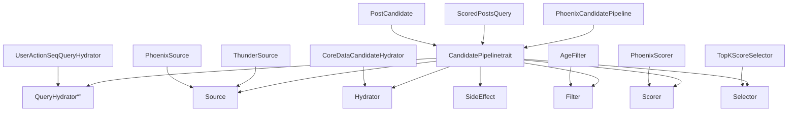
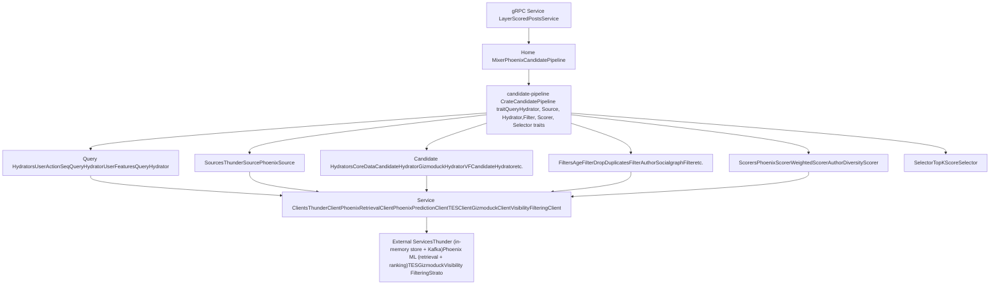
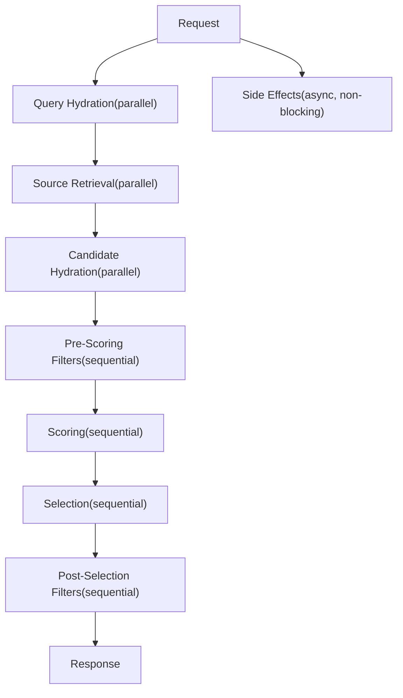

# Architecture

Relevant source files

-   [README.md](https://github.com/xai-org/x-algorithm/blob/aaa167b3/README.md?plain=1)
-   [candidate-pipeline/lib.rs](https://github.com/xai-org/x-algorithm/blob/aaa167b3/candidate-pipeline/lib.rs)
-   [home-mixer/candidate\_pipeline/mod.rs](https://github.com/xai-org/x-algorithm/blob/aaa167b3/home-mixer/candidate_pipeline/mod.rs)

## Purpose and Scope

This page provides a comprehensive architectural overview of the X Algorithm recommendation system, focusing on the framework-based design, component relationships, and system topology. For implementation details of specific components, see [System Components](/xai-org/x-algorithm/2.1-system-components). For execution flow and data transformation patterns, see [Data Flow and Execution Model](/xai-org/x-algorithm/2.2-data-flow-and-execution-model). For detailed trait specifications, see [Candidate Pipeline Framework](/xai-org/x-algorithm/3-candidate-pipeline-framework). For the concrete Home Mixer implementation, see [Home Mixer Implementation](/xai-org/x-algorithm/4-home-mixer-implementation).

## Architectural Approach

The X Algorithm system is built on a **framework-based architecture** that separates generic recommendation pipeline abstractions from domain-specific implementations. This design achieves:

-   **Modularity**: Each pipeline stage (source, hydrator, filter, scorer) is independently implemented
-   **Reusability**: The `candidate-pipeline` framework can be used for different recommendation systems
-   **Testability**: Trait-based abstractions enable easy mocking and testing
-   **Parallel Execution**: Independent stages execute concurrently for performance
-   **Type Safety**: Generic type parameters enforce compile-time correctness

The system consists of three major layers:

| Layer | Purpose | Key Components |
| --- | --- | --- |
| **Orchestration** | Request handling and pipeline coordination | `home-mixer`, gRPC service endpoints |
| **Framework** | Generic pipeline execution and trait definitions | `candidate-pipeline` crate |
| **Services** | Candidate sources and external data providers | Thunder, Phoenix ML, TES, Gizmoduck |

Sources: [README.md38-124](https://github.com/xai-org/x-algorithm/blob/aaa167b3/README.md?plain=1#L38-L124) [candidate-pipeline/lib.rs1-10](https://github.com/xai-org/x-algorithm/blob/aaa167b3/candidate-pipeline/lib.rs#L1-L10)

## Framework-Based Design

### Generic Trait System

The architecture is built on a trait-based abstraction layer defined in the `candidate-pipeline` crate. Each pipeline stage is represented by a trait with generic type parameters for queries (`Q`) and candidates (`C`).

**Trait-Based Architecture Mapping Code Entities to Framework**

The generic framework traits are defined in:

-   `QueryHydrator`: [candidate-pipeline/query\_hydrator.rs](https://github.com/xai-org/x-algorithm/blob/aaa167b3/candidate-pipeline/query_hydrator.rs)
-   `Source`: [candidate-pipeline/source.rs](https://github.com/xai-org/x-algorithm/blob/aaa167b3/candidate-pipeline/source.rs)
-   `Hydrator`: [candidate-pipeline/hydrator.rs](https://github.com/xai-org/x-algorithm/blob/aaa167b3/candidate-pipeline/hydrator.rs)
-   `Filter`: [candidate-pipeline/filter.rs](https://github.com/xai-org/x-algorithm/blob/aaa167b3/candidate-pipeline/filter.rs)
-   `Scorer`: [candidate-pipeline/scorer.rs](https://github.com/xai-org/x-algorithm/blob/aaa167b3/candidate-pipeline/scorer.rs)
-   `Selector`: [candidate-pipeline/selector.rs](https://github.com/xai-org/x-algorithm/blob/aaa167b3/candidate-pipeline/selector.rs)
-   `SideEffect`: [candidate-pipeline/side\_effect.rs](https://github.com/xai-org/x-algorithm/blob/aaa167b3/candidate-pipeline/side_effect.rs)

The Home Mixer implementation provides concrete types and implementations in [home-mixer/candidate\_pipeline/](https://github.com/xai-org/x-algorithm/blob/aaa167b3/home-mixer/candidate_pipeline/)

Sources: [candidate-pipeline/lib.rs1-10](https://github.com/xai-org/x-algorithm/blob/aaa167b3/candidate-pipeline/lib.rs#L1-L10) [home-mixer/candidate\_pipeline/mod.rs1-6](https://github.com/xai-org/x-algorithm/blob/aaa167b3/home-mixer/candidate_pipeline/mod.rs#L1-L6) [README.md186-202](https://github.com/xai-org/x-algorithm/blob/aaa167b3/README.md?plain=1#L186-L202)

## System Topology

### Major Components and Dependencies

The following diagram shows the primary components, their responsibilities, and inter-component dependencies:

```mermaid
flowchart TD
    GrpcClient["gRPC Client"]
    SPS["ScoredPostsServicegRPC endpoint"]
    PCP["PhoenixCandidatePipelineCandidatePipeline impl"]
    UASQH["UserActionSeqQueryHydrator"]
    UFQH["UserFeaturesQueryHydrator"]
    ThunderSrc["ThunderSourceSource<ScoredPostsQuery, PostCandidate>"]
    PhoenixSrc["PhoenixSourceSource<ScoredPostsQuery, PostCandidate>"]
    CoreHyd["CoreDataCandidateHydrator"]
    GizmoHyd["GizmoduckHydrator"]
    VFHyd["VFCandidateHydrator"]
    VideoHyd["VideoDurationCandidateHydrator"]
    SubHyd["SubscriptionHydrator"]
    InNetHyd["InNetworkCandidateHydrator"]
    DupFlt["DropDuplicatesFilter"]
    AgeFlt["AgeFilter"]
    SelfFlt["SelfTweetFilter"]
    SeenFlt["PreviouslySeenPostsFilter"]
    MuteKwFlt["MutedKeywordFilter"]
    SgFlt["AuthorSocialgraphFilter"]
    PhxScorer["PhoenixScorer"]
    WgtScorer["WeightedScorer"]
    DivScorer["AuthorDiversityScorer"]
    OONScorer["OONScorer"]
    TopK["TopKScoreSelector"]
    ThunderStore["In-Memory Post Storeper-user buckets"]
    KafkaConsumer["Kafka Consumerpost events"]
    PhxRetrieval["Phoenix RetrievalTwo-Tower Model"]
    PhxRanking["Phoenix RankingGrok Transformer"]
    TES["Tweet Entity Service"]
    Gizmoduck["Gizmoduck Service"]
    VFService["Visibility Filtering"]
    UserActionSvc["User Action Service"]
    Strato["Strato Cache"]
    Kafka["Kafka"]

    GrpcClient --> SPS
    SPS --> PCP
    PCP --> UASQH
    PCP --> UFQH
    PCP --> ThunderSrc
    PCP --> PhoenixSrc
    PCP --> CoreHyd
    PCP --> GizmoHyd
    PCP --> VFHyd
    PCP --> VideoHyd
    PCP --> SubHyd
    PCP --> InNetHyd
    PCP --> DupFlt
    PCP --> AgeFlt
    PCP --> SelfFlt
    PCP --> SeenFlt
    PCP --> MuteKwFlt
    PCP --> SgFlt
    PCP --> PhxScorer
    PCP --> WgtScorer
    PCP --> DivScorer
    PCP --> OONScorer
    PCP --> TopK
    UASQH --> UserActionSvc
    ThunderSrc --> ThunderStore
    PhoenixSrc --> PhxRetrieval
    CoreHyd --> TES
    GizmoHyd --> Gizmoduck
    VFHyd --> VFService
    VideoHyd --> TES
    SubHyd --> TES
    PhxScorer --> PhxRanking
    PCP --> Strato
    KafkaConsumer --> Kafka
    KafkaConsumer --> ThunderStore
    SPS --> GrpcClient
```

**System Topology with Code Entity Names**

Sources: [README.md38-124](https://github.com/xai-org/x-algorithm/blob/aaa167b3/README.md?plain=1#L38-L124) [README.md126-147](https://github.com/xai-org/x-algorithm/blob/aaa167b3/README.md?plain=1#L126-L147) [home-mixer/candidate\_pipeline/mod.rs1-6](https://github.com/xai-org/x-algorithm/blob/aaa167b3/home-mixer/candidate_pipeline/mod.rs#L1-L6)

### Component Responsibilities

| Component | File Location | Responsibilities |
| --- | --- | --- |
| **PhoenixCandidatePipeline** | [home-mixer/candidate\_pipeline/phoenix\_candidate\_pipeline.rs](https://github.com/xai-org/x-algorithm/blob/aaa167b3/home-mixer/candidate_pipeline/phoenix_candidate_pipeline.rs) | Pipeline orchestration, stage execution, error handling |
| **ThunderSource** | [home-mixer/candidate\_pipeline/sources/thunder\_source.rs](https://github.com/xai-org/x-algorithm/blob/aaa167b3/home-mixer/candidate_pipeline/sources/thunder_source.rs) | Retrieve in-network posts from Thunder's in-memory store |
| **PhoenixSource** | [home-mixer/candidate\_pipeline/sources/phoenix\_source.rs](https://github.com/xai-org/x-algorithm/blob/aaa167b3/home-mixer/candidate_pipeline/sources/phoenix_source.rs) | Retrieve out-of-network posts via two-tower model |
| **CoreDataCandidateHydrator** | [home-mixer/candidate\_pipeline/hydrators/core\_data.rs](https://github.com/xai-org/x-algorithm/blob/aaa167b3/home-mixer/candidate_pipeline/hydrators/core_data.rs) | Fetch tweet metadata (text, author, media) from TES |
| **GizmoduckHydrator** | [home-mixer/candidate\_pipeline/hydrators/gizmoduck.rs](https://github.com/xai-org/x-algorithm/blob/aaa167b3/home-mixer/candidate_pipeline/hydrators/gizmoduck.rs) | Fetch user profile data (followers, screen names) |
| **AgeFilter** | [home-mixer/candidate\_pipeline/filters/age\_filter.rs](https://github.com/xai-org/x-algorithm/blob/aaa167b3/home-mixer/candidate_pipeline/filters/age_filter.rs) | Remove posts older than maximum age threshold |
| **PhoenixScorer** | [home-mixer/candidate\_pipeline/scorers/phoenix\_scorer.rs](https://github.com/xai-org/x-algorithm/blob/aaa167b3/home-mixer/candidate_pipeline/scorers/phoenix_scorer.rs) | Get ML predictions from Grok transformer |
| **WeightedScorer** | [home-mixer/candidate\_pipeline/scorers/weighted\_scorer.rs](https://github.com/xai-org/x-algorithm/blob/aaa167b3/home-mixer/candidate_pipeline/scorers/weighted_scorer.rs) | Combine predictions into weighted relevance score |
| **TopKScoreSelector** | [home-mixer/candidate\_pipeline/selectors/top\_k.rs](https://github.com/xai-org/x-algorithm/blob/aaa167b3/home-mixer/candidate_pipeline/selectors/top_k.rs) | Sort by score and select top K candidates |

Sources: [README.md126-147](https://github.com/xai-org/x-algorithm/blob/aaa167b3/README.md?plain=1#L126-L147) [home-mixer/candidate\_pipeline/mod.rs1-6](https://github.com/xai-org/x-algorithm/blob/aaa167b3/home-mixer/candidate_pipeline/mod.rs#L1-L6)

## Component Layering

The system follows a layered architecture with clear separation of concerns:

**Layered Architecture**

| Layer | Responsibilities | Characteristics |
| --- | --- | --- |
| **1\. Request/Response** | Handle gRPC requests, serialize/deserialize | Protocol-specific, thin |
| **2\. Orchestration** | Coordinate pipeline execution, manage state | Business logic orchestration |
| **3\. Framework** | Define pipeline abstractions, execution model | Generic, reusable, testable |
| **4\. Domain Logic** | Implement concrete stage behavior | Domain-specific, pluggable |
| **5\. Client Abstractions** | Abstract external service communication | Mockable, dependency-injected |
| **6\. External Services** | Provide data and ML predictions | Independent services |

Sources: [README.md38-124](https://github.com/xai-org/x-algorithm/blob/aaa167b3/README.md?plain=1#L38-L124) [candidate-pipeline/lib.rs1-10](https://github.com/xai-org/x-algorithm/blob/aaa167b3/candidate-pipeline/lib.rs#L1-L10)

## Execution Model Overview

The pipeline execution follows a **multi-phase sequential process** where each phase may execute its internal operations in parallel:

**Pipeline Execution Phases**

### Parallel vs Sequential Execution

| Phase | Execution Mode | Rationale |
| --- | --- | --- |
| **Query Hydration** | Parallel | Hydrators are independent; fetch user data concurrently |
| **Source Retrieval** | Parallel | Thunder and Phoenix sources are independent |
| **Candidate Hydration** | Parallel | Hydrators enrich different fields independently |
| **Pre-Scoring Filters** | Sequential | Each filter depends on previous filters' output |
| **Scoring** | Sequential | Scorers may depend on previous scores (e.g., diversity attenuation) |
| **Selection** | Sequential | Sorts and selects top-K from scored candidates |
| **Post-Selection Filters** | Sequential | Final validation on selected candidates |
| **Side Effects** | Async | Non-blocking operations that don't affect response |

For detailed data flow and transformation patterns, see [Data Flow and Execution Model](/xai-org/x-algorithm/2.2-data-flow-and-execution-model).

Sources: [README.md205-239](https://github.com/xai-org/x-algorithm/blob/aaa167b3/README.md?plain=1#L205-L239)

## Code Organization

The codebase is organized into crates that map directly to architectural layers:

**Codebase Structure Mapping to Architecture**

### Module Mapping Table

| Architectural Component | Crate/Module Path | Key Files |
| --- | --- | --- |
| **Framework Traits** | `candidate-pipeline/` | `lib.rs`, trait files |
| **Pipeline Implementation** | `home-mixer/candidate_pipeline/` | `phoenix_candidate_pipeline.rs` |
| **Data Models** | `home-mixer/candidate_pipeline/` | `query.rs`, `candidate.rs`, `*_features.rs` |
| **Sources** | `home-mixer/candidate_pipeline/sources/` | `thunder_source.rs`, `phoenix_source.rs` |
| **Hydrators** | `home-mixer/candidate_pipeline/hydrators/` | Multiple `*_hydrator.rs` files |
| **Filters** | `home-mixer/candidate_pipeline/filters/` | Multiple `*_filter.rs` files |
| **Scorers** | `home-mixer/candidate_pipeline/scorers/` | Multiple `*_scorer.rs` files |
| **Thunder Service** | `thunder/` | `store.rs`, `kafka_consumer.rs` |
| **Phoenix ML** | `phoenix/` | `retrieval/`, `ranking/` |

Sources: [candidate-pipeline/lib.rs1-10](https://github.com/xai-org/x-algorithm/blob/aaa167b3/candidate-pipeline/lib.rs#L1-L10) [home-mixer/candidate\_pipeline/mod.rs1-6](https://github.com/xai-org/x-algorithm/blob/aaa167b3/home-mixer/candidate_pipeline/mod.rs#L1-L6) [README.md130-183](https://github.com/xai-org/x-algorithm/blob/aaa167b3/README.md?plain=1#L130-L183)

## Key Architectural Properties

### Modularity and Composability

The trait-based design enables:

-   **Independent Development**: Each component implements a well-defined trait interface
-   **Flexible Composition**: Pipeline stages can be added, removed, or reordered
-   **Easy Testing**: Traits can be mocked without external service dependencies
-   **Parallel Execution**: Independent stages run concurrently for performance

### Type Safety

Generic type parameters (`Q`, `C`) enforce:

-   **Compile-Time Correctness**: Query and candidate types must match across all stages
-   **Type-Safe Transformations**: Each stage's input/output types are verified at compile time
-   **Explicit Field Ownership**: Hydrators, scorers declare which candidate fields they populate

### Separation of Concerns

The architecture separates:

-   **Framework Logic**: Generic pipeline execution and orchestration
-   **Business Logic**: Domain-specific filtering, scoring, hydration rules
-   **External Communication**: Client abstractions isolate service dependencies
-   **Data Models**: Type definitions separate from processing logic

For detailed component specifications, see [System Components](/xai-org/x-algorithm/2.1-system-components). For execution patterns and data transformations, see [Data Flow and Execution Model](/xai-org/x-algorithm/2.2-data-flow-and-execution-model).

Sources: [README.md301-320](https://github.com/xai-org/x-algorithm/blob/aaa167b3/README.md?plain=1#L301-L320)
