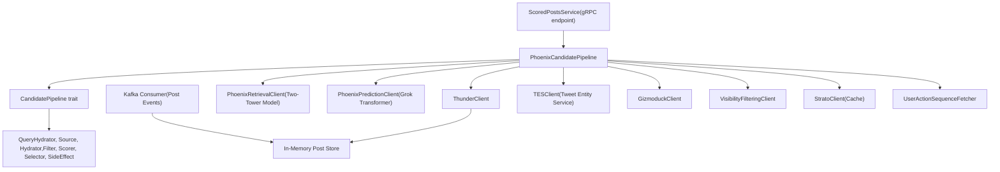
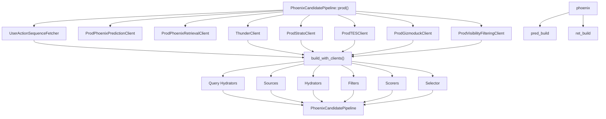
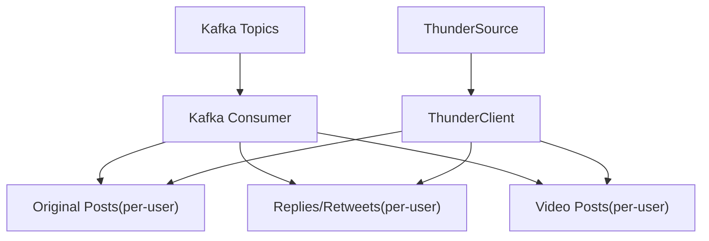
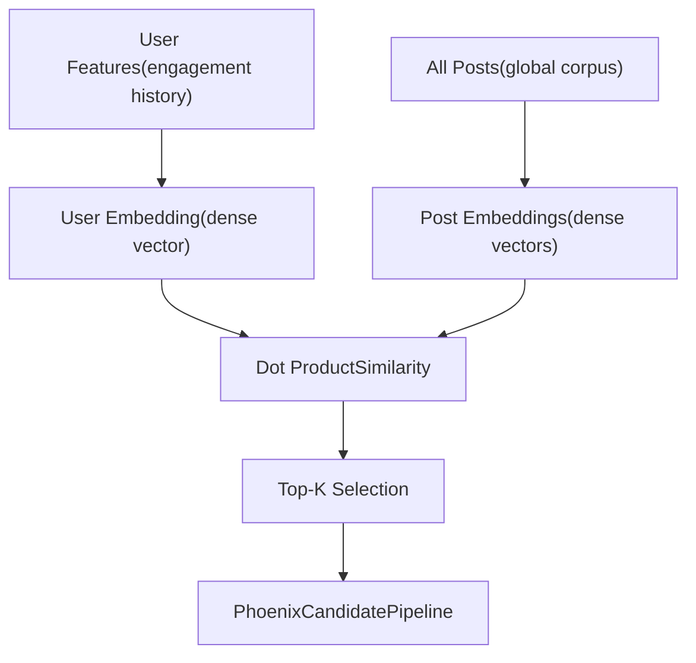
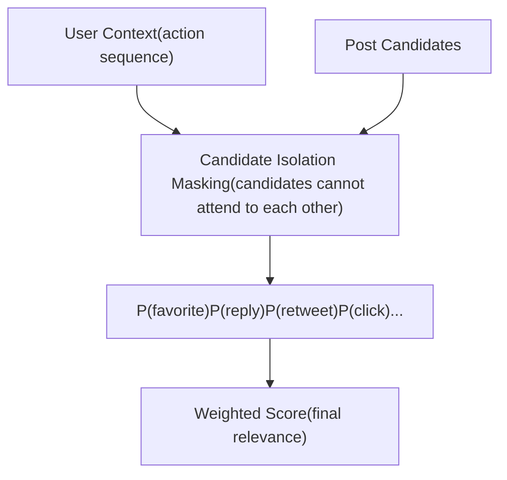
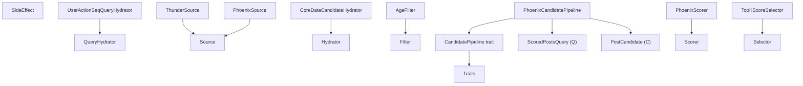
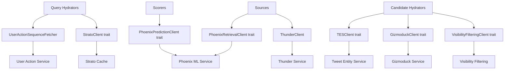

# System Components

Relevant source files

-   [README.md](https://github.com/xai-org/x-algorithm/blob/aaa167b3/README.md?plain=1)
-   [home-mixer/candidate\_pipeline/phoenix\_candidate\_pipeline.rs](https://github.com/xai-org/x-algorithm/blob/aaa167b3/home-mixer/candidate_pipeline/phoenix_candidate_pipeline.rs)

## Purpose and Scope

This document details the major components of the X Algorithm system and their responsibilities. The system consists of four primary components: **Home Mixer** (orchestration), **Thunder** (in-network storage), **Phoenix** (ML retrieval and ranking), and the **Candidate Pipeline Framework** (generic abstractions).

For information about the execution flow through these components, see [Data Flow and Execution Model](/xai-org/x-algorithm/2.2-data-flow-and-execution-model). For details on the framework's trait-based abstractions, see [Candidate Pipeline Framework](/xai-org/x-algorithm/3-candidate-pipeline-framework). For specific implementations of pipeline stages, see [Home Mixer Implementation](/xai-org/x-algorithm/4-home-mixer-implementation).

---

## Component Architecture Overview

The following diagram shows the major components and their relationships:


**Sources:** [README.md1-326](https://github.com/xai-org/x-algorithm/blob/aaa167b3/README.md?plain=1#L1-L326) [home-mixer/candidate\_pipeline/phoenix\_candidate\_pipeline.rs1-256](https://github.com/xai-org/x-algorithm/blob/aaa167b3/home-mixer/candidate_pipeline/phoenix_candidate_pipeline.rs#L1-L256)

---

## Home Mixer

Home Mixer is the orchestration layer that coordinates the entire "For You" feed generation process. It implements the `CandidatePipeline` trait to execute a multi-stage recommendation pipeline.

### PhoenixCandidatePipeline

The `PhoenixCandidatePipeline` struct is the concrete implementation of the pipeline for the "For You" feed. It is defined at [home-mixer/candidate\_pipeline/phoenix\_candidate\_pipeline.rs60-70](https://github.com/xai-org/x-algorithm/blob/aaa167b3/home-mixer/candidate_pipeline/phoenix_candidate_pipeline.rs#L60-L70)

**Key Responsibilities:**

-   Orchestrate query hydration, candidate sourcing, enrichment, filtering, scoring, and selection
-   Initialize and configure all pipeline stages with production clients
-   Provide the main entry point for feed generation requests

**Pipeline Stages:**

| Stage | Components | Execution Mode |
| --- | --- | --- |
| Query Hydrators | `UserActionSeqQueryHydrator`, `UserFeaturesQueryHydrator` | Parallel |
| Sources | `PhoenixSource`, `ThunderSource` | Parallel |
| Hydrators | `CoreDataCandidateHydrator`, `GizmoduckCandidateHydrator`, `VFCandidateHydrator`, `VideoDurationCandidateHydrator`, `SubscriptionHydrator`, `InNetworkCandidateHydrator` | Parallel |
| Filters | `DropDuplicatesFilter`, `CoreDataHydrationFilter`, `AgeFilter`, `SelfTweetFilter`, `RetweetDeduplicationFilter`, `IneligibleSubscriptionFilter`, `PreviouslySeenPostsFilter`, `PreviouslyServedPostsFilter`, `MutedKeywordFilter`, `AuthorSocialgraphFilter` | Sequential |
| Scorers | `PhoenixScorer`, `WeightedScorer`, `AuthorDiversityScorer`, `OONScorer` | Sequential |
| Selector | `TopKScoreSelector` | Single |
| Post-Selection Hydrators | `VFCandidateHydrator` | Parallel |
| Post-Selection Filters | `VFFilter`, `DedupConversationFilter` | Sequential |
| Side Effects | `CacheRequestInfoSideEffect` | Async |

### Component Initialization


The `prod()` method at [home-mixer/candidate\_pipeline/phoenix\_candidate\_pipeline.rs162-212](https://github.com/xai-org/x-algorithm/blob/aaa167b3/home-mixer/candidate_pipeline/phoenix_candidate_pipeline.rs#L162-L212) initializes all production clients and constructs the pipeline. The `build_with_clients()` method at [home-mixer/candidate\_pipeline/phoenix\_candidate\_pipeline.rs73-160](https://github.com/xai-org/x-algorithm/blob/aaa167b3/home-mixer/candidate_pipeline/phoenix_candidate_pipeline.rs#L73-L160) assembles the pipeline stages with dependency injection.

**Sources:** [home-mixer/candidate\_pipeline/phoenix\_candidate\_pipeline.rs1-256](https://github.com/xai-org/x-algorithm/blob/aaa167b3/home-mixer/candidate_pipeline/phoenix_candidate_pipeline.rs#L1-L256) [README.md128-146](https://github.com/xai-org/x-algorithm/blob/aaa167b3/README.md?plain=1#L128-L146)

---

## Thunder

Thunder is an in-memory post store that maintains real-time state of recent posts from all users. It provides sub-millisecond retrieval of in-network candidates (posts from accounts the requesting user follows).

### Architecture


**Key Characteristics:**

-   **Real-Time Ingestion**: Consumes post create/delete events from Kafka
-   **Per-User Storage**: Maintains separate stores for each user's posts, organized by post type
-   **Automatic Trimming**: Removes posts older than the retention period
-   **Fast Retrieval**: Sub-millisecond lookups without hitting external databases
-   **In-Network Focus**: Returns candidates only from accounts the requesting user follows

### Integration with Pipeline

The `ThunderSource` component at [home-mixer/candidate\_pipeline/phoenix\_candidate\_pipeline.rs95](https://github.com/xai-org/x-algorithm/blob/aaa167b3/home-mixer/candidate_pipeline/phoenix_candidate_pipeline.rs#L95-L95) wraps the `ThunderClient` and implements the `Source` trait. When the pipeline executes, it queries Thunder for in-network candidates based on the user's following list.

**Sources:** [README.md149-161](https://github.com/xai-org/x-algorithm/blob/aaa167b3/README.md?plain=1#L149-L161) [home-mixer/candidate\_pipeline/phoenix\_candidate\_pipeline.rs19-176](https://github.com/xai-org/x-algorithm/blob/aaa167b3/home-mixer/candidate_pipeline/phoenix_candidate_pipeline.rs#L19-L176)

---

## Phoenix

Phoenix is the ML component responsible for both candidate retrieval (finding relevant out-of-network content) and candidate ranking (scoring all candidates for relevance). It consists of two main subsystems:

### Phoenix Retrieval (Two-Tower Model)


The retrieval system uses a two-tower architecture where the user and posts are encoded independently into embedding space. The `PhoenixRetrievalClient` at [home-mixer/candidate\_pipeline/phoenix\_candidate\_pipeline.rs13-174](https://github.com/xai-org/x-algorithm/blob/aaa167b3/home-mixer/candidate_pipeline/phoenix_candidate_pipeline.rs#L13-L174) performs similarity search to discover relevant out-of-network content.

**Integration:** The `PhoenixSource` at [home-mixer/candidate\_pipeline/phoenix\_candidate\_pipeline.rs43-94](https://github.com/xai-org/x-algorithm/blob/aaa167b3/home-mixer/candidate_pipeline/phoenix_candidate_pipeline.rs#L43-L94) wraps the retrieval client and implements the `Source` trait.

### Phoenix Ranking (Grok Transformer)


The ranking system uses a Grok-based transformer with special attention masking to predict engagement probabilities. The **candidate isolation** design ensures that a candidate's score does not depend on which other candidates are in the batch, enabling consistent scoring and caching.

**Key Predictions:**

-   `P(favorite)` - Probability of liking the post
-   `P(reply)` - Probability of replying
-   `P(retweet)` - Probability of reposting
-   `P(quote)` - Probability of quote tweeting
-   `P(click)` - Probability of clicking the post
-   `P(profile_click)` - Probability of clicking the author's profile
-   `P(video_view)` - Probability of watching video
-   `P(photo_expand)` - Probability of expanding photo
-   `P(share)` - Probability of sharing externally
-   `P(dwell)` - Probability of dwelling on the post
-   `P(follow_author)` - Probability of following the author
-   `P(not_interested)` - Probability of marking "not interested" (negative signal)
-   `P(block_author)` - Probability of blocking the author (negative signal)
-   `P(mute_author)` - Probability of muting the author (negative signal)
-   `P(report)` - Probability of reporting the post (negative signal)

**Integration:** The `PhoenixScorer` at [home-mixer/candidate\_pipeline/phoenix\_candidate\_pipeline.rs39-123](https://github.com/xai-org/x-algorithm/blob/aaa167b3/home-mixer/candidate_pipeline/phoenix_candidate_pipeline.rs#L39-L123) wraps the `PhoenixPredictionClient` at [home-mixer/candidate\_pipeline/phoenix\_candidate\_pipeline.rs10-169](https://github.com/xai-org/x-algorithm/blob/aaa167b3/home-mixer/candidate_pipeline/phoenix_candidate_pipeline.rs#L10-L169) and implements the `Scorer` trait.

**Sources:** [README.md163-183](https://github.com/xai-org/x-algorithm/blob/aaa167b3/README.md?plain=1#L163-L183) [README.md244-272](https://github.com/xai-org/x-algorithm/blob/aaa167b3/README.md?plain=1#L244-L272) [home-mixer/candidate\_pipeline/phoenix\_candidate\_pipeline.rs10-174](https://github.com/xai-org/x-algorithm/blob/aaa167b3/home-mixer/candidate_pipeline/phoenix_candidate_pipeline.rs#L10-L174)

---

## Candidate Pipeline Framework

The Candidate Pipeline Framework is a generic, reusable system for building recommendation pipelines. It provides trait-based abstractions that separate pipeline orchestration from business logic.

### Framework Architecture


### Type Parameters

The framework is parameterized over two types:

-   **Q (Query)**: The query type representing the user request and context (e.g., `ScoredPostsQuery`)
-   **C (Candidate)**: The candidate type representing items to be ranked (e.g., `PostCandidate`)

### Stage Trait Summary

| Trait | Purpose | Execution | Ownership |
| --- | --- | --- | --- |
| `QueryHydrator<Q>` | Enrich query with user context | Parallel | Mutates query |
| `Source<Q, C>` | Fetch initial candidates | Parallel | Produces candidates |
| `Hydrator<Q, C>` | Enrich candidates with data | Parallel | Mutates candidates |
| `Filter<Q, C>` | Remove ineligible candidates | Sequential | Partitions candidates |
| `Scorer<Q, C>` | Assign scores for ranking | Sequential | Mutates candidates |
| `Selector<Q, C>` | Select top-K candidates | Single | Selects subset |
| `SideEffect<Q, C>` | Async non-blocking actions | Async (fire-and-forget) | Read-only |

### Implementation Mapping

The `PhoenixCandidatePipeline` implements the `CandidatePipeline` trait at [home-mixer/candidate\_pipeline/phoenix\_candidate\_pipeline.rs215-255](https://github.com/xai-org/x-algorithm/blob/aaa167b3/home-mixer/candidate_pipeline/phoenix_candidate_pipeline.rs#L215-L255) The trait methods return references to the pipeline stage collections:

```
query_hydrators() -> &[Box<dyn QueryHydrator<ScoredPostsQuery>>]
sources() -> &[Box<dyn Source<ScoredPostsQuery, PostCandidate>>]
hydrators() -> &[Box<dyn Hydrator<ScoredPostsQuery, PostCandidate>>]
filters() -> &[Box<dyn Filter<ScoredPostsQuery, PostCandidate>>]
scorers() -> &[Box<dyn Scorer<ScoredPostsQuery, PostCandidate>>]
selector() -> &dyn Selector<ScoredPostsQuery, PostCandidate>
post_selection_hydrators() -> &[Box<dyn Hydrator<ScoredPostsQuery, PostCandidate>>]
post_selection_filters() -> &[Box<dyn Filter<ScoredPostsQuery, PostCandidate>>]
side_effects() -> Arc<Vec<Box<dyn SideEffect<ScoredPostsQuery, PostCandidate>>>>
result_size() -> usize
```
**Sources:** [home-mixer/candidate\_pipeline/phoenix\_candidate\_pipeline.rs48-255](https://github.com/xai-org/x-algorithm/blob/aaa167b3/home-mixer/candidate_pipeline/phoenix_candidate_pipeline.rs#L48-L255) [README.md186-202](https://github.com/xai-org/x-algorithm/blob/aaa167b3/README.md?plain=1#L186-L202)

---

## External Service Integration Layer

The pipeline interacts with external services through client abstractions. This layered architecture provides isolation, testability, and independent service evolution.

### Client Architecture


### Client Traits and Production Implementations

| Client Trait | Production Implementation | Used By | Purpose |
| --- | --- | --- | --- |
| `PhoenixRetrievalClient` | `ProdPhoenixRetrievalClient` | `PhoenixSource` | Two-tower retrieval |
| `PhoenixPredictionClient` | `ProdPhoenixPredictionClient` | `PhoenixScorer` | Grok transformer scoring |
| `ThunderClient` | `ThunderClient` | `ThunderSource` | In-network post retrieval |
| `TESClient` | `ProdTESClient` | `CoreDataCandidateHydrator`, `VideoDurationCandidateHydrator`, `SubscriptionHydrator` | Tweet metadata |
| `GizmoduckClient` | `ProdGizmoduckClient` | `GizmoduckCandidateHydrator` | User profile data |
| `VisibilityFilteringClient` | `ProdVisibilityFilteringClient` | `VFCandidateHydrator`, `VFFilter` | Content safety filtering |
| `StratoClient` | `ProdStratoClient` | `UserFeaturesQueryHydrator`, `CacheRequestInfoSideEffect` | Caching and feature storage |
| `UserActionSequenceFetcher` | `UserActionSequenceFetcher` | `UserActionSeqQueryHydrator` | User engagement history |

All production client implementations are initialized in the `prod()` method at [home-mixer/candidate\_pipeline/phoenix\_candidate\_pipeline.rs162-212](https://github.com/xai-org/x-algorithm/blob/aaa167b3/home-mixer/candidate_pipeline/phoenix_candidate_pipeline.rs#L162-L212)

**Sources:** [home-mixer/candidate\_pipeline/phoenix\_candidate\_pipeline.rs1-212](https://github.com/xai-org/x-algorithm/blob/aaa167b3/home-mixer/candidate_pipeline/phoenix_candidate_pipeline.rs#L1-L212) [README.md128-146](https://github.com/xai-org/x-algorithm/blob/aaa167b3/README.md?plain=1#L128-L146)

---

## Component Interaction Summary

The following table summarizes how the major components interact:

| Component | Depends On | Provides | Communication Method |
| --- | --- | --- | --- |
| **Home Mixer** | Thunder, Phoenix, External Services | Ranked feed results | Orchestrates via pipeline execution |
| **Thunder** | Kafka | In-network candidates | In-memory query by user ID |
| **Phoenix Retrieval** | Global post corpus | Out-of-network candidates | Two-tower similarity search |
| **Phoenix Ranking** | User action sequence, Candidates | Engagement predictions | Grok transformer inference |
| **Candidate Pipeline Framework** | None (generic) | Execution model | Trait-based abstractions |
| **External Services** | Service-specific backends | Data enrichment | gRPC, Thrift, or custom protocols |

**Sources:** [README.md1-326](https://github.com/xai-org/x-algorithm/blob/aaa167b3/README.md?plain=1#L1-L326) [home-mixer/candidate\_pipeline/phoenix\_candidate\_pipeline.rs1-256](https://github.com/xai-org/x-algorithm/blob/aaa167b3/home-mixer/candidate_pipeline/phoenix_candidate_pipeline.rs#L1-L256)
