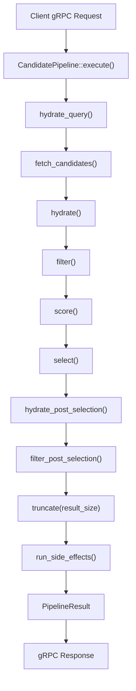
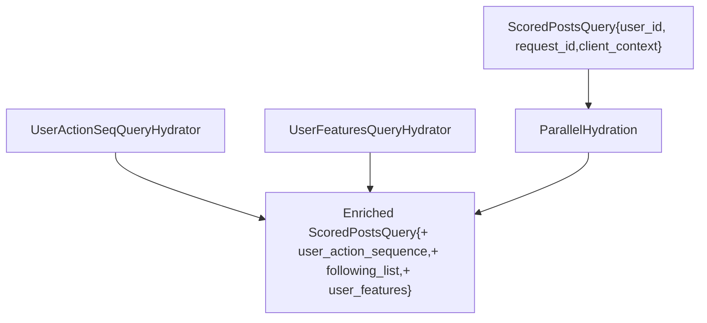
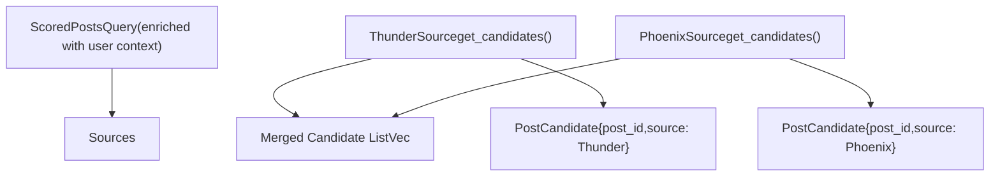
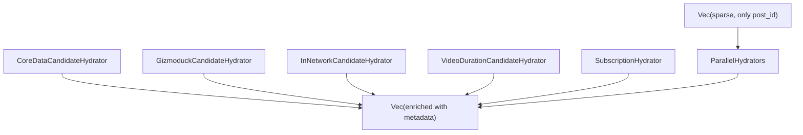
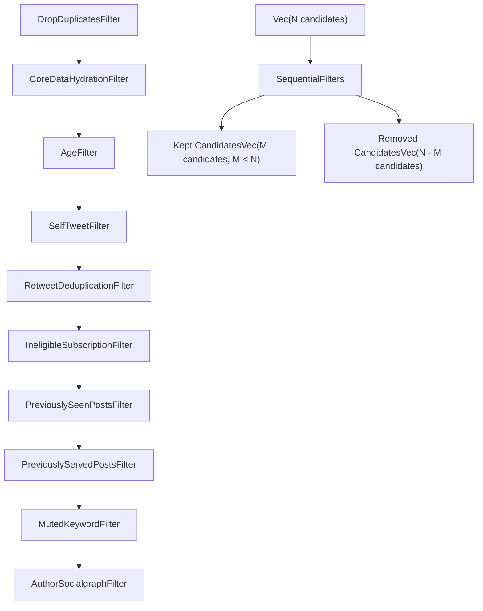
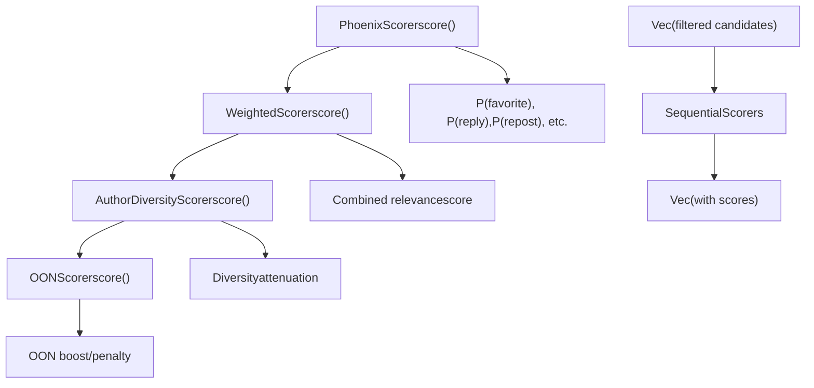
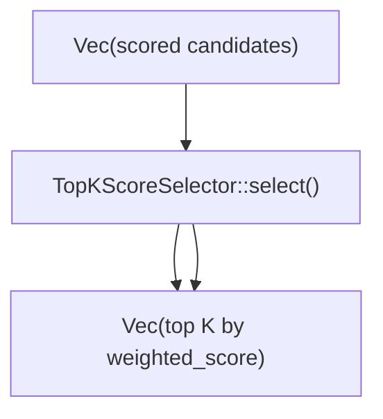
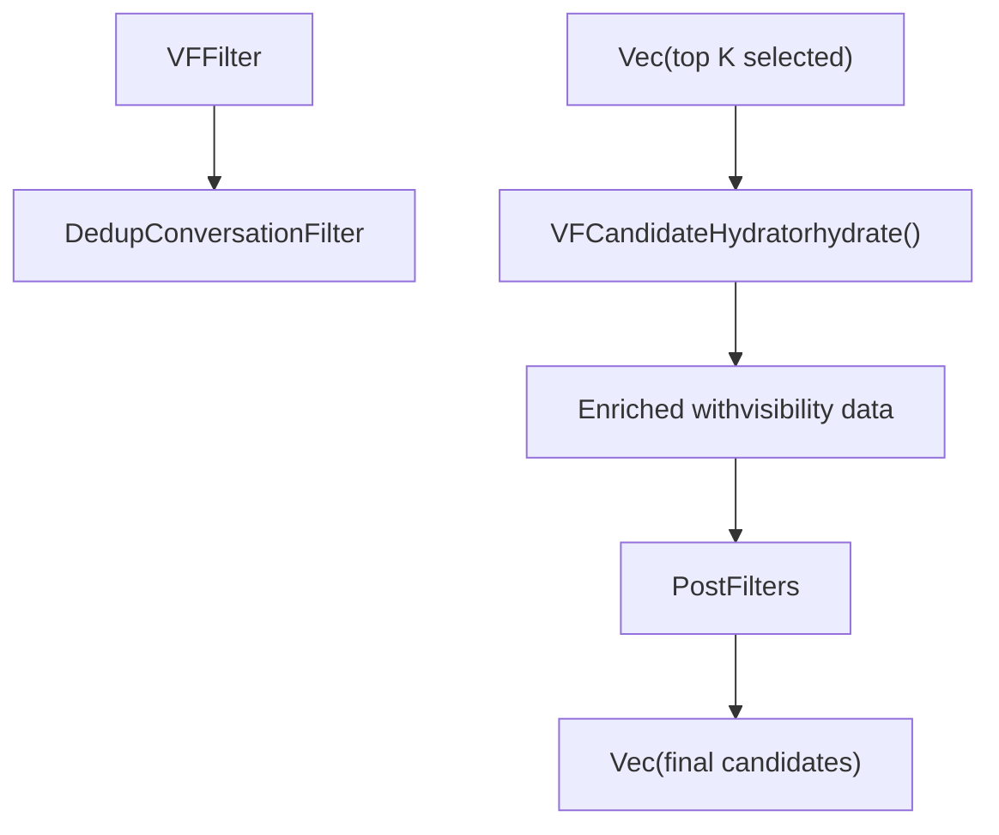
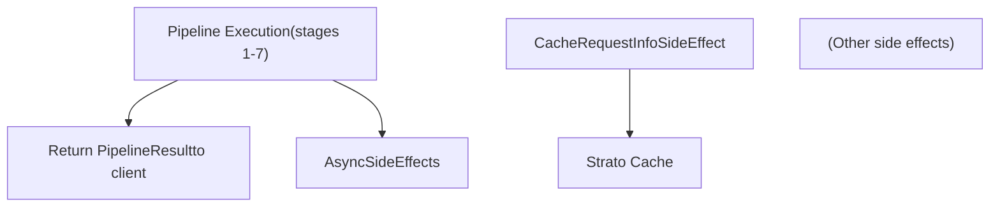
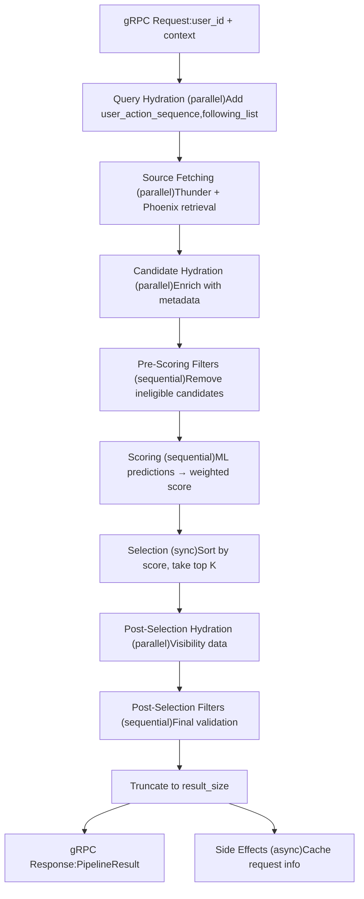

# Data Flow and Execution Model

Relevant source files

-   [README.md](https://github.com/xai-org/x-algorithm/blob/aaa167b3/README.md?plain=1)
-   [candidate-pipeline/candidate\_pipeline.rs](https://github.com/xai-org/x-algorithm/blob/aaa167b3/candidate-pipeline/candidate_pipeline.rs)
-   [home-mixer/candidate\_pipeline/phoenix\_candidate\_pipeline.rs](https://github.com/xai-org/x-algorithm/blob/aaa167b3/home-mixer/candidate_pipeline/phoenix_candidate_pipeline.rs)

## Purpose and Scope

This document explains how data flows through the For You feed recommendation pipeline, from initial query input to final ranked feed output. It covers the transformation of query and candidate data structures at each stage, the parallel and sequential execution patterns employed by the pipeline framework, and the orchestration logic that coordinates stage transitions.

For details about the individual pipeline components (sources, hydrators, filters, scorers), see [System Components](/xai-org/x-algorithm/2.1-system-components). For framework-level abstractions and trait definitions, see [Candidate Pipeline Framework](/xai-org/x-algorithm/3-candidate-pipeline-framework).

**Sources:** [candidate-pipeline/candidate\_pipeline.rs1-329](https://github.com/xai-org/x-algorithm/blob/aaa167b3/candidate-pipeline/candidate_pipeline.rs#L1-L329) [README.md1-326](https://github.com/xai-org/x-algorithm/blob/aaa167b3/README.md?plain=1#L1-L326)

---

## Pipeline Execution Flow

The pipeline execution follows a fixed sequence of stages orchestrated by the `CandidatePipeline::execute` method. Each stage transforms either the query object or the candidate list, with data flowing unidirectionally from input to output.

### High-Level Execution Sequence


**Sources:** [candidate-pipeline/candidate\_pipeline.rs53-92](https://github.com/xai-org/x-algorithm/blob/aaa167b3/candidate-pipeline/candidate_pipeline.rs#L53-L92)

---

## Query Data Flow

The query object (`ScoredPostsQuery`) is enriched during the initial hydration stage and then passed read-only to all subsequent stages.

### Query Hydration Stage


| Query Hydrator | Data Added | Source Code |
| --- | --- | --- |
| `UserActionSeqQueryHydrator` | `user_action_sequence: Vec<UserAction>` | [home-mixer/query\_hydrators/user\_action\_seq\_query\_hydrator.rs](https://github.com/xai-org/x-algorithm/blob/aaa167b3/home-mixer/query_hydrators/user_action_seq_query_hydrator.rs) |
| `UserFeaturesQueryHydrator` | `following_list: Vec<UserId>`, user feature fields | [home-mixer/query\_hydrators/user\_features\_query\_hydrator.rs](https://github.com/xai-org/x-algorithm/blob/aaa167b3/home-mixer/query_hydrators/user_features_query_hydrator.rs) |

**Execution Pattern:** Query hydrators run in parallel using `join_all()`. Each hydrator produces a partial result, which is merged into the query object via the `update()` method.

**Sources:** [candidate-pipeline/candidate\_pipeline.rs95-123](https://github.com/xai-org/x-algorithm/blob/aaa167b3/candidate-pipeline/candidate_pipeline.rs#L95-L123) [home-mixer/candidate\_pipeline/phoenix\_candidate\_pipeline.rs84-89](https://github.com/xai-org/x-algorithm/blob/aaa167b3/home-mixer/candidate_pipeline/phoenix_candidate_pipeline.rs#L84-L89)

---

## Candidate Data Flow

Candidates progress through multiple transformation stages, with each stage either enriching, filtering, or scoring the candidate list.

### Stage 1: Candidate Retrieval


**Execution Pattern:** Sources execute in parallel. Results are collected and concatenated into a single candidate list.

**Sources:** [candidate-pipeline/candidate\_pipeline.rs125-157](https://github.com/xai-org/x-algorithm/blob/aaa167b3/candidate-pipeline/candidate_pipeline.rs#L125-L157) [home-mixer/candidate\_pipeline/phoenix\_candidate\_pipeline.rs92-97](https://github.com/xai-org/x-algorithm/blob/aaa167b3/home-mixer/candidate_pipeline/phoenix_candidate_pipeline.rs#L92-L97)

---

### Stage 2: Candidate Hydration


| Hydrator | Fields Added | External Service | Source Code |
| --- | --- | --- | --- |
| `CoreDataCandidateHydrator` | `core_data: CoreData` (text, author\_id, timestamp, etc.) | Tweet Entity Service | [home-mixer/candidate\_hydrators/core\_data\_candidate\_hydrator.rs](https://github.com/xai-org/x-algorithm/blob/aaa167b3/home-mixer/candidate_hydrators/core_data_candidate_hydrator.rs) |
| `GizmoduckCandidateHydrator` | `author_screen_name: String`, `author_follower_count: u64` | Gizmoduck | [home-mixer/candidate\_hydrators/gizmoduck\_hydrator.rs](https://github.com/xai-org/x-algorithm/blob/aaa167b3/home-mixer/candidate_hydrators/gizmoduck_hydrator.rs) |
| `InNetworkCandidateHydrator` | `is_in_network: bool` | None (computed from query) | [home-mixer/candidate\_hydrators/in\_network\_candidate\_hydrator.rs](https://github.com/xai-org/x-algorithm/blob/aaa167b3/home-mixer/candidate_hydrators/in_network_candidate_hydrator.rs) |
| `VideoDurationCandidateHydrator` | `video_duration_ms: Option<u64>` | Tweet Entity Service | [home-mixer/candidate\_hydrators/video\_duration\_candidate\_hydrator.rs](https://github.com/xai-org/x-algorithm/blob/aaa167b3/home-mixer/candidate_hydrators/video_duration_candidate_hydrator.rs) |
| `SubscriptionHydrator` | `subscription_author_ids: Vec<UserId>` | Tweet Entity Service | [home-mixer/candidate\_hydrators/subscription\_hydrator.rs](https://github.com/xai-org/x-algorithm/blob/aaa167b3/home-mixer/candidate_hydrators/subscription_hydrator.rs) |

**Execution Pattern:** Hydrators run in parallel. Each returns a `Vec<PartialCandidate>` aligned with the input candidate list. Results are merged via `update_all()`.

**Sources:** [candidate-pipeline/candidate\_pipeline.rs159-217](https://github.com/xai-org/x-algorithm/blob/aaa167b3/candidate-pipeline/candidate_pipeline.rs#L159-L217) [home-mixer/candidate\_pipeline/phoenix\_candidate\_pipeline.rs100-106](https://github.com/xai-org/x-algorithm/blob/aaa167b3/home-mixer/candidate_pipeline/phoenix_candidate_pipeline.rs#L100-L106)

---

### Stage 3: Pre-Scoring Filtering


**Execution Pattern:** Filters execute sequentially. Each filter calls `filter()` which returns a `FilterResult { kept, removed }`. The kept list becomes input to the next filter. All removed candidates are accumulated.

**Sources:** [candidate-pipeline/candidate\_pipeline.rs219-273](https://github.com/xai-org/x-algorithm/blob/aaa167b3/candidate-pipeline/candidate_pipeline.rs#L219-L273) [home-mixer/candidate\_pipeline/phoenix\_candidate\_pipeline.rs109-120](https://github.com/xai-org/x-algorithm/blob/aaa167b3/home-mixer/candidate_pipeline/phoenix_candidate_pipeline.rs#L109-L120)

---

### Stage 4: Scoring


**Execution Pattern:** Scorers execute sequentially. Each scorer produces a `Vec<PartialScore>` aligned with the input candidates, which is merged via `update_all()`. Later scorers can read scores set by earlier scorers.

**Sources:** [candidate-pipeline/candidate\_pipeline.rs275-307](https://github.com/xai-org/x-algorithm/blob/aaa167b3/candidate-pipeline/candidate_pipeline.rs#L275-L307) [home-mixer/candidate\_pipeline/phoenix\_candidate\_pipeline.rs123-132](https://github.com/xai-org/x-algorithm/blob/aaa167b3/home-mixer/candidate_pipeline/phoenix_candidate_pipeline.rs#L123-L132)

---

### Stage 5: Selection


**Execution Pattern:** Selection is synchronous and runs on the main thread. It sorts candidates by `weighted_score` in descending order and truncates to the configured size.

**Sources:** [candidate-pipeline/candidate\_pipeline.rs309-316](https://github.com/xai-org/x-algorithm/blob/aaa167b3/candidate-pipeline/candidate_pipeline.rs#L309-L316) [home-mixer/candidate\_pipeline/phoenix\_candidate\_pipeline.rs135](https://github.com/xai-org/x-algorithm/blob/aaa167b3/home-mixer/candidate_pipeline/phoenix_candidate_pipeline.rs#L135-L135)

---

### Stage 6: Post-Selection Processing


**Execution Pattern:** Post-selection hydrators run in parallel (though typically only one). Post-selection filters run sequentially. This stage removes candidates that passed pre-scoring filters but are found ineligible during final validation (e.g., deleted tweets, spam).

**Sources:** [candidate-pipeline/candidate\_pipeline.rs166-234](https://github.com/xai-org/x-algorithm/blob/aaa167b3/candidate-pipeline/candidate_pipeline.rs#L166-L234) [home-mixer/candidate\_pipeline/phoenix\_candidate\_pipeline.rs138-143](https://github.com/xai-org/x-algorithm/blob/aaa167b3/home-mixer/candidate_pipeline/phoenix_candidate_pipeline.rs#L138-L143)

---

## Parallel vs Sequential Execution

The pipeline framework uses different execution strategies based on stage dependencies:

### Parallel Execution Stages

| Stage | Components | Rationale | Implementation |
| --- | --- | --- | --- |
| Query Hydration | `QueryHydrator` implementations | Each hydrator enriches independent fields in the query | `join_all()` on hydrator futures [candidate-pipeline/candidate\_pipeline.rs102](https://github.com/xai-org/x-algorithm/blob/aaa167b3/candidate-pipeline/candidate_pipeline.rs#L102-L102) |
| Source Fetching | `Source` implementations | Each source retrieves from independent data stores | `join_all()` on source futures [candidate-pipeline/candidate\_pipeline.rs129](https://github.com/xai-org/x-algorithm/blob/aaa167b3/candidate-pipeline/candidate_pipeline.rs#L129-L129) |
| Candidate Hydration | `Hydrator` implementations | Each hydrator enriches independent fields in candidates | `join_all()` on hydrator futures [candidate-pipeline/candidate\_pipeline.rs187](https://github.com/xai-org/x-algorithm/blob/aaa167b3/candidate-pipeline/candidate_pipeline.rs#L187-L187) |

**Code Pattern:**

```
let futures = components.iter().map(|c| c.process(query));let results = join_all(futures).await;
```
**Sources:** [candidate-pipeline/candidate\_pipeline.rs8-187](https://github.com/xai-org/x-algorithm/blob/aaa167b3/candidate-pipeline/candidate_pipeline.rs#L8-L187)

---

### Sequential Execution Stages

| Stage | Components | Rationale | Implementation |
| --- | --- | --- | --- |
| Filtering | `Filter` implementations | Each filter depends on previous filter's output | Loop with awaited filter calls [candidate-pipeline/candidate\_pipeline.rs246-263](https://github.com/xai-org/x-algorithm/blob/aaa167b3/candidate-pipeline/candidate_pipeline.rs#L246-L263) |
| Scoring | `Scorer` implementations | Later scorers may depend on scores from earlier scorers | Loop with awaited scorer calls [candidate-pipeline/candidate\_pipeline.rs279-304](https://github.com/xai-org/x-algorithm/blob/aaa167b3/candidate-pipeline/candidate_pipeline.rs#L279-L304) |
| Selection | `Selector` implementation | Single synchronous sort and truncate | Synchronous method call [candidate-pipeline/candidate\_pipeline.rs310-316](https://github.com/xai-org/x-algorithm/blob/aaa167b3/candidate-pipeline/candidate_pipeline.rs#L310-L316) |

**Code Pattern (Filters):**

```
for filter in filters.iter() {    let result = filter.filter(query, candidates).await?;    candidates = result.kept;    all_removed.extend(result.removed);}
```
**Sources:** [candidate-pipeline/candidate\_pipeline.rs246-263](https://github.com/xai-org/x-algorithm/blob/aaa167b3/candidate-pipeline/candidate_pipeline.rs#L246-L263)

---

## Data Structure Evolution

The following table shows how the `PostCandidate` structure evolves through pipeline stages:

| After Stage | Fields Populated | Example State |
| --- | --- | --- |
| **Source** | `post_id: u64`
`source: CandidateSource` | `PostCandidate { post_id: 123, source: Thunder, .. }` |
| **Hydration** | `+ core_data: CoreData`
`+ author_screen_name: String`
`+ is_in_network: bool`
`+ video_duration_ms: Option<u64>` | `PostCandidate { post_id: 123, core_data: CoreData { text: "...", author_id: 456, .. }, is_in_network: true, .. }` |
| **Pre-Scoring Filters** | (no new fields, only removal) | Candidates not matching filter criteria are removed |
| **Scoring** | `+ phoenix_scores: PhoenixPredictions`
`+ weighted_score: f32` | `PostCandidate { .., phoenix_scores: { p_favorite: 0.23, .. }, weighted_score: 0.87, .. }` |
| **Selection** | (no new fields, only ordering) | Candidates sorted by `weighted_score` DESC, truncated to top K |
| **Post-Selection** | `+ visibility_reason: Option<FilterReason>` | Final validation data added, ineligible candidates removed |

**Sources:** [home-mixer/candidate\_pipeline/candidate.rs](https://github.com/xai-org/x-algorithm/blob/aaa167b3/home-mixer/candidate_pipeline/candidate.rs)

---

## Side Effects Execution

Side effects run asynchronously after the main pipeline completes and do not block the response:


**Execution Pattern:** Side effects are spawned in a separate tokio task after the pipeline result is constructed. They receive an `Arc<SideEffectInput>` containing the final query and selected candidates.

**Sources:** [candidate-pipeline/candidate\_pipeline.rs319-328](https://github.com/xai-org/x-algorithm/blob/aaa167b3/candidate-pipeline/candidate_pipeline.rs#L319-L328) [home-mixer/candidate\_pipeline/phoenix\_candidate\_pipeline.rs146-147](https://github.com/xai-org/x-algorithm/blob/aaa167b3/home-mixer/candidate_pipeline/phoenix_candidate_pipeline.rs#L146-L147)

---

## Error Handling and Resilience

The pipeline framework implements graceful degradation at each stage:

### Query Hydrators

-   **Failure Mode:** Individual hydrator failure logs error but does not fail the entire request
-   **Recovery:** Query proceeds with partially hydrated state
-   **Code:** [candidate-pipeline/candidate\_pipeline.rs111-119](https://github.com/xai-org/x-algorithm/blob/aaa167b3/candidate-pipeline/candidate_pipeline.rs#L111-L119)

### Sources

-   **Failure Mode:** Individual source failure logs error, other sources continue
-   **Recovery:** Pipeline proceeds with candidates from successful sources
-   **Code:** [candidate-pipeline/candidate\_pipeline.rs145-153](https://github.com/xai-org/x-algorithm/blob/aaa167b3/candidate-pipeline/candidate_pipeline.rs#L145-L153)

### Hydrators

-   **Failure Mode:** Individual hydrator failure logs error
-   **Recovery:** Candidates proceed with partial enrichment
-   **Code:** [candidate-pipeline/candidate\_pipeline.rs205-213](https://github.com/xai-org/x-algorithm/blob/aaa167b3/candidate-pipeline/candidate_pipeline.rs#L205-L213)

### Filters

-   **Failure Mode:** Individual filter failure logs error and restores pre-filter candidate list
-   **Recovery:** Pipeline proceeds with backup candidate list
-   **Code:** [candidate-pipeline/candidate\_pipeline.rs247-261](https://github.com/xai-org/x-algorithm/blob/aaa167b3/candidate-pipeline/candidate_pipeline.rs#L247-L261)

### Scorers

-   **Failure Mode:** Individual scorer failure logs error
-   **Recovery:** Candidates proceed with partial scores
-   **Code:** [candidate-pipeline/candidate\_pipeline.rs295-302](https://github.com/xai-org/x-algorithm/blob/aaa167b3/candidate-pipeline/candidate_pipeline.rs#L295-L302)

**Sources:** [candidate-pipeline/candidate\_pipeline.rs95-307](https://github.com/xai-org/x-algorithm/blob/aaa167b3/candidate-pipeline/candidate_pipeline.rs#L95-L307)

---

## Summary: Complete Execution Flow

The complete data flow from request to response:


**Pipeline Characteristics:**

-   **Total Stages:** 10 (including side effects)
-   **Parallel Stages:** 3 (query hydration, sources, candidate hydration)
-   **Sequential Stages:** 5 (pre-filters, scorers, post-hydration, post-filters, selection)
-   **Async Stages:** 1 (side effects)
-   **Primary Data Structures:** `ScoredPostsQuery`, `PostCandidate`, `PipelineResult`

**Sources:** [candidate-pipeline/candidate\_pipeline.rs53-92](https://github.com/xai-org/x-algorithm/blob/aaa167b3/candidate-pipeline/candidate_pipeline.rs#L53-L92) [README.md38-122](https://github.com/xai-org/x-algorithm/blob/aaa167b3/README.md?plain=1#L38-L122)
