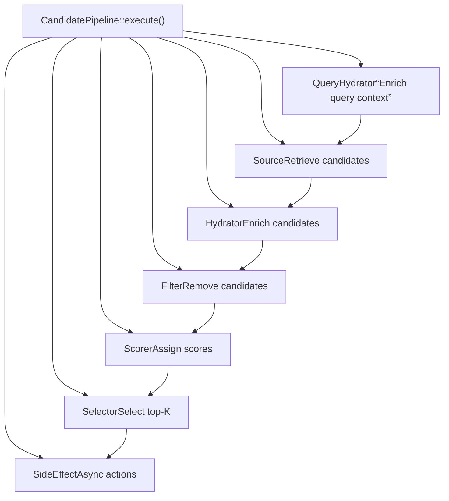
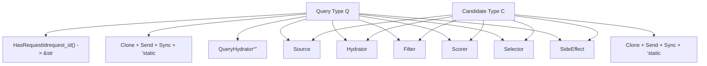
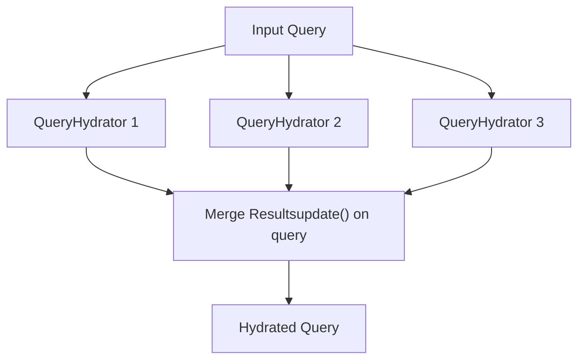
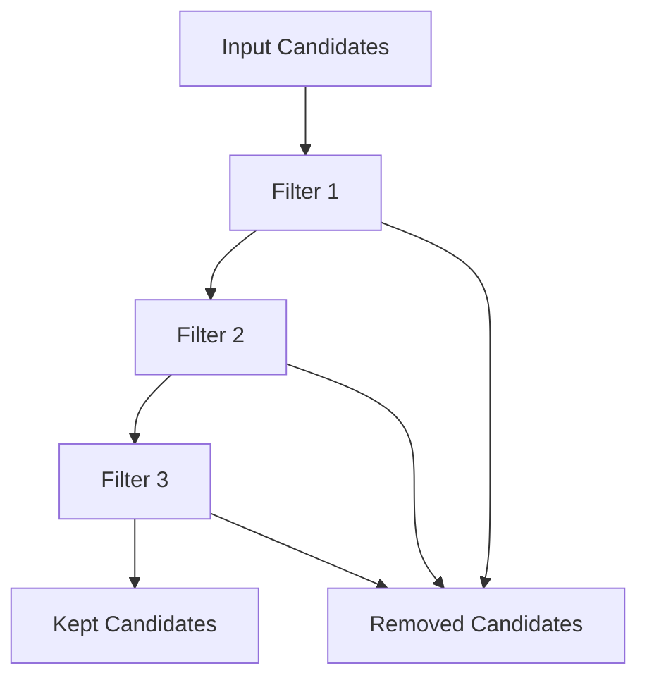
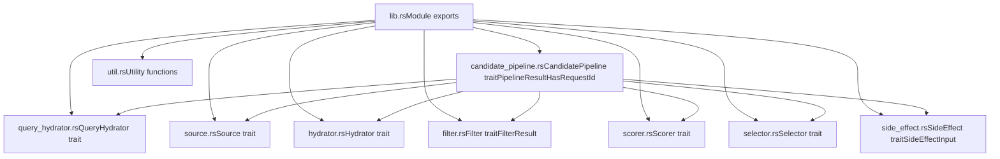

# Candidate Pipeline Framework

Relevant source files

-   [candidate-pipeline/candidate\_pipeline.rs](https://github.com/xai-org/x-algorithm/blob/aaa167b3/candidate-pipeline/candidate_pipeline.rs)
-   [candidate-pipeline/lib.rs](https://github.com/xai-org/x-algorithm/blob/aaa167b3/candidate-pipeline/lib.rs)

## Purpose and Scope

The Candidate Pipeline Framework is a generic, reusable abstraction layer for building recommendation pipelines in the X Algorithm. It provides a trait-based architecture with seven pluggable stages that can be composed to retrieve, enrich, filter, score, and select candidates from various data sources.

This document covers the framework's core design, trait definitions, execution model, and type system. For details about specific trait implementations used in the "For You" feed, see [Home Mixer Implementation](/xai-org/x-algorithm/4-home-mixer-implementation). For information about how this framework fits into the overall system architecture, see [Architecture](/xai-org/x-algorithm/2-architecture).

## Framework Overview

The Candidate Pipeline Framework solves the problem of building modular, testable, and reusable recommendation systems. Rather than hardcoding pipeline logic, the framework defines a set of traits that can be implemented independently and composed together.

### Design Principles

| Principle | Description |
| --- | --- |
| **Trait-Based Composition** | Each pipeline stage is defined as a Rust trait, allowing multiple implementations |
| **Generic Type Parameters** | Pipelines are parameterized by query type `Q` and candidate type `C` |
| **Fail-Safe Execution** | Stage failures are logged but don't crash the pipeline; fallback behavior preserves progress |
| **Parallel + Sequential** | Independent stages (hydrators, sources) run in parallel; dependent stages (filters, scorers) run sequentially |
| **Observable** | All stages emit structured logs with request IDs for tracing |

Sources: [candidate-pipeline/candidate\_pipeline.rs1-330](https://github.com/xai-org/x-algorithm/blob/aaa167b3/candidate-pipeline/candidate_pipeline.rs#L1-L330)

## Core Trait Architecture

The framework defines seven core traits that represent different pipeline stages:


**Diagram: Pipeline Stage Flow and Data Transformations**

Sources: [candidate-pipeline/candidate\_pipeline.rs36-92](https://github.com/xai-org/x-algorithm/blob/aaa167b3/candidate-pipeline/candidate_pipeline.rs#L36-L92)

## Pipeline Stages

The `CandidatePipeline` trait defines accessor methods for each stage type:

| Method | Return Type | Purpose | Execution |
| --- | --- | --- | --- |
| `query_hydrators()` | `&[Box<dyn QueryHydrator<Q>>]` | Enrich query with user context | Parallel |
| `sources()` | `&[Box<dyn Source<Q, C>>]` | Fetch initial candidates | Parallel |
| `hydrators()` | `&[Box<dyn Hydrator<Q, C>>]` | Enrich candidate metadata | Parallel |
| `filters()` | `&[Box<dyn Filter<Q, C>>]` | Remove ineligible candidates | Sequential |
| `scorers()` | `&[Box<dyn Scorer<Q, C>>]` | Assign relevance scores | Sequential |
| `selector()` | `&dyn Selector<Q, C>` | Sort and select top-K | Synchronous |
| `post_selection_hydrators()` | `&[Box<dyn Hydrator<Q, C>>]` | Enrich selected candidates | Parallel |
| `post_selection_filters()` | `&[Box<dyn Filter<Q, C>>]` | Final validation filtering | Sequential |
| `side_effects()` | `Arc<Vec<Box<dyn SideEffect<Q, C>>>>` | Non-blocking actions | Async parallel |

Sources: [candidate-pipeline/candidate\_pipeline.rs42-51](https://github.com/xai-org/x-algorithm/blob/aaa167b3/candidate-pipeline/candidate_pipeline.rs#L42-L51)

### Two-Phase Processing

The pipeline supports two-phase hydration and filtering:

1.  **Pre-Selection Phase**: Operates on all candidates before scoring

    -   `hydrators()`: Fetch metadata needed for filtering and scoring
    -   `filters()`: Remove obviously ineligible candidates to reduce scoring cost
2.  **Post-Selection Phase**: Operates on selected candidates after top-K selection

    -   `post_selection_hydrators()`: Fetch expensive metadata only for selected candidates
    -   `post_selection_filters()`: Final validation (e.g., check for deleted/spam content)

This optimization reduces expensive operations on candidates that won't be selected.

Sources: [candidate-pipeline/candidate\_pipeline.rs44-49](https://github.com/xai-org/x-algorithm/blob/aaa167b3/candidate-pipeline/candidate_pipeline.rs#L44-L49)

## Type Parameters and Constraints

The framework is generic over two type parameters:


**Diagram: Type Parameter Constraints and Usage**

### HasRequestId Trait

The `HasRequestId` trait provides a stable request identifier for logging and tracing:

```
pub trait HasRequestId {    fn request_id(&self) -> &str;}
```
All query types must implement this trait to enable structured logging throughout the pipeline.

Sources: [candidate-pipeline/candidate\_pipeline.rs31-40](https://github.com/xai-org/x-algorithm/blob/aaa167b3/candidate-pipeline/candidate_pipeline.rs#L31-L40)

### Type Bounds

| Bound | Reason |
| --- | --- |
| `Clone` | Enables sharing data across stages and parallel operations |
| `Send + Sync` | Required for async execution across threads |
| `'static` | Ensures types can be safely stored in tokio tasks |

Sources: [candidate-pipeline/candidate\_pipeline.rs37-40](https://github.com/xai-org/x-algorithm/blob/aaa167b3/candidate-pipeline/candidate_pipeline.rs#L37-L40)

## Execution Model

The `execute()` method orchestrates all pipeline stages in a fixed sequence:

**Diagram: Complete Pipeline Execution Sequence**

Sources: [candidate-pipeline/candidate\_pipeline.rs53-92](https://github.com/xai-org/x-algorithm/blob/aaa167b3/candidate-pipeline/candidate_pipeline.rs#L53-L92)

### Pipeline Result

The `execute()` method returns a `PipelineResult` structure containing:

| Field | Type | Description |
| --- | --- | --- |
| `retrieved_candidates` | `Vec<C>` | All candidates after hydration, before filtering |
| `filtered_candidates` | `Vec<C>` | All candidates removed by filters |
| `selected_candidates` | `Vec<C>` | Final candidates selected for response |
| `query` | `Arc<Q>` | The hydrated query object |

This structure provides visibility into each stage for debugging, metrics, and testing.

Sources: [candidate-pipeline/candidate\_pipeline.rs24-29](https://github.com/xai-org/x-algorithm/blob/aaa167b3/candidate-pipeline/candidate_pipeline.rs#L24-L29) [candidate-pipeline/candidate\_pipeline.rs86-91](https://github.com/xai-org/x-algorithm/blob/aaa167b3/candidate-pipeline/candidate_pipeline.rs#L86-L91)

## Stage Execution Patterns

### Parallel Execution

Query hydrators, sources, and candidate hydrators execute in parallel using `futures::future::join_all`:


**Diagram: Parallel Query Hydration Pattern**

The pattern:

1.  Filter enabled hydrators using `enable(&query)`
2.  Launch all hydration futures simultaneously with `join_all()`
3.  Merge results back into the query using each hydrator's `update()` method

Sources: [candidate-pipeline/candidate\_pipeline.rs94-123](https://github.com/xai-org/x-algorithm/blob/aaa167b3/candidate-pipeline/candidate_pipeline.rs#L94-L123) [candidate-pipeline/candidate\_pipeline.rs125-157](https://github.com/xai-org/x-algorithm/blob/aaa167b3/candidate-pipeline/candidate_pipeline.rs#L125-L157) [candidate-pipeline/candidate\_pipeline.rs176-217](https://github.com/xai-org/x-algorithm/blob/aaa167b3/candidate-pipeline/candidate_pipeline.rs#L176-L217)

### Sequential Execution

Filters and scorers execute sequentially because each stage may depend on the previous stage's output:


**Diagram: Sequential Filter Chain Pattern**

The pattern:

1.  Filter enabled filters using `enable(query)`
2.  Apply each filter sequentially to the candidates
3.  Accumulate removed candidates for metrics/debugging
4.  Continue with kept candidates to the next stage

Sources: [candidate-pipeline/candidate\_pipeline.rs219-273](https://github.com/xai-org/x-algorithm/blob/aaa167b3/candidate-pipeline/candidate_pipeline.rs#L219-L273) [candidate-pipeline/candidate\_pipeline.rs275-307](https://github.com/xai-org/x-algorithm/blob/aaa167b3/candidate-pipeline/candidate_pipeline.rs#L275-L307)

### Conditional Execution

Each stage component implements an `enable()` method that determines whether it should run for a given query:

```
// Pseudocode pattern used throughout stageslet enabled_components: Vec<_> = self.components()    .iter()    .filter(|c| c.enable(query))    .collect();
```
This allows runtime configuration and A/B testing by enabling/disabling components per request.

Sources: [candidate-pipeline/candidate\_pipeline.rs100](https://github.com/xai-org/x-algorithm/blob/aaa167b3/candidate-pipeline/candidate_pipeline.rs#L100-L100) [candidate-pipeline/candidate\_pipeline.rs128](https://github.com/xai-org/x-algorithm/blob/aaa167b3/candidate-pipeline/candidate_pipeline.rs#L128-L128) [candidate-pipeline/candidate\_pipeline.rs185](https://github.com/xai-org/x-algorithm/blob/aaa167b3/candidate-pipeline/candidate_pipeline.rs#L185-L185) [candidate-pipeline/candidate\_pipeline.rs246](https://github.com/xai-org/x-algorithm/blob/aaa167b3/candidate-pipeline/candidate_pipeline.rs#L246-L246) [candidate-pipeline/candidate\_pipeline.rs279](https://github.com/xai-org/x-algorithm/blob/aaa167b3/candidate-pipeline/candidate_pipeline.rs#L279-L279)

## Error Handling Strategy

The framework implements a fail-safe error handling approach where stage failures are logged but don't abort the entire pipeline:

### Query Hydrator Errors

When a query hydrator fails, the error is logged and that hydrator's contribution is skipped:

```
match result {    Ok(hydrated) => {        hydrator.update(&mut hydrated_query, hydrated);    }    Err(err) => {        error!("request_id={} stage=QueryHydrator component={} failed: {}",                request_id, hydrator.name(), err);        // Continue with partially hydrated query    }}
```
Sources: [candidate-pipeline/candidate\_pipeline.rs107-120](https://github.com/xai-org/x-algorithm/blob/aaa167b3/candidate-pipeline/candidate_pipeline.rs#L107-L120)

### Source Errors

When a source fails, candidates from other sources are still collected:

```
match result {    Ok(mut candidates) => {        collected.append(&mut candidates);    }    Err(err) => {        error!("request_id={} stage=Source component={} failed: {}",                request_id, source.name(), err);        // Continue with candidates from other sources    }}
```
Sources: [candidate-pipeline/candidate\_pipeline.rs134-154](https://github.com/xai-org/x-algorithm/blob/aaa167b3/candidate-pipeline/candidate_pipeline.rs#L134-L154)

### Hydrator Errors

Hydrator failures are logged, and the candidates proceed without that enrichment:

```
match result {    Ok(hydrated) => {        if hydrated.len() == expected_len {            hydrator.update_all(&mut candidates, hydrated);        } else {            warn!("length_mismatch expected={} got={}", expected_len, hydrated.len());        }    }    Err(err) => {        error!("request_id={} stage=Hydrator component={} failed: {}",                request_id, hydrator.name(), err);        // Continue with unenriched candidates    }}
```
Sources: [candidate-pipeline/candidate\_pipeline.rs190-214](https://github.com/xai-org/x-algorithm/blob/aaa167b3/candidate-pipeline/candidate_pipeline.rs#L190-L214)

### Filter Errors

Filter failures are treated specially—the pipeline reverts to the pre-filter candidate set:

```
let backup = candidates.clone();match filter.filter(query, candidates).await {    Ok(result) => {        candidates = result.kept;        all_removed.extend(result.removed);    }    Err(err) => {        error!("request_id={} stage=Filter component={} failed: {}",                request_id, filter.name(), err);        candidates = backup;  // Restore pre-filter state    }}
```
This ensures that a broken filter doesn't accidentally remove all candidates.

Sources: [candidate-pipeline/candidate\_pipeline.rs247-263](https://github.com/xai-org/x-algorithm/blob/aaa167b3/candidate-pipeline/candidate_pipeline.rs#L247-L263)

### Scorer Errors

Scorer failures are logged, and candidates proceed without that score contribution:

```
match scorer.score(query, &candidates).await {    Ok(scored) => {        if scored.len() == expected_len {            scorer.update_all(&mut candidates, scored);        } else {            warn!("length_mismatch expected={} got={}", expected_len, scored.len());        }    }    Err(err) => {        error!("request_id={} stage=Scorer component={} failed: {}",                request_id, scorer.name(), err);        // Continue with partial scores    }}
```
Sources: [candidate-pipeline/candidate\_pipeline.rs280-304](https://github.com/xai-org/x-algorithm/blob/aaa167b3/candidate-pipeline/candidate_pipeline.rs#L280-L304)

## Module Structure

The framework is organized into separate modules for each trait type:


**Diagram: Framework Module Organization**

Sources: [candidate-pipeline/lib.rs1-10](https://github.com/xai-org/x-algorithm/blob/aaa167b3/candidate-pipeline/lib.rs#L1-L10) [candidate-pipeline/candidate\_pipeline.rs1-11](https://github.com/xai-org/x-algorithm/blob/aaa167b3/candidate-pipeline/candidate_pipeline.rs#L1-L11)

## Concrete Implementation

The framework is designed to be implemented by concrete pipeline types. The Home Mixer provides a production implementation:

| Component | Implementation | Reference |
| --- | --- | --- |
| Pipeline | `PhoenixCandidatePipeline` | See [Phoenix Candidate Pipeline](/xai-org/x-algorithm/4.1-phoenix-candidate-pipeline) |
| Query Type | `ScoredPostsQuery` | See [ScoredPostsQuery](/xai-org/x-algorithm/4.2.1-scoredpostsquery) |
| Candidate Type | `PostCandidate` | See [PostCandidate](/xai-org/x-algorithm/4.2.2-postcandidate) |

For details on how the framework traits are implemented for the "For You" feed, see [Home Mixer Implementation](/xai-org/x-algorithm/4-home-mixer-implementation).

Sources: [candidate-pipeline/candidate\_pipeline.rs36-330](https://github.com/xai-org/x-algorithm/blob/aaa167b3/candidate-pipeline/candidate_pipeline.rs#L36-L330)

## Key Takeaways

| Concept | Description |
| --- | --- |
| **Trait Composition** | Seven independent traits compose to form a complete pipeline |
| **Type Safety** | Generic type parameters ensure compile-time correctness |
| **Parallel Optimization** | Independent stages run concurrently to minimize latency |
| **Fail-Safe** | Stage failures are isolated and logged; pipeline continues |
| **Observable** | Structured logging with request IDs enables tracing and debugging |
| **Reusable** | Framework can be instantiated for different recommendation use cases |
| **Testable** | Trait-based design enables easy mocking and unit testing |

The Candidate Pipeline Framework provides a robust foundation for building production recommendation systems with modularity, performance, and reliability.

Sources: [candidate-pipeline/candidate\_pipeline.rs1-330](https://github.com/xai-org/x-algorithm/blob/aaa167b3/candidate-pipeline/candidate_pipeline.rs#L1-L330)
