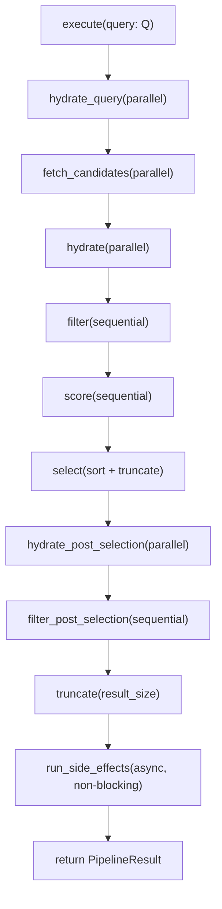
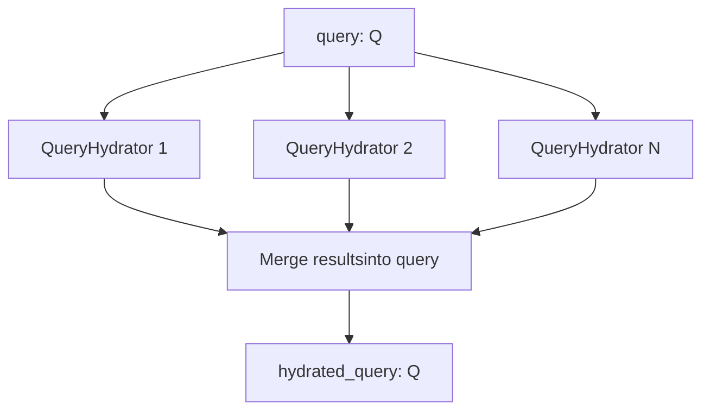
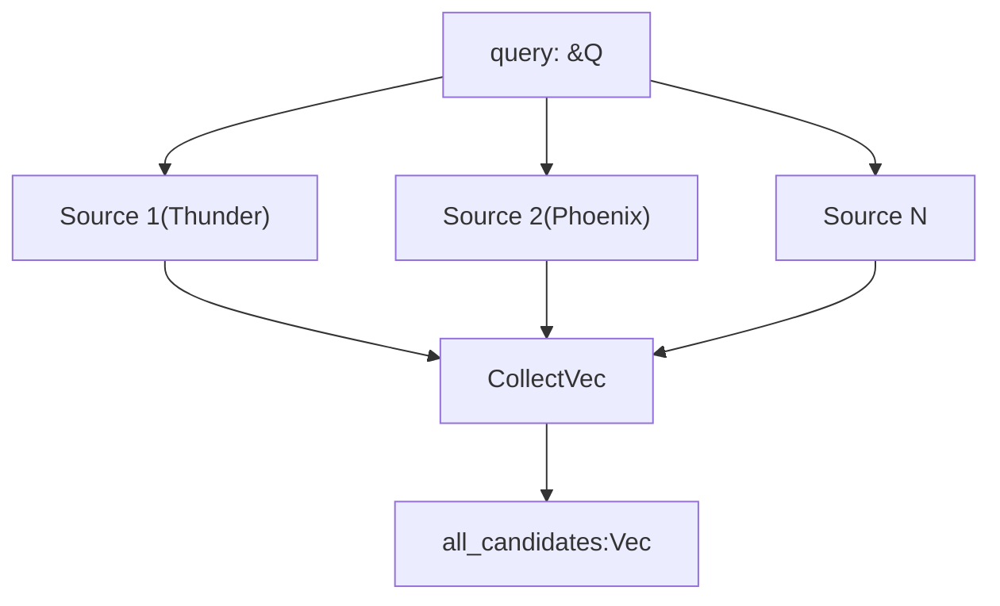
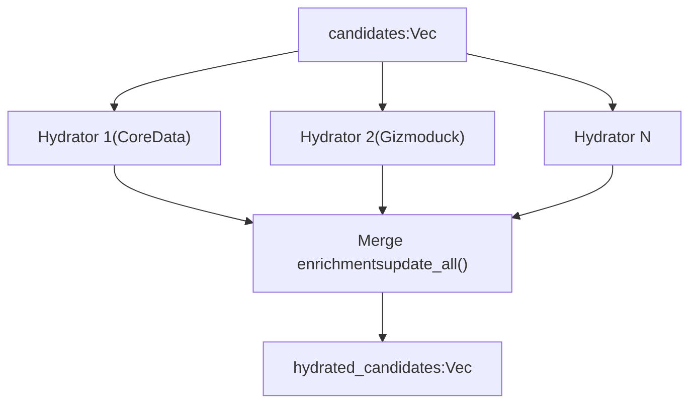
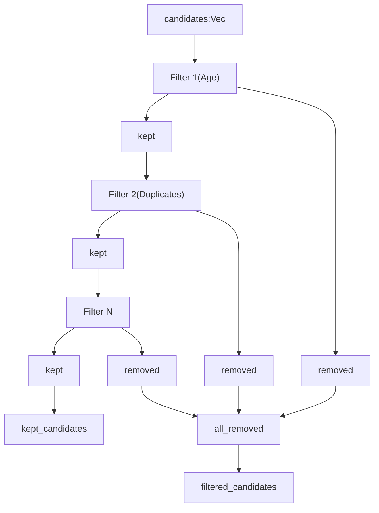
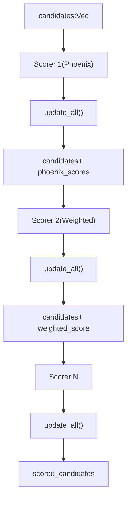
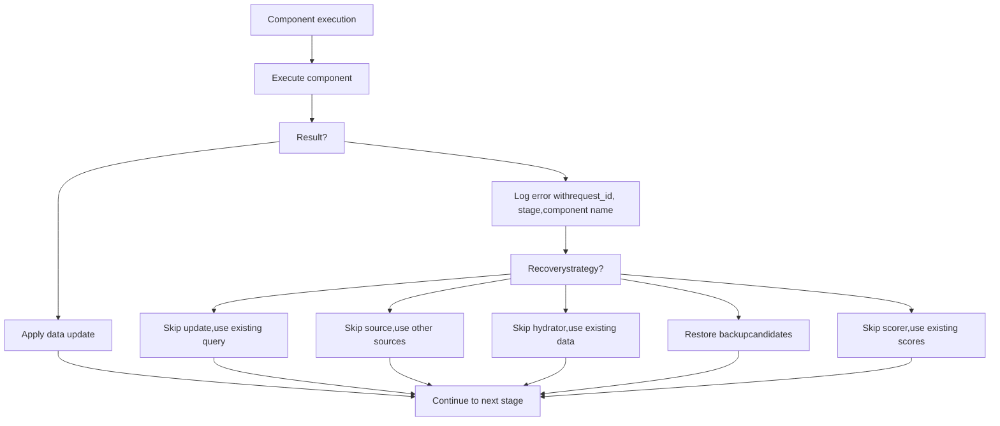
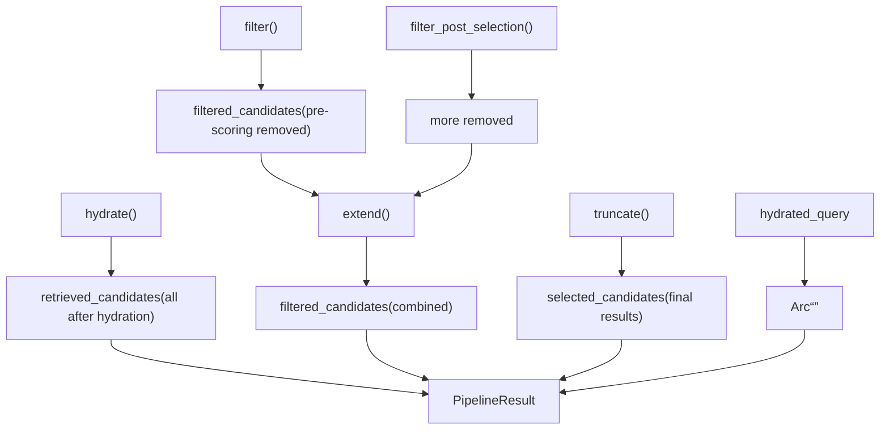
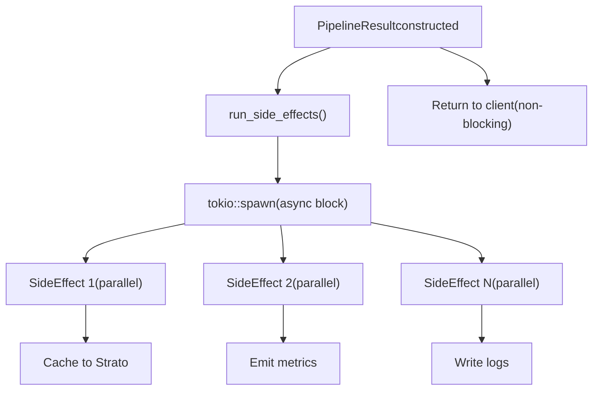

# Pipeline Execution Model

Relevant source files

-   [candidate-pipeline/candidate\_pipeline.rs](https://github.com/xai-org/x-algorithm/blob/aaa167b3/candidate-pipeline/candidate_pipeline.rs)

## Purpose and Scope

This document explains the execution model of the `CandidatePipeline` trait, which defines the core orchestration logic for running recommendation pipelines. This page covers:

-   The `CandidatePipeline` trait structure and its generic type parameters
-   The `execute` method's sequential stages and data flow
-   Parallel execution patterns for independent stages (query hydrators, sources, candidate hydrators)
-   Sequential execution patterns for dependent stages (filters, scorers)
-   Error handling and recovery strategies
-   The `PipelineResult` output structure

For details on individual trait types (QueryHydrator, Source, Hydrator, etc.), see pages [3.2](/xai-org/x-algorithm/3.2-queryhydrator-trait) through [3.8](/xai-org/x-algorithm/3.8-sideeffect-trait). For the concrete implementation used in the Home Mixer, see [4.1](/xai-org/x-algorithm/4.1-phoenix-candidate-pipeline).

---

## CandidatePipeline Trait

The `CandidatePipeline` trait is defined in [candidate-pipeline/candidate\_pipeline.rs37-329](https://github.com/xai-org/x-algorithm/blob/aaa167b3/candidate-pipeline/candidate_pipeline.rs#L37-L329) and provides the generic orchestration framework for all recommendation pipelines in the system.

### Type Parameters

The trait is parameterized by two generic types:

| Type Parameter | Constraints | Purpose |
| --- | --- | --- |
| `Q` | `HasRequestId + Clone + Send + Sync + 'static` | Query type containing request context, user ID, and enriched features |
| `C` | `Clone + Send + Sync + 'static` | Candidate type representing individual content items with scores and metadata |

The `HasRequestId` trait [candidate-pipeline/candidate\_pipeline.rs32-34](https://github.com/xai-org/x-algorithm/blob/aaa167b3/candidate-pipeline/candidate_pipeline.rs#L32-L34) ensures queries provide a stable identifier for logging and tracing throughout the pipeline.

### Component Registry Methods

The trait defines methods that return collections of pipeline components, which concrete implementations must provide:

```
fn query_hydrators(&self) -> &[Box<dyn QueryHydrator<Q>>];fn sources(&self) -> &[Box<dyn Source<Q, C>>];fn hydrators(&self) -> &[Box<dyn Hydrator<Q, C>>];fn filters(&self) -> &[Box<dyn Filter<Q, C>>];fn scorers(&self) -> &[Box<dyn Scorer<Q, C>>];fn selector(&self) -> &dyn Selector<Q, C>;fn post_selection_hydrators(&self) -> &[Box<dyn Hydrator<Q, C>>];fn post_selection_filters(&self) -> &[Box<dyn Filter<Q, C>>];fn side_effects(&self) -> Arc<Vec<Box<dyn SideEffect<Q, C>>>>;fn result_size(&self) -> usize;
```
These methods are defined in [candidate-pipeline/candidate\_pipeline.rs42-51](https://github.com/xai-org/x-algorithm/blob/aaa167b3/candidate-pipeline/candidate_pipeline.rs#L42-L51)

**Sources:** [candidate-pipeline/candidate\_pipeline.rs32-51](https://github.com/xai-org/x-algorithm/blob/aaa167b3/candidate-pipeline/candidate_pipeline.rs#L32-L51)

---

## Pipeline Execution Flow

### Execute Method Overview

The `execute` method [candidate-pipeline/candidate\_pipeline.rs53-92](https://github.com/xai-org/x-algorithm/blob/aaa167b3/candidate-pipeline/candidate_pipeline.rs#L53-L92) is the main entry point that orchestrates all pipeline stages. It follows a strictly ordered sequence of operations:

#### Pipeline Execution Sequence


**Diagram: Main pipeline execution flow showing stage order and execution patterns**

The execution flow consists of:

1.  **Query Hydration** [candidate-pipeline/candidate\_pipeline.rs54](https://github.com/xai-org/x-algorithm/blob/aaa167b3/candidate-pipeline/candidate_pipeline.rs#L54-L54): Enrich query with user context
2.  **Candidate Fetching** [candidate-pipeline/candidate\_pipeline.rs56](https://github.com/xai-org/x-algorithm/blob/aaa167b3/candidate-pipeline/candidate_pipeline.rs#L56-L56): Retrieve candidates from sources
3.  **Candidate Hydration** [candidate-pipeline/candidate\_pipeline.rs58](https://github.com/xai-org/x-algorithm/blob/aaa167b3/candidate-pipeline/candidate_pipeline.rs#L58-L58): Enrich candidates with metadata
4.  **Pre-scoring Filtering** [candidate-pipeline/candidate\_pipeline.rs60-62](https://github.com/xai-org/x-algorithm/blob/aaa167b3/candidate-pipeline/candidate_pipeline.rs#L60-L62): Remove ineligible candidates
5.  **Scoring** [candidate-pipeline/candidate\_pipeline.rs64](https://github.com/xai-org/x-algorithm/blob/aaa167b3/candidate-pipeline/candidate_pipeline.rs#L64-L64): Assign relevance scores
6.  **Selection** [candidate-pipeline/candidate\_pipeline.rs66](https://github.com/xai-org/x-algorithm/blob/aaa167b3/candidate-pipeline/candidate_pipeline.rs#L66-L66): Sort and select top-K candidates
7.  **Post-selection Hydration** [candidate-pipeline/candidate\_pipeline.rs68-70](https://github.com/xai-org/x-algorithm/blob/aaa167b3/candidate-pipeline/candidate_pipeline.rs#L68-L70): Enrich selected candidates
8.  **Post-selection Filtering** [candidate-pipeline/candidate\_pipeline.rs72-74](https://github.com/xai-org/x-algorithm/blob/aaa167b3/candidate-pipeline/candidate_pipeline.rs#L72-L74): Final validation
9.  **Truncation** [candidate-pipeline/candidate\_pipeline.rs77](https://github.com/xai-org/x-algorithm/blob/aaa167b3/candidate-pipeline/candidate_pipeline.rs#L77-L77): Enforce result size limit
10.  **Side Effects** [candidate-pipeline/candidate\_pipeline.rs79-84](https://github.com/xai-org/x-algorithm/blob/aaa167b3/candidate-pipeline/candidate_pipeline.rs#L79-L84): Async logging, caching, metrics

**Sources:** [candidate-pipeline/candidate\_pipeline.rs53-92](https://github.com/xai-org/x-algorithm/blob/aaa167b3/candidate-pipeline/candidate_pipeline.rs#L53-L92)

---

## Parallel vs Sequential Execution

The pipeline uses different execution strategies based on stage dependencies:

### Parallel Execution Stages

Stages that operate on independent data and have no inter-dependencies execute in parallel using `futures::future::join_all`:

#### Query Hydration (Parallel)


**Diagram: Query hydrators execute in parallel and results are merged**

The `hydrate_query` method [candidate-pipeline/candidate\_pipeline.rs95-123](https://github.com/xai-org/x-algorithm/blob/aaa167b3/candidate-pipeline/candidate_pipeline.rs#L95-L123) filters enabled hydrators, executes them in parallel via `join_all`, and merges results:

```
let hydrate_futures = hydrators.iter().map(|h| h.hydrate(&query));let results = join_all(hydrate_futures).await; let mut hydrated_query = query;for (hydrator, result) in hydrators.iter().zip(results) {    match result {        Ok(hydrated) => {            hydrator.update(&mut hydrated_query, hydrated);        }        Err(err) => {            error!("query hydrator {} failed: {}", hydrator.name(), err);        }    }}
```
**Sources:** [candidate-pipeline/candidate\_pipeline.rs95-123](https://github.com/xai-org/x-algorithm/blob/aaa167b3/candidate-pipeline/candidate_pipeline.rs#L95-L123)

#### Candidate Source Fetching (Parallel)


**Diagram: Sources execute in parallel and candidates are collected**

The `fetch_candidates` method [candidate-pipeline/candidate\_pipeline.rs126-157](https://github.com/xai-org/x-algorithm/blob/aaa167b3/candidate-pipeline/candidate_pipeline.rs#L126-L157) executes all enabled sources in parallel and collects their results into a single vector:

```
let source_futures = sources.iter().map(|s| s.get_candidates(query));let results = join_all(source_futures).await; let mut collected = Vec::new();for (source, result) in sources.iter().zip(results) {    match result {        Ok(mut candidates) => {            collected.append(&mut candidates);        }        Err(err) => {            error!("source {} failed: {}", source.name(), err);        }    }}
```
**Sources:** [candidate-pipeline/candidate\_pipeline.rs126-157](https://github.com/xai-org/x-algorithm/blob/aaa167b3/candidate-pipeline/candidate_pipeline.rs#L126-L157)

#### Candidate Hydration (Parallel)


**Diagram: Hydrators execute in parallel and results are merged into candidates**

The `run_hydrators` helper [candidate-pipeline/candidate\_pipeline.rs177-217](https://github.com/xai-org/x-algorithm/blob/aaa167b3/candidate-pipeline/candidate_pipeline.rs#L177-L217) executes all enabled hydrators in parallel and merges enrichments:

```
let hydrate_futures = hydrators.iter().map(|h| h.hydrate(query, &candidates));let results = join_all(hydrate_futures).await; for (hydrator, result) in hydrators.iter().zip(results) {    match result {        Ok(hydrated) => {            if hydrated.len() == expected_len {                hydrator.update_all(&mut candidates, hydrated);            } else {                warn!("hydrator {} length mismatch", hydrator.name());            }        }        Err(err) => {            error!("hydrator {} failed: {}", hydrator.name(), err);        }    }}
```
This pattern is used by both `hydrate` [candidate-pipeline/candidate\_pipeline.rs160-163](https://github.com/xai-org/x-algorithm/blob/aaa167b3/candidate-pipeline/candidate_pipeline.rs#L160-L163) and `hydrate_post_selection` [candidate-pipeline/candidate\_pipeline.rs166-174](https://github.com/xai-org/x-algorithm/blob/aaa167b3/candidate-pipeline/candidate_pipeline.rs#L166-L174)

**Sources:** [candidate-pipeline/candidate\_pipeline.rs160-217](https://github.com/xai-org/x-algorithm/blob/aaa167b3/candidate-pipeline/candidate_pipeline.rs#L160-L217)

### Sequential Execution Stages

Stages that depend on results from previous stages execute sequentially:

#### Filtering (Sequential)


**Diagram: Filters execute sequentially, each operating on the kept set from the previous filter**

The `run_filters` helper [candidate-pipeline/candidate\_pipeline.rs237-273](https://github.com/xai-org/x-algorithm/blob/aaa167b3/candidate-pipeline/candidate_pipeline.rs#L237-L273) executes filters sequentially, accumulating removed candidates:

```
let mut all_removed = Vec::new();for filter in filters.iter().filter(|f| f.enable(query)) {    let backup = candidates.clone();    match filter.filter(query, candidates).await {        Ok(result) => {            candidates = result.kept;            all_removed.extend(result.removed);        }        Err(err) => {            error!("filter {} failed: {}", filter.name(), err);            candidates = backup;  // Recover from failure        }    }}
```
Filters must execute sequentially because each filter operates on the output of the previous filter. This pattern is used by both `filter` [candidate-pipeline/candidate\_pipeline.rs220-223](https://github.com/xai-org/x-algorithm/blob/aaa167b3/candidate-pipeline/candidate_pipeline.rs#L220-L223) and `filter_post_selection` [candidate-pipeline/candidate\_pipeline.rs226-234](https://github.com/xai-org/x-algorithm/blob/aaa167b3/candidate-pipeline/candidate_pipeline.rs#L226-L234)

**Sources:** [candidate-pipeline/candidate\_pipeline.rs220-273](https://github.com/xai-org/x-algorithm/blob/aaa167b3/candidate-pipeline/candidate_pipeline.rs#L220-L273)

#### Scoring (Sequential)


**Diagram: Scorers execute sequentially, each adding scores that may depend on previous scores**

The `score` method [candidate-pipeline/candidate\_pipeline.rs276-307](https://github.com/xai-org/x-algorithm/blob/aaa167b3/candidate-pipeline/candidate_pipeline.rs#L276-L307) executes scorers sequentially:

```
for scorer in self.scorers().iter().filter(|s| s.enable(query)) {    match scorer.score(query, &candidates).await {        Ok(scored) => {            if scored.len() == expected_len {                scorer.update_all(&mut candidates, scored);            } else {                warn!("scorer {} length mismatch", scorer.name());            }        }        Err(err) => {            error!("scorer {} failed: {}", scorer.name(), err);        }    }}
```
Scorers execute sequentially because later scorers may depend on scores computed by earlier scorers (e.g., a weighted scorer combines multiple engagement prediction scores).

**Sources:** [candidate-pipeline/candidate\_pipeline.rs276-307](https://github.com/xai-org/x-algorithm/blob/aaa167b3/candidate-pipeline/candidate_pipeline.rs#L276-L307)

### Parallel vs Sequential Summary Table

| Stage | Execution Pattern | Rationale |
| --- | --- | --- |
| Query Hydrators | Parallel | Independent data fetching from different services |
| Sources | Parallel | Independent candidate retrieval from different sources |
| Candidate Hydrators | Parallel | Independent metadata enrichment from different services |
| Filters | Sequential | Each filter operates on kept set from previous filter |
| Scorers | Sequential | Later scorers may depend on earlier scores |
| Selector | Synchronous | Single sort and truncation operation |
| Post-selection Hydrators | Parallel | Independent metadata enrichment |
| Post-selection Filters | Sequential | Final validation filters |
| Side Effects | Parallel (Async) | Independent logging, caching, metrics operations |

**Sources:** [candidate-pipeline/candidate\_pipeline.rs95-328](https://github.com/xai-org/x-algorithm/blob/aaa167b3/candidate-pipeline/candidate_pipeline.rs#L95-L328)

---

## Error Handling Strategies

The pipeline implements graceful error handling to maximize availability:

### Error Handling Patterns by Stage


**Diagram: Error handling flow with recovery strategies specific to each stage type**

### Query Hydrator Error Handling

When a query hydrator fails [candidate-pipeline/candidate\_pipeline.rs111-119](https://github.com/xai-org/x-algorithm/blob/aaa167b3/candidate-pipeline/candidate_pipeline.rs#L111-L119) the error is logged and the update is skipped:

```
match result {    Ok(hydrated) => {        hydrator.update(&mut hydrated_query, hydrated);    }    Err(err) => {        error!(            "request_id={} stage={:?} component={} failed: {}",            request_id, PipelineStage::QueryHydrator, hydrator.name(), err        );        // Continue with un-hydrated query    }}
```
The query continues with existing data, allowing the pipeline to proceed even if some context is missing.

### Source Error Handling

When a source fails [candidate-pipeline/candidate\_pipeline.rs145-153](https://github.com/xai-org/x-algorithm/blob/aaa167b3/candidate-pipeline/candidate_pipeline.rs#L145-L153) candidates from that source are skipped:

```
match result {    Ok(mut candidates) => {        info!("source {} fetched {} candidates", source.name(), candidates.len());        collected.append(&mut candidates);    }    Err(err) => {        error!(            "request_id={} stage={:?} component={} failed: {}",            request_id, PipelineStage::Source, source.name(), err        );        // Continue with candidates from other sources    }}
```
This allows the pipeline to continue with partial results if at least one source succeeds.

### Hydrator Error Handling

When a hydrator fails [candidate-pipeline/candidate\_pipeline.rs205-213](https://github.com/xai-org/x-algorithm/blob/aaa167b3/candidate-pipeline/candidate_pipeline.rs#L205-L213) the enrichment is skipped:

```
match result {    Ok(hydrated) => {        if hydrated.len() == expected_len {            hydrator.update_all(&mut candidates, hydrated);        } else {            warn!("hydrator {} length mismatch", hydrator.name());        }    }    Err(err) => {        error!(            "request_id={} stage={:?} component={} failed: {}",            request_id, stage, hydrator.name(), err        );        // Continue with un-enriched candidates    }}
```
Candidates proceed without the enrichment from the failed hydrator.

### Filter Error Handling

When a filter fails [candidate-pipeline/candidate\_pipeline.rs247-262](https://github.com/xai-org/x-algorithm/blob/aaa167b3/candidate-pipeline/candidate_pipeline.rs#L247-L262) the pipeline restores the backup and continues:

```
let backup = candidates.clone();match filter.filter(query, candidates).await {    Ok(result) => {        candidates = result.kept;        all_removed.extend(result.removed);    }    Err(err) => {        error!(            "request_id={} stage={:?} component={} failed: {}",            request_id, stage, filter.name(), err        );        candidates = backup;  // Restore pre-filter state    }}
```
This ensures filter failures don't lose candidates that should be kept.

### Scorer Error Handling

When a scorer fails [candidate-pipeline/candidate\_pipeline.rs295-302](https://github.com/xai-org/x-algorithm/blob/aaa167b3/candidate-pipeline/candidate_pipeline.rs#L295-L302) the score update is skipped:

```
match scorer.score(query, &candidates).await {    Ok(scored) => {        if scored.len() == expected_len {            scorer.update_all(&mut candidates, scored);        } else {            warn!("scorer {} length mismatch", scorer.name());        }    }    Err(err) => {        error!(            "request_id={} stage={:?} component={} failed: {}",            request_id, PipelineStage::Scorer, scorer.name(), err        );        // Continue without this scorer's updates    }}
```
Candidates proceed with scores from successful scorers only.

**Sources:** [candidate-pipeline/candidate\_pipeline.rs107-302](https://github.com/xai-org/x-algorithm/blob/aaa167b3/candidate-pipeline/candidate_pipeline.rs#L107-L302)

---

## Pipeline Result Structure

The pipeline returns a `PipelineResult<Q, C>` struct [candidate-pipeline/candidate\_pipeline.rs24-29](https://github.com/xai-org/x-algorithm/blob/aaa167b3/candidate-pipeline/candidate_pipeline.rs#L24-L29) that captures candidates at multiple stages:

```
pub struct PipelineResult<Q, C> {    pub retrieved_candidates: Vec<C>,    pub filtered_candidates: Vec<C>,    pub selected_candidates: Vec<C>,    pub query: Arc<Q>,}
```
### Result Components

| Field | Source | Purpose |
| --- | --- | --- |
| `retrieved_candidates` | After hydration [candidate-pipeline/candidate\_pipeline.rs87](https://github.com/xai-org/x-algorithm/blob/aaa167b3/candidate-pipeline/candidate_pipeline.rs#L87-L87) | All candidates after enrichment, before filtering |
| `filtered_candidates` | Accumulated during filtering [candidate-pipeline/candidate\_pipeline.rs88](https://github.com/xai-org/x-algorithm/blob/aaa167b3/candidate-pipeline/candidate_pipeline.rs#L88-L88) | All candidates removed by pre-scoring and post-selection filters |
| `selected_candidates` | After final truncation [candidate-pipeline/candidate\_pipeline.rs89](https://github.com/xai-org/x-algorithm/blob/aaa167b3/candidate-pipeline/candidate_pipeline.rs#L89-L89) | Final candidates to return to the client |
| `query` | Wrapped in Arc [candidate-pipeline/candidate\_pipeline.rs90](https://github.com/xai-org/x-algorithm/blob/aaa167b3/candidate-pipeline/candidate_pipeline.rs#L90-L90) | The fully hydrated query for reference |

### Result Construction Flow


**Diagram: How PipelineResult fields are populated from different stages**

The result assembly occurs in [candidate-pipeline/candidate\_pipeline.rs86-91](https://github.com/xai-org/x-algorithm/blob/aaa167b3/candidate-pipeline/candidate_pipeline.rs#L86-L91):

```
PipelineResult {    retrieved_candidates: hydrated_candidates,    filtered_candidates,  // Combined from pre and post filters    selected_candidates: final_candidates,    query: arc_hydrated_query,}
```
**Sources:** [candidate-pipeline/candidate\_pipeline.rs24-92](https://github.com/xai-org/x-algorithm/blob/aaa167b3/candidate-pipeline/candidate_pipeline.rs#L24-L92)

---

## Side Effects Execution

Side effects run asynchronously after the main response is constructed, ensuring they don't block the client response:


**Diagram: Side effects execute in parallel async task without blocking response**

The `run_side_effects` method [candidate-pipeline/candidate\_pipeline.rs319-328](https://github.com/xai-org/x-algorithm/blob/aaa167b3/candidate-pipeline/candidate_pipeline.rs#L319-L328) spawns an async task:

```
fn run_side_effects(&self, input: Arc<SideEffectInput<Q, C>>) {    let side_effects = self.side_effects();    tokio::spawn(async move {        let futures = side_effects            .iter()            .filter(|se| se.enable(input.query.clone()))            .map(|se| se.run(input.clone()));        let _ = join_all(futures).await;    });}
```
This runs in a separate tokio task, allowing the main `execute` method to return immediately after constructing the result [candidate-pipeline/candidate\_pipeline.rs84](https://github.com/xai-org/x-algorithm/blob/aaa167b3/candidate-pipeline/candidate_pipeline.rs#L84-L84)

**Sources:** [candidate-pipeline/candidate\_pipeline.rs79-328](https://github.com/xai-org/x-algorithm/blob/aaa167b3/candidate-pipeline/candidate_pipeline.rs#L79-L328)

---

## Pipeline Stage Enum

The `PipelineStage` enum [candidate-pipeline/candidate\_pipeline.rs13-22](https://github.com/xai-org/x-algorithm/blob/aaa167b3/candidate-pipeline/candidate_pipeline.rs#L13-L22) provides structured stage identification for logging:

```
#[derive(Copy, Clone, Debug)]pub enum PipelineStage {    QueryHydrator,    Source,    Hydrator,    PostSelectionHydrator,    Filter,    PostSelectionFilter,    Scorer,}
```
This enum is used in error logs [candidate-pipeline/candidate\_pipeline.rs115-299](https://github.com/xai-org/x-algorithm/blob/aaa167b3/candidate-pipeline/candidate_pipeline.rs#L115-L299) and info logs [candidate-pipeline/candidate\_pipeline.rs137-267](https://github.com/xai-org/x-algorithm/blob/aaa167b3/candidate-pipeline/candidate_pipeline.rs#L137-L267) to identify which stage produced the log entry, enabling easier debugging and monitoring.

**Sources:** [candidate-pipeline/candidate\_pipeline.rs13-299](https://github.com/xai-org/x-algorithm/blob/aaa167b3/candidate-pipeline/candidate_pipeline.rs#L13-L299)

---

## Code Entity Reference

This section maps high-level concepts to specific code entities:

### Core Trait and Execution

| Concept | Code Entity | Location |
| --- | --- | --- |
| Pipeline trait | `CandidatePipeline<Q, C>` | [candidate-pipeline/candidate\_pipeline.rs37](https://github.com/xai-org/x-algorithm/blob/aaa167b3/candidate-pipeline/candidate_pipeline.rs#L37-L37) |
| Main orchestration | `CandidatePipeline::execute()` | [candidate-pipeline/candidate\_pipeline.rs53](https://github.com/xai-org/x-algorithm/blob/aaa167b3/candidate-pipeline/candidate_pipeline.rs#L53-L53) |
| Request tracking | `HasRequestId` trait | [candidate-pipeline/candidate\_pipeline.rs32](https://github.com/xai-org/x-algorithm/blob/aaa167b3/candidate-pipeline/candidate_pipeline.rs#L32-L32) |
| Result structure | `PipelineResult<Q, C>` | [candidate-pipeline/candidate\_pipeline.rs24](https://github.com/xai-org/x-algorithm/blob/aaa167b3/candidate-pipeline/candidate_pipeline.rs#L24-L24) |
| Stage identification | `PipelineStage` enum | [candidate-pipeline/candidate\_pipeline.rs13](https://github.com/xai-org/x-algorithm/blob/aaa167b3/candidate-pipeline/candidate_pipeline.rs#L13-L13) |

### Stage Execution Methods

| Stage | Method | Pattern | Location |
| --- | --- | --- | --- |
| Query hydration | `hydrate_query()` | Parallel | [candidate-pipeline/candidate\_pipeline.rs95](https://github.com/xai-org/x-algorithm/blob/aaa167b3/candidate-pipeline/candidate_pipeline.rs#L95-L95) |
| Source fetching | `fetch_candidates()` | Parallel | [candidate-pipeline/candidate\_pipeline.rs126](https://github.com/xai-org/x-algorithm/blob/aaa167b3/candidate-pipeline/candidate_pipeline.rs#L126-L126) |
| Candidate hydration | `hydrate()` | Parallel | [candidate-pipeline/candidate\_pipeline.rs160](https://github.com/xai-org/x-algorithm/blob/aaa167b3/candidate-pipeline/candidate_pipeline.rs#L160-L160) |
| Pre-scoring filtering | `filter()` | Sequential | [candidate-pipeline/candidate\_pipeline.rs220](https://github.com/xai-org/x-algorithm/blob/aaa167b3/candidate-pipeline/candidate_pipeline.rs#L220-L220) |
| Scoring | `score()` | Sequential | [candidate-pipeline/candidate\_pipeline.rs276](https://github.com/xai-org/x-algorithm/blob/aaa167b3/candidate-pipeline/candidate_pipeline.rs#L276-L276) |
| Selection | `select()` | Synchronous | [candidate-pipeline/candidate\_pipeline.rs310](https://github.com/xai-org/x-algorithm/blob/aaa167b3/candidate-pipeline/candidate_pipeline.rs#L310-L310) |
| Post-selection hydration | `hydrate_post_selection()` | Parallel | [candidate-pipeline/candidate\_pipeline.rs166](https://github.com/xai-org/x-algorithm/blob/aaa167b3/candidate-pipeline/candidate_pipeline.rs#L166-L166) |
| Post-selection filtering | `filter_post_selection()` | Sequential | [candidate-pipeline/candidate\_pipeline.rs226](https://github.com/xai-org/x-algorithm/blob/aaa167b3/candidate-pipeline/candidate_pipeline.rs#L226-L226) |
| Side effects | `run_side_effects()` | Async parallel | [candidate-pipeline/candidate\_pipeline.rs319](https://github.com/xai-org/x-algorithm/blob/aaa167b3/candidate-pipeline/candidate_pipeline.rs#L319-L319) |

### Helper Methods

| Purpose | Method | Location |
| --- | --- | --- |
| Shared hydration logic | `run_hydrators()` | [candidate-pipeline/candidate\_pipeline.rs177](https://github.com/xai-org/x-algorithm/blob/aaa167b3/candidate-pipeline/candidate_pipeline.rs#L177-L177) |
| Shared filtering logic | `run_filters()` | [candidate-pipeline/candidate\_pipeline.rs237](https://github.com/xai-org/x-algorithm/blob/aaa167b3/candidate-pipeline/candidate_pipeline.rs#L237-L237) |

### External Dependencies

| Dependency | Purpose | Usage |
| --- | --- | --- |
| `futures::future::join_all` | Parallel async execution | [candidate-pipeline/candidate\_pipeline.rs8-326](https://github.com/xai-org/x-algorithm/blob/aaa167b3/candidate-pipeline/candidate_pipeline.rs#L8-L326) |
| `tokio::spawn` | Async task spawning | [candidate-pipeline/candidate\_pipeline.rs321](https://github.com/xai-org/x-algorithm/blob/aaa167b3/candidate-pipeline/candidate_pipeline.rs#L321-L321) |
| `log::{error, info, warn}` | Structured logging | [candidate-pipeline/candidate\_pipeline.rs9-302](https://github.com/xai-org/x-algorithm/blob/aaa167b3/candidate-pipeline/candidate_pipeline.rs#L9-L302) |
| `Arc` | Shared ownership | [candidate-pipeline/candidate\_pipeline.rs10-83](https://github.com/xai-org/x-algorithm/blob/aaa167b3/candidate-pipeline/candidate_pipeline.rs#L10-L83) |

**Sources:** [candidate-pipeline/candidate\_pipeline.rs1-329](https://github.com/xai-org/x-algorithm/blob/aaa167b3/candidate-pipeline/candidate_pipeline.rs#L1-L329)
