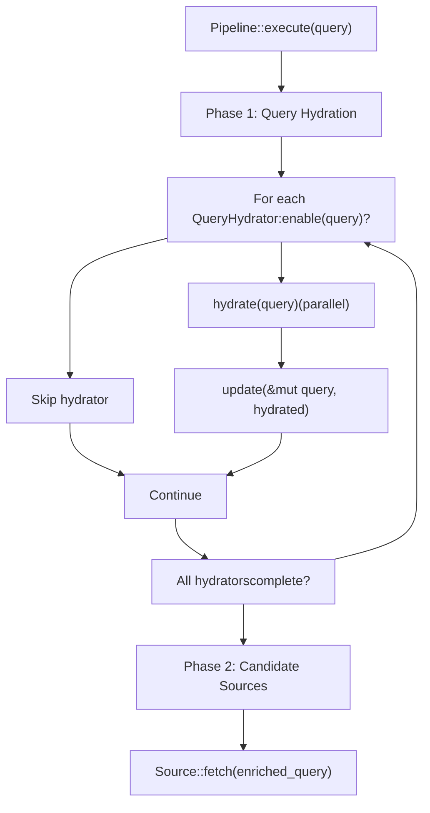
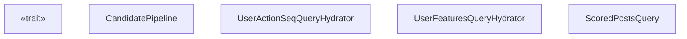
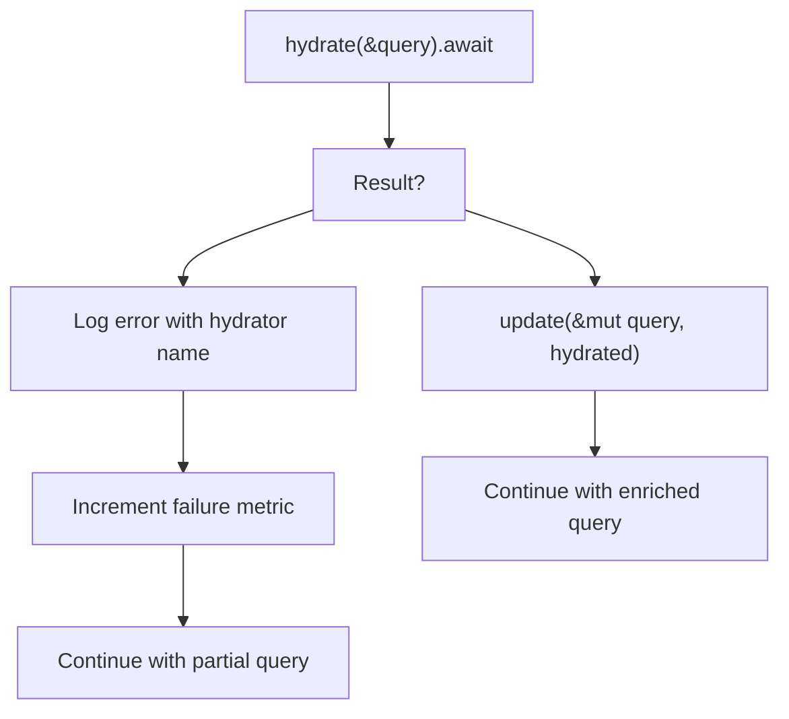

# QueryHydrator Trait

Relevant source files

-   [candidate-pipeline/query\_hydrator.rs](https://github.com/xai-org/x-algorithm/blob/aaa167b3/candidate-pipeline/query_hydrator.rs)

## Purpose and Scope

The `QueryHydrator` trait defines a generic interface for enriching query objects with additional context before candidate retrieval begins. Query hydrators execute in parallel during the first phase of the candidate pipeline, augmenting the initial query with user-specific data such as engagement history, behavioral features, and contextual information.

This page documents the trait interface, its lifecycle within pipeline execution, and implementation patterns. For information about the overall pipeline execution model, see [Pipeline Execution Model](/xai-org/x-algorithm/3.1-pipeline-execution-model). For specific implementations used in the Home Mixer, see [Query Hydrators](/xai-org/x-algorithm/4.4-query-hydrators).

**Sources:** [candidate-pipeline/query\_hydrator.rs1-28](https://github.com/xai-org/x-algorithm/blob/aaa167b3/candidate-pipeline/query_hydrator.rs#L1-L28)

---

## Trait Definition

The `QueryHydrator` trait is defined as a generic interface parameterized by query type `Q`:

```
pub trait QueryHydrator<Q>: Any + Send + Syncwhere    Q: Clone + Send + Sync + 'static
```
### Type Parameters

| Parameter | Constraints | Description |
| --- | --- | --- |
| `Q` | `Clone + Send + Sync + 'static` | The query type being enriched (e.g., `ScoredPostsQuery`) |

### Trait Bounds

-   `Any`: Enables runtime type inspection for debugging and monitoring
-   `Send + Sync`: Allows safe concurrent execution across threads
-   Requires `Q` to be cloneable for the immutable update pattern

**Sources:** [candidate-pipeline/query\_hydrator.rs6-10](https://github.com/xai-org/x-algorithm/blob/aaa167b3/candidate-pipeline/query_hydrator.rs#L6-L10)

---

## Pipeline Integration

The following diagram shows where `QueryHydrator` fits in the candidate pipeline execution flow:


Query hydrators execute before any candidate retrieval occurs, ensuring that all downstream components (sources, hydrators, filters, scorers) operate on a fully-enriched query context.

**Sources:** [candidate-pipeline/query\_hydrator.rs1-28](https://github.com/xai-org/x-algorithm/blob/aaa167b3/candidate-pipeline/query_hydrator.rs#L1-L28)

---

## Trait Methods

### enable

```
fn enable(&self, _query: &Q) -> bool {    true}
```
Determines whether this hydrator should execute for a given query. The default implementation returns `true`, meaning the hydrator runs unconditionally.

**Use Cases:**

-   Feature flag checks (e.g., only hydrate if experiment enabled)
-   Query-specific conditions (e.g., only for certain locales)
-   Performance optimizations (e.g., skip if data already present)

**Parameters:**

| Name | Type | Description |
| --- | --- | --- |
| `query` | `&Q` | Immutable reference to the query |

**Returns:** `bool` indicating whether to execute `hydrate`

**Sources:** [candidate-pipeline/query\_hydrator.rs11-14](https://github.com/xai-org/x-algorithm/blob/aaa167b3/candidate-pipeline/query_hydrator.rs#L11-L14)

---

### hydrate

```
async fn hydrate(&self, query: &Q) -> Result<Q, String>;
```
Performs asynchronous operations to enrich the query. This method receives an immutable reference to the original query and returns a new query instance with hydrated fields populated.

**Execution Context:**

-   Runs in parallel with other enabled query hydrators
-   Operates on a clone of the query to prevent mutation conflicts
-   May perform external service calls (databases, RPC services, caches)

**Parameters:**

| Name | Type | Description |
| --- | --- | --- |
| `query` | `&Q` | Immutable reference to the original query |

**Returns:** `Result<Q, String>` containing either:

-   `Ok(Q)`: A new query instance with hydrated fields
-   `Err(String)`: Error message describing the failure

**Error Handling:** If `hydrate` returns an error, the pipeline typically logs the failure and continues execution with partially-enriched data, depending on configuration.

**Sources:** [candidate-pipeline/query\_hydrator.rs16-18](https://github.com/xai-org/x-algorithm/blob/aaa167b3/candidate-pipeline/query_hydrator.rs#L16-L18)

---

### update

```
fn update(&self, query: &mut Q, hydrated: Q);
```
Selectively copies fields from the hydrated query back into the original mutable query. This method enforces field-level ownership by ensuring each hydrator only updates fields it is responsible for.

**Ownership Pattern:**

The `update` method implements a critical design pattern:

1.  Each hydrator "owns" specific fields in the query struct
2.  Only those owned fields are copied from `hydrated` to `query`
3.  Other fields remain unchanged, preserving work from other hydrators

**Example Pattern:**

```
// In UserActionSeqQueryHydrator:
fn update(&self, query: &mut ScoredPostsQuery, hydrated: ScoredPostsQuery) {
    query.user_action_sequence = hydrated.user_action_sequence; // Only update owned field
}
```
**Parameters:**

| Name | Type | Description |
| --- | --- | --- |
| `query` | `&mut Q` | Mutable reference to the query being enriched |
| `hydrated` | `Q` | The hydrated query returned from `hydrate` |

**Sources:** [candidate-pipeline/query\_hydrator.rs20-22](https://github.com/xai-org/x-algorithm/blob/aaa167b3/candidate-pipeline/query_hydrator.rs#L20-L22)

---

### name

```
fn name(&self) -> &'static str {    util::short_type_name(type_name_of_val(self))}
```
Returns a human-readable name for the hydrator, used in logging, metrics, and debugging. The default implementation extracts the type name.

**Returns:** `&'static str` containing the hydrator's short type name

**Sources:** [candidate-pipeline/query\_hydrator.rs24-26](https://github.com/xai-org/x-algorithm/blob/aaa167b3/candidate-pipeline/query_hydrator.rs#L24-L26)

---

## Execution Model

The following sequence diagram illustrates how the pipeline orchestrates multiple query hydrators:

> **[Mermaid sequence]**
> *(图表结构无法解析)*

**Key Execution Characteristics:**

1.  **Parallel Hydration:** All enabled hydrators execute `hydrate` concurrently using `tokio::join!` or similar constructs
2.  **Sequential Updates:** The `update` calls execute sequentially to safely mutate the query object
3.  **Field Isolation:** Each hydrator updates only its owned fields, preventing conflicts

**Sources:** [candidate-pipeline/query\_hydrator.rs1-28](https://github.com/xai-org/x-algorithm/blob/aaa167b3/candidate-pipeline/query_hydrator.rs#L1-L28)

---

## Implementation Pattern

The following diagram shows the relationship between the trait, pipeline, and concrete implementations:


**Sources:** [candidate-pipeline/query\_hydrator.rs1-28](https://github.com/xai-org/x-algorithm/blob/aaa167b3/candidate-pipeline/query_hydrator.rs#L1-L28)

---

## Concrete Implementations in Home Mixer

The Home Mixer's `PhoenixCandidatePipeline` uses the following query hydrators to enrich `ScoredPostsQuery`:

| Hydrator | Purpose | Fields Updated | External Service |
| --- | --- | --- | --- |
| `UserActionSeqQueryHydrator` | Retrieves recent user engagement history | `user_action_sequence` | `UserActionSequenceFetcher` |
| `UserFeaturesQueryHydrator` | Fetches user-level features for scoring | `user_features` | `StratoClient` |

These implementations follow the trait pattern:

1.  **`enable`**: Check feature flags or query conditions
2.  **`hydrate`**: Make async service calls to fetch data
3.  **`update`**: Copy only owned fields to the mutable query

For detailed documentation of these implementations, see [Query Hydrators](/xai-org/x-algorithm/4.4-query-hydrators).

**Sources:** [candidate-pipeline/query\_hydrator.rs1-28](https://github.com/xai-org/x-algorithm/blob/aaa167b3/candidate-pipeline/query_hydrator.rs#L1-L28)

---

## Design Rationale

### Immutable Hydration Pattern

The `hydrate` method operates on an immutable reference and returns a new query instance, rather than mutating in place. This design choice provides:

1.  **Safe Parallelism:** Multiple hydrators can read the original query concurrently without synchronization
2.  **Failure Isolation:** If one hydrator fails, the original query remains unchanged
3.  **Testing Simplicity:** Pure functions are easier to test and reason about

### Selective Field Updates

The `update` method enforces field-level ownership, preventing hydrators from accidentally overwriting each other's work. This is critical because:

1.  Hydrators execute in parallel, so `hydrate` results arrive in non-deterministic order
2.  Each hydrator "claims" specific fields it is responsible for
3.  The sequential `update` phase safely merges all hydrated fields

### Conditional Execution

The `enable` method allows runtime decisions about whether to execute a hydrator, supporting:

1.  **Experiment Flags:** Only hydrate for users in specific experiments
2.  **Performance Optimization:** Skip expensive operations when data is already present
3.  **Query-Specific Logic:** Conditionally hydrate based on query parameters

**Sources:** [candidate-pipeline/query\_hydrator.rs1-28](https://github.com/xai-org/x-algorithm/blob/aaa167b3/candidate-pipeline/query_hydrator.rs#L1-L28)

---

## Error Handling Strategy

Query hydrator errors are typically handled gracefully:


**Error Handling Characteristics:**

-   **Non-Fatal:** Query hydrator failures typically don't abort the pipeline
-   **Logged:** Errors are logged with the hydrator name and error message
-   **Metered:** Failures increment metrics for monitoring and alerting
-   **Degraded Mode:** Pipeline continues with partially-enriched query

This approach prioritizes availability over completeness, allowing the feed to serve results even when some enrichment services are unavailable.

**Sources:** [candidate-pipeline/query\_hydrator.rs16-18](https://github.com/xai-org/x-algorithm/blob/aaa167b3/candidate-pipeline/query_hydrator.rs#L16-L18)

---

## Summary

The `QueryHydrator` trait provides a composable interface for enriching query context in the candidate pipeline. Its design enables:

-   **Parallel Execution:** Multiple hydrators run concurrently for performance
-   **Field Isolation:** Each hydrator owns specific fields, preventing conflicts
-   **Conditional Logic:** Runtime decisions about whether to execute
-   **Graceful Degradation:** Errors don't prevent pipeline execution

Implementers must provide `hydrate` logic for fetching data and `update` logic for selective field copying, while `enable` and `name` have sensible defaults.

**Sources:** [candidate-pipeline/query\_hydrator.rs1-28](https://github.com/xai-org/x-algorithm/blob/aaa167b3/candidate-pipeline/query_hydrator.rs#L1-L28)
