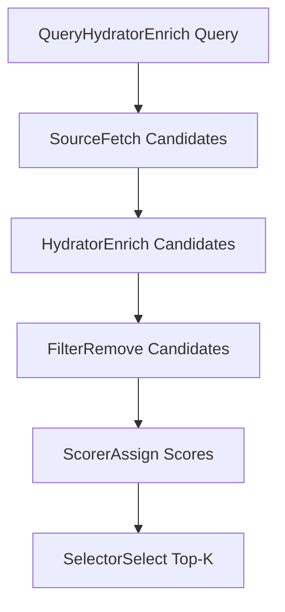
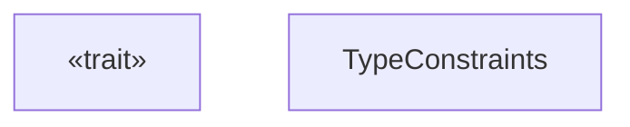
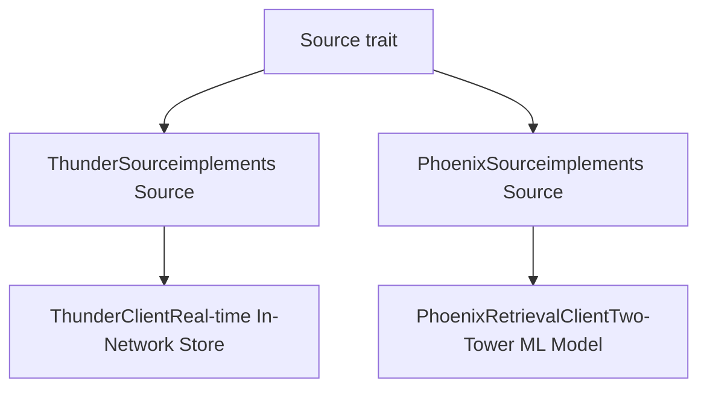

# Source Trait

Relevant source files

-   [candidate-pipeline/source.rs](https://github.com/xai-org/x-algorithm/blob/aaa167b3/candidate-pipeline/source.rs)

## Purpose and Scope

This document describes the `Source` trait, a fundamental abstraction in the candidate pipeline framework that defines the interface for retrieving initial candidate sets from various data sources. The `Source` trait is parameterized by query and candidate types and provides conditional execution capabilities to enable/disable specific sources based on query characteristics.

For information about how sources are orchestrated within the pipeline execution model, see [Pipeline Execution Model](/xai-org/x-algorithm/3.1-pipeline-execution-model). For concrete implementations of the `Source` trait in the Home Mixer (Thunder and Phoenix sources), see [Candidate Sources](/xai-org/x-algorithm/4.3-candidate-sources).

---

## Role in the Pipeline

The `Source` trait represents the second stage in the candidate pipeline execution flow, following query hydration. Sources are responsible for fetching the initial set of candidates that will be subsequently enriched, filtered, scored, and selected. Multiple sources can operate in parallel to retrieve candidates from different systems (e.g., in-network posts, out-of-network recommendations).


**Pipeline Stage Position**

Sources: [candidate-pipeline/source.rs1-23](https://github.com/xai-org/x-algorithm/blob/aaa167b3/candidate-pipeline/source.rs#L1-L23)

---

## Trait Definition

The `Source` trait is defined as a generic, async trait with two type parameters:


**Type Parameters and Constraints**

| Type Parameter | Purpose | Constraints |
| --- | --- | --- |
| `Q` | Query type passed to the source | `Clone + Send + Sync + 'static` |
| `C` | Candidate type returned by the source | `Clone + Send + Sync + 'static` |

The trait also requires implementors to be `Any + Send + Sync`, enabling runtime type identification and safe concurrent access across threads.

Sources: [candidate-pipeline/source.rs6-11](https://github.com/xai-org/x-algorithm/blob/aaa167b3/candidate-pipeline/source.rs#L6-L11)

---

## Method Specifications

### enable

```
fn enable(&self, _query: &Q) -> bool
```
The `enable` method provides conditional execution logic, allowing sources to determine whether they should run for a specific query. This enables dynamic source selection based on query characteristics, experiment configurations, or user segments.

**Default Implementation**: Returns `true`, meaning the source is enabled for all queries unless overridden.

**Use Cases**:

-   Disabling expensive sources for certain user segments
-   A/B testing different candidate sources
-   Conditional activation based on query parameters
-   Rate limiting or quota management

Sources: [candidate-pipeline/source.rs12-15](https://github.com/xai-org/x-algorithm/blob/aaa167b3/candidate-pipeline/source.rs#L12-L15)

---

### get\_candidates

```
async fn get_candidates(&self, query: &Q) -> Result<Vec<C>, String>
```
The `get_candidates` method is the core async operation that retrieves candidates from the underlying data source. This method is only invoked if `enable` returns `true`.

**Signature Details**:

-   **Async**: Supports non-blocking I/O for network requests, database queries, or RPC calls
-   **Input**: Immutable reference to the query object
-   **Output**: `Result<Vec<C>, String>` where success contains a vector of candidates and failure contains an error message

**Error Handling**: Returns a `String` error message on failure, which is propagated through the pipeline execution model. The pipeline framework handles errors according to its configured error tolerance policy.

**Performance Considerations**:

-   Multiple sources execute in parallel when possible
-   Sources should implement timeout logic to prevent hanging requests
-   Empty candidate vectors (`Vec::new()`) are valid responses when no candidates are found

Sources: [candidate-pipeline/source.rs17](https://github.com/xai-org/x-algorithm/blob/aaa167b3/candidate-pipeline/source.rs#L17-L17)

---

### name

```
fn name(&self) -> &'static str
```
The `name` method returns a human-readable identifier for the source, used for logging, metrics, and debugging.

**Default Implementation**: Uses Rust's type introspection to extract the struct name via `type_name_of_val`, then applies a utility function to shorten it to a readable format.

**Usage in Pipeline**:

-   Logging which sources were executed
-   Emitting metrics per source (latency, success rate, candidate count)
-   Error attribution when source failures occur

Sources: [candidate-pipeline/source.rs19-21](https://github.com/xai-org/x-algorithm/blob/aaa167b3/candidate-pipeline/source.rs#L19-L21)

---

## Conditional Execution Model

The `Source` trait's conditional execution capability allows for flexible pipeline configurations. The execution flow follows this pattern:

> **[Mermaid sequence]**
> *(图表结构无法解析)*

**Execution Rules**:

1.  The pipeline calls `enable(query)` for each registered source
2.  Only sources returning `true` proceed to candidate retrieval
3.  Enabled sources execute `get_candidates` in parallel (when independent)
4.  Results from all sources are merged into a single candidate collection

Sources: [candidate-pipeline/source.rs12-17](https://github.com/xai-org/x-algorithm/blob/aaa167b3/candidate-pipeline/source.rs#L12-L17)

---

## Integration with Concrete Implementations

The generic `Source` trait is implemented by concrete source types in the Home Mixer implementation:


**Type Specialization**:

-   `Q` = `ScoredPostsQuery` (user request with context)
-   `C` = `PostCandidate` (tweet candidate with metadata)

For detailed documentation of these implementations, see:

-   [Thunder Source](/xai-org/x-algorithm/4.3.1-thunder-source) - In-network post retrieval from real-time store
-   [Phoenix Retrieval Source](/xai-org/x-algorithm/4.3.2-phoenix-retrieval-source) - Out-of-network discovery via ML similarity search

Sources: [candidate-pipeline/source.rs7-10](https://github.com/xai-org/x-algorithm/blob/aaa167b3/candidate-pipeline/source.rs#L7-L10)

---

## Summary

The `Source` trait provides a clean abstraction for candidate retrieval with the following key characteristics:

| Characteristic | Description |
| --- | --- |
| **Genericity** | Parameterized by query and candidate types for reusability |
| **Conditional Execution** | `enable` method supports dynamic source activation |
| **Async Design** | Non-blocking candidate retrieval via async/await |
| **Error Propagation** | String-based error messages for pipeline-level handling |
| **Parallel Execution** | Multiple sources can execute concurrently |
| **Observable** | Built-in naming support for metrics and logging |

The trait's design prioritizes flexibility, performance, and maintainability, enabling the pipeline framework to support diverse candidate sources with consistent orchestration semantics.

Sources: [candidate-pipeline/source.rs1-23](https://github.com/xai-org/x-algorithm/blob/aaa167b3/candidate-pipeline/source.rs#L1-L23)
