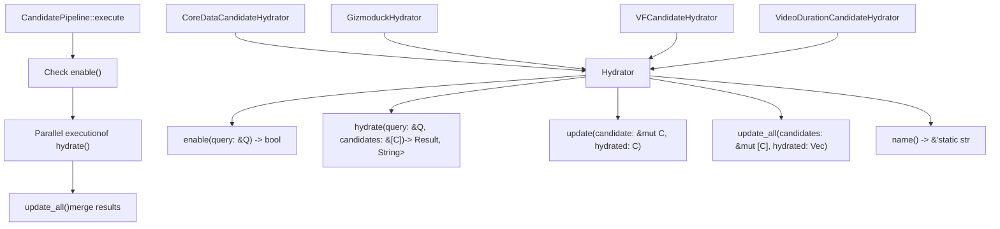
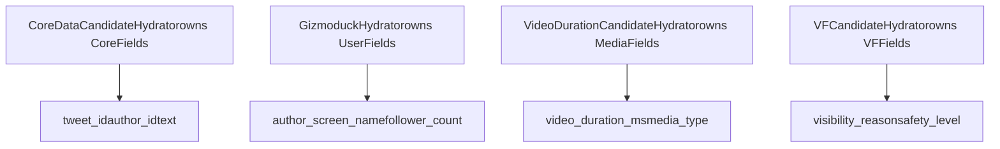
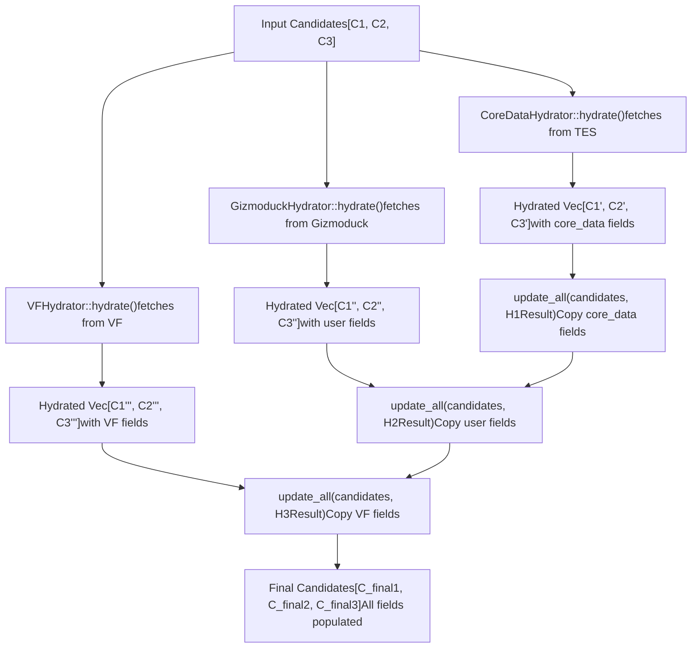
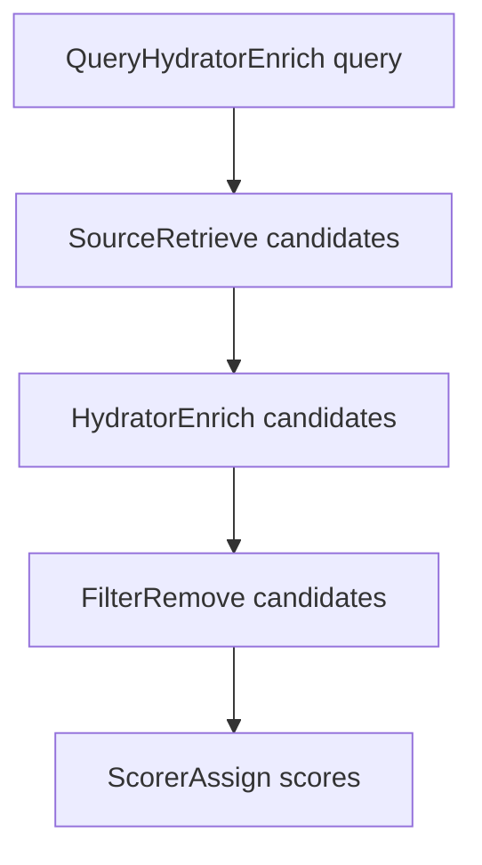

# Hydrator Trait

Relevant source files

-   [candidate-pipeline/hydrator.rs](https://github.com/xai-org/x-algorithm/blob/aaa167b3/candidate-pipeline/hydrator.rs)

## Purpose and Scope

The `Hydrator` trait is a core abstraction in the Candidate Pipeline Framework that enables enrichment of candidates with additional data after retrieval. Hydrators execute in parallel to fetch metadata, user information, visibility data, and other fields from external services, progressively building complete candidate objects.

This page documents the trait interface, execution semantics, and field-level update patterns. For query-level enrichment, see [QueryHydrator Trait](/xai-org/x-algorithm/3.2-queryhydrator-trait). For concrete hydrator implementations in the Home Mixer, see [Candidate Hydrators](/xai-org/x-algorithm/4.5-candidate-hydrators).

**Sources:** [candidate-pipeline/hydrator.rs1-40](https://github.com/xai-org/x-algorithm/blob/aaa167b3/candidate-pipeline/hydrator.rs#L1-L40)

---

## Trait Definition

The `Hydrator` trait is defined as a generic, async interface for candidate enrichment:

```
#[async_trait]pub trait Hydrator<Q, C>: Any + Send + Sync
```
### Type Parameters

| Parameter | Description | Bounds |
| --- | --- | --- |
| `Q` | Query type containing request context | `Clone + Send + Sync + 'static` |
| `C` | Candidate type to be enriched | `Clone + Send + Sync + 'static` |

The trait requires `Any + Send + Sync` bounds to support:

-   **`Any`**: Runtime type introspection and downcasting
-   **`Send + Sync`**: Safe concurrent execution across threads
-   **Lifetime `'static`**: No borrowed references, enabling flexible async execution

**Sources:** [candidate-pipeline/hydrator.rs5-11](https://github.com/xai-org/x-algorithm/blob/aaa167b3/candidate-pipeline/hydrator.rs#L5-L11)

---

## Trait Architecture


**Sources:** [candidate-pipeline/hydrator.rs5-39](https://github.com/xai-org/x-algorithm/blob/aaa167b3/candidate-pipeline/hydrator.rs#L5-L39)

---

## Method Reference

### `enable()`

```
fn enable(&self, _query: &Q) -> bool {    true}
```
**Purpose:** Conditional execution control. Determines whether this hydrator should run for a given query.

**Default Behavior:** Always returns `true`, meaning the hydrator runs unconditionally.

**Use Cases:**

-   Feature gating based on query parameters
-   A/B testing different hydration strategies
-   Skip expensive hydration for certain user segments

**Example Pattern:**

```
// Hypothetical implementationfn enable(&self, query: &ScoredPostsQuery) -> bool {    query.client_context.is_premium_user}
```
**Sources:** [candidate-pipeline/hydrator.rs12-15](https://github.com/xai-org/x-algorithm/blob/aaa167b3/candidate-pipeline/hydrator.rs#L12-L15)

---

### `hydrate()`

```
async fn hydrate(&self, query: &Q, candidates: &[C]) -> Result<Vec<C>, String>
```
**Purpose:** Performs asynchronous data fetching and enrichment. This is where external service calls, database queries, and computation occur.

**Parameters:**

-   `query`: Request context for making hydration decisions
-   `candidates`: Slice of candidates to enrich

**Return Value:**

-   `Ok(Vec<C>)`: Successfully hydrated candidates
-   `Err(String)`: Error message on failure

**Critical Constraint:** The returned vector MUST:

1.  Contain the same number of candidates as the input
2.  Preserve the exact order of candidates
3.  Not drop any candidates

Dropping candidates violates the trait contract and must be done in a [Filter](/xai-org/x-algorithm/3.5-filter-trait) stage instead.

**Sources:** [candidate-pipeline/hydrator.rs17-22](https://github.com/xai-org/x-algorithm/blob/aaa167b3/candidate-pipeline/hydrator.rs#L17-L22)

---

### `update()`

```
fn update(&self, candidate: &mut C, hydrated: C)
```
**Purpose:** Field-level selective merge. Copies only the fields that this hydrator is responsible for from `hydrated` into `candidate`.

**Field Ownership Model:**


Each hydrator implementation must:

-   Only modify fields it "owns"
-   Leave other fields unchanged
-   Not depend on fields owned by other hydrators

This ownership model enables:

-   **Parallel execution**: No data races since hydrators modify disjoint field sets
-   **Modularity**: Hydrators are independent and composable
-   **Testability**: Each hydrator can be tested in isolation

**Sources:** [candidate-pipeline/hydrator.rs24-26](https://github.com/xai-org/x-algorithm/blob/aaa167b3/candidate-pipeline/hydrator.rs#L24-L26)

---

### `update_all()`

```
fn update_all(&self, candidates: &mut [C], hydrated: Vec<C>) {    for (c, h) in candidates.iter_mut().zip(hydrated) {        self.update(c, h);    }}
```
**Purpose:** Batch field updates. Applies `update()` to each candidate-hydrated pair.

**Default Implementation:** Iterates through both collections and calls `update()` for each pair.

**When to Override:** Rarely needed, but can be overridden for:

-   Bulk operations with side effects
-   Optimized batch processing
-   Special merging logic

**Sources:** [candidate-pipeline/hydrator.rs28-34](https://github.com/xai-org/x-algorithm/blob/aaa167b3/candidate-pipeline/hydrator.rs#L28-L34)

---

### `name()`

```
fn name(&self) -> &'static str {    util::short_type_name(type_name_of_val(self))}
```
**Purpose:** Returns a human-readable name for this hydrator, used in logging, metrics, and debugging.

**Default Implementation:** Extracts the struct name via runtime type introspection.

**Example Output:**

-   `CoreDataCandidateHydrator` → `"CoreDataCandidateHydrator"`
-   `GizmoduckHydrator` → `"GizmoduckHydrator"`

**Sources:** [candidate-pipeline/hydrator.rs36-38](https://github.com/xai-org/x-algorithm/blob/aaa167b3/candidate-pipeline/hydrator.rs#L36-L38)

---

## Parallel Execution Model

Hydrators execute in parallel to minimize latency. The pipeline orchestrates concurrent execution of all enabled hydrators.

### Execution Sequence

> **[Mermaid sequence]**
> *(图表结构无法解析)*

### Parallelism Benefits

| Aspect | Sequential | Parallel |
| --- | --- | --- |
| **Total Latency** | Sum of all hydrator latencies | Max of any hydrator latency |
| **Throughput** | Limited by slowest hydrator | Limited by available cores |
| **Resource Usage** | Underutilizes async runtime | Saturates I/O and CPU |

**Example:** If CoreData takes 20ms, Gizmoduck takes 15ms, and VF takes 30ms:

-   **Sequential**: 20 + 15 + 30 = 65ms
-   **Parallel**: max(20, 15, 30) = 30ms

**Sources:** [candidate-pipeline/hydrator.rs5](https://github.com/xai-org/x-algorithm/blob/aaa167b3/candidate-pipeline/hydrator.rs#L5-L5)

---

## Field-Level Update Strategy

The hydrator pattern uses a two-phase process: **fetch** (parallel) + **merge** (sequential).

### Two-Phase Update Pattern


### Why This Design?

1.  **Parallel Fetch**: External service calls are independent and I/O-bound, so parallelism maximizes throughput
2.  **Sequential Merge**: Field updates touch disjoint memory regions, but sequential execution simplifies reasoning and prevents potential merge conflicts
3.  **Immutable Fetch**: `hydrate()` returns new `Vec<C>` rather than mutating in-place, enabling pure functional patterns

**Sources:** [candidate-pipeline/hydrator.rs17-34](https://github.com/xai-org/x-algorithm/blob/aaa167b3/candidate-pipeline/hydrator.rs#L17-L34)

---

## Constraints and Invariants

### Order Preservation

```
// ✅ CORRECT: Same order, same countasync fn hydrate(&self, query: &Q, candidates: &[C]) -> Result<Vec<C>, String> {    let mut result = Vec::with_capacity(candidates.len());    for candidate in candidates {        result.push(self.enrich(candidate).await?);    }    Ok(result)} // ❌ INCORRECT: Filtered candidates breaks orderasync fn hydrate(&self, query: &Q, candidates: &[C]) -> Result<Vec<C>, String> {    let mut result = Vec::new();    for candidate in candidates {        if candidate.is_valid() {  // ❌ Dropping candidates!            result.push(self.enrich(candidate).await?);        }    }    Ok(result)}
```
**Rationale:** The pipeline tracks candidates by index position. Reordering or dropping candidates breaks downstream stages like `update_all()`, which relies on `zip()` to match candidates.

**Sources:** [candidate-pipeline/hydrator.rs20-21](https://github.com/xai-org/x-algorithm/blob/aaa167b3/candidate-pipeline/hydrator.rs#L20-L21)

---

### Field Ownership

Each hydrator must only modify fields it owns:

```
// ✅ CORRECT: Only update owned fieldsfn update(&self, candidate: &mut PostCandidate, hydrated: PostCandidate) {    // CoreDataHydrator only updates these fields    candidate.tweet_text = hydrated.tweet_text;    candidate.author_id = hydrated.author_id;    candidate.created_at = hydrated.created_at;    // Does NOT touch author_screen_name (owned by GizmoduckHydrator)} // ❌ INCORRECT: Modifying fields owned by other hydratorsfn update(&self, candidate: &mut PostCandidate, hydrated: PostCandidate) {    candidate.tweet_text = hydrated.tweet_text;    candidate.author_screen_name = hydrated.author_screen_name;  // ❌ Not owned!}
```
**Sources:** [candidate-pipeline/hydrator.rs24-26](https://github.com/xai-org/x-algorithm/blob/aaa167b3/candidate-pipeline/hydrator.rs#L24-L26)

---

### Idempotency

Hydrators should be idempotent: calling `hydrate()` multiple times with the same inputs should produce the same output.

**Why:** Enables retry logic, caching, and predictable behavior in error scenarios.

---

## Integration with Pipeline

The `Hydrator` trait integrates into the pipeline between [Source](/xai-org/x-algorithm/3.3-source-trait) and [Filter](/xai-org/x-algorithm/3.5-filter-trait) stages.

### Pipeline Stage Interaction


**Key Differences:**

| Aspect | Source | Hydrator | Filter |
| --- | --- | --- | --- |
| **Input** | Query only | Query + candidates | Query + candidates |
| **Output** | New candidates | Enriched candidates (same count) | Filtered candidates (reduced count) |
| **Execution** | Parallel | Parallel | Sequential |
| **Purpose** | Retrieve | Enrich | Eliminate |

**Sources:** [candidate-pipeline/hydrator.rs1-40](https://github.com/xai-org/x-algorithm/blob/aaa167b3/candidate-pipeline/hydrator.rs#L1-L40)

---

## Concrete Implementations

The Home Mixer implements several hydrators for the Phoenix Candidate Pipeline:

| Hydrator | Fields Populated | External Service |
| --- | --- | --- |
| `CoreDataCandidateHydrator` | `tweet_text`, `author_id`, `core_data` | TES (Tweet Entity Service) |
| `GizmoduckHydrator` | `author_screen_name`, `follower_count` | Gizmoduck |
| `InNetworkCandidateHydrator` | `is_in_network` | Local graph lookup |
| `SubscriptionHydrator` | `subscription_author_ids` | TES |
| `VFCandidateHydrator` | `visibility_reason`, `vf_result` | Visibility Filtering |
| `VideoDurationCandidateHydrator` | `video_duration_ms` | TES |

For detailed documentation of each implementation, see [Candidate Hydrators](/xai-org/x-algorithm/4.5-candidate-hydrators).

**Sources:** [candidate-pipeline/hydrator.rs1-40](https://github.com/xai-org/x-algorithm/blob/aaa167b3/candidate-pipeline/hydrator.rs#L1-L40)

---

## Usage Example

Typical hydrator implementation pattern:

```
pub struct CoreDataCandidateHydrator {    tes_client: Arc<dyn TESClient>,} #[async_trait]impl Hydrator<ScoredPostsQuery, PostCandidate> for CoreDataCandidateHydrator {    fn enable(&self, _query: &ScoredPostsQuery) -> bool {        true  // Always run    }        async fn hydrate(        &self,        _query: &ScoredPostsQuery,        candidates: &[PostCandidate],    ) -> Result<Vec<PostCandidate>, String> {        let tweet_ids: Vec<_> = candidates.iter().map(|c| c.tweet_id).collect();        let tweet_data = self.tes_client.batch_get_tweets(&tweet_ids).await?;                // Must preserve order and count        let hydrated: Vec<_> = candidates.iter().enumerate().map(|(i, c)| {            let mut enriched = c.clone();            if let Some(data) = tweet_data.get(i) {                enriched.tweet_text = Some(data.text.clone());                enriched.author_id = Some(data.author_id);            }            enriched        }).collect();                Ok(hydrated)    }        fn update(&self, candidate: &mut PostCandidate, hydrated: PostCandidate) {        // Only copy fields owned by this hydrator        candidate.tweet_text = hydrated.tweet_text;        candidate.author_id = hydrated.author_id;        candidate.core_data = hydrated.core_data;    }}
```
**Sources:** [candidate-pipeline/hydrator.rs5-39](https://github.com/xai-org/x-algorithm/blob/aaa167b3/candidate-pipeline/hydrator.rs#L5-L39)
