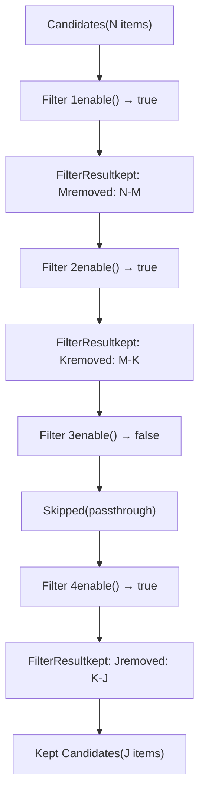
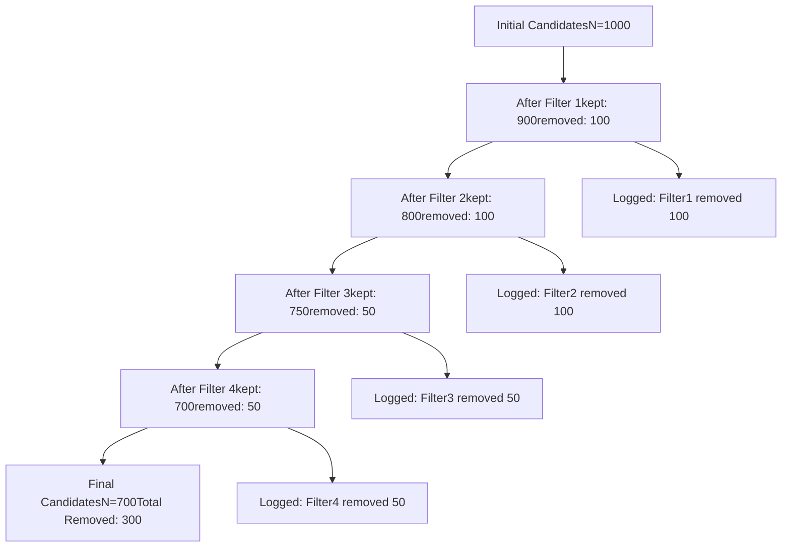
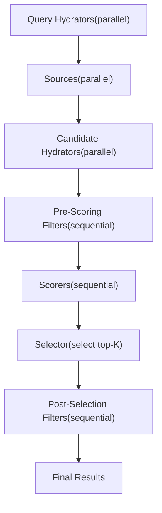
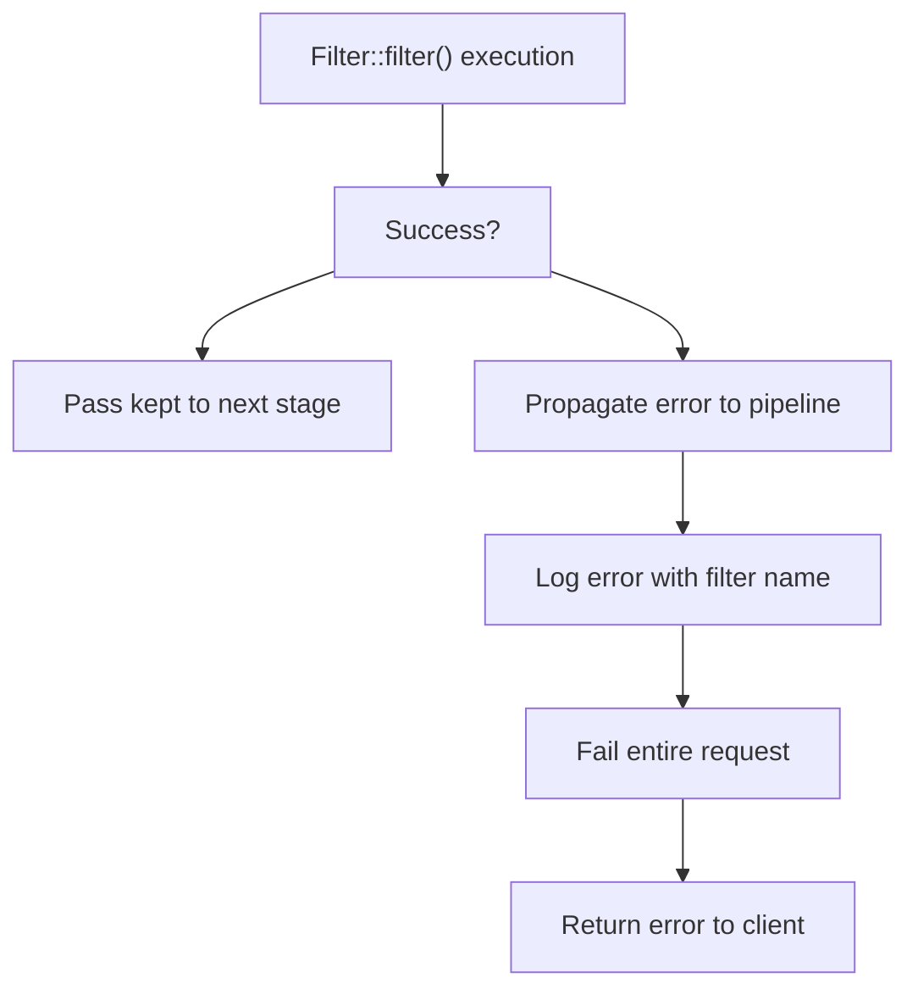

# Filter Trait

Relevant source files

-   [candidate-pipeline/filter.rs](https://github.com/xai-org/x-algorithm/blob/aaa167b3/candidate-pipeline/filter.rs)

## Purpose and Scope

This document describes the `Filter` trait, a core abstraction in the candidate pipeline framework that removes ineligible candidates from the processing pipeline. Filters partition candidates into kept and removed sets based on eligibility criteria. This trait is defined in the generic framework layer and is implemented by various concrete filters in the Home Mixer implementation.

For concrete filter implementations in the Home Mixer, see [Filters](/xai-org/x-algorithm/4.6-filters). For other pipeline stage traits, see [QueryHydrator](/xai-org/x-algorithm/3.2-queryhydrator-trait), [Source](/xai-org/x-algorithm/3.3-source-trait), [Hydrator](/xai-org/x-algorithm/3.4-hydrator-trait), [Scorer](/xai-org/x-algorithm/3.6-scorer-trait), and [Selector](/xai-org/x-algorithm/3.7-selector-trait).

---

## Overview

The `Filter` trait provides a standardized interface for removing candidates that do not meet specific eligibility criteria. Unlike hydrators that enrich data or scorers that assign values, filters perform binary decisions: each candidate is either kept for further processing or removed from the pipeline.

Key characteristics of the Filter trait:

-   **Sequential Execution**: Filters execute one after another in a defined order, with each filter operating on the output of the previous filter
-   **Partition Logic**: Each filter partitions the input candidates into two sets: kept and removed
-   **Conditional Execution**: Filters can be conditionally enabled based on query properties
-   **Immutable Decisions**: Once a candidate is removed by a filter, it does not proceed to subsequent stages
-   **Explicit Tracking**: Both kept and removed candidates are returned, enabling logging, metrics, and debugging

**Sources:** [candidate-pipeline/filter.rs1-33](https://github.com/xai-org/x-algorithm/blob/aaa167b3/candidate-pipeline/filter.rs#L1-L33)

---

## Trait Definition

The `Filter` trait is defined with two generic type parameters:

```
Filter<Q, C>
```
| Type Parameter | Description |
| --- | --- |
| `Q` | Query type that provides context for filtering decisions (e.g., `ScoredPostsQuery`) |
| `C` | Candidate type being filtered (e.g., `PostCandidate`) |

### Type Constraints

Both generic types must satisfy:

-   `Clone`: Enables copying of data structures
-   `Send + Sync`: Allows safe concurrent access across threads
-   `'static`: Ensures data lives for the program's duration

The trait itself requires `Any + Send + Sync`, enabling:

-   Runtime type identification via `std::any::Any`
-   Thread-safe execution across the async runtime
-   Type-erased storage in trait object collections

**Sources:** [candidate-pipeline/filter.rs13-17](https://github.com/xai-org/x-algorithm/blob/aaa167b3/candidate-pipeline/filter.rs#L13-L17)

---

## FilterResult Structure

Each filter returns a `FilterResult<C>` that explicitly partitions candidates:

```
pub struct FilterResult<C> {    pub kept: Vec<C>,    pub removed: Vec<C>,}
```
### Field Semantics

| Field | Description |
| --- | --- |
| `kept` | Candidates that passed the filter's criteria and proceed to the next stage |
| `removed` | Candidates that failed the filter's criteria and are excluded from further processing |

This explicit partition structure enables:

-   **Observability**: Removed candidates can be logged with reasons for debugging
-   **Metrics**: Filter effectiveness can be measured (e.g., removal rate, removal reason distribution)
-   **Auditability**: The pipeline maintains a complete record of which filters removed which candidates
-   **Testing**: Filter behavior can be validated by inspecting both kept and removed sets

**Sources:** [candidate-pipeline/filter.rs6-9](https://github.com/xai-org/x-algorithm/blob/aaa167b3/candidate-pipeline/filter.rs#L6-L9)

---

## Trait Methods

### enable Method

```
fn enable(&self, _query: &Q) -> bool {    true}
```
The `enable` method determines whether a filter should execute for a given query.

| Aspect | Details |
| --- | --- |
| Default Behavior | Returns `true` (filter always runs) |
| Override Purpose | Conditional filter execution based on query properties |
| Common Use Cases | \- Disable filters for specific user segments
\- Skip expensive filters for cached queries
\- Enable experimental filters via feature flags |
| Execution Timing | Called before `filter` method during pipeline execution |

Example scenarios for overriding:

-   A filter that only applies to out-of-network content can check query flags
-   A filter that requires specific enriched query data can verify its presence
-   A filter in experimental rollout can check user cohort assignments

**Sources:** [candidate-pipeline/filter.rs18-21](https://github.com/xai-org/x-algorithm/blob/aaa167b3/candidate-pipeline/filter.rs#L18-L21)

---

### filter Method

```
async fn filter(&self, query: &Q, candidates: Vec<C>) -> Result<FilterResult<C>, String>;
```
The `filter` method is the core filtering logic that partitions candidates.

| Aspect | Details |
| --- | --- |
| Execution Model | Async, allowing I/O operations (e.g., cache lookups, service calls) |
| Input | Query context and vector of candidates to filter |
| Output | `Result<FilterResult<C>, String>` - success with kept/removed partition or error message |
| Error Handling | Errors propagate to pipeline execution and typically fail the entire request |

#### Implementation Patterns

**Pattern 1: Synchronous Predicate** Most filters use synchronous logic that evaluates each candidate against a predicate:

```
for each candidate:
    if predicate(query, candidate):
        kept.push(candidate)
    else:
        removed.push(candidate)
```
**Pattern 2: Async External Check** Some filters require async operations (e.g., checking a bloom filter cache):

```
futures = candidates.map(|c| async_check(c))
results = join_all(futures).await
partition results into kept/removed
```
**Pattern 3: Batch Optimization** Filters can batch external calls for efficiency:

```
ids = extract_ids(candidates)
blocked_ids = fetch_blocked_batch(ids).await
partition candidates based on blocked_ids
```
**Sources:** [candidate-pipeline/filter.rs23-26](https://github.com/xai-org/x-algorithm/blob/aaa167b3/candidate-pipeline/filter.rs#L23-L26)

---

### name Method

```
fn name(&self) -> &'static str {    util::short_type_name(type_name_of_val(self))}
```
The `name` method returns a stable identifier for the filter.

| Aspect | Details |
| --- | --- |
| Default Behavior | Extracts the type name from the implementing struct |
| Return Type | Static string slice with 'static lifetime |
| Common Override | Provide a more readable name than the full type path |
| Usage | \- Logging filter execution
\- Emitting metrics per filter
\- Debugging pipeline stage order
\- Generating execution traces |

Example default names:

-   `AgeFilter` (short type name)
-   `AuthorSocialgraphFilter`
-   `DropDuplicatesFilter`

**Sources:** [candidate-pipeline/filter.rs29-31](https://github.com/xai-org/x-algorithm/blob/aaa167b3/candidate-pipeline/filter.rs#L29-L31)

---

## Execution Model

### Sequential Execution Pattern

Unlike hydrators that can run in parallel, filters execute sequentially in a deterministic order. This design ensures:

1.  **Efficient Early Rejection**: Cheap filters run first to eliminate candidates before expensive operations
2.  **Dependency Ordering**: Later filters can assume earlier filters' invariants hold
3.  **Deterministic Results**: Same input produces same output regardless of execution timing


**Sources:** [candidate-pipeline/filter.rs11](https://github.com/xai-org/x-algorithm/blob/aaa167b3/candidate-pipeline/filter.rs#L11-L11)

---

### Partition Semantics

Each filter implements a partition function that satisfies:

```
kept ∪ removed = input
kept ∩ removed = ∅
```
Properties:

-   **Completeness**: Every input candidate appears in exactly one output set
-   **Disjointness**: No candidate appears in both kept and removed sets
-   **Order Preservation**: Kept candidates maintain their relative order (typically)
-   **Idempotency**: Running the same filter twice produces the same kept set

### Pipeline-Level Accumulation

The pipeline accumulates removal information across all filters:


**Sources:** [candidate-pipeline/filter.rs6-9](https://github.com/xai-org/x-algorithm/blob/aaa167b3/candidate-pipeline/filter.rs#L6-L9)

---

## Integration with Candidate Pipeline

### Position in Pipeline Stages

Filters occupy two positions in the candidate pipeline execution flow:


**Pre-Scoring Filters**: Remove candidates before expensive ML scoring

-   Age filters (eliminate old posts)
-   Duplicate filters (remove redundant candidates)
-   Block/mute filters (respect user preferences)
-   Self-tweet filters (remove user's own posts from recommendations)

**Post-Selection Filters**: Validate top-K candidates after scoring

-   Visibility filters (final safety checks)
-   Conversation deduplication (ensure thread diversity)
-   Real-time checks (verify post still exists, not deleted)

**Sources:** [candidate-pipeline/filter.rs1-33](https://github.com/xai-org/x-algorithm/blob/aaa167b3/candidate-pipeline/filter.rs#L1-L33)

---

### Filter Trait in Type System

The following diagram shows how the Filter trait relates to other pipeline traits:

```mermaid
flowchart TD
    classId_Filter_7["«trait»"]
    classId_FilterResult_8["«struct»"]
    classId_AgeFilter_9["AgeFilter"]
    classId_AuthorSocialgraphFilter_10["AuthorSocialgraphFilter"]
    classId_DropDuplicatesFilter_11["DropDuplicatesFilter"]
    classId_PreviouslySeenPostsFilter_12["PreviouslySeenPostsFilter"]
    classId_MutedKeywordFilter_13["MutedKeywordFilter"]
    classId_VFFilter_14["VFFilter"]
```


**Sources:** [candidate-pipeline/filter.rs6-32](https://github.com/xai-org/x-algorithm/blob/aaa167b3/candidate-pipeline/filter.rs#L6-L32)

---

## Implementation Contract

Implementers of the `Filter` trait must adhere to the following contract:

### Correctness Requirements

| Requirement | Description |
| --- | --- |
| **Partition Completeness** | Every input candidate must appear in either `kept` or `removed` |
| **No Duplication** | No candidate may appear in both `kept` and `removed` |
| **No Loss** | The sum of kept and removed lengths must equal input length |
| **No Creation** | Cannot add candidates not present in input |
| **Async Safety** | Must be safe to call from async context with Send + Sync bounds |

### Performance Considerations

| Consideration | Guidance |
| --- | --- |
| **Time Complexity** | Should be O(n) or better; avoid O(n²) comparisons if possible |
| **Memory Allocation** | Reuse vectors when possible; avoid unnecessary cloning |
| **External Calls** | Batch external service calls; use async concurrency within the filter |
| **Early Exit** | Short-circuit evaluation when possible (e.g., empty input) |

### Example Filter Skeleton

A typical filter implementation follows this structure:

```
impl Filter<ScoredPostsQuery, PostCandidate> for MyFilter {
    fn enable(&self, query: &ScoredPostsQuery) -> bool {
        // Check query flags, feature gates, etc.
    }

    async fn filter(
        &self,
        query: &ScoredPostsQuery,
        candidates: Vec<PostCandidate>
    ) -> Result<FilterResult<PostCandidate>, String> {
        let mut kept = Vec::new();
        let mut removed = Vec::new();

        for candidate in candidates {
            if should_keep(query, &candidate) {
                kept.push(candidate);
            } else {
                removed.push(candidate);
            }
        }

        Ok(FilterResult { kept, removed })
    }
}
```
**Sources:** [candidate-pipeline/filter.rs1-33](https://github.com/xai-org/x-algorithm/blob/aaa167b3/candidate-pipeline/filter.rs#L1-L33)

---

## Relationship to Pipeline Execution

The `CandidatePipeline` trait orchestrates filter execution as part of its `execute` method. The pipeline:

1.  Calls `enable()` on each filter to determine if it should run
2.  For enabled filters, calls `filter()` with current candidates
3.  Passes the `kept` candidates to the next filter
4.  Accumulates `removed` candidates for observability
5.  Continues until all filters have processed or an error occurs

> **[Mermaid sequence]**
> *(图表结构无法解析)*

**Sources:** [candidate-pipeline/filter.rs1-33](https://github.com/xai-org/x-algorithm/blob/aaa167b3/candidate-pipeline/filter.rs#L1-L33)

---

## Common Filter Patterns

### Pattern 1: Property-Based Filter

Filters that check candidate properties without external dependencies:

```
Examples:
- AgeFilter: checks candidate timestamp
- SelfTweetFilter: checks if candidate.author_id == query.user_id
- DropDuplicatesFilter: checks for duplicate candidate IDs
```
Characteristics:

-   Fast (no I/O)
-   Synchronous logic wrapped in async fn
-   Should execute early in filter chain

---

### Pattern 2: Query-Context Filter

Filters that compare candidates against query-enriched context:

```
Examples:
- PreviouslySeenPostsFilter: checks if candidate.id in query.seen_ids
- MutedKeywordFilter: checks if candidate.text matches query.muted_keywords
- AuthorSocialgraphFilter: checks if candidate.author_id in query.blocked_ids
```
Characteristics:

-   Requires query hydration to have completed
-   Fast lookups using hash sets or bloom filters
-   Should execute after property-based filters

---

### Pattern 3: External Service Filter

Filters that call external services for validation:

```
Examples:
- VFFilter: calls visibility filtering service
- RealTimeValidationFilter: verifies post still exists in database
```
Characteristics:

-   Async I/O operations
-   Should batch requests when possible
-   Should execute after cheaper filters reduce candidate set
-   Typically used in post-selection stage

**Sources:** [candidate-pipeline/filter.rs1-33](https://github.com/xai-org/x-algorithm/blob/aaa167b3/candidate-pipeline/filter.rs#L1-L33)

---

## Error Handling Strategy

Filter errors have pipeline-wide impact:


### Error Handling Guidelines

| Scenario | Recommended Approach |
| --- | --- |
| **Expected Failures** | Log and filter out (e.g., malformed candidate) |
| **External Service Down** | Return error to fail fast and trigger retries |
| **Invalid Query State** | Return error indicating misconfiguration |
| **Partial Results** | Decide per-filter: fail or proceed with available data |

**Sources:** [candidate-pipeline/filter.rs26](https://github.com/xai-org/x-algorithm/blob/aaa167b3/candidate-pipeline/filter.rs#L26-L26)

---

## Summary

The `Filter` trait provides a standardized interface for candidate removal in the pipeline framework. Key design principles include:

-   **Sequential execution** for deterministic ordering and early rejection
-   **Explicit partitioning** into kept and removed sets for observability
-   **Conditional execution** via `enable()` for dynamic filter behavior
-   **Type safety** via generic parameters Q and C
-   **Async support** for filters requiring external service calls

Concrete implementations in the Home Mixer leverage this trait to enforce business rules, user preferences, and content safety policies at both pre-scoring and post-selection stages.

**Sources:** [candidate-pipeline/filter.rs1-33](https://github.com/xai-org/x-algorithm/blob/aaa167b3/candidate-pipeline/filter.rs#L1-L33)
