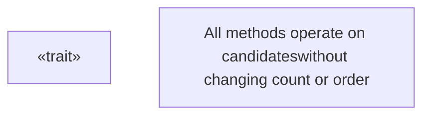
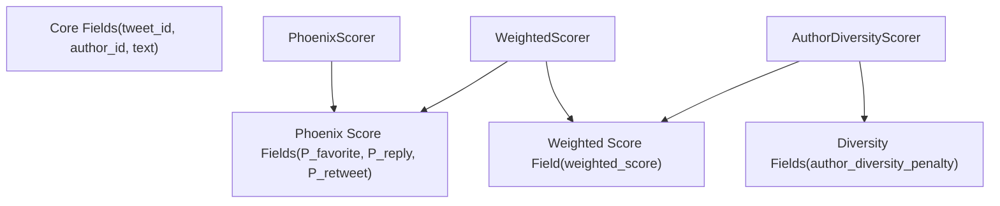
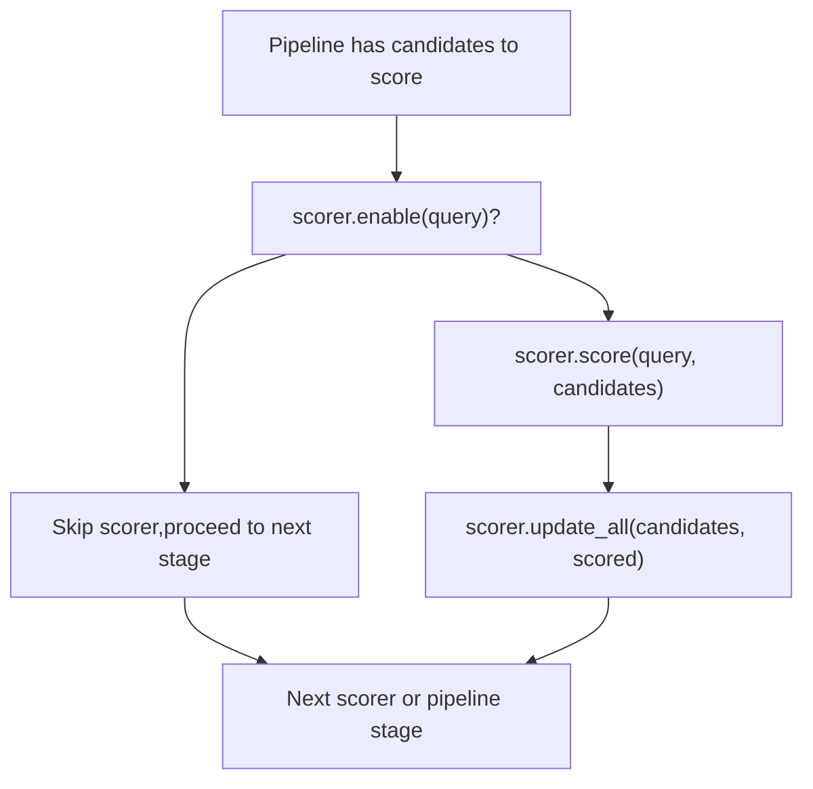
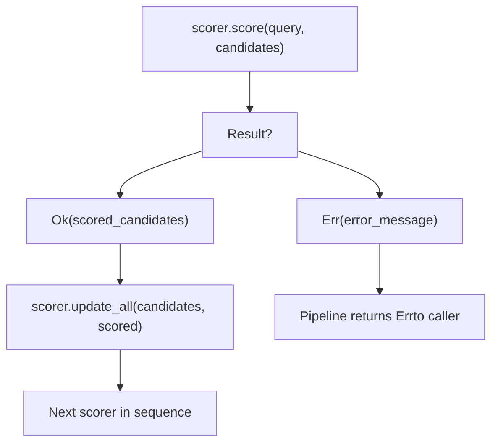

# Scorer Trait

Relevant source files

-   [candidate-pipeline/scorer.rs](https://github.com/xai-org/x-algorithm/blob/aaa167b3/candidate-pipeline/scorer.rs)

## Purpose and Scope

This document describes the `Scorer` trait, a core component of the Candidate Pipeline Framework that assigns scores to candidates for ranking. Scorers execute sequentially after filtering and enrich candidates with computed scores (e.g., relevance scores, engagement predictions) without modifying candidate identity or count.

For information about the broader pipeline execution model, see [Pipeline Execution Model](/xai-org/x-algorithm/3.1-pipeline-execution-model). For the preceding filtering stage, see [Filter Trait](/xai-org/x-algorithm/3.5-filter-trait). For the subsequent selection stage, see [Selector Trait](/xai-org/x-algorithm/3.7-selector-trait). For concrete scorer implementations in the Home Mixer, see [Scorers](/xai-org/x-algorithm/4.7-scorers).

---

## Trait Definition and Contract

The `Scorer` trait is defined as a generic interface parameterized by query type `Q` and candidate type `C`. It provides methods for scoring candidates asynchronously and updating candidate fields with computed scores.

### Trait Structure

```
pub trait Scorer<Q, C>: Send + Syncwhere    Q: Clone + Send + Sync + 'static,    C: Clone + Send + Sync + 'static,
```
**Type Parameters:**

-   `Q`: Query type containing context for scoring decisions
-   `C`: Candidate type that will be enriched with score fields

**Trait Bounds:**

-   `Send + Sync`: Enables concurrent execution across threads
-   `Clone`: Required for functional programming patterns
-   `'static`: Ensures types can live for the entire program duration

**Sources:** [candidate-pipeline/scorer.rs7-10](https://github.com/xai-org/x-algorithm/blob/aaa167b3/candidate-pipeline/scorer.rs#L7-L10)

---

## Trait Methods

The `Scorer` trait defines five methods that implement conditional execution, async scoring, and field-level updates.

### Method Overview Diagram


**Sources:** [candidate-pipeline/scorer.rs5-39](https://github.com/xai-org/x-algorithm/blob/aaa167b3/candidate-pipeline/scorer.rs#L5-L39)

### enable Method

```
fn enable(&self, _query: &Q) -> bool {    true}
```
Determines whether the scorer should execute for a given query. The default implementation returns `true`, enabling the scorer for all queries. Implementations can override this method to implement conditional scoring based on query parameters, feature flags, or experiment assignments.

**Sources:** [candidate-pipeline/scorer.rs13-15](https://github.com/xai-org/x-algorithm/blob/aaa167b3/candidate-pipeline/scorer.rs#L13-L15)

### score Method

```
async fn score(&self, query: &Q, candidates: &[C]) -> Result<Vec<C>, String>;
```
Performs the core scoring logic asynchronously. This method:

-   Receives immutable references to the query and candidate slice
-   Returns a `Result` containing either scored candidates or an error message
-   Must return a vector with **the same candidates in the same order** as the input

**Critical Contract:** The returned vector must preserve candidate identity and ordering. Dropping, reordering, or adding candidates violates the scorer contract. To remove candidates, use the Filter trait instead.

**Sources:** [candidate-pipeline/scorer.rs17-22](https://github.com/xai-org/x-algorithm/blob/aaa167b3/candidate-pipeline/scorer.rs#L17-L22)

### update Method

```
fn update(&self, candidate: &mut C, scored: C);
```
Updates a single candidate with scored fields. This method implements the **field ownership pattern**, where each scorer is responsible for specific fields and must only copy those fields from the scored candidate to the target candidate.

**Field Ownership Pattern:** Each scorer owns specific fields (e.g., `PhoenixScorer` owns engagement probability fields, `WeightedScorer` owns the final weighted score). The `update` method ensures only owned fields are modified, allowing multiple scorers to compose their results on the same candidates.

**Sources:** [candidate-pipeline/scorer.rs24-26](https://github.com/xai-org/x-algorithm/blob/aaa167b3/candidate-pipeline/scorer.rs#L24-L26)

### update\_all Method

```
fn update_all(&self, candidates: &mut [C], scored: Vec<C>) {    for (c, s) in candidates.iter_mut().zip(scored) {        self.update(c, s);    }}
```
Batch updates all candidates by iterating and calling `update` for each candidate-scored pair. The default implementation provides a simple iteration pattern, but implementations can override this method for optimized batch operations.

**Sources:** [candidate-pipeline/scorer.rs28-34](https://github.com/xai-org/x-algorithm/blob/aaa167b3/candidate-pipeline/scorer.rs#L28-L34)

### name Method

```
fn name(&self) -> &'static str {    util::short_type_name(type_name_of_val(self))}
```
Returns a human-readable name for the scorer, used for logging, metrics, and debugging. The default implementation extracts the type name using Rust's reflection capabilities.

**Sources:** [candidate-pipeline/scorer.rs36-38](https://github.com/xai-org/x-algorithm/blob/aaa167b3/candidate-pipeline/scorer.rs#L36-L38)

---

## Sequential Execution Model

Scorers execute **sequentially** within the pipeline, in contrast to Hydrators which execute in parallel. This design choice reflects the dependency structure of scoring operations.

### Execution Flow Diagram

> **[Mermaid sequence]**
> *(图表结构无法解析)*

**Why Sequential?**

1.  **Score Composition:** Later scorers depend on earlier scores (e.g., `WeightedScorer` reads `PhoenixScorer` predictions)
2.  **Ordered Processing:** Diversity adjustments must occur after base scoring
3.  **Deterministic Results:** Sequential execution ensures reproducible scoring

**Sources:** [candidate-pipeline/scorer.rs1-39](https://github.com/xai-org/x-algorithm/blob/aaa167b3/candidate-pipeline/scorer.rs#L1-L39)

---

## Field Ownership and Update Pattern

The scorer architecture uses a **field ownership pattern** where each scorer is responsible for specific candidate fields. This pattern enables composition of multiple independent scoring operations on the same candidates.

### Field Ownership Diagram


### Update Implementation Pattern

Each scorer implements the `update` method to copy only its owned fields:

**Example Pattern:**

```
// PhoenixScorer only updates engagement probability fieldsfn update(&self, candidate: &mut PostCandidate, scored: PostCandidate) {    candidate.phoenix_scores = scored.phoenix_scores;  // Only owned field    // Does NOT modify weighted_score, diversity_penalty, etc.} // WeightedScorer only updates the weighted score fieldfn update(&self, candidate: &mut PostCandidate, scored: PostCandidate) {    candidate.weighted_score = scored.weighted_score;  // Only owned field    // Does NOT modify phoenix_scores, diversity_penalty, etc.}
```
**Benefits:**

-   **Modularity:** Scorers can be added, removed, or reordered independently
-   **Testability:** Each scorer can be tested in isolation
-   **Composability:** Multiple scoring strategies combine naturally
-   **Type Safety:** Rust's ownership system prevents accidental field conflicts

**Sources:** [candidate-pipeline/scorer.rs24-34](https://github.com/xai-org/x-algorithm/blob/aaa167b3/candidate-pipeline/scorer.rs#L24-L34)

---

## Scoring Method Contract

The `score` method has strict contracts that implementations must follow to ensure correct pipeline behavior.

### Contract Requirements

| Requirement | Description | Violation Impact |
| --- | --- | --- |
| **Same Count** | Output must have same number of candidates as input | Pipeline state corruption |
| **Same Order** | Candidates must appear in identical order | Breaks downstream stage assumptions |
| **Same Identity** | Tweet IDs and core fields must not change | Invalidates prior enrichment |
| **Immutable Input** | Input slice is immutable; create new candidates | Enforced by Rust type system |
| **Error Safety** | Return `Result` to signal failures | Enables graceful error handling |

### Contract Violation Examples

```
// ❌ WRONG: Dropping candidatesasync fn score(&self, query: &Q, candidates: &[C]) -> Result<Vec<C>, String> {    let scored = candidates.iter()        .filter(|c| some_condition(c))  // WRONG: Changes count        .map(|c| self.compute_score(c))        .collect();    Ok(scored)} // ❌ WRONG: Reordering candidatesasync fn score(&self, query: &Q, candidates: &[C]) -> Result<Vec<C>, String> {    let mut scored = candidates.to_vec();    scored.sort_by_key(|c| c.author_id);  // WRONG: Changes order    Ok(scored)} // ✅ CORRECT: Preserving count and orderasync fn score(&self, query: &Q, candidates: &[C]) -> Result<Vec<C>, String> {    let scored = candidates.iter()        .map(|c| {            let mut scored = c.clone();            scored.score = self.compute_score(c);            scored        })        .collect();    Ok(scored)}
```
**Sources:** [candidate-pipeline/scorer.rs17-22](https://github.com/xai-org/x-algorithm/blob/aaa167b3/candidate-pipeline/scorer.rs#L17-L22)

---

## Conditional Execution

The `enable` method provides a mechanism for conditional scorer execution based on query parameters, experiment assignments, or feature flags.

### Conditional Execution Patterns


### Common Enable Patterns

| Pattern | Use Case | Example |
| --- | --- | --- |
| **Feature Flag** | Enable/disable scorer via configuration | Check `query.feature_flags.contains("use_diversity_scoring")` |
| **Experiment Assignment** | A/B test different scoring strategies | Check `query.experiment_id == "diversity_v2"` |
| **Content Type** | Score only specific candidate types | Check `query.content_type == ContentType::Video` |
| **User Segment** | Apply scoring to specific user cohorts | Check `query.user_segment.premium_subscriber` |
| **Always Enabled** | Default behavior (return `true`) | No override needed |

**Sources:** [candidate-pipeline/scorer.rs13-15](https://github.com/xai-org/x-algorithm/blob/aaa167b3/candidate-pipeline/scorer.rs#L13-L15)

---

## Error Handling

The `score` method returns `Result<Vec<C>, String>`, enabling scorers to report failures without panicking. The pipeline propagates errors to the caller for appropriate handling.

### Error Handling Flow


### Common Error Scenarios

| Scenario | Example | Error Message |
| --- | --- | --- |
| **External Service Failure** | ML service unavailable | "Phoenix prediction service timeout after 100ms" |
| **Invalid Input** | Missing required candidate fields | "Cannot score candidate without author\_id" |
| **Computational Error** | Division by zero in score calculation | "Invalid engagement prediction: denominator is zero" |
| **Resource Exhaustion** | Too many candidates for batch scoring | "Batch size 10000 exceeds maximum 5000" |

### Error Message Guidelines

-   Use descriptive messages that identify the scorer and failure reason
-   Include relevant context (e.g., candidate IDs, query parameters)
-   Avoid exposing sensitive information in error messages
-   Use the `name()` method to prefix errors: `format!("{}: {}", self.name(), error_msg)`

**Sources:** [candidate-pipeline/scorer.rs22](https://github.com/xai-org/x-algorithm/blob/aaa167b3/candidate-pipeline/scorer.rs#L22-L22)

---

## Integration with Pipeline

Scorers integrate into the broader pipeline execution flow as one of seven core stages. The pipeline manages scorer orchestration, error propagation, and state transitions.

### Pipeline Integration Diagram

> **[Mermaid sequence]**
> *(图表结构无法解析)*

### Pipeline Stage Ordering

The scorer stage is positioned strategically within the pipeline execution order:

1.  **QueryHydrators** - Enrich query with user context
2.  **Sources** - Retrieve initial candidates
3.  **Hydrators** - Enrich candidates with metadata (parallel)
4.  **Filters** - Remove ineligible candidates (sequential)
5.  **Scorers** ← Current stage (sequential)
6.  **Selector** - Select top-K by score
7.  **SideEffects** - Async logging/metrics

**Rationale:**

-   Scorers run **after filters** to avoid scoring candidates that will be removed
-   Scorers run **before selector** to provide scores for ranking
-   Sequential execution enables score composition and dependencies

**Sources:** [candidate-pipeline/scorer.rs1-39](https://github.com/xai-org/x-algorithm/blob/aaa167b3/candidate-pipeline/scorer.rs#L1-L39)

---

## Key Design Principles

### 1\. Sequential Over Parallel

Unlike Hydrators, Scorers execute sequentially because:

-   Later scorers depend on earlier scores
-   Deterministic ordering ensures reproducible results
-   Score composition requires sequential application

### 2\. Field Ownership

Each scorer owns specific candidate fields:

-   Prevents conflicts between scorers
-   Enables modular testing and development
-   Supports independent scorer evolution

### 3\. Immutable Inputs, Functional Updates

The `score` method receives immutable references and returns new candidates:

-   Prevents accidental side effects
-   Aligns with functional programming patterns
-   Enables caching and memoization optimizations

### 4\. Conditional Execution

The `enable` method supports dynamic scoring strategies:

-   A/B testing different algorithms
-   Feature flagging for gradual rollouts
-   User-segment-specific scoring

### 5\. Contract Enforcement

Strict contracts (same count, same order) ensure:

-   Pipeline correctness across all stages
-   Predictable behavior for downstream components
-   Type-safe composition of scoring operations

**Sources:** [candidate-pipeline/scorer.rs1-39](https://github.com/xai-org/x-algorithm/blob/aaa167b3/candidate-pipeline/scorer.rs#L1-L39)

---

## Related Components

-   **[Pipeline Execution Model](/xai-org/x-algorithm/3.1-pipeline-execution-model)**: Overall pipeline orchestration and stage coordination
-   **[Hydrator Trait](/xai-org/x-algorithm/3.4-hydrator-trait)**: Parallel candidate enrichment (contrast with sequential scoring)
-   **[Filter Trait](/xai-org/x-algorithm/3.5-filter-trait)**: Candidate removal (immediately before scoring)
-   **[Selector Trait](/xai-org/x-algorithm/3.7-selector-trait)**: Top-K selection based on scores (immediately after scoring)
-   **[Phoenix Scorer](/xai-org/x-algorithm/4.7.1-phoenix-scorer)**: Concrete implementation using Grok transformer
-   **[Weighted Scorer](/xai-org/x-algorithm/4.7.2-weighted-scorer)**: Concrete implementation for score composition
-   **[Author Diversity and OON Scorers](/xai-org/x-algorithm/4.7.3-author-diversity-and-oon-scorers)**: Concrete implementations for diversity and discovery

**Sources:** [candidate-pipeline/scorer.rs1-39](https://github.com/xai-org/x-algorithm/blob/aaa167b3/candidate-pipeline/scorer.rs#L1-L39)
