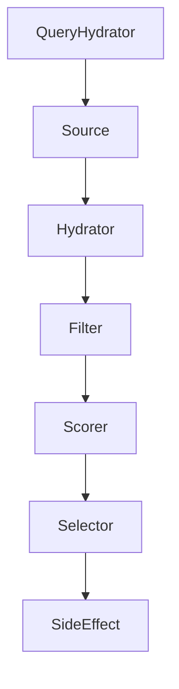
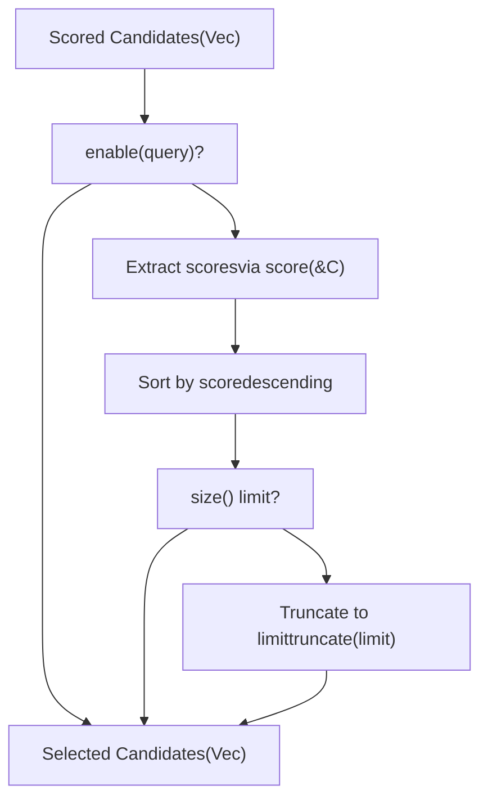
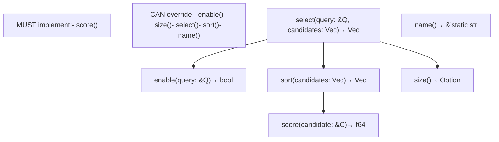
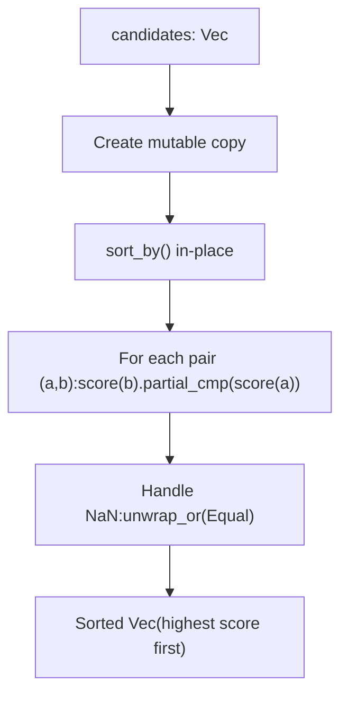
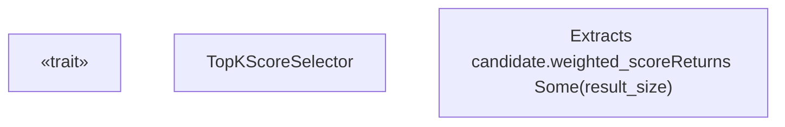
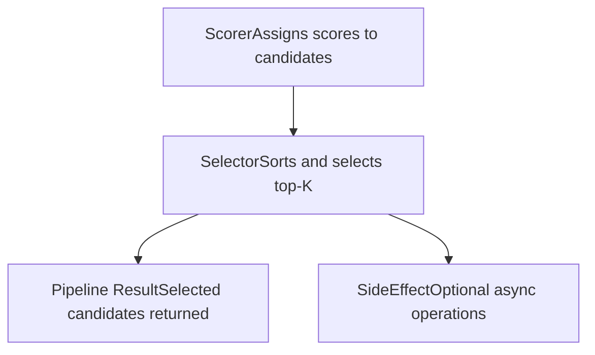

# Selector Trait

Relevant source files

-   [candidate-pipeline/selector.rs](https://github.com/xai-org/x-algorithm/blob/aaa167b3/candidate-pipeline/selector.rs)

## Purpose and Scope

The `Selector` trait defines the interface for selecting a subset of candidates from a larger set based on scoring criteria. This trait provides the sixth stage in the candidate pipeline execution model (see [Pipeline Execution Model](/xai-org/x-algorithm/3.1-pipeline-execution-model)), responsible for sorting candidates by their scores and truncating the list to a configurable top-K size.

The Selector stage executes after the [Scorer](/xai-org/x-algorithm/3.6-scorer-trait) stage has assigned scores to candidates. For information about how scores are calculated, see [Scorer Trait](/xai-org/x-algorithm/3.6-scorer-trait). For the concrete implementation used in the Home Mixer, see [TopKScoreSelector](/xai-org/x-algorithm/4.8-selectors).

## Role in Pipeline Execution

The Selector operates as a sequential stage in the pipeline execution flow, receiving all scored candidates and producing an ordered, truncated subset. The pipeline orchestrator invokes the selector after all scoring stages have completed.

### Selector Stage Position


**Sources:** [candidate-pipeline/selector.rs1-46](https://github.com/xai-org/x-algorithm/blob/aaa167b3/candidate-pipeline/selector.rs#L1-L46)

### Selection Process Flow


**Sources:** [candidate-pipeline/selector.rs10-16](https://github.com/xai-org/x-algorithm/blob/aaa167b3/candidate-pipeline/selector.rs#L10-L16)

## Trait Interface

The `Selector` trait is defined in [candidate-pipeline/selector.rs4-45](https://github.com/xai-org/x-algorithm/blob/aaa167b3/candidate-pipeline/selector.rs#L4-L45) as a generic interface parameterized by query type `Q` and candidate type `C`.

### Trait Definition

| Method | Return Type | Purpose | Default Implementation |
| --- | --- | --- | --- |
| `select` | `Vec<C>` | Main entry point: sort and truncate candidates | Calls `sort()` then `truncate()` |
| `enable` | `bool` | Determine if selector should run for given query | Always returns `true` |
| `score` | `f64` | Extract sortable score from candidate | **Must be implemented** |
| `sort` | `Vec<C>` | Sort candidates by score descending | Sorts using `score()` comparison |
| `size` | `Option<usize>` | Maximum number of candidates to select | Returns `None` (no limit) |
| `name` | `&'static str` | Identifier for logging/debugging | Returns short type name |

**Sources:** [candidate-pipeline/selector.rs4-45](https://github.com/xai-org/x-algorithm/blob/aaa167b3/candidate-pipeline/selector.rs#L4-L45)

### Method Detail Diagram


**Sources:** [candidate-pipeline/selector.rs4-45](https://github.com/xai-org/x-algorithm/blob/aaa167b3/candidate-pipeline/selector.rs#L4-L45)

## Selection Method

The primary `select` method [candidate-pipeline/selector.rs10-16](https://github.com/xai-org/x-algorithm/blob/aaa167b3/candidate-pipeline/selector.rs#L10-L16) implements the default selection logic:

1.  **Sort candidates** by calling `self.sort(candidates)`
2.  **Truncate to size** if `self.size()` returns `Some(limit)`
3.  **Return result** as `Vec<C>`

The method signature is:

```
fn select(&self, _query: &Q, candidates: Vec<C>) -> Vec<C>
```
The query parameter is available for implementations that need query-specific selection logic, but the default implementation does not use it.

**Sources:** [candidate-pipeline/selector.rs10-16](https://github.com/xai-org/x-algorithm/blob/aaa167b3/candidate-pipeline/selector.rs#L10-L16)

## Score Extraction

The `score` method [candidate-pipeline/selector.rs24](https://github.com/xai-org/x-algorithm/blob/aaa167b3/candidate-pipeline/selector.rs#L24-L24) is the only **required** method implementers must provide. It extracts a numerical score from a candidate for sorting purposes:

```
fn score(&self, candidate: &C) -> f64;
```
This abstraction allows the trait to remain generic while enabling implementations to specify which field or derived value should be used for ranking. In the Home Mixer implementation, this typically extracts the weighted engagement score computed by the [Scorer stages](/xai-org/x-algorithm/3.6-scorer-trait).

**Sources:** [candidate-pipeline/selector.rs24](https://github.com/xai-org/x-algorithm/blob/aaa167b3/candidate-pipeline/selector.rs#L24-L24)

## Sorting Logic

The `sort` method [candidate-pipeline/selector.rs27-35](https://github.com/xai-org/x-algorithm/blob/aaa167b3/candidate-pipeline/selector.rs#L27-L35) implements descending sort order using the extracted scores:

1.  **Mutable copy** of candidates vector
2.  **Sort in-place** using `sort_by` with score comparison
3.  **Descending order** by comparing `score(b)` to `score(a)` (note reversed order)
4.  **NaN handling** via `partial_cmp` with fallback to `Equal` ordering


The descending order ensures candidates with highest scores appear first in the result, which is the expected behavior for top-K selection.

**Sources:** [candidate-pipeline/selector.rs27-35](https://github.com/xai-org/x-algorithm/blob/aaa167b3/candidate-pipeline/selector.rs#L27-L35)

## Size Configuration

The `size` method [candidate-pipeline/selector.rs38-40](https://github.com/xai-org/x-algorithm/blob/aaa167b3/candidate-pipeline/selector.rs#L38-L40) controls result set truncation:

```
fn size(&self) -> Option<usize> {    None}
```
-   **`None`**: No size limit; all sorted candidates are returned
-   **`Some(n)`**: Result is truncated to first `n` candidates after sorting

Implementations override this method to specify their desired result size. The [TopKScoreSelector](/xai-org/x-algorithm/4.8-selectors) implementation uses this to configure the number of posts returned in the final feed.

**Sources:** [candidate-pipeline/selector.rs38-40](https://github.com/xai-org/x-algorithm/blob/aaa167b3/candidate-pipeline/selector.rs#L38-L40)

## Conditional Execution

The `enable` method [candidate-pipeline/selector.rs19-21](https://github.com/xai-org/x-algorithm/blob/aaa167b3/candidate-pipeline/selector.rs#L19-L21) provides query-based conditional execution:

```
fn enable(&self, _query: &Q) -> bool {    true}
```
The default implementation always returns `true`, but implementations can override this to:

-   Skip selection based on query features (e.g., different limits for different client types)
-   Disable selection in specific experimental conditions
-   Implement A/B testing logic

The pipeline framework checks this method before invoking `select`, allowing selectors to opt out of execution without affecting pipeline flow.

**Sources:** [candidate-pipeline/selector.rs19-21](https://github.com/xai-org/x-algorithm/blob/aaa167b3/candidate-pipeline/selector.rs#L19-L21)

## Implementation Pattern

A typical Selector implementation follows this pattern:


**Sources:** [candidate-pipeline/selector.rs4-45](https://github.com/xai-org/x-algorithm/blob/aaa167b3/candidate-pipeline/selector.rs#L4-L45)

## Default Behavior Summary

The trait provides sensible defaults for most methods, requiring only score extraction to be specified:

| Aspect | Default Behavior | Override Reason |
| --- | --- | --- |
| Selection | Sort + optional truncate | Custom selection logic (e.g., diversity-aware) |
| Enablement | Always enabled | Conditional execution based on query |
| Sorting | Descending by score | Alternative sorting criteria |
| Size limit | No limit | Specify result size (top-K) |
| Naming | Type name extraction | Custom identifier |

Most implementations only need to override `score()` and `size()`, making the trait easy to implement while remaining flexible for advanced use cases.

**Sources:** [candidate-pipeline/selector.rs4-45](https://github.com/xai-org/x-algorithm/blob/aaa167b3/candidate-pipeline/selector.rs#L4-L45)

## Relationship to Pipeline Stages

The Selector consumes the output of the [Scorer stage](/xai-org/x-algorithm/3.6-scorer-trait) and produces the input for optional [SideEffect stages](/xai-org/x-algorithm/3.8-sideeffect-trait):


The Selector is the final transformation stage that modifies the candidate list. After selection, the pipeline returns the result to the caller, though [SideEffect stages](/xai-org/x-algorithm/3.8-sideeffect-trait) may observe the final candidates for logging or caching purposes.

**Sources:** [candidate-pipeline/selector.rs1-46](https://github.com/xai-org/x-algorithm/blob/aaa167b3/candidate-pipeline/selector.rs#L1-L46)
