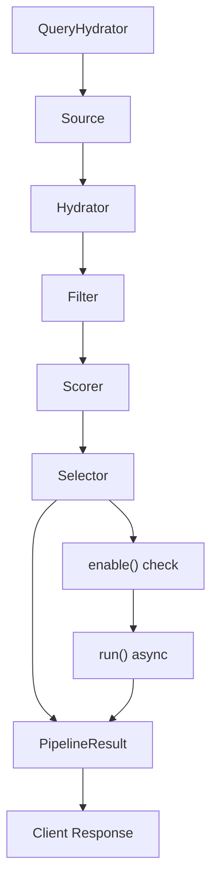
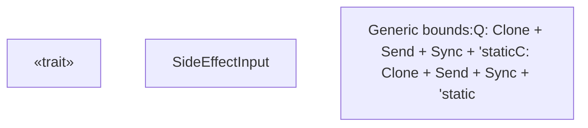
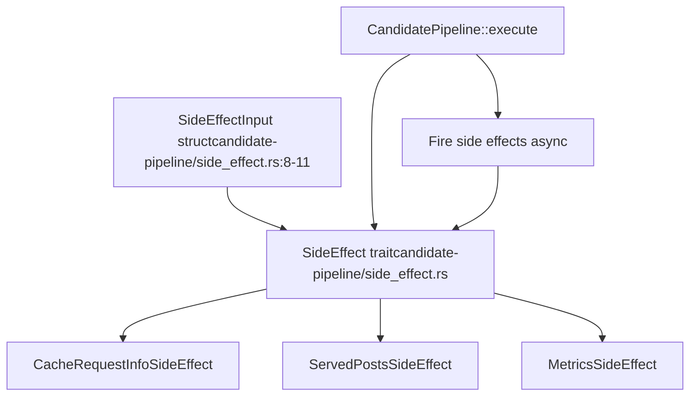

# SideEffect Trait

Relevant source files

-   [candidate-pipeline/side\_effect.rs](https://github.com/xai-org/x-algorithm/blob/aaa167b3/candidate-pipeline/side_effect.rs)

## Purpose and Scope

The `SideEffect` trait defines the interface for asynchronous, non-blocking operations that execute during pipeline execution without affecting the final result returned to the client. Side effects are used for auxiliary tasks such as caching, logging, metrics collection, and audit trails that should not delay or alter the pipeline's output.

This document covers the `SideEffect` trait definition, execution characteristics, and integration into the candidate pipeline framework. For information about the overall pipeline execution model, see [Pipeline Execution Model](/xai-org/x-algorithm/3.1-pipeline-execution-model). For concrete side effect implementations in the Home Mixer, see [Home Mixer Implementation](/xai-org/x-algorithm/4-home-mixer-implementation).

## Overview

Side effects represent the final stage in the candidate pipeline framework's seven-stage architecture. Unlike other pipeline stages (sources, hydrators, filters, scorers, selectors), side effects:

-   Execute asynchronously after the main pipeline result is prepared
-   Cannot modify the query, candidates, or pipeline result
-   Receive read-only access to the query and selected candidates
-   May fail without affecting the response to the client
-   Support conditional execution through an enable gate

**Diagram: SideEffect execution in the pipeline flow**

Sources: [candidate-pipeline/side\_effect.rs1-30](https://github.com/xai-org/x-algorithm/blob/aaa167b3/candidate-pipeline/side_effect.rs#L1-L30)

## Trait Definition

The `SideEffect` trait is defined with two generic type parameters representing the query type (`Q`) and candidate type (`C`). It requires implementations to be `Send + Sync` for safe concurrent execution.

**Diagram: SideEffect trait structure**

Sources: [candidate-pipeline/side\_effect.rs6-29](https://github.com/xai-org/x-algorithm/blob/aaa167b3/candidate-pipeline/side_effect.rs#L6-L29)

### Method Specifications

| Method | Signature | Purpose | Default Implementation |
| --- | --- | --- | --- |
| `enable` | `fn enable(&self, query: Arc<Q>) -> bool` | Conditional execution gate | Returns `true` |
| `run` | `async fn run(&self, input: Arc<SideEffectInput<Q, C>>) -> Result<(), String>` | Execute the side effect | Must be implemented |
| `name` | `fn name(&self) -> &'static str` | Identify the side effect | Returns short type name |

Sources: [candidate-pipeline/side\_effect.rs19-28](https://github.com/xai-org/x-algorithm/blob/aaa167b3/candidate-pipeline/side_effect.rs#L19-L28)

## SideEffectInput Structure

The `SideEffectInput` struct provides read-only access to the pipeline's final state when the side effect executes. It contains the original query and the candidates selected by the selector stage.

### Field Definitions

| Field | Type | Description |
| --- | --- | --- |
| `query` | `Arc<Q>` | Shared reference to the query object, potentially enriched by query hydrators |
| `selected_candidates` | `Vec<C>` | The candidates selected by the selector stage, typically the top-K results |

The use of `Arc<Q>` for the query enables efficient sharing across multiple side effects without cloning, while `Vec<C>` provides the selected candidates that will be returned to the client.

Sources: [candidate-pipeline/side\_effect.rs8-11](https://github.com/xai-org/x-algorithm/blob/aaa167b3/candidate-pipeline/side_effect.rs#L8-L11)

## Execution Characteristics

### Asynchronous Execution

Side effects execute asynchronously after the selector stage completes. The pipeline does not wait for side effects to complete before returning the result to the client.

> **[Mermaid sequence]**
> *(图表结构无法解析)*

**Diagram: Asynchronous side effect execution sequence**

Sources: [candidate-pipeline/side\_effect.rs6-7](https://github.com/xai-org/x-algorithm/blob/aaa167b3/candidate-pipeline/side_effect.rs#L6-L7)

### Conditional Execution

The `enable` method allows implementations to conditionally execute based on query properties. This enables feature flags, A/B testing, or resource-based throttling.

**Enable Method Pattern:**

-   Receives `Arc<Q>` query reference
-   Returns boolean indicating whether to execute
-   Default implementation always returns `true`
-   Called before `run` method

Sources: [candidate-pipeline/side\_effect.rs19-22](https://github.com/xai-org/x-algorithm/blob/aaa167b3/candidate-pipeline/side_effect.rs#L19-L22)

### Error Handling

The `run` method returns `Result<(), String>`, allowing side effects to report errors without affecting the client response. Errors are typically logged for monitoring but do not propagate to the pipeline caller.

**Error Contract:**

-   Errors do not block or modify the pipeline result
-   Error strings are used for logging and debugging
-   Pipeline continues regardless of side effect success or failure

Sources: [candidate-pipeline/side\_effect.rs24](https://github.com/xai-org/x-algorithm/blob/aaa167b3/candidate-pipeline/side_effect.rs#L24-L24)

## Common Use Cases

Side effects in the candidate pipeline framework are typically used for:

| Use Case | Description | Example |
| --- | --- | --- |
| **Caching** | Store pipeline state for debugging or replay | Cache request info to Strato |
| **Metrics** | Record performance and result statistics | Log candidate counts, scores, latencies |
| **Audit Logging** | Track what content was served to users | Record served post IDs for deduplication |
| **Analytics** | Collect data for offline analysis | Export scoring features for model training |
| **Debugging** | Capture detailed execution traces | Log intermediate pipeline states |

Sources: [candidate-pipeline/side\_effect.rs6](https://github.com/xai-org/x-algorithm/blob/aaa167b3/candidate-pipeline/side_effect.rs#L6-L6)

## Integration with Pipeline Framework

### Trait Requirements

Implementations must satisfy the following bounds:

-   `Q: Clone + Send + Sync + 'static` - Query type must be cloneable and thread-safe
-   `C: Clone + Send + Sync + 'static` - Candidate type must be cloneable and thread-safe
-   `SideEffect<Q, C>: Send + Sync` - The trait implementation itself must be thread-safe

These bounds enable safe concurrent execution of side effects across async tasks.

Sources: [candidate-pipeline/side\_effect.rs14-17](https://github.com/xai-org/x-algorithm/blob/aaa167b3/candidate-pipeline/side_effect.rs#L14-L17)

### Naming Convention

The `name` method provides a human-readable identifier for the side effect, derived from the type name. This is used for:

-   Logging and tracing pipeline execution
-   Metrics tagging by side effect type
-   Debugging and profiling

The default implementation uses `util::short_type_name` to extract a concise type name without the full module path.

Sources: [candidate-pipeline/side\_effect.rs26-28](https://github.com/xai-org/x-algorithm/blob/aaa167b3/candidate-pipeline/side_effect.rs#L26-L28)

## Implementation Example Reference

The Home Mixer implements concrete side effects for the Phoenix Candidate Pipeline. While the exact implementations are documented elsewhere, typical examples include:

-   **CacheRequestInfoSideEffect**: Stores request metadata to Strato cache for debugging and replay
-   **ServedPostsSideEffect**: Records which posts were served to prevent duplicate impressions
-   **MetricsSideEffect**: Exports pipeline metrics and candidate statistics

For detailed documentation of these implementations, see [Home Mixer Implementation](/xai-org/x-algorithm/4-home-mixer-implementation).

Sources: [candidate-pipeline/side\_effect.rs1-30](https://github.com/xai-org/x-algorithm/blob/aaa167b3/candidate-pipeline/side_effect.rs#L1-L30)

## Code Structure

**Diagram: SideEffect code organization and relationships**

Sources: [candidate-pipeline/side\_effect.rs1-30](https://github.com/xai-org/x-algorithm/blob/aaa167b3/candidate-pipeline/side_effect.rs#L1-L30)
