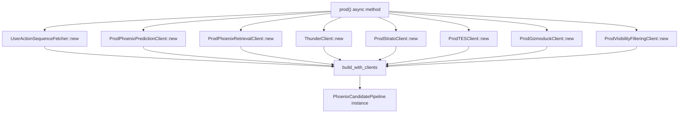
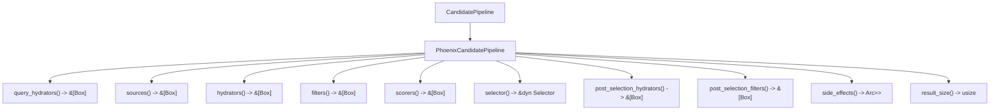

# Home Mixer Implementation

Relevant source files

-   [home-mixer/candidate\_pipeline/mod.rs](https://github.com/xai-org/x-algorithm/blob/aaa167b3/home-mixer/candidate_pipeline/mod.rs)
-   [home-mixer/candidate\_pipeline/phoenix\_candidate\_pipeline.rs](https://github.com/xai-org/x-algorithm/blob/aaa167b3/home-mixer/candidate_pipeline/phoenix_candidate_pipeline.rs)

## Purpose and Scope

This section documents the Home Mixer's concrete implementation of the Candidate Pipeline Framework for the "For You" feed recommendation system. The Home Mixer orchestrates candidate retrieval, enrichment, filtering, scoring, and selection by instantiating specific implementations of the generic pipeline traits (see [Candidate Pipeline Framework](/xai-org/x-algorithm/3-candidate-pipeline-framework)).

The implementation is centered around the `PhoenixCandidatePipeline` struct, which configures and composes all pipeline stages with production clients for external services. This page provides an architectural overview of the implementation. For detailed documentation of specific components, see:

-   [Phoenix Candidate Pipeline](/xai-org/x-algorithm/4.1-phoenix-candidate-pipeline) - Pipeline struct and initialization
-   [Data Models](/xai-org/x-algorithm/4.2-data-models) - Query and candidate data structures
-   [Candidate Sources](/xai-org/x-algorithm/4.3-candidate-sources) - Thunder and Phoenix retrieval
-   [Query Hydrators](/xai-org/x-algorithm/4.4-query-hydrators) - Query enrichment implementations
-   [Candidate Hydrators](/xai-org/x-algorithm/4.5-candidate-hydrators) - Candidate enrichment implementations
-   [Filters](/xai-org/x-algorithm/4.6-filters) - Pre-scoring and post-selection filters
-   [Scorers](/xai-org/x-algorithm/4.7-scorers) - Phoenix ML scoring and weighted scoring
-   [Selectors](/xai-org/x-algorithm/4.8-selectors) - Top-K selection implementation

## PhoenixCandidatePipeline Structure

```mermaid
flowchart TD
    QH["query_hydratorsVec<Box<dyn QueryHydrator<ScoredPostsQuery>>>"]
    SRC["sourcesVec<Box<dyn Source<ScoredPostsQuery, PostCandidate>>>"]
    HYD["hydratorsVec<Box<dyn Hydrator<ScoredPostsQuery, PostCandidate>>>"]
    FLT["filtersVec<Box<dyn Filter<ScoredPostsQuery, PostCandidate>>>"]
    SCR["scorersVec<Box<dyn Scorer<ScoredPostsQuery, PostCandidate>>>"]
    SEL["selectorTopKScoreSelector"]
    PSH["post_selection_hydratorsVec<Box<dyn Hydrator<ScoredPostsQuery, PostCandidate>>>"]
    PSF["post_selection_filtersVec<Box<dyn Filter<ScoredPostsQuery, PostCandidate>>>"]
    SE["side_effectsArc<Vec<Box<dyn SideEffect<ScoredPostsQuery, PostCandidate>>>>"]
    Execute["CandidatePipeline::execute"]

    QH --> Execute
    SRC --> Execute
    HYD --> Execute
    FLT --> Execute
    SCR --> Execute
    SEL --> Execute
    PSH --> Execute
    PSF --> Execute
    SE --> Execute
```

The `PhoenixCandidatePipeline` struct is the central orchestrator that implements the `CandidatePipeline<ScoredPostsQuery, PostCandidate>` trait. It holds references to all pipeline stage implementations and manages their execution order.

**Pipeline Struct Fields**

The struct at [home-mixer/candidate\_pipeline/phoenix\_candidate\_pipeline.rs60-70](https://github.com/xai-org/x-algorithm/blob/aaa167b3/home-mixer/candidate_pipeline/phoenix_candidate_pipeline.rs#L60-L70) contains nine fields representing the pipeline stages:

| Field | Type | Purpose |
| --- | --- | --- |
| `query_hydrators` | `Vec<Box<dyn QueryHydrator<ScoredPostsQuery>>>` | Enrich query with user context before candidate retrieval |
| `sources` | `Vec<Box<dyn Source<ScoredPostsQuery, PostCandidate>>>` | Retrieve candidate sets from Thunder and Phoenix |
| `hydrators` | `Vec<Box<dyn Hydrator<ScoredPostsQuery, PostCandidate>>>` | Enrich candidates with metadata before filtering/scoring |
| `filters` | `Vec<Box<dyn Filter<ScoredPostsQuery, PostCandidate>>>` | Remove ineligible candidates before scoring |
| `scorers` | `Vec<Box<dyn Scorer<ScoredPostsQuery, PostCandidate>>>` | Assign relevance scores using Phoenix ML and weighted scoring |
| `selector` | `TopKScoreSelector` | Select top-K candidates by score |
| `post_selection_hydrators` | `Vec<Box<dyn Hydrator<ScoredPostsQuery, PostCandidate>>>` | Enrich selected candidates with additional data |
| `post_selection_filters` | `Vec<Box<dyn Filter<ScoredPostsQuery, PostCandidate>>>` | Apply final validation after selection |
| `side_effects` | `Arc<Vec<Box<dyn SideEffect<ScoredPostsQuery, PostCandidate>>>>` | Execute asynchronous operations (caching, logging) |

Sources: [home-mixer/candidate\_pipeline/phoenix\_candidate\_pipeline.rs60-70](https://github.com/xai-org/x-algorithm/blob/aaa167b3/home-mixer/candidate_pipeline/phoenix_candidate_pipeline.rs#L60-L70)

## Component Initialization Architecture

The pipeline is constructed through the `build_with_clients` method, which accepts client interfaces for all external services and instantiates concrete implementations of each pipeline stage.

```mermaid
flowchart TD
    UAF["UserActionSequenceFetcher"]
    PPC["PhoenixPredictionClient"]
    PRC["PhoenixRetrievalClient"]
    TC["ThunderClient"]
    SC["StratoClient"]
    TESC["TESClient"]
    GC["GizmoduckClient"]
    VFC["VisibilityFilteringClient"]
    Build["PhoenixCandidatePipeline::build_with_clients"]
    UASQH["UserActionSeqQueryHydrator"]
    UFQH["UserFeaturesQueryHydrator"]
    PS["PhoenixSource"]
    TS["ThunderSource"]
    INCH["InNetworkCandidateHydrator"]
    CDCH["CoreDataCandidateHydrator"]
    VDCH["VideoDurationCandidateHydrator"]
    SH["SubscriptionHydrator"]
    GZH["GizmoduckCandidateHydrator"]
    DDF["DropDuplicatesFilter"]
    CDHF["CoreDataHydrationFilter"]
    AF["AgeFilter"]
    STF["SelfTweetFilter"]
    RDF["RetweetDeduplicationFilter"]
    ISF["IneligibleSubscriptionFilter"]
    PSPF["PreviouslySeenPostsFilter"]
    PSRF["PreviouslyServedPostsFilter"]
    MKF["MutedKeywordFilter"]
    ASF["AuthorSocialgraphFilter"]
    PhS["PhoenixScorer"]
    WS["WeightedScorer"]
    ADS["AuthorDiversityScorer"]
    OS["OONScorer"]
    VFCH["VFCandidateHydrator"]
    VFF["VFFilter"]
    DCF["DedupConversationFilter"]
    CRISE["CacheRequestInfoSideEffect"]

    UAF --> Build
    PPC --> Build
    PRC --> Build
    TC --> Build
    SC --> Build
    TESC --> Build
    GC --> Build
    VFC --> Build
    Build --> UASQH
    Build --> UFQH
    Build --> PS
    Build --> TS
    Build --> INCH
    Build --> CDCH
    Build --> VDCH
    Build --> SH
    Build --> GZH
    Build --> DDF
    Build --> CDHF
    Build --> AF
    Build --> STF
    Build --> RDF
    Build --> ISF
    Build --> PSPF
    Build --> PSRF
    Build --> MKF
    Build --> ASF
    Build --> PhS
    Build --> WS
    Build --> ADS
    Build --> OS
    Build --> VFCH
    Build --> VFF
    Build --> DCF
    Build --> CRISE
```

**Component Construction**

The `build_with_clients` method at [home-mixer/candidate\_pipeline/phoenix\_candidate\_pipeline.rs73-160](https://github.com/xai-org/x-algorithm/blob/aaa167b3/home-mixer/candidate_pipeline/phoenix_candidate_pipeline.rs#L73-L160) performs dependency injection by:

1.  **Creating Query Hydrators** ([lines 84-89](https://github.com/xai-org/x-algorithm/blob/aaa167b3/lines 84-89)) - Instantiates `UserActionSeqQueryHydrator` and `UserFeaturesQueryHydrator` with client dependencies
2.  **Creating Sources** ([lines 92-97](https://github.com/xai-org/x-algorithm/blob/aaa167b3/lines 92-97)) - Instantiates `PhoenixSource` and `ThunderSource` for candidate retrieval
3.  **Creating Hydrators** ([lines 100-106](https://github.com/xai-org/x-algorithm/blob/aaa167b3/lines 100-106)) - Instantiates five hydrators for enriching candidates with metadata
4.  **Creating Filters** ([lines 109-120](https://github.com/xai-org/x-algorithm/blob/aaa167b3/lines 109-120)) - Instantiates ten filters for pre-scoring candidate removal
5.  **Creating Scorers** ([lines 123-132](https://github.com/xai-org/x-algorithm/blob/aaa167b3/lines 123-132)) - Instantiates four scorers for ML predictions and score composition
6.  **Creating Selector** ([line 135](https://github.com/xai-org/x-algorithm/blob/aaa167b3/line 135)) - Instantiates `TopKScoreSelector` for top-K selection
7.  **Creating Post-Selection Components** ([lines 138-143](https://github.com/xai-org/x-algorithm/blob/aaa167b3/lines 138-143)) - Instantiates hydrators and filters for final processing
8.  **Creating Side Effects** ([lines 146-147](https://github.com/xai-org/x-algorithm/blob/aaa167b3/lines 146-147)) - Instantiates `CacheRequestInfoSideEffect` for async caching

Sources: [home-mixer/candidate\_pipeline/phoenix\_candidate\_pipeline.rs73-160](https://github.com/xai-org/x-algorithm/blob/aaa167b3/home-mixer/candidate_pipeline/phoenix_candidate_pipeline.rs#L73-L160)

## Production Client Initialization

The `prod` method creates a production-ready pipeline by instantiating all client interfaces with their production implementations.

**Client Construction Details**

The `prod` method at [home-mixer/candidate\_pipeline/phoenix\_candidate\_pipeline.rs162-212](https://github.com/xai-org/x-algorithm/blob/aaa167b3/home-mixer/candidate_pipeline/phoenix_candidate_pipeline.rs#L162-L212) initializes:

| Client | Production Implementation | Purpose |
| --- | --- | --- |
| `uas_fetcher` | `UserActionSequenceFetcher` | Fetches user action history for query hydration |
| `phoenix_client` | `ProdPhoenixPredictionClient` | Calls Phoenix Grok transformer for scoring |
| `phoenix_retrieval_client` | `ProdPhoenixRetrievalClient` | Calls Phoenix two-tower model for retrieval |
| `thunder_client` | `ThunderClient` | Queries Thunder in-memory store for in-network posts |
| `strato_client` | `ProdStratoClient` | Accesses Strato caching service |
| `tes_client` | `ProdTESClient` | Queries Tweet Entity Service for tweet metadata |
| `gizmoduck_client` | `ProdGizmoduckClient` | Queries Gizmoduck for user profile data |
| `vf_client` | `ProdVisibilityFilteringClient` | Calls Visibility Filtering for content safety |

All clients are wrapped in `Arc` for shared ownership across pipeline components. The method uses `.await` and `.expect()` to handle initialization errors at startup.

Sources: [home-mixer/candidate\_pipeline/phoenix\_candidate\_pipeline.rs162-212](https://github.com/xai-org/x-algorithm/blob/aaa167b3/home-mixer/candidate_pipeline/phoenix_candidate_pipeline.rs#L162-L212)

## CandidatePipeline Trait Implementation

The `PhoenixCandidatePipeline` implements the `CandidatePipeline<ScoredPostsQuery, PostCandidate>` trait, providing accessor methods for each pipeline stage.

**Trait Method Implementations**

The trait implementation at [home-mixer/candidate\_pipeline/phoenix\_candidate\_pipeline.rs215-255](https://github.com/xai-org/x-algorithm/blob/aaa167b3/home-mixer/candidate_pipeline/phoenix_candidate_pipeline.rs#L215-L255) provides ten methods:

| Method | Return Type | Implementation |
| --- | --- | --- |
| `query_hydrators()` | `&[Box<dyn QueryHydrator<ScoredPostsQuery>>]` | Returns slice of query hydrators |
| `sources()` | `&[Box<dyn Source<ScoredPostsQuery, PostCandidate>>]` | Returns slice of candidate sources |
| `hydrators()` | `&[Box<dyn Hydrator<ScoredPostsQuery, PostCandidate>>]` | Returns slice of candidate hydrators |
| `filters()` | `&[Box<dyn Filter<ScoredPostsQuery, PostCandidate>>]` | Returns slice of pre-scoring filters |
| `scorers()` | `&[Box<dyn Scorer<ScoredPostsQuery, PostCandidate>>]` | Returns slice of scorers |
| `selector()` | `&dyn Selector<ScoredPostsQuery, PostCandidate>` | Returns reference to selector |
| `post_selection_hydrators()` | `&[Box<dyn Hydrator<ScoredPostsQuery, PostCandidate>>]` | Returns slice of post-selection hydrators |
| `post_selection_filters()` | `&[Box<dyn Filter<ScoredPostsQuery, PostCandidate>>]` | Returns slice of post-selection filters |
| `side_effects()` | `Arc<Vec<Box<dyn SideEffect<ScoredPostsQuery, PostCandidate>>>>` | Returns Arc-wrapped side effects |
| `result_size()` | `usize` | Returns `params::RESULT_SIZE` constant |

The `#[async_trait]` macro at [line 215](https://github.com/xai-org/x-algorithm/blob/aaa167b3/line 215) enables async methods in the trait. The framework's `CandidatePipeline::execute` method uses these accessors to orchestrate pipeline execution.

Sources: [home-mixer/candidate\_pipeline/phoenix\_candidate\_pipeline.rs215-255](https://github.com/xai-org/x-algorithm/blob/aaa167b3/home-mixer/candidate_pipeline/phoenix_candidate_pipeline.rs#L215-L255)

## Pipeline Execution Flow

When the `CandidatePipeline::execute` method is called with a `ScoredPostsQuery`, the framework orchestrates the following execution sequence through the instantiated components:

> **[Mermaid sequence]**
> *(图表结构无法解析)*

**Execution Characteristics**

The execution model leverages the framework's trait system:

1.  **Parallel Execution** - Query hydrators, sources, and candidate hydrators execute in parallel using `futures::join_all` to minimize latency
2.  **Sequential Execution** - Filters and scorers execute sequentially as each stage depends on the previous stage's output
3.  **Data Transformation** - Each stage reads from and writes to the shared `ScoredPostsQuery` and `PostCandidate` structures
4.  **Error Handling** - The framework handles errors per the trait implementations, allowing stages to skip candidates or return partial results
5.  **Side Effect Isolation** - Side effects execute asynchronously without blocking the response to the client

The concrete implementations of each stage are documented in the child sections [4.1](/xai-org/x-algorithm/4.1-phoenix-candidate-pipeline) through [4.8](/xai-org/x-algorithm/4.8-selectors).

Sources: [home-mixer/candidate\_pipeline/phoenix\_candidate\_pipeline.rs1-256](https://github.com/xai-org/x-algorithm/blob/aaa167b3/home-mixer/candidate_pipeline/phoenix_candidate_pipeline.rs#L1-L256)

## Module Structure

The Home Mixer implementation is organized into modules within the `home-mixer/candidate_pipeline/` directory:

| Module | File | Purpose |
| --- | --- | --- |
| `candidate` | `candidate.rs` | Defines `PostCandidate` struct |
| `candidate_features` | `candidate_features.rs` | Defines candidate feature fields |
| `phoenix_candidate_pipeline` | `phoenix_candidate_pipeline.rs` | Defines `PhoenixCandidatePipeline` struct and implementation |
| `query` | `query.rs` | Defines `ScoredPostsQuery` struct |
| `query_features` | `query_features.rs` | Defines query feature fields |

The module declarations are found at [home-mixer/candidate\_pipeline/mod.rs1-6](https://github.com/xai-org/x-algorithm/blob/aaa167b3/home-mixer/candidate_pipeline/mod.rs#L1-L6)

For detailed documentation of the data models, see [Data Models](/xai-org/x-algorithm/4.2-data-models).

Sources: [home-mixer/candidate\_pipeline/mod.rs1-6](https://github.com/xai-org/x-algorithm/blob/aaa167b3/home-mixer/candidate_pipeline/mod.rs#L1-L6)
