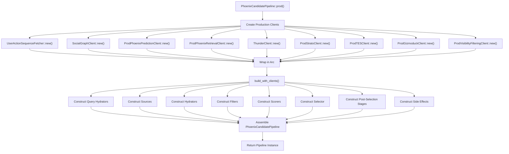
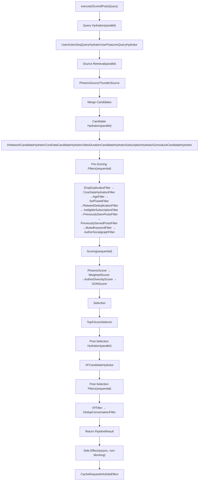

# Phoenix Candidate Pipeline

Relevant source files

-   [home-mixer/candidate\_pipeline/phoenix\_candidate\_pipeline.rs](https://github.com/xai-org/x-algorithm/blob/aaa167b3/home-mixer/candidate_pipeline/phoenix_candidate_pipeline.rs)

## Purpose and Scope

The `PhoenixCandidatePipeline` is the Home Mixer's concrete implementation of the generic `CandidatePipeline` trait, orchestrating the complete "For You" feed generation process. This document covers the pipeline's structure, initialization with production clients, and configuration of all pipeline stages.

For details on the generic framework that this pipeline implements, see [Candidate Pipeline Framework](/xai-org/x-algorithm/3-candidate-pipeline-framework). For information about individual stage implementations (sources, hydrators, filters, scorers), see sections [4.3](/xai-org/x-algorithm/4.3-candidate-sources) through [4.8](/xai-org/x-algorithm/4.8-selectors). For the data models used by this pipeline, see [Data Models](/xai-org/x-algorithm/4.2-data-models).

**Sources:** [home-mixer/candidate\_pipeline/phoenix\_candidate\_pipeline.rs1-256](https://github.com/xai-org/x-algorithm/blob/aaa167b3/home-mixer/candidate_pipeline/phoenix_candidate_pipeline.rs#L1-L256)

## Pipeline Structure

The `PhoenixCandidatePipeline` struct aggregates all pipeline stages into a single orchestrator that implements the `CandidatePipeline<ScoredPostsQuery, PostCandidate>` trait.

### Struct Definition

The pipeline contains nine fields representing the complete pipeline execution graph:

```
PhoenixCandidatePipeline
├── query_hydrators:           Vec<Box<dyn QueryHydrator<ScoredPostsQuery>>>
├── sources:                   Vec<Box<dyn Source<ScoredPostsQuery, PostCandidate>>>
├── hydrators:                 Vec<Box<dyn Hydrator<ScoredPostsQuery, PostCandidate>>>
├── filters:                   Vec<Box<dyn Filter<ScoredPostsQuery, PostCandidate>>>
├── scorers:                   Vec<Box<dyn Scorer<ScoredPostsQuery, PostCandidate>>>
├── selector:                  TopKScoreSelector
├── post_selection_hydrators:  Vec<Box<dyn Hydrator<ScoredPostsQuery, PostCandidate>>>
├── post_selection_filters:    Vec<Box<dyn Filter<ScoredPostsQuery, PostCandidate>>>
└── side_effects:              Arc<Vec<Box<dyn SideEffect<ScoredPostsQuery, PostCandidate>>>>
```
Each field holds trait objects that the framework's execution model invokes in sequence. The `side_effects` field is wrapped in `Arc` to enable async, non-blocking execution without affecting the main pipeline result.

**Sources:** [home-mixer/candidate\_pipeline/phoenix\_candidate\_pipeline.rs60-70](https://github.com/xai-org/x-algorithm/blob/aaa167b3/home-mixer/candidate_pipeline/phoenix_candidate_pipeline.rs#L60-L70)

## Pipeline Component Structure

The following diagram shows the concrete implementations registered in each pipeline stage:


**Sources:** [home-mixer/candidate\_pipeline/phoenix\_candidate\_pipeline.rs84-148](https://github.com/xai-org/x-algorithm/blob/aaa167b3/home-mixer/candidate_pipeline/phoenix_candidate_pipeline.rs#L84-L148)

## Pipeline Stages

### Query Hydrators

The pipeline configures two query hydrators that enrich the `ScoredPostsQuery` before candidate retrieval:

| Hydrator | Purpose | Client Dependency |
| --- | --- | --- |
| `UserActionSeqQueryHydrator` | Fetches user's recent engagement history (favorites, replies, retweets) | `UserActionSequenceFetcher` |
| `UserFeaturesQueryHydrator` | Retrieves user-level features from cache | `StratoClient` |

These hydrators execute in parallel to minimize latency. See [Query Hydrators](/xai-org/x-algorithm/4.4-query-hydrators) for implementation details.

**Sources:** [home-mixer/candidate\_pipeline/phoenix\_candidate\_pipeline.rs84-89](https://github.com/xai-org/x-algorithm/blob/aaa167b3/home-mixer/candidate_pipeline/phoenix_candidate_pipeline.rs#L84-L89)

### Candidate Sources

Two sources retrieve candidates from different systems:

| Source | Purpose | Client Dependency |
| --- | --- | --- |
| `PhoenixSource` | Retrieves out-of-network candidates using two-tower similarity search | `PhoenixRetrievalClient` |
| `ThunderSource` | Retrieves in-network candidates from real-time post store | `ThunderClient` |

Both sources execute in parallel and their results are merged. See [Thunder Source](/xai-org/x-algorithm/4.3.1-thunder-source) and [Phoenix Retrieval Source](/xai-org/x-algorithm/4.3.2-phoenix-retrieval-source) for details.

**Sources:** [home-mixer/candidate\_pipeline/phoenix\_candidate\_pipeline.rs91-97](https://github.com/xai-org/x-algorithm/blob/aaa167b3/home-mixer/candidate_pipeline/phoenix_candidate_pipeline.rs#L91-L97)

### Candidate Hydrators

Five hydrators enrich candidates with metadata from external services:

| Hydrator | Purpose | Client Dependency |
| --- | --- | --- |
| `InNetworkCandidateHydrator` | Determines if candidate author is in viewer's follow graph | None (uses query data) |
| `CoreDataCandidateHydrator` | Fetches tweet text, author ID, retweet/reply data | `TESClient` |
| `VideoDurationCandidateHydrator` | Fetches video duration from media entities | `TESClient` |
| `SubscriptionHydrator` | Fetches subscription author IDs | `TESClient` |
| `GizmoduckCandidateHydrator` | Fetches author profile data (followers, screen names) | `GizmoduckClient` |

These hydrators execute in parallel for maximum throughput. See [Candidate Hydrators](/xai-org/x-algorithm/4.5-candidate-hydrators) for implementation details.

**Sources:** [home-mixer/candidate\_pipeline/phoenix\_candidate\_pipeline.rs100-106](https://github.com/xai-org/x-algorithm/blob/aaa167b3/home-mixer/candidate_pipeline/phoenix_candidate_pipeline.rs#L100-L106)

### Pre-Scoring Filters

Ten filters remove ineligible candidates before expensive ML scoring:

| Filter | Purpose | Configuration |
| --- | --- | --- |
| `DropDuplicatesFilter` | Removes duplicate tweet IDs | None |
| `CoreDataHydrationFilter` | Removes candidates that failed core data hydration | None |
| `AgeFilter` | Removes posts older than configured threshold | `Duration::from_secs(params::MAX_POST_AGE)` |
| `SelfTweetFilter` | Removes viewer's own tweets | None |
| `RetweetDeduplicationFilter` | Removes retweets when original is present | None |
| `IneligibleSubscriptionFilter` | Removes ineligible subscription content | None |
| `PreviouslySeenPostsFilter` | Removes posts in bloom filter of seen IDs | None |
| `PreviouslyServedPostsFilter` | Removes posts previously served to viewer | None |
| `MutedKeywordFilter` | Removes posts matching muted keywords | None |
| `AuthorSocialgraphFilter` | Removes posts from blocked/muted authors | None |

Filters execute sequentially to enable short-circuit optimization. See [Filters](/xai-org/x-algorithm/4.6-filters) for details.

**Sources:** [home-mixer/candidate\_pipeline/phoenix\_candidate\_pipeline.rs109-120](https://github.com/xai-org/x-algorithm/blob/aaa167b3/home-mixer/candidate_pipeline/phoenix_candidate_pipeline.rs#L109-L120)

### Scorers

Four scorers assign relevance scores to candidates:

| Scorer | Purpose | Client Dependency |
| --- | --- | --- |
| `PhoenixScorer` | Predicts engagement probabilities using Grok transformer | `PhoenixPredictionClient` |
| `WeightedScorer` | Combines engagement predictions into weighted relevance score | None |
| `AuthorDiversityScorer` | Attenuates scores for repeated authors | None |
| `OONScorer` | Applies out-of-network specific score adjustments | None |

Scorers execute sequentially, with each scorer potentially depending on scores from previous scorers. See [Scorers](/xai-org/x-algorithm/4.7-scorers) for implementation details.

**Sources:** [home-mixer/candidate\_pipeline/phoenix\_candidate\_pipeline.rs123-132](https://github.com/xai-org/x-algorithm/blob/aaa167b3/home-mixer/candidate_pipeline/phoenix_candidate_pipeline.rs#L123-L132)

### Selector

The `TopKScoreSelector` sorts candidates by their weighted score and selects the top `params::RESULT_SIZE` candidates for post-selection processing.

**Sources:** [home-mixer/candidate\_pipeline/phoenix\_candidate\_pipeline.rs135](https://github.com/xai-org/x-algorithm/blob/aaa167b3/home-mixer/candidate_pipeline/phoenix_candidate_pipeline.rs#L135-L135)

### Post-Selection Stages

After selection, candidates undergo final hydration and filtering:

| Stage | Components | Purpose |
| --- | --- | --- |
| Post-Selection Hydrators | `VFCandidateHydrator` | Applies visibility filtering rules to determine content safety |
| Post-Selection Filters | `VFFilter`, `DedupConversationFilter` | Removes unsafe content and deduplicates conversation threads |

These stages execute after selection to avoid expensive operations on candidates that won't be selected.

**Sources:** [home-mixer/candidate\_pipeline/phoenix\_candidate\_pipeline.rs138-143](https://github.com/xai-org/x-algorithm/blob/aaa167b3/home-mixer/candidate_pipeline/phoenix_candidate_pipeline.rs#L138-L143)

### Side Effects

The pipeline registers one side effect:

-   `CacheRequestInfoSideEffect`: Asynchronously caches request metadata to Strato for debugging and analytics

Side effects execute asynchronously and do not block the response to the client.

**Sources:** [home-mixer/candidate\_pipeline/phoenix\_candidate\_pipeline.rs146-147](https://github.com/xai-org/x-algorithm/blob/aaa167b3/home-mixer/candidate_pipeline/phoenix_candidate_pipeline.rs#L146-L147)

## Initialization and Configuration

### Client Initialization Flow

The following diagram illustrates the production initialization process:


**Sources:** [home-mixer/candidate\_pipeline/phoenix\_candidate\_pipeline.rs162-212](https://github.com/xai-org/x-algorithm/blob/aaa167b3/home-mixer/candidate_pipeline/phoenix_candidate_pipeline.rs#L162-L212)

### Production Setup Method

The `prod()` method provides a factory function for creating a production-configured pipeline:

1.  **Client Creation**: Instantiates production clients for all external services (Phoenix, Thunder, TES, Gizmoduck, VF, Strato, UAS)
2.  **Arc Wrapping**: Wraps each client in `Arc` for shared ownership across pipeline components
3.  **Pipeline Construction**: Calls `build_with_clients()` with all client instances
4.  **Error Handling**: Uses `.expect()` for client creation failures, which are fatal initialization errors

The method is async because client initialization involves network connections and service discovery.

**Sources:** [home-mixer/candidate\_pipeline/phoenix\_candidate\_pipeline.rs162-212](https://github.com/xai-org/x-algorithm/blob/aaa167b3/home-mixer/candidate_pipeline/phoenix_candidate_pipeline.rs#L162-L212)

### Build Method

The `build_with_clients()` method accepts client dependencies and constructs the complete pipeline:

```
// Signatureasync fn build_with_clients(    uas_fetcher: Arc<UserActionSequenceFetcher>,    phoenix_client: Arc<dyn PhoenixPredictionClient + Send + Sync>,    phoenix_retrieval_client: Arc<dyn PhoenixRetrievalClient + Send + Sync>,    thunder_client: Arc<ThunderClient>,    strato_client: Arc<dyn StratoClient + Send + Sync>,    tes_client: Arc<dyn TESClient + Send + Sync>,    gizmoduck_client: Arc<dyn GizmoduckClient + Send + Sync>,    vf_client: Arc<dyn VisibilityFilteringClient + Send + Sync>,) -> PhoenixCandidatePipeline
```
This method:

1.  Constructs each pipeline stage by instantiating concrete implementations
2.  Injects client dependencies into stages that require external service access
3.  Configures stages with parameters (e.g., `AgeFilter` duration)
4.  Packages all stages into the `PhoenixCandidatePipeline` struct

The separation of `prod()` and `build_with_clients()` enables dependency injection for testing.

**Sources:** [home-mixer/candidate\_pipeline/phoenix\_candidate\_pipeline.rs73-160](https://github.com/xai-org/x-algorithm/blob/aaa167b3/home-mixer/candidate_pipeline/phoenix_candidate_pipeline.rs#L73-L160)

## Trait Implementation

The pipeline implements the `CandidatePipeline<ScoredPostsQuery, PostCandidate>` trait, which defines the interface for the framework's execution model:

### Stage Accessor Methods

The trait requires implementing accessor methods for each pipeline stage:

| Method | Return Type | Purpose |
| --- | --- | --- |
| `query_hydrators()` | `&[Box<dyn QueryHydrator<ScoredPostsQuery>>]` | Returns query hydrators slice |
| `sources()` | `&[Box<dyn Source<ScoredPostsQuery, PostCandidate>>]` | Returns sources slice |
| `hydrators()` | `&[Box<dyn Hydrator<ScoredPostsQuery, PostCandidate>>]` | Returns hydrators slice |
| `filters()` | `&[Box<dyn Filter<ScoredPostsQuery, PostCandidate>>]` | Returns pre-scoring filters slice |
| `scorers()` | `&[Box<dyn Scorer<ScoredPostsQuery, PostCandidate>>]` | Returns scorers slice |
| `selector()` | `&dyn Selector<ScoredPostsQuery, PostCandidate>` | Returns selector reference |
| `post_selection_hydrators()` | `&[Box<dyn Hydrator<ScoredPostsQuery, PostCandidate>>]` | Returns post-selection hydrators slice |
| `post_selection_filters()` | `&[Box<dyn Filter<ScoredPostsQuery, PostCandidate>>]` | Returns post-selection filters slice |
| `side_effects()` | `Arc<Vec<Box<dyn SideEffect<...>>>>` | Returns cloned Arc of side effects |

All accessor methods return references to the stored fields, enabling the framework to execute stages without transferring ownership.

**Sources:** [home-mixer/candidate\_pipeline/phoenix\_candidate\_pipeline.rs217-250](https://github.com/xai-org/x-algorithm/blob/aaa167b3/home-mixer/candidate_pipeline/phoenix_candidate_pipeline.rs#L217-L250)

### Configuration Method

The `result_size()` method returns the desired number of candidates to select:

```
fn result_size(&self) -> usize {    params::RESULT_SIZE}
```
This value controls the `TopKScoreSelector`'s selection size and is sourced from the `params` module.

**Sources:** [home-mixer/candidate\_pipeline/phoenix\_candidate\_pipeline.rs252-254](https://github.com/xai-org/x-algorithm/blob/aaa167b3/home-mixer/candidate_pipeline/phoenix_candidate_pipeline.rs#L252-L254)

## External Client Dependencies

The pipeline depends on eight production client types:

```mermaid
flowchart TD
    Build["build_with_clients()"]
    UAS["UserActionSequenceFetcher"]
    PHX["PhoenixPredictionClient"]
    PHXR["PhoenixRetrievalClient"]
    THU["ThunderClient"]
    STR["StratoClient"]
    TES["TESClient"]
    GIZ["GizmoduckClient"]
    VF["VisibilityFilteringClient"]
    UASS["User Action Service"]
    PHXS["Phoenix ML Service"]
    THUS["Thunder Service"]
    STRS["Strato Cache"]
    TESS["Tweet Entity Service"]
    GIZS["Gizmoduck Service"]
    VFS["Visibility Filtering Service"]

    UAS --> Build
    PHX --> Build
    PHXR --> Build
    THU --> Build
    STR --> Build
    TES --> Build
    GIZ --> Build
    VF --> Build
    UAS --> UASS
    PHX --> PHXS
    PHXR --> PHXS
    THU --> THUS
    STR --> STRS
    TES --> TESS
    GIZ --> GIZS
    VF --> VFS
```


All clients are abstracted behind trait interfaces (e.g., `dyn PhoenixPredictionClient`) to enable testing with mock implementations. For details on each client interface, see [External Services Integration](/xai-org/x-algorithm/5-external-services-integration).

**Sources:** [home-mixer/candidate\_pipeline/phoenix\_candidate\_pipeline.rs73-82](https://github.com/xai-org/x-algorithm/blob/aaa167b3/home-mixer/candidate_pipeline/phoenix_candidate_pipeline.rs#L73-L82) [home-mixer/candidate\_pipeline/phoenix\_candidate\_pipeline.rs162-212](https://github.com/xai-org/x-algorithm/blob/aaa167b3/home-mixer/candidate_pipeline/phoenix_candidate_pipeline.rs#L162-L212)

## Pipeline Execution Order

When the framework calls `execute()` on this pipeline, stages execute in the following order:


The framework's `execute()` method handles stage orchestration, error handling, and parallel execution coordination. See [Pipeline Execution Model](/xai-org/x-algorithm/3.1-pipeline-execution-model) for framework execution details.

**Sources:** [home-mixer/candidate\_pipeline/phoenix\_candidate\_pipeline.rs60-159](https://github.com/xai-org/x-algorithm/blob/aaa167b3/home-mixer/candidate_pipeline/phoenix_candidate_pipeline.rs#L60-L159)
