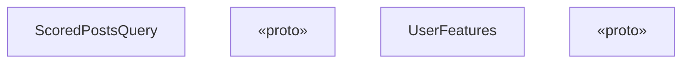
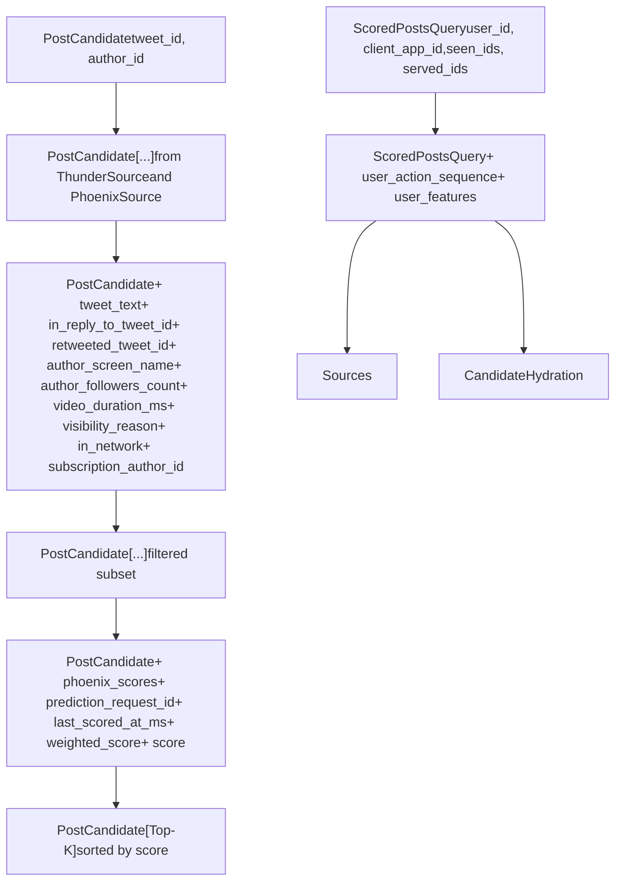
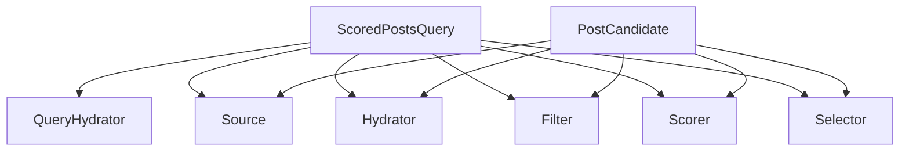

# Data Models

Relevant source files

-   [home-mixer/candidate\_pipeline/candidate.rs](https://github.com/xai-org/x-algorithm/blob/aaa167b3/home-mixer/candidate_pipeline/candidate.rs)
-   [home-mixer/candidate\_pipeline/query.rs](https://github.com/xai-org/x-algorithm/blob/aaa167b3/home-mixer/candidate_pipeline/query.rs)

## Purpose and Scope

This page documents the core data structures used throughout the Home Mixer pipeline: `ScoredPostsQuery` and `PostCandidate`. These types define the input query and candidate objects that flow through the pipeline stages.

For detailed documentation of each model's usage in specific pipeline stages, see [ScoredPostsQuery](/xai-org/x-algorithm/4.2.1-scoredpostsquery) and [PostCandidate](/xai-org/x-algorithm/4.2.2-postcandidate). For information about how these models are transformed during pipeline execution, see [Data Flow and Execution Model](/xai-org/x-algorithm/2.2-data-flow-and-execution-model).

## Overview

The Home Mixer pipeline operates on two primary data structures defined in Rust:

| Data Structure | Purpose | Defined In | Parameterizes |
| --- | --- | --- | --- |
| `ScoredPostsQuery` | Represents the input request containing user context, preferences, and filters | [home-mixer/candidate\_pipeline/query.rs8-21](https://github.com/xai-org/x-algorithm/blob/aaa167b3/home-mixer/candidate_pipeline/query.rs#L8-L21) | Generic `Q` type parameter in pipeline traits |
| `PostCandidate` | Represents a candidate post with associated metadata, scores, and enriched features | [home-mixer/candidate\_pipeline/candidate.rs6-27](https://github.com/xai-org/x-algorithm/blob/aaa167b3/home-mixer/candidate_pipeline/candidate.rs#L6-L27) | Generic `C` type parameter in pipeline traits |

These structures are progressively enriched as they flow through the pipeline. `ScoredPostsQuery` is hydrated with user behavioral data in the QueryHydrator stage, while `PostCandidate` instances accumulate metadata, scores, and other features through Hydrators, Scorers, and other pipeline stages.

**Sources:** [home-mixer/candidate\_pipeline/query.rs1-70](https://github.com/xai-org/x-algorithm/blob/aaa167b3/home-mixer/candidate_pipeline/query.rs#L1-L70) [home-mixer/candidate\_pipeline/candidate.rs1-71](https://github.com/xai-org/x-algorithm/blob/aaa167b3/home-mixer/candidate_pipeline/candidate.rs#L1-L71)

## ScoredPostsQuery Structure


**Diagram: ScoredPostsQuery Class Structure**

The `ScoredPostsQuery` struct contains three categories of fields:

### Request Context Fields

-   `user_id`: The viewer's user ID (i64)
-   `client_app_id`: Application identifier for client context (i32)
-   `country_code`: User's country for localization (String)
-   `language_code`: User's preferred language (String)
-   `request_id`: Unique identifier for the request, generated using `generate_request_id()` and appended with user\_id

### Filtering and Deduplication Fields

-   `seen_ids`: Post IDs the user has previously seen (Vec)
-   `served_ids`: Post IDs previously served in this session (Vec)
-   `bloom_filter_entries`: Probabilistic filters for efficient impression tracking (Vec)
-   `in_network_only`: Flag to restrict results to in-network content only (bool)
-   `is_bottom_request`: Flag indicating pagination request for additional content (bool)

### Hydrated Fields (Initially None)

-   `user_action_sequence`: User's recent engagement history, populated by UserActionSeqQueryHydrator (Option)
-   `user_features`: Additional user feature data populated by UserFeaturesQueryHydrator (UserFeatures)

The struct implements two traits:

-   `GetTwitterContextViewer` [home-mixer/candidate\_pipeline/query.rs53-63](https://github.com/xai-org/x-algorithm/blob/aaa167b3/home-mixer/candidate_pipeline/query.rs#L53-L63) - Provides viewer context for external service calls
-   `HasRequestId` [home-mixer/candidate\_pipeline/query.rs65-69](https://github.com/xai-org/x-algorithm/blob/aaa167b3/home-mixer/candidate_pipeline/query.rs#L65-L69) - Enables request tracking through the pipeline

**Sources:** [home-mixer/candidate\_pipeline/query.rs7-70](https://github.com/xai-org/x-algorithm/blob/aaa167b3/home-mixer/candidate_pipeline/query.rs#L7-L70)

## PostCandidate Structure


**Diagram: PostCandidate and PhoenixScores Class Structure**

The `PostCandidate` struct contains fields that are populated at different stages of the pipeline:

### Core Fields (From Sources)

Populated by ThunderSource or PhoenixSource:

-   `tweet_id`: Unique identifier for the post (i64)
-   `author_id`: User ID of the post author (u64)

### Core Data Fields (From CoreDataCandidateHydrator)

Populated by TES (Tweet Entity Service) via CoreDataCandidateHydrator:

-   `tweet_text`: Content of the post (String)
-   `in_reply_to_tweet_id`: Parent tweet ID if this is a reply (Option)
-   `retweeted_tweet_id`: Original tweet ID if this is a retweet (Option)
-   `retweeted_user_id`: Original author ID if this is a retweet (Option)
-   `ancestors`: Chain of reply parent IDs (Vec)

### Author Metadata Fields (From GizmoduckHydrator)

Populated by Gizmoduck service:

-   `author_followers_count`: Number of followers the author has (Option)
-   `author_screen_name`: Author's display handle (Option)
-   `retweeted_screen_name`: Original author's handle for retweets (Option)

### Media Fields (From VideoDurationCandidateHydrator)

-   `video_duration_ms`: Video length in milliseconds (Option)

### Subscription Fields (From SubscriptionHydrator)

-   `subscription_author_id`: Author ID if premium content (Option)

### Visibility Fields (From VFCandidateHydrator)

-   `visibility_reason`: Safety filtering reason if content is restricted (Option)

### Network Context Fields (From InNetworkCandidateHydrator)

-   `in_network`: Whether author is followed by viewer (Option)

### Scoring Fields

Populated by PhoenixScorer and WeightedScorer:

-   `phoenix_scores`: Detailed ML predictions for various engagement actions (PhoenixScores)
-   `prediction_request_id`: Unique ID for the scoring request (Option)
-   `last_scored_at_ms`: Timestamp when scoring occurred (Option)
-   `weighted_score`: Combined relevance score from multiple predictions (Option)
-   `score`: Final score after diversity adjustments (Option)

### Serving Metadata

-   `served_type`: Classification of how the candidate was sourced (Option)

**Sources:** [home-mixer/candidate\_pipeline/candidate.rs5-70](https://github.com/xai-org/x-algorithm/blob/aaa167b3/home-mixer/candidate_pipeline/candidate.rs#L5-L70)

## PhoenixScores Structure

The `PhoenixScores` struct [home-mixer/candidate\_pipeline/candidate.rs29-51](https://github.com/xai-org/x-algorithm/blob/aaa167b3/home-mixer/candidate_pipeline/candidate.rs#L29-L51) contains ML model predictions for various user engagement actions:

### Positive Engagement Scores

-   `favorite_score`: Probability of liking the post
-   `reply_score`: Probability of replying
-   `retweet_score`: Probability of retweeting
-   `quote_score`: Probability of quote tweeting
-   `photo_expand_score`: Probability of viewing media
-   `click_score`: Probability of clicking on the post
-   `profile_click_score`: Probability of viewing author profile
-   `vqv_score`: Video quality view probability
-   `share_score`: General sharing probability
-   `share_via_dm_score`: Direct message sharing probability
-   `share_via_copy_link_score`: Link copying probability
-   `quoted_click_score`: Probability of clicking quoted content
-   `follow_author_score`: Probability of following the author

### Negative Engagement Scores

-   `not_interested_score`: Probability of marking "not interested"
-   `block_author_score`: Probability of blocking the author
-   `mute_author_score`: Probability of muting the author
-   `report_score`: Probability of reporting the post

### Continuous Metrics

-   `dwell_score`: Engagement score based on viewing time
-   `dwell_time`: Expected dwell time in seconds

All scores are `Option<f64>` types, allowing for missing predictions when certain models are not applicable to a candidate.

**Sources:** [home-mixer/candidate\_pipeline/candidate.rs29-51](https://github.com/xai-org/x-algorithm/blob/aaa167b3/home-mixer/candidate_pipeline/candidate.rs#L29-L51)

## Data Transformation Flow


**Diagram: Progressive Enrichment of Data Models Through Pipeline Stages**

This diagram illustrates how the two core data models are progressively enriched as they flow through the pipeline:

1.  **Initial State**: Query created from gRPC request with basic user context; candidates contain only IDs from sources
2.  **Query Hydration**: User behavioral data added to query via UserActionSeqQueryHydrator and UserFeaturesQueryHydrator
3.  **Source Stage**: Multiple PostCandidate instances created from Thunder and Phoenix sources
4.  **Candidate Hydration**: Parallel execution of multiple hydrators adds metadata (CoreDataCandidateHydrator, GizmoduckHydrator, VideoDurationCandidateHydrator, VFCandidateHydrator, InNetworkCandidateHydrator, SubscriptionHydrator)
5.  **Filter Stage**: Candidates removed based on eligibility rules, remaining candidates unchanged
6.  **Scoring Stage**: ML predictions added via PhoenixScorer, combined via WeightedScorer
7.  **Selection Stage**: Top-K candidates selected and sorted by final score

**Sources:** [home-mixer/candidate\_pipeline/query.rs1-70](https://github.com/xai-org/x-algorithm/blob/aaa167b3/home-mixer/candidate_pipeline/query.rs#L1-L70) [home-mixer/candidate\_pipeline/candidate.rs1-71](https://github.com/xai-org/x-algorithm/blob/aaa167b3/home-mixer/candidate_pipeline/candidate.rs#L1-L71)

## Field Population Mapping

The following table maps each field to the pipeline stage responsible for populating it:

### ScoredPostsQuery Field Population

| Field | Populated By | Stage |
| --- | --- | --- |
| `user_id` | gRPC request handler | Pre-pipeline |
| `client_app_id` | gRPC request handler | Pre-pipeline |
| `country_code` | gRPC request handler | Pre-pipeline |
| `language_code` | gRPC request handler | Pre-pipeline |
| `seen_ids` | gRPC request handler | Pre-pipeline |
| `served_ids` | gRPC request handler | Pre-pipeline |
| `in_network_only` | gRPC request handler | Pre-pipeline |
| `is_bottom_request` | gRPC request handler | Pre-pipeline |
| `bloom_filter_entries` | gRPC request handler | Pre-pipeline |
| `request_id` | `ScoredPostsQuery::new()` | Pre-pipeline |
| `user_action_sequence` | UserActionSeqQueryHydrator | QueryHydrator |
| `user_features` | UserFeaturesQueryHydrator | QueryHydrator |

### PostCandidate Field Population

| Field | Populated By | Stage |
| --- | --- | --- |
| `tweet_id` | ThunderSource / PhoenixSource | Source |
| `author_id` | ThunderSource / PhoenixSource | Source |
| `tweet_text` | CoreDataCandidateHydrator | Hydrator |
| `in_reply_to_tweet_id` | CoreDataCandidateHydrator | Hydrator |
| `retweeted_tweet_id` | CoreDataCandidateHydrator | Hydrator |
| `retweeted_user_id` | CoreDataCandidateHydrator | Hydrator |
| `ancestors` | CoreDataCandidateHydrator | Hydrator |
| `author_followers_count` | GizmoduckHydrator | Hydrator |
| `author_screen_name` | GizmoduckHydrator | Hydrator |
| `retweeted_screen_name` | GizmoduckHydrator | Hydrator |
| `video_duration_ms` | VideoDurationCandidateHydrator | Hydrator |
| `subscription_author_id` | SubscriptionHydrator | Hydrator |
| `visibility_reason` | VFCandidateHydrator | Hydrator |
| `in_network` | InNetworkCandidateHydrator | Hydrator |
| `phoenix_scores.*` | PhoenixScorer | Scorer |
| `prediction_request_id` | PhoenixScorer | Scorer |
| `last_scored_at_ms` | PhoenixScorer | Scorer |
| `weighted_score` | WeightedScorer | Scorer |
| `score` | AuthorDiversityScorer / OONScorer | Scorer |
| `served_type` | ThunderSource / PhoenixSource | Source |

**Sources:** [home-mixer/candidate\_pipeline/query.rs7-50](https://github.com/xai-org/x-algorithm/blob/aaa167b3/home-mixer/candidate_pipeline/query.rs#L7-L50) [home-mixer/candidate\_pipeline/candidate.rs5-27](https://github.com/xai-org/x-algorithm/blob/aaa167b3/home-mixer/candidate_pipeline/candidate.rs#L5-L27)

## Helper Traits and Methods

### CandidateHelpers Trait

The `CandidateHelpers` trait [home-mixer/candidate\_pipeline/candidate.rs53-55](https://github.com/xai-org/x-algorithm/blob/aaa167b3/home-mixer/candidate_pipeline/candidate.rs#L53-L55) provides utility methods for working with PostCandidate instances:

```
pub trait CandidateHelpers {    fn get_screen_names(&self) -> HashMap<u64, String>;}
```
The implementation [home-mixer/candidate\_pipeline/candidate.rs57-70](https://github.com/xai-org/x-algorithm/blob/aaa167b3/home-mixer/candidate_pipeline/candidate.rs#L57-L70) extracts screen names for both the author and retweeted user (if applicable), returning a mapping from user IDs to screen names. This is useful for rendering user mentions and attribution in the UI.

### Trait Implementations

`ScoredPostsQuery` implements:

-   `GetTwitterContextViewer` - Constructs a `TwitterContextViewer` from query fields for visibility filtering and other service calls that require viewer context
-   `HasRequestId` - Provides access to the unique request identifier for logging and tracing

**Sources:** [home-mixer/candidate\_pipeline/candidate.rs53-70](https://github.com/xai-org/x-algorithm/blob/aaa167b3/home-mixer/candidate_pipeline/candidate.rs#L53-L70) [home-mixer/candidate\_pipeline/query.rs53-69](https://github.com/xai-org/x-algorithm/blob/aaa167b3/home-mixer/candidate_pipeline/query.rs#L53-L69)

## Usage in Pipeline Traits

These data models serve as type parameters throughout the candidate pipeline framework:


**Diagram: Data Models as Generic Type Parameters**

The generic trait-based design of the candidate pipeline framework (see [Candidate Pipeline Framework](/xai-org/x-algorithm/3-candidate-pipeline-framework)) allows these concrete types to be used consistently across all pipeline stages. Each trait accepts `ScoredPostsQuery` as the query type (`Q`) and `PostCandidate` as the candidate type (`C`), ensuring type safety and enabling the compiler to verify correct data flow throughout the pipeline.

**Sources:** [home-mixer/candidate\_pipeline/query.rs1-70](https://github.com/xai-org/x-algorithm/blob/aaa167b3/home-mixer/candidate_pipeline/query.rs#L1-L70) [home-mixer/candidate\_pipeline/candidate.rs1-71](https://github.com/xai-org/x-algorithm/blob/aaa167b3/home-mixer/candidate_pipeline/candidate.rs#L1-L71)
