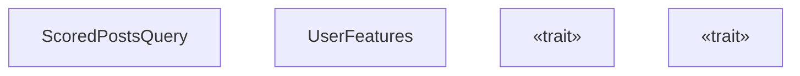
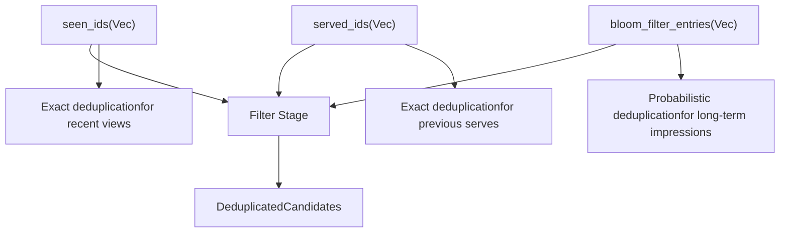
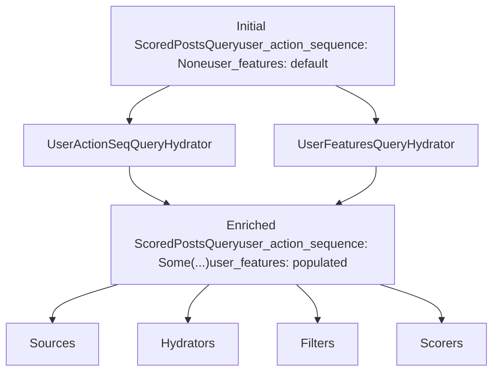
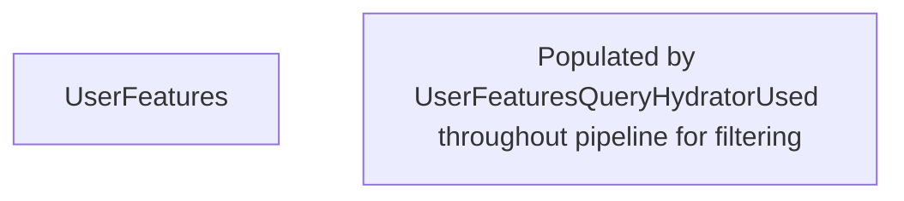
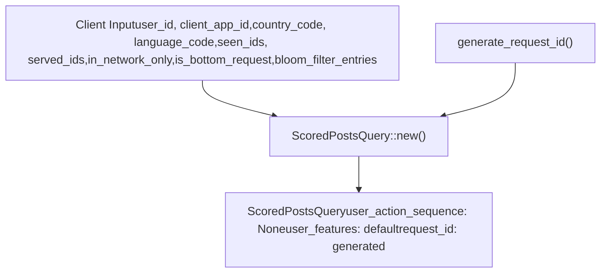
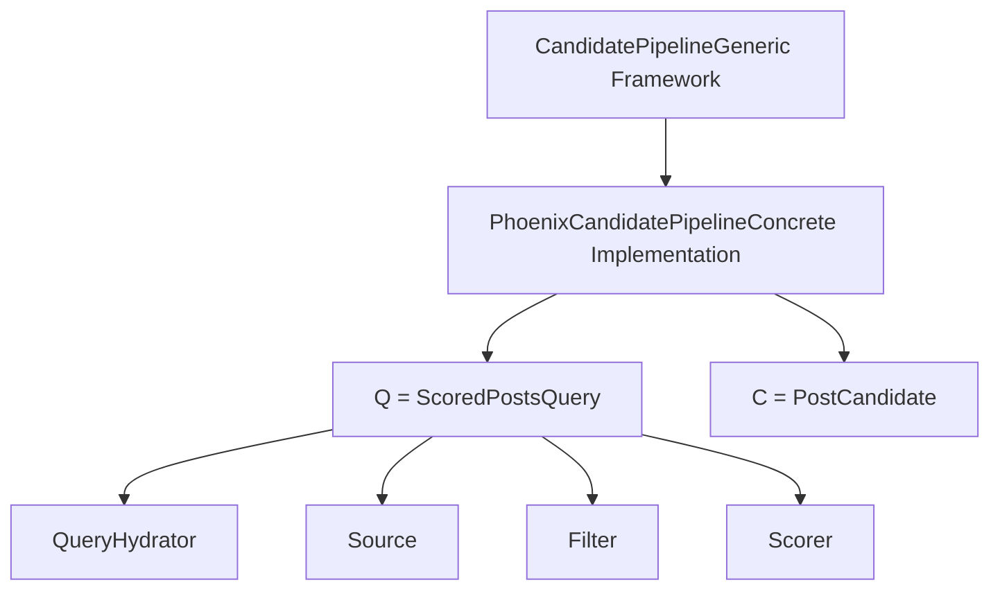

# ScoredPostsQuery

Relevant source files

-   [home-mixer/candidate\_pipeline/query.rs](https://github.com/xai-org/x-algorithm/blob/aaa167b3/home-mixer/candidate_pipeline/query.rs)
-   [home-mixer/candidate\_pipeline/query\_features.rs](https://github.com/xai-org/x-algorithm/blob/aaa167b3/home-mixer/candidate_pipeline/query_features.rs)

## Purpose and Scope

This document describes `ScoredPostsQuery`, the primary query data structure used throughout the Home Mixer's Phoenix Candidate Pipeline. `ScoredPostsQuery` represents a request for scored posts (tweets) in the "For You" feed, encapsulating all necessary information about the requesting user, their context, localization preferences, deduplication state, and enriched features.

`ScoredPostsQuery` serves as the query type parameter `Q` in the generic `CandidatePipeline<Q, C>` framework (see [Candidate Pipeline Framework](/xai-org/x-algorithm/3-candidate-pipeline-framework)). It is created at the beginning of each request and progressively enriched by query hydrators (see [Query Hydrators](/xai-org/x-algorithm/4.4-query-hydrators)) as it flows through the pipeline. For information about the candidate data structure, see [PostCandidate](/xai-org/x-algorithm/4.2.2-postcandidate).

Sources: [home-mixer/candidate\_pipeline/query.rs1-70](https://github.com/xai-org/x-algorithm/blob/aaa167b3/home-mixer/candidate_pipeline/query.rs#L1-L70)

## Data Structure Overview

The `ScoredPostsQuery` struct is defined in [home-mixer/candidate\_pipeline/query.rs8-21](https://github.com/xai-org/x-algorithm/blob/aaa167b3/home-mixer/candidate_pipeline/query.rs#L8-L21) and contains 12 fields organized into functional categories: user identification, localization, deduplication, request configuration, enriched query data, and request tracking.


Sources: [home-mixer/candidate\_pipeline/query.rs8-21](https://github.com/xai-org/x-algorithm/blob/aaa167b3/home-mixer/candidate_pipeline/query.rs#L8-L21) [home-mixer/candidate\_pipeline/query\_features.rs5-11](https://github.com/xai-org/x-algorithm/blob/aaa167b3/home-mixer/candidate_pipeline/query_features.rs#L5-L11)

## Field Documentation

The following table documents each field in `ScoredPostsQuery`, organized by functional category:

| Category | Field | Type | Purpose |
| --- | --- | --- | --- |
| **User Context** | `user_id` | `i64` | The unique identifier of the requesting user (viewer) |
|  | `client_app_id` | `i32` | The client application identifier (e.g., iOS, Android, web) |
| **Localization** | `country_code` | `String` | ISO country code for the user's location |
|  | `language_code` | `String` | ISO language code for the user's preferred language |
| **Deduplication** | `seen_ids` | `Vec<i64>` | Tweet IDs the user has already seen (scrolled past) |
|  | `served_ids` | `Vec<i64>` | Tweet IDs that have been previously served to the user |
|  | `bloom_filter_entries` | `Vec<ImpressionBloomFilterEntry>` | Bloom filter entries for probabilistic deduplication of impressions |
| **Request Configuration** | `in_network_only` | `bool` | If true, only retrieve candidates from followed users (Thunder source only) |
|  | `is_bottom_request` | `bool` | Indicates whether this is a request for additional content at the bottom of the feed |
| **Enriched Query Data** | `user_action_sequence` | `Option<UserActionSequence>` | User's recent engagement history, populated by query hydrators |
|  | `user_features` | `UserFeatures` | Social graph and content preference data, populated by query hydrators |
| **Request Tracking** | `request_id` | `String` | Unique identifier for this request, used for logging and debugging |

Sources: [home-mixer/candidate\_pipeline/query.rs8-21](https://github.com/xai-org/x-algorithm/blob/aaa167b3/home-mixer/candidate_pipeline/query.rs#L8-L21)

### User Context Fields

The `user_id` and `client_app_id` fields identify the requesting user and their client application. These fields are essential for personalization and are used throughout the pipeline for:

-   Determining which followed users to retrieve in-network posts from (Thunder source)
-   Generating user embeddings for out-of-network retrieval (Phoenix retrieval)
-   Filtering blocked/muted content
-   Applying platform-specific business logic

Sources: [home-mixer/candidate\_pipeline/query.rs9-10](https://github.com/xai-org/x-algorithm/blob/aaa167b3/home-mixer/candidate_pipeline/query.rs#L9-L10)

### Localization Fields

The `country_code` and `language_code` fields enable geographic and linguistic personalization:

-   Content filtering based on regional compliance requirements
-   Language-specific ranking adjustments
-   Locale-aware visibility filtering

Sources: [home-mixer/candidate\_pipeline/query.rs11-12](https://github.com/xai-org/x-algorithm/blob/aaa167b3/home-mixer/candidate_pipeline/query.rs#L11-L12)

### Deduplication Fields

Three fields work together to prevent showing duplicate content:


-   **`seen_ids`**: Exact list of tweet IDs the user has scrolled past in the current session
-   **`served_ids`**: Exact list of tweet IDs previously returned in earlier responses
-   **`bloom_filter_entries`**: Probabilistic data structure for tracking impressions over longer time periods with memory efficiency

Sources: [home-mixer/candidate\_pipeline/query.rs13-17](https://github.com/xai-org/x-algorithm/blob/aaa167b3/home-mixer/candidate_pipeline/query.rs#L13-L17)

### Request Configuration Fields

The `in_network_only` and `is_bottom_request` flags control pipeline behavior:

-   **`in_network_only`**: When `true`, disables the Phoenix retrieval source and only serves candidates from followed users via Thunder. This is used for users who prefer chronological timelines or in specific UI contexts.
-   **`is_bottom_request`**: When `true`, indicates the user has scrolled to the bottom of their feed and is requesting more content. This may trigger different ranking strategies or candidate mixing ratios.

Sources: [home-mixer/candidate\_pipeline/query.rs15-16](https://github.com/xai-org/x-algorithm/blob/aaa167b3/home-mixer/candidate_pipeline/query.rs#L15-L16)

### Enriched Query Data Fields

Two fields are initialized as empty/default and populated by query hydrators during pipeline execution:


-   **`user_action_sequence`**: Populated by `UserActionSeqQueryHydrator`, contains the user's recent engagement history (favorites, retweets, replies, etc.) used by the Phoenix ranker for personalized scoring
-   **`user_features`**: Populated by `UserFeaturesQueryHydrator`, contains social graph data and content preferences (see [UserFeatures Component](https://github.com/xai-org/x-algorithm/blob/aaa167b3/UserFeatures Component) below)

Sources: [home-mixer/candidate\_pipeline/query.rs18-19](https://github.com/xai-org/x-algorithm/blob/aaa167b3/home-mixer/candidate_pipeline/query.rs#L18-L19)

## UserFeatures Component

The `UserFeatures` struct is nested within `ScoredPostsQuery` and contains social graph and content preference data. It is defined in [home-mixer/candidate\_pipeline/query\_features.rs5-11](https://github.com/xai-org/x-algorithm/blob/aaa167b3/home-mixer/candidate_pipeline/query_features.rs#L5-L11)


### UserFeatures Fields

| Field | Type | Purpose |
| --- | --- | --- |
| `muted_keywords` | `Vec<String>` | Keywords and phrases the user has muted; used to filter candidates containing these terms |
| `blocked_user_ids` | `Vec<i64>` | User IDs the viewer has blocked; candidates from these authors are filtered out |
| `muted_user_ids` | `Vec<i64>` | User IDs the viewer has muted; candidates from these authors are filtered out |
| `followed_user_ids` | `Vec<i64>` | User IDs the viewer follows; used to determine in-network vs out-of-network candidates |
| `subscribed_user_ids` | `Vec<i64>` | User IDs the viewer subscribes to (premium/paid subscriptions); used for subscription filtering |

These fields are used by various filters in the pipeline:

-   `AuthorSocialgraphFilter` uses `blocked_user_ids` and `muted_user_ids` (see [AuthorSocialgraphFilter](/xai-org/x-algorithm/4.6.2-authorsocialgraphfilter))
-   `MutedKeywordFilter` uses `muted_keywords`
-   `InNetworkCandidateHydrator` uses `followed_user_ids` to mark candidates as in-network (see [InNetworkCandidateHydrator](/xai-org/x-algorithm/4.5.3-innetworkcandidatehydrator))
-   `SubscriptionHydrator` uses `subscribed_user_ids` (see [SubscriptionHydrator](/xai-org/x-algorithm/4.5.4-subscriptionhydrator))

Sources: [home-mixer/candidate\_pipeline/query\_features.rs5-11](https://github.com/xai-org/x-algorithm/blob/aaa167b3/home-mixer/candidate_pipeline/query_features.rs#L5-L11)

## Construction and Initialization

### Constructor Method

The `new()` constructor is defined in [home-mixer/candidate\_pipeline/query.rs24-50](https://github.com/xai-org/x-algorithm/blob/aaa167b3/home-mixer/candidate_pipeline/query.rs#L24-L50) and initializes a `ScoredPostsQuery` with client-provided values. The enriched query data fields are initialized to default/empty values:


The constructor:

1.  Accepts 9 parameters corresponding to client-provided data
2.  Generates a unique `request_id` using `generate_request_id()` and appends the `user_id`
3.  Sets `user_action_sequence` to `None`
4.  Sets `user_features` to `UserFeatures::default()`
5.  Returns the initialized struct

Sources: [home-mixer/candidate\_pipeline/query.rs24-50](https://github.com/xai-org/x-algorithm/blob/aaa167b3/home-mixer/candidate_pipeline/query.rs#L24-L50)

### Request ID Generation

The `request_id` field is automatically generated in the format `{generated_id}-{user_id}` where:

-   `{generated_id}` is produced by `generate_request_id()` utility function
-   `{user_id}` is the requesting user's ID

This format enables:

-   Unique identification of each request for logging and debugging
-   Easy filtering of logs by user ID
-   Correlation of distributed traces across services

Sources: [home-mixer/candidate\_pipeline/query.rs35](https://github.com/xai-org/x-algorithm/blob/aaa167b3/home-mixer/candidate_pipeline/query.rs#L35-L35)

## Trait Implementations

`ScoredPostsQuery` implements two traits that enable integration with framework components and external services.

### HasRequestId Trait

The `HasRequestId` trait is defined by the candidate pipeline framework and implemented in [home-mixer/candidate\_pipeline/query.rs65-69](https://github.com/xai-org/x-algorithm/blob/aaa167b3/home-mixer/candidate_pipeline/query.rs#L65-L69):

```
impl HasRequestId for ScoredPostsQuery {    fn request_id(&self) -> &str {        &self.request_id    }}
```
This trait enables:

-   Framework components to access the request ID for logging
-   Correlation of events across pipeline stages
-   Debugging and tracing support

Sources: [home-mixer/candidate\_pipeline/query.rs65-69](https://github.com/xai-org/x-algorithm/blob/aaa167b3/home-mixer/candidate_pipeline/query.rs#L65-L69)

### GetTwitterContextViewer Trait

The `GetTwitterContextViewer` trait is implemented in [home-mixer/candidate\_pipeline/query.rs53-63](https://github.com/xai-org/x-algorithm/blob/aaa167b3/home-mixer/candidate_pipeline/query.rs#L53-L63) to enable integration with external services that require viewer context:

```
impl GetTwitterContextViewer for ScoredPostsQuery {    fn get_viewer(&self) -> Option<TwitterContextViewer> {        Some(TwitterContextViewer {            user_id: self.user_id,            client_application_id: self.client_app_id as i64,            request_country_code: self.country_code.clone(),            request_language_code: self.language_code.clone(),            ..Default::default()        })    }}
```
This trait constructs a `TwitterContextViewer` protobuf message from the query fields, which is used by:

-   Visibility Filtering Service for content safety checks
-   Other Twitter services that require viewer context for authorization or personalization

Sources: [home-mixer/candidate\_pipeline/query.rs53-63](https://github.com/xai-org/x-algorithm/blob/aaa167b3/home-mixer/candidate_pipeline/query.rs#L53-L63)

## Query Lifecycle in the Pipeline

The following diagram illustrates how `ScoredPostsQuery` is created, enriched, and used throughout the pipeline execution:

> **[Mermaid sequence]**
> *(图表结构无法解析)*

### Pipeline Stage Usage

Different pipeline stages access different fields of `ScoredPostsQuery`:

| Stage | Fields Used | Purpose |
| --- | --- | --- |
| **Query Hydrators** | All fields | Read context to fetch enrichment data; write to `user_action_sequence` and `user_features` |
| **Sources** | `user_id`, `followed_user_ids`, `in_network_only` | Determine which candidates to retrieve |
| **Hydrators** | `user_id`, `country_code`, `language_code` | Fetch additional metadata for candidates |
| **Filters** | `seen_ids`, `served_ids`, `bloom_filter_entries`, `blocked_user_ids`, `muted_user_ids`, `muted_keywords` | Remove ineligible candidates |
| **Scorers** | `user_action_sequence`, `user_features`, `user_id` | Personalize engagement predictions |
| **Selectors** | `request_id` (via `HasRequestId`) | Logging and tracing |

Sources: [home-mixer/candidate\_pipeline/query.rs1-70](https://github.com/xai-org/x-algorithm/blob/aaa167b3/home-mixer/candidate_pipeline/query.rs#L1-L70)

## Integration with Pipeline Framework

`ScoredPostsQuery` satisfies the query type parameter `Q` in the generic `CandidatePipeline<Q, C>` framework:


By implementing the required traits (`HasRequestId`) and following the framework's conventions, `ScoredPostsQuery` enables the generic pipeline machinery to operate on Home Mixer-specific data while maintaining type safety and abstraction boundaries.

Sources: [home-mixer/candidate\_pipeline/query.rs1-70](https://github.com/xai-org/x-algorithm/blob/aaa167b3/home-mixer/candidate_pipeline/query.rs#L1-L70)
