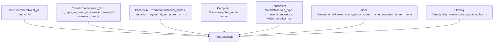
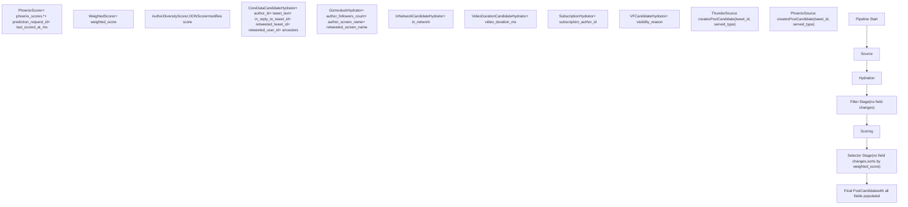
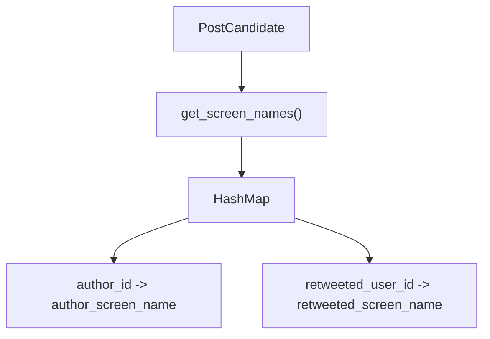
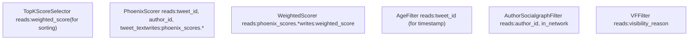

# PostCandidate

Relevant source files

-   [home-mixer/candidate\_pipeline/candidate.rs](https://github.com/xai-org/x-algorithm/blob/aaa167b3/home-mixer/candidate_pipeline/candidate.rs)
-   [home-mixer/candidate\_pipeline/candidate\_features.rs](https://github.com/xai-org/x-algorithm/blob/aaa167b3/home-mixer/candidate_pipeline/candidate_features.rs)

## Purpose and Scope

`PostCandidate` is the core data structure representing a tweet (post) as it flows through the Phoenix Candidate Pipeline. This document describes the structure's fields, their purposes, how they are populated by various pipeline stages, and the lifecycle of a candidate from initial creation to final selection.

For information about the query structure that drives candidate retrieval, see [ScoredPostsQuery](/xai-org/x-algorithm/4.2.1-scoredpostsquery). For details about how candidates are retrieved from sources, see [Candidate Sources](/xai-org/x-algorithm/4.3-candidate-sources). For information about how candidates are enriched and scored, see [Candidate Hydrators](/xai-org/x-algorithm/4.5-candidate-hydrators) and [Scorers](/xai-org/x-algorithm/4.7-scorers).

## PostCandidate Structure

The `PostCandidate` struct is defined in [home-mixer/candidate\_pipeline/candidate.rs6-27](https://github.com/xai-org/x-algorithm/blob/aaa167b3/home-mixer/candidate_pipeline/candidate.rs#L6-L27) and contains 26 fields organized into several logical groups: core identifiers, tweet content, ML predictions, enrichment metadata, and filtering data.

### Field Groups

**Sources:** [home-mixer/candidate\_pipeline/candidate.rs6-27](https://github.com/xai-org/x-algorithm/blob/aaa167b3/home-mixer/candidate_pipeline/candidate.rs#L6-L27)

### Complete Field Reference

| Field | Type | Purpose | Populated By |
| --- | --- | --- | --- |
| `tweet_id` | `i64` | Primary identifier for the tweet | Source (Thunder/Phoenix) |
| `author_id` | `u64` | User ID of tweet author | CoreDataCandidateHydrator |
| `tweet_text` | `String` | Tweet text content | CoreDataCandidateHydrator |
| `in_reply_to_tweet_id` | `Option<u64>` | Tweet ID this is replying to, if any | CoreDataCandidateHydrator |
| `retweeted_tweet_id` | `Option<u64>` | Original tweet ID if this is a retweet | CoreDataCandidateHydrator |
| `retweeted_user_id` | `Option<u64>` | Original author ID if this is a retweet | CoreDataCandidateHydrator |
| `phoenix_scores` | `PhoenixScores` | ML engagement probability predictions | PhoenixScorer |
| `prediction_request_id` | `Option<u64>` | Identifier for the Phoenix prediction batch | PhoenixScorer |
| `last_scored_at_ms` | `Option<u64>` | Timestamp when Phoenix scoring occurred | PhoenixScorer |
| `weighted_score` | `Option<f64>` | Final weighted score for ranking | WeightedScorer |
| `score` | `Option<f64>` | Intermediate or adjusted score | Various scorers |
| `served_type` | `Option<pb::ServedType>` | Classification of candidate (IN\_NETWORK, OON, etc.) | Source |
| `in_network` | `Option<bool>` | Whether author is followed by viewer | InNetworkCandidateHydrator |
| `ancestors` | `Vec<u64>` | Conversation ancestor tweet IDs | CoreDataCandidateHydrator |
| `video_duration_ms` | `Option<i32>` | Video duration in milliseconds | VideoDurationCandidateHydrator |
| `author_followers_count` | `Option<i32>` | Number of followers the author has | GizmoduckHydrator |
| `author_screen_name` | `Option<String>` | Author's @username | GizmoduckHydrator |
| `retweeted_screen_name` | `Option<String>` | Original author's @username for retweets | GizmoduckHydrator |
| `visibility_reason` | `Option<vf::FilteredReason>` | Visibility filtering reason if filtered | VFCandidateHydrator |
| `subscription_author_id` | `Option<u64>` | Author ID if from subscription content | SubscriptionHydrator |

**Sources:** [home-mixer/candidate\_pipeline/candidate.rs6-27](https://github.com/xai-org/x-algorithm/blob/aaa167b3/home-mixer/candidate_pipeline/candidate.rs#L6-L27)

## PhoenixScores Structure

The `PhoenixScores` struct is defined in [home-mixer/candidate\_pipeline/candidate.rs29-51](https://github.com/xai-org/x-algorithm/blob/aaa167b3/home-mixer/candidate_pipeline/candidate.rs#L29-L51) and contains engagement probability predictions from the Phoenix Grok transformer model. All fields are `Option<f64>` representing probabilities between 0.0 and 1.0.

### Engagement Prediction Categories

**Sources:** [home-mixer/candidate\_pipeline/candidate.rs29-51](https://github.com/xai-org/x-algorithm/blob/aaa167b3/home-mixer/candidate_pipeline/candidate.rs#L29-L51)

### Phoenix Score Fields

| Category | Fields | Description |
| --- | --- | --- |
| **Core Engagements** | `favorite_score`, `reply_score`, `retweet_score` | Primary engagement actions |
| **Expanded Actions** | `quote_score`, `share_score`, `share_via_dm_score`, `share_via_copy_link_score` | Secondary sharing behaviors |
| **Click-based** | `click_score`, `photo_expand_score`, `profile_click_score`, `quoted_click_score` | Click-through behaviors |
| **View Quality** | `vqv_score` | Video view quality prediction |
| **Follow Action** | `follow_author_score` | Probability of following author after seeing post |
| **Negative Signals** | `not_interested_score`, `block_author_score`, `mute_author_score`, `report_score` | Negative engagement predictions |
| **Dwell Metrics** | `dwell_score`, `dwell_time` | Time spent viewing prediction |

**Sources:** [home-mixer/candidate\_pipeline/candidate.rs29-51](https://github.com/xai-org/x-algorithm/blob/aaa167b3/home-mixer/candidate_pipeline/candidate.rs#L29-L51)

## Candidate Lifecycle and Data Flow

A `PostCandidate` progresses through multiple pipeline stages, with different components responsible for populating different fields. This diagram shows the evolution of a candidate from initial creation to final selection.

**Sources:** [home-mixer/candidate\_pipeline/candidate.rs6-27](https://github.com/xai-org/x-algorithm/blob/aaa167b3/home-mixer/candidate_pipeline/candidate.rs#L6-L27)

## Field Population by Pipeline Stage

The following table maps each `PostCandidate` field to the pipeline component responsible for populating it:

| Pipeline Stage | Component | Fields Populated |
| --- | --- | --- |
| **Source** | ThunderSource, PhoenixSource | `tweet_id`, `served_type` |
| **Hydrator** | CoreDataCandidateHydrator | `author_id`, `tweet_text`, `in_reply_to_tweet_id`, `retweeted_tweet_id`, `retweeted_user_id`, `ancestors` |
| **Hydrator** | GizmoduckHydrator | `author_followers_count`, `author_screen_name`, `retweeted_screen_name` |
| **Hydrator** | InNetworkCandidateHydrator | `in_network` |
| **Hydrator** | VideoDurationCandidateHydrator | `video_duration_ms` |
| **Hydrator** | SubscriptionHydrator | `subscription_author_id` |
| **Hydrator** | VFCandidateHydrator | `visibility_reason` |
| **Scorer** | PhoenixScorer | `phoenix_scores` (all subfields), `prediction_request_id`, `last_scored_at_ms` |
| **Scorer** | WeightedScorer | `weighted_score` |
| **Scorer** | AuthorDiversityScorer, OONScorer | `score` (modifications) |

**Sources:** [home-mixer/candidate\_pipeline/candidate.rs6-27](https://github.com/xai-org/x-algorithm/blob/aaa167b3/home-mixer/candidate_pipeline/candidate.rs#L6-L27)

## CandidateHelpers Trait

The `CandidateHelpers` trait defined in [home-mixer/candidate\_pipeline/candidate.rs53-70](https://github.com/xai-org/x-algorithm/blob/aaa167b3/home-mixer/candidate_pipeline/candidate.rs#L53-L70) provides utility methods for working with `PostCandidate` instances.

### get\_screen\_names Method

The `get_screen_names()` method returns a `HashMap<u64, String>` mapping user IDs to screen names for all users associated with the candidate:

-   Maps `author_id` to `author_screen_name` if present
-   Maps `retweeted_user_id` to `retweeted_screen_name` if the candidate is a retweet

This is useful for constructing user-facing displays or logging without repeatedly accessing optional fields.

**Sources:** [home-mixer/candidate\_pipeline/candidate.rs53-70](https://github.com/xai-org/x-algorithm/blob/aaa167b3/home-mixer/candidate_pipeline/candidate.rs#L53-L70)

## Related Feature Structures

While not direct fields of `PostCandidate`, several supporting data structures defined in [home-mixer/candidate\_pipeline/candidate\_features.rs](https://github.com/xai-org/x-algorithm/blob/aaa167b3/home-mixer/candidate_pipeline/candidate_features.rs) are used during the hydration process to populate `PostCandidate` fields:

### PureCoreData

Defined in [home-mixer/candidate\_pipeline/candidate\_features.rs5-12](https://github.com/xai-org/x-algorithm/blob/aaa167b3/home-mixer/candidate_pipeline/candidate_features.rs#L5-L12) this structure represents the raw core tweet data fetched from TES (Tweet Entity Service) before being mapped to `PostCandidate` fields:

| PureCoreData Field | Maps to PostCandidate Field |
| --- | --- |
| `author_id` | `author_id` |
| `text` | `tweet_text` |
| `source_tweet_id` | `retweeted_tweet_id` |
| `source_user_id` | `retweeted_user_id` |
| `in_reply_to_tweet_id` | `in_reply_to_tweet_id` |

### MediaEntity and VideoInfo

Defined in [home-mixer/candidate\_pipeline/candidate\_features.rs20-38](https://github.com/xai-org/x-algorithm/blob/aaa167b3/home-mixer/candidate_pipeline/candidate_features.rs#L20-L38) these structures represent media metadata from TES:

-   `MediaEntity` contains a `media_info` field
-   `MediaInfo::VideoInfo` variant contains `VideoInfo`
-   `VideoInfo.duration_millis` maps to `PostCandidate.video_duration_ms`

### GizmoduckUser

Defined in [home-mixer/candidate\_pipeline/candidate\_features.rs60-78](https://github.com/xai-org/x-algorithm/blob/aaa167b3/home-mixer/candidate_pipeline/candidate_features.rs#L60-L78) this structure represents user profile data from Gizmoduck service:

-   `GizmoduckUserProfile.screen_name` maps to `author_screen_name` or `retweeted_screen_name`
-   `GizmoduckUserCounts.followers_count` maps to `author_followers_count`

**Sources:** [home-mixer/candidate\_pipeline/candidate\_features.rs1-79](https://github.com/xai-org/x-algorithm/blob/aaa167b3/home-mixer/candidate_pipeline/candidate_features.rs#L1-L79)

## Memory and Performance Considerations

### Clone Semantics

`PostCandidate` implements `Clone` ([home-mixer/candidate\_pipeline/candidate.rs5](https://github.com/xai-org/x-algorithm/blob/aaa167b3/home-mixer/candidate_pipeline/candidate.rs#L5-L5)), enabling efficient duplication during pipeline stages that need to fork candidates (e.g., for diversity scoring or A/B testing).

### Optional Fields

Most fields are `Option<T>` types, allowing the struct to exist in partially-populated states during pipeline progression. This avoids unnecessary memory allocation for fields that may not be needed based on filtering outcomes.

### Default Implementation

Both `PostCandidate` and `PhoenixScores` implement `Default` ([home-mixer/candidate\_pipeline/candidate.rs5](https://github.com/xai-org/x-algorithm/blob/aaa167b3/home-mixer/candidate_pipeline/candidate.rs#L5-L5) [home-mixer/candidate\_pipeline/candidate.rs29](https://github.com/xai-org/x-algorithm/blob/aaa167b3/home-mixer/candidate_pipeline/candidate.rs#L29-L29)), enabling easy construction of empty candidates at the source stage.

**Sources:** [home-mixer/candidate\_pipeline/candidate.rs5-51](https://github.com/xai-org/x-algorithm/blob/aaa167b3/home-mixer/candidate_pipeline/candidate.rs#L5-L51)

## Usage Example: Field Access Pattern

Throughout the pipeline, components access `PostCandidate` fields based on their stage:

**Sources:** [home-mixer/candidate\_pipeline/candidate.rs6-27](https://github.com/xai-org/x-algorithm/blob/aaa167b3/home-mixer/candidate_pipeline/candidate.rs#L6-L27)
