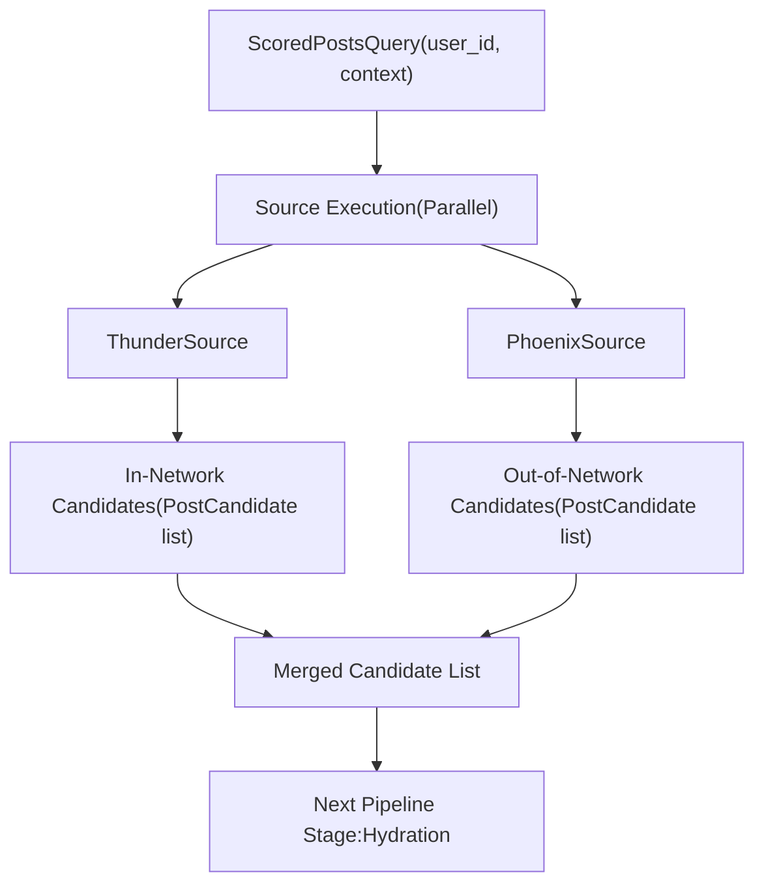
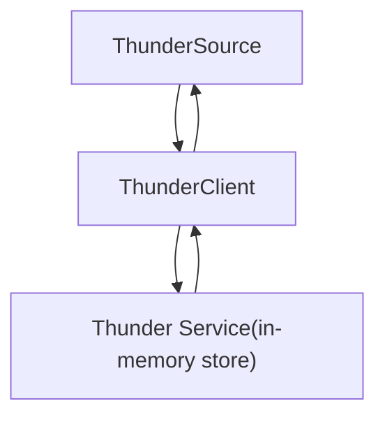
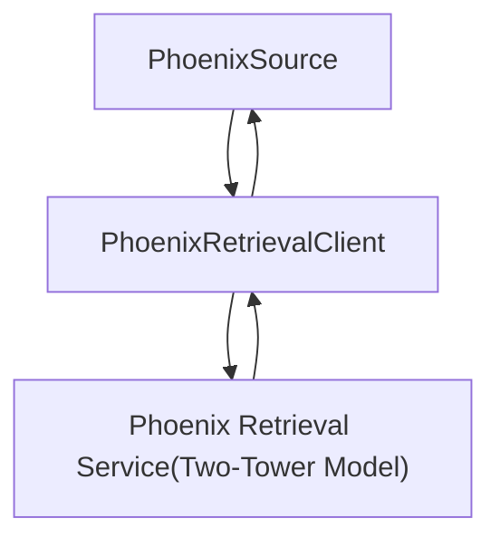
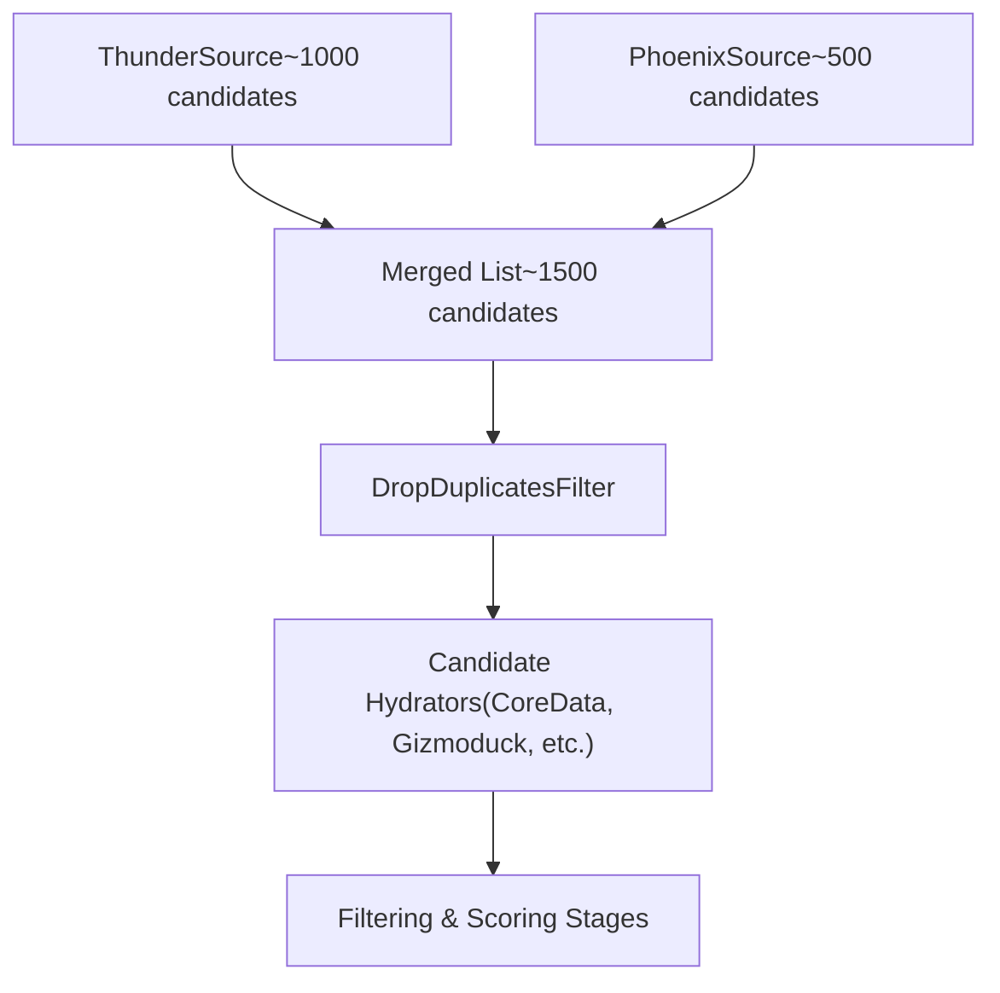

# Candidate Sources

Relevant source files

-   [README.md](https://github.com/xai-org/x-algorithm/blob/aaa167b3/README.md?plain=1)
-   [home-mixer/candidate\_pipeline/phoenix\_candidate\_pipeline.rs](https://github.com/xai-org/x-algorithm/blob/aaa167b3/home-mixer/candidate_pipeline/phoenix_candidate_pipeline.rs)

## Purpose and Scope

This document describes the **candidate source** implementations that retrieve initial candidate sets for the Phoenix Candidate Pipeline. Candidate sources are the first stage in the pipeline that produces actual content recommendations by fetching posts from underlying data stores or retrieval systems.

The Home Mixer implementation uses two parallel sources:

-   **ThunderSource**: Retrieves in-network posts from accounts the user follows
-   **PhoenixSource**: Retrieves out-of-network posts discovered through ML-based similarity search

For implementation details of the generic `Source` trait and its execution model, see [Source Trait](/xai-org/x-algorithm/3.3-source-trait). For detailed architecture of each source system, see [Thunder Source](/xai-org/x-algorithm/4.3.1-thunder-source) and [Phoenix Retrieval Source](/xai-org/x-algorithm/4.3.2-phoenix-retrieval-source).

## Overview

Candidate sources implement the `Source` trait from the candidate pipeline framework. They are responsible for retrieving initial candidate sets based on the query context. Sources execute in **parallel** during pipeline execution to minimize latency, and their results are merged before subsequent pipeline stages.

The pipeline instantiates both sources during initialization and stores them as trait objects:

[home-mixer/candidate\_pipeline/phoenix\_candidate\_pipeline.rs91-97](https://github.com/xai-org/x-algorithm/blob/aaa167b3/home-mixer/candidate_pipeline/phoenix_candidate_pipeline.rs#L91-L97)


**Pipeline Execution Flow: Candidate Sources**

Sources: [home-mixer/candidate\_pipeline/phoenix\_candidate\_pipeline.rs91-97](https://github.com/xai-org/x-algorithm/blob/aaa167b3/home-mixer/candidate_pipeline/phoenix_candidate_pipeline.rs#L91-L97) [README.md61-69](https://github.com/xai-org/x-algorithm/blob/aaa167b3/README.md?plain=1#L61-L69)

## Source Implementations

The Phoenix Candidate Pipeline uses two concrete source implementations, each optimized for a different retrieval strategy:

| Source | Purpose | Data Store | Retrieval Method | Typical Count |
| --- | --- | --- | --- | --- |
| `ThunderSource` | In-network posts from followed accounts | Thunder in-memory store | Direct user lookup | ~1000 candidates |
| `PhoenixSource` | Out-of-network content discovery | Phoenix ML system | Two-tower similarity search | ~500 candidates |

### ThunderSource

`ThunderSource` retrieves posts from accounts the requesting user follows. It queries the Thunder service, which maintains an in-memory store of recent posts organized by author ID. This enables sub-millisecond retrieval of in-network content.

**Structure:**

[home-mixer/candidate\_pipeline/phoenix\_candidate\_pipeline.rs95](https://github.com/xai-org/x-algorithm/blob/aaa167b3/home-mixer/candidate_pipeline/phoenix_candidate_pipeline.rs#L95-L95)


**ThunderSource Data Flow**

The source converts Thunder's response (post IDs from followed accounts) into `PostCandidate` objects with minimal initial data. Subsequent hydration stages enrich these candidates with full metadata.

For detailed information on Thunder's architecture, ingestion pipeline, and storage model, see [Thunder Source](/xai-org/x-algorithm/4.3.1-thunder-source).

Sources: [home-mixer/candidate\_pipeline/phoenix\_candidate\_pipeline.rs95](https://github.com/xai-org/x-algorithm/blob/aaa167b3/home-mixer/candidate_pipeline/phoenix_candidate_pipeline.rs#L95-L95) [README.md149-161](https://github.com/xai-org/x-algorithm/blob/aaa167b3/README.md?plain=1#L149-L161)

### PhoenixSource

`PhoenixSource` retrieves out-of-network posts through Phoenix's retrieval system, which uses a two-tower neural network model to find relevant content from the global corpus via embedding similarity search.

**Structure:**

[home-mixer/candidate\_pipeline/phoenix\_candidate\_pipeline.rs92-94](https://github.com/xai-org/x-algorithm/blob/aaa167b3/home-mixer/candidate_pipeline/phoenix_candidate_pipeline.rs#L92-L94)


**PhoenixSource Data Flow**

The source sends user context (engagement history, features) to Phoenix, which computes a user embedding and retrieves candidates with high dot-product similarity from a large-scale vector index. The returned post IDs are wrapped in `PostCandidate` objects.

For detailed information on the two-tower architecture, user/candidate embeddings, and similarity search, see [Phoenix Retrieval Source](/xai-org/x-algorithm/4.3.2-phoenix-retrieval-source).

Sources: [home-mixer/candidate\_pipeline/phoenix\_candidate\_pipeline.rs92-94](https://github.com/xai-org/x-algorithm/blob/aaa167b3/home-mixer/candidate_pipeline/phoenix_candidate_pipeline.rs#L92-L94) [README.md165-183](https://github.com/xai-org/x-algorithm/blob/aaa167b3/README.md?plain=1#L165-L183)

## Source Trait Implementation

Both sources implement the generic `Source<ScoredPostsQuery, PostCandidate>` trait, which defines a single method:

```
async fn fetch(    &self,    query: &ScoredPostsQuery,) -> Result<Vec<PostCandidate>, SourceError>;
```
The trait requires sources to:

1.  Accept a reference to the query object containing user context
2.  Return a vector of candidate objects or an error
3.  Execute asynchronously to support parallel execution

The pipeline framework invokes all sources concurrently using `tokio::join!` or similar parallel execution primitives, collecting their results into a single merged candidate list.

Sources: [home-mixer/candidate\_pipeline/phoenix\_candidate\_pipeline.rs96-97](https://github.com/xai-org/x-algorithm/blob/aaa167b3/home-mixer/candidate_pipeline/phoenix_candidate_pipeline.rs#L96-L97) [README.md192-199](https://github.com/xai-org/x-algorithm/blob/aaa167b3/README.md?plain=1#L192-L199)

## Candidate Merging and De-duplication

After parallel source execution completes, the pipeline merges all candidate lists into a single vector. At this stage, candidates may contain:

-   Duplicate post IDs (same post from multiple sources)
-   Minimal metadata (only post ID, source identifier)
-   No enrichment data

Subsequent pipeline stages handle de-duplication and enrichment:

-   **DropDuplicatesFilter** removes duplicate post IDs [home-mixer/candidate\_pipeline/phoenix\_candidate\_pipeline.rs110](https://github.com/xai-org/x-algorithm/blob/aaa167b3/home-mixer/candidate_pipeline/phoenix_candidate_pipeline.rs#L110-L110)
-   **Hydrators** enrich candidates with core data, author info, media metadata, etc.
-   **Filters** remove ineligible candidates based on enriched data


**Post-Source Pipeline Flow**

Sources: [home-mixer/candidate\_pipeline/phoenix\_candidate\_pipeline.rs96-110](https://github.com/xai-org/x-algorithm/blob/aaa167b3/home-mixer/candidate_pipeline/phoenix_candidate_pipeline.rs#L96-L110)

## Source Initialization

The pipeline initializes sources during construction by injecting client dependencies. This design enables:

-   **Testability**: Mock clients can be injected for unit testing
-   **Separation of Concerns**: Sources focus on candidate retrieval logic, clients handle service communication
-   **Reusability**: Same source implementations can work with different client configurations

[home-mixer/candidate\_pipeline/phoenix\_candidate\_pipeline.rs73-97](https://github.com/xai-org/x-algorithm/blob/aaa167b3/home-mixer/candidate_pipeline/phoenix_candidate_pipeline.rs#L73-L97)

The `prod()` method creates production clients and passes them to source constructors:

[home-mixer/candidate\_pipeline/phoenix\_candidate\_pipeline.rs162-212](https://github.com/xai-org/x-algorithm/blob/aaa167b3/home-mixer/candidate_pipeline/phoenix_candidate_pipeline.rs#L162-L212)

## Source Configuration

Source behavior is configured through:

-   **Client timeouts**: gRPC request deadlines for Thunder and Phoenix services
-   **Candidate limits**: Maximum number of candidates to retrieve per source
-   **Query parameters**: Filters and preferences passed in `ScoredPostsQuery`

Unlike hydrators and filters, sources typically do not have enable/disable flags since candidate retrieval is fundamental to pipeline operation. However, sources can return empty results if retrieval fails or no candidates match the query criteria.

Sources: [home-mixer/candidate\_pipeline/phoenix\_candidate\_pipeline.rs73-97](https://github.com/xai-org/x-algorithm/blob/aaa167b3/home-mixer/candidate_pipeline/phoenix_candidate_pipeline.rs#L73-L97) [home-mixer/candidate\_pipeline/phoenix\_candidate\_pipeline.rs162-212](https://github.com/xai-org/x-algorithm/blob/aaa167b3/home-mixer/candidate_pipeline/phoenix_candidate_pipeline.rs#L162-L212)

## Error Handling

Source failures are handled by the pipeline framework according to the configured error handling strategy. Common error scenarios:

| Error Type | Example | Handling Strategy |
| --- | --- | --- |
| **Service Unavailable** | Thunder service down | Log error, continue with remaining sources |
| **Timeout** | Phoenix retrieval exceeds deadline | Return partial results or empty list |
| **Invalid Query** | Missing required user context | Fail entire pipeline with validation error |
| **Authorization** | User not authorized for service | Skip source, continue pipeline |

Since sources execute in parallel, failure of one source does not necessarily fail the entire pipeline. The framework can proceed with candidates from successful sources.

Sources: [README.md206-239](https://github.com/xai-org/x-algorithm/blob/aaa167b3/README.md?plain=1#L206-L239)

## Performance Characteristics

| Source | Latency (p50) | Latency (p99) | Throughput | Scalability |
| --- | --- | --- | --- | --- |
| `ThunderSource` | <1ms | <5ms | Very High | Per-user sharding |
| `PhoenixSource` | 10-50ms | 100-200ms | Medium | ANN index capacity |

**ThunderSource** achieves sub-millisecond latency through:

-   In-memory storage (no disk I/O)
-   Per-user data organization (no joins or scans)
-   Direct lookup by user ID

**PhoenixSource** has higher latency due to:

-   Neural network inference (user embedding computation)
-   Approximate nearest neighbor search across large index
-   Network round-trip to separate Phoenix service

The pipeline's parallel execution model ensures that Phoenix's higher latency does not block Thunder's fast retrieval.

Sources: [README.md149-183](https://github.com/xai-org/x-algorithm/blob/aaa167b3/README.md?plain=1#L149-L183)
