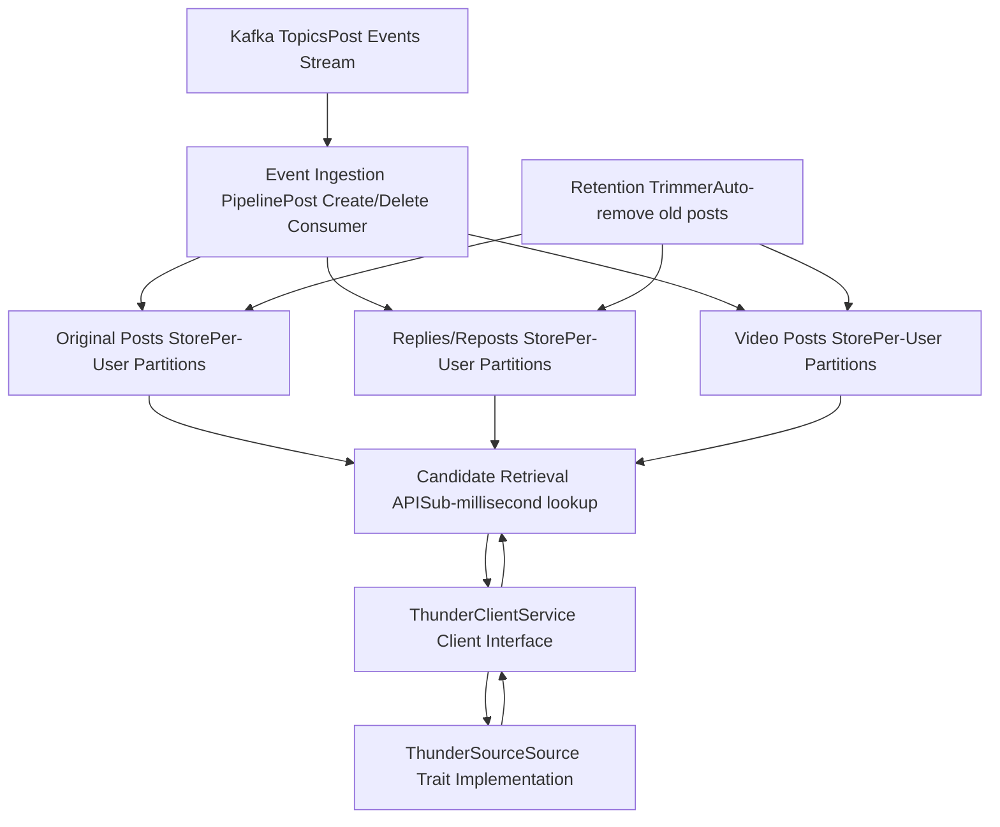
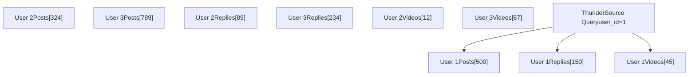
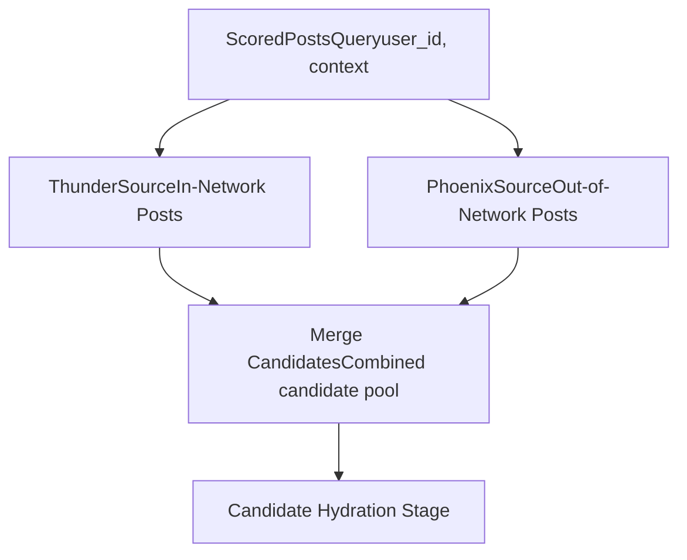

# Thunder Source

Relevant source files

-   [README.md](https://github.com/xai-org/x-algorithm/blob/aaa167b3/README.md?plain=1)

## Purpose and Scope

This page documents the Thunder system, which serves as the in-network candidate source for the Home Mixer pipeline. Thunder is a real-time, in-memory post store that maintains recent posts from all users and provides sub-millisecond retrieval of posts from accounts that a requesting user follows.

For information about the out-of-network candidate source, see [Phoenix Retrieval Source](/xai-org/x-algorithm/4.3.2-phoenix-retrieval-source). For the overall pipeline orchestration that consumes Thunder candidates, see [Phoenix Candidate Pipeline](/xai-org/x-algorithm/4.1-phoenix-candidate-pipeline).

## Overview

Thunder is a specialized in-memory data store optimized for retrieving recent posts from a user's followed accounts (in-network content). It operates as a continuously updated cache that:

1.  Consumes post create/delete events from a Kafka stream in real-time
2.  Maintains per-user partitioned stores containing recent posts
3.  Automatically trims posts older than the configured retention period
4.  Serves candidate posts to the Home Mixer pipeline with sub-millisecond latency

Thunder eliminates the need to query external databases for in-network content during timeline generation, significantly reducing p99 latency for the "For You" feed.

**Sources:** [README.md149-161](https://github.com/xai-org/x-algorithm/blob/aaa167b3/README.md?plain=1#L149-L161)

## System Architecture

**Diagram: Thunder Service Architecture and Integration**

This diagram shows Thunder's internal structure and how it integrates with the Home Mixer pipeline. The service maintains three distinct per-user stores, continuously updated via Kafka ingestion, and accessed by the pipeline through the `ThunderClient` abstraction.

**Sources:** [README.md149-161](https://github.com/xai-org/x-algorithm/blob/aaa167b3/README.md?plain=1#L149-L161)

## Kafka Ingestion Pipeline

Thunder maintains real-time state by consuming post events from Kafka. The ingestion pipeline processes two primary event types:

| Event Type | Action | Effect |
| --- | --- | --- |
| **Post Create** | Add new post | Insert post into appropriate per-user stores for all followers |
| **Post Delete** | Remove post | Remove post from all per-user stores where it appears |

The event-driven architecture ensures Thunder's view of the post corpus remains synchronized with the authoritative post store within seconds of any create or delete operation.

### Event Processing Flow

> **[Mermaid sequence]**
> *(图表结构无法解析)*

**Diagram: Kafka Event Processing Flow**

This sequence shows how Thunder transforms Kafka events into updates to its in-memory stores, maintaining a real-time view of the post corpus.

**Sources:** [README.md154-156](https://github.com/xai-org/x-algorithm/blob/aaa167b3/README.md?plain=1#L154-L156)

## Storage Model

Thunder organizes posts into three distinct per-user partitioned stores, optimizing for different content types and retrieval patterns:

### Store Types

| Store Name | Content Type | Purpose |
| --- | --- | --- |
| **Original Posts** | Top-level posts authored by followed users | Primary content from user's network |
| **Replies/Reposts** | Replies and reposts by followed users | Engagement content showing follower activity |
| **Video Posts** | Posts containing video media | Video-specific retrieval for video-heavy feeds |

### Per-User Partitioning

Each store is partitioned by viewing user ID, enabling efficient lookups:

**Diagram: Per-User Store Partitioning**

Each user's in-network content is stored in dedicated partitions, allowing Thunder to retrieve all relevant posts for a user in a single lookup without scanning other users' data.

**Sources:** [README.md156-157](https://github.com/xai-org/x-algorithm/blob/aaa167b3/README.md?plain=1#L156-L157)

### Retention and Trimming

Thunder automatically removes posts that exceed the configured retention period to bound memory usage. The trimmer process:

1.  Periodically scans each user partition
2.  Identifies posts older than the retention threshold (extracted from snowflake ID timestamps)
3.  Removes expired posts from the in-memory stores

This ensures Thunder maintains a rolling window of recent posts without unbounded memory growth.

**Sources:** [README.md159](https://github.com/xai-org/x-algorithm/blob/aaa167b3/README.md?plain=1#L159-L159)

## Candidate Retrieval

Thunder serves as a `Source` implementation in the candidate pipeline framework. The retrieval process follows this flow:

> **[Mermaid sequence]**
> *(图表结构无法解析)*

**Diagram: Thunder Candidate Retrieval Flow**

This sequence shows how the pipeline requests in-network candidates from Thunder through the client abstraction layer, with Thunder performing partition lookup and merging results from its multiple stores.

**Sources:** [README.md157-161](https://github.com/xai-org/x-algorithm/blob/aaa167b3/README.md?plain=1#L157-L161)

### Retrieval Performance Characteristics

| Metric | Typical Value | Explanation |
| --- | --- | --- |
| **Latency** | Sub-millisecond | In-memory lookup, no disk I/O |
| **Throughput** | High | Per-user partitioning enables parallel lookups |
| **Consistency** | Eventually consistent | Kafka lag typically <1 second |
| **Freshness** | Near real-time | Posts available within seconds of creation |

**Sources:** [README.md160-161](https://github.com/xai-org/x-algorithm/blob/aaa167b3/README.md?plain=1#L160-L161)

## Integration with Home Mixer

Thunder integrates into the Home Mixer pipeline as one of multiple candidate sources alongside Phoenix Retrieval. The integration pattern follows the framework's `Source` trait:

### Source Trait Implementation

The `ThunderSource` struct implements the `Source<ScoredPostsQuery, PostCandidate>` trait, making it a pluggable component in the pipeline. Key responsibilities:

1.  **Query Interpretation**: Extract user ID and following list from `ScoredPostsQuery`
2.  **Client Interaction**: Call `ThunderClient` to fetch in-network posts
3.  **Candidate Construction**: Transform Thunder's response into `PostCandidate` objects
4.  **Source Tagging**: Mark candidates with `source = SourceType::InNetwork`

### Parallel Source Execution

Thunder runs in parallel with Phoenix Retrieval during the candidate sourcing phase:

**Diagram: Thunder in Multi-Source Pipeline**

Thunder executes in parallel with Phoenix, with both sources contributing candidates to a merged pool that flows through subsequent pipeline stages.

**Sources:** [README.md62-68](https://github.com/xai-org/x-algorithm/blob/aaa167b3/README.md?plain=1#L62-L68) [README.md210-213](https://github.com/xai-org/x-algorithm/blob/aaa167b3/README.md?plain=1#L210-L213)

### Candidate Source Metadata

Thunder-sourced candidates carry metadata distinguishing them from out-of-network candidates:

| Field | Value | Purpose |
| --- | --- | --- |
| `source` | `SourceType::InNetwork` | Identify source for scoring and filtering |
| `in_network` | `true` | Flag for in-network specific logic |
| `author_id` | Set from Thunder | Author must be in viewer's following list |

This metadata enables downstream pipeline stages to apply different filtering rules and scoring strategies to in-network versus out-of-network content.

**Sources:** [README.md27-30](https://github.com/xai-org/x-algorithm/blob/aaa167b3/README.md?plain=1#L27-L30)

## Summary

Thunder provides the Home Mixer pipeline with fast, reliable access to in-network content through:

-   **Real-time Kafka ingestion** maintaining up-to-date post stores
-   **Per-user partitioned storage** enabling efficient single-user lookups
-   **Multiple store types** optimizing for different content categories
-   **Sub-millisecond retrieval** eliminating database query overhead
-   **Automatic retention management** bounding memory usage

The system's event-driven architecture and in-memory storage model are critical to achieving the low-latency requirements of the "For You" feed generation pipeline.

**Sources:** [README.md149-161](https://github.com/xai-org/x-algorithm/blob/aaa167b3/README.md?plain=1#L149-L161)
